# DocuFlow-AI Project - 软件设计文档
生成时间: 2026-01-26 16:45:13

## 目录
1. [概述说明](#1-概述说明)
   - 1.1 [术语与缩略词](#11-术语与缩略词)
2. [系统设计](#2-系统设计)
3. [模块设计](#3-模块设计)
   - 3.1 [三代](#module-1)
   - 3.2 [行业钱包](#module-2)
   - 3.3 [账户系统](#module-3)
   - 3.4 [清结算](#module-4)
   - 3.5 [电子签约平台](#module-5)
   - 3.6 [认证系统](#module-6)
   - 3.7 [计费中台](#module-7)
   - 3.8 [对账单系统](#module-8)
   - 3.9 [业务核心](#module-9)
   - 3.10 [账务核心](#module-10)
   - 3.11 [交易系统](#module-11)
   - 3.12 [代付系统](#module-12)
   - 3.13 [钱包APP/商服平台](#module-13)
   - 3.14 [天财](#module-14)
4. [接口设计](#4-接口设计)
5. [数据库设计](#5-数据库设计)

---
# 1 概述说明

## 1.1 术语与缩略词


## 角色

- **天财**: 提出分账需求的合作方或平台，负责发起开户、关系绑定、分账等业务指令。
- **门店**: 品牌或总部下属的经营单位，作为收单商户可开立天财收款账户，在分账业务中可作为付方或收方。
- **总部** (别名: 品牌, 总店): 品牌方或总店，作为收单商户可开立天财收款账户，在分账业务中通常作为发起方和付方。
- **接收方** (别名: 入账方): 分账资金的接收者，可以是门店或非收单商户/个人，对应开立天财收款账户或天财接收方账户。
- **三代**: 拉卡拉内部系统，负责商户入网审核、开户调用、关系绑定接口提供及计费配置等核心业务处理。
- **行业钱包** (别名: 分账核心): 拉卡拉内部系统，负责天财专用账户的开户处理、关系绑定校验、分账请求接收与处理、数据同步等。
- **账户系统**: 拉卡拉内部系统，负责底层账户的创建、升级、余额管理、转账扣款及打特殊标记。
- **清结算**: 拉卡拉内部系统，负责手续费清分、结算处理、退货账户查询及专用账户冻结支持。
- **电子签约平台** (别名: 电子签章系统): 拉卡拉内部系统，负责配置短信和H5模板，调用认证系统，管理协议签署并留存全证据链数据。
- **认证系统**: 拉卡拉内部系统，提供打款验证和人脸验证的接口，用于关系绑定时的身份核验。
- **计费中台**: 拉卡拉内部系统，提供转账计费能力，生成计费流水并处理手续费清分。
- **对账单系统**: 拉卡拉内部系统，负责生成天财机构层的各类账户和交易维度对账单。
- **业务核心**: 拉卡拉内部系统，接收交易数据并为对账单系统提供天财分账交易数据。

## 业务实体

- **天财专用账户**: 为满足天财分账需求而开立的专用账户类型，包括天财收款账户和天财接收方账户，在账户系统底层有特殊标记。
- **天财收款账户**: 收单商户开立的专用账户，类型为行业钱包，用于收款、分账、提现，并可向绑定的其他天财收款账户或天财接收方账户转账。
- **天财接收方账户**: 非收单商户或个人开立的专用账户，用于接收分账资金和提现，仅具备提现能力。
- **门店分账** (别名: 归集): 业务场景之一，指门店向总部缴纳管理费的资金归集流程。
- **会员结算**: 业务场景之一，指总部将消费资金分账结算给门店的流程。
- **批量付款** (别名: 批付): 业务场景之一，指总部向多个接收方（如供应商、员工）发起批量转付/分账的流程。
- **天财分账** (别名: 转账): 钱包系统定义的新交易类型，指在天财专用账户之间进行的转账或分账操作。
- **待结算账户** (别名: 01待结算账户): 收单商户的01类型账户，用于暂存未结算的交易资金。
- **退货账户** (别名: 04退货账户): 收单商户的04类型账户，用于处理退货资金。
- **手续费承担方**: 指定由付方或收方承担分账交易产生的手续费，由天财接口上传。

## 流程

- **关系绑定** (别名: 绑定关系, 签约与认证): 在分账业务中，建立付方与收方之间授权关系的过程，需完成协议签署和身份认证。
- **归集授权**: 关系绑定的一种具体场景，特指门店授权总部对其资金进行归集。
- **开通付款**: 在批量付款和会员结算场景下，付方（总部/门店）需要额外完成的签约认证流程，以开通付款能力。

## 技术术语

- **打款验证**: 一种身份认证方式，通过向目标银行卡打小额随机金额并验证回填信息来完成。
- **人脸验证**: 一种身份认证方式，通过比对姓名、身份证和人脸信息来完成。
- **主动结算**: 一种结算模式，结算资金直接进入商户指定的结算账户（如天财收款账户）。
- **被动结算**: 一种结算模式，结算资金先进入待结算账户，需商户发起指令才可结算。
- **机构号**: 由三代运营分配给天财的平台标识，用于区分业务来源和权限控制。

---
# 2 系统设计
## 2.1 系统结构
本系统采用分层架构，旨在为天财分账业务提供从外部接入、业务处理到底层账户操作的全链路支持。系统以三代作为核心接入与管控层，以行业钱包（分账核心）作为业务处理中枢，通过调用或协同多个内部专业系统（如账户系统、电子签约平台、认证系统等）完成开户、关系绑定、分账、结算等核心业务流程。整体架构遵循职责分离原则，确保各系统专注于其核心能力。

```mermaid
graph TB
    subgraph "外部接入层"
        T[天财合作方]
        W[钱包APP/商服平台]
    end

    subgraph "业务接入与管控层"
        G[三代系统]
    end

    subgraph "业务处理层"
        HW[行业钱包<br/>(分账核心)]
        ES[电子签约平台]
        AS[认证系统]
        FS[计费中台]
        TS[交易系统]
        BS[代付系统]
        BC[业务核心]
    end

    subgraph "核心服务层"
        ACS[账户系统]
        CL[清结算]
        AC[账务核心]
    end

    subgraph "数据与报表层"
        SS[对账单系统]
    end

    subgraph "基础服务层"
        P[交易系统<br/>(收单)]
    end

    T --> G
    W --> G
    G --> HW
    G --> ES
    G --> FS
    HW --> ACS
    HW --> ES
    HW --> AS
    HW --> FS
    HW --> CL
    HW --> BC
    HW --> SS
    ES --> AS
    TS --> HW
    TS --> ACS
    TS --> FS
    TS --> CL
    TS --> BC
    BS --> HW
    BS --> ES
    BS --> ACS
    BS --> FS
    BS --> CL
    BS --> BC
    ACS --> CL
    FS --> CL
    BC --> SS
    P --> BC
    ACS --> AC
```

## 2.2 功能结构
系统功能围绕天财分账业务的核心流程进行组织，主要划分为商户与账户管理、关系绑定与认证、分账交易处理、资金结算与清分、以及数据服务五大功能域。

```mermaid
graph TD
    Root[天财分账系统功能]

    Root --> A[商户与账户管理]
    Root --> B[关系绑定与认证]
    Root --> C[分账交易处理]
    Root --> D[资金结算与清分]
    Root --> E[数据服务]

    A --> A1[商户入网审核]
    A --> A2[账户开户]
    A --> A3[账户信息维护]

    B --> B1[协议签署]
    B --> B2[身份认证<br/>(打款/人脸)]
    B --> B3[绑定关系管理]

    C --> C1[分账指令处理]
    C --> C2[批量付款处理]
    C --> C3[手续费计算]
    C --> C4[交易状态管理]

    D --> D1[主动/被动结算]
    D --> D2[手续费清分]
    D --> D3[资金划转]

    E --> E1[交易数据提供]
    E --> E2[对账单生成]
```

## 2.3 网络拓扑图
TBD

## 2.4 数据流转
数据在系统各模块间按业务流程定向流转。核心数据流包括：商户/账户信息流、关系绑定流、分账交易流、资金流及对账数据流。天财通过三代发起业务请求，数据经行业钱包协调，在账户系统、认证系统等模块间处理，最终由对账单系统聚合输出。

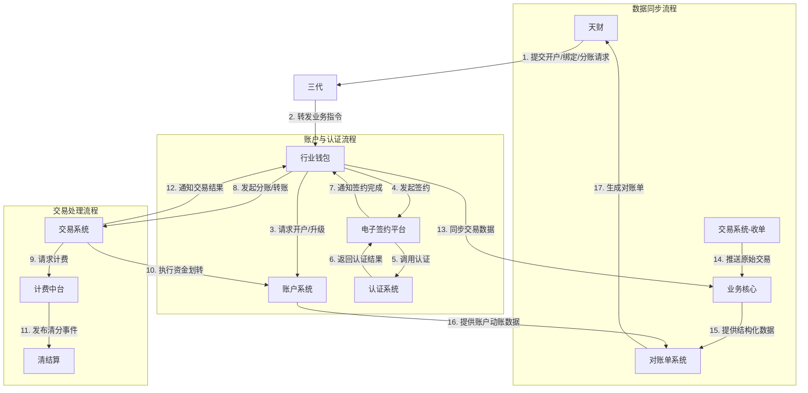
```mermaid
flowchart TD
    T[天财] -->|1. 提交开户/绑定/分账请求| G[三代]
    G -->|2. 转发业务指令| HW[行业钱包]
    
    subgraph 账户与认证流程
        HW -->|3. 请求开户/升级| ACS[账户系统]
        HW -->|4. 发起签约| ES[电子签约平台]
        ES -->|5. 调用认证| AS[认证系统]
        AS -->|6. 返回认证结果| ES
        ES -->|7. 通知签约完成| HW
    end

    subgraph 交易处理流程
        HW -->|8. 发起分账/转账| TS[交易系统]
        TS -->|9. 请求计费| FS[计费中台]
        TS -->|10. 执行资金划转| ACS
        FS -->|11. 发布清分事件| CL[清结算]
        TS -->|12. 通知交易结果| HW
    end

    subgraph 数据同步流程
        HW -->|13. 同步交易数据| BC[业务核心]
        P[交易系统-收单] -->|14. 推送原始交易| BC
        BC -->|15. 提供结构化数据| SS[对账单系统]
        ACS -->|16. 提供账户动账数据| SS
        SS -->|17. 生成对账单| T
    end
```

## 2.5 系统模块交互关系
模块间主要通过同步API调用和异步事件进行交互。三代是主要的外部请求入口和协调者。行业钱包是核心的业务处理器，与最多数量的下游系统交互。账户系统、电子签约平台、认证系统等提供原子化的专业服务。

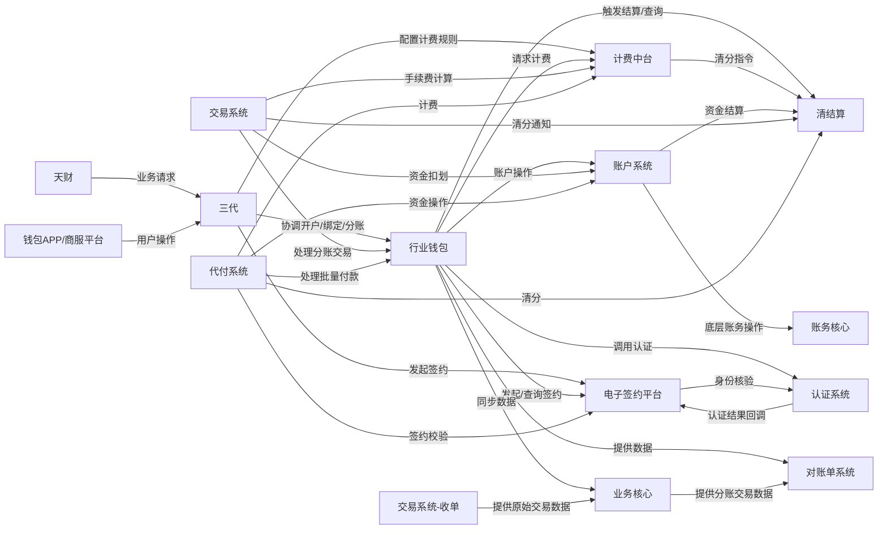
```mermaid
graph LR
    G[三代]
    HW[行业钱包]
    ACS[账户系统]
    ES[电子签约平台]
    AS[认证系统]
    FS[计费中台]
    CL[清结算]
    SS[对账单系统]
    BC[业务核心]
    TS[交易系统]
    BS[代付系统]
    AC[账务核心]
    P[交易系统-收单]
    W[钱包APP/商服平台]
    T[天财]

    T -- 业务请求 --> G
    W -- 用户操作 --> G
    
    G -- 协调开户/绑定/分账 --> HW
    G -- 发起签约 --> ES
    G -- 配置计费规则 --> FS

    HW -- 账户操作 --> ACS
    HW -- 发起/查询签约 --> ES
    HW -- 调用认证 --> AS
    HW -- 请求计费 --> FS
    HW -- 触发结算/查询 --> CL
    HW -- 同步数据 --> BC
    HW -- 提供数据 --> SS

    ES -- 身份核验 --> AS
    AS -- 认证结果回调 --> ES

    FS -- 清分指令 --> CL
    ACS -- 资金结算 --> CL
    ACS -- 底层账务操作 --> AC

    BC -- 提供分账交易数据 --> SS
    P -- 提供原始交易数据 --> BC

    TS -- 处理分账交易 --> HW
    TS -- 资金扣划 --> ACS
    TS -- 手续费计算 --> FS
    TS -- 清分通知 --> CL

    BS -- 处理批量付款 --> HW
    BS -- 签约校验 --> ES
    BS -- 资金操作 --> ACS
    BS -- 计费 --> FS
    BS -- 清分 --> CL
```
---
# 3 模块设计

<a id="module-1"></a>

## 3.1 三代


### 1. 概述
- **目的与范围**: 本模块是拉卡拉内部核心业务处理系统，作为天财业务与内部系统交互的关键枢纽。核心职责包括：接收并审核天财发起的商户入网请求；作为协调者，调用行业钱包完成天财专用账户的开户流程；为行业钱包提供关系绑定所需的业务接口；以及管理分账业务的计费规则配置。本模块不直接处理底层账户创建或关系绑定的具体校验逻辑，而是负责业务流程的编排与核心业务数据的维护。

### 2. 接口设计
- **API端点 (REST/GraphQL)**: TBD
    - 商户入网审核接口
    - 计费配置管理接口
    - 业务状态查询接口
- **请求/响应结构**: TBD
- **发布/消费的事件**: TBD
    - 发布事件：商户审核通过事件、计费规则变更事件。
    - 消费事件：TBD。

### 3. 数据模型
- **表/集合**: TBD
    - 商户信息表：存储天财提交的商户入网资料及审核状态。
    - 计费配置表：存储为不同天财或业务场景配置的分账手续费规则。
    - 机构信息表：存储分配给天财的机构号及其权限范围。
- **关键字段**: TBD
    - 商户信息表：商户ID、机构号、商户类型（总部/门店）、审核状态、资质文件URL、创建时间。
    - 计费配置表：配置ID、机构号、业务场景、手续费承担方（付方/收方）、费率、生效时间。
- **与其他模块的关系**: 本模块维护的商户审核状态和计费配置是行业钱包执行开户、关系绑定及分账计费的基础。本模块通过接口为行业钱包提供关系绑定的业务入口。

### 4. 业务逻辑
- **核心工作流/算法**:
    1.  **商户入网审核流程**：接收天财的商户入网请求，校验请求基础格式与必填字段。根据预设规则（如资质文件完整性、黑名单检查）进行自动化初审，对于需人工复核的案例，流转至运营后台。审核结果（通过/拒绝）更新至数据库，并通知相关系统。
    2.  **开户调用协调流程**：在商户审核通过后，本模块将开户请求转发至行业钱包模块，由行业钱包负责具体的开户逻辑并与账户系统交互。本模块记录开户请求的关联关系并跟踪最终状态。
    3.  **关系绑定接口提供**：本模块提供一个标准的业务接口，供行业钱包在需要执行关系绑定的业务逻辑时调用。此接口负责校验业务层面的绑定关系合法性（例如，根据机构号校验付方是否有权绑定该收方），然后调用电子签约平台发起签约认证流程。
    4.  **计费配置流程**：运营人员可通过管理界面为特定天财机构配置分账业务的手续费规则（包括业务场景、承担方、费率）。配置生效后，本模块将同步给计费中台，并在行业钱包发起分账时提供计费依据。
- **业务规则与验证**:
    - 商户入网审核：校验商户资质文件的必要性与格式；同一商户在不同天财平台下的唯一性校验。
    - 关系绑定校验：校验绑定双方（付方与收方）是否属于同一机构号下；校验绑定的业务场景（如归集、开通付款）是否被允许。
    - 计费配置：校验同一机构号下相同业务场景的计费规则不能冲突（如生效时间重叠）。
- **关键边界情况处理**:
    - 审核过程中资质文件缺失：返回明确错误，要求天财补充。
    - 开户调用后行业钱包返回处理中状态：本模块异步轮询或接收回调以更新最终状态。
    - 计费配置同步至计费中台失败：触发告警，并重试同步机制。

### 5. 时序图

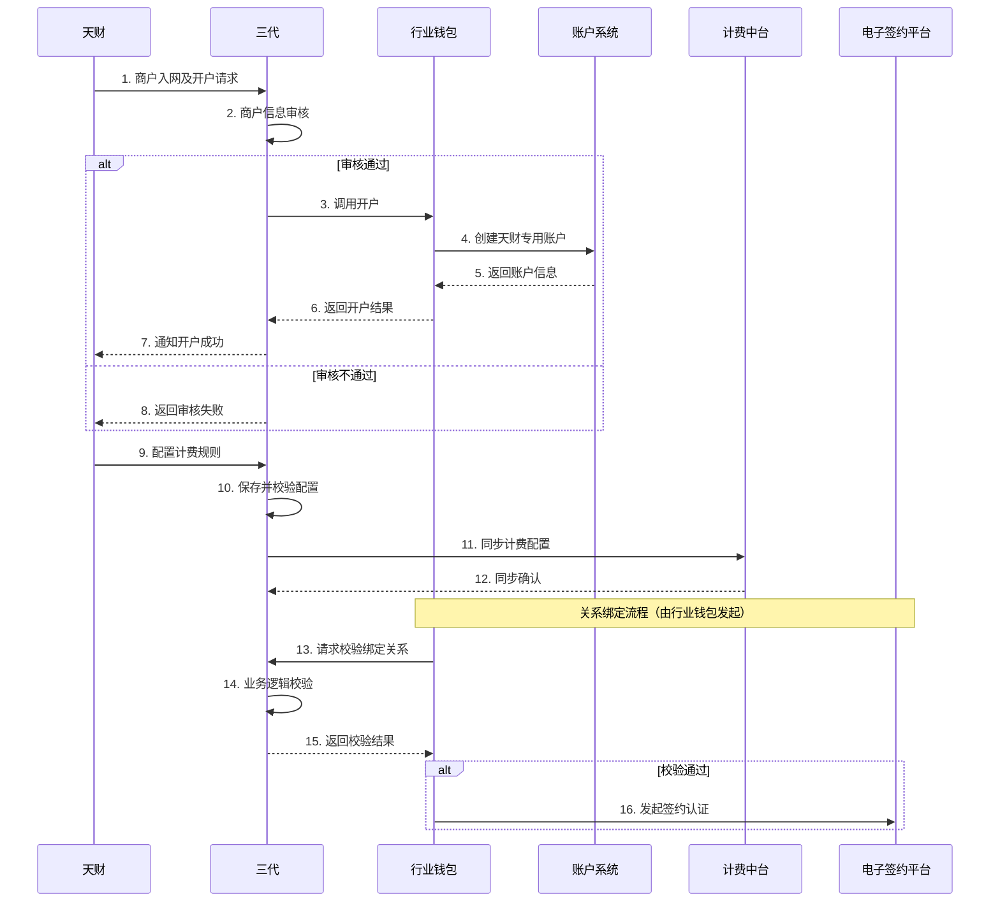
```mermaid
sequenceDiagram
    participant 天财
    participant 三代
    participant 行业钱包
    participant 账户系统
    participant 计费中台
    participant 电子签约平台

    天财->>三代: 1. 商户入网及开户请求
    三代->>三代: 2. 商户信息审核
    alt 审核通过
        三代->>行业钱包: 3. 调用开户
        行业钱包->>账户系统: 4. 创建天财专用账户
        账户系统-->>行业钱包: 5. 返回账户信息
        行业钱包-->>三代: 6. 返回开户结果
        三代-->>天财: 7. 通知开户成功
    else 审核不通过
        三代-->>天财: 8. 返回审核失败
    end

    天财->>三代: 9. 配置计费规则
    三代->>三代: 10. 保存并校验配置
    三代->>计费中台: 11. 同步计费配置
    计费中台-->>三代: 12. 同步确认

    Note over 行业钱包,电子签约平台: 关系绑定流程（由行业钱包发起）
    行业钱包->>三代: 13. 请求校验绑定关系
    三代->>三代: 14. 业务逻辑校验
    三代-->>行业钱包: 15. 返回校验结果
    alt 校验通过
        行业钱包->>电子签约平台: 16. 发起签约认证
    end
```

### 6. 错误处理
- **预期错误情况**:
    1.  商户资质不全或无效。
    2.  下游系统（行业钱包、计费中台）调用失败或超时。
    3.  关系绑定请求中的业务参数非法（如双方无关联）。
    4.  计费配置数据冲突或同步失败。
- **处理策略**:
    - 输入校验错误：立即失败，向调用方返回具体的业务错误码和描述。
    - 下游调用失败：采用指数退避策略进行重试（如对开户调用重试3次）。对计费中台等非实时核心依赖，配置异步重试队列。若持续失败，触发熔断机制，并产生系统告警。
    - 状态一致性：对于开户等异步流程，通过持久化状态机和定期对账机制保证最终一致性。
    - 日志记录：所有业务操作、外部调用及异常均记录结构化日志，便于追踪。

### 7. 依赖关系
- **上游模块**: 天财（业务请求源）。
- **下游模块**:
    - 行业钱包：委托其处理开户、关系绑定的具体执行。
    - 计费中台：同步计费配置信息。
    - 电子签约平台：在关系绑定流程中，被行业钱包调用以完成签约认证（本模块不直接依赖，但流程涉及）。
- **关键依赖说明**: 本模块强依赖于行业钱包以完成核心业务操作，需确保双方接口契约的稳定性和故障隔离。

<a id="module-2"></a>

## 3.2 行业钱包


### 1. 概述
- **目的与范围**：行业钱包（分账核心）是拉卡拉内部负责天财分账业务的核心处理系统。其核心职责包括：处理天财专用账户（收款账户、接收方账户）的开户请求；执行关系绑定的校验与处理；接收并处理来自天财的分账请求；管理账户间的转账与分账操作；以及与其他内部系统进行必要的数据同步。其边界止于调用底层系统（如账户系统、计费中台）的具体功能接口来完成资金操作、清结算、电子签约等，不直接对外部天财提供服务。

### 2. 接口设计
- **API端点 (REST/GraphQL)**：TBD
- **请求/响应结构**：TBD
- **发布/消费的事件**：
    - **消费事件**：TBD（例如，接收来自三代转发的业务请求事件）
    - **发布事件**：TBD（例如，发布分账交易完成事件，供对账单系统和业务核心消费）

### 3. 数据模型
- **表/集合**：
    - `wallet_account`：天财专用账户信息表。
    - `binding_relationship`：付方与收方绑定关系表。
    - `split_order`：分账交易订单表。
    - `idempotent_record`：幂等性记录表。
- **关键字段**：
    - `wallet_account` 表：`account_id`（账户ID，关联账户系统），`account_type`（账户类型：收款账户/接收方账户），`merchant_id`（商户ID），`status`（状态：正常/冻结/注销），`institution_no`（机构号）。
    - `binding_relationship` 表：`payer_account_id`（付方账户ID），`payee_account_id`（收方账户ID），`binding_type`（绑定类型：归集授权/开通付款），`auth_status`（认证状态），`contract_id`（电子协议ID）。
    - `split_order` 表：`order_no`（订单号），`payer_account_id`，`payee_account_id`，`amount`（金额），`fee`（手续费），`fee_bearer`（手续费承担方），`status`（订单状态），`idempotent_key`（幂等键）。
    - `idempotent_record` 表：`idempotent_key`（幂等键），`business_type`（业务类型），`result`（处理结果），`created_at`（创建时间）。
- **与其他模块的关系**：
    - 依赖账户系统：通过 `account_id` 关联底层账户实体。
    - 依赖三代系统：通过 `institution_no` 关联商户和业务来源。
    - 依赖电子签约平台：通过 `contract_id` 关联签署的协议。
    - 数据同步至对账单系统和业务核心：通过 `split_order` 表提供分账交易数据。

### 4. 业务逻辑
- **核心工作流/算法**：
    1.  **开户处理**：
        - 接收三代转发的开户请求（含商户信息、账户类型、机构号）。
        - 调用账户系统接口，请求开立带有“天财专用账户”标记的账户。
        - 账户系统返回账户ID后，在本地 `wallet_account` 表创建记录。
        - 返回开户结果给三代。
    2.  **关系绑定校验与处理**：
        - 接收三代发起的绑定请求（如归集授权、开通付款）。
        - 调用电子签约平台接口，完成协议签署流程，获取 `contract_id`。
        - 根据绑定场景，调用认证系统接口完成打款验证或人脸验证。
        - 验证通过后，在 `binding_relationship` 表中创建或更新绑定关系记录。
        - 返回绑定结果给三代。
    3.  **分账请求处理**：
        - 接收天财通过三代发起的门店分账、会员结算或批量付款请求。
        - **校验**：检查付方与收方在 `binding_relationship` 表中是否存在有效绑定；查询 `wallet_account` 表校验双方账户状态是否为“正常”；调用账户系统接口查询付方账户余额。
        - **手续费计算**：调用计费中台接口，传入交易金额等信息，计算手续费。
        - **手续费承担方处理**：根据请求中的 `fee_bearer` 字段（付方/收方），确定手续费实际扣款账户。
        - **资金划转**：调用账户系统转账接口，执行一笔或多笔扣款（本金及手续费）。
        - **记录与同步**：在 `split_order` 表记录交易；异步将交易数据同步至对账单系统和业务核心。
        - 返回分账处理结果给三代。
    4.  **数据同步**：通过发布事件或调用接口，将 `split_order` 表中的分账交易结果数据同步至对账单系统和业务核心。
    5.  **退货与清结算处理**：当清结算系统发起退货账户查询或专用账户冻结请求时，行业钱包根据 `wallet_account` 表信息进行响应或执行状态更新。
- **业务规则与验证**：
    - 分账前必须完成关系绑定（`binding_relationship.auth_status` 为“已认证”）。
    - 付款方账户必须为天财收款账户（`wallet_account.account_type = ‘收款账户’`）。
    - 收款方账户必须为天财收款账户或天财接收方账户。
    - 需校验账户状态为“正常”，且付方账户余额充足。
    - 需根据天财上传的 `fee_bearer` 字段，确定手续费扣款账户。
    - 关键操作（如创建订单、资金扣款）需使用乐观锁或数据库事务保证一致性。
- **关键边界情况处理**：
    - **分布式事务与冲正**：分账过程中若调用账户系统或计费中台失败，采用Saga模式进行补偿。例如，已扣款但后续步骤失败，则发起一笔反向冲正交易。
    - **账户异常**：接收方账户已注销或冻结，分账请求在校验阶段被拒绝。
    - **幂等性**：所有写操作入口检查 `idempotent_record` 表，防止重复处理。
    - **并发控制**：对账户余额更新等操作使用乐观锁。

### 5. 时序图

#### 5.1 开户处理时序图
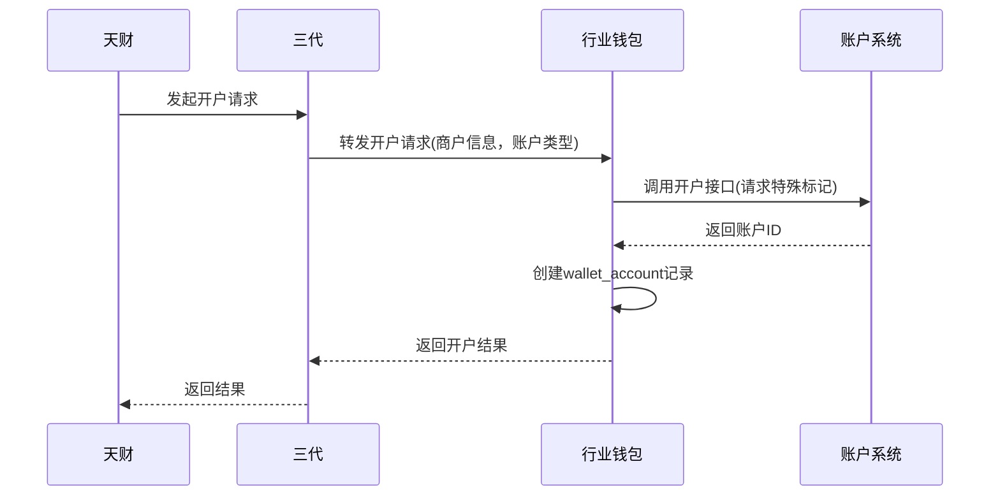
```mermaid
sequenceDiagram
    participant T as 天财
    participant G as 三代
    participant W as 行业钱包
    participant A as 账户系统

    T->>G: 发起开户请求
    G->>W: 转发开户请求(商户信息，账户类型)
    W->>A: 调用开户接口(请求特殊标记)
    A-->>W: 返回账户ID
    W->>W: 创建wallet_account记录
    W-->>G: 返回开户结果
    G-->>T: 返回结果
```

#### 5.2 关系绑定处理时序图
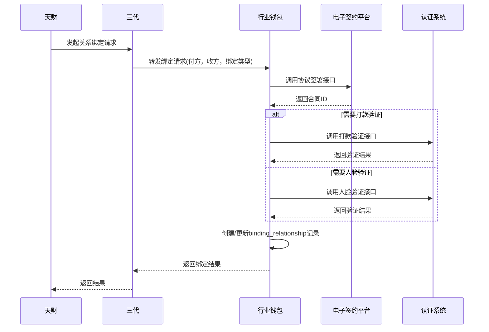
```mermaid
sequenceDiagram
    participant T as 天财
    participant G as 三代
    participant W as 行业钱包
    participant E as 电子签约平台
    participant V as 认证系统

    T->>G: 发起关系绑定请求
    G->>W: 转发绑定请求(付方，收方，绑定类型)
    W->>E: 调用协议签署接口
    E-->>W: 返回合同ID
    alt 需要打款验证
        W->>V: 调用打款验证接口
        V-->>W: 返回验证结果
    else 需要人脸验证
        W->>V: 调用人脸验证接口
        V-->>W: 返回验证结果
    end
    W->>W: 创建/更新binding_relationship记录
    W-->>G: 返回绑定结果
    G-->>T: 返回结果
```

#### 5.3 分账请求处理时序图
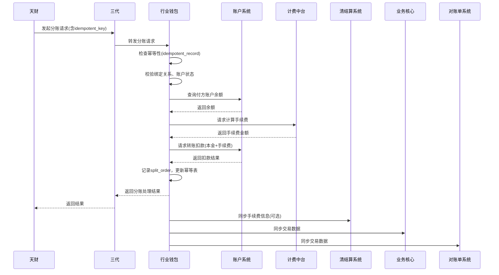
```mermaid
sequenceDiagram
    participant T as 天财
    participant G as 三代
    participant W as 行业钱包
    participant A as 账户系统
    participant C as 计费中台
    participant S as 清结算系统
    participant B as 业务核心
    participant D as 对账单系统

    T->>G: 发起分账请求(含idempotent_key)
    G->>W: 转发分账请求
    W->>W: 检查幂等性(idempotent_record)
    W->>W: 校验绑定关系、账户状态
    W->>A: 查询付方账户余额
    A-->>W: 返回余额
    W->>C: 请求计算手续费
    C-->>W: 返回手续费金额
    W->>A: 请求转账扣款(本金+手续费)
    A-->>W: 返回扣款结果
    W->>W: 记录split_order，更新幂等表
    W-->>G: 返回分账处理结果
    G-->>T: 返回结果
    W->>S: 同步手续费信息(可选)
    W->>B: 同步交易数据
    W->>D: 同步交易数据
```

### 6. 错误处理
- **预期错误情况**：
    - 账户不存在或状态异常。
    - 付方与收方未建立有效绑定关系。
    - 付方账户余额不足。
    - 下游系统（账户系统、计费中台、清结算等）服务不可用或超时。
    - 网络或数据库异常。
    - 重复请求（幂等性冲突）。
- **处理策略**：
    - **业务校验失败**：立即返回明确的错误码和描述（如“余额不足”、“绑定关系不存在”）。
    - **下游调用失败**：
        - 对资金类操作（调用账户系统）采用Saga模式，设计明确的补偿（冲正）接口，确保最终一致性。
        - 对非资金类查询操作，配置有限次数的重试机制（如最多3次，指数退避）。
        - 所有失败均记录详细日志和告警，用于对账和人工干预。
    - **幂等性**：所有业务请求需携带唯一幂等键（`idempotent_key`），在 `idempotent_record` 表中记录处理状态，确保请求仅被处理一次。
    - **事务边界**：本地数据库操作使用事务保证 `split_order`、`idempotent_record` 等表的一致性。跨系统操作通过上述Saga和补偿逻辑保证。

### 7. 依赖关系
- **上游模块**：
    - **三代**：提供商户入网信息、转发天财的业务请求（开户、绑定、分账）。
    - **账户系统**：提供底层账户的创建、查询、余额管理、转账扣款能力。
    - **电子签约平台**：提供协议签署能力，用于关系绑定。
    - **认证系统**：提供打款验证和人脸验证能力，用于关系绑定。
    - **计费中台**：提供转账手续费计算能力。
    - **清结算系统**：提供手续费清分、结算处理、退货账户查询及专用账户冻结支持。
- **下游模块**：
    - **对账单系统**：接收行业钱包同步的分账交易数据，用于生成对账单。
    - **业务核心**：接收行业钱包同步的分账交易数据。

<a id="module-3"></a>

## 3.3 账户系统


### 1. 概述
- **目的与范围**: 本模块是拉卡拉内部核心系统之一，负责为天财分账业务提供底层账户支持。其核心职责包括：根据指令创建天财专用账户（包括天财收款账户和天财接收方账户），对账户进行升级操作，管理账户余额，执行账户间的转账扣款，以及对天财专用账户打特殊标记。其边界止于账户的底层创建、记账和标记，不涉及上层的业务逻辑（如关系绑定、分账规则等）。本模块直接服务于行业钱包（分账核心），由行业钱包调用以执行业务操作。

### 2. 接口设计
- **API端点 (REST/GraphQL)**:
    - `POST /v1/accounts`: 创建账户。接收行业钱包的指令，创建天财专用账户。
    - `POST /v1/accounts/{accountId}/upgrade`: 账户升级。将普通账户升级为天财专用账户。
    - `POST /v1/transfers`: 执行转账。处理账户间的资金划转。
    - `GET /v1/accounts/{accountId}/balance`: 查询账户余额。
    - `POST /v1/accounts/{accountId}/freeze`: 冻结账户。
    - `POST /v1/accounts/{accountId}/unfreeze`: 解冻账户。
- **请求/响应结构**:
    - 创建账户请求：包含账户类型（收款/接收方）、所属机构号、关联商户/个人标识等。
    - 创建账户响应：返回账户ID、状态、创建时间。
    - 转账请求：包含付方账户ID、收方账户ID、金额、业务流水号。
    - 转账响应：返回交易流水号、状态、处理时间。
    - 通用响应：包含状态码、消息、业务数据。
- **发布/消费的事件**:
    - 发布事件：`AccountCreated`（账户创建成功）、`AccountUpgraded`（账户升级成功）、`TransferCompleted`（转账完成）、`AccountFrozen`（账户冻结）、`AccountUnfrozen`（账户解冻）。
    - 消费事件：TBD。

### 3. 数据模型
- **表/集合**:
    - `account`: 账户主表。
    - `account_balance`: 账户余额表。
    - `transaction_ledger`: 交易流水表。
    - `account_freeze_record`: 账户冻结记录表。
- **关键字段**:
    - `account`表: `account_id` (主键), `account_type` (账户类型), `merchant_id` (商户标识), `person_id` (个人标识), `institution_code` (机构号), `is_tiancai_special` (天财专用标记), `status` (状态: 有效/冻结/注销), `created_at`, `updated_at`。
    - `account_balance`表: `id` (主键), `account_id` (外键), `balance` (可用余额), `frozen_balance` (冻结余额), `version` (版本号，用于乐观锁)。
    - `transaction_ledger`表: `transaction_id` (主键), `from_account_id`, `to_account_id`, `amount`, `biz_serial_no` (业务流水号，用于幂等), `status`, `created_at`。
    - `account_freeze_record`表: `id` (主键), `account_id`, `freeze_type`, `reason`, `operator`, `created_at`。
- **与其他模块的关系**: 本模块存储的账户信息是上层业务（如行业钱包、清结算）操作的基础实体。账户的特殊标记（如天财专用账户标识）由本模块维护，供其他系统查询和识别。

### 4. 业务逻辑
- **核心工作流/算法**:
    1.  **开户处理**: 接收行业钱包的开户请求，创建底层账户实体，根据请求类型（收款账户/接收方账户）设置相应的账户属性，并打上“天财专用账户”特殊标记。
    2.  **账户升级**: 根据行业钱包的指令，对已有账户进行升级操作（例如，从普通账户升级为天财专用账户），更新账户标记。
    3.  **余额管理**: 提供账户余额的查询、冻结、解冻功能。支持清结算系统对专用账户进行冻结。
    4.  **转账扣款**: 执行账户间的资金划转，确保原子性操作。处理分账请求时，从付方账户扣款，并计入收方账户。
- **业务规则与验证**:
    - 账户创建和操作需校验账户状态（如是否冻结、是否有效）。
    - 转账操作需校验付方账户余额是否充足。
    - 天财专用账户需被打上系统约定的特殊标记。
    - 所有写操作（转账、冻结、开户）需支持幂等性，通过业务流水号（`biz_serial_no`）或请求ID实现。
- **关键边界情况处理**:
    - **并发转账**: 使用数据库乐观锁（`account_balance.version`）或悲观锁（`SELECT FOR UPDATE`）保证余额扣减的一致性。
    - **操作失败回滚**: 在数据库事务内执行账户创建、余额变更等操作，失败时自动回滚。对于涉及外部调用的复杂操作，记录操作日志，通过补偿机制（如定时任务）处理异常状态。
    - **清结算冻结请求**: 接收清结算系统的冻结/解冻请求，校验权限后执行，并记录操作日志。

### 5. 时序图
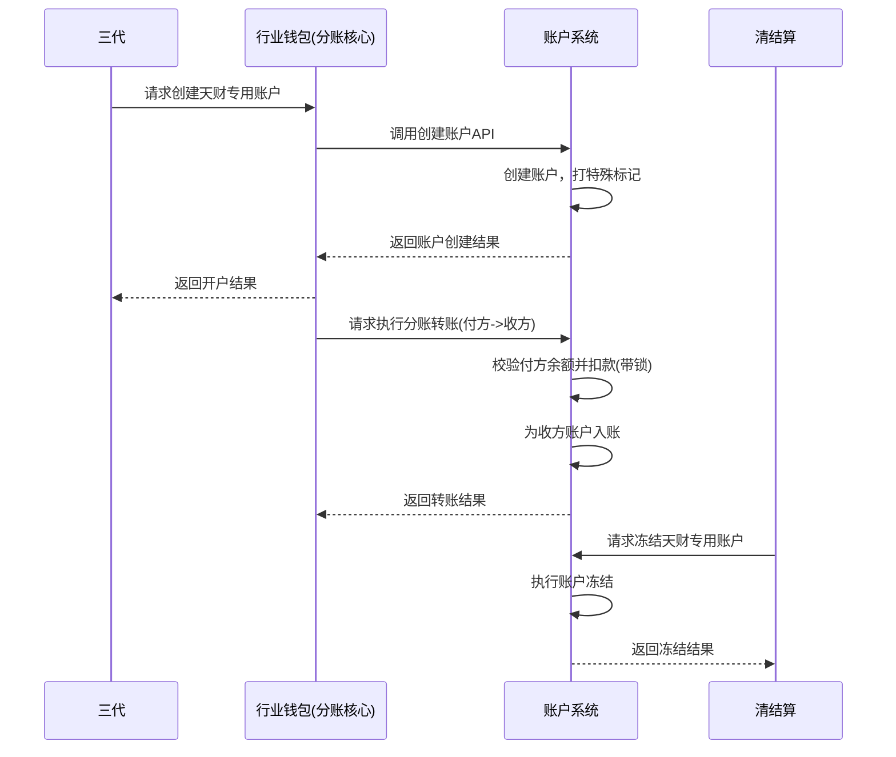
```mermaid
sequenceDiagram
    participant 三代 as 三代
    participant 行业钱包 as 行业钱包(分账核心)
    participant 账户系统 as 账户系统
    participant 清结算 as 清结算

    三代->>行业钱包: 请求创建天财专用账户
    行业钱包->>账户系统: 调用创建账户API
    账户系统->>账户系统: 创建账户，打特殊标记
    账户系统-->>行业钱包: 返回账户创建结果
    行业钱包-->>三代: 返回开户结果

    行业钱包->>账户系统: 请求执行分账转账(付方->收方)
    账户系统->>账户系统: 校验付方余额并扣款(带锁)
    账户系统->>账户系统: 为收方账户入账
    账户系统-->>行业钱包: 返回转账结果

    清结算->>账户系统: 请求冻结天财专用账户
    账户系统->>账户系统: 执行账户冻结
    账户系统-->>清结算: 返回冻结结果
```

### 6. 错误处理
- **预期错误情况**:
    - 开户请求参数错误或重复开户。
    - 转账时付方账户余额不足。
    - 账户状态异常（如已冻结、已注销）。
    - 系统内部处理超时或数据库异常。
    - 幂等性校验失败（重复请求）。
- **处理策略**:
    - **业务错误**: 对参数错误、余额不足、状态异常等，返回结构化的错误码和描述（如 `INSUFFICIENT_BALANCE`, `ACCOUNT_FROZEN`）。
    - **系统级错误**: 进行详细的日志记录和告警。向上游返回通用失败响应（如 `SYSTEM_ERROR`），并建议其根据幂等键进行重试。
    - **重试策略**: 上游调用方（如行业钱包）应在收到系统级错误时，使用相同的业务流水号进行有限次（如3次）重试。

### 7. 依赖关系
- **上游模块**:
    - **行业钱包 (分账核心)**: 调用本模块进行开户、转账、查询等核心账户操作。是本模块的主要服务对象。
    - **清结算**: 调用本模块进行账户冻结、解冻操作。
- **下游模块**: TBD

<a id="module-4"></a>

## 3.4 清结算


### 1. 概述
- **目的与范围**: 本系统负责处理与天财分账业务相关的清分、结算及账户查询等核心金融操作。核心职责包括：处理分账交易产生的手续费清分、支持专用账户的结算处理、提供退货账户查询功能、支持专用账户的冻结操作。其边界在于处理底层账户的资金流转与状态管理，不涉及业务发起、关系绑定或账户开立等上游流程。
- **架构定位**: 根据全局术语表，清结算是一个独立的内部系统，与账户系统、计费中台等系统并列。本设计文档描述该系统的内部模块化设计。

### 2. 接口设计
- **API端点 (REST/GraphQL)**: TBD
- **请求/响应结构**: TBD
- **发布/消费的事件**:
    - **消费事件**:
        - 计费中台发布的“手续费计费流水已生成”事件，触发手续费清分流程。
        - 业务核心或行业钱包发布的“结算指令”事件，触发结算处理。
        - 业务核心或行业钱包发布的“账户冻结/解冻指令”事件，触发账户状态变更。
    - **发布事件**:
        - “手续费清分完成”事件。
        - “结算处理完成”事件。
        - “账户状态已变更”事件。

### 3. 数据模型
- **表/集合**: TBD
- **关键字段**: TBD
- **与其他模块的关系**: 本系统依赖账户系统进行底层账户（如待结算账户、退货账户、天财专用账户）的余额查询、扣划、冻结等核心操作。数据模型设计需记录与账户系统交互的流水、状态及结果。

### 4. 业务逻辑
- **核心工作流/算法**:
    1.  **手续费清分**: 接收来自计费中台生成的手续费计费流水，根据“手续费承担方”（付方或收方）的配置，从指定的天财专用账户中完成手续费资金的扣划与清分。
        - **余额不足处理规则**: 若承担方账户余额不足，则清分失败。系统将记录失败原因，并向事件上游（计费中台）返回失败结果，建议终止关联的分账交易流程。
    2.  **结算处理**: 支持两种结算模式：
        - **主动结算**: 将交易资金直接结算至商户指定的天财收款账户。此模式通常用于实时性要求高的场景。
        - **被动结算**: 将交易资金先划入商户的待结算账户（01类型账户），等待商户后续发起结算指令。此模式通常用于资金归集后由商户自主决定结算时机的场景。
        - **模式选择规则**: 结算模式由上游业务请求方（如业务核心或行业钱包）在发起结算指令时明确指定。本系统根据指令中的模式字段执行相应逻辑。
        - **长期未结算处理策略**: 对于被动结算模式下，商户长时间未发起结算指令的资金，处理策略为TBD（例如，系统定时提醒、自动结算规则等）。
    3.  **退货账户查询**: 根据商户信息，查询其对应的退货账户（04类型账户），用于处理分账业务的退货资金流转。
    4.  **专用账户冻结支持**: 接收来自业务核心或行业钱包的指令，对指定的天财专用账户执行冻结或解冻操作。
- **业务规则与验证**:
    - 执行资金操作前，需校验目标账户状态是否正常（非冻结、非注销）。
    - 结算和清分操作需保证事务性与资金一致性。
    - 所有操作需记录详细的操作流水，用于对账与审计。

### 5. 时序图

#### 5.1 手续费清分流程
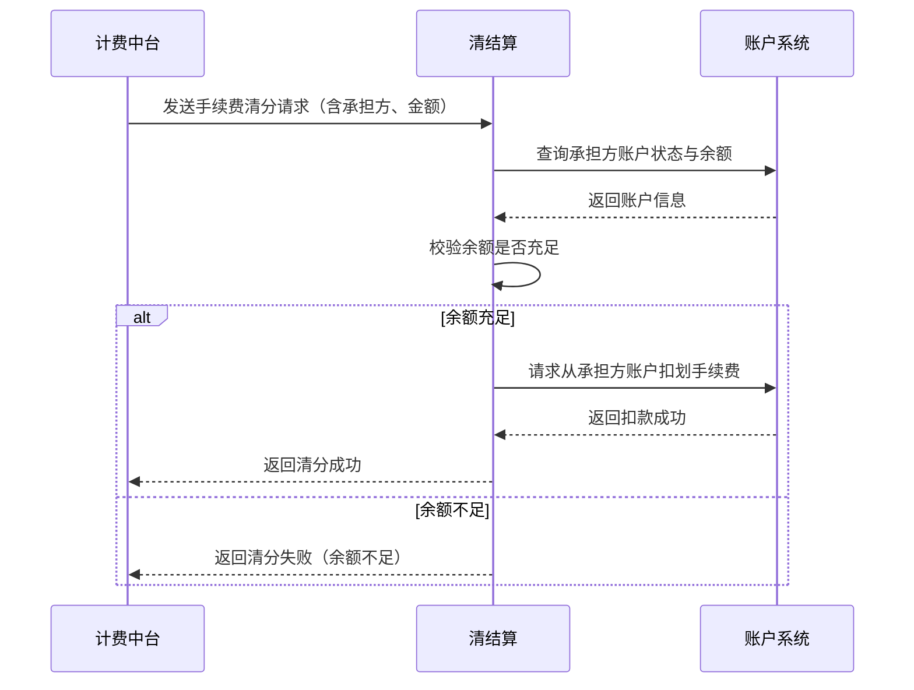
```mermaid
sequenceDiagram
    participant 计费中台
    participant 清结算
    participant 账户系统

    计费中台->>清结算: 发送手续费清分请求（含承担方、金额）
    清结算->>账户系统: 查询承担方账户状态与余额
    账户系统-->>清结算: 返回账户信息
    清结算->>清结算: 校验余额是否充足
    alt 余额充足
        清结算->>账户系统: 请求从承担方账户扣划手续费
        账户系统-->>清结算: 返回扣款成功
        清结算-->>计费中台: 返回清分成功
    else 余额不足
        清结算-->>计费中台: 返回清分失败（余额不足）
    end
```

#### 5.2 结算处理流程
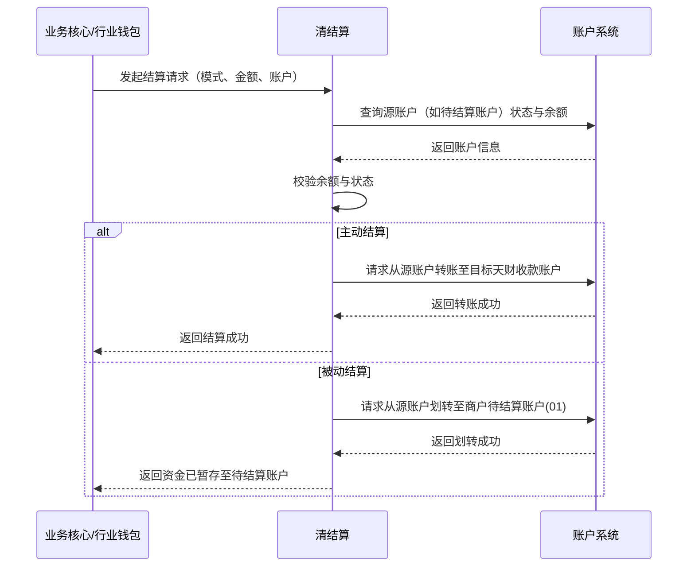
```mermaid
sequenceDiagram
    participant 业务核心/行业钱包
    participant 清结算
    participant 账户系统

    业务核心/行业钱包->>清结算: 发起结算请求（模式、金额、账户）
    清结算->>账户系统: 查询源账户（如待结算账户）状态与余额
    账户系统-->>清结算: 返回账户信息
    清结算->>清结算: 校验余额与状态
    alt 主动结算
        清结算->>账户系统: 请求从源账户转账至目标天财收款账户
        账户系统-->>清结算: 返回转账成功
        清结算-->>业务核心/行业钱包: 返回结算成功
    else 被动结算
        清结算->>账户系统: 请求从源账户划转至商户待结算账户(01)
        账户系统-->>清结算: 返回划转成功
        清结算-->>业务核心/行业钱包: 返回资金已暂存至待结算账户
    end
```

#### 5.3 退货账户查询流程
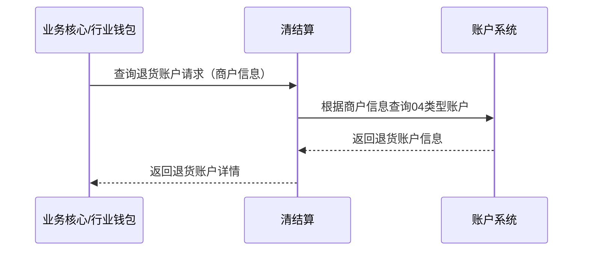
```mermaid
sequenceDiagram
    participant 业务核心/行业钱包
    participant 清结算
    participant 账户系统

    业务核心/行业钱包->>清结算: 查询退货账户请求（商户信息）
    清结算->>账户系统: 根据商户信息查询04类型账户
    账户系统-->>清结算: 返回退货账户信息
    清结算-->>业务核心/行业钱包: 返回退货账户详情
```

#### 5.4 专用账户冻结/解冻流程
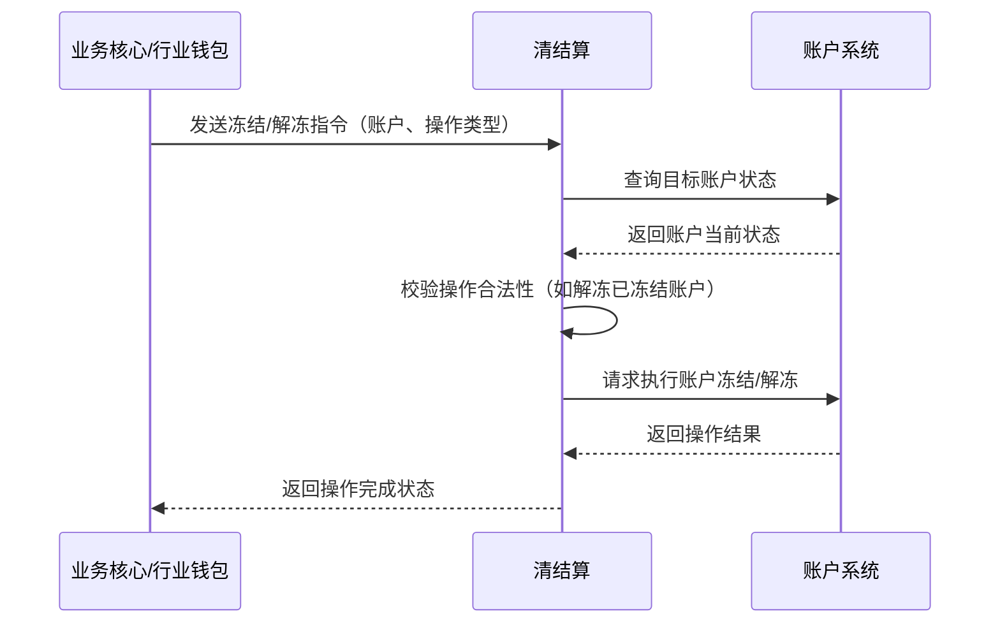
```mermaid
sequenceDiagram
    participant 业务核心/行业钱包
    participant 清结算
    participant 账户系统

    业务核心/行业钱包->>清结算: 发送冻结/解冻指令（账户、操作类型）
    清结算->>账户系统: 查询目标账户状态
    账户系统-->>清结算: 返回账户当前状态
    清结算->>清结算: 校验操作合法性（如解冻已冻结账户）
    清结算->>账户系统: 请求执行账户冻结/解冻
    账户系统-->>清结算: 返回操作结果
    清结算-->>业务核心/行业钱包: 返回操作完成状态
```

### 6. 错误处理
- **预期错误情况**:
    - 账户不存在或状态异常（冻结、注销）。
    - 账户余额不足。
    - 下游系统（如账户系统）服务超时或不可用。
    - 请求参数不合法。
    - 操作指令与账户当前状态冲突（如解冻一个正常账户）。
- **处理策略**:
    - 对于账户状态、余额不足或指令冲突问题，返回明确的业务失败原因，并建议上游重试或终止流程。
    - 对于下游系统故障，采用有限次数的重试机制，并记录日志告警。若最终失败，向上游返回系统错误。
    - 所有失败操作需保证数据的一致性，必要时进行冲正或状态回滚。

### 7. 依赖关系
- **上游系统**:
    - **计费中台**: 提供手续费计费流水，触发清分流程。
    - **业务核心/行业钱包**: 发起结算、退货账户查询、账户冻结/解冻等请求。
- **下游系统**:
    - **账户系统**: 依赖其进行底层账户的查询、余额变动、冻结/解冻等核心操作。

<a id="module-5"></a>

## 3.5 电子签约平台


### 1. 概述
- **目的与范围**: 本模块负责为天财分账业务（由天财合作方发起）提供协议签署与身份认证的线上化能力。核心职责包括配置短信和H5模板，调用认证系统完成身份核验，管理协议签署流程，并留存全证据链数据。其业务边界在于处理关系绑定（包括归集授权与开通付款）过程中的签约与认证环节，不涉及具体的账户操作或资金流转。

### 2. 接口设计
- **API端点 (REST/GraphQL)**:
    - `POST /v1/contract/initiate`: 三代系统调用，用于发起签约流程。
    - `GET /v1/contract/{contractId}/status`: 三代系统调用，用于查询签约状态。
    - `POST /v1/contract/{contractId}/callback`: 认证系统回调，通知认证结果。
    - `POST /v1/internal/evidence/query`: 内部接口，供其他模块查询证据链。
- **请求/响应结构**: TBD
- **发布/消费的事件**:
    - 发布事件: `ContractSignedEvent` (签约完成事件)， `ContractFailedEvent` (签约失败事件)。
    - 消费事件: TBD

### 3. 数据模型
- **表/集合**:
    - `signing_records` (签约记录表): 存储签约流程的核心信息。
    - `evidence_chain` (证据链表): 存储与签约相关的所有操作证据。
    - `sms_template_config` (短信模板配置表): 存储不同业务场景的短信模板。
    - `h5_template_config` (H5页面模板配置表): 存储不同业务场景的H5页面模板。
- **关键字段**:
    - `signing_records` 表: `contract_id` (签约ID，主键), `business_scene` (业务场景，如归集授权), `payer_id` (付方ID), `receiver_id` (收方ID), `auth_method` (认证方式), `status` (状态), `initiate_time` (发起时间), `expire_time` (过期时间), `result_time` (结果时间), `upstream_request_id` (上游请求ID，用于幂等)。
    - `evidence_chain` 表: `evidence_id` (证据ID), `contract_id` (关联签约ID), `evidence_type` (证据类型，如页面访问、协议确认、认证请求), `content` (证据内容，如IP地址、用户代理、时间戳、操作数据), `create_time` (创建时间)。
- **与其他模块的关系**: 本模块存储的协议签署记录与认证证据链数据，与认证系统交互完成核验，并为三代系统提供签约状态。

### 4. 业务逻辑
- **核心工作流/算法**: 主要业务流程为关系绑定流程。当三代发起签约请求后，本模块根据业务场景（如归集授权）配置并推送短信H5链接给接收方。接收方通过H5页面完成协议阅读、确认，并根据要求选择打款验证或人脸验证方式。本模块调用认证系统接口完成身份核验，核验通过后记录签约成功并通知三代。
- **业务规则与验证**:
    1.  根据天财上传的认证方式（打款验证/人脸验证）调用对应的认证系统接口。
    2.  确保协议模板与签署方身份匹配。
    3.  记录并存储完整的操作日志与证据链。
    4.  **幂等性处理**: 基于三代请求中的唯一请求ID (`upstream_request_id`) 防止重复创建签约流程。
    5.  **并发控制**: 对同一组付方-收方关系，在同一业务场景下，同一时间只允许存在一个进行中的签约流程。
- **关键边界情况处理**:
    1.  认证失败：记录失败原因并返回给上游。
    2.  签约链接过期：需重新生成。
    3.  重复签约：根据业务规则判断是否允许。
- **重试机制**: 对认证系统等下游依赖的调用，采用指数退避策略进行重试。例如：最大重试次数3次，初始延迟1秒，延迟倍数2。
- **数据留存策略**: 全证据链数据为关键合规数据，存储期限遵循公司金融级数据合规要求，至少保存5年。过期数据将归档至冷存储。

### 5. 时序图

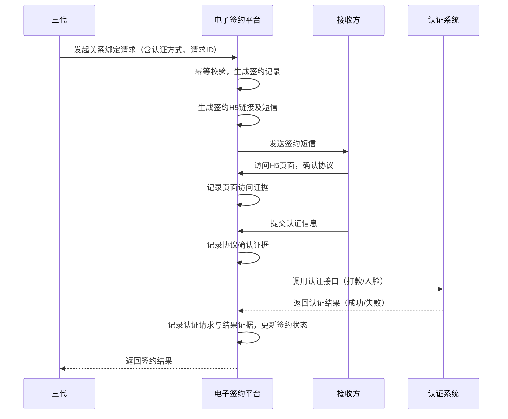
```mermaid
sequenceDiagram
    participant 三代
    participant 电子签约平台
    participant 接收方
    participant 认证系统

    三代->>电子签约平台: 发起关系绑定请求（含认证方式、请求ID）
    电子签约平台->>电子签约平台: 幂等校验，生成签约记录
    电子签约平台->>电子签约平台: 生成签约H5链接及短信
    电子签约平台->>接收方: 发送签约短信
    接收方->>电子签约平台: 访问H5页面，确认协议
    电子签约平台->>电子签约平台: 记录页面访问证据
    接收方->>电子签约平台: 提交认证信息
    电子签约平台->>电子签约平台: 记录协议确认证据
    电子签约平台->>认证系统: 调用认证接口（打款/人脸）
    认证系统-->>电子签约平台: 返回认证结果（成功/失败）
    电子签约平台->>电子签约平台: 记录认证请求与结果证据，更新签约状态
    电子签约平台-->>三代: 返回签约结果
```

### 6. 错误处理
- **预期错误情况**:
    1.  认证系统调用超时或失败。
    2.  接收方提交的认证信息有误。
    3.  模板配置错误或缺失。
    4.  网络异常导致短信发送失败。
    5.  上游重复请求。
- **处理策略**:
    1.  对依赖系统（如认证系统）的调用设置重试机制（指数退避）与超时控制。
    2.  明确的错误码映射，将底层错误转化为业务错误返回给上游。
    3.  关键操作（如证据链记录）需保证事务性。
    4.  通过请求ID实现幂等，对重复请求返回已存在流程的状态。

### 7. 依赖关系
- **上游模块**: 三代（发起签约请求）
- **下游模块**: 认证系统（调用其打款验证和人脸验证接口）

<a id="module-6"></a>

## 3.6 认证系统


### 1. 概述
- **目的与范围**: 本模块是拉卡拉内部系统，核心职责是提供身份认证服务，支持打款验证和人脸验证两种方式。其主要服务于关系绑定流程，为电子签约平台提供身份核验接口，确保分账业务中付方与收方身份的真实性与合法性。

### 2. 接口设计
- **API端点 (REST/GraphQL)**: 提供RESTful API接口。
    - `POST /api/v1/auth/payment`: 发起打款验证。
    - `POST /api/v1/auth/face`: 发起人脸验证。
    - `POST /api/v1/auth/verify-payment`: 验证用户回填的打款金额。
    - `GET /api/v1/auth/status/{requestId}`: 查询认证请求状态。
- **请求/响应结构**:
    - 发起打款验证请求 (`POST /api/v1/auth/payment`):
        - 请求体: `{“requestId”: “string”, “userId”: “string”, “userName”: “string”, “idCard”: “string”, “bankCardNo”: “string”, “bankCode”: “string”}`
        - 响应体: `{“code”: “string”, “message”: “string”, “data”: {“authRequestId”: “string”}}`
    - 发起人脸验证请求 (`POST /api/v1/auth/face`):
        - 请求体: `{“requestId”: “string”, “userId”: “string”, “userName”: “string”, “idCard”: “string”, “faceImage”: “base64String”}`
        - 响应体: `{“code”: “string”, “message”: “string”, “data”: {“authRequestId”: “string”}}`
    - 验证打款金额请求 (`POST /api/v1/auth/verify-payment`):
        - 请求体: `{“authRequestId”: “string”, “filledAmount”: “number”}`
        - 响应体: `{“code”: “string”, “message”: “string”, “data”: {“isValid”: boolean}}`
    - 查询认证状态请求 (`GET /api/v1/auth/status/{requestId}`):
        - 响应体: `{“code”: “string”, “message”: “string”, “data”: {“authRequestId”: “string”, “status”: “PENDING/SUCCESS/FAILED”, “authType”: “PAYMENT/FACE”, “result”: “string”}}`
- **发布/消费的事件**:
    - 消费事件: TBD（从电子签约平台接收认证请求指令）。
    - 发布事件: `AuthCompletedEvent`，包含认证请求ID、用户ID、认证类型、结果（成功/失败）、时间戳。供电子签约平台订阅。

### 3. 数据模型
- **表/集合**:
    - `auth_request` (认证请求记录表): 存储所有认证请求的主记录。
    - `payment_verification` (打款验证流水表): 存储打款验证相关的详细信息。
    - `face_verification` (人脸验证流水表): 存储人脸验证相关的详细信息。
- **关键字段**:
    - `auth_request` 表:
        - `id` (主键，认证请求ID)
        - `request_id` (上游请求ID，用于幂等)
        - `user_id` (用户标识)
        - `auth_type` (认证类型: PAYMENT, FACE)
        - `status` (状态: INITIATED, PENDING, SUCCESS, FAILED)
        - `result` (认证结果详情)
        - `created_at`, `updated_at`
    - `payment_verification` 表:
        - `id` (主键)
        - `auth_request_id` (外键，关联auth_request.id)
        - `bank_card_no` (银行卡号)
        - `bank_code` (银行编码)
        - `random_amount` (随机打款金额，单位: 分)
        - `payment_order_no` (打款订单号)
        - `payment_status` (打款状态)
        - `verified_amount` (用户回填的金额)
    - `face_verification` 表:
        - `id` (主键)
        - `auth_request_id` (外键，关联auth_request.id)
        - `id_card` (身份证号)
        - `name` (姓名)
        - `face_image_hash` (人脸图像哈希值，用于脱敏存储)
        - `third_party_request_id` (第三方人脸服务请求ID)
        - `similarity_score` (比对相似度)
- **与其他模块的关系**: 本模块被电子签约平台调用，用于在关系绑定流程中进行身份认证。认证结果通过事件或API回调通知电子签约平台。

### 4. 业务逻辑
- **核心工作流/算法**:
    - **打款验证流程**:
        1. 接收电子签约平台的认证请求，携带用户身份信息及银行卡信息。
        2. 生成唯一认证请求ID并落库，状态为`INITIATED`。
        3. 调用内部风控服务（TBD）校验银行卡状态。
        4. 生成一个随机金额（如0.01-0.99元），并记录到`payment_verification`表。
        5. 调用**账户系统**的转账接口，向目标银行卡发起该随机金额的打款。记录打款订单号。
        6. 更新认证请求状态为`PENDING`，等待用户回填。
        7. 用户回填金额后，电子签约平台调用验证接口。
        8. 系统比对用户回填金额与存储的随机金额。若一致，则认证成功；否则失败。
        9. 更新认证状态为`SUCCESS`或`FAILED`，并发布`AuthCompletedEvent`。
    - **人脸验证流程**:
        1. 接收电子签约平台的认证请求，携带用户身份信息及人脸图像。
        2. 生成唯一认证请求ID并落库，状态为`INITIATED`。
        3. 调用内部校验服务（TBD）校验姓名与身份证号的格式及逻辑关系。
        4. 将人脸图像发送至**外部人脸识别服务**进行活体检测与特征提取。
        5. 调用**外部人脸识别服务**的比对接口，将提取的特征与公安库或指定源进行比对。
        6. 接收比对结果（包含相似度分数）。
        7. 根据预设阈值（TBD）判断比对是否通过。
        8. 更新认证状态为`SUCCESS`或`FAILED`，记录相似度分数，并发布`AuthCompletedEvent`。
- **业务规则与验证**:
    - 所有请求必须包含幂等键(`requestId`)，防止重复提交。
    - 打款验证的随机金额有效期为TBD（例如30分钟），超时后验证失败。
    - 人脸验证的图像需满足质量要求（清晰度、非翻拍等），由第三方服务校验。
    - 认证结果一旦终态（成功/失败），不可更改。
- **关键边界情况处理**:
    - 网络超时：对**账户系统**和**外部人脸识别服务**的调用配置超时与重试机制（如最多重试3次）。
    - 第三方服务异常：熔断降级，返回系统繁忙，引导用户稍后重试。
    - 信息不匹配：返回具体的失败原因码（如“金额错误”、“人脸比对不通过”）。

### 5. 时序图

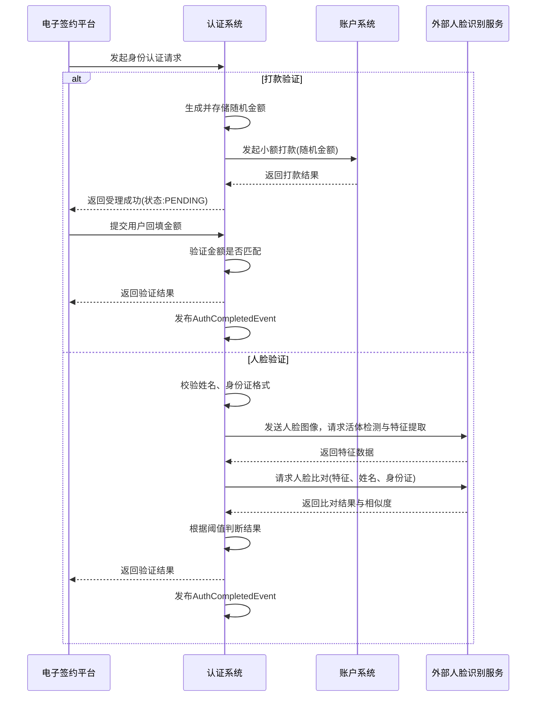
```mermaid
sequenceDiagram
    participant 电子签约平台
    participant 认证系统
    participant 账户系统
    participant 外部人脸识别服务

    电子签约平台->>认证系统: 发起身份认证请求
    alt 打款验证
        认证系统->>认证系统: 生成并存储随机金额
        认证系统->>账户系统: 发起小额打款(随机金额)
        账户系统-->>认证系统: 返回打款结果
        认证系统-->>电子签约平台: 返回受理成功(状态:PENDING)
        电子签约平台->>认证系统: 提交用户回填金额
        认证系统->>认证系统: 验证金额是否匹配
        认证系统-->>电子签约平台: 返回验证结果
        认证系统->>认证系统: 发布AuthCompletedEvent
    else 人脸验证
        认证系统->>认证系统: 校验姓名、身份证格式
        认证系统->>外部人脸识别服务: 发送人脸图像，请求活体检测与特征提取
        外部人脸识别服务-->>认证系统: 返回特征数据
        认证系统->>外部人脸识别服务: 请求人脸比对(特征、姓名、身份证)
        外部人脸识别服务-->>认证系统: 返回比对结果与相似度
        认证系统->>认证系统: 根据阈值判断结果
        认证系统-->>电子签约平台: 返回验证结果
        认证系统->>认证系统: 发布AuthCompletedEvent
    end
```

### 6. 错误处理
- **预期错误情况**:
    - 认证请求参数错误（缺少必填字段、格式错误）。
    - 银行卡信息错误或状态异常。
    - 打款失败（余额不足、银行系统异常）。
    - 人脸比对失败（活体检测不通过、相似度低于阈值、公安库无此身份证信息）。
    - 系统内部异常（数据库连接失败、内部服务调用异常）。
    - 网络超时（调用外部服务超时）。
- **处理策略**:
    - 输入参数校验：对请求体进行严格校验，非法请求立即返回400错误。
    - 外部依赖调用：为**账户系统**和**外部人脸识别服务**的调用设置连接超时与读取超时。实现指数退避重试机制（可配置次数）。对持续性故障启用熔断器。
    - 幂等性：利用`requestId`保证同一请求的幂等处理，避免重复打款或扣费。
    - 数据一致性：关键操作（如生成随机金额并落库、更新认证状态）在数据库事务内完成。
    - 错误响应：定义明确的错误码体系，在响应中返回可读的错误信息，便于上游排查。

### 7. 依赖关系
- **上游模块**: 电子签约平台。通过同步API调用本模块发起认证，并异步消费`AuthCompletedEvent`事件。
- **下游模块/外部服务**:
    - **账户系统**: 用于打款验证场景，调用其转账接口执行小额打款。
    - **外部人脸识别服务/数据库**: 用于人脸验证场景，调用其活体检测、特征提取与比对接口。
    - **内部风控服务 (TBD)**: 用于银行卡校验等风控环节。

<a id="module-7"></a>

## 3.7 计费中台


### 1. 概述
- **目的与范围**：本模块是拉卡拉内部系统，核心职责是为天财分账业务提供转账计费能力。具体包括根据业务规则生成计费流水，并处理相关手续费的清分。其边界仅限于计费逻辑的处理，即计算手续费、生成并持久化计费流水记录。模块不直接操作账户余额，但生成的计费流水会作为下游清结算系统进行手续费清分的依据，最终由清结算系统完成对账户余额的影响。
- **核心职责澄清**：模块接收来自上游行业钱包（分账核心）的交易指令，执行计费规则匹配与计算，确保计费数据的准确生成与记录。模块保证自身数据（计费流水）的最终一致性，与下游清结算系统的数据一致性通过异步消息和补偿机制保障。

### 2. 接口设计
- **API端点 (REST)**：
    - `POST /api/v1/fee/calculate`：计费计算与流水生成接口。
        - **请求方法**：POST
        - **请求头**：`Idempotency-Key: [幂等键]`
        - **请求体**：
            ```json
            {
              "transaction_id": "TXN202404280001",
              "institution_id": "INST001",
              "payer_id": "PAYER_001",
              "payer_type": "HEADQUARTERS",
              "payee_id": "PAYEE_001",
              "payee_type": "STORE",
              "transaction_amount": 10000,
              "fee_bearer": "PAYER",
              "business_scene": "MEMBER_SETTLEMENT"
            }
            ```
        - **响应体（成功）**：
            ```json
            {
              "code": "SUCCESS",
              "data": {
                "fee_ledger_id": "FEE202404280001",
                "calculated_fee": 30,
                "rule_id": "RULE_001"
              }
            }
            ```
        - **响应体（失败）**：
            ```json
            {
              "code": "RULE_NOT_FOUND",
              "message": "未找到适用的计费规则"
            }
            ```
- **发布/消费的事件**：
    - **消费事件**：TBD（例如，消费行业钱包发布的“分账交易已创建”事件以触发计费）。
    - **发布事件**：`FeeLedgerCreated` 事件，包含计费流水ID、交易ID、手续费金额等，供清结算系统订阅。

### 3. 数据模型
- **核心表：`fee_ledger` (计费流水表)**
    - **关键字段**：
        - `id` (主键): VARCHAR(64)，计费流水唯一标识。
        - `transaction_ref_id` (索引): VARCHAR(64)，关联的分账交易ID。
        - `institution_id`: VARCHAR(32)，机构号。
        - `payer_id`: VARCHAR(64)，付方ID。
        - `payee_id`: VARCHAR(64)，收方ID。
        - `transaction_amount`: DECIMAL(15,2)，交易金额（单位：分）。
        - `fee_amount`: DECIMAL(15,2)，计算出的手续费金额（单位：分）。
        - `fee_bearer`: ENUM('PAYER', 'PAYEE')，手续费承担方。
        - `fee_rule_id`: VARCHAR(64)，匹配到的计费规则ID。
        - `status`: ENUM('PENDING', 'CLEARING_SENT', 'CLEARED', 'FAILED')，流水状态。
        - `idempotency_key` (唯一索引): VARCHAR(128)，幂等键，防止重复计费。
        - `calculated_at`: DATETIME，计费时间。
        - `created_at`: DATETIME，记录创建时间。
- **与其他模块的关系**：本模块生成的计费流水（`fee_ledger` 表）通过 `transaction_ref_id` 与行业钱包的分账交易关联。流水数据通过事件或接口提供给下游清结算系统，用于手续费清分。

### 4. 业务逻辑
- **核心工作流**：
    1.  **请求接收与幂等校验**：接收来自行业钱包的计费请求，检查 `Idempotency-Key`。若已存在相同幂等键的成功流水，则直接返回历史结果。
    2.  **计费规则匹配**：根据请求中的 `institution_id`（机构号）、`payer_type`（付方类型）、`payee_type`（收方类型）、`business_scene`（业务场景）等维度，查询计费规则配置表（TBD），匹配优先级最高的有效规则。
    3.  **手续费计算**：根据匹配到的规则，使用公式计算手续费。示例公式：`手续费 = 交易金额 * 费率 + 固定费用`。计算精度处理到分，采用四舍五入或向上取整（具体策略TBD）。
    4.  **流水生成与持久化**：将计费结果、匹配的规则ID、原始请求信息等持久化到 `fee_ledger` 表，初始状态为 `PENDING`。
    5.  **事件发布**：发布 `FeeLedgerCreated` 事件，通知下游清结算系统。
    6.  **响应**：向行业钱包返回计费结果。
- **关键业务规则与验证**：
    - 必须校验 `fee_bearer` 的合法性（仅限“PAYER”或“PAYEE”）。
    - 零手续费场景：若计算出的手续费为0，仍需生成流水，`fee_amount` 为0。
    - 规则匹配失败视为业务异常，返回明确错误，不生成流水。
- **边界情况处理**：
    - **重试与补偿**：依赖幂等键 (`idempotency_key`) 保证同一交易请求的计费操作只执行一次。对于下游清结算系统消费失败，需有异步重试机制（如基于事件状态的重发）。
    - **数据一致性**：计费流水生成（本地数据库事务）与事件发布（消息队列）需保证最终一致性，可采用本地事务表+消息队列监听器模式（TBD）。

### 5. 时序图

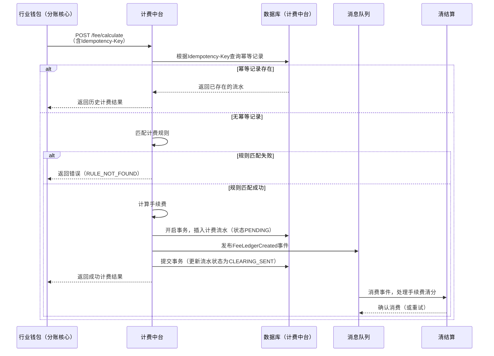
```mermaid
sequenceDiagram
    participant 行业钱包 as 行业钱包（分账核心）
    participant 计费中台
    participant 数据库 as 数据库（计费中台）
    participant 消息队列 as 消息队列
    participant 清结算

    行业钱包->>计费中台: POST /fee/calculate<br/>（含Idempotency-Key）
    计费中台->>数据库: 根据Idempotency-Key查询幂等记录
    alt 幂等记录存在
        数据库-->>计费中台: 返回已存在的流水
        计费中台-->>行业钱包: 返回历史计费结果
    else 无幂等记录
        计费中台->>计费中台: 匹配计费规则
        alt 规则匹配失败
            计费中台-->>行业钱包: 返回错误（RULE_NOT_FOUND）
        else 规则匹配成功
            计费中台->>计费中台: 计算手续费
            计费中台->>数据库: 开启事务，插入计费流水（状态PENDING）
            计费中台->>消息队列: 发布FeeLedgerCreated事件
            计费中台->>数据库: 提交事务（更新流水状态为CLEARING_SENT）
            计费中台-->>行业钱包: 返回成功计费结果
            消息队列->>清结算: 消费事件，处理手续费清分
            清结算-->>消息队列: 确认消费（或重试）
        end
    end
```

### 6. 错误处理
- **预期错误情况**：
    1.  **业务错误**：计费规则匹配失败、手续费承担方无效、请求参数校验失败。
    2.  **系统错误**：数据库连接/操作失败、消息队列发布失败、内部计算异常。
- **处理策略**：
    - **业务错误**：立即失败，返回明确的业务错误码和描述，不进行重试。
    - **系统错误**：
        - 数据库事务失败：回滚，返回系统错误，依赖调用方重试（利用幂等性）。
        - 事件发布失败：纳入本地补偿任务，异步重试发布，确保流水状态与事件最终一致。
    - **与下游交互错误**：清结算系统消费事件失败，由消息队列的重试机制和死信队列处理，计费中台监控异常并报警。

### 7. 依赖关系
- **上游模块**：**行业钱包（分账核心）**。计费中台依赖其发起的交易请求或通知来触发计费流程。接口契约必须包含交易关键信息及幂等键。
- **下游模块**：**清结算**。清结算系统订阅并消费计费中台发布的 `FeeLedgerCreated` 事件，依据计费流水完成手续费的清分处理。计费中台需保证事件的可靠投递。
- **内部依赖**：
    - 计费规则配置服务（TBD，可能由三代系统管理）。
    - 数据库（存储计费流水）。
    - 消息中间件（用于事件发布）。
- **非功能性考虑**：
    - **性能与扩展性**：`fee_ledger` 表需考虑按 `institution_id` 或时间进行分片（Sharding）以应对高并发写入。接口平均响应时间应低于100ms。
    - **一致性**：保证计费流水生成的单事务一致性，以及与下游清结算的最终一致性。
    - **监控**：需监控计费成功率、规则匹配失败率、流水状态分布及与下游通信延迟。

<a id="module-8"></a>

## 3.8 对账单系统


### 1. 概述
- **目的与范围**: 本模块负责生成天财机构层的各类账户和交易维度对账单。其核心职责是接收来自业务核心的天财分账交易数据，并基于这些数据为天财、总部、门店等角色生成结构化的对账文件。其边界限定于对账单的生成与提供，不涉及交易处理、账户操作或资金结算。

### 2. 接口设计
- **API端点 (REST/GraphQL)**:
    - `POST /api/v1/statements/generate`: 触发生成对账单任务。
    - `GET /api/v1/statements/{jobId}`: 查询对账单生成任务状态。
    - `GET /api/v1/statements/{jobId}/download`: 下载生成的对账单文件。
- **请求/响应结构**:
    - 生成请求 (`POST /api/v1/statements/generate`):
        - 请求体: `{ “institutionCode”: “string”, // 机构号 “accountType”: “string”, // 账户类型，如‘收款账户’、‘接收方账户’ “startDate”: “YYYY-MM-DD”, “endDate”: “YYYY-MM-DD” }`
        - 响应体: `{ “jobId”: “string”, // 任务ID “status”: “string” // 任务状态，如‘ACCEPTED’ }`
    - 查询任务状态响应 (`GET /api/v1/statements/{jobId}`):
        - 响应体: `{ “jobId”: “string”, “status”: “string”, // PENDING, PROCESSING, SUCCESS, FAILED “fileUrl”: “string”, // 成功时返回下载链接 “errorMessage”: “string” // 失败时返回错误信息 }`
- **发布/消费的事件**:
    - 消费事件: TBD (例如，消费业务核心发布的天财分账交易数据变更事件)。
    - 发布事件: TBD (例如，发布对账单生成成功或失败事件)。

### 3. 数据模型
- **表/集合**:
    - `statement_job` (对账单生成任务表): 存储每次生成任务的元数据。
    - `statement_record` (对账单记录表): 存储生成的对账单文件信息及关联的交易数据快照索引。
- **关键字段**:
    - `statement_job`:
        - `job_id` (主键)
        - `institution_code` (机构号)
        - `account_type` (账户类型)
        - `period_start` (对账周期开始日期)
        - `period_end` (对账周期结束日期)
        - `status` (任务状态)
        - `requested_at` (请求时间)
        - `completed_at` (完成时间)
        - `file_storage_path` (文件存储路径)
        - `error_log` (错误日志)
    - `statement_record`:
        - `record_id` (主键)
        - `job_id` (外键，关联`statement_job`)
        - `account_id` (账户ID)
        - `transaction_count` (交易笔数)
        - `total_amount` (总金额)
        - `total_fee` (总手续费)
        - `statement_data_snapshot_id` (交易数据快照引用ID)
- **与其他模块的关系**: 本模块依赖**业务核心**提供的天财分账交易数据。生成的对账单服务于天财、总部、门店等业务角色，通过文件下载链接或门户集成方式交付。

### 4. 业务逻辑
- **核心工作流/算法**:
    1.  **数据获取**: 根据请求参数（机构号、账户类型、日期范围），通过调用业务核心的查询接口（接口定义TBD）获取原始天财分账交易数据列表。数据应包含交易流水号、账户ID、交易金额、手续费、交易时间、交易状态等关键字段。
    2.  **数据聚合与计算**:
        - **聚合维度**: 按`机构号`、`账户ID`、`交易日期`进行分组。
        - **计算指标**: 对每个分组计算`交易总笔数`、`交易总金额`、`手续费总额`。对于跨日切的数据，按交易时间所属的结算日期进行归集。
    3.  **文件生成**: 使用开源库（如Apache POI for Excel，OpenCSV for CSV）将聚合计算结果生成为结构化文件。文件格式默认为CSV，包含表头：账户ID，交易日期，交易笔数，交易总金额，手续费总额。支持按需生成Excel格式。
    4.  **任务与存储**: 生成任务状态持久化至`statement_job`表，文件存储至对象存储或文件系统，路径记录在表中。聚合计算的明细快照索引存入`statement_record`表。
- **业务规则与验证**:
    - 对账数据需与业务核心的原始交易记录进行一致性校验，确保金额、笔数等关键信息准确无误。需根据机构号区分不同天财的业务数据。
    - 仅处理状态为“成功”的天财分账交易记录。
    - 日期范围请求不得超过系统配置的最大查询跨度（如31天）。
- **关键边界情况处理**:
    - 处理业务核心数据延迟或缺失的场景，需有重试与补偿机制。
    - 处理跨日切、跨结算周期的交易数据归集，以交易时间的自然日作为对账日期。

### 5. 时序图

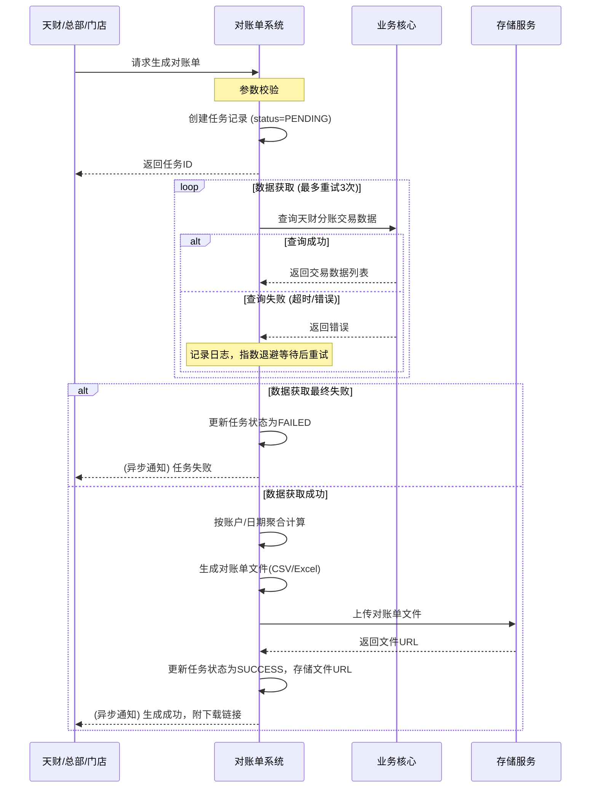
```mermaid
sequenceDiagram
    participant 天财 as 天财/总部/门店
    participant 对账单系统
    participant 业务核心
    participant 存储服务

    天财->>对账单系统: 请求生成对账单
    Note over 对账单系统: 参数校验
    对账单系统->>对账单系统: 创建任务记录 (status=PENDING)
    对账单系统-->>天财: 返回任务ID

    loop 数据获取 (最多重试3次)
        对账单系统->>业务核心: 查询天财分账交易数据
        alt 查询成功
            业务核心-->>对账单系统: 返回交易数据列表
        else 查询失败 (超时/错误)
            业务核心-->>对账单系统: 返回错误
            Note over 对账单系统: 记录日志，指数退避等待后重试
        end
    end

    alt 数据获取最终失败
        对账单系统->>对账单系统: 更新任务状态为FAILED
        对账单系统-->>天财: (异步通知) 任务失败
    else 数据获取成功
        对账单系统->>对账单系统: 按账户/日期聚合计算
        对账单系统->>对账单系统: 生成对账单文件(CSV/Excel)
        对账单系统->>存储服务: 上传对账单文件
        存储服务-->>对账单系统: 返回文件URL
        对账单系统->>对账单系统: 更新任务状态为SUCCESS，存储文件URL
        对账单系统-->>天财: (异步通知) 生成成功，附下载链接
    end
```

### 6. 错误处理
- **预期错误情况**:
    1.  **业务核心服务不可用或查询超时**。
    2.  **返回的交易数据格式异常或关键字段缺失**。
    3.  **对账单生成过程中发生系统错误**（如磁盘空间不足、文件写入失败）。
    4.  **请求参数非法**（如机构号不存在、日期格式错误、日期范围超限）。
- **处理策略**:
    1.  **依赖服务调用失败**: 采用指数退避策略进行重试，最大重试次数为3次。重试全部失败后，任务标记为`FAILED`，记录详细错误日志并触发告警。
    2.  **数据格式错误**: 对单条异常数据记录日志并跳过，不影响其他正常数据的处理。如果异常数据比例超过阈值（如5%），则任务整体标记为`PARTIAL_SUCCESS`并告警；否则生成部分对账单。
    3.  **系统级错误**: 立即告警，流程中断，任务标记为`FAILED`。
    4.  **参数校验失败**: 在API层进行校验，立即返回`400 Bad Request`及具体的错误信息。

### 7. 依赖关系
- **上游模块**: **业务核心**（提供天财分账交易数据查询接口，具体接口契约TBD）。
- **下游模块**: **天财、总部、门店等角色**通过本系统提供的文件下载链接获取对账单，或通过门户系统集成展示（门户集成方式TBD）。

<a id="module-9"></a>

## 3.9 业务核心


### 1. 概述
- **目的与范围**：本模块负责接收来自支付交易的原始数据，并根据天财分账业务规则进行处理与转换。其核心职责是为下游的对账单系统提供结构化的天财分账交易数据，以支持对账单的生成。模块的边界止于数据处理与提供，不涉及账户操作、关系绑定或计费等核心业务逻辑。**为完成数据清洗与业务关联，本模块需依赖账户系统查询账户信息，此操作为数据查询，不涉及账户状态变更。**

### 2. 接口设计
- **数据接入接口**：本模块通过消费Kafka消息队列接收上游交易系统推送的原始交易流水数据。主题名称为 `TBD`。
- **数据提供接口**：本模块通过REST API为下游对账单系统提供处理后的天财分账交易数据。
    - **端点**：`GET /api/v1/tiancai-split-transactions`
    - **请求参数**：`institutionNo` (机构号，必填)， `startTime`, `endTime` (时间范围，必填)， `page`, `size` (分页参数)。
    - **响应结构**：返回分页后的天财分账交易记录列表，每条记录包含交易ID、付方账户、收方账户、金额、状态、交易时间、机构号等字段。
- **发布/消费的事件**：
    - **消费**：交易系统发布的 `RawTransactionPosted` 事件（事件结构TBD），包含原始交易流水。
    - **发布**：本模块在处理完成后发布 `TiancaiSplitTransactionProcessed` 事件（事件结构TBD），供下游对账单系统或其他关注方订阅。

### 3. 数据模型
- **核心数据表**：`tiancai_split_transaction`
- **关键字段**：
    - `id`：主键，自增。
    - `original_transaction_id`：原始交易流水ID。
    - `transaction_type`：交易类型（固定为“天财分账”）。
    - `payer_account_no`：付方账户号。
    - `payer_account_type`：付方账户类型（天财收款账户/天财接收方账户）。
    - `receiver_account_no`：收方账户号。
    - `receiver_account_type`：收方账户类型（天财收款账户/天财接收方账户）。
    - `amount`：交易金额。
    - `fee`：手续费。
    - `fee_payer`：手续费承担方（付方/收方）。
    - `status`：处理状态（待处理、成功、失败）。
    - `institution_no`：机构号。
    - `business_scenario`：业务场景（门店分账/会员结算/批量付款/TBD）。
    - `transaction_time`：交易时间。
    - `processed_time`：本模块处理完成时间。
    - `error_message`：处理失败时的错误信息。
- **与其他模块的关系**：本模块处理的数据源自上游交易系统（通过事件），处理过程中需查询账户系统以获取账户类型标记，处理后的数据存储于本地数据库并供下游对账单系统消费。

### 4. 业务逻辑
- **数据接入机制**：模块启动Kafka消费者，持续监听 `RawTransactionPosted` 事件。采用至少一次（at-least-once）的消费语义，确保数据不丢失。
- **核心处理流程**：
    1.  **数据解析与过滤**：解析事件中的原始交易数据。仅当 `transaction_type` 字段为“天财分账”时，进入后续流程。
    2.  **账户信息查询与校验**：调用账户系统接口，根据原始交易中的付方与收方账户号查询账户详情。校验返回的账户信息中是否包含“天财专用账户”的特殊标记。若任一账户非天财专用账户，则标记为无效交易。
    3.  **业务场景映射**：根据付方与收方的账户类型、机构号以及可能的附加业务字段，将交易映射到具体的业务场景。
        - **规则示例（TBD）**：
            - 若付方为“总部”天财收款账户，收方为“门店”天财收款账户，可能映射为“会员结算”。
            - 若付方为“门店”天财收款账户，收方为“总部”天财收款账户，可能映射为“门店分账（归集）”。
            - 若付方为天财收款账户，收方为多个天财接收方账户，可能映射为“批量付款”。
    4.  **数据清洗与转换**：将原始交易字段映射并转换为 `tiancai_split_transaction` 表的结构化字段。补充机构号、业务场景等衍生信息。
    5.  **数据持久化与发布**：将处理成功的记录存入数据库，状态置为“成功”，并发布 `TiancaiSplitTransactionProcessed` 事件。处理失败的记录存入数据库，状态置为“失败”，并记录错误原因。
- **关键边界情况处理**：
    - **原始数据异常**：数据格式错误或关键字段缺失，记录错误日志，该条数据状态置为“失败”。
    - **账户查询失败**：调用账户系统超时或返回异常，进行有限次重试。若最终失败，记录为“待处理”状态，由后台任务定期补偿查询。
    - **场景映射未知**：无法根据现有规则映射到明确业务场景时，标记场景为“TBD”，但不阻断流程，数据正常落库供后续分析。

### 5. 时序图

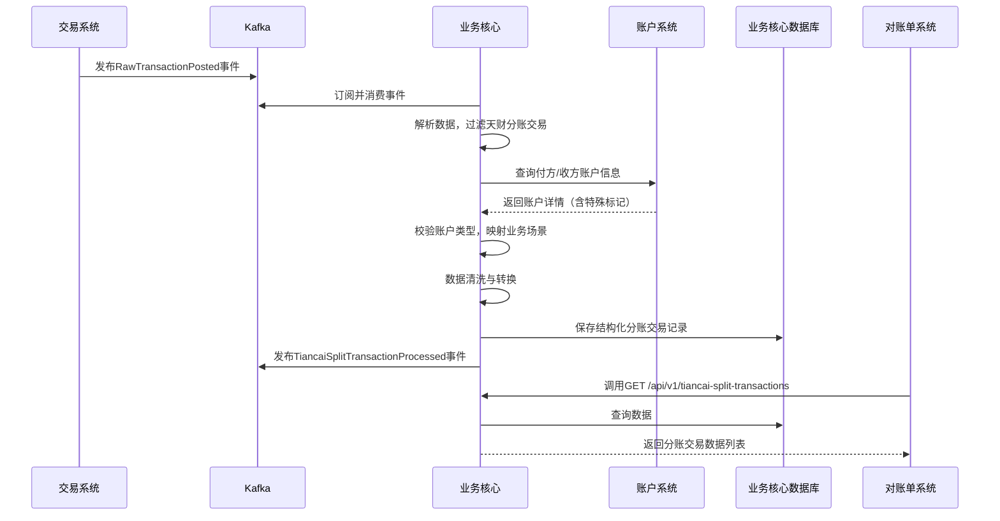
```mermaid
sequenceDiagram
    participant 交易系统
    participant Kafka
    participant 业务核心
    participant 账户系统
    participant DB as 业务核心数据库
    participant 对账单系统

    交易系统->>Kafka: 发布RawTransactionPosted事件
    业务核心->>Kafka: 订阅并消费事件
    业务核心->>业务核心: 解析数据，过滤天财分账交易
    业务核心->>账户系统: 查询付方/收方账户信息
    账户系统-->>业务核心: 返回账户详情（含特殊标记）
    业务核心->>业务核心: 校验账户类型，映射业务场景
    业务核心->>业务核心: 数据清洗与转换
    业务核心->>DB: 保存结构化分账交易记录
    业务核心->>Kafka: 发布TiancaiSplitTransactionProcessed事件
    对账单系统->>业务核心: 调用GET /api/v1/tiancai-split-transactions
    业务核心->>DB: 查询数据
    业务核心-->>对账单系统: 返回分账交易数据列表
```

### 6. 错误处理
- **预期错误情况**：
    1.  Kafka消息反序列化失败。
    2.  调用账户系统接口超时或返回5xx错误。
    3.  账户系统返回的账户信息中无天财专用账户标记。
    4.  数据库写入失败。
- **处理策略**：
    - **数据源错误**：反序列化失败时，记录死信消息，告警通知。流程级错误通过消费者组偏移量管理进行重试。
    - **依赖服务错误**：对账户系统调用配置熔断器，防止雪崩。失败请求记录原始数据ID，进入异步重试队列。
    - **业务逻辑错误**：如账户校验不通过，视为单条数据处理失败，更新记录状态为“失败”并记录原因，不影响其他数据处理。
    - **持久化错误**：数据库操作失败进行重试，若持续失败则告警。

### 7. 依赖关系
- **上游模块**：
    - **交易系统**：提供原始交易数据（通过Kafka事件）。
    - **账户系统**：提供账户信息查询服务，用于校验账户类型和获取业务属性。
- **下游模块**：
    - **对账单系统**：通过API消费本模块处理后的结构化天财分账交易数据。
    - **其他系统**：可能订阅 `TiancaiSplitTransactionProcessed` 事件。

<a id="module-10"></a>

## 3.10 账务核心


### 1. 概述
- **目的与范围**：本模块是拉卡拉内部系统，负责底层账户的创建、升级、余额管理、转账扣款及为天财专用账户打特殊标记。其核心职责是处理所有与天财分账业务相关的底层账户操作，是资金流转的基石。本模块接收来自上游“行业钱包（分账核心）”的指令，执行具体的账户操作，并为下游“清结算”、“对账单系统”等模块提供账户数据支持。

### 2. 接口设计
- **API端点 (REST/GraphQL)**：
    - `POST /api/v1/accounts`：创建账户。
    - `POST /api/v1/transfers`：执行转账。
    - `GET /api/v1/accounts/{accountId}`：查询账户信息。
    - `POST /api/v1/accounts/{accountId}/freeze`：冻结账户。
    - `POST /api/v1/accounts/{accountId}/unfreeze`：解冻账户。
- **请求/响应结构**：
    - 创建账户请求：`{ “accountType”: “TIANCAI_COLLECT” | “TIANCAI_RECEIVER”, “merchantId”: “string”, “institutionNo”: “string” }`
    - 创建账户响应：`{ “accountId”: “string”, “status”: “ACTIVE” }`
    - 转账请求：`{ “fromAccountId”: “string”, “toAccountId”: “string”, “amount”: “decimal”, “bizId”: “string” }`
    - 转账响应：`{ “transferId”: “string”, “status”: “SUCCESS” | “FAILED” }`
- **发布/消费的事件**：
    - 发布事件：`AccountCreated`、`TransferCompleted`、`AccountFrozen`。
    - 消费事件：TBD。

### 3. 数据模型
- **表/集合**：
    - `account`：账户主表。
    - `transaction_log`：交易流水表。
- **关键字段**：
    - `account` 表：`account_id`（主键）、`balance`（余额）、`account_type`（账户类型，含天财专用标记）、`status`（状态，如 ACTIVE, FROZEN）、`merchant_id`、`institution_no`、`version`（用于乐观锁）。
    - `transaction_log` 表：`transfer_id`（主键）、`from_account_id`、`to_account_id`、`amount`、`status`、`biz_id`、`created_at`。
- **与其他模块的关系**：本模块的 `account` 表为“行业钱包”模块提供底层账户操作支持，其创建的账户数据被“清结算”模块用于查询和冻结操作，被“对账单系统”模块用于生成对账单。

### 4. 业务逻辑
- **核心工作流/算法**：接收“行业钱包（分账核心）”的指令，为天财（合作方/平台）开立具有特殊标记的“天财专用账户”。处理账户间的转账扣款请求，执行余额的增减操作。所有涉及余额变更的操作均在数据库事务中完成，并使用乐观锁（`version`字段）处理并发冲突。
- **业务规则与验证**：
    1.  创建账户时，根据请求中的 `accountType` 字段（如 `TIANCAI_COLLECT`）在底层账户上打上特殊标记（即存入 `account_type` 字段）。
    2.  执行转账前，校验付方账户状态是否为 `ACTIVE`，并校验余额是否充足。
    3.  通过数据库事务保证“扣减付方余额”与“增加收方余额”的原子性。
    4.  使用乐观锁机制：在更新账户余额时，检查 `version` 字段，防止并发转账导致的余额扣减冲突。
- **关键边界情况处理**：
    1.  **并发转账冲突**：通过上述乐观锁机制处理。若更新失败（版本号不匹配），则向上游返回明确错误，建议其重试。
    2.  **系统异常冲正**：在分布式事务场景下，若转账过程中系统异常，将记录冲正流水，并通过补偿性事务（Saga模式）尝试回滚已完成的步骤，或标记交易为失败，确保数据最终一致性。

### 5. 时序图

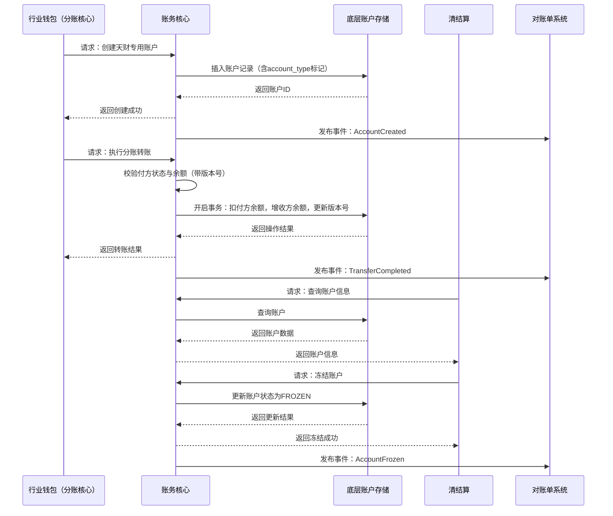
```mermaid
sequenceDiagram
    participant 分账核心 as 行业钱包（分账核心）
    participant 账务核心 as 账务核心
    participant 底层存储 as 底层账户存储
    participant 清结算 as 清结算
    participant 对账单系统 as 对账单系统

    分账核心->>账务核心: 请求：创建天财专用账户
    账务核心->>底层存储: 插入账户记录（含account_type标记）
    底层存储-->>账务核心: 返回账户ID
    账务核心-->>分账核心: 返回创建成功
    账务核心->>对账单系统: 发布事件：AccountCreated

    分账核心->>账务核心: 请求：执行分账转账
    账务核心->>账务核心: 校验付方状态与余额（带版本号）
    账务核心->>底层存储: 开启事务：扣付方余额，增收方余额，更新版本号
    底层存储-->>账务核心: 返回操作结果
    账务核心-->>分账核心: 返回转账结果
    账务核心->>对账单系统: 发布事件：TransferCompleted

    清结算->>账务核心: 请求：查询账户信息
    账务核心->>底层存储: 查询账户
    底层存储-->>账务核心: 返回账户数据
    账务核心-->>清结算: 返回账户信息

    清结算->>账务核心: 请求：冻结账户
    账务核心->>底层存储: 更新账户状态为FROZEN
    底层存储-->>账务核心: 返回更新结果
    账务核心-->>清结算: 返回冻结成功
    账务核心->>对账单系统: 发布事件：AccountFrozen
```

### 6. 错误处理
- **预期错误情况**：账户不存在、账户已冻结、付方余额不足、乐观锁版本冲突、底层数据库操作异常、网络超时。
- **处理策略**：
    1.  业务逻辑错误（如余额不足、版本冲突）返回明确错误码和描述。
    2.  系统级异常记录详细日志并告警。
    3.  对于因系统异常导致的中间状态，通过冲正流水和补偿机制（Saga）保证最终一致性。
    4.  对网络超时等可重试错误，提供幂等的重试机制。

### 7. 依赖关系
- **上游模块**：行业钱包（分账核心）。账务核心接收其发起的账户创建、转账等指令。
- **下游模块**：
    - 清结算：依赖本模块查询账户信息、执行账户冻结/解冻操作。
    - 对账单系统：订阅本模块发布的事件（如 `AccountCreated`, `TransferCompleted`），获取账户及交易数据以生成对账单。

<a id="module-11"></a>

## 3.11 交易系统


### 1. 概述
- **目的与范围**: 本模块负责处理天财分账业务的交易流程，包括接收分账请求、执行资金划转、处理手续费、生成交易记录，并与账户系统、清结算、计费中台等核心系统进行交互，确保分账交易的准确性和一致性。

### 2. 接口设计
- **API端点 (REST/GraphQL)**: TBD
- **请求/响应结构**: TBD
- **发布/消费的事件**: TBD

### 3. 数据模型
- **表/集合**: TBD
- **关键字段**: TBD
- **与其他模块的关系**: 交易系统依赖账户系统进行账户余额操作，依赖清结算进行手续费清分，依赖计费中台获取计费规则，并为对账单系统提供天财分账交易数据。

### 4. 业务逻辑
- **核心工作流/算法**: 接收来自行业钱包的分账请求，验证付方与收方关系绑定状态，调用账户系统进行资金扣划与入账，根据手续费承担方调用计费中台计算手续费，并通知清结算进行手续费清分。
- **业务规则与验证**: 验证交易双方是否为有效的天财专用账户，验证分账金额是否超过付方账户可用余额，验证手续费承担方（付方或收方）的合法性。
- **关键边界情况处理**: 处理账户余额不足、关系绑定失效、手续费计算失败、清结算处理超时等异常场景，确保交易状态可追溯与可冲正。

### 5. 时序图
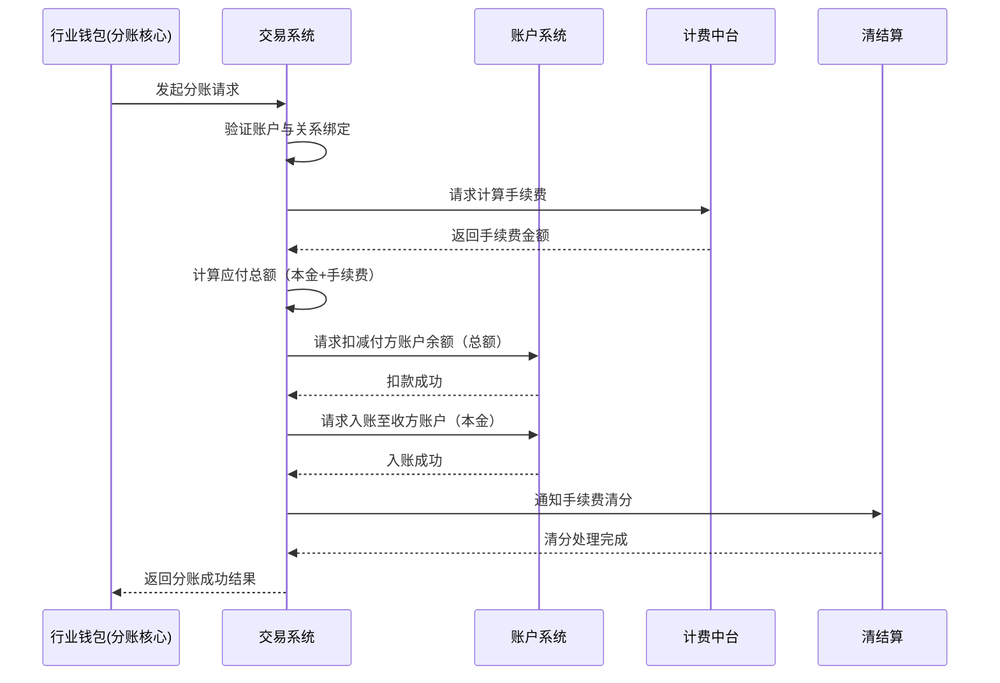
```mermaid
sequenceDiagram
    participant 行业钱包 as 行业钱包(分账核心)
    participant 交易系统 as 交易系统
    participant 账户系统 as 账户系统
    participant 计费中台 as 计费中台
    participant 清结算 as 清结算

    行业钱包->>交易系统: 发起分账请求
    交易系统->>交易系统: 验证账户与关系绑定
    交易系统->>计费中台: 请求计算手续费
    计费中台-->>交易系统: 返回手续费金额
    交易系统->>交易系统: 计算应付总额（本金+手续费）
    交易系统->>账户系统: 请求扣减付方账户余额（总额）
    账户系统-->>交易系统: 扣款成功
    交易系统->>账户系统: 请求入账至收方账户（本金）
    账户系统-->>交易系统: 入账成功
    交易系统->>清结算: 通知手续费清分
    清结算-->>交易系统: 清分处理完成
    交易系统-->>行业钱包: 返回分账成功结果
```

### 6. 错误处理
- **预期错误情况**: 付方账户余额不足、付方或收方账户状态异常（如冻结）、关系绑定已失效、手续费计算失败、与下游系统（账户系统、清结算）通信超时或失败。
- **处理策略**: 对可重试错误（如网络超时）进行有限次重试；对业务逻辑错误（如余额不足）立即失败并返回明确错误码；记录详细的交易日志用于对账与问题排查；支持交易冲正流程以处理最终失败场景。

### 7. 依赖关系
- **上游模块**: 行业钱包（分账核心）、账户系统、计费中台、清结算。
- **下游模块**: 对账单系统、业务核心。

<a id="module-12"></a>

## 3.12 代付系统


### 1. 概述
- **目的与范围**: 本模块负责处理由上游业务系统发起的批量付款（批付）业务。核心职责包括接收并处理批量付款指令，协调账户系统进行资金划转，与计费中台交互处理手续费，并确保交易状态同步。本模块通过发布事件的方式，将交易结果数据同步给下游清结算、对账单等系统。

### 2. 接口设计
- **API端点 (REST/GraphQL)**:
    - `POST /api/v1/batch-payments`: 接收批量付款指令。
- **请求/响应结构**:
    - **请求体 (BatchPaymentRequest)**:
        - `batchId`: 批次号
        - `payerId`: 付方ID（总部/门店）
        - `payerAccountNo`: 付方天财收款账户号
        - `feeBearer`: 手续费承担方 (PAYER/RECEIVER)
        - `items`: 付款明细列表
            - `receiverId`: 接收方ID
            - `receiverAccountNo`: 接收方账户号
            - `amount`: 转账金额
    - **响应体 (BatchPaymentResponse)**:
        - `batchId`: 批次号
        - `status`: 批次状态 (PROCESSING/SUCCESS/PARTIAL_SUCCESS/FAILED)
        - `totalCount`: 总笔数
        - `successCount`: 成功笔数
        - `failCount`: 失败笔数
        - `failReasons`: 失败原因列表（可选）
- **发布/消费的事件**:
    - **发布事件**:
        - `BatchPaymentCompletedEvent`: 批量付款处理完成事件。包含批次ID、状态、总金额、手续费、成功/失败明细。
        - `PaymentItemSettledEvent`: 单笔付款结算事件。包含付款明细ID、金额、手续费、状态。
    - **消费事件**: TBD

### 3. 数据模型
- **表/集合**:
    - `batch_payment_orders` (批量付款订单表)
    - `payment_items` (付款明细表)
- **关键字段**:
    - **batch_payment_orders**:
        - `id` (主键)
        - `batch_id` (批次号)
        - `payer_id` (付方ID)
        - `payer_account_no` (付方账户号)
        - `fee_bearer` (手续费承担方)
        - `total_amount` (总金额)
        - `total_fee` (总手续费)
        - `status` (批次状态)
        - `request_system` (请求来源系统，如“三代”)
        - `created_at`, `updated_at`
    - **payment_items**:
        - `id` (主键)
        - `batch_order_id` (外键，关联 batch_payment_orders.id)
        - `item_id` (明细项ID)
        - `receiver_id` (接收方ID)
        - `receiver_account_no` (接收方账户号)
        - `amount` (金额)
        - `fee` (手续费)
        - `status` (明细状态)
        - `fail_reason` (失败原因)
        - `created_at`, `updated_at`
- **与其他模块的关系**: 依赖账户系统进行账户操作，依赖计费中台进行手续费计算，依赖电子签约平台验证“开通付款”状态。通过事件向业务核心和对账单系统提供交易数据。

### 4. 业务逻辑
- **核心工作流/算法**:
    1.  接收批量付款请求。
    2.  调用电子签约平台，验证付方（总部/门店）是否已完成“开通付款”签约认证。
    3.  调用账户系统，验证付方天财收款账户状态及余额（含预估手续费）是否充足。
    4.  调用计费中台，根据“手续费承担方”规则计算总手续费及明细手续费。
    5.  调用账户系统，从付方账户扣款（本金+手续费）。
    6.  遍历付款明细，调用账户系统向各接收方账户转账。
    7.  汇总处理结果，更新批次及明细状态。
    8.  发布批次完成事件及明细结算事件。
- **业务规则与验证**:
    - 验证付方与接收方之间是否存在有效的关系绑定（需调用行业钱包或依赖上游校验）。
    - 验证付方天财收款账户状态正常且余额充足。
    - 校验“手续费承担方”字段的有效性（PAYER/RECEIVER）。
    - 验证付方已完成“开通付款”签约认证（调用电子签约平台）。
- **关键边界情况处理**:
    - **部分成功、部分失败**: 当批量付款中部分明细失败时，标记批次状态为`PARTIAL_SUCCESS`。已成功的转账不做自动冲正。失败的明细记录具体原因。整个批次视为已完成处理，并向请求方返回包含成功与失败明细的汇总结果。
    - **资金操作补偿**: 若从付方账户扣款成功，但后续向接收方转账时发生系统性失败，需记录异常状态并触发人工或定时任务进行对账与差错处理，不在此模块内实现自动冲正。
    - **依赖服务异常**: 调用电子签约平台、账户系统、计费中台失败时，整个批次标记为`FAILED`，并记录具体失败原因。

### 5. 时序图

```mermaid
sequenceDiagram
    participant 三代
    participant 代付系统
    participant 电子签约平台
    participant 账户系统
    participant 计费中台

    三代->>代付系统: 发起批量付款请求
    代付系统->>电子签约平台: 查询付方“开通付款”状态
    电子签约平台-->>代付系统: 返回签约状态（有效/无效）
    代付系统->>代付系统: 校验签约状态、关系绑定（TBD）
    代付系统->>账户系统: 查询付方账户状态与余额
    账户系统-->>代付系统: 返回账户状态与余额
    代付系统->>计费中台: 请求计算手续费
    计费中台-->>代付系统: 返回手续费金额
    代付系统->>代付系统: 校验余额是否充足（本金+手续费）
    代付系统->>账户系统: 请求从付方账户扣款（含手续费）
    账户系统-->>代付系统: 扣款结果
    loop 遍历付款明细
        代付系统->>账户系统: 请求向接收方账户转账
        账户系统-->>代付系统: 单笔转账结果
    end
    代付系统->>代付系统: 汇总结果，更新状态
    代付系统-->>三代: 返回批量付款处理结果
    代付系统->>代付系统: 发布BatchPaymentCompletedEvent等
```

### 6. 错误处理
- **预期错误情况**:
    - 付方“开通付款”签约状态无效。
    - 付方账户余额不足。
    - 付方与接收方关系绑定无效。
    - 接收方账户状态异常。
    - 手续费计算失败。
    - 账户系统扣款或转账失败。
    - 网络超时或依赖服务不可用。
- **处理策略**:
    - 前置校验失败（如签约状态、余额不足、关系绑定），整个批次立即失败，向请求方返回明确错误码和原因。
    - 资金操作（扣款、转账）过程中失败，该笔明细失败，记录原因，批次继续处理其他明细。
    - 对于部分失败的批次，在响应中明确列出成功与失败的明细及原因。
    - 所有失败操作均记录详细日志，用于对账与排查。

### 7. 依赖关系
- **上游模块**:
    - **三代**: 提供批量付款业务指令与配置，是本模块主要的请求来源。
    - **行业钱包**: 可能传递分账相关指令或状态，并提供关系绑定校验接口（具体方式TBD）。
    - **电子签约平台**: 提供“开通付款”签约状态的查询接口。
- **下游模块**:
    - **账户系统**: 执行资金扣款与转账操作。
    - **计费中台**: 提供手续费计算服务。
    - **清结算**: 消费本模块发布的`PaymentItemSettledEvent`事件，进行手续费清分。
    - **业务核心/对账单系统**: 消费本模块发布的事件，获取天财分账交易数据，用于生成对账单。

<a id="module-13"></a>

## 3.13 钱包APP/商服平台


### 1. 概述
- **目的与范围**: 本模块是面向商户（总部/门店）和接收方的**后端服务（Backend-for-Frontend）**，作为用户交互界面的后端支撑。它负责聚合来自三代、行业钱包等后端系统的业务能力，提供开户、关系绑定、分账指令发起、交易查询、账户管理等功能的统一接口。其边界止于处理前端请求、编排后端服务调用、管理会话状态，并将结果返回给前端。不处理核心业务逻辑（如账户记账、分账执行）。
- **架构角色**: 明确为后端服务（BFF），负责业务逻辑编排、状态管理、接口适配和用户会话处理。

### 2. 接口设计
- **API端点 (REST/GraphQL)**: TBD
    - `POST /api/v1/account/open`: 发起开户申请。
    - `POST /api/v1/binding/initiate`: 初始化关系绑定流程。
    - `POST /api/v1/binding/submit-auth`: 提交认证信息。
    - `POST /api/v1/binding/confirm`: 确认并完成绑定。
    - `POST /api/v1/split/instruction`: 发起分账指令。
    - `POST /api/v1/payment/enable`: 开通付款能力。
    - `GET /api/v1/transactions`: 查询交易记录。
    - `GET /api/v1/account/info`: 查询账户信息。
- **请求/响应结构**: TBD
    - 请求头需包含机构号(`org_id`)、用户身份令牌(`access_token`)。
    - 响应体统一格式：`{“code”: string, “message”: string, “data”: object, “requestId”: string}`。
- **发布/消费的事件**: TBD
    - 消费事件：行业钱包下发的“分账结果异步通知”事件。
    - 发布事件：TBD（如流程状态变更事件，供内部监控使用）。

### 3. 数据模型
- **表/集合**: 本模块作为BFF，需持久化部分状态数据以支持多步骤流程。
    - `user_session`: 存储用户多步骤流程（如绑定、开户）的中间状态。
        - `session_id` (PK), `user_id`, `flow_type` (e.g., “BINDING”, “OPEN_ACCOUNT”), `step`, `context_data` (JSON), `expires_at`, `created_at`。
    - `api_cache`: 缓存后端系统返回的静态或低频变更数据（如协议模板、费率配置）。
        - `cache_key` (PK), `data` (JSON), `source_system`, `ttl`, `updated_at`。
    - `idempotency_key`: 保证关键操作（如发起分账）的幂等性。
        - `key` (PK), `user_id`, `api_endpoint`, `request_hash`, `response` (JSON), `created_at`。
- **关键字段**: 见上表描述。
- **与其他模块的关系**: 本模块的数据模型主要用于会话和缓存管理。核心业务数据（账户、交易、绑定关系）的权威数据源位于后端系统（三代、行业钱包、账户系统）。本模块通过接口同步或异步获取这些数据。

### 4. 业务逻辑
- **核心工作流/算法**:
    1.  **开户流程**: 接收前端提交的商户/接收方信息，调用**三代系统**接口完成天财专用账户的开立申请。三代系统将调用行业钱包执行实际开户。
    2.  **关系绑定流程**:
        - 初始化：调用三代获取协议模板。
        - 签署：调用电子签约平台完成协议签署。
        - 认证：根据接收方类型调用认证系统（个人用人脸验证，商户用打款验证）。
        - 确认：将签署和认证结果提交给三代，由三代调用行业钱包完成关系绑定校验与创建。
        - 状态管理：使用`user_session`表跟踪上述多步骤状态。
    3.  **分账指令发起**:
        - 校验：检查付方与收方绑定关系是否存在（可调用三代或缓存校验）。
        - 校验：检查付方账户状态和余额（调用账户系统）。
        - 构造请求：根据场景（门店分账/归集、会员结算、批量付款）构造分账指令，明确手续费承担方。
        - 幂等性：使用`idempotency_key`表防止重复提交。
        - 调用：调用**行业钱包**接口发起天财分账。
        - 异步处理：监听行业钱包的异步结果通知，更新交易状态。
    4.  **开通付款流程**: 作为关系绑定的一个特殊分支或后续步骤，引导付方完成额外的签约认证，调用三代系统更新付方的付款权限。
- **业务规则与验证**:
    - 发起分账前，必须通过三代系统验证付方与收方之间存在有效的绑定关系。
    - 所有API请求必须携带有效的`机构号`，用于数据权限过滤和业务规则路由。
    - 接收方为个人时，强制引导人脸验证；接收方为商户时，强制引导打款验证。
    - 用户输入验证：金额必须为正数且符合精度要求（如两位小数）；收款方信息格式校验。
    - 状态机：绑定流程状态为 `INIT -> SIGNED -> AUTHENTICATED -> CONFIRMED`，确保步骤顺序。
- **关键边界情况处理**:
    - 异步结果处理：对行业钱包的分账结果异步通知，需实现幂等更新，并可能触发前端状态推送（如WebSocket）。
    - 会话超时：多步骤流程的会话状态(`user_session`)设置合理TTL，超时后需引导用户重新开始。

### 5. 时序图

#### 5.1 开户流程时序图
```mermaid
sequenceDiagram
    participant U as 前端界面
    participant BFF as 钱包APP/商服平台(BFF)
    participant SD as 三代系统
    participant IW as 行业钱包

    U->>BFF: 1. 提交开户申请信息
    BFF->>SD: 2. 调用开户接口
    SD->>IW: 3. 调用行业钱包开户
    IW-->>SD: 4. 返回开户结果
    SD-->>BFF: 5. 返回开户申请结果
    BFF-->>U: 6. 展示结果
```

#### 5.2 关系绑定流程时序图
```mermaid
sequenceDiagram
    participant U as 前端界面
    participant BFF as 钱包APP/商服平台(BFF)
    participant SD as 三代系统
    participant EC as 电子签约平台
    participant AS as 认证系统
    participant IW as 行业钱包

    U->>BFF: 1. 发起绑定
    BFF->>SD: 2. 获取协议模板
    SD-->>BFF: 3. 返回协议信息
    BFF->>EC: 4. 发起电子签约
    EC-->>BFF: 5. 返回签署结果
    BFF->>AS: 6. 发起身份认证
    AS-->>BFF: 7. 返回认证结果
    BFF->>SD: 8. 提交绑定申请（含签署、认证结果）
    SD->>IW: 9. 校验并创建绑定关系
    IW-->>SD: 10. 返回绑定结果
    SD-->>BFF: 11. 返回最终结果
    BFF-->>U: 12. 展示结果
```

#### 5.3 分账指令发起时序图
```mermaid
sequenceDiagram
    participant U as 前端界面
    participant BFF as 钱包APP/商服平台(BFF)
    participant SD as 三代系统
    participant Acct as 账户系统
    participant IW as 行业钱包

    U->>BFF: 1. 提交分账指令
    BFF->>SD: 2. 校验绑定关系
    SD-->>BFF: 3. 关系有效
    BFF->>Acct: 4. 查询付方账户状态/余额
    Acct-->>BFF: 5. 账户正常，余额充足
    BFF->>IW: 6. 发起分账请求（幂等键）
    IW-->>BFF: 7. 接受请求，返回处理中
    Note over BFF,IW: 异步处理
    IW->>BFF: 8. (异步)分账结果通知
    BFF-->>U: 9. (可选)推送状态更新
```

#### 5.4 开通付款流程时序图
```mermaid
sequenceDiagram
    participant U as 前端界面
    participant BFF as 钱包APP/商服平台(BFF)
    participant EC as 电子签约平台
    participant AS as 认证系统
    participant SD as 三代系统

    U->>BFF: 1. 申请开通付款
    BFF->>EC: 2. 发起额外协议签署
    EC-->>BFF: 3. 返回签署结果
    BFF->>AS: 4. 发起身份认证
    AS-->>BFF: 5. 返回认证结果
    BFF->>SD: 6. 提交开通付款申请
    SD-->>BFF: 7. 返回开通结果
    BFF-->>U: 8. 展示结果
```

### 6. 错误处理
- **预期错误情况**:
    - 网络异常或后端服务(三代、行业钱包等)不可用、超时。
    - 用户输入数据格式错误、必填项缺失。
    - 业务规则违反：绑定关系不存在、账户状态异常（冻结、注销）、余额不足、机构号无权限。
    - 认证失败：打款验证金额错误、人脸比对不通过、签约失败。
    - 幂等冲突：重复提交同一分账请求。
- **处理策略**:
    - **重试策略**：对网络超时和可重试的服务错误（如5xx）采用指数退避重试，最多3次。对业务逻辑错误（4xx）不重试。
    - **断路器模式**：对每个下游服务（三代、行业钱包等）实现断路器，防止级联故障。
    - **用户输入校验**：实施前端实时校验和后端强校验，返回明确的字段级错误信息。
    - **业务错误**：将下游系统返回的业务错误码和描述信息，转换为用户可理解的信息进行展示。
    - **会话与状态管理**：流程中断后，允许用户从最近的有效步骤继续，或清除过期会话要求重新开始。
    - **幂等性**：通过`idempotency_key`表保证`POST`类关键接口的幂等性，对重复请求返回原有结果。

### 7. 依赖关系
- **上游模块（依赖的服务）**:
    - **三代系统**：核心依赖。提供开户申请、关系绑定流程接口、绑定关系校验、计费配置查询。
    - **行业钱包（分账核心）**：核心依赖。处理分账请求，异步返回结果。
    - **电子签约平台**：提供协议签署服务。
    - **认证系统**：提供打款验证和人脸验证服务。
    - **账户系统**：提供账户信息、余额、状态查询。
    - **对账单系统**：提供交易对账数据查询。
    - **清结算系统**：TBD（可能涉及手续费查询）。
    - **计费中台**：TBD（可能涉及手续费计算）。
- **下游模块（消费本模块服务的客户端）**:
    - **Web前端**：商户管理后台。
    - **移动端APP**：商户或接收方使用的移动应用。
    - **内部管理平台**：可能的内部监控或运营界面。

<a id="module-14"></a>

## 3.14 天财


### 1. 概述
- **目的与范围**: 本模块是面向“天财”合作方的业务入口，负责接收并处理其发起的开户、关系绑定、分账等业务指令。它作为前端接口层，将天财的业务请求转换为内部系统（如三代、行业钱包）可处理的格式，并协调各内部系统完成业务闭环。其边界止于对内部系统的调用，不包含底层账户、清结算等核心业务逻辑的实现。

### 2. 接口设计
- **API端点 (REST/GraphQL)**: TBD
- **请求/响应结构**: TBD
- **发布/消费的事件**: TBD

### 3. 数据模型
- **表/集合**: TBD
- **关键字段**: TBD
- **与其他模块的关系**: TBD

### 4. 业务逻辑
- **核心工作流/算法**:
    1.  **开户流程**: 接收天财的开户请求，校验机构号。调用三代系统进行商户入网审核。审核通过后，调用行业钱包系统，由其协调账户系统，为商户开立带有特殊标记的“天财收款账户”或“天财接收方账户”。
    2.  **关系绑定流程**: 接收天财的关系绑定请求，校验付方与收方账户状态。调用电子签约平台，由其配置并引导用户完成协议签署，并调用认证系统完成打款验证或人脸验证。认证通过后，调用行业钱包系统完成付方与收方账户的关系绑定。
    3.  **分账/转账流程**: 接收天财的分账请求，校验付方与收方的关系绑定状态、账户状态及余额。调用行业钱包系统发起“天财分账”交易。行业钱包调用账户系统进行扣款，并可能联动计费中台计算手续费、清结算系统进行资金清分。交易完成后，业务核心接收交易数据，对账单系统生成对账单。
- **业务规则与验证**:
    1.  校验请求中“机构号”的合法性。
    2.  根据业务场景（门店分账/归集、会员结算、批量付款）校验付方与收方的账户类型及关系绑定状态。
    3.  校验分账金额、手续费承担方等参数的合法性。
    4.  对于“开通付款”场景，需额外完成签约认证流程。
- **关键边界情况处理**:
    1.  处理重复请求，通过幂等性设计防止重复开户或重复分账。
    2.  处理异步处理过程中的超时与状态同步问题，提供异步查询接口。
    3.  处理因底层系统（如账户系统、清结算）异常导致的业务失败，记录详细日志并触发告警，支持人工介入或补偿机制。

### 5. 时序图

#### 5.1 开户时序图
```mermaid
sequenceDiagram
    participant 天财
    participant 天财模块
    participant 三代
    participant 行业钱包
    participant 账户系统

    天财->>天财模块: 发起开户请求(机构号，商户信息)
    天财模块->>天财模块: 校验机构号及参数
    alt 参数校验失败
        天财模块-->>天财: 返回参数错误
    end
    天财模块->>三代: 调用商户入网审核接口
    alt 审核不通过
        三代-->>天财模块: 返回审核失败
        天财模块-->>天财: 返回开户失败(审核不通过)
    else 审核通过
        三代-->>天财模块: 返回审核成功
        天财模块->>行业钱包: 请求开立天财专用账户
        行业钱包->>账户系统: 创建底层账户(打特殊标记)
        alt 开户失败
            账户系统-->>行业钱包: 返回失败原因
            行业钱包-->>天财模块: 返回开户失败
            天财模块-->>天财: 返回开户失败(系统异常)
        else 开户成功
            账户系统-->>行业钱包: 返回账户信息
            行业钱包-->>天财模块: 返回天财账户开立结果
            天财模块-->>天财: 返回开户成功
        end
    end
```

#### 5.2 关系绑定时序图
```mermaid
sequenceDiagram
    participant 天财
    participant 天财模块
    participant 行业钱包
    participant 电子签约平台
    participant 认证系统

    天财->>天财模块: 发起关系绑定请求(付方，收方，场景)
    天财模块->>天财模块: 校验账户状态及参数
    alt 参数校验失败
        天财模块-->>天财: 返回参数错误
    end
    天财模块->>行业钱包: 校验付方与收方账户
    行业钱包-->>天财模块: 返回账户校验结果
    alt 账户状态异常
        天财模块-->>天财: 返回绑定失败(账户异常)
    end
    天财模块->>电子签约平台: 请求发起签约认证
    电子签约平台->>认证系统: 调用认证接口(打款/人脸)
    认证系统-->>电子签约平台: 返回认证结果
    alt 认证失败
        电子签约平台-->>天财模块: 返回签约认证失败
        天财模块-->>天财: 返回绑定失败(认证未通过)
    else 认证成功
        电子签约平台-->>天财模块: 返回签约成功
        天财模块->>行业钱包: 请求建立绑定关系
        行业钱包-->>天财模块: 返回绑定结果
        天财模块-->>天财: 返回关系绑定成功
    end
```

#### 5.3 分账时序图
```mermaid
sequenceDiagram
    participant 天财
    participant 天财模块
    participant 行业钱包
    participant 账户系统
    participant 计费中台
    participant 清结算
    participant 业务核心

    天财->>天财模块: 发起分账请求(付方，收方，金额，手续费方)
    天财模块->>天财模块: 幂等校验、参数校验
    alt 重复请求或参数错误
        天财模块-->>天财: 返回错误
    end
    天财模块->>行业钱包: 请求执行分账
    行业钱包->>行业钱包: 校验关系绑定、账户状态、余额
    alt 校验失败
        行业钱包-->>天财模块: 返回业务失败(如关系未绑定)
        天财模块-->>天财: 返回分账失败
    else 校验通过
        行业钱包->>计费中台: 计算手续费
        计费中台-->>行业钱包: 返回手续费金额
        行业钱包->>账户系统: 请求扣款(本金+手续费)
        alt 扣款失败(如余额不足)
            账户系统-->>行业钱包: 返回扣款失败
            行业钱包-->>天财模块: 返回分账失败
            天财模块-->>天财: 返回分账失败(余额不足)
        else 扣款成功
            账户系统-->>行业钱包: 返回扣款成功
            行业钱包->>清结算: 发起清分请求
            清结算-->>行业钱包: 返回清分处理结果
            行业钱包-->>天财模块: 返回分账成功
            天财模块-->>天财: 返回分账成功
            行业钱包->>业务核心: 同步分账交易数据
        end
    end
```

### 6. 错误处理
- **预期错误情况**:
    1.  请求参数校验失败（如机构号无效、信息不全、金额非法）。
    2.  三代商户入网审核不通过。
    3.  行业钱包或账户系统开户失败（如账户已存在、系统异常）。
    4.  关系绑定时认证失败（打款验证/人脸验证未通过）。
    5.  分账时前置校验失败（如关系未绑定、账户状态异常）。
    6.  分账时核心处理失败（如付方余额不足、账户系统扣款异常）。
    7.  下游依赖系统（清结算、计费中台等）处理超时或异常。
- **处理策略**:
    1.  **参数与业务错误**: 立即返回明确的错误码和错误信息给天财。
    2.  **依赖系统业务失败**: 捕获下游系统返回的错误码，转换为对天财友好的错误信息并返回。
    3.  **系统级异常与超时**:
        - 记录详细的错误日志，并触发监控告警。
        - 对于可重试的异常（如网络超时），设计幂等接口供天财重试，或由后台任务进行有限次重试。
        - 对于复杂异步流程（如开户、绑定），提供业务流水号查询接口，供天财查询最终状态。
        - 对于因底层系统异常导致的中间状态（如已扣款但清分失败），记录异常单，支持人工对账与补偿处理。

### 7. 依赖关系
- **上游模块**: 天财（外部合作方）
- **下游模块**:
    - **三代**: 提供商户入网审核能力。
    - **行业钱包**: 提供天财专用账户管理、关系绑定校验、分账请求处理的核心能力。
    - **账户系统**: 提供底层账户的创建、扣款等操作。
    - **电子签约平台**: 提供协议签署流程管理与认证系统调用。
    - **认证系统**: 提供打款验证和人脸验证的身份核验能力。
    - **计费中台**: 提供分账交易的手续费计算能力。
    - **清结算**: 提供分账资金的清分与结算处理能力。
    - **业务核心**: 接收并存储分账交易数据。
    - **对账单系统**: 基于业务核心数据生成天财相关对账单。

---
# 4 接口设计
## 4.1 对外接口
本系统对外部合作方（天财）暴露的API接口。

| Method | Path | Module | Description | Request/Response |
| :--- | :--- | :--- | :--- | :--- |
| TBD | TBD | 三代 | 商户入网审核接口 | TBD |
| TBD | TBD | 三代 | 计费配置管理接口 | TBD |
| TBD | TBD | 三代 | 业务状态查询接口 | TBD |
| POST | /v1/contract/initiate | 电子签约平台 | 三代系统调用，用于发起签约流程 | TBD |
| GET | /v1/contract/{contractId}/status | 电子签约平台 | 三代系统调用，用于查询签约状态 | TBD |
| POST | /api/v1/batch-payments | 代付系统 | 接收批量付款指令 | TBD |
| POST | /api/v1/account/open | 钱包APP/商服平台 | 发起开户申请 | TBD |
| POST | /api/v1/binding/initiate | 钱包APP/商服平台 | 初始化关系绑定流程 | TBD |
| POST | /api/v1/binding/submit-auth | 钱包APP/商服平台 | 提交认证信息 | TBD |
| POST | /api/v1/binding/confirm | 钱包APP/商服平台 | 确认并完成绑定 | TBD |
| POST | /api/v1/split/instruction | 钱包APP/商服平台 | 发起分账指令 | TBD |
| POST | /api/v1/payment/enable | 钱包APP/商服平台 | 开通付款能力 | TBD |
| GET | /api/v1/transactions | 钱包APP/商服平台 | 查询交易记录 | TBD |
| GET | /api/v1/account/info | 钱包APP/商服平台 | 查询账户信息 | TBD |

## 4.2 模块间接口
系统内部各模块之间的调用接口。

| Method | Path | Module | Description | Request/Response |
| :--- | :--- | :--- | :--- | :--- |
| POST | /v1/accounts | 账户系统 | 创建账户。接收行业钱包的指令，创建天财专用账户。 | TBD |
| POST | /v1/accounts/{accountId}/upgrade | 账户系统 | 账户升级。将普通账户升级为天财专用账户。 | TBD |
| POST | /v1/transfers | 账户系统 | 执行转账。处理账户间的资金划转。 | TBD |
| GET | /v1/accounts/{accountId}/balance | 账户系统 | 查询账户余额。 | TBD |
| POST | /v1/accounts/{accountId}/freeze | 账户系统 | 冻结账户。 | TBD |
| POST | /v1/accounts/{accountId}/unfreeze | 账户系统 | 解冻账户。 | TBD |
| POST | /v1/contract/{contractId}/callback | 电子签约平台 | 认证系统回调，通知认证结果。 | TBD |
| POST | /v1/internal/evidence/query | 电子签约平台 | 内部接口，供其他模块查询证据链。 | TBD |
| POST | /api/v1/auth/payment | 认证系统 | 发起打款验证 | TBD |
| POST | /api/v1/auth/face | 认证系统 | 发起人脸验证 | TBD |
| POST | /api/v1/auth/verify-payment | 认证系统 | 验证用户回填的打款金额 | TBD |
| GET | /api/v1/auth/status/{requestId} | 认证系统 | 查询认证请求状态 | TBD |
| POST | /api/v1/fee/calculate | 计费中台 | 计费计算与流水生成接口 | TBD |
| POST | /api/v1/statements/generate | 对账单系统 | 触发生成对账单任务。 | TBD |
| GET | /api/v1/statements/{jobId} | 对账单系统 | 查询对账单生成任务状态。 | TBD |
| GET | /api/v1/statements/{jobId}/download | 对账单系统 | 下载生成的对账单文件。 | TBD |
| GET | /api/v1/tiancai-split-transactions | 业务核心 | 为下游对账单系统提供处理后的天财分账交易数据，支持按机构号、时间范围分页查询。 | TBD |
| POST | /api/v1/accounts | 账务核心 | 创建账户 | TBD |
| POST | /api/v1/transfers | 账务核心 | 执行转账 | TBD |
| GET | /api/v1/accounts/{accountId} | 账务核心 | 查询账户信息 | TBD |
| POST | /api/v1/accounts/{accountId}/freeze | 账务核心 | 冻结账户 | TBD |
| POST | /api/v1/accounts/{accountId}/unfreeze | 账务核心 | 解冻账户 | TBD |
---
# 5 数据库设计
## 5.1 ER图
```mermaid
erDiagram
    wallet_account {
        string account_id PK
        string merchant_id
        string account_type
        string status
        string institution_id
    }

    binding_relationship {
        string binding_id PK
        string payer_account_id FK
        string receiver_account_id FK
        string relationship_type
        string status
    }

    split_order {
        string order_id PK
        string payer_account_id FK
        string receiver_account_id FK
        string amount
        string fee_bearer
        string status
    }

    account {
        string account_id PK
        string account_type
        string balance
        string special_mark
        string status
    }

    account_balance {
        string account_id FK
        string balance_type
        bigint amount
    }

    transaction_ledger {
        string transaction_id PK
        string from_account_id FK
        string to_account_id FK
        bigint amount
        string transaction_type
    }

    signing_records {
        string contract_id PK
        string payer_account_id FK
        string receiver_account_id FK
        string auth_type
        string status
    }

    evidence_chain {
        string evidence_id PK
        string contract_id FK
        string evidence_type
        string evidence_data
    }

    auth_request {
        string request_id PK
        string contract_id FK
        string auth_type
        string status
    }

    fee_ledger {
        string fee_id PK
        string order_id FK
        string fee_type
        bigint amount
    }

    statement_job {
        string job_id PK
        string institution_id
        string date_range
        string status
    }

    statement_record {
        string record_id PK
        string job_id FK
        string file_url
    }

    tiancai_split_transaction {
        string transaction_id PK
        string institution_id
        string payer_account_id FK
        string receiver_account_id FK
        bigint amount
        string business_scene
    }

    batch_payment_orders {
        string batch_id PK
        string payer_account_id FK
        string total_amount
        string status
    }

    payment_items {
        string item_id PK
        string batch_id FK
        string receiver_account_id FK
        bigint amount
    }

    user_session {
        string session_id PK
        string user_id
        string flow_type
        string step_data
    }

    idempotent_record {
        string idempotent_key PK
        string business_type
        string result_data
    }

    wallet_account ||--o{ binding_relationship : "作为付方绑定"
    wallet_account ||--o{ binding_relationship : "作为收方绑定"
    wallet_account ||--o{ split_order : "作为付方发起"
    wallet_account ||--o{ split_order : "作为收方接收"
    account ||--|| wallet_account : "对应底层账户"
    account ||--o{ account_balance : "拥有余额"
    account ||--o{ transaction_ledger : "作为转出方"
    account ||--o{ transaction_ledger : "作为转入方"
    wallet_account ||--o{ signing_records : "作为付方签约"
    wallet_account ||--o{ signing_records : "作为收方签约"
    signing_records ||--o{ evidence_chain : "产生证据"
    signing_records ||--o{ auth_request : "发起认证"
    split_order ||--o{ fee_ledger : "产生费用"
    statement_job ||--o{ statement_record : "生成文件"
    tiancai_split_transaction }o--|| wallet_account : "涉及付方账户"
    tiancai_split_transaction }o--|| wallet_account : "涉及收方账户"
    batch_payment_orders ||--o{ payment_items : "包含明细"
    batch_payment_orders }o--|| wallet_account : "由付方发起"
    payment_items }o--|| wallet_account : "支付给收方"
```

## 5.2 表结构

| 表名 | 所属模块 | 主要字段（简述） | 关联关系（简述） |
| :--- | :--- | :--- | :--- |
| wallet_account | 行业钱包 | 账户ID(PK)、商户ID、账户类型、状态、机构号 | 与`account`表一对一关联；与`binding_relationship`表一对多（作为付方/收方）；与`split_order`表一对多（作为付方/收方） |
| binding_relationship | 行业钱包 | 绑定关系ID(PK)、付方账户ID(FK)、收方账户ID(FK)、关系类型、状态 | 关联`wallet_account`表（付方和收方） |
| split_order | 行业钱包 | 订单ID(PK)、付方账户ID(FK)、收方账户ID(FK)、金额、手续费承担方、状态 | 关联`wallet_account`表（付方和收方）；关联`fee_ledger`表 |
| idempotent_record | 行业钱包 | 幂等键(PK)、业务类型、结果数据 | TBD |
| account | 账户系统 | 账户ID(PK)、账户类型、余额、特殊标记、状态 | 与`wallet_account`表一对一关联；与`account_balance`表一对多；与`transaction_ledger`表一对多（转出/转入） |
| account_balance | 账户系统 | 账户ID(FK)、余额类型、金额 | 关联`account`表 |
| transaction_ledger | 账户系统 | 交易流水ID(PK)、转出账户ID(FK)、转入账户ID(FK)、金额、交易类型 | 关联`account`表（转出方和转入方） |
| account_freeze_record | 账户系统 | TBD | TBD |
| signing_records | 电子签约平台 | 签约ID(PK)、付方账户ID(FK)、收方账户ID(FK)、认证类型、状态 | 关联`wallet_account`表（付方和收方）；关联`evidence_chain`表；关联`auth_request`表 |
| evidence_chain | 电子签约平台 | 证据ID(PK)、签约ID(FK)、证据类型、证据数据 | 关联`signing_records`表 |
| sms_template_config | 电子签约平台 | TBD | TBD |
| h5_template_config | 电子签约平台 | TBD | TBD |
| auth_request | 认证系统 | 请求ID(PK)、签约ID(FK)、认证类型、状态 | 关联`signing_records`表 |
| payment_verification | 认证系统 | TBD | TBD |
| face_verification | 认证系统 | TBD | TBD |
| fee_ledger | 计费中台 | 费用ID(PK)、订单ID(FK)、费用类型、金额 | 关联`split_order`表 |
| statement_job | 对账单系统 | 任务ID(PK)、机构号、日期范围、状态 | 关联`statement_record`表 |
| statement_record | 对账单系统 | 记录ID(PK)、任务ID(FK)、文件URL | 关联`statement_job`表 |
| tiancai_split_transaction | 业务核心 | 交易ID(PK)、机构号、付方账户ID(FK)、收方账户ID(FK)、金额、业务场景 | 关联`wallet_account`表（付方和收方） |
| batch_payment_orders | 代付系统 | 批次ID(PK)、付方账户ID(FK)、总金额、状态 | 关联`wallet_account`表；关联`payment_items`表 |
| payment_items | 代付系统 | 明细ID(PK)、批次ID(FK)、收方账户ID(FK)、金额 | 关联`batch_payment_orders`表；关联`wallet_account`表 |
| user_session | 钱包APP/商服平台 | 会话ID(PK)、用户ID、流程类型、步骤数据 | TBD |
| api_cache | 钱包APP/商服平台 | TBD | TBD |
| idempotency_key | 钱包APP/商服平台 | TBD | TBD |
| 商户信息表 | 三代 | TBD | TBD |
| 计费配置表 | 三代 | TBD | TBD |
| 机构信息表 | 三代 | TBD | TBD |
| transaction_log | 账务核心 | TBD | TBD |