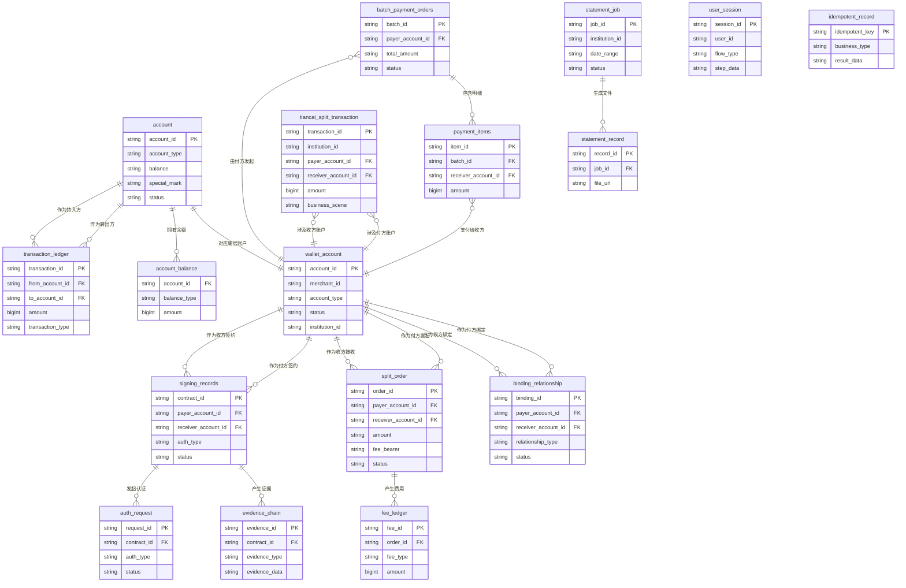

## 5.1 ER图

## 5.2 表结构

| 表名 | 所属模块 | 主要字段（简述） | 关联关系（简述） |
| :--- | :--- | :--- | :--- |
| wallet_account | 行业钱包 | 账户ID(PK)、商户ID、账户类型、状态、机构号 | 与`account`表一对一关联；与`binding_relationship`表一对多（作为付方/收方）；与`split_order`表一对多（作为付方/收方） |
| binding_relationship | 行业钱包 | 绑定关系ID(PK)、付方账户ID(FK)、收方账户ID(FK)、关系类型、状态 | 关联`wallet_account`表（付方和收方） |
| split_order | 行业钱包 | 订单ID(PK)、付方账户ID(FK)、收方账户ID(FK)、金额、手续费承担方、状态 | 关联`wallet_account`表（付方和收方）；关联`fee_ledger`表 |
| idempotent_record | 行业钱包 | 幂等键(PK)、业务类型、结果数据 | TBD |
| account | 账户系统 | 账户ID(PK)、账户类型、余额、特殊标记、状态 | 与`wallet_account`表一对一关联；与`account_balance`表一对多；与`transaction_ledger`表一对多（转出/转入） |
| account_balance | 账户系统 | 账户ID(FK)、余额类型、金额 | 关联`account`表 |
| transaction_ledger | 账户系统 | 交易流水ID(PK)、转出账户ID(FK)、转入账户ID(FK)、金额、交易类型 | 关联`account`表（转出方和转入方） |
| account_freeze_record | 账户系统 | TBD | TBD |
| signing_records | 电子签约平台 | 签约ID(PK)、付方账户ID(FK)、收方账户ID(FK)、认证类型、状态 | 关联`wallet_account`表（付方和收方）；关联`evidence_chain`表；关联`auth_request`表 |
| evidence_chain | 电子签约平台 | 证据ID(PK)、签约ID(FK)、证据类型、证据数据 | 关联`signing_records`表 |
| sms_template_config | 电子签约平台 | TBD | TBD |
| h5_template_config | 电子签约平台 | TBD | TBD |
| auth_request | 认证系统 | 请求ID(PK)、签约ID(FK)、认证类型、状态 | 关联`signing_records`表 |
| payment_verification | 认证系统 | TBD | TBD |
| face_verification | 认证系统 | TBD | TBD |
| fee_ledger | 计费中台 | 费用ID(PK)、订单ID(FK)、费用类型、金额 | 关联`split_order`表 |
| statement_job | 对账单系统 | 任务ID(PK)、机构号、日期范围、状态 | 关联`statement_record`表 |
| statement_record | 对账单系统 | 记录ID(PK)、任务ID(FK)、文件URL | 关联`statement_job`表 |
| tiancai_split_transaction | 业务核心 | 交易ID(PK)、机构号、付方账户ID(FK)、收方账户ID(FK)、金额、业务场景 | 关联`wallet_account`表（付方和收方） |
| batch_payment_orders | 代付系统 | 批次ID(PK)、付方账户ID(FK)、总金额、状态 | 关联`wallet_account`表；关联`payment_items`表 |
| payment_items | 代付系统 | 明细ID(PK)、批次ID(FK)、收方账户ID(FK)、金额 | 关联`batch_payment_orders`表；关联`wallet_account`表 |
| user_session | 钱包APP/商服平台 | 会话ID(PK)、用户ID、流程类型、步骤数据 | TBD |
| api_cache | 钱包APP/商服平台 | TBD | TBD |
| idempotency_key | 钱包APP/商服平台 | TBD | TBD |
| 商户信息表 | 三代 | TBD | TBD |
| 计费配置表 | 三代 | TBD | TBD |
| 机构信息表 | 三代 | TBD | TBD |
| transaction_log | 账务核心 | TBD | TBD |