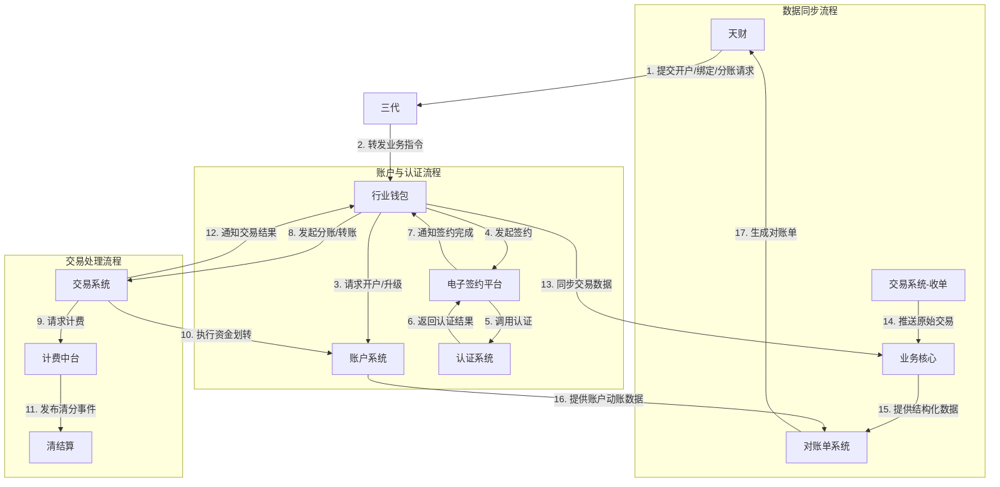
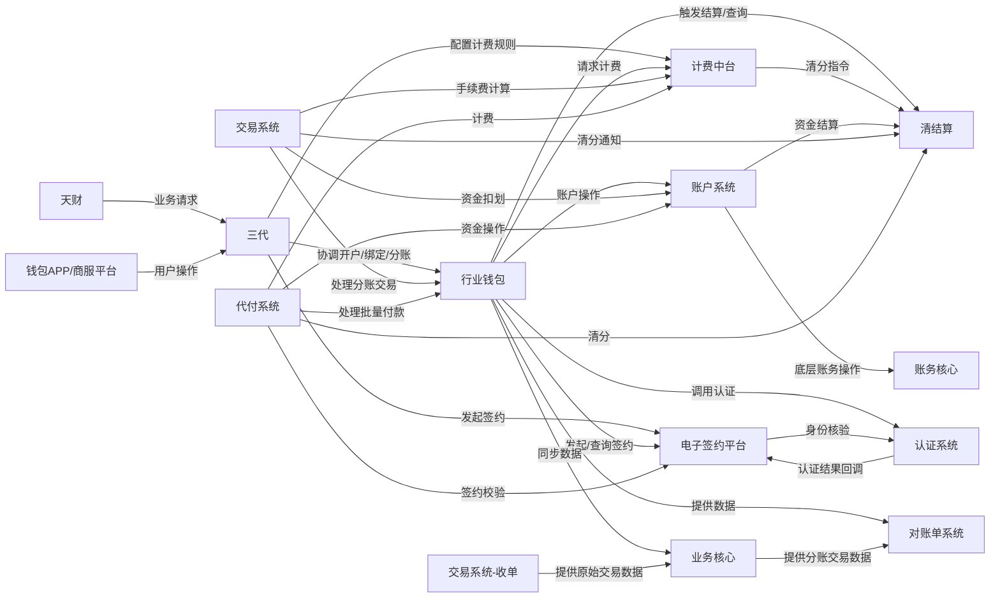

## 2.1 系统结构
本系统采用分层架构，旨在为天财分账业务提供从外部接入、业务处理到底层账户操作的全链路支持。系统以三代作为核心接入与管控层，以行业钱包（分账核心）作为业务处理中枢，通过调用或协同多个内部专业系统（如账户系统、电子签约平台、认证系统等）完成开户、关系绑定、分账、结算等核心业务流程。整体架构遵循职责分离原则，确保各系统专注于其核心能力。

```mermaid
graph TB
    subgraph "外部接入层"
        T[天财合作方]
        W[钱包APP/商服平台]
    end

    subgraph "业务接入与管控层"
        G[三代系统]
    end

    subgraph "业务处理层"
        HW[行业钱包<br/>(分账核心)]
        ES[电子签约平台]
        AS[认证系统]
        FS[计费中台]
        TS[交易系统]
        BS[代付系统]
        BC[业务核心]
    end

    subgraph "核心服务层"
        ACS[账户系统]
        CL[清结算]
        AC[账务核心]
    end

    subgraph "数据与报表层"
        SS[对账单系统]
    end

    subgraph "基础服务层"
        P[交易系统<br/>(收单)]
    end

    T --> G
    W --> G
    G --> HW
    G --> ES
    G --> FS
    HW --> ACS
    HW --> ES
    HW --> AS
    HW --> FS
    HW --> CL
    HW --> BC
    HW --> SS
    ES --> AS
    TS --> HW
    TS --> ACS
    TS --> FS
    TS --> CL
    TS --> BC
    BS --> HW
    BS --> ES
    BS --> ACS
    BS --> FS
    BS --> CL
    BS --> BC
    ACS --> CL
    FS --> CL
    BC --> SS
    P --> BC
    ACS --> AC
```

## 2.2 功能结构
系统功能围绕天财分账业务的核心流程进行组织，主要划分为商户与账户管理、关系绑定与认证、分账交易处理、资金结算与清分、以及数据服务五大功能域。

```mermaid
graph TD
    Root[天财分账系统功能]

    Root --> A[商户与账户管理]
    Root --> B[关系绑定与认证]
    Root --> C[分账交易处理]
    Root --> D[资金结算与清分]
    Root --> E[数据服务]

    A --> A1[商户入网审核]
    A --> A2[账户开户]
    A --> A3[账户信息维护]

    B --> B1[协议签署]
    B --> B2[身份认证<br/>(打款/人脸)]
    B --> B3[绑定关系管理]

    C --> C1[分账指令处理]
    C --> C2[批量付款处理]
    C --> C3[手续费计算]
    C --> C4[交易状态管理]

    D --> D1[主动/被动结算]
    D --> D2[手续费清分]
    D --> D3[资金划转]

    E --> E1[交易数据提供]
    E --> E2[对账单生成]
```

## 2.3 网络拓扑图
TBD

## 2.4 数据流转
数据在系统各模块间按业务流程定向流转。核心数据流包括：商户/账户信息流、关系绑定流、分账交易流、资金流及对账数据流。天财通过三代发起业务请求，数据经行业钱包协调，在账户系统、认证系统等模块间处理，最终由对账单系统聚合输出。



## 2.5 系统模块交互关系
模块间主要通过同步API调用和异步事件进行交互。三代是主要的外部请求入口和协调者。行业钱包是核心的业务处理器，与最多数量的下游系统交互。账户系统、电子签约平台、认证系统等提供原子化的专业服务。

