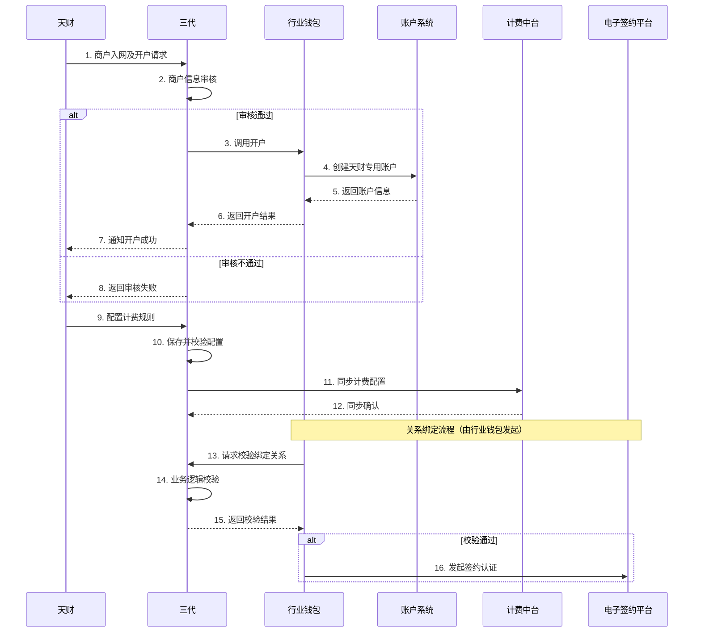

# 模块设计: 三代

生成时间: 2026-01-26 16:43:00
批判迭代: 2

---

# 三代模块设计文档

## 1. 概述
- **目的与范围**: 本模块是拉卡拉内部核心业务处理系统，作为天财业务与内部系统交互的关键枢纽。核心职责包括：接收并审核天财发起的商户入网请求；作为协调者，调用行业钱包完成天财专用账户的开户流程；为行业钱包提供关系绑定所需的业务接口；以及管理分账业务的计费规则配置。本模块不直接处理底层账户创建或关系绑定的具体校验逻辑，而是负责业务流程的编排与核心业务数据的维护。

## 2. 接口设计
- **API端点 (REST/GraphQL)**: TBD
    - 商户入网审核接口
    - 计费配置管理接口
    - 业务状态查询接口
- **请求/响应结构**: TBD
- **发布/消费的事件**: TBD
    - 发布事件：商户审核通过事件、计费规则变更事件。
    - 消费事件：TBD。

## 3. 数据模型
- **表/集合**: TBD
    - 商户信息表：存储天财提交的商户入网资料及审核状态。
    - 计费配置表：存储为不同天财或业务场景配置的分账手续费规则。
    - 机构信息表：存储分配给天财的机构号及其权限范围。
- **关键字段**: TBD
    - 商户信息表：商户ID、机构号、商户类型（总部/门店）、审核状态、资质文件URL、创建时间。
    - 计费配置表：配置ID、机构号、业务场景、手续费承担方（付方/收方）、费率、生效时间。
- **与其他模块的关系**: 本模块维护的商户审核状态和计费配置是行业钱包执行开户、关系绑定及分账计费的基础。本模块通过接口为行业钱包提供关系绑定的业务入口。

## 4. 业务逻辑
- **核心工作流/算法**:
    1.  **商户入网审核流程**：接收天财的商户入网请求，校验请求基础格式与必填字段。根据预设规则（如资质文件完整性、黑名单检查）进行自动化初审，对于需人工复核的案例，流转至运营后台。审核结果（通过/拒绝）更新至数据库，并通知相关系统。
    2.  **开户调用协调流程**：在商户审核通过后，本模块将开户请求转发至行业钱包模块，由行业钱包负责具体的开户逻辑并与账户系统交互。本模块记录开户请求的关联关系并跟踪最终状态。
    3.  **关系绑定接口提供**：本模块提供一个标准的业务接口，供行业钱包在需要执行关系绑定的业务逻辑时调用。此接口负责校验业务层面的绑定关系合法性（例如，根据机构号校验付方是否有权绑定该收方），然后调用电子签约平台发起签约认证流程。
    4.  **计费配置流程**：运营人员可通过管理界面为特定天财机构配置分账业务的手续费规则（包括业务场景、承担方、费率）。配置生效后，本模块将同步给计费中台，并在行业钱包发起分账时提供计费依据。
- **业务规则与验证**:
    - 商户入网审核：校验商户资质文件的必要性与格式；同一商户在不同天财平台下的唯一性校验。
    - 关系绑定校验：校验绑定双方（付方与收方）是否属于同一机构号下；校验绑定的业务场景（如归集、开通付款）是否被允许。
    - 计费配置：校验同一机构号下相同业务场景的计费规则不能冲突（如生效时间重叠）。
- **关键边界情况处理**:
    - 审核过程中资质文件缺失：返回明确错误，要求天财补充。
    - 开户调用后行业钱包返回处理中状态：本模块异步轮询或接收回调以更新最终状态。
    - 计费配置同步至计费中台失败：触发告警，并重试同步机制。

## 5. 时序图

## 6. 错误处理
- **预期错误情况**:
    1.  商户资质不全或无效。
    2.  下游系统（行业钱包、计费中台）调用失败或超时。
    3.  关系绑定请求中的业务参数非法（如双方无关联）。
    4.  计费配置数据冲突或同步失败。
- **处理策略**:
    - 输入校验错误：立即失败，向调用方返回具体的业务错误码和描述。
    - 下游调用失败：采用指数退避策略进行重试（如对开户调用重试3次）。对计费中台等非实时核心依赖，配置异步重试队列。若持续失败，触发熔断机制，并产生系统告警。
    - 状态一致性：对于开户等异步流程，通过持久化状态机和定期对账机制保证最终一致性。
    - 日志记录：所有业务操作、外部调用及异常均记录结构化日志，便于追踪。

## 7. 依赖关系
- **上游模块**: 天财（业务请求源）。
- **下游模块**:
    - 行业钱包：委托其处理开户、关系绑定的具体执行。
    - 计费中台：同步计费配置信息。
    - 电子签约平台：在关系绑定流程中，被行业钱包调用以完成签约认证（本模块不直接依赖，但流程涉及）。
- **关键依赖说明**: 本模块强依赖于行业钱包以完成核心业务操作，需确保双方接口契约的稳定性和故障隔离。