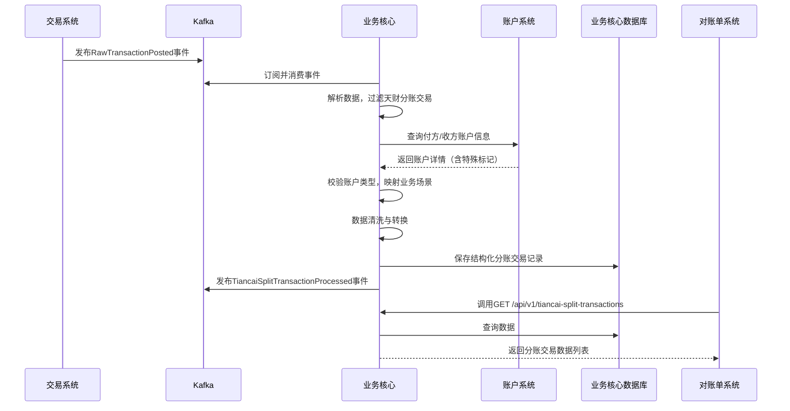

# 模块设计: 业务核心

生成时间: 2026-01-26 16:43:33
批判迭代: 2

---

# 业务核心模块设计文档

## 1. 概述
- **目的与范围**：本模块负责接收来自支付交易的原始数据，并根据天财分账业务规则进行处理与转换。其核心职责是为下游的对账单系统提供结构化的天财分账交易数据，以支持对账单的生成。模块的边界止于数据处理与提供，不涉及账户操作、关系绑定或计费等核心业务逻辑。**为完成数据清洗与业务关联，本模块需依赖账户系统查询账户信息，此操作为数据查询，不涉及账户状态变更。**

## 2. 接口设计
- **数据接入接口**：本模块通过消费Kafka消息队列接收上游交易系统推送的原始交易流水数据。主题名称为 `TBD`。
- **数据提供接口**：本模块通过REST API为下游对账单系统提供处理后的天财分账交易数据。
    - **端点**：`GET /api/v1/tiancai-split-transactions`
    - **请求参数**：`institutionNo` (机构号，必填)， `startTime`, `endTime` (时间范围，必填)， `page`, `size` (分页参数)。
    - **响应结构**：返回分页后的天财分账交易记录列表，每条记录包含交易ID、付方账户、收方账户、金额、状态、交易时间、机构号等字段。
- **发布/消费的事件**：
    - **消费**：交易系统发布的 `RawTransactionPosted` 事件（事件结构TBD），包含原始交易流水。
    - **发布**：本模块在处理完成后发布 `TiancaiSplitTransactionProcessed` 事件（事件结构TBD），供下游对账单系统或其他关注方订阅。

## 3. 数据模型
- **核心数据表**：`tiancai_split_transaction`
- **关键字段**：
    - `id`：主键，自增。
    - `original_transaction_id`：原始交易流水ID。
    - `transaction_type`：交易类型（固定为“天财分账”）。
    - `payer_account_no`：付方账户号。
    - `payer_account_type`：付方账户类型（天财收款账户/天财接收方账户）。
    - `receiver_account_no`：收方账户号。
    - `receiver_account_type`：收方账户类型（天财收款账户/天财接收方账户）。
    - `amount`：交易金额。
    - `fee`：手续费。
    - `fee_payer`：手续费承担方（付方/收方）。
    - `status`：处理状态（待处理、成功、失败）。
    - `institution_no`：机构号。
    - `business_scenario`：业务场景（门店分账/会员结算/批量付款/TBD）。
    - `transaction_time`：交易时间。
    - `processed_time`：本模块处理完成时间。
    - `error_message`：处理失败时的错误信息。
- **与其他模块的关系**：本模块处理的数据源自上游交易系统（通过事件），处理过程中需查询账户系统以获取账户类型标记，处理后的数据存储于本地数据库并供下游对账单系统消费。

## 4. 业务逻辑
- **数据接入机制**：模块启动Kafka消费者，持续监听 `RawTransactionPosted` 事件。采用至少一次（at-least-once）的消费语义，确保数据不丢失。
- **核心处理流程**：
    1.  **数据解析与过滤**：解析事件中的原始交易数据。仅当 `transaction_type` 字段为“天财分账”时，进入后续流程。
    2.  **账户信息查询与校验**：调用账户系统接口，根据原始交易中的付方与收方账户号查询账户详情。校验返回的账户信息中是否包含“天财专用账户”的特殊标记。若任一账户非天财专用账户，则标记为无效交易。
    3.  **业务场景映射**：根据付方与收方的账户类型、机构号以及可能的附加业务字段，将交易映射到具体的业务场景。
        - **规则示例（TBD）**：
            - 若付方为“总部”天财收款账户，收方为“门店”天财收款账户，可能映射为“会员结算”。
            - 若付方为“门店”天财收款账户，收方为“总部”天财收款账户，可能映射为“门店分账（归集）”。
            - 若付方为天财收款账户，收方为多个天财接收方账户，可能映射为“批量付款”。
    4.  **数据清洗与转换**：将原始交易字段映射并转换为 `tiancai_split_transaction` 表的结构化字段。补充机构号、业务场景等衍生信息。
    5.  **数据持久化与发布**：将处理成功的记录存入数据库，状态置为“成功”，并发布 `TiancaiSplitTransactionProcessed` 事件。处理失败的记录存入数据库，状态置为“失败”，并记录错误原因。
- **关键边界情况处理**：
    - **原始数据异常**：数据格式错误或关键字段缺失，记录错误日志，该条数据状态置为“失败”。
    - **账户查询失败**：调用账户系统超时或返回异常，进行有限次重试。若最终失败，记录为“待处理”状态，由后台任务定期补偿查询。
    - **场景映射未知**：无法根据现有规则映射到明确业务场景时，标记场景为“TBD”，但不阻断流程，数据正常落库供后续分析。

## 5. 时序图

## 6. 错误处理
- **预期错误情况**：
    1.  Kafka消息反序列化失败。
    2.  调用账户系统接口超时或返回5xx错误。
    3.  账户系统返回的账户信息中无天财专用账户标记。
    4.  数据库写入失败。
- **处理策略**：
    - **数据源错误**：反序列化失败时，记录死信消息，告警通知。流程级错误通过消费者组偏移量管理进行重试。
    - **依赖服务错误**：对账户系统调用配置熔断器，防止雪崩。失败请求记录原始数据ID，进入异步重试队列。
    - **业务逻辑错误**：如账户校验不通过，视为单条数据处理失败，更新记录状态为“失败”并记录原因，不影响其他数据处理。
    - **持久化错误**：数据库操作失败进行重试，若持续失败则告警。

## 7. 依赖关系
- **上游模块**：
    - **交易系统**：提供原始交易数据（通过Kafka事件）。
    - **账户系统**：提供账户信息查询服务，用于校验账户类型和获取业务属性。
- **下游模块**：
    - **对账单系统**：通过API消费本模块处理后的结构化天财分账交易数据。
    - **其他系统**：可能订阅 `TiancaiSplitTransactionProcessed` 事件。