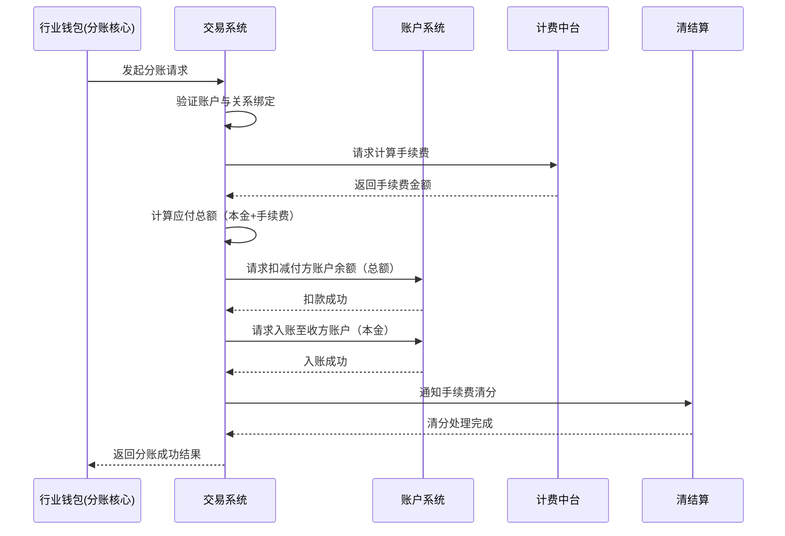

# 模块设计: 交易系统

生成时间: 2026-01-26 16:43:21
批判迭代: 2

---

# 交易系统模块设计文档

## 1. 概述
- **目的与范围**: 本模块负责处理天财分账业务的交易流程，包括接收分账请求、执行资金划转、处理手续费、生成交易记录，并与账户系统、清结算、计费中台等核心系统进行交互，确保分账交易的准确性和一致性。

## 2. 接口设计
- **API端点 (REST/GraphQL)**: TBD
- **请求/响应结构**: TBD
- **发布/消费的事件**: TBD

## 3. 数据模型
- **表/集合**: TBD
- **关键字段**: TBD
- **与其他模块的关系**: 交易系统依赖账户系统进行账户余额操作，依赖清结算进行手续费清分，依赖计费中台获取计费规则，并为对账单系统提供天财分账交易数据。

## 4. 业务逻辑
- **核心工作流/算法**: 接收来自行业钱包的分账请求，验证付方与收方关系绑定状态，调用账户系统进行资金扣划与入账，根据手续费承担方调用计费中台计算手续费，并通知清结算进行手续费清分。
- **业务规则与验证**: 验证交易双方是否为有效的天财专用账户，验证分账金额是否超过付方账户可用余额，验证手续费承担方（付方或收方）的合法性。
- **关键边界情况处理**: 处理账户余额不足、关系绑定失效、手续费计算失败、清结算处理超时等异常场景，确保交易状态可追溯与可冲正。

## 5. 时序图

## 6. 错误处理
- **预期错误情况**: 付方账户余额不足、付方或收方账户状态异常（如冻结）、关系绑定已失效、手续费计算失败、与下游系统（账户系统、清结算）通信超时或失败。
- **处理策略**: 对可重试错误（如网络超时）进行有限次重试；对业务逻辑错误（如余额不足）立即失败并返回明确错误码；记录详细的交易日志用于对账与问题排查；支持交易冲正流程以处理最终失败场景。

## 7. 依赖关系
- **上游模块**: 行业钱包（分账核心）、账户系统、计费中台、清结算。
- **下游模块**: 对账单系统、业务核心。