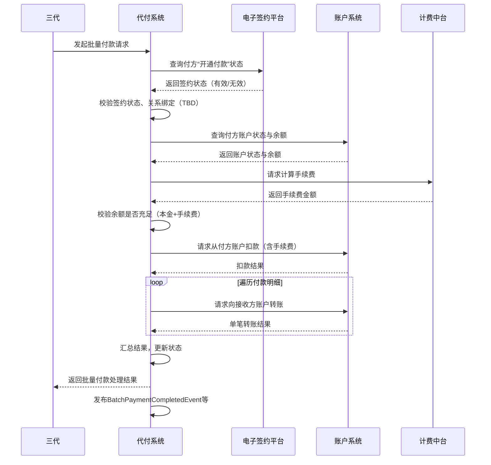

# 模块设计: 代付系统

生成时间: 2026-01-26 16:43:39
批判迭代: 2

---

# 代付系统 模块设计文档

## 1. 概述
- **目的与范围**: 本模块负责处理由上游业务系统发起的批量付款（批付）业务。核心职责包括接收并处理批量付款指令，协调账户系统进行资金划转，与计费中台交互处理手续费，并确保交易状态同步。本模块通过发布事件的方式，将交易结果数据同步给下游清结算、对账单等系统。

## 2. 接口设计
- **API端点 (REST/GraphQL)**:
    - `POST /api/v1/batch-payments`: 接收批量付款指令。
- **请求/响应结构**:
    - **请求体 (BatchPaymentRequest)**:
        - `batchId`: 批次号
        - `payerId`: 付方ID（总部/门店）
        - `payerAccountNo`: 付方天财收款账户号
        - `feeBearer`: 手续费承担方 (PAYER/RECEIVER)
        - `items`: 付款明细列表
            - `receiverId`: 接收方ID
            - `receiverAccountNo`: 接收方账户号
            - `amount`: 转账金额
    - **响应体 (BatchPaymentResponse)**:
        - `batchId`: 批次号
        - `status`: 批次状态 (PROCESSING/SUCCESS/PARTIAL_SUCCESS/FAILED)
        - `totalCount`: 总笔数
        - `successCount`: 成功笔数
        - `failCount`: 失败笔数
        - `failReasons`: 失败原因列表（可选）
- **发布/消费的事件**:
    - **发布事件**:
        - `BatchPaymentCompletedEvent`: 批量付款处理完成事件。包含批次ID、状态、总金额、手续费、成功/失败明细。
        - `PaymentItemSettledEvent`: 单笔付款结算事件。包含付款明细ID、金额、手续费、状态。
    - **消费事件**: TBD

## 3. 数据模型
- **表/集合**:
    - `batch_payment_orders` (批量付款订单表)
    - `payment_items` (付款明细表)
- **关键字段**:
    - **batch_payment_orders**:
        - `id` (主键)
        - `batch_id` (批次号)
        - `payer_id` (付方ID)
        - `payer_account_no` (付方账户号)
        - `fee_bearer` (手续费承担方)
        - `total_amount` (总金额)
        - `total_fee` (总手续费)
        - `status` (批次状态)
        - `request_system` (请求来源系统，如“三代”)
        - `created_at`, `updated_at`
    - **payment_items**:
        - `id` (主键)
        - `batch_order_id` (外键，关联 batch_payment_orders.id)
        - `item_id` (明细项ID)
        - `receiver_id` (接收方ID)
        - `receiver_account_no` (接收方账户号)
        - `amount` (金额)
        - `fee` (手续费)
        - `status` (明细状态)
        - `fail_reason` (失败原因)
        - `created_at`, `updated_at`
- **与其他模块的关系**: 依赖账户系统进行账户操作，依赖计费中台进行手续费计算，依赖电子签约平台验证“开通付款”状态。通过事件向业务核心和对账单系统提供交易数据。

## 4. 业务逻辑
- **核心工作流/算法**:
    1.  接收批量付款请求。
    2.  调用电子签约平台，验证付方（总部/门店）是否已完成“开通付款”签约认证。
    3.  调用账户系统，验证付方天财收款账户状态及余额（含预估手续费）是否充足。
    4.  调用计费中台，根据“手续费承担方”规则计算总手续费及明细手续费。
    5.  调用账户系统，从付方账户扣款（本金+手续费）。
    6.  遍历付款明细，调用账户系统向各接收方账户转账。
    7.  汇总处理结果，更新批次及明细状态。
    8.  发布批次完成事件及明细结算事件。
- **业务规则与验证**:
    - 验证付方与接收方之间是否存在有效的关系绑定（需调用行业钱包或依赖上游校验）。
    - 验证付方天财收款账户状态正常且余额充足。
    - 校验“手续费承担方”字段的有效性（PAYER/RECEIVER）。
    - 验证付方已完成“开通付款”签约认证（调用电子签约平台）。
- **关键边界情况处理**:
    - **部分成功、部分失败**: 当批量付款中部分明细失败时，标记批次状态为`PARTIAL_SUCCESS`。已成功的转账不做自动冲正。失败的明细记录具体原因。整个批次视为已完成处理，并向请求方返回包含成功与失败明细的汇总结果。
    - **资金操作补偿**: 若从付方账户扣款成功，但后续向接收方转账时发生系统性失败，需记录异常状态并触发人工或定时任务进行对账与差错处理，不在此模块内实现自动冲正。
    - **依赖服务异常**: 调用电子签约平台、账户系统、计费中台失败时，整个批次标记为`FAILED`，并记录具体失败原因。

## 5. 时序图

## 6. 错误处理
- **预期错误情况**:
    - 付方“开通付款”签约状态无效。
    - 付方账户余额不足。
    - 付方与接收方关系绑定无效。
    - 接收方账户状态异常。
    - 手续费计算失败。
    - 账户系统扣款或转账失败。
    - 网络超时或依赖服务不可用。
- **处理策略**:
    - 前置校验失败（如签约状态、余额不足、关系绑定），整个批次立即失败，向请求方返回明确错误码和原因。
    - 资金操作（扣款、转账）过程中失败，该笔明细失败，记录原因，批次继续处理其他明细。
    - 对于部分失败的批次，在响应中明确列出成功与失败的明细及原因。
    - 所有失败操作均记录详细日志，用于对账与排查。

## 7. 依赖关系
- **上游模块**:
    - **三代**: 提供批量付款业务指令与配置，是本模块主要的请求来源。
    - **行业钱包**: 可能传递分账相关指令或状态，并提供关系绑定校验接口（具体方式TBD）。
    - **电子签约平台**: 提供“开通付款”签约状态的查询接口。
- **下游模块**:
    - **账户系统**: 执行资金扣款与转账操作。
    - **计费中台**: 提供手续费计算服务。
    - **清结算**: 消费本模块发布的`PaymentItemSettledEvent`事件，进行手续费清分。
    - **业务核心/对账单系统**: 消费本模块发布的事件，获取天财分账交易数据，用于生成对账单。