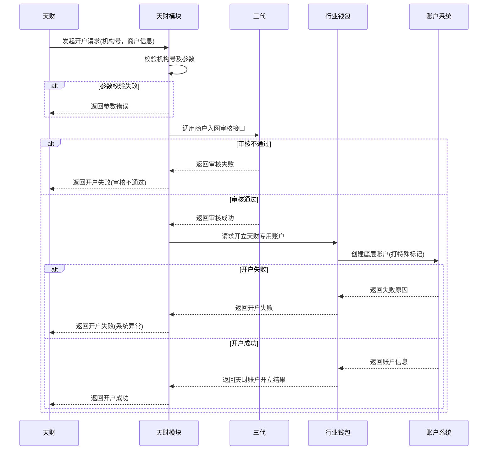
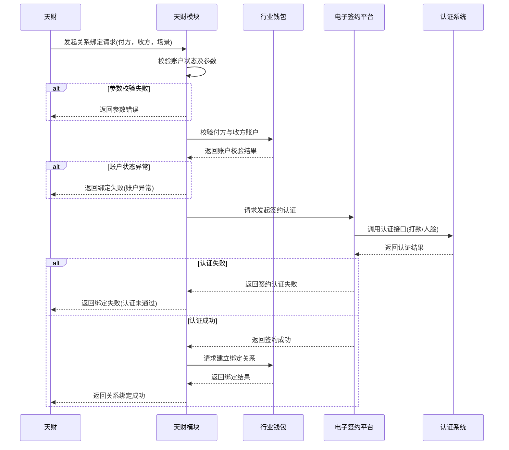
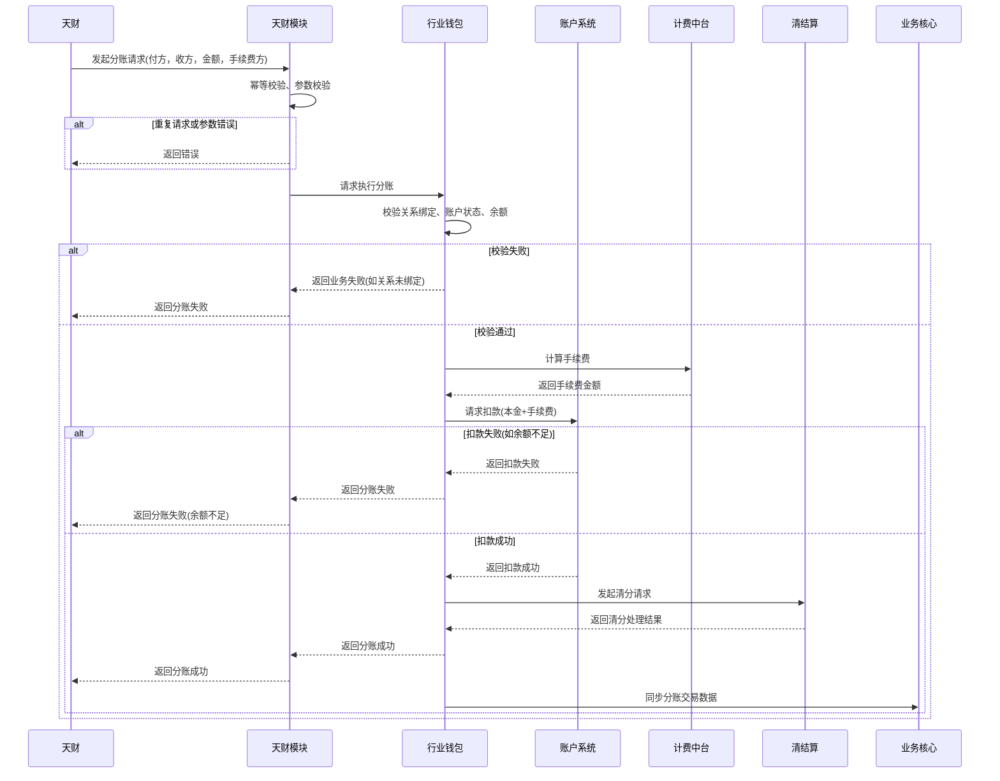

# 模块设计: 天财

生成时间: 2026-01-26 16:43:42
批判迭代: 2

---

# 天财模块设计文档

## 1. 概述
- **目的与范围**: 本模块是面向“天财”合作方的业务入口，负责接收并处理其发起的开户、关系绑定、分账等业务指令。它作为前端接口层，将天财的业务请求转换为内部系统（如三代、行业钱包）可处理的格式，并协调各内部系统完成业务闭环。其边界止于对内部系统的调用，不包含底层账户、清结算等核心业务逻辑的实现。

## 2. 接口设计
- **API端点 (REST/GraphQL)**: TBD
- **请求/响应结构**: TBD
- **发布/消费的事件**: TBD

## 3. 数据模型
- **表/集合**: TBD
- **关键字段**: TBD
- **与其他模块的关系**: TBD

## 4. 业务逻辑
- **核心工作流/算法**:
    1.  **开户流程**: 接收天财的开户请求，校验机构号。调用三代系统进行商户入网审核。审核通过后，调用行业钱包系统，由其协调账户系统，为商户开立带有特殊标记的“天财收款账户”或“天财接收方账户”。
    2.  **关系绑定流程**: 接收天财的关系绑定请求，校验付方与收方账户状态。调用电子签约平台，由其配置并引导用户完成协议签署，并调用认证系统完成打款验证或人脸验证。认证通过后，调用行业钱包系统完成付方与收方账户的关系绑定。
    3.  **分账/转账流程**: 接收天财的分账请求，校验付方与收方的关系绑定状态、账户状态及余额。调用行业钱包系统发起“天财分账”交易。行业钱包调用账户系统进行扣款，并可能联动计费中台计算手续费、清结算系统进行资金清分。交易完成后，业务核心接收交易数据，对账单系统生成对账单。
- **业务规则与验证**:
    1.  校验请求中“机构号”的合法性。
    2.  根据业务场景（门店分账/归集、会员结算、批量付款）校验付方与收方的账户类型及关系绑定状态。
    3.  校验分账金额、手续费承担方等参数的合法性。
    4.  对于“开通付款”场景，需额外完成签约认证流程。
- **关键边界情况处理**:
    1.  处理重复请求，通过幂等性设计防止重复开户或重复分账。
    2.  处理异步处理过程中的超时与状态同步问题，提供异步查询接口。
    3.  处理因底层系统（如账户系统、清结算）异常导致的业务失败，记录详细日志并触发告警，支持人工介入或补偿机制。

## 5. 时序图

### 5.1 开户时序图

### 5.2 关系绑定时序图

### 5.3 分账时序图

## 6. 错误处理
- **预期错误情况**:
    1.  请求参数校验失败（如机构号无效、信息不全、金额非法）。
    2.  三代商户入网审核不通过。
    3.  行业钱包或账户系统开户失败（如账户已存在、系统异常）。
    4.  关系绑定时认证失败（打款验证/人脸验证未通过）。
    5.  分账时前置校验失败（如关系未绑定、账户状态异常）。
    6.  分账时核心处理失败（如付方余额不足、账户系统扣款异常）。
    7.  下游依赖系统（清结算、计费中台等）处理超时或异常。
- **处理策略**:
    1.  **参数与业务错误**: 立即返回明确的错误码和错误信息给天财。
    2.  **依赖系统业务失败**: 捕获下游系统返回的错误码，转换为对天财友好的错误信息并返回。
    3.  **系统级异常与超时**:
        - 记录详细的错误日志，并触发监控告警。
        - 对于可重试的异常（如网络超时），设计幂等接口供天财重试，或由后台任务进行有限次重试。
        - 对于复杂异步流程（如开户、绑定），提供业务流水号查询接口，供天财查询最终状态。
        - 对于因底层系统异常导致的中间状态（如已扣款但清分失败），记录异常单，支持人工对账与补偿处理。

## 7. 依赖关系
- **上游模块**: 天财（外部合作方）
- **下游模块**:
    - **三代**: 提供商户入网审核能力。
    - **行业钱包**: 提供天财专用账户管理、关系绑定校验、分账请求处理的核心能力。
    - **账户系统**: 提供底层账户的创建、扣款等操作。
    - **电子签约平台**: 提供协议签署流程管理与认证系统调用。
    - **认证系统**: 提供打款验证和人脸验证的身份核验能力。
    - **计费中台**: 提供分账交易的手续费计算能力。
    - **清结算**: 提供分账资金的清分与结算处理能力。
    - **业务核心**: 接收并存储分账交易数据。
    - **对账单系统**: 基于业务核心数据生成天财相关对账单。