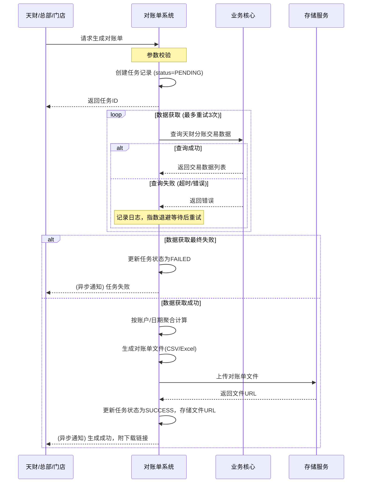

# 模块设计: 对账单系统

生成时间: 2026-01-26 16:43:22
批判迭代: 2

---

# 对账单系统模块设计文档

## 1. 概述
- **目的与范围**: 本模块负责生成天财机构层的各类账户和交易维度对账单。其核心职责是接收来自业务核心的天财分账交易数据，并基于这些数据为天财、总部、门店等角色生成结构化的对账文件。其边界限定于对账单的生成与提供，不涉及交易处理、账户操作或资金结算。

## 2. 接口设计
- **API端点 (REST/GraphQL)**:
    - `POST /api/v1/statements/generate`: 触发生成对账单任务。
    - `GET /api/v1/statements/{jobId}`: 查询对账单生成任务状态。
    - `GET /api/v1/statements/{jobId}/download`: 下载生成的对账单文件。
- **请求/响应结构**:
    - 生成请求 (`POST /api/v1/statements/generate`):
        - 请求体: `{ “institutionCode”: “string”, // 机构号 “accountType”: “string”, // 账户类型，如‘收款账户’、‘接收方账户’ “startDate”: “YYYY-MM-DD”, “endDate”: “YYYY-MM-DD” }`
        - 响应体: `{ “jobId”: “string”, // 任务ID “status”: “string” // 任务状态，如‘ACCEPTED’ }`
    - 查询任务状态响应 (`GET /api/v1/statements/{jobId}`):
        - 响应体: `{ “jobId”: “string”, “status”: “string”, // PENDING, PROCESSING, SUCCESS, FAILED “fileUrl”: “string”, // 成功时返回下载链接 “errorMessage”: “string” // 失败时返回错误信息 }`
- **发布/消费的事件**:
    - 消费事件: TBD (例如，消费业务核心发布的天财分账交易数据变更事件)。
    - 发布事件: TBD (例如，发布对账单生成成功或失败事件)。

## 3. 数据模型
- **表/集合**:
    - `statement_job` (对账单生成任务表): 存储每次生成任务的元数据。
    - `statement_record` (对账单记录表): 存储生成的对账单文件信息及关联的交易数据快照索引。
- **关键字段**:
    - `statement_job`:
        - `job_id` (主键)
        - `institution_code` (机构号)
        - `account_type` (账户类型)
        - `period_start` (对账周期开始日期)
        - `period_end` (对账周期结束日期)
        - `status` (任务状态)
        - `requested_at` (请求时间)
        - `completed_at` (完成时间)
        - `file_storage_path` (文件存储路径)
        - `error_log` (错误日志)
    - `statement_record`:
        - `record_id` (主键)
        - `job_id` (外键，关联`statement_job`)
        - `account_id` (账户ID)
        - `transaction_count` (交易笔数)
        - `total_amount` (总金额)
        - `total_fee` (总手续费)
        - `statement_data_snapshot_id` (交易数据快照引用ID)
- **与其他模块的关系**: 本模块依赖**业务核心**提供的天财分账交易数据。生成的对账单服务于天财、总部、门店等业务角色，通过文件下载链接或门户集成方式交付。

## 4. 业务逻辑
- **核心工作流/算法**:
    1.  **数据获取**: 根据请求参数（机构号、账户类型、日期范围），通过调用业务核心的查询接口（接口定义TBD）获取原始天财分账交易数据列表。数据应包含交易流水号、账户ID、交易金额、手续费、交易时间、交易状态等关键字段。
    2.  **数据聚合与计算**:
        - **聚合维度**: 按`机构号`、`账户ID`、`交易日期`进行分组。
        - **计算指标**: 对每个分组计算`交易总笔数`、`交易总金额`、`手续费总额`。对于跨日切的数据，按交易时间所属的结算日期进行归集。
    3.  **文件生成**: 使用开源库（如Apache POI for Excel，OpenCSV for CSV）将聚合计算结果生成为结构化文件。文件格式默认为CSV，包含表头：账户ID，交易日期，交易笔数，交易总金额，手续费总额。支持按需生成Excel格式。
    4.  **任务与存储**: 生成任务状态持久化至`statement_job`表，文件存储至对象存储或文件系统，路径记录在表中。聚合计算的明细快照索引存入`statement_record`表。
- **业务规则与验证**:
    - 对账数据需与业务核心的原始交易记录进行一致性校验，确保金额、笔数等关键信息准确无误。需根据机构号区分不同天财的业务数据。
    - 仅处理状态为“成功”的天财分账交易记录。
    - 日期范围请求不得超过系统配置的最大查询跨度（如31天）。
- **关键边界情况处理**:
    - 处理业务核心数据延迟或缺失的场景，需有重试与补偿机制。
    - 处理跨日切、跨结算周期的交易数据归集，以交易时间的自然日作为对账日期。

## 5. 时序图

## 6. 错误处理
- **预期错误情况**:
    1.  **业务核心服务不可用或查询超时**。
    2.  **返回的交易数据格式异常或关键字段缺失**。
    3.  **对账单生成过程中发生系统错误**（如磁盘空间不足、文件写入失败）。
    4.  **请求参数非法**（如机构号不存在、日期格式错误、日期范围超限）。
- **处理策略**:
    1.  **依赖服务调用失败**: 采用指数退避策略进行重试，最大重试次数为3次。重试全部失败后，任务标记为`FAILED`，记录详细错误日志并触发告警。
    2.  **数据格式错误**: 对单条异常数据记录日志并跳过，不影响其他正常数据的处理。如果异常数据比例超过阈值（如5%），则任务整体标记为`PARTIAL_SUCCESS`并告警；否则生成部分对账单。
    3.  **系统级错误**: 立即告警，流程中断，任务标记为`FAILED`。
    4.  **参数校验失败**: 在API层进行校验，立即返回`400 Bad Request`及具体的错误信息。

## 7. 依赖关系
- **上游模块**: **业务核心**（提供天财分账交易数据查询接口，具体接口契约TBD）。
- **下游模块**: **天财、总部、门店等角色**通过本系统提供的文件下载链接获取对账单，或通过门户系统集成展示（门户集成方式TBD）。