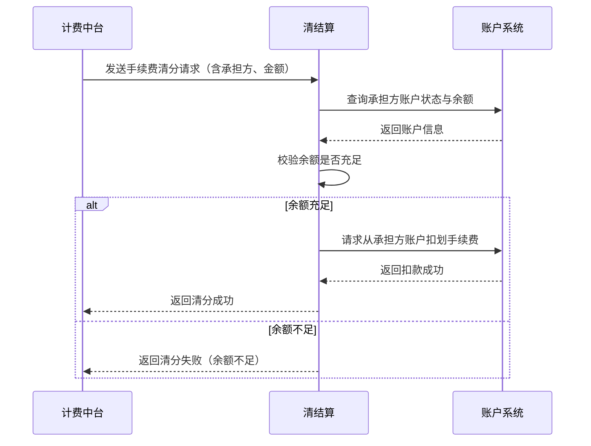
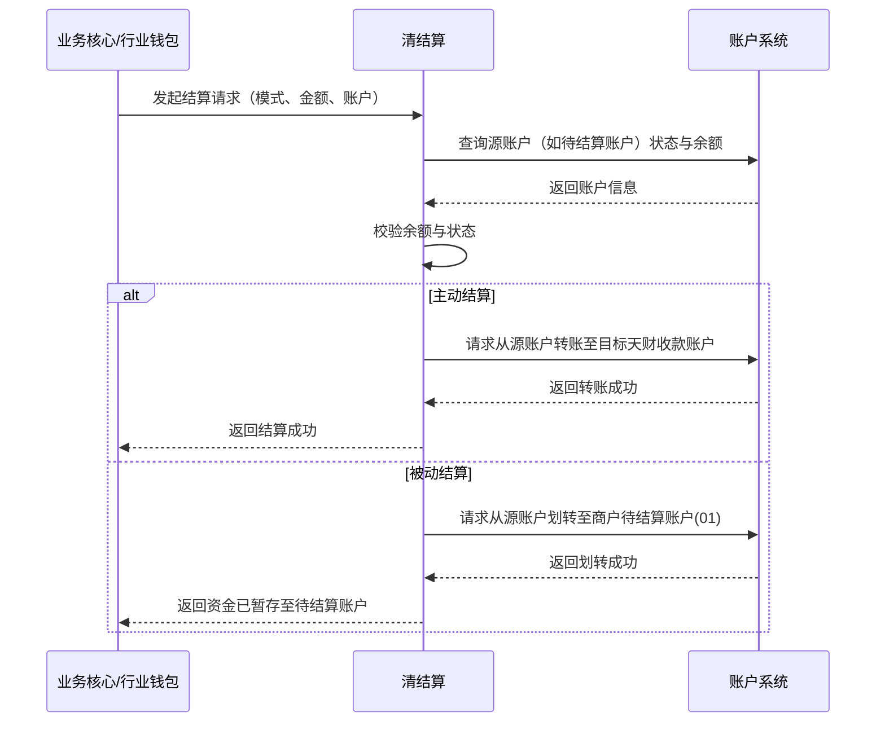
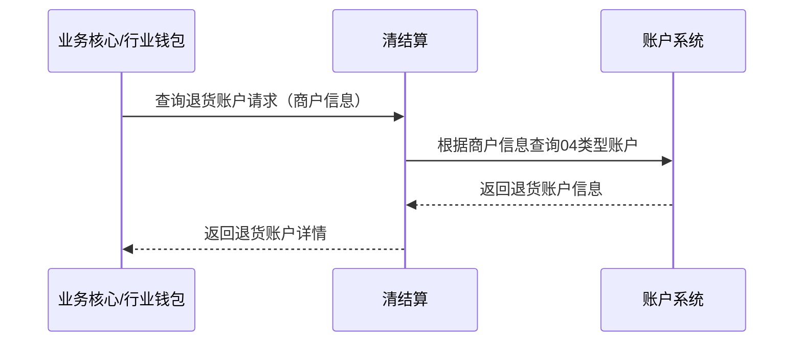
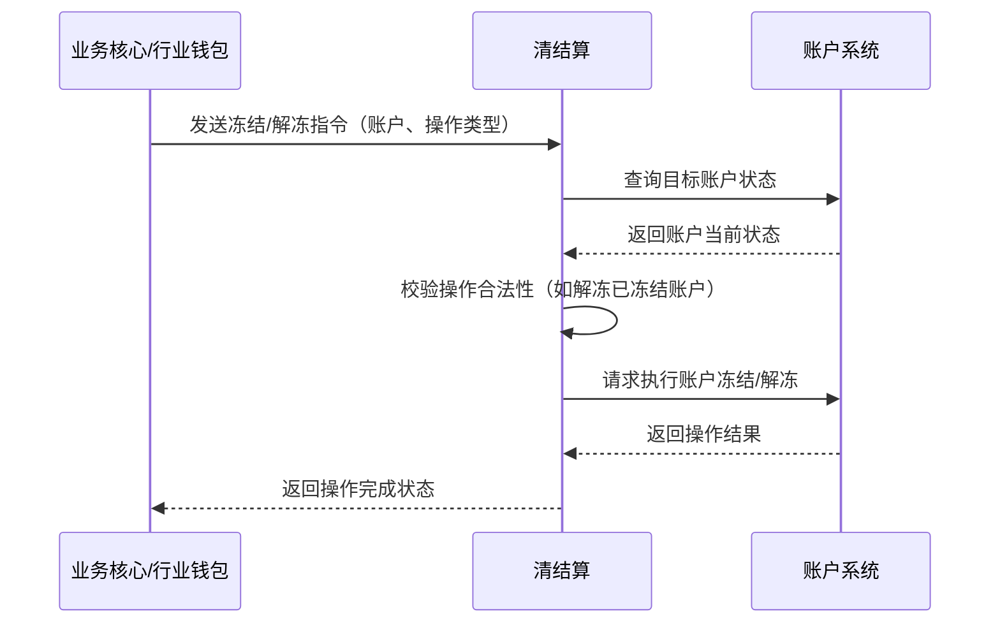

# 模块设计: 清结算

生成时间: 2026-01-26 16:43:10
批判迭代: 2

---

# 清结算系统设计文档

## 1. 概述
- **目的与范围**: 本系统负责处理与天财分账业务相关的清分、结算及账户查询等核心金融操作。核心职责包括：处理分账交易产生的手续费清分、支持专用账户的结算处理、提供退货账户查询功能、支持专用账户的冻结操作。其边界在于处理底层账户的资金流转与状态管理，不涉及业务发起、关系绑定或账户开立等上游流程。
- **架构定位**: 根据全局术语表，清结算是一个独立的内部系统，与账户系统、计费中台等系统并列。本设计文档描述该系统的内部模块化设计。

## 2. 接口设计
- **API端点 (REST/GraphQL)**: TBD
- **请求/响应结构**: TBD
- **发布/消费的事件**:
    - **消费事件**:
        - 计费中台发布的“手续费计费流水已生成”事件，触发手续费清分流程。
        - 业务核心或行业钱包发布的“结算指令”事件，触发结算处理。
        - 业务核心或行业钱包发布的“账户冻结/解冻指令”事件，触发账户状态变更。
    - **发布事件**:
        - “手续费清分完成”事件。
        - “结算处理完成”事件。
        - “账户状态已变更”事件。

## 3. 数据模型
- **表/集合**: TBD
- **关键字段**: TBD
- **与其他模块的关系**: 本系统依赖账户系统进行底层账户（如待结算账户、退货账户、天财专用账户）的余额查询、扣划、冻结等核心操作。数据模型设计需记录与账户系统交互的流水、状态及结果。

## 4. 业务逻辑
- **核心工作流/算法**:
    1.  **手续费清分**: 接收来自计费中台生成的手续费计费流水，根据“手续费承担方”（付方或收方）的配置，从指定的天财专用账户中完成手续费资金的扣划与清分。
        - **余额不足处理规则**: 若承担方账户余额不足，则清分失败。系统将记录失败原因，并向事件上游（计费中台）返回失败结果，建议终止关联的分账交易流程。
    2.  **结算处理**: 支持两种结算模式：
        - **主动结算**: 将交易资金直接结算至商户指定的天财收款账户。此模式通常用于实时性要求高的场景。
        - **被动结算**: 将交易资金先划入商户的待结算账户（01类型账户），等待商户后续发起结算指令。此模式通常用于资金归集后由商户自主决定结算时机的场景。
        - **模式选择规则**: 结算模式由上游业务请求方（如业务核心或行业钱包）在发起结算指令时明确指定。本系统根据指令中的模式字段执行相应逻辑。
        - **长期未结算处理策略**: 对于被动结算模式下，商户长时间未发起结算指令的资金，处理策略为TBD（例如，系统定时提醒、自动结算规则等）。
    3.  **退货账户查询**: 根据商户信息，查询其对应的退货账户（04类型账户），用于处理分账业务的退货资金流转。
    4.  **专用账户冻结支持**: 接收来自业务核心或行业钱包的指令，对指定的天财专用账户执行冻结或解冻操作。
- **业务规则与验证**:
    - 执行资金操作前，需校验目标账户状态是否正常（非冻结、非注销）。
    - 结算和清分操作需保证事务性与资金一致性。
    - 所有操作需记录详细的操作流水，用于对账与审计。

## 5. 时序图

### 5.1 手续费清分流程

### 5.2 结算处理流程

### 5.3 退货账户查询流程

### 5.4 专用账户冻结/解冻流程

## 6. 错误处理
- **预期错误情况**:
    - 账户不存在或状态异常（冻结、注销）。
    - 账户余额不足。
    - 下游系统（如账户系统）服务超时或不可用。
    - 请求参数不合法。
    - 操作指令与账户当前状态冲突（如解冻一个正常账户）。
- **处理策略**:
    - 对于账户状态、余额不足或指令冲突问题，返回明确的业务失败原因，并建议上游重试或终止流程。
    - 对于下游系统故障，采用有限次数的重试机制，并记录日志告警。若最终失败，向上游返回系统错误。
    - 所有失败操作需保证数据的一致性，必要时进行冲正或状态回滚。

## 7. 依赖关系
- **上游系统**:
    - **计费中台**: 提供手续费计费流水，触发清分流程。
    - **业务核心/行业钱包**: 发起结算、退货账户查询、账户冻结/解冻等请求。
- **下游系统**:
    - **账户系统**: 依赖其进行底层账户的查询、余额变动、冻结/解冻等核心操作。