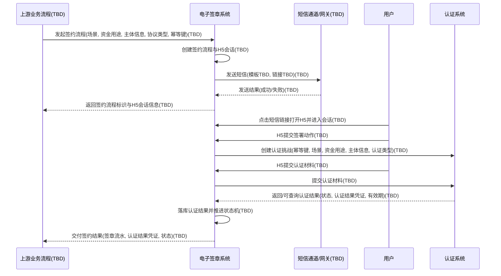

# 模块设计: 电子签章系统

生成时间: 2026-01-26 17:42:49
批判迭代: 2

---

# 模块设计：电子签章系统（电子签约平台）

生成时间：2026-01-26  
批判迭代：TBD

---

## 一、概述

### 1.1 目的与范围

电子签章系统用于在天财相关业务流程中完成“协议签署 + 认证编排 + 短信触达 + H5承载”的闭环能力，并向上游业务流程输出可消费的签约结果，用于驱动：

- **归集授权**：总部发起归集关系授权，触发短信/H5签约与认证。
- **关系绑定**：在归集、批量付款、会员结算等场景下建立绑定关系，并通过协议签署与认证使关系生效。
- **开通付款**：批量付款&会员结算场景下付方签署**代付授权协议**等文件并完成认证，使后续相关关系绑定可生效。

签约结果的“结果形态/字段/交付方式”：TBD（但必须包含“签署结果 + 认证结果凭证（来自认证系统）”的可追溯关联信息）。

### 1.2 职责边界与依赖澄清（与上游模块一致性修正）

- 电子签章系统**负责**：
  - **短信模板**配置与按场景触发短信发送（对公/对私差异）。
  - **H5**页面承载：封装签署与认证引导页面，通过短信链接打开。
  - **电子协议签章**编排：基于上送主体与业务要素生成签章流水并完成协议签署（签章细节：TBD）。
  - **认证编排**：按场景与主体类型选择并调用**认证系统**（打款验证/人脸验证），并**消费认证系统产出的认证结果/凭证**。
  - **结果转交**：将认证系统返回的“认证结果/凭证（形式TBD）”与签署结果进行关联落库，并按约定方式转交给上游业务流程（方式：TBD）。

- 电子签章系统**不负责**：
  - 认证能力本身（挑战生成、校验、结果管理由**认证系统**负责）。
  - 账户开立、账户能力控制、转账/分账执行、计费与清分、清结算处理、对账单生成。

---

## 二、接口设计

> 约束：上下文未提供既有接口规范与字段定义，因此**端点名称、字段名、事件主题与载荷均为 TBD**；但补齐“必须具备的接口能力、调用时机、幂等与交互模式（轮询/回调二选一的约束）”，避免集成语义空洞。

### 2.1 接口清单（能力级定义）

- 发起签约流程（生成签约流程、生成H5会话、触发短信发送）：TBD  
- 查询签约流程状态/结果（供上游轮询或页面刷新）：TBD  
- 短信重发（受频控与次数限制）：TBD  
- H5提交签署动作（确认阅读/签署确认等）：TBD  
- 发起认证（由电子签章系统调用认证系统创建挑战；对上游是否暴露该步骤：TBD）  
- 查询/接收认证结果并推进签约流程（轮询或回调承接：TBD）  
- 签约结果交付给上游业务流程（同步返回/回调/事件：TBD）

### 2.2 交互契约要点（避免“全TBD”的空洞点）

#### 2.2.1 幂等与一致性（必须实现的语义）

- **签约流程幂等键/签约流程流水号**：TBD  
  - 同一幂等键重复“发起签约流程”：
    - 若流程仍在进行中：返回同一H5会话标识/链接（字段TBD）
    - 若流程已成功：返回已完成结果（字段TBD）
    - 若流程已失败：返回失败状态，并指示是否允许重新发起（规则TBD）
- **认证幂等键**：必须与认证系统保持一致，建议直接复用“签约流程幂等键/流水号”（字段名TBD），以满足认证系统设计中的“由电子签章系统提供幂等键”的约束。

#### 2.2.2 与认证系统的集成模式（明确但不编造实现）

- 电子签章系统调用认证系统的接口端点：均为 TBD（由认证系统模块定义）。
- 电子签章系统“消费认证结果”的承接方式：二选一（最终选型：TBD）
  - **轮询模式**：电子签章系统周期性调用认证系统“查询认证状态/结果（TBD）”，直至终态或超时。
  - **回调/消息模式**：认证系统向电子签章系统推送结果（回调端点/消息主题：TBD），电子签章系统做幂等落库并推进状态机。

> 无论采用哪种模式，电子签章系统都必须：落库保存“认证结果凭证（TBD）”与其有效期（TBD），并在签约结果中对上游可追溯地转交（字段/方式：TBD）。

### 2.3 请求/响应数据要素（逻辑字段集合）

> 字段名与结构：TBD；以下仅定义“必须出现的数据要素”，用于指导后续接口落地与联调。

#### 2.3.1 发起签约流程：必备入参要素

- 幂等键/签约流程流水号：TBD  
- **场景**：归集 / 批量付款 / 会员结算（枚举值以术语表为准；字段名TBD）
- **资金用途**：TBD
- 主体信息（对公/对私、总部/门店/接收方等标识）：TBD
- 协议类型（来自术语表的已知项）：
  - 代付授权协议
  - 结算授权委托书
  - 代付授权书
  - 其他：TBD
- 短信模板选择参数（按场景与对公/对私差异）：TBD
- H5跳转/回跳地址：TBD

#### 2.3.2 查询签约结果：必备出参要素

- 签约流程标识：TBD
- H5会话标识/链接（若仍可进入）：TBD
- 签章流水标识：TBD
- 签约状态：TBD（需与状态机一致，见“业务逻辑”）
- 认证状态：TBD（来源于认证系统结果的映射，映射规则TBD）
- **认证结果凭证**：TBD（来自认证系统；电子签章系统负责消费并转交）
- 结果有效期/过期时间：TBD（至少应包含认证结果有效期：TBD）
- 失败原因码/描述：TBD

### 2.4 事件发布/订阅

- 发布事件：TBD  
- 订阅事件：TBD  

> 说明：若最终采用“轮询模式”，事件可不需要；若采用“回调/消息模式”，则事件/回调的主题、载荷、幂等与重放策略均为 TBD，但必须与“状态机推进”一致。

---

## 三、数据模型

> 约束：上下文未提供既有表结构，因此**表名/字段名均为 TBD**；但补齐“必须落库的数据实体、数据要素、关联关系、关键约束”，以解决“数据模型空洞”的评审问题。

### 3.1 数据实体（表/集合）

- 签约流程表/集合：TBD  
- 签章流水表/集合：TBD  
- H5会话表/集合：TBD  
- 短信发送记录表/集合：TBD  
- 认证关联表/集合（签约流程与认证记录/凭证的关联）：TBD  

### 3.2 关键数据要素（不新增字段名，仅定义必须保存的内容）

#### 3.2.1 签约流程（核心聚合）

- 幂等键/签约流程流水号：TBD
- 场景：归集 / 批量付款 / 会员结算（字段名TBD）
- 资金用途：TBD
- 主体信息（对公/对私、主体标识）：TBD
- 协议类型：代付授权协议 / 结算授权委托书 / 代付授权书 / 其他TBD（字段名TBD）
- 签约状态：TBD（与状态机一致）
- 失败原因码/描述：TBD
- 创建时间/更新时间：TBD

#### 3.2.2 签章流水（电子协议签章）

- 签章流水标识：TBD
- 关联签约流程标识：TBD
- 签署结果（成功/失败/进行中等，枚举TBD）
- 协议内容版本/摘要/存证引用：TBD
- 创建时间/更新时间：TBD

#### 3.2.3 认证关联（消费并转交认证系统结果的落库点）

- 关联签约流程标识：TBD
- 认证类型：打款验证 / 人脸验证（字段名TBD）
- 认证状态：TBD
- **认证结果凭证**：TBD（来自认证系统）
- 结果有效期/过期时间：TBD
- 认证系统侧认证记录标识/请求标识：TBD
- 创建时间/更新时间：TBD

#### 3.2.4 H5会话与短信记录（可追溯与重入）

- H5会话标识/链接：TBD
- 会话过期时间：TBD
- 短信模板标识：TBD
- 短信发送状态/失败原因：TBD
- 发送次数、最近发送时间：TBD
- 频控窗口相关记录：TBD

### 3.3 关联关系与约束（逻辑要求）

- 签约流程与签章流水：一对一或一对多（取决于是否允许重签/补签，规则：TBD）
- 签约流程与认证关联：一对一（通常一次签约对应一次认证；若允许重新认证则一对多，规则：TBD）
- 幂等约束：签约流程幂等键唯一（实现方式：TBD）
- 状态推进幂等：同一外部回调/轮询结果重复到达时不得重复推进终态（实现方式：TBD）

---

## 四、业务逻辑

### 4.1 认证类型选择规则（解决“缺少选择规则”的问题）

> 规则需要依赖“主体对公/对私识别、场景、协议类型”等输入，但这些字段名与取值细节未给出，因此规则以“决策维度 + 约束”形式定义，具体映射表为 TBD。

- 决策输入维度（字段名TBD）：
  - 场景：归集 / 批量付款 / 会员结算
  - 主体类型：对公 / 对私（含个人、个体接收方等）
  - 协议类型：代付授权协议 / 结算授权委托书 / 代付授权书 / 其他TBD
- 决策输出：
  - 认证类型：**打款验证** 或 **人脸验证**
- 映射规则：
  - 对公主体：优先选择 **打款验证**（是否存在例外：TBD）
  - 对私主体：优先选择 **人脸验证**（是否存在例外：TBD）
  - 不同场景/协议类型的覆盖关系与强制要求：TBD（需与业务方/风控/合规确认）

### 4.2 短信模板选择与发送失败策略（解决“缺少短信失败策略”的问题）

#### 4.2.1 模板选择规则（不编造模板ID）

- 选择维度：
  - 场景（归集/批量付款/会员结算）
  - 主体类型（对公/对私）
  - 协议类型（代付授权协议/结算授权委托书/代付授权书/其他TBD）
- 选择结果：
  - 短信模板：TBD（模板实体由电子签章系统配置）
- 兜底：
  - 若未匹配到模板：签约流程进入失败终态或阻断并返回错误（策略：TBD，但必须可观测并可配置）

#### 4.2.2 发送失败处理（重试、退避、降级）

- 同步失败（网关返回失败/超时）：
  - 记录短信发送记录（字段TBD）
  - 自动重试：TBD（次数、退避策略、最大时长均为TBD）
- 频控与重发：
  - 对同一签约流程的“重发短信”：
    - 次数上限：TBD
    - 最小间隔：TBD
    - 超限返回明确错误：TBD
- 降级与提示：
  - 若短信持续失败：允许上游通过“查询签约流程”获取H5链接并通过其他渠道触达（是否允许：TBD）

### 4.3 签约流程状态机（解决“缺少状态机”的问题）

> 状态名采用逻辑定义，最终枚举值/字段名：TBD。状态机必须覆盖“待签署、待认证、成功、失败”等关键阶段，并支持短信失败、认证超时等分支。

#### 4.3.1 状态集合（逻辑）

- 已创建（待发送短信）：TBD
- 待签署：TBD
- 待认证：TBD
- 认证处理中（可选，取决于认证系统是否异步）：TBD
- 已完成（签署+认证均成功）：TBD
- 已失败（任一关键步骤失败且不可恢复）：TBD
- 已超时（签约会话或认证挑战超时导致失败）：TBD

#### 4.3.2 关键状态迁移（逻辑）

- 发起签约流程成功创建 → 待发送短信/待签署（取决于是否同步发送短信）：TBD
- 短信发送成功 → 待签署：TBD
- 用户在H5完成签署 → 待认证：TBD
- 发起认证挑战成功 → 待认证/认证处理中：TBD
- 认证通过 → 已完成：TBD
- 认证失败（可重试） → 待认证（在次数/窗口内）：TBD
- 认证失败（不可重试）或超时 → 已失败/已超时：TBD
- 签署失败或用户放弃且超时 → 已失败/已超时：TBD

### 4.4 认证结果消费与转交机制（解决“消费机制不清晰、与上游不一致”的问题）

- 电子签章系统对认证系统的结果处理职责：
  1. **消费**：通过轮询或回调获取认证状态与“认证结果凭证（TBD）”
  2. **落库**：将凭证、有效期、认证类型、认证状态与签约流程关联（表/字段TBD）
  3. **转交**：在签约结果中将该凭证提供给上游业务流程消费（交付方式：TBD）
- 轮询 vs 回调的选择：TBD  
  - 但无论选择哪种方式，必须保证：
    - 幂等处理（重复结果不重复推进）
    - 终态收敛（成功/失败/超时不可逆，规则TBD）
    - 可追溯（可通过签约流程标识追溯到认证记录标识/凭证，字段TBD）

### 4.5 签约结果交付给上游（解决“结果形态与交付方式缺失”的问题）

- 交付内容（逻辑必须项）：
  - 签约流程标识：TBD
  - 签章流水标识：TBD
  - 签约终态：TBD
  - **认证结果凭证（来自认证系统）**：TBD
  - 结果有效期/过期时间：TBD
  - 失败原因码/描述：TBD
- 交付方式：TBD（同步返回/上游查询/回调/事件均可能，但必须在系统间达成一致）

---

## 五、时序图

> 修正点：短信仅“发送链接”，由**用户点击链接打开H5**；不再出现“系统打开H5”的错误表达。

---

## 六、错误处理

> 修正点：补齐“错误处理”实质内容；但错误码值与字段名未在上下文定义，因此错误码均为 **TBD**，同时明确触发条件、是否可重试与恢复动作。

### 6.1 错误码与处理策略（逻辑定义）

| 错误码 | 错误名称 | 触发条件 | 是否可重试 | 处理策略 |
|---|---|---|---|---|
| TBD | 参数缺失/格式错误 | 场景/资金用途/主体信息/协议类型/幂等键等缺失或非法 | 否 | 拒绝请求并返回校验失败信息（字段TBD） |
| TBD | 场景不支持 | 场景非“归集/批量付款/会员结算” | 否 | 拒绝并返回允许枚举（TBD） |
| TBD | 协议类型不支持 | 协议类型不在允许集合或与场景不匹配（规则TBD） | 否 | 拒绝并提示配置/入参修正（TBD） |
| TBD | 短信模板未配置/不匹配 | 按规则未找到模板 | 否 | 阻断签约流程或置失败（策略TBD），并告警（TBD） |
| TBD | 短信发送失败 | 短信通道失败/超时 | 是 | 自动重试（次数/退避TBD）；仍失败则允许人工/上游重发（TBD） |
| TBD | 触达频控 | 重发过于频繁或超过次数上限 | 否 | 返回频控信息（TBD），提示稍后重试 |
| TBD | H5会话不存在/已过期 | 链接无效、会话过期 | 否 | 返回会话失效；需重新发起签约（TBD） |
| TBD | 签署失败 | 签章流水生成失败或签署未完成 | 视原因TBD | 可重试则回到待签署；不可重试则失败终态（TBD） |
| TBD | 认证发起失败 | 调认证系统创建挑战失败/超时 | 是 | 重试（TBD）；超过阈值置失败并告警（TBD） |
| TBD | 认证失败/超时 | 认证系统返回失败或超过有效期 | 视认证系统规则TBD | 若可重试则回到待认证；否则失败/超时终态（TBD） |
| TBD | 状态冲突/幂等冲突 | 同一幂等键请求要素不一致 | 否 | 返回冲突并要求上游排查（TBD） |
| TBD | 系统内部错误 | 未预期异常 | 是（有限） | 返回统一错误并记录可追踪信息（TBD） |

### 6.2 恢复与收敛原则

- **终态收敛**：签约成功必须同时满足“签署成功 + 认证通过”；任一失败不得输出成功结果。
- **可重入**：用户重复打开短信链接应进入同一H5会话并展示当前状态（会话有效期规则TBD）。
- **幂等推进**：认证结果重复到达（轮询/回调）不得重复推进或重复交付结果（实现方式TBD）。
- **超时处理**：
  - H5会话超时：置“已超时/已失败”（状态名TBD）
  - 认证挑战超时：置“已超时/已失败”（状态名TBD）
- **可观测性**：必须记录并可关联查询：
  - 签约流程标识、签章流水标识、H5会话标识、短信发送记录标识、认证记录标识/凭证（字段名TBD）

---

## 七、依赖关系

### 7.1 上游模块

- 上游业务流程模块：TBD  
  - 覆盖：归集授权、关系绑定、开通付款等流程编排（归属模块名TBD）
  - 依赖电子签章系统输出的签约结果（交付方式/字段TBD）

### 7.2 下游模块

- **认证系统**：提供打款验证、人脸验证挑战与校验，产出认证结果/凭证（形式TBD）
- 短信通道/网关：TBD
- H5承载/前端资源服务：TBD
- （可选）电子协议签章底座/存证服务：TBD（若电子签章系统内部集成了外部签章能力，则该依赖需在实际系统中明确；当前上下文未给出，故为TBD）

### 7.3 关键依赖协同约束（对齐认证系统设计）

- 认证系统产出“认证结果/凭证（TBD）”由**电子签章系统消费**并**转交**给上游业务流程作为后续“关系绑定生效/授权生效/开通付款生效”的必要输入之一（字段与传递方式：TBD）。
- 电子签章系统必须在创建认证挑战时传入并保持一致的：幂等键、场景、资金用途、主体信息（字段名TBD），以满足认证系统的审计与一致性要求。