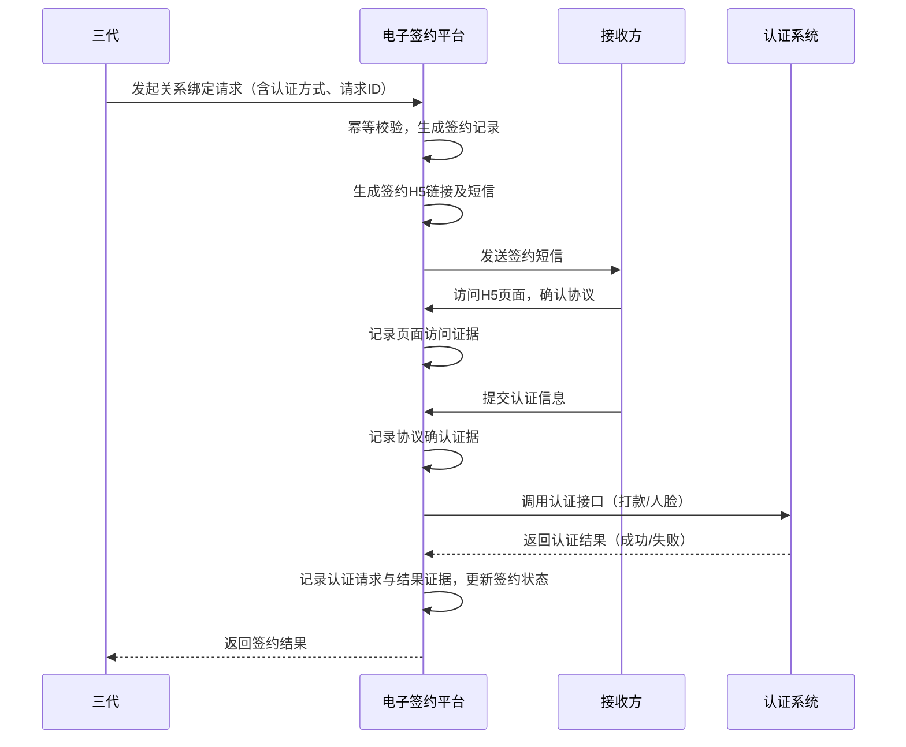

# 模块设计: 电子签约平台

生成时间: 2026-01-26 16:43:09
批判迭代: 2

---

# 电子签约平台模块设计文档

## 1. 概述
- **目的与范围**: 本模块负责为天财分账业务（由天财合作方发起）提供协议签署与身份认证的线上化能力。核心职责包括配置短信和H5模板，调用认证系统完成身份核验，管理协议签署流程，并留存全证据链数据。其业务边界在于处理关系绑定（包括归集授权与开通付款）过程中的签约与认证环节，不涉及具体的账户操作或资金流转。

## 2. 接口设计
- **API端点 (REST/GraphQL)**:
    - `POST /v1/contract/initiate`: 三代系统调用，用于发起签约流程。
    - `GET /v1/contract/{contractId}/status`: 三代系统调用，用于查询签约状态。
    - `POST /v1/contract/{contractId}/callback`: 认证系统回调，通知认证结果。
    - `POST /v1/internal/evidence/query`: 内部接口，供其他模块查询证据链。
- **请求/响应结构**: TBD
- **发布/消费的事件**:
    - 发布事件: `ContractSignedEvent` (签约完成事件)， `ContractFailedEvent` (签约失败事件)。
    - 消费事件: TBD

## 3. 数据模型
- **表/集合**:
    - `signing_records` (签约记录表): 存储签约流程的核心信息。
    - `evidence_chain` (证据链表): 存储与签约相关的所有操作证据。
    - `sms_template_config` (短信模板配置表): 存储不同业务场景的短信模板。
    - `h5_template_config` (H5页面模板配置表): 存储不同业务场景的H5页面模板。
- **关键字段**:
    - `signing_records` 表: `contract_id` (签约ID，主键), `business_scene` (业务场景，如归集授权), `payer_id` (付方ID), `receiver_id` (收方ID), `auth_method` (认证方式), `status` (状态), `initiate_time` (发起时间), `expire_time` (过期时间), `result_time` (结果时间), `upstream_request_id` (上游请求ID，用于幂等)。
    - `evidence_chain` 表: `evidence_id` (证据ID), `contract_id` (关联签约ID), `evidence_type` (证据类型，如页面访问、协议确认、认证请求), `content` (证据内容，如IP地址、用户代理、时间戳、操作数据), `create_time` (创建时间)。
- **与其他模块的关系**: 本模块存储的协议签署记录与认证证据链数据，与认证系统交互完成核验，并为三代系统提供签约状态。

## 4. 业务逻辑
- **核心工作流/算法**: 主要业务流程为关系绑定流程。当三代发起签约请求后，本模块根据业务场景（如归集授权）配置并推送短信H5链接给接收方。接收方通过H5页面完成协议阅读、确认，并根据要求选择打款验证或人脸验证方式。本模块调用认证系统接口完成身份核验，核验通过后记录签约成功并通知三代。
- **业务规则与验证**:
    1.  根据天财上传的认证方式（打款验证/人脸验证）调用对应的认证系统接口。
    2.  确保协议模板与签署方身份匹配。
    3.  记录并存储完整的操作日志与证据链。
    4.  **幂等性处理**: 基于三代请求中的唯一请求ID (`upstream_request_id`) 防止重复创建签约流程。
    5.  **并发控制**: 对同一组付方-收方关系，在同一业务场景下，同一时间只允许存在一个进行中的签约流程。
- **关键边界情况处理**:
    1.  认证失败：记录失败原因并返回给上游。
    2.  签约链接过期：需重新生成。
    3.  重复签约：根据业务规则判断是否允许。
- **重试机制**: 对认证系统等下游依赖的调用，采用指数退避策略进行重试。例如：最大重试次数3次，初始延迟1秒，延迟倍数2。
- **数据留存策略**: 全证据链数据为关键合规数据，存储期限遵循公司金融级数据合规要求，至少保存5年。过期数据将归档至冷存储。

## 5. 时序图

## 6. 错误处理
- **预期错误情况**:
    1.  认证系统调用超时或失败。
    2.  接收方提交的认证信息有误。
    3.  模板配置错误或缺失。
    4.  网络异常导致短信发送失败。
    5.  上游重复请求。
- **处理策略**:
    1.  对依赖系统（如认证系统）的调用设置重试机制（指数退避）与超时控制。
    2.  明确的错误码映射，将底层错误转化为业务错误返回给上游。
    3.  关键操作（如证据链记录）需保证事务性。
    4.  通过请求ID实现幂等，对重复请求返回已存在流程的状态。

## 7. 依赖关系
- **上游模块**: 三代（发起签约请求）
- **下游模块**: 认证系统（调用其打款验证和人脸验证接口）