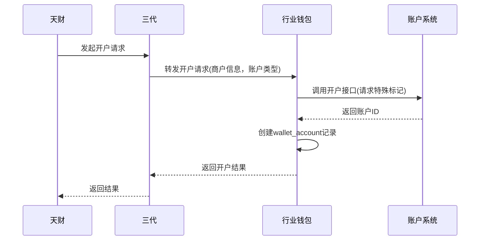
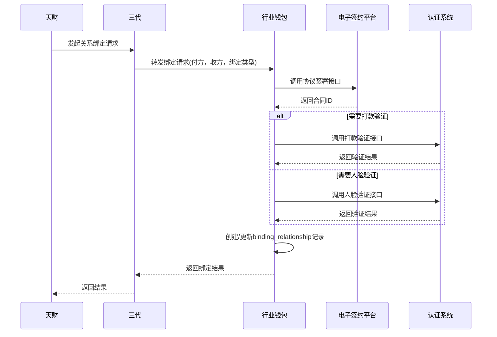
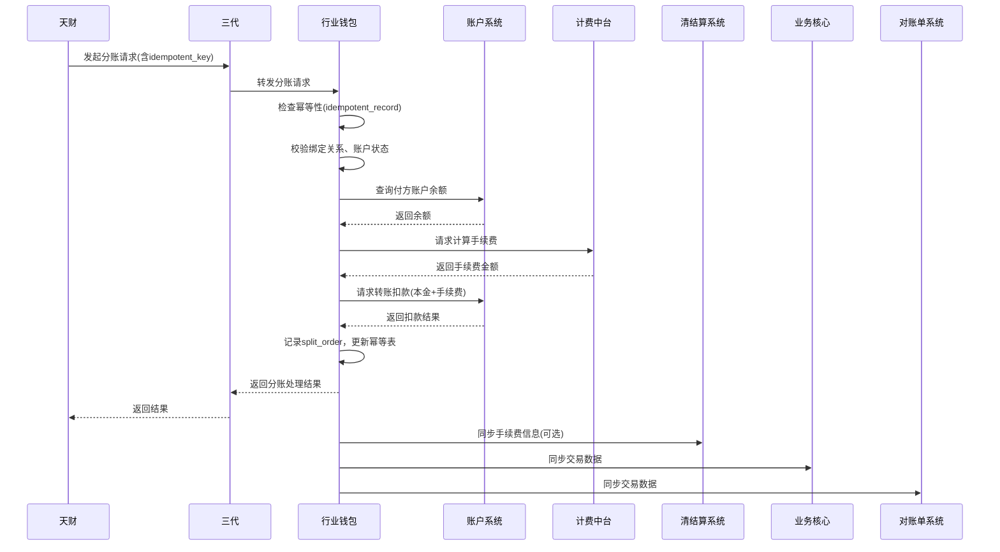

# 模块设计: 行业钱包

生成时间: 2026-01-26 16:43:31
批判迭代: 2

---

# 行业钱包模块设计文档

## 1. 概述
- **目的与范围**：行业钱包（分账核心）是拉卡拉内部负责天财分账业务的核心处理系统。其核心职责包括：处理天财专用账户（收款账户、接收方账户）的开户请求；执行关系绑定的校验与处理；接收并处理来自天财的分账请求；管理账户间的转账与分账操作；以及与其他内部系统进行必要的数据同步。其边界止于调用底层系统（如账户系统、计费中台）的具体功能接口来完成资金操作、清结算、电子签约等，不直接对外部天财提供服务。

## 2. 接口设计
- **API端点 (REST/GraphQL)**：TBD
- **请求/响应结构**：TBD
- **发布/消费的事件**：
    - **消费事件**：TBD（例如，接收来自三代转发的业务请求事件）
    - **发布事件**：TBD（例如，发布分账交易完成事件，供对账单系统和业务核心消费）

## 3. 数据模型
- **表/集合**：
    - `wallet_account`：天财专用账户信息表。
    - `binding_relationship`：付方与收方绑定关系表。
    - `split_order`：分账交易订单表。
    - `idempotent_record`：幂等性记录表。
- **关键字段**：
    - `wallet_account` 表：`account_id`（账户ID，关联账户系统），`account_type`（账户类型：收款账户/接收方账户），`merchant_id`（商户ID），`status`（状态：正常/冻结/注销），`institution_no`（机构号）。
    - `binding_relationship` 表：`payer_account_id`（付方账户ID），`payee_account_id`（收方账户ID），`binding_type`（绑定类型：归集授权/开通付款），`auth_status`（认证状态），`contract_id`（电子协议ID）。
    - `split_order` 表：`order_no`（订单号），`payer_account_id`，`payee_account_id`，`amount`（金额），`fee`（手续费），`fee_bearer`（手续费承担方），`status`（订单状态），`idempotent_key`（幂等键）。
    - `idempotent_record` 表：`idempotent_key`（幂等键），`business_type`（业务类型），`result`（处理结果），`created_at`（创建时间）。
- **与其他模块的关系**：
    - 依赖账户系统：通过 `account_id` 关联底层账户实体。
    - 依赖三代系统：通过 `institution_no` 关联商户和业务来源。
    - 依赖电子签约平台：通过 `contract_id` 关联签署的协议。
    - 数据同步至对账单系统和业务核心：通过 `split_order` 表提供分账交易数据。

## 4. 业务逻辑
- **核心工作流/算法**：
    1.  **开户处理**：
        - 接收三代转发的开户请求（含商户信息、账户类型、机构号）。
        - 调用账户系统接口，请求开立带有“天财专用账户”标记的账户。
        - 账户系统返回账户ID后，在本地 `wallet_account` 表创建记录。
        - 返回开户结果给三代。
    2.  **关系绑定校验与处理**：
        - 接收三代发起的绑定请求（如归集授权、开通付款）。
        - 调用电子签约平台接口，完成协议签署流程，获取 `contract_id`。
        - 根据绑定场景，调用认证系统接口完成打款验证或人脸验证。
        - 验证通过后，在 `binding_relationship` 表中创建或更新绑定关系记录。
        - 返回绑定结果给三代。
    3.  **分账请求处理**：
        - 接收天财通过三代发起的门店分账、会员结算或批量付款请求。
        - **校验**：检查付方与收方在 `binding_relationship` 表中是否存在有效绑定；查询 `wallet_account` 表校验双方账户状态是否为“正常”；调用账户系统接口查询付方账户余额。
        - **手续费计算**：调用计费中台接口，传入交易金额等信息，计算手续费。
        - **手续费承担方处理**：根据请求中的 `fee_bearer` 字段（付方/收方），确定手续费实际扣款账户。
        - **资金划转**：调用账户系统转账接口，执行一笔或多笔扣款（本金及手续费）。
        - **记录与同步**：在 `split_order` 表记录交易；异步将交易数据同步至对账单系统和业务核心。
        - 返回分账处理结果给三代。
    4.  **数据同步**：通过发布事件或调用接口，将 `split_order` 表中的分账交易结果数据同步至对账单系统和业务核心。
    5.  **退货与清结算处理**：当清结算系统发起退货账户查询或专用账户冻结请求时，行业钱包根据 `wallet_account` 表信息进行响应或执行状态更新。
- **业务规则与验证**：
    - 分账前必须完成关系绑定（`binding_relationship.auth_status` 为“已认证”）。
    - 付款方账户必须为天财收款账户（`wallet_account.account_type = ‘收款账户’`）。
    - 收款方账户必须为天财收款账户或天财接收方账户。
    - 需校验账户状态为“正常”，且付方账户余额充足。
    - 需根据天财上传的 `fee_bearer` 字段，确定手续费扣款账户。
    - 关键操作（如创建订单、资金扣款）需使用乐观锁或数据库事务保证一致性。
- **关键边界情况处理**：
    - **分布式事务与冲正**：分账过程中若调用账户系统或计费中台失败，采用Saga模式进行补偿。例如，已扣款但后续步骤失败，则发起一笔反向冲正交易。
    - **账户异常**：接收方账户已注销或冻结，分账请求在校验阶段被拒绝。
    - **幂等性**：所有写操作入口检查 `idempotent_record` 表，防止重复处理。
    - **并发控制**：对账户余额更新等操作使用乐观锁。

## 5. 时序图

### 5.1 开户处理时序图

### 5.2 关系绑定处理时序图

### 5.3 分账请求处理时序图

## 6. 错误处理
- **预期错误情况**：
    - 账户不存在或状态异常。
    - 付方与收方未建立有效绑定关系。
    - 付方账户余额不足。
    - 下游系统（账户系统、计费中台、清结算等）服务不可用或超时。
    - 网络或数据库异常。
    - 重复请求（幂等性冲突）。
- **处理策略**：
    - **业务校验失败**：立即返回明确的错误码和描述（如“余额不足”、“绑定关系不存在”）。
    - **下游调用失败**：
        - 对资金类操作（调用账户系统）采用Saga模式，设计明确的补偿（冲正）接口，确保最终一致性。
        - 对非资金类查询操作，配置有限次数的重试机制（如最多3次，指数退避）。
        - 所有失败均记录详细日志和告警，用于对账和人工干预。
    - **幂等性**：所有业务请求需携带唯一幂等键（`idempotent_key`），在 `idempotent_record` 表中记录处理状态，确保请求仅被处理一次。
    - **事务边界**：本地数据库操作使用事务保证 `split_order`、`idempotent_record` 等表的一致性。跨系统操作通过上述Saga和补偿逻辑保证。

## 7. 依赖关系
- **上游模块**：
    - **三代**：提供商户入网信息、转发天财的业务请求（开户、绑定、分账）。
    - **账户系统**：提供底层账户的创建、查询、余额管理、转账扣款能力。
    - **电子签约平台**：提供协议签署能力，用于关系绑定。
    - **认证系统**：提供打款验证和人脸验证能力，用于关系绑定。
    - **计费中台**：提供转账手续费计算能力。
    - **清结算系统**：提供手续费清分、结算处理、退货账户查询及专用账户冻结支持。
- **下游模块**：
    - **对账单系统**：接收行业钱包同步的分账交易数据，用于生成对账单。
    - **业务核心**：接收行业钱包同步的分账交易数据。