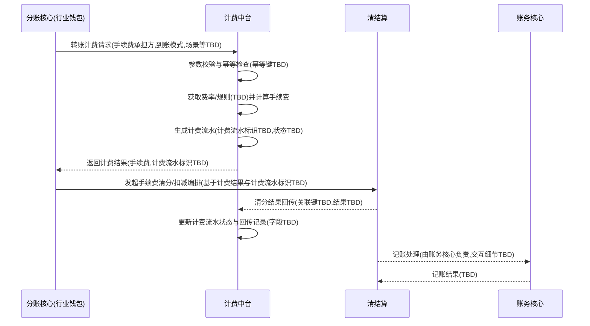

# 模块设计: 计费中台

生成时间: 2026-01-26 17:17:02
批判迭代: 2

---

# 一、概述

## 1.1 目的与范围

计费中台在“天财分账/转账”链路中提供**转账计费能力**，输出可被上游用于后续处理的**计费结果**，并生成可追踪的**计费流水**。

- **负责**
  - 接收来自分账核心（行业钱包）的转账计费请求，基于请求要素（手续费承担方、到账模式、场景等）进行计费计算。
  - 生成并持久化计费流水，保证可追踪、可幂等。
  - 向调用方返回计费结果与计费流水标识，供后续转账执行、手续费清分等流程使用。
  - 对“手续费清分结果回传”的处理方式：**被动接收**清结算回传的清分结果并更新计费流水状态；是否需要再回传给分账核心取决于接口/事件约定（当前为 TBD）。

- **不负责**
  - 开户、关系绑定/签约、账户转账执行、账务记账、对账单生成、风控冻结等（分别由账户系统、电子签章系统、账务核心、对账单系统、风控等承担）。

## 1.2 与术语表一致性澄清（解决边界误解）

术语表中“清结算”与“计费中台”为独立实体；同时“清结算”条目存在“别名: 清结算/计费中台”的历史混用。为避免边界误解，本设计按以下原则描述交互：

- **计费中台**：只做计费计算与计费流水管理，以及对清分结果的被动落库/状态更新（若有）。
- **清结算**：负责手续费清分、通知账户扣减及结算结果推送等。
- 计费中台与清结算是否直连、以接口还是事件交互：**当前缺少确切架构约束，统一标记为 TBD**，但在时序图中将以“可选交互”方式表达，避免暗示必然直连或越界编排。

# 二、接口设计

> 评审指出接口设计空洞；但当前输入未提供任何既有 API 规范、路径、字段、协议（REST/GraphQL）、鉴权方式等。为满足“不编造 API/字段”的约束，本节仅给出**接口清单骨架**与**最小必要语义**，所有具体端点/字段保持 TBD，并明确需要补齐的信息。

## 2.1 对外接口清单（由分账核心调用）

### 2.1.1 转账计费接口

- **接口名称**：转账计费
- **协议/端点**：TBD
- **调用方**：分账核心（行业钱包）
- **功能**：根据手续费承担方、到账模式、场景等要素计算手续费并生成计费流水，返回计费结果与计费流水标识。
- **幂等要求**：必须支持（见“业务逻辑-幂等”）

#### 请求结构（不新增字段，仅列出已知要素）

- 手续费承担方（来自术语表）
- 到账模式：净额转账/全额转账（来自术语表）
- 场景：归集/批量付款/会员结算（来自术语表）
- 其余请求字段：TBD  
  说明：计费计算通常还需要交易金额、业务单号/分账流水号、APPID/机构号等，但当前输入未提供，故均为 TBD。

#### 响应结构（不新增字段，仅列出已知要素）

- 手续费
- 计费流水标识：TBD
- 到账模式回显：净额转账/全额转账
- 手续费承担方回显
- 其余响应字段：TBD

### 2.1.2 查询计费流水接口（可选）

- **接口名称**：查询计费流水
- **协议/端点**：TBD
- **调用方**：TBD（可能为分账核心/清结算/运营工具）
- **功能**：按计费流水标识或幂等键查询计费结果与状态
- **请求/响应结构**：TBD

## 2.2 与清结算的交互接口（可选，边界明确）

> 解决“参与手续费清分流程，并接收/回传清分结果”表述含糊：本设计将计费中台定位为**清分结果的被动接收方**（若存在该链路），不承担清分编排。

### 2.2.1 清分结果回传接口（清结算 -> 计费中台）

- **接口名称**：手续费清分结果回传
- **协议/端点**：TBD
- **调用方**：清结算
- **功能**：回传与某计费流水关联的清分处理结果，计费中台据此更新计费流水状态并记录回传信息。
- **请求/响应结构**：TBD  
  约束：必须能关联到“计费流水标识”或等价关联键（具体字段 TBD）。

### 2.2.2 计费流水提供接口（计费中台 -> 清结算）（可选）

- **接口名称**：提供计费流水用于清分
- **协议/端点**：TBD
- **调用方**：清结算（拉取）或计费中台（推送），模式 TBD
- **功能**：清结算获取手续费清分所需的计费流水信息
- **请求/响应结构**：TBD

## 2.3 事件发布/消费

- **发布事件**：TBD
- **消费事件**：TBD

> 说明：当前输入未给出事件总线、topic、事件名、payload 结构，不能编造；若未来采用事件驱动，可将“计费完成”“清分结果已更新”等作为候选事件，但此处保持 TBD。

# 三、数据模型

> 评审指出数据模型空洞；但当前输入仅明确存在“计费流水”这一实体，且仅确认三个业务要素（手续费、手续费承担方、到账模式）。因此本节在不新增字段的前提下，补齐：表的职责、状态机（状态字段名仍 TBD）、索引/幂等键（字段名 TBD）等“必须存在但名称未定”的内容。

## 3.1 数据实体

### 3.1.1 计费流水（表/集合）

- **存储名称**：TBD
- **主键**：计费流水标识（字段名 TBD）
- **用途**
  - 记录一次转账计费请求的输入要素与输出结果（至少包含：手续费、手续费承担方、到账模式）。
  - 承载幂等控制所需的关联信息（幂等键字段名 TBD）。
  - 承载与清结算清分结果关联与状态跟踪（状态字段名 TBD）。

## 3.2 关键字段（已知与 TBD 边界清晰）

### 3.2.1 已知必须包含的业务字段（来自上下文）

- 手续费
- 手续费承担方
- 到账模式（净额转账/全额转账）

### 3.2.2 为解决评审问题而必须存在但当前无法命名/枚举的字段（均为 TBD）

- 幂等键：TBD  
  用于保证同一业务请求重复调用不重复生成计费流水。
- 业务关联标识（如分账流水/业务单号等）：TBD
- 状态字段：TBD  
  用于表达计费流水生命周期（例如：已计费、清分中、清分成功、清分失败等；具体枚举 TBD）。
- 清分结果回传信息（结果码/时间/次数等）：TBD
- 创建时间/更新时间：TBD

## 3.3 索引与约束（不指定字段名，仅描述约束）

- 唯一性约束：幂等键必须唯一（字段名 TBD）。
- 查询索引：按计费流水标识查询（字段名 TBD）；按业务关联标识查询（字段名 TBD）。

## 3.4 与其他模块的数据关系

- 与分账核心：分账核心持有业务侧流水/单号；计费中台需在计费流水中保存可关联信息（字段 TBD）。
- 与清结算：清结算清分时需能关联到计费流水；关联键为计费流水标识或等价键（字段 TBD）。
- 与账务核心：账务核心负责记账；计费中台不直接定义账务分录字段（均 TBD）。

# 四、业务逻辑

## 4.1 核心流程（计费计算与流水生成）

1. **接收计费请求**（来自分账核心；触发点为分账核心在转账/分账编排中的计费环节）。
2. **参数校验**
   - 手续费承担方：必须为“付方或收方统一承担”（具体枚举值/编码 TBD）。
   - 到账模式：必须为“净额转账”或“全额转账”。
   - 场景：归集/批量付款/会员结算（若接口传入；字段 TBD）。
   - 其他必要参数（如金额、业务单号等）：TBD（缺失则应判为参数错误，错误码 TBD）。
3. **幂等处理**
   - 从请求中提取幂等键（字段 TBD）。
   - 若幂等键已存在对应计费流水：
     - 直接返回已存在的计费结果与计费流水标识（避免重复计费）。
   - 若不存在：
     - 进入计费计算并创建新计费流水。
4. **费率/规则获取与应用（解决“费率来源缺失”）**
   - 费率/规则来源：TBD（可能来自配置中心、数据库、清结算、或分账核心下发；当前无信息不可假设）。
   - 规则选择维度：至少与“场景、手续费承担方、到账模式”相关；其他维度 TBD。
   - 规则不可用时处理：见“错误处理-计费规则不可用”。
5. **手续费计算**
   - 计算公式/舍入规则：TBD（未提供费率类型、封顶/保底、精度规则等）。
   - 输出：手续费。
6. **到账金额一致性处理（与到账模式相关）**
   - 净额转账：到账金额 = 转账金额 - 手续费（金额字段 TBD）。
   - 全额转账：到账金额 = 转账金额；手续费扣收路径由承担方决定（扣收路径字段/规则 TBD）。
   - 由于“转账金额/到账金额”字段未提供，本设计仅定义逻辑关系，具体字段 TBD。
7. **生成计费流水**
   - 持久化：手续费、手续费承担方、到账模式、幂等键、业务关联标识、状态等（字段名均 TBD）。
8. **返回计费结果**
   - 返回手续费、计费流水标识等（字段 TBD）。

## 4.2 手续费清分相关职责（解决“参与清分流程”含糊与边界问题）

计费中台在手续费清分中的角色定义为：

- **不负责**：发起清分、编排清分、驱动账户扣减（这些属于清结算）。
- **可负责（被动）**：接收清结算回传的清分结果，并更新计费流水状态与记录回传信息（接口/事件 TBD）。

因此，“参与手续费清分”在本设计中被严格限定为：
- **提供可被清结算使用的计费流水信息**（推/拉 TBD）
- **接收清分结果回传并落库**（若该链路存在）

## 4.3 与账务核心的协同（解决“计费相关记账协同”含糊）

- 账务核心负责记账处理；计费中台不产生账务分录。
- 计费中台与账务核心是否存在直接交互：TBD  
  若存在，其目的应仅限于“查询/对齐计费流水与记账结果的关联状态”或“接收记账结果回传”等，但当前无任何已知接口/事件，故保持 TBD。
- 在时序图中将不再默认画出“计费中台 -> 账务核心”的必然调用，仅保留为可选 TBD 交互。

## 4.4 关键边界情况处理（补齐评审点）

- **净额转账下手续费大于等于转账金额**
  - 处理策略：TBD  
    说明：该策略需要明确业务允许/不允许、是否拒绝、是否调整手续费、是否最小到账等规则；当前无规则来源，不能编造。
- **全额转账下手续费扣收路径与到账金额一致性**
  - 校验点：承担方为付方/收方时，手续费扣收账户与到账金额关系需一致（账户与金额字段 TBD）。
  - 处理策略：TBD（依赖账户执行与清结算扣减方式，当前缺失）。
- **计费计算失败**
  - 不落库或落库失败状态：TBD（需结合状态机字段定义）。
- **重复请求**
  - 通过幂等键返回历史结果；若历史记录处于“清分中/失败”等状态，是否允许重算：TBD。

# 五、时序图

> 解决“时序图越界/过度简化”：将清结算交互标记为可选，并明确清分由清结算负责；同时移除对账务核心的默认直连，改为可选 TBD。

# 六、错误处理

> 评审指出错误处理空洞；在不编造“错误码体系具体编码”的前提下，本节给出**错误码分类与语义**、**重试/补偿机制的流程与策略框架**（具体次数/间隔/超时阈值均 TBD）。

## 6.1 错误码与错误类型（编码 TBD，但分类明确）

- **参数错误（INVALID_ARGUMENT）**：手续费承担方/到账模式/场景不合法，或缺少必填参数（字段 TBD）。
- **幂等冲突（IDEMPOTENCY_CONFLICT）**：同一幂等键对应的历史请求与本次关键要素不一致（关键要素集合 TBD）。
- **计费规则不可用（FEE_RULE_UNAVAILABLE）**：费率/规则获取失败或无匹配规则（规则来源 TBD）。
- **计费计算失败（FEE_CALCULATION_FAILED）**：计算过程异常（如精度/溢出/内部错误等，细分 TBD）。
- **依赖不可用（DEPENDENCY_UNAVAILABLE）**：下游/外部依赖（如规则源、存储等）不可用（依赖项 TBD）。
- **清分结果处理失败（CLEARING_RESULT_PROCESS_FAILED）**：接收清分结果回传后落库失败或状态更新失败。

## 6.2 重试策略（具体参数 TBD）

- **同步接口调用失败**
  - 是否重试：TBD（需结合调用方超时预算与幂等保障）
  - 重试次数/退避策略：TBD
- **清分结果回传处理失败**
  - 若通过接口回传：清结算侧应可重试回传（次数/间隔 TBD），计费中台需保证回传处理幂等（回传幂等键 TBD）。
  - 若通过事件回传：消费重试与死信策略 TBD。

## 6.3 补偿机制（解决“清分结果通知失败补偿缺失”）

> 目标：当“清分结果回传”失败或延迟时，计费流水状态可最终一致，且可追踪、可补偿。

- **补偿触发方式**：TBD  
  候选方式（仅作为机制类型，不落具体实现）：定时任务扫描、人工触发、清结算重推、对账驱动等；具体采用哪种 TBD。
- **补偿输入**：需能定位计费流水（计费流水标识或业务关联标识，字段 TBD）。
- **补偿动作**
  - 重新拉取清分结果或等待清结算重推：TBD（取决于交互模式）
  - 更新计费流水状态并记录补偿次数/时间：字段 TBD
- **一致性原则**
  - 以清结算为清分结果权威来源；计费中台仅记录与对齐（权威性边界明确）。

# 七、依赖关系

## 7.1 上游模块

- 分账核心（行业钱包）：计费请求发起方、计费结果消费者。
- 清结算：作为清分结果回传方（若存在该链路，接口/事件 TBD）。

## 7.2 下游模块

- 费率/规则来源：TBD（必须补齐的外部依赖，当前缺失）
- 清结算：作为手续费清分执行方（计费中台向其提供计费流水信息的方式 TBD）
- 存储组件（用于计费流水持久化）：TBD

## 7.3 平行/可选交互模块

- 账务核心：记账由其负责；计费中台是否直连交互 TBD（本设计不默认存在直连依赖）。