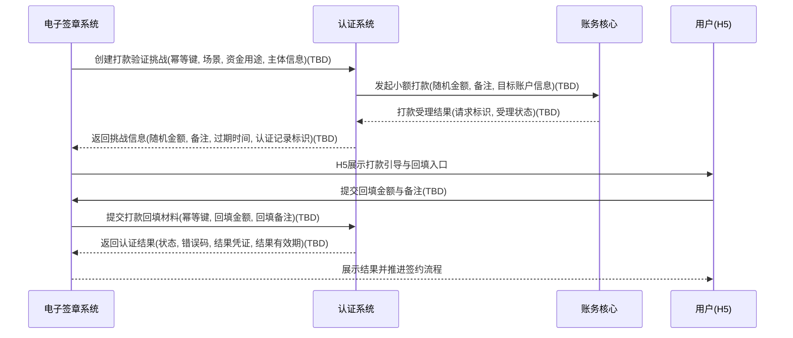
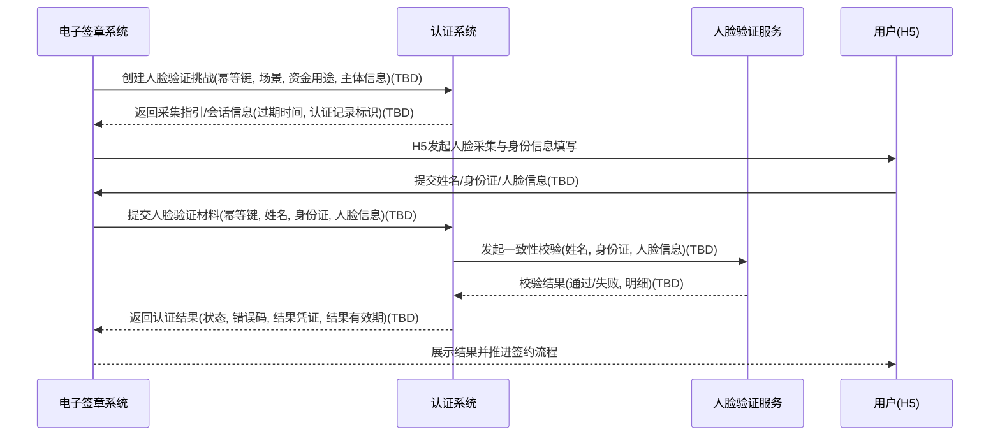

# 模块设计: 认证系统

生成时间: 2026-01-26 17:08:59
批判迭代: 2

---

# 1. 概述

## 1.1 目的与范围

认证系统提供两类认证能力，用于确保签约与绑定关系的有效性确认，并向上游系统输出可消费的认证结果。

- **打款验证**：发起小额随机金额打款，并校验用户回填的金额与备注一致性。
- **人脸验证**：校验姓名、身份证与人脸一致性。

## 1.2 职责边界与依赖澄清

- 认证系统**负责**：生成认证挑战（如随机金额/备注）、受理认证材料提交、执行校验、产出认证结果、管理认证记录生命周期（超时、重试、幂等、结果有效期）。
- 认证系统**不负责**：协议生成与签署、短信发送、H5封装与页面承载、关系绑定生效、账户开立、分账/转账执行、计费与清分。
- 认证系统与“关系绑定/归集授权/开通付款”等流程的关系：认证系统仅产出“认证结果/凭证（形式TBD）”，由**电子签章系统**在签约流程中消费该结果，并将其作为后续“关系绑定生效/授权生效/开通付款生效”的必要输入之一；这些状态机与落库归属在对应业务模块（TBD）。

## 1.3 与术语表一致性补齐

- **短信模板**：由电子签章系统配置并发送。认证系统不配置短信模板，但需要支持电子签章系统在不同短信/H5引导下发起认证；认证系统对短信模板的输入/使用：**不涉及**（保持边界清晰）。
- **资金用途**、**场景**：作为关系绑定/授权归集请求中的关键参数，认证系统在创建认证请求时应接收并记录（用于审计、风控、对账与后续排查；以及与电子签章系统的流程一致性校验，具体校验规则TBD）。

---

# 2. 接口设计

> 说明：当前上下文未给出任何既有接口规范。为避免编造，以下接口端点、字段、事件均为 **TBD**；但补齐了必须明确的接口能力清单、交互契约要点（幂等、超时、重试、状态机）。

## 2.1 接口清单（端点）

- 创建打款验证挑战：TBD  
- 提交打款验证回填材料：TBD  
- 创建人脸验证挑战：TBD  
- 提交人脸验证材料：TBD  
- 查询认证状态/结果：TBD  

## 2.2 请求参数（逻辑字段）

### 2.2.1 通用入参（创建挑战/提交材料/查询）

- 幂等键：TBD  
  - 来源建议：电子签章系统的签约流程流水号/业务流水号（具体字段名TBD）
- 认证类型：打款验证 / 人脸验证（枚举值TBD）
- 场景：归集 / 批量付款 / 会员结算（枚举值以术语表为准；字段名TBD）
- 资金用途：TBD（取值域由上游定义）
- 发起方标识：TBD（用于审计与权限，具体字段名与来源TBD）
- 被认证主体标识：TBD（对公/对私主体标识，字段名TBD）
- 过期时间/超时窗口：TBD（若由服务端统一配置则该入参可选或不传，规则TBD）

### 2.2.2 打款验证特有入参/出参要素

- 挑战生成输出：
  - 随机金额：TBD
  - 备注：TBD
  - 过期时间：TBD
  - 需要展示给用户的提示文案：TBD（由电子签章系统/H5承载，认证系统可返回建议文案或仅返回要素，规则TBD）
- 用户回填提交：
  - 回填金额：TBD
  - 回填备注：TBD

### 2.2.3 人脸验证特有入参/出参要素

- 挑战生成输出：
  - 人脸采集指引/跳转信息：TBD（如需第三方采集SDK/链接，字段与形式TBD）
  - 过期时间：TBD
- 用户提交材料：
  - 姓名：TBD
  - 身份证：TBD
  - 人脸信息：TBD（原始数据/特征值/引用ID均可能，具体形式TBD）

## 2.3 响应结构（逻辑字段）

- 请求标识：TBD
- 认证状态：通过 / 失败 / 处理中（是否需要“处理中”取决于下游异步能力，TBD）
- 失败原因码：TBD（见“错误处理”章节的错误码集合）
- 失败原因描述：TBD
- 认证结果凭证：TBD  
  - 用途：供电子签章系统在后续流程中携带，证明该次签约流程已完成认证（具体凭证形态：token/签名串/结果ID，TBD）
- 结果有效期/过期时间：TBD（用于结果复用与防重放，规则TBD）

## 2.4 事件发布/订阅

- 发布事件：TBD  
- 订阅事件：TBD  

> 若电子签章系统采用轮询查询认证结果，则事件可不需要；若采用异步回调/消息通知，则事件主题、载荷、幂等与重放策略均为TBD。

---

# 3. 数据模型

> 说明：当前上下文未提供任何既有表结构。为避免编造，表名与字段名均为 **TBD**；但补齐必须落库的“数据要素集合”与约束点（幂等、重试、超时、结果缓存/有效期、审计字段）。

## 3.1 数据实体（表/集合）

- 认证记录表/集合：TBD  
- 认证尝试/重试记录表/集合（可选）：TBD  
- 下游调用记录表/集合（打款通道、人脸服务调用日志，可选）：TBD  

## 3.2 关键字段（数据要素）

### 3.2.1 认证记录（核心）

- 主键：TBD
- 幂等键：TBD
- 认证类型：TBD
- 状态：TBD（建议至少覆盖：已创建/待提交/处理中/通过/失败/超时，具体枚举TBD）
- 场景：TBD（归集/批量付款/会员结算）
- 资金用途：TBD
- 发起方标识：TBD
- 被认证主体标识：TBD
- 过期时间：TBD
- 结果有效期/结果过期时间：TBD
- 重试次数/提交次数：TBD
- 创建时间/更新时间：TBD

### 3.2.2 打款验证字段

- 随机金额：TBD
- 备注：TBD
- 回填金额：TBD
- 回填备注：TBD
- 打款通道请求标识：TBD（用于对账与排查）
- 打款状态：TBD（若与认证状态分离，字段TBD）

### 3.2.3 人脸验证字段

- 姓名：TBD
- 身份证：TBD
- 人脸数据引用：TBD（避免直接存储敏感原始数据；具体形式TBD）
- 人脸服务请求标识：TBD
- 人脸校验结果明细：TBD（如置信度/阈值等，若需要则字段TBD）

## 3.3 约束与索引（逻辑要求）

- 幂等约束：幂等键唯一（具体实现：唯一索引/去重表，TBD）
- 过期清理：按过期时间清理或归档（机制TBD）
- 敏感信息保护：身份证、人脸数据的存储与脱敏策略：TBD（需符合公司安全规范）

---

# 4. 业务逻辑

## 4.1 状态机与生命周期

- 创建挑战：生成认证记录，进入“待提交/待完成”状态（状态名TBD）
- 提交材料：
  - 同步校验：直接进入“通过/失败”
  - 异步校验（如人脸第三方异步回调）：进入“处理中”，待回调/轮询更新为“通过/失败”（是否异步：TBD）
- 超时：超过挑战过期时间仍未通过则置为“超时/失败”（具体状态与优先级TBD）
- 结果复用：在结果有效期内，同一幂等键再次查询/提交应返回一致结果或明确拒绝（规则TBD）

## 4.2 幂等设计

- 幂等键：由电子签章系统提供（字段名TBD），应与其签约流程强绑定，确保：
  - 重复“创建挑战”返回同一挑战信息（或返回已存在挑战的引用，TBD）
  - 重复“提交材料”在未超过重试限制时按同一记录处理；超过限制返回明确错误（错误码TBD）
- 幂等范围：同一幂等键 + 认证类型（是否需要联合约束：TBD）

## 4.3 超时窗口、重试限制、结果缓存/有效期

- 挑战超时窗口：TBD（例如分钟级；由配置中心/数据库配置，来源TBD）
- 最大重试次数：
  - 打款回填提交：TBD
  - 人脸提交：TBD
- 结果有效期（用于后续流程消费与防重复认证）：TBD  
  - 复用策略：在有效期内可直接返回“通过”并返回同一结果凭证（或返回结果ID，TBD）

## 4.4 打款验证工作流（细化）

1. 电子签章系统基于签约流程与短信模板/H5引导，调用认证系统“创建打款验证挑战”（端点TBD），并传入：幂等键、场景、资金用途、主体信息等（字段TBD）。
2. 认证系统生成：
   - 小额随机金额（范围与规则TBD）
   - 备注（规则TBD）
   - 过期时间（TBD）
3. 认证系统调用**打款通道/账务核心**发起打款（具体对接对象在术语表中更贴近“账务核心”负责打款验证记账处理；若实际为其他支付网关则为TBD）。
4. 用户在H5页面回填金额与备注，由电子签章系统提交至认证系统“提交打款回填材料”（端点TBD）。
5. 认证系统校验：
   - 回填金额 == 随机金额
   - 回填备注 == 发起备注
6. 输出认证结果与结果凭证（TBD）给电子签章系统。

## 4.5 人脸验证工作流（细化）

1. 电子签章系统调用认证系统“创建人脸验证挑战”（端点TBD），传入：幂等键、场景、资金用途、主体信息等（字段TBD）。
2. 认证系统返回人脸采集指引/必要参数（如需第三方SDK/链接/会话ID等，均为TBD），并记录过期时间。
3. 用户在H5完成人脸采集与提交，由电子签章系统调用认证系统“提交人脸验证材料”（端点TBD），提交姓名、身份证、人脸信息（字段TBD）。
4. 认证系统调用**第三方人脸验证服务**完成一致性校验（服务名称、协议、同步/异步模式均为TBD）。
5. 输出认证结果与结果凭证（TBD）给电子签章系统。

## 4.6 与电子签章系统的协同点（补齐短信模板一致性问题）

- 短信模板选择与发送：由电子签章系统按“场景/对公对私差异”配置并发送。
- 认证系统需要确保其返回的挑战信息可被电子签章系统用于H5展示与引导（例如打款备注、回填说明、人脸采集指引等；具体展示文案归属与字段TBD）。
- 认证系统记录“场景、资金用途”，以便与电子签章系统的签约要素一致，支持审计与问题排查（校验规则是否强校验：TBD）。

---

# 5. 时序图

## 5.1 打款验证时序

## 5.2 人脸验证时序

---

# 6. 错误处理

> 说明：评审建议给出了示例错误码，但当前上下文未定义既有错误码规范。为避免编造，错误码值保持 **TBD**，但补齐“错误码集合、触发条件、是否可重试、处理策略”。

## 6.1 错误码与含义（逻辑定义）

| 错误码 | 错误名称 | 触发条件 | 是否可重试 | 建议处理 |
|---|---|---|---|---|
| TBD | 参数缺失或格式错误 | 必填参数缺失、格式不合法 | 否 | 由电子签章系统修正请求后重试 |
| TBD | 幂等冲突 | 同一幂等键对应不同认证类型/主体信息不一致（规则TBD） | 否 | 返回冲突信息，要求上游排查 |
| TBD | 认证已过期 | 超过挑战过期时间提交材料 | 否 | 重新创建挑战 |
| TBD | 超过重试次数 | 提交次数超过限制 | 否 | 重新创建挑战或人工介入（TBD） |
| TBD | 金额不匹配 | 回填金额 != 随机金额 | 是（受限） | 允许在剩余次数内重试 |
| TBD | 备注不匹配 | 回填备注 != 发起备注 | 是（受限） | 允许在剩余次数内重试 |
| TBD | 人脸验证失败 | 人脸与姓名/身份证不一致或活体失败（若有） | 是（受限） | 允许在剩余次数内重试 |
| TBD | 打款通道不可用 | 账务核心/打款通道不可用或受理失败 | 是 | 上游提示稍后重试；必要时降级/告警（TBD） |
| TBD | 人脸服务不可用 | 第三方人脸服务超时/不可用 | 是 | 上游提示稍后重试；必要时切换通道（TBD） |
| TBD | 系统内部错误 | 未预期异常 | 是（有限） | 返回统一错误并记录可追踪信息 |

## 6.2 处理策略

- **统一状态返回**：通过 / 失败 / 处理中（是否需要“处理中”：TBD）。
- **可重试错误**：
  - 下游不可用、超时：按上游重试策略重试（重试退避策略TBD）。
  - 校验失败类（金额/备注/人脸不一致）：允许在最大次数内重试；超过次数转为不可重试失败。
- **幂等处理**：
  - 重复创建挑战：返回同一挑战信息或同一认证记录标识（TBD）。
  - 重复提交材料：返回同一最终结果或当前状态（TBD）。
- **可观测性与追踪**：
  - 记录认证记录标识、幂等键、下游请求标识（字段TBD）。
  - 告警规则：下游不可用、失败率异常、超时堆积（TBD）。

---

# 7. 依赖关系

## 7.1 上游模块

- **电子签章系统**：
  - 配置并发送短信模板、封装H5页面
  - 在签约流程中调用认证系统创建挑战、提交材料、查询结果
  - 消费认证结果以推进协议签章与签约流程闭环

## 7.2 下游模块

- **账务核心**：用于打款验证的小额打款发起与受理（具体接口与字段TBD）
- **人脸验证服务**：用于人脸一致性校验（第三方或内部服务，具体对接方式TBD）

## 7.3 间接依赖方与结果消费说明

- **行业钱包**及其承载的流程（关系绑定、归集授权、开通付款等）：间接依赖认证结果作为“签约有效性确认”的必要输入之一；认证结果由电子签章系统在流程编排中消费并传递（传递方式/字段TBD）。
- **账户系统、计费中台、清结算、三代**：不直接依赖认证系统接口；其业务动作发生在认证与签章完成之后的各自流程中（具体编排归属TBD）。