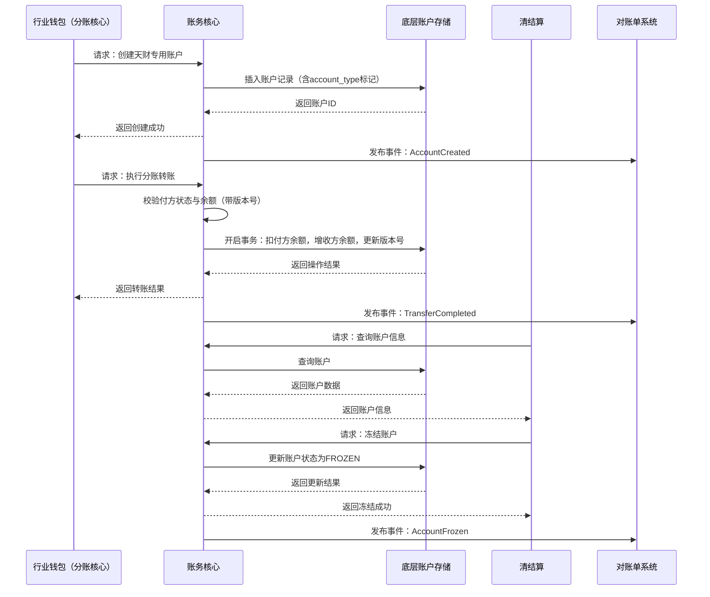

# 模块设计: 账务核心

生成时间: 2026-01-26 16:43:29
批判迭代: 2

---

# 账务核心模块设计文档

## 1. 概述
- **目的与范围**：本模块是拉卡拉内部系统，负责底层账户的创建、升级、余额管理、转账扣款及为天财专用账户打特殊标记。其核心职责是处理所有与天财分账业务相关的底层账户操作，是资金流转的基石。本模块接收来自上游“行业钱包（分账核心）”的指令，执行具体的账户操作，并为下游“清结算”、“对账单系统”等模块提供账户数据支持。

## 2. 接口设计
- **API端点 (REST/GraphQL)**：
    - `POST /api/v1/accounts`：创建账户。
    - `POST /api/v1/transfers`：执行转账。
    - `GET /api/v1/accounts/{accountId}`：查询账户信息。
    - `POST /api/v1/accounts/{accountId}/freeze`：冻结账户。
    - `POST /api/v1/accounts/{accountId}/unfreeze`：解冻账户。
- **请求/响应结构**：
    - 创建账户请求：`{ “accountType”: “TIANCAI_COLLECT” | “TIANCAI_RECEIVER”, “merchantId”: “string”, “institutionNo”: “string” }`
    - 创建账户响应：`{ “accountId”: “string”, “status”: “ACTIVE” }`
    - 转账请求：`{ “fromAccountId”: “string”, “toAccountId”: “string”, “amount”: “decimal”, “bizId”: “string” }`
    - 转账响应：`{ “transferId”: “string”, “status”: “SUCCESS” | “FAILED” }`
- **发布/消费的事件**：
    - 发布事件：`AccountCreated`、`TransferCompleted`、`AccountFrozen`。
    - 消费事件：TBD。

## 3. 数据模型
- **表/集合**：
    - `account`：账户主表。
    - `transaction_log`：交易流水表。
- **关键字段**：
    - `account` 表：`account_id`（主键）、`balance`（余额）、`account_type`（账户类型，含天财专用标记）、`status`（状态，如 ACTIVE, FROZEN）、`merchant_id`、`institution_no`、`version`（用于乐观锁）。
    - `transaction_log` 表：`transfer_id`（主键）、`from_account_id`、`to_account_id`、`amount`、`status`、`biz_id`、`created_at`。
- **与其他模块的关系**：本模块的 `account` 表为“行业钱包”模块提供底层账户操作支持，其创建的账户数据被“清结算”模块用于查询和冻结操作，被“对账单系统”模块用于生成对账单。

## 4. 业务逻辑
- **核心工作流/算法**：接收“行业钱包（分账核心）”的指令，为天财（合作方/平台）开立具有特殊标记的“天财专用账户”。处理账户间的转账扣款请求，执行余额的增减操作。所有涉及余额变更的操作均在数据库事务中完成，并使用乐观锁（`version`字段）处理并发冲突。
- **业务规则与验证**：
    1.  创建账户时，根据请求中的 `accountType` 字段（如 `TIANCAI_COLLECT`）在底层账户上打上特殊标记（即存入 `account_type` 字段）。
    2.  执行转账前，校验付方账户状态是否为 `ACTIVE`，并校验余额是否充足。
    3.  通过数据库事务保证“扣减付方余额”与“增加收方余额”的原子性。
    4.  使用乐观锁机制：在更新账户余额时，检查 `version` 字段，防止并发转账导致的余额扣减冲突。
- **关键边界情况处理**：
    1.  **并发转账冲突**：通过上述乐观锁机制处理。若更新失败（版本号不匹配），则向上游返回明确错误，建议其重试。
    2.  **系统异常冲正**：在分布式事务场景下，若转账过程中系统异常，将记录冲正流水，并通过补偿性事务（Saga模式）尝试回滚已完成的步骤，或标记交易为失败，确保数据最终一致性。

## 5. 时序图

## 6. 错误处理
- **预期错误情况**：账户不存在、账户已冻结、付方余额不足、乐观锁版本冲突、底层数据库操作异常、网络超时。
- **处理策略**：
    1.  业务逻辑错误（如余额不足、版本冲突）返回明确错误码和描述。
    2.  系统级异常记录详细日志并告警。
    3.  对于因系统异常导致的中间状态，通过冲正流水和补偿机制（Saga）保证最终一致性。
    4.  对网络超时等可重试错误，提供幂等的重试机制。

## 7. 依赖关系
- **上游模块**：行业钱包（分账核心）。账务核心接收其发起的账户创建、转账等指令。
- **下游模块**：
    - 清结算：依赖本模块查询账户信息、执行账户冻结/解冻操作。
    - 对账单系统：订阅本模块发布的事件（如 `AccountCreated`, `TransferCompleted`），获取账户及交易数据以生成对账单。