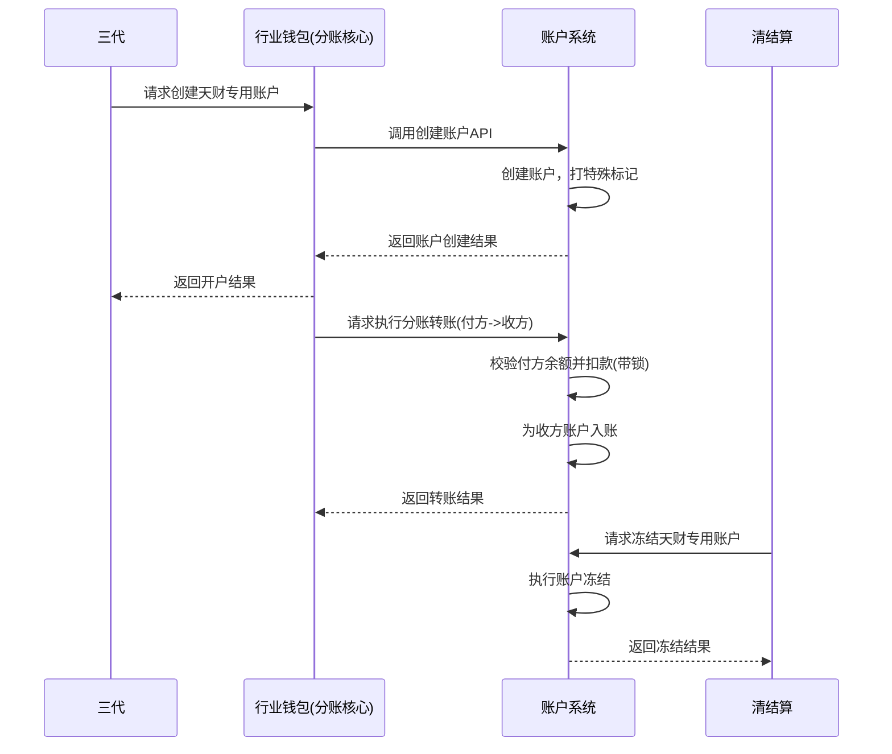

# 模块设计: 账户系统

生成时间: 2026-01-26 16:43:01
批判迭代: 2

---

# 账户系统模块设计文档

## 1. 概述
- **目的与范围**: 本模块是拉卡拉内部核心系统之一，负责为天财分账业务提供底层账户支持。其核心职责包括：根据指令创建天财专用账户（包括天财收款账户和天财接收方账户），对账户进行升级操作，管理账户余额，执行账户间的转账扣款，以及对天财专用账户打特殊标记。其边界止于账户的底层创建、记账和标记，不涉及上层的业务逻辑（如关系绑定、分账规则等）。本模块直接服务于行业钱包（分账核心），由行业钱包调用以执行业务操作。

## 2. 接口设计
- **API端点 (REST/GraphQL)**:
    - `POST /v1/accounts`: 创建账户。接收行业钱包的指令，创建天财专用账户。
    - `POST /v1/accounts/{accountId}/upgrade`: 账户升级。将普通账户升级为天财专用账户。
    - `POST /v1/transfers`: 执行转账。处理账户间的资金划转。
    - `GET /v1/accounts/{accountId}/balance`: 查询账户余额。
    - `POST /v1/accounts/{accountId}/freeze`: 冻结账户。
    - `POST /v1/accounts/{accountId}/unfreeze`: 解冻账户。
- **请求/响应结构**:
    - 创建账户请求：包含账户类型（收款/接收方）、所属机构号、关联商户/个人标识等。
    - 创建账户响应：返回账户ID、状态、创建时间。
    - 转账请求：包含付方账户ID、收方账户ID、金额、业务流水号。
    - 转账响应：返回交易流水号、状态、处理时间。
    - 通用响应：包含状态码、消息、业务数据。
- **发布/消费的事件**:
    - 发布事件：`AccountCreated`（账户创建成功）、`AccountUpgraded`（账户升级成功）、`TransferCompleted`（转账完成）、`AccountFrozen`（账户冻结）、`AccountUnfrozen`（账户解冻）。
    - 消费事件：TBD。

## 3. 数据模型
- **表/集合**:
    - `account`: 账户主表。
    - `account_balance`: 账户余额表。
    - `transaction_ledger`: 交易流水表。
    - `account_freeze_record`: 账户冻结记录表。
- **关键字段**:
    - `account`表: `account_id` (主键), `account_type` (账户类型), `merchant_id` (商户标识), `person_id` (个人标识), `institution_code` (机构号), `is_tiancai_special` (天财专用标记), `status` (状态: 有效/冻结/注销), `created_at`, `updated_at`。
    - `account_balance`表: `id` (主键), `account_id` (外键), `balance` (可用余额), `frozen_balance` (冻结余额), `version` (版本号，用于乐观锁)。
    - `transaction_ledger`表: `transaction_id` (主键), `from_account_id`, `to_account_id`, `amount`, `biz_serial_no` (业务流水号，用于幂等), `status`, `created_at`。
    - `account_freeze_record`表: `id` (主键), `account_id`, `freeze_type`, `reason`, `operator`, `created_at`。
- **与其他模块的关系**: 本模块存储的账户信息是上层业务（如行业钱包、清结算）操作的基础实体。账户的特殊标记（如天财专用账户标识）由本模块维护，供其他系统查询和识别。

## 4. 业务逻辑
- **核心工作流/算法**:
    1.  **开户处理**: 接收行业钱包的开户请求，创建底层账户实体，根据请求类型（收款账户/接收方账户）设置相应的账户属性，并打上“天财专用账户”特殊标记。
    2.  **账户升级**: 根据行业钱包的指令，对已有账户进行升级操作（例如，从普通账户升级为天财专用账户），更新账户标记。
    3.  **余额管理**: 提供账户余额的查询、冻结、解冻功能。支持清结算系统对专用账户进行冻结。
    4.  **转账扣款**: 执行账户间的资金划转，确保原子性操作。处理分账请求时，从付方账户扣款，并计入收方账户。
- **业务规则与验证**:
    - 账户创建和操作需校验账户状态（如是否冻结、是否有效）。
    - 转账操作需校验付方账户余额是否充足。
    - 天财专用账户需被打上系统约定的特殊标记。
    - 所有写操作（转账、冻结、开户）需支持幂等性，通过业务流水号（`biz_serial_no`）或请求ID实现。
- **关键边界情况处理**:
    - **并发转账**: 使用数据库乐观锁（`account_balance.version`）或悲观锁（`SELECT FOR UPDATE`）保证余额扣减的一致性。
    - **操作失败回滚**: 在数据库事务内执行账户创建、余额变更等操作，失败时自动回滚。对于涉及外部调用的复杂操作，记录操作日志，通过补偿机制（如定时任务）处理异常状态。
    - **清结算冻结请求**: 接收清结算系统的冻结/解冻请求，校验权限后执行，并记录操作日志。

## 5. 时序图

## 6. 错误处理
- **预期错误情况**:
    - 开户请求参数错误或重复开户。
    - 转账时付方账户余额不足。
    - 账户状态异常（如已冻结、已注销）。
    - 系统内部处理超时或数据库异常。
    - 幂等性校验失败（重复请求）。
- **处理策略**:
    - **业务错误**: 对参数错误、余额不足、状态异常等，返回结构化的错误码和描述（如 `INSUFFICIENT_BALANCE`, `ACCOUNT_FROZEN`）。
    - **系统级错误**: 进行详细的日志记录和告警。向上游返回通用失败响应（如 `SYSTEM_ERROR`），并建议其根据幂等键进行重试。
    - **重试策略**: 上游调用方（如行业钱包）应在收到系统级错误时，使用相同的业务流水号进行有限次（如3次）重试。

## 7. 依赖关系
- **上游模块**:
    - **行业钱包 (分账核心)**: 调用本模块进行开户、转账、查询等核心账户操作。是本模块的主要服务对象。
    - **清结算**: 调用本模块进行账户冻结、解冻操作。
- **下游模块**: TBD