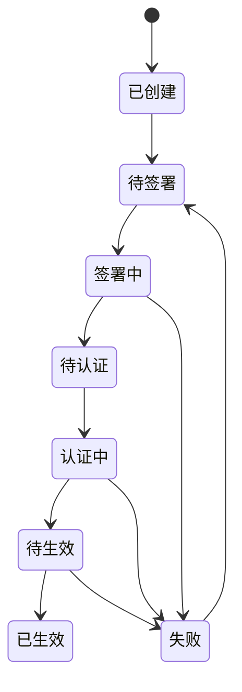
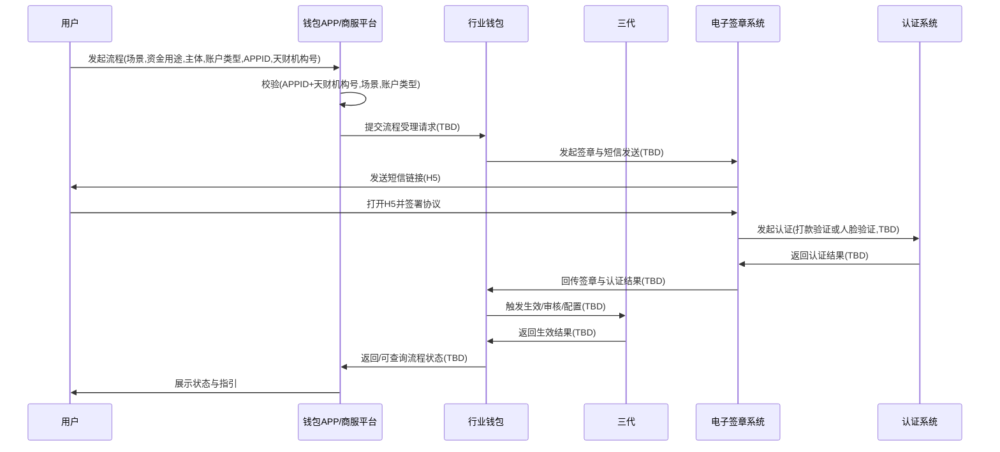
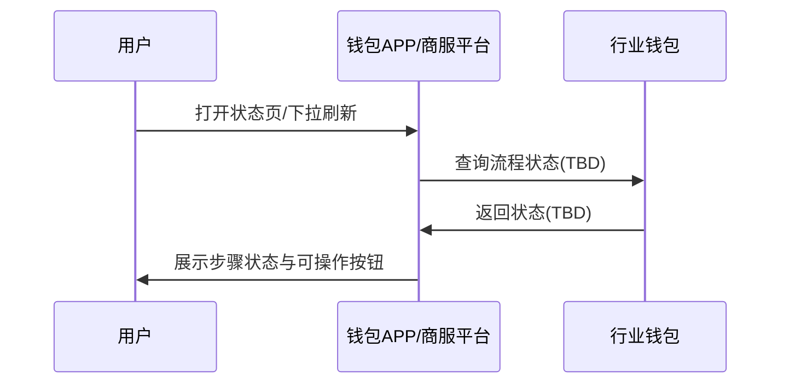

# 模块设计: 钱包APP/商服平台

生成时间: 2026-01-26 17:17:16
批判迭代: 2

---

# 1. 概述

## 1.1 目的与范围
“钱包APP/商服平台”模块作为天财相关能力的前端业务承载与运营入口，面向**总部/门店/接收方**提供流程发起、材料采集、状态展示与结果回传的统一交互层，覆盖但不限于：
- 发起或引导完成**关系绑定**、**归集授权**、**开通付款**等签约/认证流程（通过短信/H5完成协议签署与认证）。
- 展示与查询流程状态（签署、认证、绑定/授权生效）与失败原因（如可获得）。
- 对“场景”“账户类型隔离”“调用方限制”等规则做前置校验与拦截，减少无效请求。

## 1.2 边界与职责澄清（解决“边界模糊/状态范围不清”问题）
- 本模块**不承担**：开户、转账/分账执行、计费、记账、清结算、对账单生成等后端处理。
- 本模块**承担**：
  - 作为前端入口采集业务要素并发起后端受理请求（受理方为**行业钱包**与/或**三代**，具体以其对外能力为准，接口细节 TBD）。
  - 维护“前端可见的流程实例”与“步骤状态机”，用于跨多步（短信签署、认证、绑定/授权生效）展示与重试引导（持久化方案 TBD）。
  - 聚合并展示状态：以**行业钱包/电子签章系统/认证系统/三代**返回或可查询到的状态为准；若仅能从单一系统获取，则展示范围以该系统为准（具体字段与映射 TBD）。

## 1.3 依赖方向澄清（解决“行业钱包/三代上下游不一致”问题）
- **行业钱包**：对本模块而言是**下游依赖**（本模块调用行业钱包受理“关系绑定/归集授权/开通付款”等业务请求与状态查询，具体接口 TBD）。
- **三代**：对本模块而言是**下游依赖**（当流程涉及三代侧“结算模式/D+1/关系绑定接口提供及审核”等能力时，本模块通过后端编排或直连调用其能力，具体接口 TBD）。
- 若实际架构为“本模块仅调用行业钱包，由行业钱包再调用三代/电子签章/认证”，则本模块对三代/电子签章/认证为**间接依赖**；是否直连由落地架构决定（TBD）。

---

# 2. 接口设计

> 评审要求必须给出 API 端点、请求/响应、事件。当前上下文未提供任何既定接口规范；为避免编造，本章节给出**接口清单占位与契约要点**，所有端点/字段/事件名均为 TBD，但明确必须覆盖的能力与参数来源。

## 2.1 API 端点（TBD）
- 发起流程实例（关系绑定/归集授权/开通付款）：TBD
- 获取流程实例详情（含步骤状态）：TBD
- 获取流程列表（按主体/场景过滤）：TBD
- 触发短信重发/重新签署：TBD
- 触发重新认证（打款验证/人脸验证）：TBD
- 查询绑定/授权/开通付款最终状态（聚合查询）：TBD

## 2.2 请求/响应结构（TBD，但约束输入输出要素）
### 2.2.1 发起流程请求（TBD）
- 必填业务要素（字段名/类型 TBD，但语义必须包含）：
  - APPID
  - 天财机构号
  - 场景（归集、批量付款、会员结算）
  - 资金用途
  - 主体角色与主体信息（总部/门店/接收方/收款方）
  - 账户类型（天财收款账户、天财接收方账户、普通收款账户、待结算账户、退货账户）
  - 手续费承担方
  - 到账模式（净额转账、全额转账）
  - 结算模式（主动结算、被动结算）与 D+1结算（D1）展示/配置标识（是否可配置 TBD）
  - 认证方式（打款验证、人脸验证）或由规则推导（推导规则见 4.3）
  - 协议类型（代付授权协议、代付授权书、结算授权委托书）
- 响应（TBD）至少应包含：
  - 流程实例标识（TBD）
  - 当前步骤与状态（TBD）
  - 后续动作指引（TBD）
  - 外部链路标识（签章流水/认证流水/绑定流水等，字段 TBD）

### 2.2.2 状态查询响应（TBD）
- 至少包含：
  - 流程实例状态（见 4.2 状态机）
  - 各步骤状态（签署、认证、绑定/授权生效）
  - 最近失败原因（若下游返回；字段 TBD）
  - 可重试动作（短信重发/重新签署/重新认证/重新发起，TBD）

## 2.3 事件发布/订阅（TBD）
- 本模块是否接入事件机制：TBD  
- 若接入，至少需要覆盖的事件类型（事件名/字段 TBD）：
  - 签章结果回调事件（来自电子签章系统或行业钱包转发）
  - 认证结果回调事件（来自认证系统或电子签章系统转发）
  - 绑定/授权生效结果事件（来自行业钱包或三代）
- 事件幂等键与去重策略：TBD（与 4.4 幂等一致）

---

# 3. 数据模型

> 评审要求必须给出表/字段/关系。当前上下文未给出任何既定表结构；为避免编造，本章节给出**必须存在的数据实体与字段语义清单**，表名/字段名/类型均为 TBD，但明确需要持久化哪些信息以支撑状态机与审计。

## 3.1 表/集合（TBD）
- 流程实例表/集合：TBD  
- 流程步骤表/集合（或实例内嵌步骤）：TBD  
- 外部链路映射表/集合（签章流水/认证流水/绑定流水关联）：TBD  
- 操作审计/日志表/集合（用户触发重试、状态变更记录）：TBD  

## 3.2 关键字段（字段名/类型 TBD，语义如下）
### 3.2.1 流程实例（TBD）
- 流程实例ID（TBD）
- APPID
- 天财机构号
- 场景（归集、批量付款、会员结算）
- 资金用途
- 发起角色（总部/门店/接收方）
- 参与主体标识集合（总部/门店/接收方/收款方，具体标识字段 TBD）
- 账户类型（天财收款账户/天财接收方账户/普通收款账户/待结算账户/退货账户）
- 手续费承担方
- 到账模式（净额转账/全额转账）
- 结算模式（主动结算/被动结算）与 D+1结算（D1）相关展示字段（TBD）
- 协议类型（代付授权协议/代付授权书/结算授权委托书）
- 认证方式（打款验证/人脸验证）或“待推导”（TBD）
- 当前状态（见 4.2）
- 当前步骤（见 4.2）
- 创建时间/更新时间（TBD）
- 幂等键（TBD）

### 3.2.2 步骤状态（TBD）
- 步骤类型：签署/认证/绑定生效（TBD）
- 步骤状态：未开始/进行中/成功/失败/超时/已取消（TBD）
- 失败原因码/失败原因文案（若可得，TBD）
- 最近一次触发时间/完成时间（TBD）

### 3.2.3 外部链路映射（TBD）
- 签章流水标识（来自电子签章系统，字段 TBD）
- 认证流水标识（来自认证系统，字段 TBD）
- 绑定/授权流水标识（来自行业钱包/三代，字段 TBD）
- 与流程实例ID的关联（TBD）

## 3.3 实体关系（TBD）
- 流程实例 1:N 流程步骤（或 1:1 内嵌，TBD）
- 流程实例 1:N 外部链路映射（按多次重试产生多条映射，TBD）
- 流程实例 1:N 操作审计记录（TBD）

---

# 4. 业务逻辑

## 4.1 核心流程（补齐“状态展示范围/获取方式”）
1. 用户在钱包APP/商服平台选择入口：归集授权/批量付款/会员结算/开通付款等。
2. 前端采集业务要素并执行同步校验：
   - 调用方限制校验（APPID、天财机构号）：见 4.3.1
   - 场景参数合法性校验：见 4.3.2
   - 账户类型隔离校验：见 4.3.3
3. 创建流程实例并发起下游受理（行业钱包与/或三代，具体接口 TBD）。
4. 触发签章与认证链路（直连或经行业钱包编排，TBD）：
   - 电子签章系统发送短信，用户打开 H5 完成协议签署。
   - 电子签章系统按规则触发认证系统进行打款验证或人脸验证。
5. 状态获取与展示（解决“如何获得状态：轮询/回调”问题）：
   - 回调驱动：若下游提供回调/事件，本模块订阅并更新流程实例状态（事件机制 TBD）。
   - 轮询/查询驱动：若仅提供查询接口，本模块在用户进入状态页时查询下游并刷新本地状态（查询接口 TBD）。
   - 展示范围：仅展示本模块可从下游获取并映射到状态机的字段；其余展示为 TBD。
6. 用户根据状态页指引进行重试：短信重发/重新签署/重新认证/重新发起（触发接口 TBD）。

## 4.2 状态机设计（补齐“多步骤状态机与持久化”）
> 状态名为本模块内部状态，用于统一展示；与下游状态的映射规则 TBD。

- 流程实例状态（TBD）建议覆盖：
  - 已创建
  - 待签署
  - 签署中
  - 待认证
  - 认证中
  - 待生效（绑定/授权/开通付款待生效）
  - 已生效
  - 失败
  - 已取消/已终止（是否支持 TBD）

- 状态迁移触发源：
  - 用户动作：发起、重试、取消（取消是否支持 TBD）
  - 下游回调/事件：签署结果、认证结果、生效结果（事件 TBD）
  - 下游查询结果：状态刷新（接口 TBD）

## 4.3 关键校验与拦截（补齐“APPID/机构号校验”“账户类型/场景拦截”）
> 具体字段名、校验接口与存储来源未给出，以下为必须实现的校验点与技术落点占位（TBD）。

### 4.3.1 调用方限制校验（APPID + 天财机构号）
- 校验目标：限制调用方只能为天财（术语表定义）。
- 校验时机：
  - 服务端接口入口处（所有发起/重试/查询接口）：必须校验。
  - 前端仅做提示性校验，不作为安全边界（实现 TBD）。
- 校验方式（TBD）：
  - 白名单/配置中心：维护允许的 APPID 与天财机构号组合（数据源 TBD）。
  - 或通过下游鉴权：由行业钱包/三代进行二次校验并返回拒绝（接口 TBD）。
- 校验失败处理：返回“权限/调用方受限”错误（错误码见 6.1）。

### 4.3.2 场景参数合法性校验
- 合法枚举：归集、批量付款、会员结算（来自术语表）。
- 校验时机：创建流程实例前；同时在下游受理前再次校验（防止绕过）。
- 失败处理：返回“参数错误-场景不合法”（错误码见 6.1）。

### 4.3.3 账户类型隔离与不匹配拦截
- 规则来源：术语表“天财专用账户不允许转账给普通账户”“避免重复开通普通收款账户能力”。
- 本模块可执行的拦截点（TBD）：
  - 在用户选择账户类型/收款对象时，基于“账户类型”与“场景”组合做前置限制。
  - 在提交下游前做服务端校验，避免仅前端拦截。
- 需要的判定信息：
  - 账户类型（天财收款账户/天财接收方账户/普通收款账户/待结算账户/退货账户）
  - 交易/绑定目标类型（TBD）
  - 是否已存在普通收款账户能力（查询来源 TBD）
- 失败处理：返回“账户类型冲突/不允许混用”（错误码见 6.1）。

### 4.3.4 认证方式选择规则（打款验证/人脸验证）
- 规则：对公/对私及主体类型差异导致认证方式不同（术语表）。
- 由于“对公/对私判定字段、主体证件类型”等未给出，规则细节与字段映射：TBD。
- 实现方式：
  - 若下游（电子签章系统/认证系统/行业钱包）可自动选择，则本模块仅展示选择结果（TBD）。
  - 若需本模块传入认证方式，则按配置/规则引擎推导（TBD）。

## 4.4 幂等与重试（补齐“幂等键策略 TBD 需落点”）
- 幂等范围：发起流程实例、短信重发、重新认证、状态刷新。
- 幂等键构成：TBD（至少应包含 APPID、天财机构号、场景、主体标识、业务时间窗等语义要素）。
- 重试策略：
  - 短信重发：由电子签章系统能力决定（接口 TBD），本模块需限制频率（阈值 TBD）。
  - 重新认证：由认证系统能力决定（接口 TBD），本模块需限制次数/间隔（TBD）。
  - 状态查询：失败时提示“处理中”并允许用户刷新；自动轮询是否启用 TBD。

---

# 5. 时序图

## 5.1 发起签约并完成生效（直连关系为“可能”，接口均 TBD）

## 5.2 状态查询与刷新（轮询/回调二选一或并存，机制 TBD）

---

# 6. 错误处理

> 评审要求“具体错误码”。当前上下文未提供既定错误码规范；为避免编造，本模块错误码以 TBD 表示，但明确每类错误必须可区分、可定位、可提示与可重试策略。

## 6.1 错误码与错误场景（TBD）
| 错误类型 | 触发条件 | 错误码 | 用户提示 | 是否可重试 | 重试方式 |
|---|---|---|---|---|---|
| 参数错误-场景不合法 | 场景非“归集/批量付款/会员结算” | TBD | 场景参数不合法 | 否 | 修改参数后重试 |
| 参数错误-必填缺失 | 关键业务要素缺失 | TBD | 信息不完整 | 否 | 补全后重试 |
| 权限/调用方受限 | APPID 或天财机构号校验失败 | TBD | 权限不足/调用方受限 | 否 | 联系支持 |
| 账户类型冲突 | 天财专用账户与普通收款账户混用等 | TBD | 账户类型不匹配 | 否 | 调整账户选择 |
| 签章失败 | 电子签章系统失败或签署未完成 | TBD | 签署失败/未完成 | 是 | 重新签署/短信重发 |
| 认证失败 | 打款验证/人脸验证失败 | TBD | 认证失败 | 是 | 重新认证 |
| 下游超时/不可用 | 行业钱包/电子签章/认证/三代超时 | TBD | 系统繁忙/处理中 | 是 | 稍后查询/重试 |
| 状态不一致 | 下游返回状态冲突或无法映射 | TBD | 状态异常 | 是 | 触发状态刷新/人工介入 |

## 6.2 处理策略（落地到本模块）
- 前置校验：在“创建流程实例/提交下游”前完成 4.3 的校验，减少无效请求。
- 失败留痕：将失败原因、下游返回码、外部链路标识写入流程实例/步骤记录（字段 TBD）。
- 超时降级：
  - 对下游超时返回“处理中”，并在状态页提供刷新入口（自动轮询 TBD）。
- 一致性修复：
  - 以“下游权威状态”为准进行刷新；若出现无法收敛的不一致，标记为“状态异常”并引导人工处理（工单/告警机制 TBD）。

---

# 7. 依赖关系

## 7.1 上游模块（调用本模块的来源）
- 钱包APP：TBD
- 商服平台：TBD
- 其他运营/管理端：TBD

## 7.2 下游模块（本模块依赖的系统）
- 行业钱包（钱包系统）：关系绑定/归集授权/开通付款受理与状态查询（接口 TBD）
- 电子签章系统（电子签约平台）：短信模板、H5、协议签章（接口 TBD）
- 认证系统：打款验证、人脸验证（接口 TBD）
- 三代：结算模式设置、D+1结算（D1）默认/配置、关系绑定接口提供及审核（接口 TBD）

## 7.3 依赖交互边界（补齐“行业钱包边界模糊”）
- 本模块与行业钱包的边界：本模块负责“入口、校验、流程实例与状态展示”；行业钱包负责“业务受理、与电子签章/认证/三代的编排或对接、最终生效与权威状态输出”（具体以实际接口与职责划分为准，TBD）。
- 本模块展示的状态范围：以行业钱包/电子签章系统/认证系统/三代可提供的查询或回调数据为准；字段与映射 TBD。