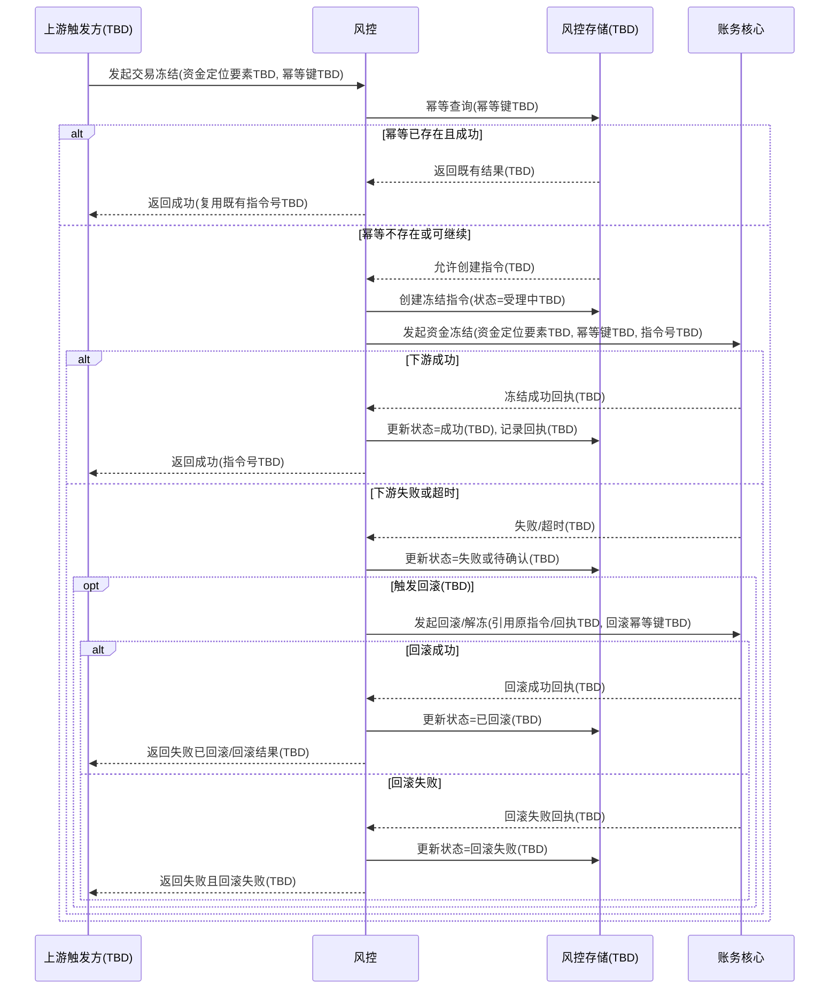
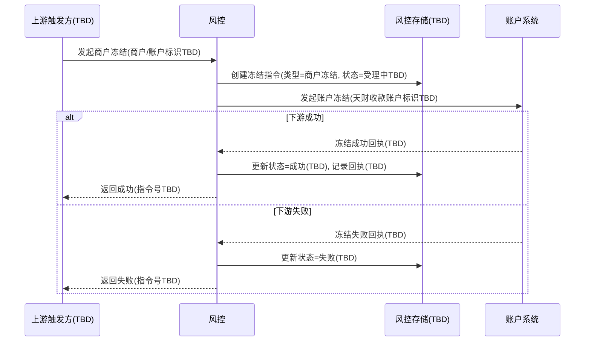

# 模块设计: 风控

生成时间: 2026-01-26 17:20:39
批判迭代: 2

---

## 1. 概述

### 1.1 目的与范围
风控模块负责**发起并管理**两类风险控制指令，并对指令的**幂等、状态跟踪、回滚编排**提供统一能力：

- **商户冻结**：冻结收单商户对应的**天财收款账户**，执行流程对齐“现有收款账户冻结”（账户系统侧能力）。
- **交易冻结**：冻结**已结算至天财收款账户**的资金，要求支持**幂等**与**回滚处理**（账务核心与/或账户系统侧能力，现网以实际为准，TBD）。

不在本模块范围：
- 不负责开户、关系绑定、分账/转账执行、提现执行、计费与清分、对账单生成。
- 不直接落地账户冻结/资金记账，实际冻结与解冻由**账户系统**与/或**账务核心**完成（边界与口径以现网为准，TBD）。

### 1.2 触发机制与上游来源
术语表中“风控”为参与方/模块，但当前上下文未给出其触发来源。为避免与术语表冲突，本设计将触发机制明确为：
- 上游触发方：TBD（可能是运营后台/风控策略引擎/人工审核系统等，但上下文未明确，保持 TBD）
- 触发方式：TBD（同步接口调用或异步消息触发，取决于现网接入方式）

风控模块对外提供“冻结指令受理与查询/回滚编排”的能力（具体接口形态 TBD），并对下游系统发起冻结/回滚请求（具体契约 TBD）。

### 1.3 核心定义与影响范围澄清
- **交易冻结的资金范围如何识别**：必须能被唯一定位到“已结算至天财收款账户”的资金集合；可选定位方式包括：
  - 按交易标识定位：TBD（例如交易ID/结算流水ID等，现网字段未提供）
  - 按结算批次定位：TBD
  - 按时间范围+账户定位：TBD  
  本模块仅负责校验“定位要素齐全且可被下游识别”，具体字段由现网契约决定（TBD）。
- **冻结生效后的受限范围**：
  - 商户冻结：限制天财收款账户的资金操作能力（例如转账/分账/提现等是否受限由账户系统能力定义，TBD）。
  - 交易冻结：限制被定位资金的可用性（例如是否影响可提现余额/可分账余额由账务核心/账户系统口径定义，TBD）。

---

## 2. 接口设计

> 评审要求提供“具体 REST/GraphQL 端点、请求/响应、事件模型”。但上下文未提供任何既有接口/消息规范。为满足“不得编造 API/字段/事件”的约束，本节给出**接口能力清单、最小必要契约要素（均为 TBD）**以及与幂等/回滚强相关的约束，供后续与现网对齐补全。

### 2.1 对外接口（风控模块对上游）
- 接口形态：TBD（REST/GraphQL/消息）
- 鉴权方式：TBD
- 能力清单（接口名/路径/方法均 TBD）：
  1. 发起商户冻结指令：TBD
  2. 发起交易冻结指令（幂等）：TBD
  3. 发起交易冻结回滚：TBD
  4. 查询冻结指令状态：TBD

#### 2.1.1 通用请求要素（不限定字段名，均为 TBD）
- 冻结类型：商户冻结 / 交易冻结
- 目标标识：
  - 商户冻结：收单商户标识（TBD）或天财收款账户标识（TBD）
  - 交易冻结：资金定位要素（TBD，需能定位“已结算至天财收款账户”的资金）
- 幂等键：TBD（由上游提供或由风控生成，需与现网对齐）
- 业务原因/备注：TBD
- 发起方信息：TBD（用于审计与追踪）

#### 2.1.2 通用响应要素（不限定字段名，均为 TBD）
- 指令受理结果：TBD
- 风控指令号：TBD（用于查询与回滚关联）
- 当前状态：TBD
- 下游受理/执行回执：TBD（如有）

### 2.2 对内接口（风控模块对下游）
- 调用对象：
  - 账户系统：用于商户冻结落地（以及可能的解冻/回滚，TBD）
  - 账务核心：用于交易冻结的资金冻结与回滚记账（TBD）
- 接口形态与契约：TBD（现网未提供）
- 最小约束（用于保证幂等与回滚可实现）：
  - 下游必须能识别并处理幂等键或等价幂等语义：TBD
  - 下游必须返回可用于状态推进的回执信息：TBD
  - 回滚必须能引用原冻结指令或原冻结结果的关联标识：TBD

### 2.3 事件发布与订阅
- 是否使用事件总线：TBD
- 可能需要的事件类型（名称/主题/字段均 TBD）：
  - 冻结指令已受理：TBD
  - 冻结执行成功/失败：TBD
  - 回滚已发起/回滚成功/回滚失败：TBD
- 事件与状态机的映射：TBD（取决于现网是否异步化）

---

## 3. 数据模型

> 评审要求提供表设计（如 freeze_orders）及关键字段。但上下文未提供任何既有存储或字段规范。为满足“不编造表/字段”的约束，本节仅定义**必须持久化的概念实体**与**字段类别（均 TBD）**，并明确其用于幂等、回滚、部分成功与并发控制的目的。

### 3.1 持久化实体（表/集合）
- 冻结指令记录：TBD（用于记录商户冻结/交易冻结指令的全生命周期）
- 幂等索引记录：TBD（若与冻结指令记录合表则为 TBD）
- 回滚记录：TBD（若与冻结指令记录复用则为 TBD）
- 下游调用记录/回执记录：TBD（用于部分成功与重试编排）

### 3.2 关键字段（字段名均 TBD，仅描述语义）
冻结指令记录（TBD）至少需要：
- 指令唯一标识：TBD
- 冻结类型：商户冻结 / 交易冻结
- 目标信息：
  - 商户冻结：收单商户标识（TBD）与/或天财收款账户标识（TBD）
  - 交易冻结：资金定位要素（TBD），并包含“天财收款账户标识（TBD）”
- 幂等键：TBD
- 状态：TBD（需覆盖受理、执行中、成功、失败、回滚中、已回滚、回滚失败等，具体枚举 TBD）
- 下游关联信息：
  - 账户系统请求标识/回执：TBD
  - 账务核心请求标识/回执：TBD
- 回滚关联：
  - 原冻结指令引用：TBD
  - 回滚指令引用：TBD
- 时间戳：TBD（创建/更新/完成等）
- 失败原因/错误码：TBD
- 重试计数与下次重试时间：TBD（如需要）

### 3.3 与其他模块的数据关系
- 与账户系统：通过“天财收款账户标识（TBD）”或“收单商户标识（TBD）”建立关联；冻结落地与能力限制口径由账户系统定义（TBD）。
- 与账务核心：通过“资金定位要素（TBD）”与“下游回执标识（TBD）”建立关联；资金冻结与回滚记账口径由账务核心定义（TBD）。
- 与分账核心/行业钱包：可能需要查询冻结状态以拦截分账/转账/提现等能力（查询方式与拦截点 TBD）。

---

## 4. 业务逻辑

### 4.1 总体流程与状态机（冻结指令生命周期）
为支持幂等、回滚、部分成功与并发，本模块对每个冻结指令维护状态机（状态枚举值 TBD，但语义如下）：
- 受理中：写入指令记录并完成幂等校验
- 执行中：已向下游发起冻结
- 成功：下游确认冻结生效
- 失败：下游确认失败或超时后判定失败（判定规则 TBD）
- 回滚中：已向下游发起回滚/解冻
- 已回滚：下游确认回滚完成
- 回滚失败：下游回滚失败或超时（处理策略 TBD）

状态推进触发：
- 同步调用回执：TBD
- 异步事件回执：TBD
- 定时补偿/对账式校正：TBD（若现网需要）

### 4.2 幂等机制（交易冻结必须，商户冻结 TBD）
评审要求明确幂等实现。本设计给出不依赖具体字段名的实现要点：

- 幂等键来源：TBD  
  - 可能由上游请求提供（推荐），或由风控基于业务要素生成（需规则 TBD）。
- 幂等存储：在“冻结指令记录（TBD）”中持久化“幂等键（TBD）”，并建立唯一性约束：TBD
- 幂等判定规则：
  - 若幂等键不存在：创建新指令并进入受理中
  - 若幂等键已存在：
    - 若已成功：返回与首次一致的成功结果（返回内容 TBD）
    - 若执行中/受理中：返回处理中（或返回同一指令号，TBD）
    - 若失败：是否允许重试创建新指令或复用原指令取决于业务策略（TBD）
- 幂等作用范围：
  - **交易冻结**：必须启用
  - **商户冻结**：是否要求幂等未在上下文明确，TBD（建议与账户系统冻结能力对齐）

### 4.3 回滚处理（交易冻结必须）
评审要求明确回滚触发条件、补偿策略、状态机。本设计在不编造下游细节的前提下定义编排逻辑：

#### 4.3.1 回滚触发条件（TBD 细化）
- 人工/上游显式发起回滚：TBD
- 冻结执行失败后的补偿回滚：TBD（例如下游部分成功）
- 超时后判定不一致触发回滚：TBD（需结合下游可查询能力）

#### 4.3.2 回滚关联与幂等
- 回滚必须引用“原冻结指令唯一标识（TBD）”或“下游冻结回执标识（TBD）”
- 回滚请求本身也应具备幂等键：TBD（避免重复回滚导致二次解冻/冲正）

#### 4.3.3 补偿策略（部分成功场景）
当交易冻结涉及多个子范围（例如多笔资金/多条分录，具体拆分方式 TBD）时：
- 风控需记录每个子操作的下游回执与状态：TBD
- 回滚策略：
  - 对已成功子操作发起回滚
  - 对未成功子操作不回滚或按下游要求处理（TBD）
- 一致性目标：最终一致（或强一致）要求 TBD（取决于账务核心/账户系统能力）

### 4.4 并发与竞态处理
评审要求补充并发与边界情况，本设计给出控制点（具体实现依赖存储与下游能力，均 TBD）：
- 同一目标的并发冻结：
  - 通过“幂等键（TBD）”避免重复指令
  - 通过“目标维度互斥（TBD）”避免同一账户/同一资金范围并发冲突（是否需要锁/唯一约束 TBD）
- 冻结与分账/转账/提现并发：
  - 若由账户系统/账务核心在执行层拦截，则风控仅负责下发冻结并跟踪状态（TBD）
  - 若需要业务侧拦截，则分账核心/行业钱包需查询冻结状态（查询接口 TBD）

### 4.5 交易冻结资金范围的可操作定义（待补全项清单）
为解决“已结算资金”过于模糊的问题，本模块要求交易冻结请求必须携带可被下游识别的资金定位要素，至少满足以下之一（均 TBD）：
- 结算结果标识：TBD
- 交易标识：TBD
- 结算批次标识：TBD
- 账户标识 + 时间范围 + 金额/笔数约束：TBD  
并要求下游返回“实际冻结范围确认信息（TBD）”，用于审计与回滚定位。

### 4.6 冻结影响范围（能力受限）定义方式
为解决“受限范围 TBD”的问题，本模块将影响范围定义为**由下游回执确认**：
- 商户冻结：账户系统返回“冻结后受限能力集合（TBD）”或“冻结标志（TBD）”
- 交易冻结：账务核心/账户系统返回“冻结资金口径（TBD）”与“对余额/可用额影响（TBD）”  
若现网下游不返回上述信息，则风控侧仅记录“冻结成功”与下游回执（TBD），影响范围仍为 TBD，但不再在规则中做无依据的强约束。

---

## 5. 时序图

### 5.1 交易冻结（含幂等校验、下游回执、失败与回滚分支）

### 5.2 商户冻结（含指令记录与下游确认）

---

## 6. 错误处理

### 6.1 错误分类
- 参数与规则错误：
  - 冻结类型非法
  - 商户冻结目标无法解析为“收单商户对应的天财收款账户”（解析规则/映射来源 TBD）
  - 交易冻结资金定位要素不完整，无法定位“已结算至天财收款账户”的资金（字段 TBD）
- 幂等相关：
  - 幂等键缺失（是否必填 TBD）
  - 幂等冲突（同幂等键但业务要素不一致，判定规则 TBD）
- 下游错误：
  - 账户系统冻结失败（错误码 TBD）
  - 账务核心冻结/回滚失败（错误码 TBD）
  - 超时无回执（超时阈值 TBD）
- 状态错误：
  - 回滚请求与当前状态不匹配（例如未成功冻结却回滚，允许与否 TBD）
  - 部分成功导致的中间态（需要人工介入或自动补偿，TBD）

### 6.2 处理策略
- 幂等返回策略：对同幂等键请求返回同一指令号与一致结果语义（字段 TBD）。
- 重试策略：  
  - 对下游超时/可重试错误：进入“待确认/执行中（TBD）”，由重试任务或人工处理推进（重试次数、退避策略 TBD）。
  - 对不可重试错误：标记失败并返回失败原因（TBD）。
- 部分成功补偿：记录子操作回执（TBD），仅对已成功部分发起回滚（TBD）。
- 审计与追踪：记录上游发起方信息、幂等键、下游回执与状态流转（字段 TBD）。

---

## 7. 依赖关系

### 7.1 上游模块（触发方）
- 上游系统/流程：TBD（术语表未定义具体上游；需在现网对齐后补充）
- 上游提供信息：
  - 冻结类型
  - 目标标识/资金定位要素（TBD）
  - 幂等键（交易冻结必须，来源 TBD）
  - 发起原因与发起方信息（TBD）

### 7.2 下游模块（执行方）
- **账户系统**：承接商户冻结（同现有收款账户冻结流程）；是否支持解冻/回滚与幂等语义 TBD。
- **账务核心**：承接交易冻结的资金冻结与回滚记账；幂等键处理、资金定位要素、回执字段与查询能力 TBD。
- **分账核心/行业钱包**：可能需要在分账/转账/提现等链路拦截冻结对象；拦截点、查询方式与一致性要求 TBD。
- **对账单系统**：不直接依赖；但交易冻结/回滚是否影响对账口径需与账务核心/对账单系统对齐（TBD）。

---