# DocuFlow-AI Project - 软件设计文档
生成时间: 2026-01-23 17:25:40

## 目录
1. [概述说明](#1-概述说明)
   - 1.1 [术语与缩略词](#11-术语与缩略词)
2. [系统设计](#2-系统设计)
3. [模块设计](#3-模块设计)
   - 3.1 [天财](#module-1)
   - 3.2 [三代](#module-2)
   - 3.3 [行业钱包](#module-3)
   - 3.4 [清结算](#module-4)
   - 3.5 [账户系统](#module-5)
   - 3.6 [账务核心](#module-6)
   - 3.7 [对账单系统](#module-7)
   - 3.8 [计费中台](#module-8)
   - 3.9 [认证系统](#module-9)
   - 3.10 [电子签章系统](#module-10)
   - 3.11 [业务核心](#module-11)
   - 3.12 [交易系统](#module-12)
   - 3.13 [代付系统](#module-13)
   - 3.14 [用户中心](#module-14)
   - 3.15 [风控](#module-15)
   - 3.16 [钱包APP/商服平台](#module-16)
4. [接口设计](#4-接口设计)
5. [数据库设计](#5-数据库设计)

---
# 1 概述说明

## 1.1 术语与缩略词


## 系统角色/参与者

- **天财**: 发起分账、开户等业务请求的平台方，与ISV/开放平台关联。
- **三代**: 运营系统，负责分配机构号、审核、调用接口开通账户及配置业务。
- **行业钱包** (别名: 钱包系统): 处理用户中心生成、账户开户、关系绑定校验及分账请求的核心业务系统。
- **清结算** (别名: 清结算/计费中台): 负责交易清分、结算、计费、账户信息同步及冻结申请处理的系统。
- **账户系统**: 底层负责账户开户、冻结、资金扣减/增加、余额管理等功能的系统。
- **账务核心**: 负责执行记账、生成凭证、更新账务的系统。
- **对账单系统**: 生成并提供各类账户动账明细、交易明细等对账文件的系统。
- **计费中台**: 提供转账、分账等业务手续费计算与清分能力的系统。
- **认证系统**: 提供打款验证、人脸验证等身份核验能力的系统。
- **电子签章系统** (别名: 电子签约平台): 负责协议模板管理、短信H5封装、调起认证及签署流程的系统。
- **业务核心**: 接收并处理天财分账等交易数据的系统。
- **ISV**: 独立软件开发商，为天财平台分配APPID。
- **开放平台**: 为天财平台分配APPID的平台。

## 业务实体

- **天财收款账户** (别名: 天财专用账户): 为收单商户（总部、门店）开立的专用账户，具备转账、分账、提现能力。
- **天财接收方账户** (别名: 接收方账户): 为非收单商户或个人开立的专用账户，主要用于接收分账和提现。
- **收单商户**: 具有企业或个体资质，从事收单业务的商户，可开通天财收款账户。
- **非收单商户**: 不从事收单业务的个人或企业，可开通天财接收方账户。
- **机构号** (别名: 二级机构号): 由三代运营分配给天财平台下各总部及门店的唯一标识。
- **01待结算账户** (别名: 待结算账户): 收单商户用于暂存待结算交易资金的账户。
- **04退货账户** (别名: 退货账户): 收单商户用于处理退货资金的账户。

## 角色

- **总部** (别名: 总店): 在层级架构中处于管理方的收单商户，通常为企业。
- **门店**: 在层级架构中隶属于总部的收单商户。
- **接收方** (别名: 入账方): 接收分账资金的非收单商户或个人。

## 技术术语

- **APPID**: 由ISV/开放平台分配的应用程序标识。

## 流程/工作流名称

- **分账** (别名: 天财分账, 转账): 从天财收款账户向其他天财收款账户或天财接收方账户进行资金划转的业务。
- **归集** (别名: 资金归集): 资金从门店的天财收款账户归集到总部的天财收款账户的业务场景。
- **会员结算**: 将会员消费资金从总部账户分账给门店账户的业务场景。
- **批量付款** (别名: 批付): 从天财收款账户向多个天财接收方账户进行批量付款的业务场景。
- **关系绑定** (别名: 绑定关系): 为进行分账、归集等业务，在付方与收方之间建立授权与协议关系的过程。
- **开通付款**: 在批量付款或会员结算场景下，付方（总部/门店）完成代付授权协议签署的流程。
- **打款验证**: 通过向指定银行卡打入随机金额并验证回填金额，以确认账户信息有效性的认证方式。
- **人脸验证**: 通过比对姓名、身份证和人脸信息，以确认个人身份一致性的认证方式。
- **电子协议签章**: 通过电子签约平台完成协议在线签署与盖章的过程。
- **商户冻结**: 风控判定商户存在风险后，冻结其相关账户（如天财收款账户）的流程。
- **交易冻结**: 风控判定交易存在风险后，冻结已结算至账户（如天财收款账户）资金的流程。
- **退货前置**: 退货流程中，根据退货模式查询并确定扣款账户的环节。

## 领域特定术语

- **主动结算**: 结算模式的一种，资金结算到商户指定的结算账户（如天财收款账户）。
- **被动结算**: 结算模式的一种，资金结算到默认的结算账户。
- **净额转账**: 转账时手续费从转账金额中扣除，收方收到扣除手续费后的净额。
- **全额转账**: 转账时手续费额外收取，收方收到全额转账金额。

---
# 2 系统设计
## 2.1 系统结构
本系统采用分层微服务架构，旨在为“天财”平台提供分账、账户管理、资金归集等核心金融服务。整体架构分为接入层、业务层、核心服务层和基础服务层，各层职责清晰，通过API进行松耦合交互。

- **接入层**：包括“天财”平台和“钱包APP/商服平台”，作为业务请求的发起端和用户交互界面。
- **业务层**：包括“三代”、“行业钱包”、“业务核心”、“交易系统”、“代付系统”，负责处理具体的业务流程、规则校验和状态管理。
- **核心服务层**：包括“清结算”、“计费中台”、“账户系统”、“账务核心”，提供资金处理、计费、账户操作等核心金融能力。
- **基础服务层**：包括“用户中心”、“认证系统”、“电子签章系统”、“对账单系统”、“风控”，提供用户标识、身份核验、协议签署、文件生成、风险控制等支撑能力。

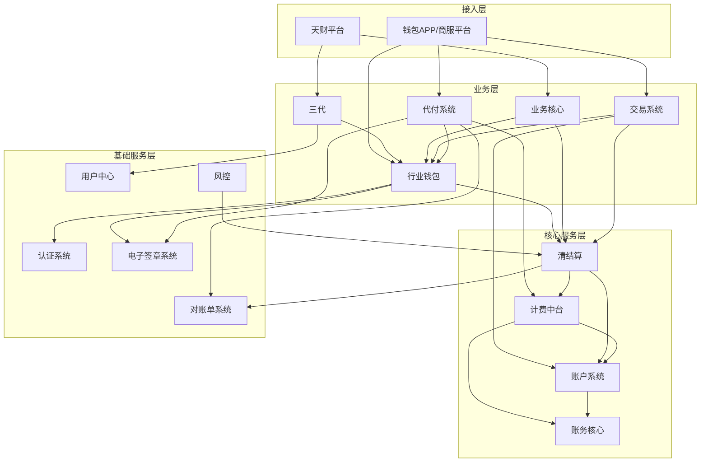
```mermaid
flowchart TD
    subgraph A [接入层]
        TC[天财平台]
        APP[钱包APP/商服平台]
    end

    subgraph B [业务层]
        SD[三代]
        IW[行业钱包]
        BC[业务核心]
        TS[交易系统]
        PS[代付系统]
    end

    subgraph C [核心服务层]
        ST[清结算]
        FC[计费中台]
        AS[账户系统]
        AC[账务核心]
    end

    subgraph D [基础服务层]
        UC[用户中心]
        AT[认证系统]
        ES[电子签章系统]
        BS[对账单系统]
        RC[风控]
    end

    TC --> SD
    TC --> BC
    APP --> IW
    APP --> TS
    APP --> PS

    SD --> IW
    SD --> UC
    IW --> ST
    IW --> AT
    IW --> ES
    BC --> IW
    BC --> ST
    TS --> IW
    TS --> ST
    TS --> AS
    PS --> IW
    PS --> FC
    PS --> ES
    PS --> BS

    ST --> FC
    ST --> AS
    ST --> BS
    FC --> AC
    FC --> AS
    AS --> AC
    RC --> ST
```

## 2.2 功能结构
系统功能围绕账户管理、资金交易、协议认证、运营支撑四大核心领域展开。每个领域由相应的系统模块提供具体功能，共同支撑“天财”平台的业务运营。

- **账户管理域**：负责商户入驻、账户开立、用户标识生成及账户状态管理。
- **资金交易域**：处理各类资金流转业务，包括分账、归集、会员结算、批量付款及其相关的清分、结算、计费、记账操作。
- **协议认证域**：为资金交易提供前置的身份核验与法律授权保障，包括关系绑定、协议签署、打款验证、人脸验证。
- **运营支撑域**：提供风险控制、对账文件生成、业务配置等运营管理功能。

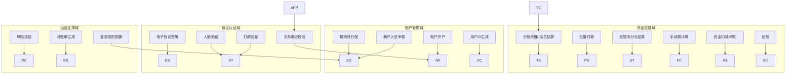
```mermaid
flowchart TD
    subgraph F1 [账户管理域]
        F1_A[商户入驻审核] --> SD
        F1_B[机构号分配] --> SD
        F1_C[账户开户] --> IW
        F1_D[用户ID生成] --> UC
    end

    subgraph F2 [资金交易域]
        F2_A[分账/归集/会员结算] --> TS
        F2_B[批量付款] --> PS
        F2_C[交易清分与结算] --> ST
        F2_D[手续费计算] --> FC
        F2_E[资金扣减/增加] --> AS
        F2_F[记账] --> AC
    end

    subgraph F3 [协议认证域]
        F3_A[关系绑定校验] --> IW
        F3_B[电子协议签署] --> ES
        F3_C[打款验证] --> AT
        F3_D[人脸验证] --> AT
    end

    subgraph F4 [运营支撑域]
        F4_A[风险冻结] --> RC
        F4_B[对账单生成] --> BS
        F4_C[业务规则配置] --> SD
    end

    TC --> F2_A
    APP --> F3_A
```

## 2.3 网络拓扑图
TBD

## 2.4 数据流转
以“分账”业务为例，描述一笔资金从请求发起至最终完成记账的数据流转过程。流程体现了请求的发起、业务校验、核心处理、资金操作及最终状态同步的完整链条。

1. 业务请求由“天财”平台发起，经“业务核心”接收并路由。
2. “交易系统”进行业务规则与账户状态校验，并调用“行业钱包”校验关系绑定。
3. “清结算”系统负责交易的清分与结算，调用“计费中台”计算手续费。
4. “计费中台”驱动“账务核心”与“账户系统”完成资金的扣减与增加。
5. 动账明细由“清结算”同步至“对账单系统”生成对账文件。
6. 各环节状态最终回传至“天财”平台。


```mermaid
flowchart LR
    A[天财: 发起分账] --> B[业务核心: 接收请求]
    B --> C[交易系统: 业务校验]
    C --> D[行业钱包: 关系绑定校验]
    D --> E[清结算: 清分与结算]
    E --> F[计费中台: 计算手续费与清分方案]
    F --> G[账务核心: 执行记账]
    G --> H[账户系统: 资金扣减/增加]
    H --> I[清结算: 同步动账明细]
    I --> J[对账单系统: 生成对账文件]
    J --> K[天财: 获取最终结果]
```

## 2.5 系统模块交互关系
模块间主要通过同步API调用进行交互，部分场景辅以异步事件通知。核心交互关系围绕业务流程展开，例如“三代”为“行业钱包”提供商户和机构信息以开户，“行业钱包”为“交易系统”提供关系绑定校验，“清结算”作为枢纽协调“计费中台”、“账户系统”和“对账单系统”完成资金处理。

- **强依赖调用**：如“交易系统”处理分账时，必须调用“行业钱包”校验关系绑定，调用“清结算”执行结算。
- **数据同步**：如“清结算”需从“账户系统”同步余额，并向“对账单系统”推送明细。
- **能力服务**：如“认证系统”、“电子签章系统”为上层业务提供可复用的认证与签署能力。

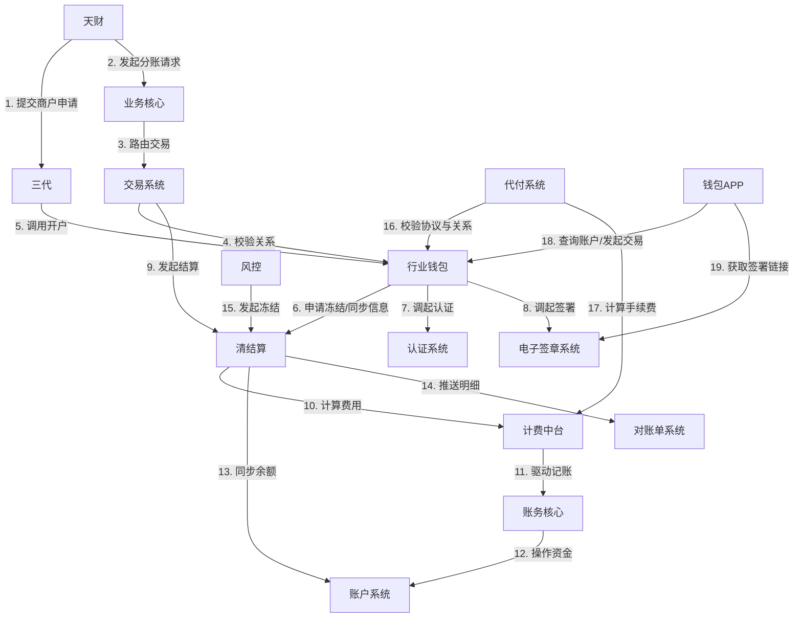
```mermaid
flowchart TD
    TC[天财] -->|1. 提交商户申请| SD[三代]
    TC -->|2. 发起分账请求| BC[业务核心]
    BC -->|3. 路由交易| TS[交易系统]
    TS -->|4. 校验关系| IW[行业钱包]
    SD -->|5. 调用开户| IW
    IW -->|6. 申请冻结/同步信息| ST[清结算]
    IW -->|7. 调起认证| AT[认证系统]
    IW -->|8. 调起签署| ES[电子签章系统]
    TS -->|9. 发起结算| ST
    ST -->|10. 计算费用| FC[计费中台]
    FC -->|11. 驱动记账| AC[账务核心]
    AC -->|12. 操作资金| AS[账户系统]
    ST -->|13. 同步余额| AS
    ST -->|14. 推送明细| BS[对账单系统]
    RC[风控] -->|15. 发起冻结| ST
    PS[代付系统] -->|16. 校验协议与关系| IW
    PS -->|17. 计算手续费| FC
    APP[钱包APP] -->|18. 查询账户/发起交易| IW
    APP -->|19. 获取签署链接| ES
```
---
# 3 模块设计

<a id="module-1"></a>

## 3.1 天财


### 1. 概述
- **目的与范围**: 天财模块是业务请求的发起方，负责发起分账、开户、关系绑定等业务请求。它与ISV/开放平台关联，获取并管理APPID，作为与下游系统交互的统一身份标识。本模块的核心职责是作为业务入口，封装并转发业务请求，管理业务请求的状态，并处理相关的业务逻辑，如参数校验、状态同步与异常补偿。

### 2. 接口设计
- **API端点 (REST/GraphQL)**: 天财模块对外提供RESTful API，供前端或外部系统调用，主要端点包括：
    - `POST /api/tiancai/ledger`: 发起分账请求。
    - `POST /api/tiancai/account/open`: 发起开户请求。
    - `POST /api/tiancai/relationship/bind`: 发起关系绑定请求。
    - `GET /api/tiancai/requests/{requestId}`: 查询业务请求状态。
- **请求/响应结构**: 所有请求均需携带由ISV/开放平台分配的`app_id`作为身份凭证。响应结构包含`code`、`message`、`data`字段，其中`data`包含业务流水号`request_id`或具体业务数据。
- **发布/消费的事件**: 天财模块消费来自下游系统（如行业钱包、清结算）的业务结果通知事件，用于更新本地业务请求状态。同时，在业务终态（成功/失败）时，会发布事件通知相关业务方。

### 3. 数据模型
- **表/集合**:
    1.  `tiancai_app_info`: 存储从ISV/开放平台获取的APPID及相关配置信息。
    2.  `tiancai_business_request`: 存储所有发起的业务请求记录，用于状态跟踪与查询。
    3.  `tiancai_merchant_mapping`: 存储商户（总部/门店）与机构号的映射关系。
- **关键字段**:
    - `tiancai_app_info`: `id`, `app_id`, `app_secret`, `platform` (ISV/开放平台), `status`, `create_time`。
    - `tiancai_business_request`: `request_id`, `app_id`, `business_type` (分账/开户/绑定), `request_params`, `status` (初始/处理中/成功/失败), `thirdparty_trace_id`, `result_data`, `create_time`, `update_time`。
    - `tiancai_merchant_mapping`: `id`, `app_id`, `merchant_id`, `institution_no` (机构号), `merchant_type` (总部/门店), `parent_merchant_id`。
- **与其他模块的关系**: 天财模块通过`app_id`与ISV/开放平台关联。通过`request_id`、`institution_no`等字段与三代、行业钱包、清结算等下游系统的业务记录关联。

### 4. 业务逻辑
- **核心工作流/算法**:
    1.  **发起分账**:
        - 输入：付方账户、收方账户、金额、业务场景（归集/会员结算/批量付款）、手续费模式（净额/全额）。
        - 流程：验证`app_id`有效性 -> 校验付方账户状态与余额 -> 调用行业钱包分账接口 -> 接收异步结果通知 -> 更新分账请求状态。
    2.  **发起开户**:
        - 输入：商户信息、商户类型（收单商户/非收单商户）、账户类型（天财收款账户/天财接收方账户）。
        - 流程：调用三代接口申请机构号 -> 携带机构号调用行业钱包开户接口 -> 行业钱包调用清结算及账户系统完成开户 -> 接收异步结果通知 -> 保存账户信息与机构号映射。
    3.  **发起关系绑定**:
        - 输入：付方商户ID、收方商户ID、协议类型。
        - 流程：校验双方商户状态及是否存在绑定冲突 -> 调用行业钱包关系绑定接口（可能触发电子签章流程） -> 接收异步结果通知 -> 更新绑定关系状态。
- **业务规则与验证**:
    - 所有请求必须携带有效且处于启用状态的`app_id`。
    - 分账请求需校验付方账户是否为**天财收款账户**，且余额充足。
    - 开户请求需根据商户类型（收单/非收单）确定开通的账户类型（天财收款账户/天财接收方账户）。
    - 关系绑定需确保付方已签署代付授权协议（开通付款）。
- **关键边界情况处理**:
    - **状态管理**: 本地`tiancai_business_request`表记录请求状态，通过异步通知或主动查询与下游系统进行状态同步，防止状态不一致。
    - **补偿机制**: 对于超时未收到下游响应的请求，启动主动查询补偿流程。对于最终失败的业务，记录详细错误原因，并提供人工干预入口。

### 5. 时序图

#### 5.1 开户时序图
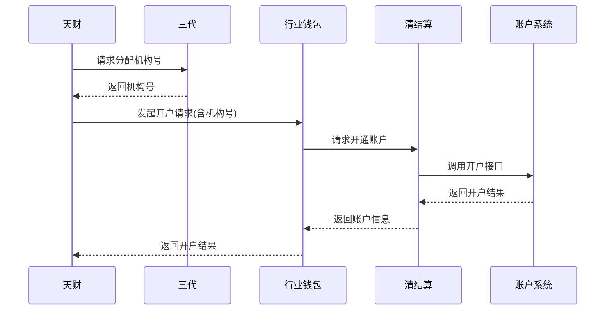
```mermaid
sequenceDiagram
    participant 天财
    participant 三代
    participant 行业钱包
    participant 清结算
    participant 账户系统

    天财->>三代: 请求分配机构号
    三代-->>天财: 返回机构号
    天财->>行业钱包: 发起开户请求(含机构号)
    行业钱包->>清结算: 请求开通账户
    清结算->>账户系统: 调用开户接口
    账户系统-->>清结算: 返回开户结果
    清结算-->>行业钱包: 返回账户信息
    行业钱包-->>天财: 返回开户结果
```

#### 5.2 分账时序图
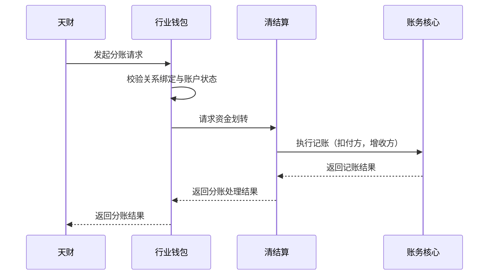
```mermaid
sequenceDiagram
    participant 天财
    participant 行业钱包
    participant 清结算
    participant 账务核心

    天财->>行业钱包: 发起分账请求
    行业钱包->>行业钱包: 校验关系绑定与账户状态
    行业钱包->>清结算: 请求资金划转
    清结算->>账务核心: 执行记账（扣付方，增收方）
    账务核心-->>清结算: 返回记账结果
    清结算-->>行业钱包: 返回分账处理结果
    行业钱包-->>天财: 返回分账结果
```

#### 5.3 关系绑定时序图
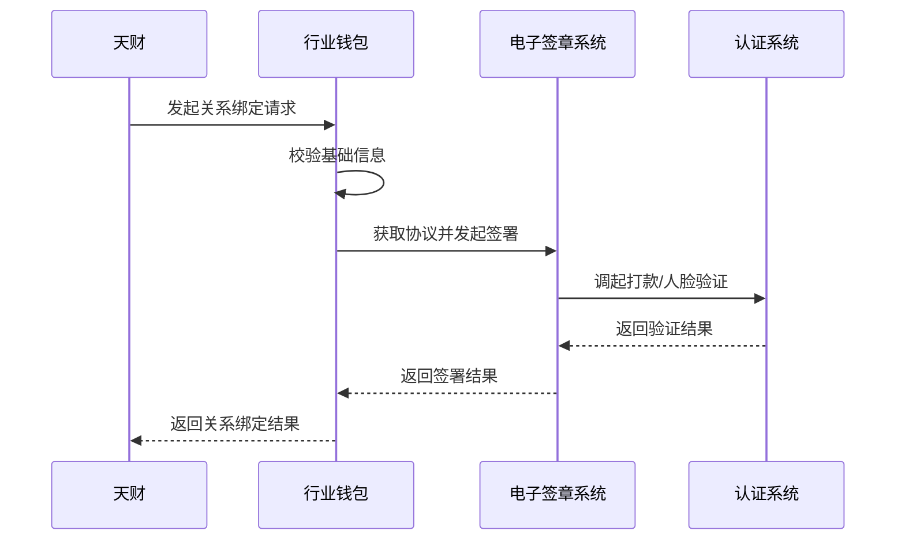
```mermaid
sequenceDiagram
    participant 天财
    participant 行业钱包
    participant 电子签章系统
    participant 认证系统

    天财->>行业钱包: 发起关系绑定请求
    行业钱包->>行业钱包: 校验基础信息
    行业钱包->>电子签章系统: 获取协议并发起签署
    电子签章系统->>认证系统: 调起打款/人脸验证
    认证系统-->>电子签章系统: 返回验证结果
    电子签章系统-->>行业钱包: 返回签署结果
    行业钱包-->>天财: 返回关系绑定结果
```

### 6. 错误处理
- **预期错误情况**:
    1.  参数校验失败（如`app_id`无效、金额格式错误）。
    2.  网络超时或下游服务（三代、行业钱包）不可用。
    3.  业务逻辑错误（如账户不存在、余额不足、关系已绑定、商户已冻结）。
    4.  权限验证失败（如`app_id`无此操作权限）。
- **处理策略**:
    - 参数与权限错误立即失败，返回明确错误码。
    - 网络超时等暂时性错误，根据`tiancai_business_request`记录实施指数退避重试。
    - 业务逻辑错误，记录详细日志，更新请求状态为失败，并返回业务方可识别的错误信息。
    - 建立监控告警机制，对持续失败或长时间处于“处理中”状态的请求进行告警。

### 7. 依赖关系
- **上游模块**: ISV/开放平台（提供并管理`APPID`）。
- **下游模块**:
    - 三代运营：分配机构号、审核商户资质。
    - 行业钱包：处理开户、关系绑定、分账等核心业务请求。
    - 清结算/计费中台：处理资金清分、结算、手续费计算。
    - 账户系统：执行底层账户操作。
    - 账务核心：执行记账。
    - 电子签章系统：处理协议签署。
    - 认证系统：提供身份核验。
    - 业务核心：接收分账等交易数据。

<a id="module-2"></a>

## 3.2 三代


### 1. 概述
- **目的与范围**: 三代模块是运营系统，核心职责是管理天财平台下的商户与机构。主要功能包括：分配机构号、审核商户信息、调用接口开通账户及配置业务（如分账、归集）。它是连接天财平台与行业钱包、清结算等核心业务系统的运营管理枢纽。

### 2. 接口设计
- **API端点 (REST)**:
    1.  `POST /api/v1/merchant/register`: 接收天财提交的商户入驻申请。
    2.  `POST /api/v1/merchant/audit`: 提交商户审核结果。
    3.  `POST /api/v1/business/config`: 接收天财的业务配置请求（如开通分账、归集）。
    4.  `GET /api/v1/merchant/{merchantId}`: 查询商户信息及状态。
    5.  `PUT /api/v1/merchant/{merchantId}/info`: 更新商户信息。
- **请求/响应结构**: TBD
- **发布/消费的事件**:
    - **发布事件**:
        1.  `MerchantAuditPassedEvent`: 商户审核通过事件。
        2.  `InstitutionCreatedEvent`: 机构信息创建/更新事件。
        3.  `BusinessConfigCompletedEvent`: 业务配置完成事件。
    - **消费事件**: TBD

### 3. 数据模型
- **表/集合**:
    1.  **机构信息表 (t_institution)**
        - `id` (BIGINT, PK): 自增主键。
        - `institution_no` (VARCHAR(32), UNIQUE): 机构号（二级机构号），平台下唯一。
        - `platform_id` (VARCHAR(64)): 天财平台标识。
        - `type` (TINYINT): 机构类型（如：1-总部，2-门店）。
        - `parent_institution_no` (VARCHAR(32), FK -> t_institution.institution_no): 父级机构号（门店关联总部）。
        - `status` (TINYINT): 状态（如：0-待审核，1-正常，2-禁用）。
        - `audit_time` (DATETIME): 审核时间。
        - `create_time` (DATETIME): 创建时间。
        - `update_time` (DATETIME): 更新时间。

    2.  **商户信息表 (t_merchant)**
        - `id` (BIGINT, PK): 自增主键。
        - `merchant_id` (VARCHAR(64), UNIQUE): 商户ID。
        - `institution_no` (VARCHAR(32), FK -> t_institution.institution_no): 关联的机构号。
        - `merchant_type` (TINYINT): 商户类型（如：1-收单商户，2-非收单商户）。
        - `qualification_info` (JSON): 资质信息（结构化JSON存储）。
        - `audit_status` (TINYINT): 审核状态（如：0-待审核，1-审核通过，2-审核驳回）。
        - `audit_comment` (VARCHAR(512)): 审核意见。
        - `create_time` (DATETIME): 创建时间。
        - `update_time` (DATETIME): 更新时间。

    3.  **业务配置表 (t_business_config)**
        - `id` (BIGINT, PK): 自增主键。
        - `config_no` (VARCHAR(64), UNIQUE): 配置流水号。
        - `ref_id` (VARCHAR(64)): 关联ID（可为机构号或商户ID）。
        - `ref_type` (TINYINT): 关联类型（如：1-机构，2-商户）。
        - `business_type` (VARCHAR(32)): 业务类型（如：`SPLIT_ACCOUNT`-分账，`FUND_COLLECTION`-归集）。
        - `config_params` (JSON): 业务配置参数。
        - `status` (TINYINT): 开通状态（如：0-待处理，1-处理中，2-开通成功，3-开通失败）。
        - `retry_count` (INT): 下游调用重试次数。
        - `last_error` (TEXT): 最后一次错误信息。
        - `create_time` (DATETIME): 创建时间。
        - `update_time` (DATETIME): 更新时间。

- **与其他模块的关系**:
    - 为行业钱包提供商户与机构信息，用于开户和关系绑定。
    - 为清结算提供机构层级信息，用于资金清分。

### 4. 业务逻辑
- **核心工作流/算法**:
    1.  **机构分配与审核**:
        - **触发**: 接收天财平台提交的总部及门店信息。
        - **步骤**:
            a. 校验信息完整性及格式。
            b. 生成平台下唯一的机构号。
            c. 持久化机构信息，状态置为“待审核”。
            d. 运营人员进行资质审核。
            e. 审核通过：更新机构状态为“正常”，发布`InstitutionCreatedEvent`。
            f. 审核驳回：更新机构状态为“禁用”，记录驳回原因。
    2.  **账户开通触发**:
        - **触发**: 商户审核通过（`MerchantAuditPassedEvent`）。
        - **步骤**:
            a. 根据商户类型（收单/非收单），调用行业钱包对应的开户接口。
            b. 接收开户结果，更新商户关联的账户信息。
    3.  **业务配置**:
        - **触发**: 接收天财的业务配置请求（如开通分账、归集）。
        - **步骤**:
            a. 校验请求方权限及关联商户/机构状态是否为“正常”。
            b. 创建业务配置记录，状态为“待处理”。
            c. 异步调用行业钱包的业务配置接口。
            d. 接收配置结果，更新业务配置状态为“开通成功”或“开通失败”。
            e. 若成功，发布`BusinessConfigCompletedEvent`。
- **业务规则与验证**:
    - 机构号在平台下唯一。
    - 审核商户资质需符合开通对应账户类型的要求（如收单商户需企业资质）。
    - 门店必须关联一个已审核通过的总部机构。
    - 仅状态为“正常”的商户/机构可进行业务配置。
- **实体状态管理**:
    - **机构状态**: 待审核 -> (审核通过) -> 正常；待审核 -> (审核驳回) -> 禁用。
    - **商户审核状态**: 待审核 -> (审核通过) -> 审核通过；待审核 -> (审核驳回) -> 审核驳回。
    - **业务配置状态**: 待处理 -> 处理中 -> (调用成功) -> 开通成功；待处理 -> 处理中 -> (调用失败) -> 开通失败。
- **关键边界情况处理**:
    - 审核驳回流程及信息同步至天财。
    - 已分配机构号的商户信息变更，需同步至下游系统（行业钱包、清结算）。
    - 调用下游系统接口失败时的重试与补偿机制（见错误处理章节）。

### 5. 时序图

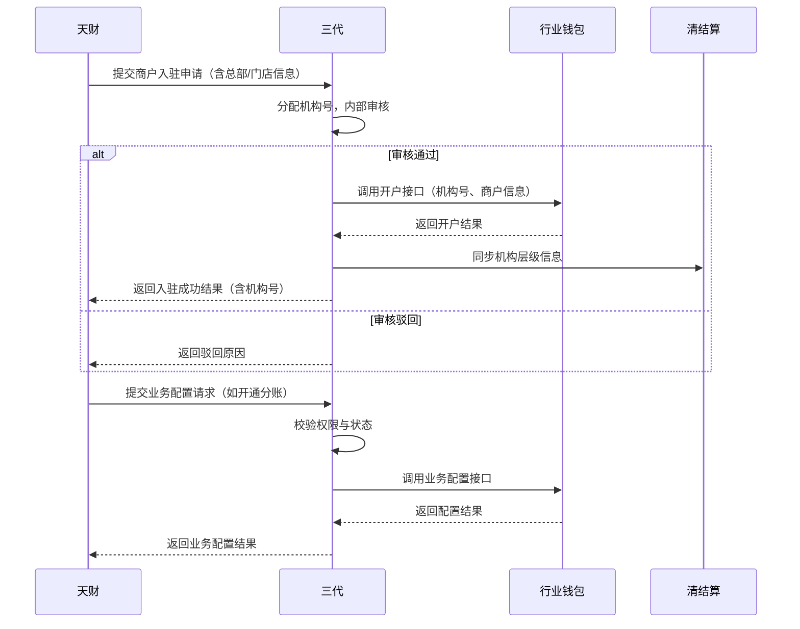
```mermaid
sequenceDiagram
    participant 天财
    participant 三代
    participant 行业钱包
    participant 清结算

    天财->>三代: 提交商户入驻申请（含总部/门店信息）
    三代->>三代: 分配机构号，内部审核
    alt 审核通过
        三代->>行业钱包: 调用开户接口（机构号、商户信息）
        行业钱包-->>三代: 返回开户结果
        三代->>清结算: 同步机构层级信息
        三代-->>天财: 返回入驻成功结果（含机构号）
    else 审核驳回
        三代-->>天财: 返回驳回原因
    end

    天财->>三代: 提交业务配置请求（如开通分账）
    三代->>三代: 校验权限与状态
    三代->>行业钱包: 调用业务配置接口
    行业钱包-->>三代: 返回配置结果
    三代-->>天财: 返回业务配置结果
```

### 6. 错误处理
- **预期错误情况**:
    1.  **下游系统异常**: 行业钱包、清结算服务不可用或接口超时。
    2.  **数据错误**: 提交的商户信息不完整、格式错误或资质不符。
    3.  **数据冲突**: 分配机构号时发生唯一键冲突。
    4.  **业务逻辑错误**: 对非正常状态的实体进行操作。
- **处理策略**:
    1.  **下游接口调用**:
        - 实现熔断与降级机制，防止级联故障。
        - **重试策略**: 对可重试的失败（如网络超时）采用指数退避重试（如最多3次）。
        - **补偿机制**: 对于开户或配置失败，将对应记录状态标记为“开通失败”，记录错误日志，并支持人工介入或定时任务重新触发。
    2.  **输入校验**: 在API入口进行严格校验，返回明确、格式化的错误码与信息。
    3.  **数据一致性**: 关键业务流程（如审核通过并触发开户）使用数据库事务保证。唯一键冲突提示客户端重试或检查数据。
    4.  **状态校验**: 在执行业务操作前，校验关联实体（商户、机构）的状态，非法状态直接返回错误。

### 7. 依赖关系
- **上游模块**: 天财（业务请求来源）
- **下游模块**:
    - 行业钱包（开户、业务配置）
    - 清结算（机构层级信息同步）

<a id="module-3"></a>

## 3.3 行业钱包


### 1. 概述
- **目的与范围**: 行业钱包模块是处理用户中心生成、账户开户、关系绑定校验及分账请求的核心业务系统。它作为业务核心与底层账户系统之间的桥梁，负责接收天财平台通过业务核心发起的业务请求（如分账、归集），进行业务逻辑处理、关系校验，并调用清结算、账户系统等下游服务完成资金操作。其边界止于业务请求的受理、校验、路由和结果返回，不直接管理资金账户的底层记账与余额。

### 2. 接口设计
- **API端点 (REST/GraphQL)**: TBD
- **请求/响应结构**: TBD
- **发布/消费的事件**: TBD

### 3. 数据模型
- **表/集合**: TBD
- **关键字段**: TBD
- **与其他模块的关系**: 行业钱包模块依赖清结算系统处理分账清分和手续费计算，依赖账户系统执行账户开户与资金操作，依赖认证系统完成打款验证和人脸验证，依赖电子签章系统完成协议签署。它为业务核心提供分账等业务处理能力。

### 4. 业务逻辑
- **核心工作流/算法**:
    1.  **账户开户**: 接收三代运营的指令，为收单商户（总部、门店）开通天财收款账户，或为非收单商户/个人开通天财接收方账户。
    2.  **关系绑定**: 在发起分账、归集等业务前，校验付方与收方之间是否已建立有效的授权与协议关系。
    3.  **分账处理**: 接收天财通过业务核心转发的分账请求（包括归集、会员结算、批量付款等场景），校验业务规则（如关系、余额），调用清结算进行清分和计费，最终驱动账户系统完成资金划转。
    4.  **开通付款**: 在批量付款或会员结算场景下，引导付方完成代付授权协议的电子签章流程。
- **业务规则与验证**:
    - 分账前必须验证付方与收方已成功绑定关系。
    - 需校验付方天财收款账户的可用余额是否充足。
    - 根据业务场景（净额转账/全额转账）调用计费中台计算手续费。
    - 对个人接收方，需通过认证系统完成打款验证或人脸验证。
- **关键边界情况处理**:
    - 处理清结算或账户系统调用失败时的冲正或补偿逻辑。
    - 处理关系绑定已存在或无效的请求。
    - 处理商户冻结或交易冻结状态下对账户操作的拦截。
- **冲正与补偿逻辑**: 对于下游系统（清结算、账户系统）调用失败，采用基于事务补偿（Saga）的模式。若清分或资金划转步骤失败，将根据已执行的步骤顺序，触发逆向操作进行冲正，并记录补偿日志用于人工对账与干预。
- **幂等性设计**: 所有业务请求（如分账、开户）必须携带由上游系统（业务核心）生成的唯一幂等键。行业钱包在处理请求前，会校验该幂等键是否已存在，若已存在则直接返回之前的处理结果，防止重复请求导致资金错账。
- **超时与重试策略**: 对下游系统（清结算、账户系统、认证系统）的调用设置合理的超时时间。对于非核心校验步骤（如部分查询）失败，采用快速失败策略。对于核心资金操作步骤（如清分、划账）失败，在系统级错误（如网络超时）时，采用指数退避策略进行有限次重试（如最多3次），重试失败后触发补偿流程。

### 5. 时序图
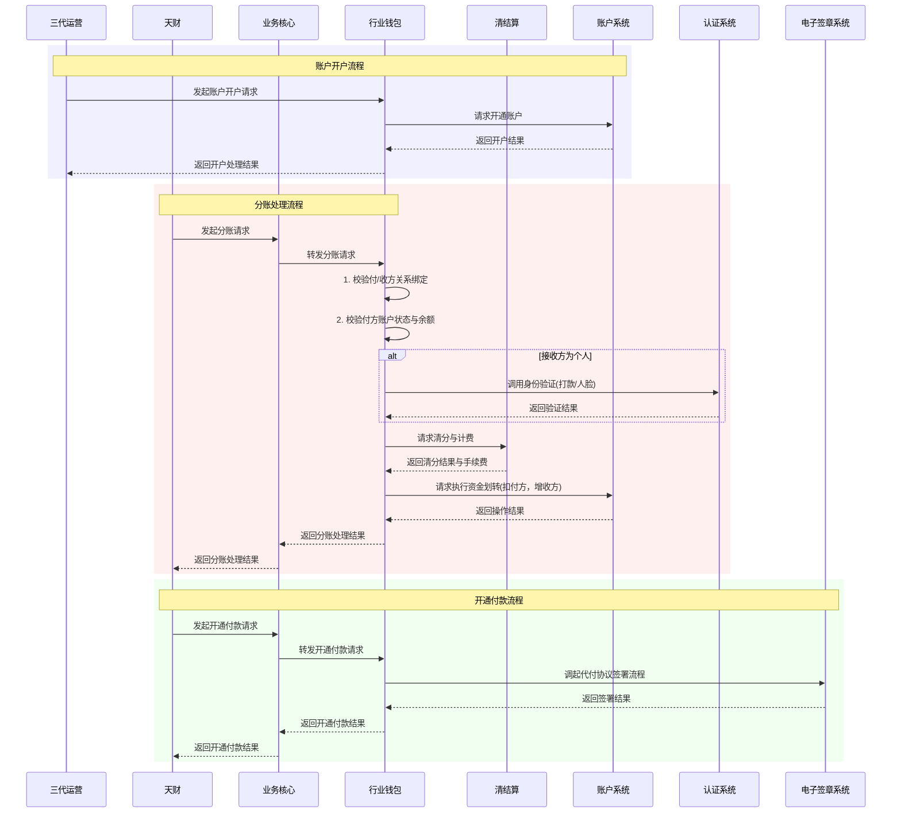
```mermaid
sequenceDiagram
    participant 三代运营
    participant 天财
    participant 业务核心
    participant 行业钱包
    participant 清结算
    participant 账户系统
    participant 认证系统
    participant 电子签章系统

    rect rgb(240, 240, 255)
        Note over 三代运营,账户系统: 账户开户流程
        三代运营->>行业钱包: 发起账户开户请求
        行业钱包->>账户系统: 请求开通账户
        账户系统-->>行业钱包: 返回开户结果
        行业钱包-->>三代运营: 返回开户处理结果
    end

    rect rgb(255, 240, 240)
        Note over 天财,行业钱包: 分账处理流程
        天财->>业务核心: 发起分账请求
        业务核心->>行业钱包: 转发分账请求
        行业钱包->>行业钱包: 1. 校验付/收方关系绑定
        行业钱包->>行业钱包: 2. 校验付方账户状态与余额
        alt 接收方为个人
            行业钱包->>认证系统: 调用身份验证(打款/人脸)
            认证系统-->>行业钱包: 返回验证结果
        end
        行业钱包->>清结算: 请求清分与计费
        清结算-->>行业钱包: 返回清分结果与手续费
        行业钱包->>账户系统: 请求执行资金划转(扣付方，增收方)
        账户系统-->>行业钱包: 返回操作结果
        行业钱包-->>业务核心: 返回分账处理结果
        业务核心-->>天财: 返回分账处理结果
    end

    rect rgb(240, 255, 240)
        Note over 天财,电子签章系统: 开通付款流程
        天财->>业务核心: 发起开通付款请求
        业务核心->>行业钱包: 转发开通付款请求
        行业钱包->>电子签章系统: 调起代付协议签署流程
        电子签章系统-->>行业钱包: 返回签署结果
        行业钱包-->>业务核心: 返回开通付款结果
        业务核心-->>天财: 返回开通付款结果
    end
```

### 6. 错误处理
- **预期错误情况**:
    - 付方与收方关系未绑定或已失效。
    - 付方天财收款账户余额不足。
    - 付方或收方账户被冻结（商户冻结）。
    - 下游系统（清结算、账户系统、认证系统）服务异常或超时。
    - 个人接收方身份验证失败。
    - 重复的幂等键请求。
- **处理策略**:
    - 对于业务规则校验失败（如关系无效、余额不足），立即返回明确的错误码和提示。
    - 对于下游系统调用失败，根据业务重要性决定是否重试，并记录日志用于对账与人工干预。
    - 实现幂等性设计，防止重复请求导致资金错账。
    - 对于核心资金操作失败，启动基于Saga的补偿流程进行冲正。

### 7. 依赖关系
- **上游模块**: 三代运营、业务核心。
- **下游模块**: 清结算（计费中台）、账户系统、账务核心、认证系统、电子签章系统。

<a id="module-4"></a>

## 3.4 清结算


### 1. 概述
- **目的与范围**: 本模块是负责交易清分、结算、计费、账户信息同步及冻结申请处理的核心系统。其边界包括：接收来自业务核心的交易数据，进行手续费计算与清分，将结算指令发送至账户系统，处理来自行业钱包的冻结申请，并向对账单系统提供账户动账明细。本模块与术语表中的“计费中台”为同一系统，不视为两个独立实体。

### 2. 接口设计
- **API端点 (REST/GraphQL)**:
    - **POST /api/v1/settlement/orders**: 接收业务核心发起的结算请求。
    - **POST /api/v1/freeze/requests**: 接收行业钱包发起的商户冻结或交易冻结申请。
    - **GET /api/v1/accounts/{accountNo}/balance**: 从账户系统同步指定账户的余额与状态信息。
    - **POST /api/v1/statements/details**: 向对账单系统推送动账明细。
- **请求/响应结构**:
    - **结算请求 (来自业务核心)**: TBD（需包含交易流水号、机构号、付方账户、收方账户、金额、业务类型、结算模式等字段）
    - **冻结申请 (来自行业钱包)**: TBD（需包含冻结类型、目标账户号、关联交易号、冻结原因、申请方等字段）
    - **结算指令 (发往账户系统)**: TBD（需包含指令流水号、操作类型、账户号、金额、业务标识等字段）
    - **动账明细 (发往对账单系统)**: TBD（需包含账户号、交易时间、交易类型、金额、余额、关联业务号等字段）
- **发布/消费的事件**:
    - **消费事件**: 消费业务核心发布的“交易完成”事件，作为结算流程的触发源之一。
    - **发布事件**: 发布“结算指令已发送”、“结算完成”、“冻结指令已执行”等事件，供下游系统订阅。

### 3. 数据模型
- **表/集合**:
    - **结算订单表 (SettlementOrder)**: 记录每一笔结算请求的处理状态与结果。
    - **手续费规则表 (FeeRule)**: 存储不同业务类型（如分账、归集）下的手续费计算规则（净额/全额、费率等）。
    - **冻结申请记录表 (FreezeRequest)**: 记录来自行业钱包的冻结申请及处理状态。
    - **待重试任务表 (RetryTask)**: 记录因下游系统失败而需要重试的指令。
- **关键字段**:
    - **SettlementOrder**: 订单ID、交易流水号、业务类型、结算模式（主动/被动）、付方账户、收方账户、交易金额、手续费金额、净结算金额、状态（待处理、清分中、结算指令已生成、结算成功、结算失败）、创建时间、完成时间。
    - **FeeRule**: 规则ID、业务类型、适用账户类型、手续费计算方式（净额转账、全额转账）、费率/固定金额、生效时间、失效时间。
    - **FreezeRequest**: 申请ID、冻结类型（商户冻结、交易冻结）、目标账户号、关联交易号、申请状态（待处理、已转发、执行成功、执行失败）、申请时间、处理时间。
    - **RetryTask**: 任务ID、关联业务ID（如结算订单ID）、任务类型（结算指令重试、冻结指令重试）、当前重试次数、最大重试次数、下次重试时间、状态（待重试、重试中、已成功、已放弃）。
- **与其他模块的关系**: 通过交易流水号与业务核心的交易数据关联；通过账户号与账户系统的账户信息关联；通过申请ID与行业钱包的冻结申请关联。

### 4. 业务逻辑
- **核心工作流/算法**:
    1.  **交易清分与结算流程**:
        - **触发**: 通过API接收业务核心的结算请求或消费其发布的“交易完成”事件。
        - **幂等性检查**: 根据交易流水号检查是否已处理，避免重复结算。
        - **清分与计费**:
            - 根据业务类型（如分账、归集）查询`FeeRule`表获取手续费规则。
            - 根据规则计算手续费（净额转账：手续费从交易金额中扣除；全额转账：手续费额外计算）。
        - **结算模式决策**:
            - **主动结算**: 当请求中指定了结算账户（如天财收款账户）时，结算至该账户。
            - **被动结算**: 当未指定结算账户时，结算至该商户的默认结算账户（如01待结算账户）。
        - **生成结算指令**: 组装指令数据，调用账户系统接口进行资金划转。
        - **状态更新与通知**: 更新`SettlementOrder`状态，并向对账单系统推送动账明细。
    2.  **冻结申请处理流程**:
        - **接收申请**: 通过API接收行业钱包的冻结申请。
        - **风控流程衔接**: 本模块不进行风控判定，仅作为指令转发通道。申请中已包含风控判定结果（冻结类型、原因）。
        - **指令转发**: 根据冻结类型，调用账户系统的对应接口（冻结账户或冻结账户内特定资金）。
        - **状态同步**: 记录处理结果，并可能向行业钱包反馈执行状态。
    3.  **账户信息同步**: 定时或按需调用账户系统接口，获取关键账户（如天财收款账户）的余额与状态（正常、冻结），用于业务逻辑判断（如结算前检查账户状态）。
- **业务规则与验证**:
    1.  结算前校验账户状态，若账户已冻结，则终止结算流程并记录失败。
    2.  支持配置化的手续费规则，规则匹配优先级：具体业务类型 > 默认规则。
    3.  结算指令需保证幂等性，支持重试而不导致重复扣款或加款。
- **关键边界情况处理**:
    1.  **结算失败处理（对账与补偿）**:
        - 若调用账户系统失败，将相关指令记录至`RetryTask`表，进入异步重试队列。
        - 重试策略：指数退避，达到最大重试次数后标记为最终失败，并触发告警，需人工介入对账。
        - 每日日终执行对账作业，比对本模块的结算记录与账户系统的资金变动记录，发现差异并生成异常报告。
    2.  **手续费计算异常**: 若无匹配规则，结算流程中断，记录错误并告警，需人工配置规则。
    3.  **数据不一致**: 如接收的交易数据中账户信息不存在，立即失败并通知业务核心。

### 5. 时序图
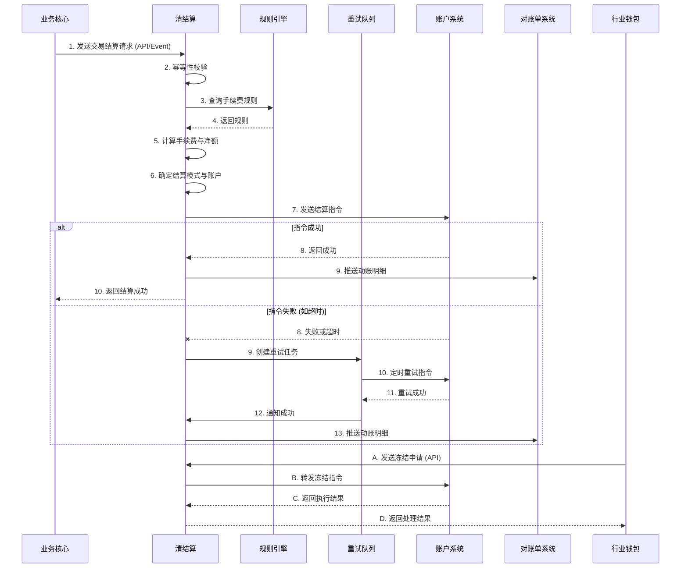
```mermaid
sequenceDiagram
    participant 业务核心
    participant 清结算
    participant 规则引擎
    participant 重试队列
    participant 账户系统
    participant 对账单系统
    participant 行业钱包

    业务核心->>清结算: 1. 发送交易结算请求 (API/Event)
    清结算->>清结算: 2. 幂等性校验
    清结算->>规则引擎: 3. 查询手续费规则
    规则引擎-->>清结算: 4. 返回规则
    清结算->>清结算: 5. 计算手续费与净额
    清结算->>清结算: 6. 确定结算模式与账户
    清结算->>账户系统: 7. 发送结算指令
    alt 指令成功
        账户系统-->>清结算: 8. 返回成功
        清结算->>对账单系统: 9. 推送动账明细
        清结算-->>业务核心: 10. 返回结算成功
    else 指令失败 (如超时)
        账户系统--x清结算: 8. 失败或超时
        清结算->>重试队列: 9. 创建重试任务
        重试队列->>账户系统: 10. 定时重试指令
        账户系统-->>重试队列: 11. 重试成功
        重试队列->>清结算: 12. 通知成功
        清结算->>对账单系统: 13. 推送动账明细
    end

    行业钱包->>清结算: A. 发送冻结申请 (API)
    清结算->>账户系统: B. 转发冻结指令
    账户系统-->>清结算: C. 返回执行结果
    清结算-->>行业钱包: D. 返回处理结果
```

### 6. 错误处理
- **预期错误情况**:
    1.  **下游依赖不可用**: 账户系统、对账单系统服务异常或网络超时。
    2.  **数据错误**: 交易数据格式非法、账户不存在、手续费规则缺失。
    3.  **业务规则冲突**: 账户已冻结、余额不足导致结算失败。
    4.  **幂等冲突**: 重复的请求流水号。
- **处理策略**:
    1.  **重试与熔断**: 对下游API调用配置重试机制与熔断器（如基于失败率）。结算指令失败进入异步重试队列。
    2.  **优雅降级**: 若对账单系统暂时不可用，动账明细可先持久化到本地，待其恢复后补推。
    3.  **快速失败与告警**: 对于数据错误、规则缺失等预期内错误，立即失败，记录详细日志并触发告警通知负责人。
    4.  **状态管理与对账**: 所有核心操作均需更新明确的状态（如`SettlementOrder.status`），并通过日终对账保证最终一致性。

### 7. 依赖关系
- **上游模块**:
    - **业务核心**: 提供交易数据，触发结算流程。
    - **行业钱包**: 发起商户冻结与交易冻结申请。
- **下游模块**:
    - **账户系统**: 执行资金划转、账户冻结等底层账务操作。
    - **对账单系统**: 接收动账明细，用于生成对账文件。
- **内部依赖**:
    - **规则引擎**: 查询手续费计算规则（可作为本模块内嵌组件或独立服务）。

<a id="module-5"></a>

## 3.5 账户系统


### 1. 概述
- **目的与范围**：账户系统是底层负责账户开户、冻结、资金扣减/增加、余额管理等核心功能的系统。它为上层业务（如行业钱包、清结算）提供基础的账户操作能力，确保资金操作的原子性和一致性。

### 2. 接口设计
- **API端点 (REST/GraphQL)**：
    - `POST /api/v1/accounts`：创建账户（开户）。
    - `PATCH /api/v1/accounts/{accountId}/status`：更新账户状态（如冻结/解冻）。
    - `POST /api/v1/accounts/{accountId}/debit`：执行资金扣减。
    - `POST /api/v1/accounts/{accountId}/credit`：执行资金增加。
    - `GET /api/v1/accounts/{accountId}/balance`：查询账户余额。
- **请求/响应结构**：
    - 通用响应结构：`{“code”: “string”, “msg”: “string”, “data”: object, “traceId”: “string”}`。
    - 创建账户请求：`{“userId”: “string”, “accountType”: “string”, “currency”: “string”}`。
    - 资金操作请求：`{“amount”: “BigDecimal”, “bizOrderNo”: “string”, “remark”: “string”}`。
- **发布/消费的事件**：
    - 发布事件：`AccountCreatedEvent`、`AccountFrozenEvent`、`AccountUnfrozenEvent`、`AccountBalanceChangedEvent`。
    - 消费事件：TBD。

### 3. 数据模型
- **表/集合**：
    - `account`：账户主表。
    - `account_balance`：账户余额表。
    - `account_transaction_log`：账户交易流水表。
- **关键字段**：
    - `account`：`id`（主键），`account_no`（账户号），`user_id`，`account_type`，`status`（状态：正常/冻结/销户），`currency`，`create_time`。
    - `account_balance`：`id`（主键），`account_id`，`balance`（余额），`available_balance`（可用余额），`frozen_balance`（冻结余额），`version`（版本号，用于乐观锁）。
    - `account_transaction_log`：`id`（主键），`account_id`，`biz_order_no`（业务订单号），`change_amount`（变动金额），`balance_after`（变动后余额），`transaction_type`（交易类型：DEBIT/CREDIT），`create_time`。
- **与其他模块的关系**：账户系统为行业钱包、清结算、账务核心等模块提供账户数据支撑和操作接口。

### 4. 业务逻辑
- **核心工作流/算法**：主要业务流程包括账户开户、账户冻结/解冻、资金扣减、资金增加、余额查询。
- **业务规则与验证**：
    1.  执行资金操作时需校验账户状态（如是否冻结）。
    2.  执行扣减操作时需校验可用余额是否充足。
    3.  账户号生成需保证全局唯一性。
- **关键边界情况处理**：
    1.  **并发控制**：采用乐观锁机制处理并发扣款。在`account_balance`表中使用`version`字段，更新余额时校验版本号，若不一致则操作失败并提示重试。
    2.  **幂等性**：所有资金操作需基于唯一的业务订单号（`biz_order_no`）保证幂等，防止重复处理。
    3.  **事务一致性**：涉及余额更新与流水记录的操作必须在同一数据库事务内完成。

### 5. 时序图

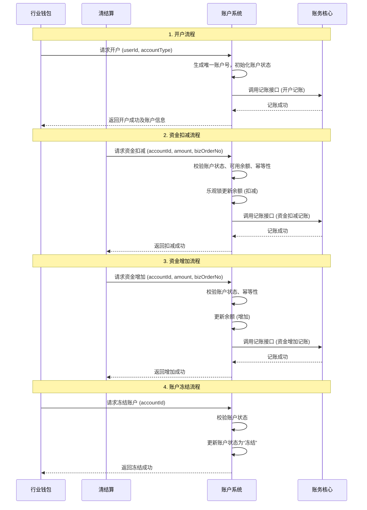
```mermaid
sequenceDiagram
    participant 行业钱包
    participant 清结算
    participant 账户系统
    participant 账务核心

    Note over 行业钱包,账务核心: 1. 开户流程
    行业钱包->>账户系统: 请求开户 (userId, accountType)
    账户系统->>账户系统: 生成唯一账户号，初始化账户状态
    账户系统->>账务核心: 调用记账接口 (开户记账)
    账务核心-->>账户系统: 记账成功
    账户系统-->>行业钱包: 返回开户成功及账户信息

    Note over 行业钱包,账务核心: 2. 资金扣减流程
    清结算->>账户系统: 请求资金扣减 (accountId, amount, bizOrderNo)
    账户系统->>账户系统: 校验账户状态、可用余额、幂等性
    账户系统->>账户系统: 乐观锁更新余额 (扣减)
    账户系统->>账务核心: 调用记账接口 (资金扣减记账)
    账务核心-->>账户系统: 记账成功
    账户系统-->>清结算: 返回扣减成功

    Note over 行业钱包,账务核心: 3. 资金增加流程
    清结算->>账户系统: 请求资金增加 (accountId, amount, bizOrderNo)
    账户系统->>账户系统: 校验账户状态、幂等性
    账户系统->>账户系统: 更新余额 (增加)
    账户系统->>账务核心: 调用记账接口 (资金增加记账)
    账务核心-->>账户系统: 记账成功
    账户系统-->>清结算: 返回增加成功

    Note over 行业钱包,账务核心: 4. 账户冻结流程
    行业钱包->>账户系统: 请求冻结账户 (accountId)
    账户系统->>账户系统: 校验账户状态
    账户系统->>账户系统: 更新账户状态为“冻结”
    账户系统-->>行业钱包: 返回冻结成功
```

### 6. 错误处理
- **预期错误情况**：账户不存在、账户已冻结、余额不足、重复请求（幂等冲突）、系统内部错误、乐观锁版本冲突。
- **处理策略**：
    1.  对于业务错误（如余额不足、账户冻结）返回明确的错误码和提示信息。
    2.  对于幂等冲突，直接返回之前的成功结果。
    3.  对于乐观锁版本冲突，返回特定错误码，建议调用方重试。
    4.  对于系统错误进行详细的日志记录、告警，并根据错误类型触发自动重试或人工介入流程。

### 7. 依赖关系
- **上游模块（调用方）**：行业钱包、清结算、账务核心。
- **下游模块（被调用方）**：账务核心。

<a id="module-6"></a>

## 3.6 账务核心


### 1. 概述
- **目的与范围**: 账务核心模块是负责执行记账、生成凭证、更新账务的系统。它是资金流转的底层执行单元，接收来自上游系统的记账指令，确保账户余额、流水等账务数据的准确性和一致性。其边界在于处理记账请求本身，不涉及业务逻辑判断、风控或协议签署等前置流程。该模块与**账户系统**为独立的服务，通过内部接口进行交互。

### 2. 接口设计
- **API端点 (REST/GraphQL)**: 提供 RESTful API。
    - `POST /api/v1/accounting/entry`: 执行单笔记账。
    - `POST /api/v1/accounting/batch-entry`: 执行批量记账。
- **请求/响应结构**:
    - 记账请求体 (`AccountingRequest`):
        - `requestId`: `String` (必填，幂等键)
        - `payerAccountNo`: `String` (必填，付方账户号)
        - `receiverAccountNo`: `String` (必填，收方账户号)
        - `amount`: `BigDecimal` (必填，金额，单位：元)
        - `bizType`: `String` (必填，业务类型，如 “分账”、“归集”)
        - `bizRefNo`: `String` (必填，业务参考号)
        - `remark`: `String` (可选，备注)
    - 成功响应体 (`AccountingResponse`):
        - `success`: `Boolean`
        - `voucherNo`: `String` (生成的账务凭证号)
        - `timestamp`: `Long`
- **发布/消费的事件**:
    - 消费事件: TBD (例如，监听来自清结算的记账指令消息)
    - 发布事件: `AccountingCompletedEvent` (记账完成事件)，包含凭证号、业务类型、金额、账户信息等。

### 3. 数据模型
- **表/集合**: 账务核心模块主要操作**账户系统**的数据，自身维护记账请求日志与凭证索引。
    - `accounting_voucher` (账务凭证索引表):
        - `voucher_no`: `String` (主键，凭证号)
        - `request_id`: `String` (唯一索引，幂等键)
        - `biz_type`: `String`
        - `biz_ref_no`: `String`
        - `payer_account_no`: `String`
        - `receiver_account_no`: `String`
        - `amount`: `Decimal`
        - `status`: `String` (状态，如 “SUCCESS”, “FAILED”)
        - `created_at`: `Timestamp`
- **关键字段**: 见上表。
- **与其他模块的关系**: 账务核心模块通过内部API调用**账户系统**，操作其账户余额与流水数据。它接收来自**清结算**、**行业钱包**、**业务核心**等系统的记账指令。

### 4. 业务逻辑
- **核心工作流/算法**:
    1.  **接收与校验**: 接收记账请求，校验请求格式、必填字段。
    2.  **幂等检查**: 根据 `requestId` 查询本地凭证索引表，若已存在成功记录，则直接返回历史凭证号。
    3.  **事务与锁管理**: 开启数据库事务。通过**账户系统**接口锁定付方账户（如使用数据库行锁或分布式锁）。
    4.  **余额校验**: 调用**账户系统**查询付方账户可用余额，校验是否充足。
    5.  **执行记账**:
        - 调用**账户系统**扣减付方账户余额。
        - 调用**账户系统**增加收方账户余额。
        - 调用**账户系统**生成并持久化账务流水凭证。
    6.  **记录与提交**: 在本地 `accounting_voucher` 表中插入成功记录。提交事务。
    7.  **发布事件**: 发布记账完成事件。
- **业务规则与验证**: 验证记账请求的格式有效性；在执行扣减操作前，校验付方账户的可用余额是否充足；校验账户状态是否正常（非冻结）。
- **并发控制**: 通过**账户系统**提供的账户锁定机制（如基于账户号的悲观锁）确保同一账户的并发操作串行化，防止超扣。结合请求幂等键 (`requestId`) 防止重复请求。
- **关键边界情况处理**: 处理并发记账请求，通过锁机制确保数据一致性；处理记账过程中系统故障，通过数据库事务确保原子性，失败则回滚所有操作。

### 5. 时序图

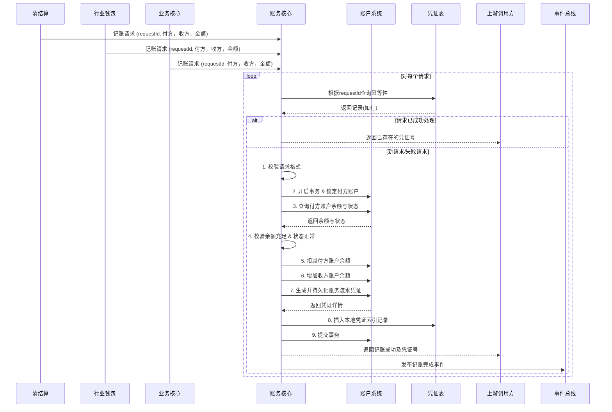
```mermaid
sequenceDiagram
    participant 清结算
    participant 行业钱包
    participant 业务核心
    participant 账务核心
    participant 账户系统
    participant 凭证表

    清结算->>账务核心: 记账请求 (requestId, 付方，收方，金额)
    行业钱包->>账务核心: 记账请求 (requestId, 付方，收方，金额)
    业务核心->>账务核心: 记账请求 (requestId, 付方，收方，金额)

    loop 对每个请求
        账务核心->>凭证表: 根据requestId查询幂等性
        凭证表-->>账务核心: 返回记录(如有)

        alt 请求已成功处理
            账务核心-->>上游调用方: 返回已存在的凭证号
        else 新请求/失败请求
            账务核心->>账务核心: 1. 校验请求格式
            账务核心->>账户系统: 2. 开启事务 & 锁定付方账户
            账务核心->>账户系统: 3. 查询付方账户余额与状态
            账户系统-->>账务核心: 返回余额与状态
            账务核心->>账务核心: 4. 校验余额充足 & 状态正常
            账务核心->>账户系统: 5. 扣减付方账户余额
            账务核心->>账户系统: 6. 增加收方账户余额
            账务核心->>账户系统: 7. 生成并持久化账务流水凭证
            账户系统-->>账务核心: 返回凭证详情
            账务核心->>凭证表: 8. 插入本地凭证索引记录
            账务核心->>账户系统: 9. 提交事务
            账务核心-->>上游调用方: 返回记账成功及凭证号
            账务核心->>事件总线: 发布记账完成事件
        end
    end
```

### 6. 错误处理
- **预期错误情况**:
    1.  请求参数错误（格式、必填项缺失）。
    2.  幂等键冲突但历史状态为失败（需人工介入）。
    3.  付方账户余额不足。
    4.  账户状态异常（如被冻结）。
    5.  **账户系统**服务调用失败或超时。
    6.  数据库操作失败（唯一键冲突、连接异常）。
    7.  系统内部异常（网络、内存等）。
- **处理策略**:
    - **业务校验错误** (1, 3, 4): 立即返回明确的业务错误码和消息，不进行事务操作。
    - **外部依赖失败** (5): 记录详细日志，进行事务回滚，向上游返回“系统繁忙”或“依赖服务异常”错误，支持重试。
    - **系统内部错误** (6, 7): 记录详细日志，进行事务回滚，向上游返回系统错误，告警通知。
    - **幂等性处理**: 对于`requestId`对应的历史失败记录，返回特定错误码，提示上游检查或使用新`requestId`重试。

### 7. 依赖关系
- **上游模块 (调用方)**: **清结算**、**行业钱包**、**业务核心**。这些模块发起记账请求，是账务核心的服务消费者。
- **下游模块 (被依赖方)**: **账户系统**。账务核心依赖其提供的账户操作API（查询、扣减、增加、生成流水）来完成核心记账功能。**账户系统**是账务核心的服务提供者。

### 8. 部署与运维考量
- **可扩展性**: 服务无状态设计，可通过水平扩展实例应对高并发记账请求。数据库（凭证索引表）需考虑分库分表策略，例如按 `voucher_no` 或 `created_at` 进行分片。
- **监控指标**:
    - 业务指标: 记账请求TPS、成功率、平均耗时、各业务类型分布。
    - 系统指标: API接口P99延迟、错误率、数据库连接池状态。
    - 关键业务告警: 记账失败率突增、余额不足错误频发、与账户系统调用超时。
- **容灾与恢复**: 依赖的**账户系统**需具备高可用性。本地凭证索引表需定期备份。制定事务失败、数据不一致的核对与修复流程。

<a id="module-7"></a>

## 3.7 对账单系统


### 1. 概述
- **目的与范围**: 本模块负责生成并提供各类账户动账明细、交易明细等对账文件。其核心职责是响应查询请求，基于底层数据生成结构化的对账单，供天财、三代或其他系统下载或查阅，以完成资金核对与业务对账。模块的边界包括：接收生成请求、从源系统聚合数据、按约定格式生成文件、存储文件并提供访问。文件内容的结构化处理（如数据筛选、格式转换）属于本模块的核心职责。

### 2. 接口设计
- **API端点 (REST/GraphQL)**:
    - `POST /v1/statements/generate`: 提交对账单生成请求。
    - `GET /v1/statements/{statement_id}`: 查询对账单生成状态与详情。
    - `GET /v1/statements/{statement_id}/download`: 获取对账单文件的下载链接或文件流。
- **请求/响应结构**:
    - 生成请求 (`POST /v1/statements/generate`):
        - 请求体: `{ "account_id": "string", "start_date": "YYYY-MM-DD", "end_date": "YYYY-MM-DD", "statement_type": "ACCOUNT_FLOW|TRANSACTION_DETAIL" }`
        - 响应体: `{ "statement_id": "string", "status": "PENDING|PROCESSING|SUCCEEDED|FAILED", "estimated_completion_time": "timestamp" }`
    - 状态查询 (`GET /v1/statements/{statement_id}`):
        - 响应体: `{ "statement_id": "string", "status": "PENDING|PROCESSING|SUCCEEDED|FAILED", "file_url": "string (nullable)", "created_at": "timestamp", "completed_at": "timestamp (nullable)", "error_message": "string (nullable)" }`
    - 下载 (`GET /v1/statements/{statement_id}/download`):
        - 响应: 302重定向至文件临时访问URL，或直接返回文件流。
- **发布/消费的事件**:
    - 消费事件: TBD (例如，监听账户动账事件以触发对账单预生成？)
    - 发布事件: `StatementGeneratedEvent` (事件内容包含 `statement_id`, `account_id`, `period`, `file_url`)。

### 3. 数据模型
- **表/集合**:
    - `statements` (对账单主表):
        - `id` (主键): 对账单唯一标识。
        - `account_id`: 关联的账户ID。
        - `start_date`: 对账周期开始日期。
        - `end_date`: 对账周期结束日期。
        - `statement_type`: 对账单类型（如：账户动账明细、交易明细）。
        - `status`: 状态（PENDING, PROCESSING, SUCCEEDED, FAILED）。
        - `file_storage_path`: 生成文件在对象存储中的路径。
        - `file_format`: 文件格式（如：CSV, Excel）。
        - `generated_at`: 文件生成完成时间。
        - `created_at`: 任务创建时间。
        - `updated_at`: 最后更新时间。
    - `statement_generation_tasks` (可选，用于异步作业管理):
        - `id` (主键): 任务ID。
        - `statement_id`: 关联的对账单ID。
        - `status`: 任务状态。
        - `retry_count`: 重试次数。
        - `error_log`: 错误日志。
        - `scheduled_at`: 计划执行时间。
- **关键字段**: 见上表。
- **与其他模块的关系**: 本模块的数据来源依赖于**清结算**（获取交易清分、结算明细）、**账户系统**（获取账户动账明细）。**业务核心**作为交易数据的处理入口，其数据通常已沉淀至**清结算**或**账户系统**，因此本模块不直接与**业务核心**交互。生成的对账单主要提供给**天财**、**三代**等上游业务方使用。

### 4. 业务逻辑
- **核心工作流/算法**:
    1. **接收请求**: 通过API接收生成对账单的请求，验证参数（账户有效性、日期范围合理性）。
    2. **异步任务创建**: 验证通过后，创建`statements`记录（状态为PENDING）并提交异步生成任务到作业队列。
    3. **数据聚合**:
        - 根据`statement_type`，并发或顺序调用**清结算**与**账户系统**的查询接口。
        - 为保障跨系统数据在某一时刻的一致性，查询时使用请求参数中`end_date`的日切时间点（如`end_date 23:59:59`）作为数据快照的基准时间点，并向源系统传递此参数。
        - 对源系统的查询采用分页或流式接口，避免单次加载海量数据。
    4. **文件生成**:
        - 将聚合后的数据按约定格式（如CSV：包含字段`交易时间`、`交易类型`、`对方账户`、`金额`、`余额`等）组装。
        - 文件命名规则：`{account_id}_{statement_type}_{start_date}_{end_date}_{generated_timestamp}.{format}`。
        - 将生成的文件上传至对象存储（如S3、OSS），并更新`statements`表的`file_storage_path`和`status`。
    5. **状态通知**: 文件生成完成后，更新状态为SUCCEEDED，并可选择发布`StatementGeneratedEvent`事件。
- **业务规则与验证**:
    - 验证请求账户是否存在且属于请求方。
    - 验证日期范围不超过系统允许的最大跨度（如90天）。
    - 确保对账单文件在对象存储中的访问权限受控，通过预签名URL提供临时访问。
    - 文件保留策略（TTL）：生成的文件默认保留30天，过期后由存储服务自动清理。
- **关键边界情况处理**:
    - **数据一致性**: 通过指定一致性时间点查询来规避源系统间数据延迟问题。若某个源系统在该时间点无可用数据，则任务失败，需人工介入或重试。
    - **海量数据**: 采用异步作业、分页查询、流式处理生成文件，避免阻塞请求和内存溢出。
    - **源系统故障**: 对依赖服务调用配置重试机制（如最多3次）和超时时间。若最终失败，则将任务状态置为FAILED并记录错误日志。
    - **文件生成失败**: 记录详细错误，告警通知运维人员。

### 5. 时序图

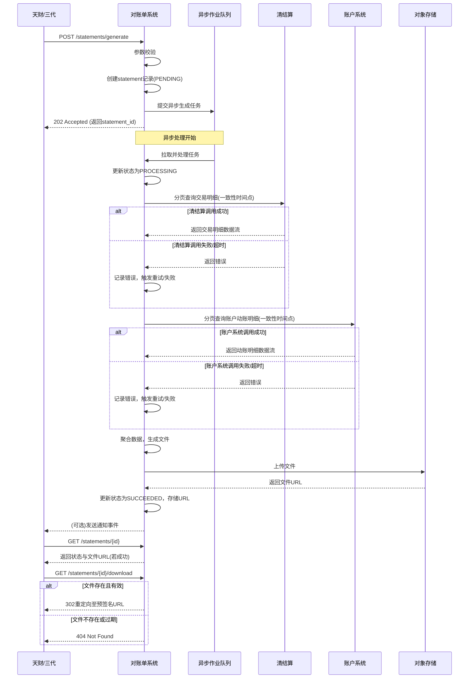
```mermaid
sequenceDiagram
    participant A as 天财/三代
    participant B as 对账单系统
    participant Q as 异步作业队列
    participant C as 清结算
    participant D as 账户系统
    participant S as 对象存储

    A->>B: POST /statements/generate
    B->>B: 参数校验
    B->>B: 创建statement记录(PENDING)
    B->>Q: 提交异步生成任务
    B-->>A: 202 Accepted (返回statement_id)

    Note over Q,B: 异步处理开始
    Q->>B: 拉取并处理任务
    B->>B: 更新状态为PROCESSING
    B->>C: 分页查询交易明细(一致性时间点)
    alt 清结算调用成功
        C-->>B: 返回交易明细数据流
    else 清结算调用失败/超时
        C-->>B: 返回错误
        B->>B: 记录错误，触发重试/失败
    end
    B->>D: 分页查询账户动账明细(一致性时间点)
    alt 账户系统调用成功
        D-->>B: 返回动账明细数据流
    else 账户系统调用失败/超时
        D-->>B: 返回错误
        B->>B: 记录错误，触发重试/失败
    end
    B->>B: 聚合数据，生成文件
    B->>S: 上传文件
    S-->>B: 返回文件URL
    B->>B: 更新状态为SUCCEEDED，存储URL
    B-->>A: (可选)发送通知事件

    A->>B: GET /statements/{id}
    B-->>A: 返回状态与文件URL(若成功)
    A->>B: GET /statements/{id}/download
    alt 文件存在且有效
        B-->>A: 302重定向至预签名URL
    else 文件不存在或过期
        B-->>A: 404 Not Found
    end
```

### 6. 错误处理
- **预期错误情况**:
    1. **客户端错误**: 请求参数无效（账户不存在、日期格式错误、超出最大范围）。
    2. **依赖服务错误**: **清结算**或**账户系统**服务不可用、响应超时、返回数据格式异常。
    3. **内部处理错误**: 异步作业执行失败、文件生成过程IO错误、上传对象存储失败。
    4. **资源限制**: 查询数据量过大导致处理超时或内存不足。
- **处理策略**:
    - **客户端错误**: 立即返回`4xx`错误码及明确提示信息，不创建任务。
    - **依赖服务错误**: 在异步任务中实现指数退避重试机制（如最多3次）。若最终失败，将任务状态更新为FAILED，记录详细错误信息，并触发告警。
    - **内部处理错误**: 记录错误日志，任务状态置为FAILED，告警通知运维。
    - **资源限制**: 设计上通过分页查询、流式处理规避。若仍发生，视为处理失败，按内部错误处理。

### 7. 依赖关系
- **上游模块**:
    - **清结算**: 提供交易清分、结算明细数据。依赖其分页查询接口。
    - **账户系统**: 提供账户动账明细数据。依赖其分页查询接口。
    - **（间接）业务核心**: 不直接依赖，其处理后的交易数据已由上游模块提供。
- **下游模块**:
    - **天财**: 消费对账单文件，用于资金核对。
    - **三代**: 消费对账单文件，用于运营审核与对账。
- **基础设施依赖**:
    - **异步作业队列**: 用于解耦对账单生成任务。
    - **对象存储**: 用于持久化存储生成的对账单文件。
    - **数据库**: 用于存储对账单元数据与任务状态。

<a id="module-8"></a>

## 3.8 计费中台


### 1. 概述
- **目的与范围**: 本模块是负责处理转账、分账等业务手续费计算与清分能力的核心系统。其核心职责包括：根据业务规则计算交易手续费，执行资金清分（即确定资金在各参与方账户间的分配），以及向账户系统同步账户信息。它是连接业务核心与底层账户、账务系统的计费枢纽。
- **角色澄清**: 根据术语表，“清结算”与“计费中台”为别名关系，指代同一系统。因此，本模块（计费中台/清结算）是下游模块“账务核心”和“账户系统”的上游，接收来自“业务核心”的请求。

### 2. 接口设计
- **API端点 (REST)**:
    - `POST /api/v1/fee/calculate`: 手续费计算。接收业务请求，返回手续费计算结果及清分方案。
    - `POST /api/v1/settlement/execute`: 清分执行。根据已确定的清分方案，驱动账务核心与账户系统完成资金划转。
- **请求/响应结构**:
    - 计算请求 (`/fee/calculate`):
        - 请求体: `{ “requestId”: “唯一请求ID”, “businessType”: “分账/归集/...”, “amount”: “交易金额”, “payerId”: “付款方ID”, “receiverIds”: [“收款方ID列表”], “feeBearer”: “PAYER/RECEIVER” }`
        - 响应体: `{ “code”: “状态码”, “data”: { “feeAmount”: “手续费金额”, “netAmount”: “净额”, “splitDetails”: [ {“partyId”: “参与方ID”, “amount”: “应分得金额”} ] } }`
    - 执行请求 (`/settlement/execute`):
        - 请求体: `{ “settlementId”: “清分执行ID”, “calculationResult”: “计算接口返回的完整结果” }`
        - 响应体: `{ “code”: “状态码”, “data”: { “settlementStatus”: “SUCCESS/FAILED”, “accountingVoucherNo”: “记账凭证号” } }`
- **发布/消费的事件**:
    - 消费: `BusinessTransactionCreated` (来自业务核心，包含原始交易数据)。
    - 发布: `FeeCalculated` (手续费计算完成事件)，`SettlementCompleted` (清分完成事件)。

### 3. 数据模型
- **表/集合**:
    - `fee_rules`: 费率规则表。存储不同业务类型、参与方、生效时间下的计费规则。
    - `fee_calculations`: 手续费计算记录表。存储每次计算请求的输入、输出及规则快照。
    - `settlement_records`: 清分执行记录表。存储每次清分执行的请求、结果及状态。
    - `settlement_detail`: 清分明细表。记录一次清分中各参与方的资金分配明细。
- **关键字段**:
    - `fee_rules`: `id`, `business_type`, `payer_type`, `receiver_type`, `fee_rate`, `fee_fixed`, `calc_mode` (`NET`/`GROSS`), `effective_from`, `effective_to`, `version`
    - `fee_calculations`: `id`, `request_id`, `business_type`, `original_amount`, `fee_amount`, `net_amount`, `rule_applied_id`, `calc_result_snapshot`, `created_at`
    - `settlement_records`: `id`, `settlement_id`, `calculation_id`, `status`, `accounting_voucher_no`, `initiated_at`, `completed_at`
    - `settlement_detail`: `id`, `settlement_id`, `party_id`, `party_role`, `account_id`, `amount`, `direction` (`CREDIT`/`DEBIT`)
- **与其他模块的关系**: 本模块需要与**账户系统**交互以同步账户信息，与**账务核心**交互以完成记账，并与**业务核心**交互以获取待计费的交易数据。`settlement_detail` 表中的 `account_id` 关联至账户系统的账户实体。

### 4. 业务逻辑
- **核心工作流/算法**:
    1.  **触发**: 接收来自业务核心的分账或转账请求（事件或API调用）。
    2.  **计算手续费**:
        a. 根据请求中的业务类型、参与方等信息，查询 `fee_rules` 表获取当前生效的费率规则。
        b. 若规则缺失，采用默认策略（如：费率为零，并记录告警）。
        c. 根据规则中的 `calc_mode`（净额NET/全额GROSS）及 `feeBearer`（承担方），计算手续费金额及各方应收/应付净额。
        d. 生成资金清分方案，明确各参与方（付款方、收款方、平台方等）的借记或贷记金额。
        e. 将计算过程与结果持久化至 `fee_calculations` 表。
    3.  **执行清分**:
        a. 调用账务核心，根据清分方案发起一笔复合记账请求，包含本金与手续费的分录。
        b. 账务核心记账成功后，计费中台接收凭证号。
        c. 计费中台调用账户系统，根据记账结果同步更新相关账户的余额。
        d. 将清分执行状态与结果持久化至 `settlement_records` 与 `settlement_detail` 表。
- **业务规则与验证**:
    - 规则匹配：支持按业务类型、参与方身份、生效时间进行精确匹配，支持版本管理。
    - 计算验证：确保手续费计算符合 `calc_mode`（净额=原额-手续费，全额=原额），且各方金额总和平衡。
    - 承担方逻辑：手续费承担方 (`feeBearer`) 由业务请求明确指定（PAYER 或 RECEIVER），计算时据此决定从哪一方扣除手续费。
- **关键边界情况处理**:
    - **规则缺失**: 启用默认计费规则（零费率），并触发告警通知运营人员。
    - **精度与舍入**: 金额计算使用高精度小数，最终结果按系统最小单位（如分）四舍五入，差额由平台方承担或吸收。
    - **幂等性**: 通过 `request_id` 和 `settlement_id` 保证计算与清分操作的幂等性，避免重复处理。
    - **数据一致性**: 清分执行采用“记账成功后再更新账户”的严格顺序。若账户更新失败，需有补偿机制（如冲正交易）或标记为异常，由对账系统后续处理。

### 5. 时序图

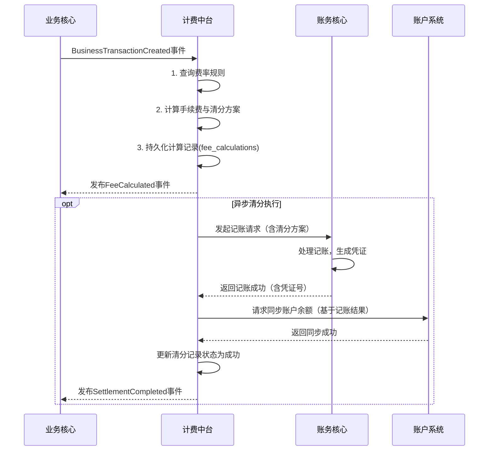
```mermaid
sequenceDiagram
    participant 业务核心
    participant 计费中台
    participant 账务核心
    participant 账户系统

    业务核心->>计费中台: BusinessTransactionCreated事件
    计费中台->>计费中台: 1. 查询费率规则
    计费中台->>计费中台: 2. 计算手续费与清分方案
    计费中台->>计费中台: 3. 持久化计算记录(fee_calculations)
    计费中台-->>业务核心: 发布FeeCalculated事件

    opt 异步清分执行
        计费中台->>账务核心: 发起记账请求（含清分方案）
        账务核心->>账务核心: 处理记账，生成凭证
        账务核心-->>计费中台: 返回记账成功（含凭证号）
        计费中台->>账户系统: 请求同步账户余额（基于记账结果）
        账户系统-->>计费中台: 返回同步成功
        计费中台->>计费中台: 更新清分记录状态为成功
        计费中台-->>业务核心: 发布SettlementCompleted事件
    end
```

### 6. 错误处理
- **预期错误情况**:
    1.  规则配置错误或缺失。
    2.  手续费计算服务异常（如除零、溢出）。
    3.  依赖服务异常：账务核心或账户系统服务不可用、超时。
    4.  记账失败（如账户状态异常、余额不足）。
    5.  账户信息同步失败。
- **处理策略**:
    - **配置/计算错误**: 记录错误告警，使用安全默认值（零费率）继续流程，或直接失败并返回明确错误码。
    - **外部依赖异常**: 采用指数退避策略进行重试。若最终失败，将交易标记为“清分失败”，状态持久化，并触发告警，后续由人工或定时任务进行核对与处理。
    - **一致性保障**: 若账务核心记账成功但账户系统同步失败，将清分记录标记为“待同步”，由补偿作业定期尝试同步或发起冲正。

### 7. 依赖关系
- **上游模块**: **业务核心**（提供待计费的原始交易数据）。
- **下游模块**: **账务核心**（执行记账操作）、**账户系统**（更新账户余额）。
- **数据流澄清**: 业务核心处理来自“天财”的请求后，将标准化的交易数据传递给计费中台进行计费与清分。计费中台不直接与“天财”交互。

<a id="module-9"></a>

## 3.9 认证系统


### 1. 概述
- **目的与范围**：本模块是提供身份核验能力的公共服务模块。其核心职责是为上游业务（如关系绑定、开通付款等）提供打款验证、人脸验证等认证能力。其边界限定于认证能力的提供与验证结果的返回，不涉及具体的业务流程编排或账户操作。
- **主要调用方澄清**：根据术语表，本模块的验证结果是**行业钱包**进行关系绑定的前置条件之一。同时，**电子签章系统**在调起签署流程前也可能调用本模块进行身份认证。因此，本模块是一个被多个上游业务系统调用的公共服务。

### 2. 接口设计
- **API端点 (REST)**：
    - `POST /api/v1/authentication/payment`：发起打款验证。
    - `POST /api/v1/authentication/face`：发起人脸验证。
    - `GET /api/v1/authentication/result/{request_id}`：查询认证结果。
- **请求/响应结构**：
    - **打款验证请求**：
        - 请求体：`{“type”: “PAYMENT”, “user_name”: “张三”, “id_card”: “110101199003077XXX”, “bank_card_no”: “6228480012345678900”, “bank_name”: “中国农业银行”}`
        - 响应体：`{“request_id”: “req_123456”, “status”: “PENDING”, “message”: “打款已发起，请等待回填”}`
    - **人脸验证请求**：
        - 请求体：`{“type”: “FACE”, “user_name”: “李四”, “id_card”: “110101199003078XXX”, “face_image_data”: “Base64EncodedString”}`
        - 响应体：`{“request_id”: “req_123457”, “status”: “PROCESSING”, “message”: “验证处理中”}`
    - **查询结果响应**：
        - 响应体：`{“request_id”: “req_123456”, “type”: “PAYMENT”, “status”: “SUCCESS/FAILED”, “result_detail”: {…}, “created_at”: “2023-10-01T10:00:00Z”}`
- **发布/消费的事件**：
    - 消费事件：TBD（例如，接收来自上游系统的认证触发指令）。
    - 发布事件：`AuthenticationCompleted`（事件体包含 `request_id`, `user_id`, `auth_type`, `result`, `timestamp`），供上游业务系统订阅。

### 3. 数据模型
- **表/集合**：`authentication_request`
- **关键字段**：
    - `id`：主键，认证请求唯一ID。
    - `auth_type`：认证类型（PAYMENT, FACE）。
    - `user_info`：JSON字段，存储姓名、证件号、银行卡号等用户信息。
    - `status`：状态（INIT, PENDING, PROCESSING, SUCCESS, FAILED, EXPIRED）。
    - `external_ref_id`：外部服务流水号（如银行打款流水、人脸识别请求ID）。
    - `auth_result`：JSON字段，存储验证结果详情（如比对分数、打款金额）。
    - `expiry_time`：验证有效期（针对打款验证）。
    - `retry_count`：重试次数。
    - `created_at` / `updated_at`：创建和更新时间。
- **与其他模块的关系**：本模块被**电子签章系统**调用以完成签署前的身份核验。本模块的验证结果是**行业钱包**进行关系绑定的前置条件之一。本模块与上游是松耦合的服务调用关系。

### 4. 业务逻辑
- **核心工作流/算法**：
    1. **打款验证**：
        - 接收包含银行卡信息的请求。
        - **随机金额生成**：生成一个随机小数金额（如0.01-0.99元），并记录到数据库。
        - 调用外部银行通道服务，向指定银行卡打入该随机金额。
        - 将请求状态置为`PENDING`，并设置有效期（如10分钟）。
        - 等待用户通过上游业务系统回填金额。
        - 验证回填金额与打款金额是否一致（允许微小误差）。
    2. **人脸验证**：
        - 接收姓名、身份证号和人脸图像数据。
        - 将数据加密后，调用外部生物识别服务进行1:1比对。
        - 接收比对服务返回的相似度分数。
        - **阈值判断逻辑**：若分数大于或等于预设阈值（如0.8），则判定为验证成功；否则为失败。
- **业务规则与验证**：
    - 验证请求必须包含必要的身份信息（如姓名、证件号、银行卡号等），缺失则拒绝。
    - 打款验证需确保打款金额的随机性和安全性（使用加密安全的随机数生成器），并设置合理的验证有效期（如10分钟），过期后状态自动更新为`EXPIRED`。
    - 人脸验证需确保数据在传输和存储过程中加密，并符合相关隐私与合规要求，人脸数据在验证完成后的一段短时间（如24小时）后自动清除。
- **关键边界情况处理**：
    - **外部服务不可用**：实现熔断器模式（如连续失败5次则熔断），并具备降级策略（如返回“服务暂不可用”提示，引导使用其他验证方式或稍后重试）。
    - **重试机制**：对于可重试的临时性外部服务失败（如网络超时），采用指数退避策略进行最多3次重试，并更新`retry_count`。
    - **用户多次失败**：同一用户（根据证件号或银行卡号）在短时间内（如1小时）连续验证失败超过5次，则临时锁定该用户的验证功能24小时。
    - **验证请求超时**：对于长时间无响应的异步验证（如用户未回填金额），由定时任务扫描过期请求，将状态更新为`EXPIRED`。

### 5. 时序图

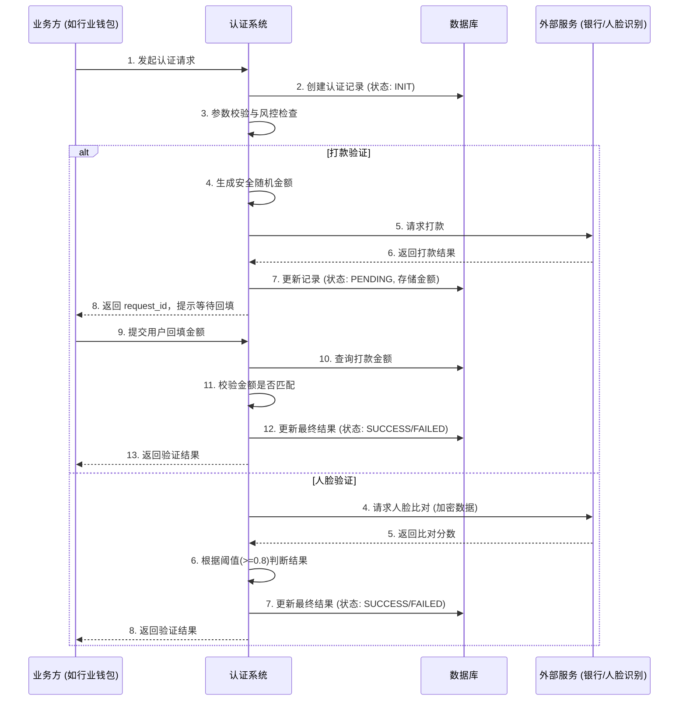
```mermaid
sequenceDiagram
    participant 业务方 as 业务方 (如行业钱包)
    participant 认证系统
    participant 数据库 as 数据库
    participant 外部服务 as 外部服务 (银行/人脸识别)

    业务方->>认证系统: 1. 发起认证请求
    认证系统->>数据库: 2. 创建认证记录 (状态: INIT)
    认证系统->>认证系统: 3. 参数校验与风控检查
    alt 打款验证
        认证系统->>认证系统: 4. 生成安全随机金额
        认证系统->>外部服务: 5. 请求打款
        外部服务-->>认证系统: 6. 返回打款结果
        认证系统->>数据库: 7. 更新记录 (状态: PENDING, 存储金额)
        认证系统-->>业务方: 8. 返回 request_id，提示等待回填
        业务方->>认证系统: 9. 提交用户回填金额
        认证系统->>数据库: 10. 查询打款金额
        认证系统->>认证系统: 11. 校验金额是否匹配
        认证系统->>数据库: 12. 更新最终结果 (状态: SUCCESS/FAILED)
        认证系统-->>业务方: 13. 返回验证结果
    else 人脸验证
        认证系统->>外部服务: 4. 请求人脸比对 (加密数据)
        外部服务-->>认证系统: 5. 返回比对分数
        认证系统->>认证系统: 6. 根据阈值(>=0.8)判断结果
        认证系统->>数据库: 7. 更新最终结果 (状态: SUCCESS/FAILED)
        认证系统-->>业务方: 8. 返回验证结果
    end
```

### 6. 错误处理
- **预期错误情况**：
    - `ERR_4001`: 输入参数缺失或格式错误。
    - `ERR_5001`: 外部服务调用失败、超时或返回异常。
    - `ERR_6001`: 验证失败（金额不符、人脸比对分数不足）。
    - `ERR_6002`: 验证请求已过期。
    - `ERR_7001`: 用户验证功能被临时锁定。
    - `ERR_9001`: 系统内部错误（数据库连接失败等）。
- **处理策略**：
    - 对`ERR_4001`类错误，立即返回错误码和明确的提示信息，不进行后续处理。
    - 对`ERR_5001`类错误，触发重试机制（最多3次），若最终失败，则记录错误日志，更新请求状态为`FAILED`，并向上游返回“认证服务暂时不可用”。
    - 对`ERR_6001`、`ERR_6002`、`ERR_7001`类业务性失败，正常更新请求状态为`FAILED`，并返回具体的业务错误码，由上游业务决定后续流程（如提示用户、允许重试）。
    - 对`ERR_9001`类系统内部错误，记录告警并通知运维，向上游返回“系统内部错误”通用提示。

### 7. 依赖关系
- **上游模块/调用方**：**行业钱包**（用于关系绑定前的身份核验）、**电子签章系统**（用于签署前的身份核验）。
- **下游服务/外部依赖**：
    - 外部银行通道服务（用于执行打款）。
    - 外部人脸识别服务（用于执行人脸比对）。
    - 内部数据库（用于存储认证记录）。
- **注意事项**：本模块需监控下游外部服务的可用性与性能，并实现相应的熔断和降级策略，以确保核心认证功能的稳定性。

<a id="module-10"></a>

## 3.10 电子签章系统


### 1. 概述
- **目的与范围**: 本模块负责协议模板管理、短信H5封装、调起认证及签署流程，为业务（如关系绑定、开通付款）提供电子协议签署与盖章能力。其边界止于协议签署完成，不涉及协议内容生成与业务逻辑判断。

### 2. 接口设计
- **API端点 (REST/GraphQL)**:
    - `POST /v1/agreements`: 发起协议签署。接收业务方请求，创建签署会话。
    - `GET /v1/agreements/{agreementId}`: 查询协议签署状态及详情。
    - `POST /v1/agreements/{agreementId}/cancel`: 取消进行中的签署流程。
    - `POST /v1/templates`: 上传或更新协议模板（内部管理接口）。
    - `GET /v1/templates/{templateId}`: 获取协议模板内容。
- **请求/响应结构**:
    - 发起签署请求 (`POST /v1/agreements`):
        - 请求体: `{ "templateId": "string", "businessId": "string", "parties": [{"name": "string", "idCard": "string", "mobile": "string", "role": "PAYER/RECEIVER"}], "variables": { "key": "value" } }`
        - 响应体: `{ "agreementId": "string", "signingUrl": "string", "expireAt": "timestamp" }`
    - 查询协议详情 (`GET /v1/agreements/{agreementId}`):
        - 响应体: `{ "agreementId": "string", "status": "PENDING/SIGNED/CANCELLED/EXPIRED", "signedAt": "timestamp", "documentUrl": "string" }`
- **发布/消费的事件**:
    - 发布事件:
        - `AgreementInitiated`: 协议签署流程已发起。
        - `AgreementSigned`: 协议签署成功完成。
        - `AgreementCancelled`: 协议签署被取消或过期。
    - 消费事件: TBD (依赖于上游业务系统的事件，如关系绑定请求已创建)。

### 3. 数据模型
- **表/集合**:
    - `agreement_templates`: 协议模板表。
    - `signing_sessions`: 签署会话表。
    - `signed_agreements`: 已签署协议存档表。
- **关键字段**:
    - `agreement_templates`:
        - `template_id` (主键)
        - `name`: 模板名称。
        - `content`: 模板内容（HTML/PDF模板）。
        - `variables_schema`: 模板变量定义。
        - `status`: 模板状态 (ACTIVE/INACTIVE)。
        - `created_at`, `updated_at`
    - `signing_sessions`:
        - `session_id` (主键)
        - `agreement_id`: 协议唯一标识。
        - `template_id`: 外键关联 `agreement_templates`。
        - `business_id`: 关联的业务ID（如关系绑定ID）。
        - `parties_info`: 签署方信息（JSON）。
        - `variables`: 渲染模板的变量值（JSON）。
        - `status`: 会话状态 (PENDING/AUTHENTICATING/SIGNING/SIGNED/CANCELLED/EXPIRED)。
        - `signing_url`: 短信H5签署链接。
        - `auth_token`: 与认证系统交互的令牌。
        - `expire_at`: 链接过期时间。
        - `created_at`, `updated_at`
    - `signed_agreements`:
        - `agreement_id` (主键)
        - `session_id`: 外键关联 `signing_sessions`。
        - `final_document_url`: 最终签署文件的存储地址。
        - `signatures`: 签署方签名信息（JSON）。
        - `signed_at`
        - `archived_at`
- **与其他模块的关系**:
    - 被**三代**、**行业钱包**等模块调用，以完成协议签署流程（如`关系绑定`、`开通付款`）。通过`business_id`字段与上游业务关联。
    - 依赖**认证系统**进行身份核验，通过`auth_token`关联认证会话。

### 4. 业务逻辑
- **核心工作流/算法**:
    1.  **接收签署请求**: 业务方（如三代、行业钱包）调用`发起协议签署`接口，提供模板ID、签署方信息、业务变量。
    2.  **生成签署会话**: 系统根据`template_id`查询有效模板，校验变量完整性，创建`signing_sessions`记录，生成唯一`agreement_id`。
    3.  **渲染协议与封装H5**: 使用模板内容和变量渲染生成待签署协议预览文件。基于`agreement_id`生成唯一的短信H5链接 (`signing_url`)，链接指向本系统的签署引导页。
    4.  **调起用户认证**: 用户点击链接访问签署页。系统根据签署方身份信息，调用**认证系统**的接口，发起`人脸验证`或`打款验证`。验证通过后，认证系统返回令牌，系统更新会话状态。
    5.  **引导在线签署**: 向用户端展示已渲染的协议文件，提供签署控件。用户确认并完成签署操作。
    6.  **完成签章与存储**: 系统将用户签名信息与协议文件合成，生成最终具有法律效力的已签署文件，上传至文件存储服务。更新`signing_sessions`状态为`SIGNED`，并在`signed_agreements`表中创建存档记录。通知业务方签署完成。
- **业务规则与验证**:
    - 签署方身份有效性由**认证系统**保证，本系统依赖其返回结果。
    - 协议模板必须处于`ACTIVE`状态方可使用。
    - 每个签署会话的H5链接具有时效性（如24小时），超时后状态置为`EXPIRED`。
    - 同一份协议可能涉及多方签署，需所有指定方均完成签署流程方视为最终完成。
- **关键边界情况处理**:
    - **用户中途取消**: 用户可主动取消，或系统在超时后自动取消。会话状态更新为`CANCELLED`或`EXPIRED`，并通知业务方。
    - **认证失败**: 捕获认证系统返回的错误，向用户展示友好提示，允许重试认证（有次数限制）。
    - **网络超时**: 对调用认证系统、存储服务等外部依赖设置超时与重试机制。

### 5. 时序图

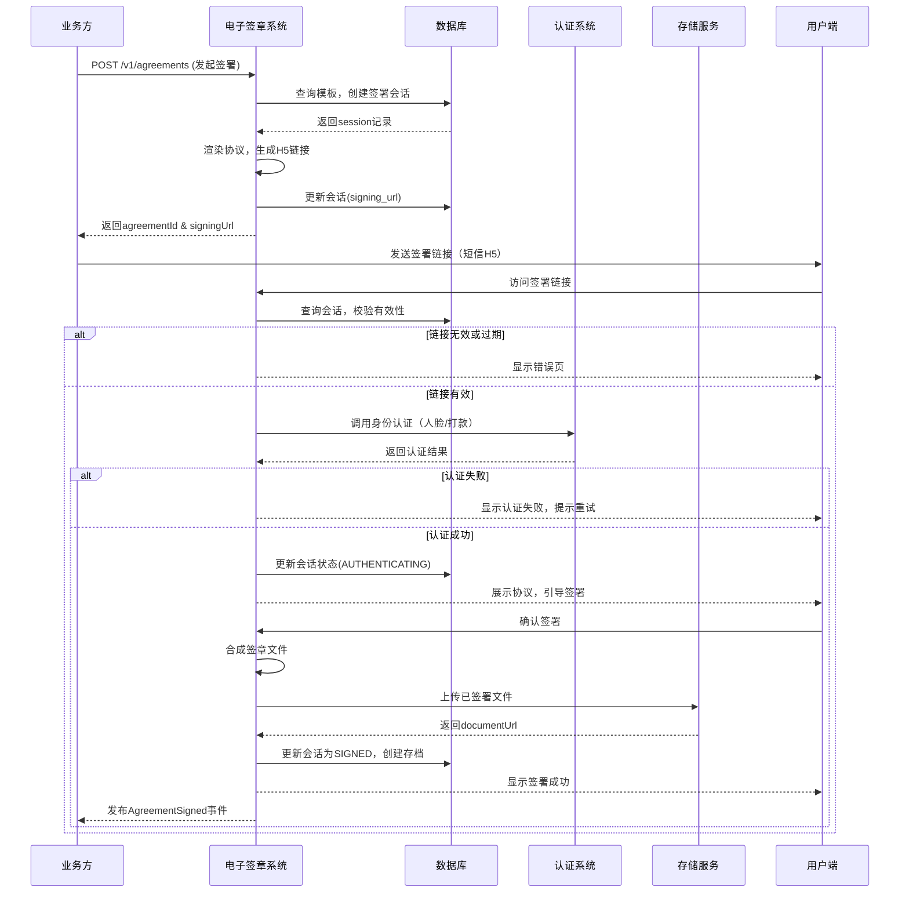
```mermaid
sequenceDiagram
    participant 业务方
    participant 电子签章系统
    participant DB as 数据库
    participant 认证系统
    participant 存储服务
    participant 用户端

    业务方->>电子签章系统: POST /v1/agreements (发起签署)
    电子签章系统->>DB: 查询模板，创建签署会话
    DB-->>电子签章系统: 返回session记录
    电子签章系统->>电子签章系统: 渲染协议，生成H5链接
    电子签章系统->>DB: 更新会话(signing_url)
    电子签章系统-->>业务方: 返回agreementId & signingUrl
    业务方->>用户端: 发送签署链接（短信H5）

    用户端->>电子签章系统: 访问签署链接
    电子签章系统->>DB: 查询会话，校验有效性
    alt 链接无效或过期
        电子签章系统-->>用户端: 显示错误页
    else 链接有效
        电子签章系统->>认证系统: 调用身份认证（人脸/打款）
        认证系统-->>电子签章系统: 返回认证结果
        alt 认证失败
            电子签章系统-->>用户端: 显示认证失败，提示重试
        else 认证成功
            电子签章系统->>DB: 更新会话状态(AUTHENTICATING)
            电子签章系统-->>用户端: 展示协议，引导签署
            用户端->>电子签章系统: 确认签署
            电子签章系统->>电子签章系统: 合成签章文件
            电子签章系统->>存储服务: 上传已签署文件
            存储服务-->>电子签章系统: 返回documentUrl
            电子签章系统->>DB: 更新会话为SIGNED，创建存档
            电子签章系统-->>用户端: 显示签署成功
            电子签章系统-->>业务方: 发布AgreementSigned事件
        end
    end
```

### 6. 错误处理
- **预期错误情况与错误码**:
    - `TEMPLATE_NOT_FOUND` (400): 指定的协议模板不存在或未激活。
    - `INVALID_BUSINESS_DATA` (400): 请求中的业务变量缺失或格式错误。
    - `AUTHENTICATION_FAILED` (401): 认证系统返回身份核验失败。
    - `AGREEMENT_EXPIRED` (410): 签署链接已过期。
    - `AGREEMENT_CANCELLED` (409): 签署流程已被取消。
    - `SIGNING_SERVICE_UNAVAILABLE` (503): 系统内部错误或依赖服务不可用。
- **处理策略**:
    - 对用户输入错误（4xx），返回明确错误码与提示，不进行重试。
    - 对依赖服务暂时性失败（如认证系统超时，5xx），根据策略（如最多3次）进行指数退避重试。
    - 在关键状态变更（如生成会话、认证成功、签署完成）时记录详细日志，便于追踪。
    - 支持状态回滚：当签署最终失败（取消、过期）时，确保相关资源（如临时文件）被清理，会话状态准确更新，并通过事件通知业务方。

### 7. 依赖关系
- **上游模块**:
    - **认证系统**: 核心依赖。提供`打款验证`、`人脸验证`等身份核验能力。本系统通过同步接口调用其服务，并依赖其返回结果决定流程走向。
- **下游模块**:
    - **三代**、**行业钱包**: 本模块的主要调用方。在`关系绑定`、`开通付款`等业务流程中，这些模块调用本系统的签署接口，并消费本系统发布的签署完成事件，以推进其后续业务逻辑。
- **外部服务**:
    - 文件存储服务: 用于存储生成的协议文件及最终签署文件。

<a id="module-11"></a>

## 3.11 业务核心


### 1. 概述
- **目的与范围**: 业务核心模块负责接收并处理来自天财平台的分账等交易数据。它是连接前端业务请求与后端资金处理流程的枢纽，主要职责包括接收交易请求、进行初步校验、调用下游系统执行业务逻辑（如分账、归集），并管理交易状态。本模块需持久化存储交易记录，确保状态一致性，并提供清晰的接口契约。

### 2. 接口设计
- **API端点 (REST/GraphQL)**:
    1.  `POST /api/v1/biz-core/transactions/split`: 处理天财分账请求。
    2.  `POST /api/v1/biz-core/transactions/collection`: 处理资金归集请求。
    3.  `GET /api/v1/biz-core/transactions/{transactionId}`: 查询交易状态。
- **请求/响应结构**:
    - **分账请求 (示例)**:
        ```json
        {
          "requestId": "req_1234567890", // 请求唯一标识，用于幂等
          "appId": "app_001",
          "payerAccountNo": "TC_PAYER_001", // 付方天财收款账户
          "payeeAccountNo": "TC_PAYEE_001", // 收方天财接收方账户
          "amount": 10000, // 金额（单位：分）
          "transferType": "NET", // 转账类型：NET(净额), GROSS(全额)
          "remark": "分账备注"
        }
        ```
    - **通用响应**:
        ```json
        {
          "code": "SUCCESS",
          "message": "处理成功",
          "data": {
            "transactionId": "txn_9876543210",
            "status": "PROCESSING", // 状态：PROCESSING, SUCCESS, FAILED
            "requestId": "req_1234567890"
          }
        }
        ```
- **发布/消费的事件**:
    - **消费事件**: TBD（例如，监听账户冻结事件以更新本地业务状态）。
    - **发布事件**: 交易状态变更事件（例如，`TransactionStatusChangedEvent`），包含交易ID、新状态、时间戳。

### 3. 数据模型
- **表/集合**: `transaction_record` (交易记录表)
- **关键字段**:
    - `id` (主键): 交易唯一标识。
    - `request_id` (唯一索引): 外部请求ID，用于幂等控制。
    - `app_id`: 应用标识。
    - `business_type`: 业务类型（如：分账、归集）。
    - `payer_account_no`: 付方账户号。
    - `payee_account_no`: 收方账户号。
    - `amount`: 交易金额（分）。
    - `status`: 交易状态（INIT, VALIDATING, PROCESSING, SUCCESS, FAILED）。
    - `request_data` (JSON): 完整的原始请求数据。
    - `response_data` (JSON): 下游系统返回的响应数据。
    - `error_message`: 错误信息。
    - `retry_count`: 向下游系统重试次数。
    - `created_at`: 创建时间。
    - `updated_at`: 更新时间。
- **与其他模块的关系**: 业务核心接收天财的请求，并依赖行业钱包进行关系绑定校验，依赖清结算系统执行资金处理。交易记录表用于跟踪所有操作的状态。

### 4. 业务逻辑
- **核心工作流/算法**: 主要业务流程为处理天财分账请求。流程包括：接收请求、幂等校验、验证基础参数、持久化初始记录、调用行业钱包进行关系绑定校验、调用清结算系统执行资金处理、更新交易状态并返回结果。状态机驱动流程流转。
- **业务规则与验证**:
    1.  幂等性：基于`requestId`，避免重复处理。
    2.  基础校验：必填字段、金额有效性、账户号格式。
    3.  业务校验：通过行业钱包接口校验付方与收方是否存在有效的关系绑定。
    4.  状态校验：交易处理中，检查本地记录状态，防止并发冲突。
- **关键边界情况处理**:
    1.  下游调用失败：根据重试策略进行重试，超过阈值后标记交易失败。
    2.  状态一致性：任何步骤失败，都将交易记录状态更新为`FAILED`，并记录错误原因。
    3.  异步处理：对于长耗时操作，可先返回`PROCESSING`状态，后续通过回调或查询接口获取最终结果。

### 5. 时序图

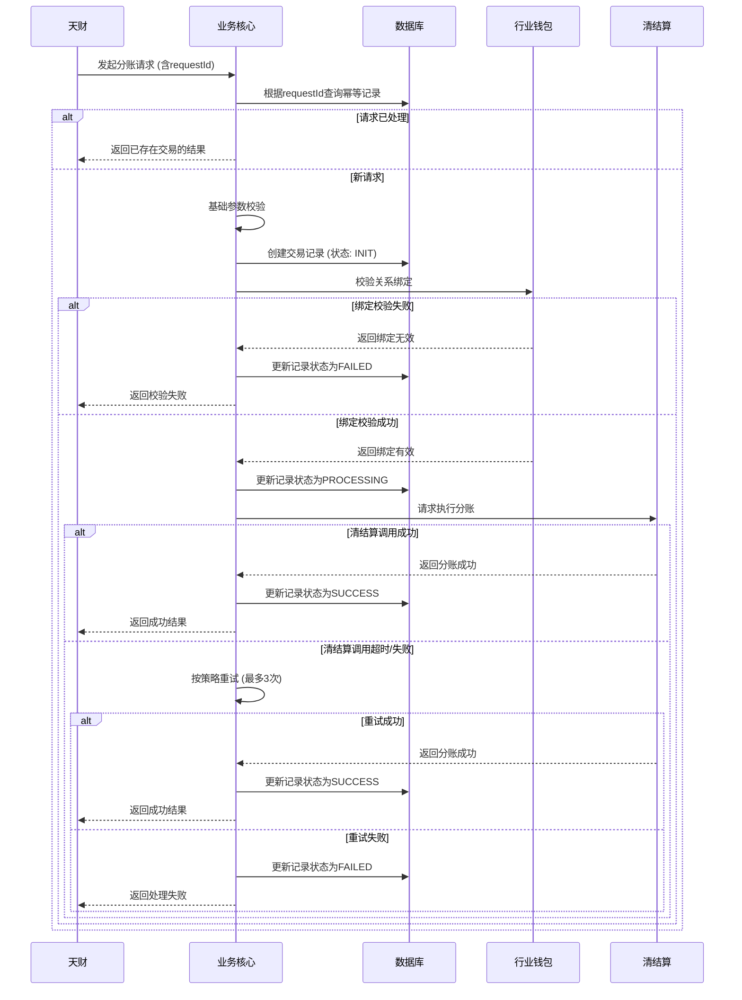
```mermaid
sequenceDiagram
    participant 天财
    participant 业务核心
    participant DB as 数据库
    participant 行业钱包
    participant 清结算

    天财->>业务核心: 发起分账请求 (含requestId)
    业务核心->>DB: 根据requestId查询幂等记录
    alt 请求已处理
        业务核心-->>天财: 返回已存在交易的结果
    else 新请求
        业务核心->>业务核心: 基础参数校验
        业务核心->>DB: 创建交易记录 (状态: INIT)
        业务核心->>行业钱包: 校验关系绑定
        alt 绑定校验失败
            行业钱包-->>业务核心: 返回绑定无效
            业务核心->>DB: 更新记录状态为FAILED
            业务核心-->>天财: 返回校验失败
        else 绑定校验成功
            行业钱包-->>业务核心: 返回绑定有效
            业务核心->>DB: 更新记录状态为PROCESSING
            业务核心->>清结算: 请求执行分账
            alt 清结算调用成功
                清结算-->>业务核心: 返回分账成功
                业务核心->>DB: 更新记录状态为SUCCESS
                业务核心-->>天财: 返回成功结果
            else 清结算调用超时/失败
                业务核心->>业务核心: 按策略重试 (最多3次)
                alt 重试成功
                    清结算-->>业务核心: 返回分账成功
                    业务核心->>DB: 更新记录状态为SUCCESS
                    业务核心-->>天财: 返回成功结果
                else 重试失败
                    业务核心->>DB: 更新记录状态为FAILED
                    业务核心-->>天财: 返回处理失败
                end
            end
        end
    end
```

### 6. 错误处理
- **预期错误情况**:
    1.  请求参数错误（格式、必填）。
    2.  幂等冲突（重复请求）。
    3.  业务校验失败（账户冻结、关系绑定无效）。
    4.  下游系统（行业钱包、清结算）服务不可用、网络超时、接口异常。
    5.  余额不足、账户状态异常。
- **处理策略**:
    1.  **参数与业务错误**：立即失败，返回4xx错误码与明确信息。
    2.  **下游依赖错误**：
        - **重试策略**：采用指数退避重试，最多重试3次。首次失败后等待1秒，第二次等待2秒，第三次等待4秒。
        - **熔断机制**：TBD（建议集成熔断器，当下游失败率过高时暂时熔断）。
        - **状态回滚**：任何一步失败，都将本地交易状态置为`FAILED`，确保状态机终结。
    3.  **幂等性**：所有写操作（创建、更新状态）必须基于`requestId`保证幂等。
    4.  **监控与告警**：记录所有失败日志，对连续失败或关键业务失败进行告警。

### 7. 依赖关系
- **上游模块**: 天财（发起业务请求）。
- **下游模块**:
    1.  **行业钱包**：提供关系绑定校验接口。依赖其`GET /wallet/api/relationship/validate`接口。
    2.  **清结算**：提供资金分账执行接口。依赖其`POST /clearing/api/transaction/split`接口。
- **集成契约**:
    - 与下游系统的交互需明确超时时间（如5秒）。
    - 调用下游接口时需传递`requestId`供其幂等处理。
    - 定义清晰的错误码映射关系，将下游错误转换为业务核心可识别的错误类型。

<a id="module-12"></a>

## 3.12 交易系统


### 1. 概述
- **目的与范围**: 本模块（即术语表中的“业务核心”，别名“交易系统”）作为业务核心，负责接收并处理来自天财平台的分账、归集、会员结算、批量付款等交易请求。其核心职责是协调行业钱包、清结算、账户系统等下游模块，完成交易指令的验证、路由、执行与状态管理。其边界在于处理交易请求本身，不直接处理账户开户、协议签署、资金记账等底层操作。

### 2. 接口设计
- **API端点 (REST/GraphQL)**:
    - `POST /api/v1/transactions/split`: 处理单笔分账请求。
    - `POST /api/v1/transactions/collect`: 处理资金归集请求。
    - `POST /api/v1/transactions/member_settlement`: 处理会员结算请求。
    - `POST /api/v1/transactions/batch_payment`: 处理批量付款请求。
    - `GET /api/v1/transactions/{transaction_id}`: 查询交易状态。
- **请求/响应结构**:
    - 通用请求结构包含：`app_id`（应用标识）、`request_id`（请求流水号）、`business_type`（业务类型）、`payer_info`（付方信息）、`payee_info`（收方信息）、`amount`（金额）、`fee_mode`（手续费模式：净额转账/全额转账）等字段。
    - 通用响应结构包含：`code`（响应码）、`message`（响应信息）、`data`（响应数据，如交易ID、状态、执行详情）。
- **发布/消费的事件**:
    - 发布事件：`TransactionCreated`（交易创建）、`TransactionCompleted`（交易完成）、`TransactionFailed`（交易失败）、`BatchPaymentPartialSuccess`（批量付款部分成功）。
    - 消费事件：TBD（可能消费来自风控系统的冻结事件）。

### 3. 数据模型
- **表/集合**:
    - `transactions`（交易主表）：存储所有交易的核心信息。
    - `batch_transaction_items`（批量交易子项表）：存储批量付款或会员结算中的单笔明细。
- **关键字段**:
    - `transactions` 表：`id`（交易ID）、`type`（业务类型：分账/归集/会员结算/批量付款）、`status`（状态：待处理/处理中/成功/失败/部分成功）、`amount`（总金额）、`payer_account_id`（付方账户ID）、`payee_account_id`（收方账户ID，批量付款时为空）、`fee_mode`、`request_id`、`created_at`、`updated_at`。
    - `batch_transaction_items` 表：`id`、`batch_id`（关联的交易ID）、`item_status`（子项状态）、`payee_account_id`（收方账户ID）、`amount`（子项金额）、`error_message`（失败原因）。
- **与其他模块的关系**: 本模块处理的天财分账等交易数据，其源头来自天财平台，执行依赖行业钱包、清结算、账户系统等。`payer_account_id` 和 `payee_account_id` 关联至账户系统的账户信息。

### 4. 业务逻辑
- **核心工作流/算法**: 主要业务流程包括分账、归集、会员结算、批量付款。基本流程为：接收交易请求 -> 验证业务规则（如关系绑定、账户状态） -> 调用行业钱包或清结算执行资金划转 -> 更新交易状态。
- **业务规则与验证**: 需验证付方与收方是否已完成关系绑定及协议签署；验证付方账户（天财收款账户）状态是否正常、余额是否充足；验证交易金额、手续费模式（净额转账/全额转账）等参数的有效性。
- **关键边界情况处理**:
    - **批量付款部分成功处理**：对于批量付款，系统将逐笔处理子项。记录每笔子项的状态（成功/失败）。若部分成功，主交易状态标记为“部分成功”，并记录失败子项的详细信息，供后续人工或自动重试处理。
    - **补偿与冲正逻辑**：当调用下游系统（如清结算）超时或异常时，启动补偿机制。对于已发起的资金操作，通过查询下游状态进行确认。若下游最终失败，则更新本系统交易状态为失败。若下游状态不明，则记录异常日志，触发定时对账任务进行核对与冲正，确保数据最终一致性。

### 5. 时序图
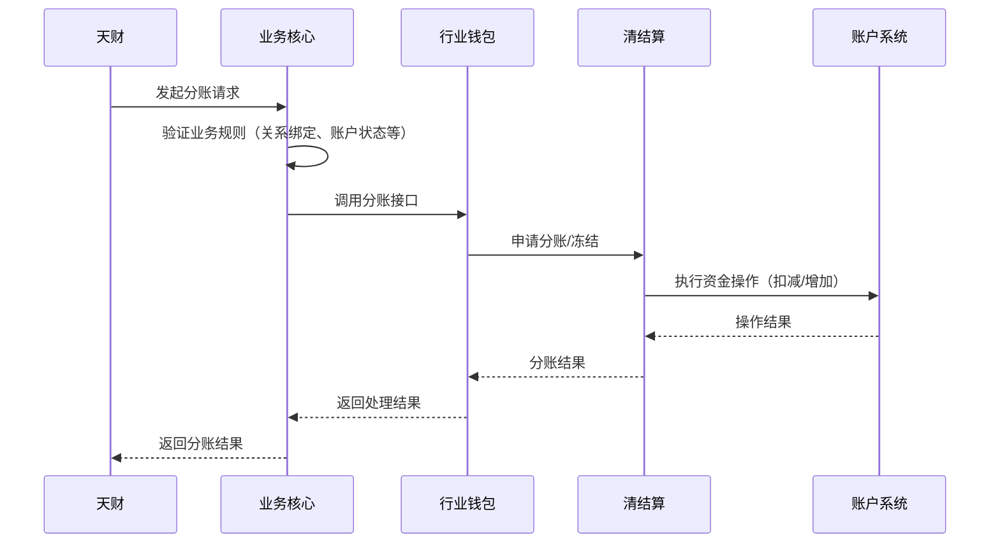
```mermaid
sequenceDiagram
    participant 天财
    participant 业务核心
    participant 行业钱包
    participant 清结算
    participant 账户系统

    天财->>业务核心: 发起分账请求
    业务核心->>业务核心: 验证业务规则（关系绑定、账户状态等）
    业务核心->>行业钱包: 调用分账接口
    行业钱包->>清结算: 申请分账/冻结
    清结算->>账户系统: 执行资金操作（扣减/增加）
    账户系统-->>清结算: 操作结果
    清结算-->>行业钱包: 分账结果
    行业钱包-->>业务核心: 返回处理结果
    业务核心-->>天财: 返回分账结果
```

### 6. 错误处理
- **预期错误情况**: 业务规则校验失败（如未绑定关系、账户冻结）；账户余额不足；下游系统（行业钱包、清结算）服务异常或超时；网络通信故障；批量付款中的部分失败。
- **处理策略**:
    - 对于业务校验失败，立即返回明确的错误码和提示。
    - 对于下游系统异常，根据业务重要性决定是否进行有限次重试，并记录详细日志。
    - 实现基于请求流水号（`request_id`）的幂等性控制，防止重复处理。
    - 对于部分成功场景，提供详细的子项状态查询接口，并支持对失败子项发起补偿或重试。

### 7. 依赖关系
- **上游模块**: 天财平台（交易请求来源）。
- **下游模块**: 行业钱包（执行分账核心逻辑）、清结算（处理清分、结算、计费）、账户系统（底层资金操作）。

<a id="module-13"></a>

## 3.13 代付系统


### 1. 概述
- **目的与范围**: 本模块负责处理从天财收款账户向多个天财接收方账户进行批量付款（批付）的业务。核心职责包括接收批付请求、处理付款授权、执行资金划转、管理手续费以及处理结果通知。其业务边界包括接收请求、执行业务校验、调用计费中台计算费用、向账户系统发起资金操作指令，并接收和处理账户系统返回的结果。

### 2. 接口设计
- **API端点 (REST/GraphQL)**:
    1.  `POST /api/v1/batch-payments`: 创建并提交一个新的批量付款请求。
    2.  `GET /api/v1/batch-payments/{batchId}`: 根据批次号查询批量付款的详细状态和结果。
    3.  `POST /api/v1/batch-payments/{batchId}/retry-failed-items`: 对指定批次中失败的付款项进行重试。
- **请求/响应结构**:
    - **创建批量付款请求体**:
        ```json
        {
          "payer_account_no": "付方天财收款账户号",
          "biz_scene": "业务场景标识",
          "payment_items": [
            {
              "payee_account_no": "收方天财接收方账户号",
              "amount": 10000,
              "currency": "CNY",
              "memo": "备注信息"
            }
          ]
        }
        ```
    - **创建批量付款响应体**:
        ```json
        {
          "batch_id": "批次唯一标识",
          "status": "PROCESSING",
          "request_time": "2023-01-01T00:00:00Z"
        }
        ```
    - **查询批次详情响应体**:
        ```json
        {
          "batch_id": "批次唯一标识",
          "payer_account_no": "付方账户号",
          "total_amount": 50000,
          "total_fee": 100,
          "status": "PARTIALLY_SUCCEEDED",
          "items": [
            {
              "item_id": "子项ID",
              "payee_account_no": "收方账户号",
              "amount": 10000,
              "fee": 20,
              "status": "SUCCESS",
              "error_code": null,
              "error_msg": null
            }
          ]
        }
        ```
- **发布/消费的事件**:
    - **发布事件**:
        1.  `BatchPaymentCreated`: 批量付款请求创建事件。
        2.  `BatchPaymentStatusChanged`: 批量付款状态变更事件（如转为成功、部分成功、失败）。
    - **消费事件**: TBD

### 3. 数据模型
- **表/集合**:
    1.  `batch_payment` (批量付款主表)
    2.  `payment_item` (付款子项表)
- **关键字段**:
    - **`batch_payment` 表**:
        - `batch_id` (主键): 批次唯一标识。
        - `payer_account_no`: 付方天财收款账户号。
        - `total_amount`: 批次总金额。
        - `total_fee`: 批次总手续费。
        - `status`: 批次状态 (CREATED, VALIDATING, PROCESSING, SUCCEEDED, PARTIALLY_SUCCEEDED, FAILED)。
        - `authorization_sn`: 代付授权协议流水号。
        - `created_at`, `updated_at`: 创建与更新时间。
    - **`payment_item` 表**:
        - `item_id` (主键): 子项唯一标识。
        - `batch_id` (外键): 关联的批次ID。
        - `payee_account_no`: 收方天财接收方账户号。
        - `amount`: 付款金额。
        - `fee`: 该笔手续费。
        - `status`: 子项状态 (PENDING, SUCCESS, FAILED)。
        - `error_code`, `error_msg`: 失败错误码和信息。
        - `accounting_sn`: 账户系统返回的资金操作流水号。
- **与其他模块的关系**: 本模块依赖**行业钱包**获取账户信息与关系绑定状态，依赖**账户系统**执行资金扣减与增加，依赖**计费中台**计算手续费，依赖**电子签章系统**处理代付授权协议。本模块的数据是**对账单系统**生成动账明细的数据源之一。

### 4. 业务逻辑
- **核心工作流/算法**: 主要业务流程为“批量付款”。首先，付方（总部/门店）需完成“开通付款”流程，即通过电子签约平台签署代付授权协议。协议生效后，代付系统接收批付请求，校验付方账户状态、余额、与各收方的“关系绑定”状态。校验通过后，调用计费中台计算手续费（可能涉及净额转账或全额转账模式），然后向账户系统发起批量资金转移指令，并处理返回结果。
- **业务规则与验证**:
    1.  付方必须为已开通天财收款账户的收单商户（总部或门店）。
    2.  付方必须已完成“开通付款”授权，且协议在有效期内。
    3.  付方与每个收方之间必须存在有效的“关系绑定”。
    4.  付方账户（天财收款账户）余额需足以覆盖总付款金额及手续费。
    5.  收方账户（天财接收方账户）状态必须正常。
- **关键边界情况处理**:
    - **部分成功**: 当批量付款中部分收款方处理失败时，需支持部分成功，并明确返回成功与失败的明细。
    - **协议失效**: 若处理时付方的代付授权协议已过期或撤销，则整个批次付款失败。
    - **并发扣款**: 通过数据库悲观锁（`SELECT FOR UPDATE`）或分布式锁，在核心校验和扣款阶段锁定付方账户记录，防止超额支付。
- **状态机**:
    - **批次状态流转**: `CREATED` -> `VALIDATING` -> `PROCESSING` -> (`SUCCEEDED` / `PARTIALLY_SUCCEEDED` / `FAILED`)。
    - **子项状态流转**: `PENDING` -> (`SUCCESS` / `FAILED`)。

### 5. 时序图
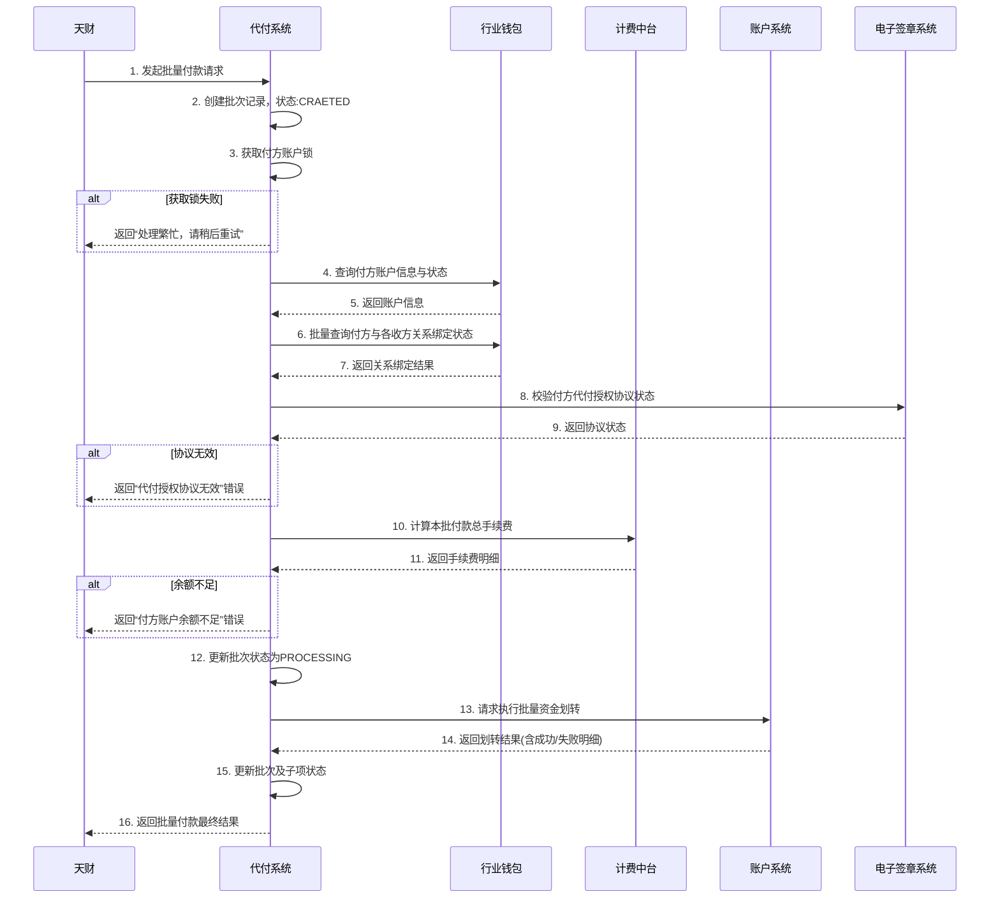
```mermaid
sequenceDiagram
    participant 天财
    participant 代付系统
    participant 行业钱包
    participant 计费中台
    participant 账户系统
    participant 电子签章系统

    天财->>代付系统: 1. 发起批量付款请求
    代付系统->>代付系统: 2. 创建批次记录，状态:CRAETED
    代付系统->>代付系统: 3. 获取付方账户锁
    alt 获取锁失败
        代付系统-->>天财: 返回“处理繁忙，请稍后重试”
    end
    代付系统->>行业钱包: 4. 查询付方账户信息与状态
    行业钱包-->>代付系统: 5. 返回账户信息
    代付系统->>行业钱包: 6. 批量查询付方与各收方关系绑定状态
    行业钱包-->>代付系统: 7. 返回关系绑定结果
    代付系统->>电子签章系统: 8. 校验付方代付授权协议状态
    电子签章系统-->>代付系统: 9. 返回协议状态
    alt 协议无效
        代付系统-->>天财: 返回“代付授权协议无效”错误
    end
    代付系统->>计费中台: 10. 计算本批付款总手续费
    计费中台-->>代付系统: 11. 返回手续费明细
    alt 余额不足
        代付系统-->>天财: 返回“付方账户余额不足”错误
    end
    代付系统->>代付系统: 12. 更新批次状态为PROCESSING
    代付系统->>账户系统: 13. 请求执行批量资金划转
    账户系统-->>代付系统: 14. 返回划转结果(含成功/失败明细)
    代付系统->>代付系统: 15. 更新批次及子项状态
    代付系统-->>天财: 16. 返回批量付款最终结果
```

### 6. 错误处理
- **预期错误情况**:
    1.  付方账户不存在、已冻结或余额不足。
    2.  付方未签署或已失效代付授权协议。
    3.  付方与一个或多个收方无有效绑定关系。
    4.  收方账户不存在或状态异常。
    5.  计费中台服务不可用或计算失败。
    6.  账户系统处理资金操作失败（部分或全部）。
    7.  并发请求导致账户锁获取失败。
- **处理策略**:
    - **业务校验失败**：在`VALIDATING`阶段，如协议失效、无绑定关系、余额不足等，立即拒绝整个请求，批次状态置为`FAILED`。
    - **依赖服务瞬时故障**：对计费中台、账户系统等外部调用配置指数退避重试机制。
    - **部分失败处理**：账户系统返回部分失败时，记录详细错误原因，批次状态根据结果更新为`SUCCEEDED`（全部成功）或`PARTIALLY_SUCCEEDED`（部分成功）。
    - **并发控制**：通过数据库行锁确保同一付方账户的扣款操作串行化，防止超付。获取锁失败的请求快速失败。
- **错误处理流程**:
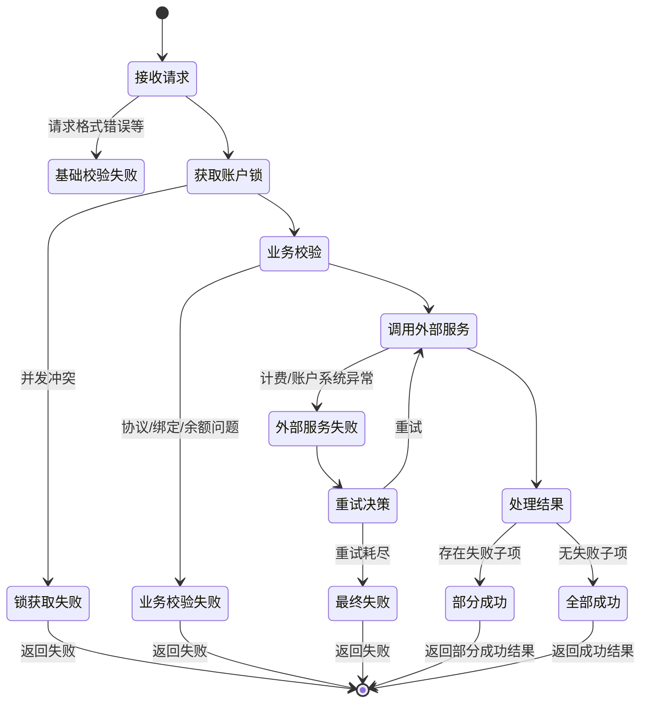
```mermaid
stateDiagram-v2
    [*] --> 接收请求
    接收请求 --> 基础校验失败: 请求格式错误等
    接收请求 --> 获取账户锁
    获取账户锁 --> 锁获取失败: 并发冲突
    锁获取失败 --> [*]: 返回失败
    获取账户锁 --> 业务校验
    业务校验 --> 业务校验失败: 协议/绑定/余额问题
    业务校验失败 --> [*]: 返回失败
    业务校验 --> 调用外部服务
    调用外部服务 --> 外部服务失败: 计费/账户系统异常
    外部服务失败 --> 重试决策
    重试决策 --> 调用外部服务: 重试
    重试决策 --> 最终失败: 重试耗尽
    最终失败 --> [*]: 返回失败
    调用外部服务 --> 处理结果
    处理结果 --> 部分成功: 存在失败子项
    处理结果 --> 全部成功: 无失败子项
    部分成功 --> [*]: 返回部分成功结果
    全部成功 --> [*]: 返回成功结果
```

### 7. 依赖关系
- **上游模块**:
    1.  **行业钱包**: 提供付方/收方账户信息查询、关系绑定状态校验。
    2.  **计费中台**: 提供批量付款手续费的计算服务。
    3.  **账户系统**: 执行实际的资金扣减与增加操作。
    4.  **电子签章系统**: 提供代付授权协议的签署状态查询。
- **下游模块**:
    1.  **对账单系统**: 消费本模块产生的资金变动结果，生成商户动账明细。
    2.  TBD

<a id="module-14"></a>

## 3.14 用户中心


### 1. 概述
- **目的与范围**: 用户中心模块负责生成全局唯一的用户标识，并提供给行业钱包系统，作为其进行账户开户、关系绑定等业务流程的唯一用户标识依据。本模块不提供或管理用户的其他基础信息。
- **模块形态**: 本模块是一个独立的微服务。

### 2. 接口设计
- **API端点 (REST)**:
    - `POST /api/v1/user-id`: 生成用户标识。
- **请求/响应结构**:
    - **请求体**:
        - `source_system` (string, required): 请求来源系统标识，如 “三代” 或 “天财”。
        - `request_id` (string, required): 上游系统生成的唯一请求ID，用于保证幂等性。
        - `biz_context` (object, optional): 上游业务上下文信息，用于日志记录。
    - **成功响应体 (HTTP 200)**:
        - `code` (string): 成功码，例如 “SUCCESS”。
        - `data` (object):
            - `user_id` (string): 生成的全局唯一用户标识。
            - `generated_at` (string): 生成时间戳 (ISO 8601)。
- **发布/消费的事件**: TBD

### 3. 数据模型
- **表/集合**: `user_identifiers`
- **关键字段**:
    - `user_id` (string, primary key): 用户标识，唯一。
    - `source_system` (string): 来源系统。
    - `source_request_id` (string): 上游请求ID，与来源系统构成唯一索引。
    - `created_at` (datetime): 创建时间。
- **与其他模块的关系**: 本模块生成的 `user_id` 将提供给行业钱包系统，作为其 `users` 表或其他业务表的外键关联依据。

### 4. 业务逻辑
- **核心工作流/算法**:
    1.  接收来自上游（三代/天财）的生成用户标识请求。
    2.  校验请求必填字段（`source_system`, `request_id`）。
    3.  根据 `source_system` 和 `source_request_id` 查询数据库，若记录已存在，则直接返回已生成的 `user_id`（实现幂等性）。
    4.  若为新请求，则使用 `UUID v4` 算法生成一个全局唯一的字符串作为 `user_id`。
    5.  将生成的 `user_id` 与请求信息持久化到 `user_identifiers` 表。
    6.  将 `user_id` 返回给上游系统。
- **业务规则与验证**:
    - 同一对 `source_system` 和 `source_request_id` 的多次请求，必须返回相同的 `user_id`。
    - `user_id` 必须在全局范围内唯一。
- **关键边界情况处理**:
    - 数据库写入失败：返回系统错误，上游应重试（依赖请求ID幂等性）。
    - UUID生成冲突（极小概率）：重试生成。

### 5. 时序图
```mermaid
sequenceDiagram
    participant Upstream as 三代/天财
    participant UserCenter as 用户中心
    participant DB as 数据库

    Upstream->>UserCenter: POST /user-id<br/>{source_system, request_id}
    UserCenter->>DB: 查询请求是否已处理
    alt 请求已处理（幂等）
        DB-->>UserCenter: 返回已存在的user_id
    else 新请求
        UserCenter->>UserCenter: 生成UUID (v4)
        UserCenter->>DB: 插入新记录(user_id, source_system, request_id)
        DB-->>UserCenter: 写入成功
    end
    UserCenter-->>Upstream: 返回 {user_id}
    Upstream->>行业钱包: 发起业务请求（携带user_id）
```

### 6. 错误处理
- **预期错误情况**:
    - `400 Bad Request`: 请求参数缺失或格式错误（如缺少`source_system`）。
    - `409 Conflict`: 请求ID冲突（非幂等性重试，而是不同业务使用了相同ID）。
    - `429 Too Many Requests`: 请求频率超限。
    - `500 Internal Server Error`: 系统内部错误（如数据库连接失败、UUID生成服务异常）。
- **处理策略**:
    - 所有错误均返回标准错误响应体，包含错误码和描述信息。
    - 对于5xx错误，记录详细日志并告警。
    - 依赖上游通过 `request_id` 进行重试以处理暂时性故障。

### 7. 依赖关系
- **上游模块**: 三代、天财。它们发起生成用户标识的请求。
- **下游模块**: 行业钱包。消费本模块生成的用户标识进行后续业务处理。
- **基础设施依赖**: 数据库（用于持久化与幂等性校验）。

<a id="module-15"></a>

## 3.15 风控


### 1. 概述
- **目的与范围**: 本模块负责接收风险判定请求，根据风险类型与等级执行处置策略，并触发对商户账户或交易资金的冻结。其核心职责是作为风险处置的执行器，协调调用下游系统完成冻结操作。模块边界为接收请求、执行处置逻辑、调用冻结接口并返回结果。
- **设计原则**: 高可用、最终一致性、操作可追溯。

### 2. 接口设计
- **API端点 (REST)**:
    - `POST /api/v1/risk/dispose`: 接收风险处置请求。
    - `GET /api/v1/risk/freeze-records/{id}`: 查询冻结记录详情。
- **请求/响应结构**:
    - **风险处置请求 (Request)**:
        ```json
        {
          "requestId": "string, 唯一请求ID",
          "riskEventId": "string, 风险事件ID",
          "riskType": "MERCHANT|TRANSACTION",
          "riskLevel": "HIGH|MEDIUM|LOW",
          "targetId": "string, 目标ID（商户ID或交易ID）",
          "triggerSource": "RULE_ENGINE|MANUAL",
          "extraInfo": "object, 扩展信息"
        }
        ```
    - **风险处置响应 (Response)**:
        ```json
        {
          "code": "string, 响应码",
          "message": "string, 响应消息",
          "data": {
            "disposeId": "string, 处置记录ID",
            "status": "PROCESSING|SUCCESS|FAILED",
            "freezeRecordId": "string, 冻结记录ID（如已生成）"
          }
        }
        ```
- **发布/消费的事件**:
    - **消费事件**: TBD（例如，来自风控规则引擎的风险事件消息）
    - **发布事件**:
        - `RiskDisposeInitiated`: 风险处置已发起。
        - `FreezeApplied`: 冻结申请已提交至清结算。
        - `RiskDisposeCompleted`: 风险处置完成（成功或最终失败）。

### 3. 数据模型
- **表/集合**:
    1.  **风险处置记录表 (risk_dispose_record)**:
        - 记录每一次风险处置请求的执行过程和结果。
    2.  **冻结记录表 (freeze_record)**:
        - 记录发起的每一笔冻结申请，与处置记录关联。
- **关键字段**:
    - **risk_dispose_record**:
        - `id` (主键), `request_id` (唯一), `risk_event_id`, `risk_type`, `risk_level`, `target_id`, `trigger_source`, `status`, `dispose_strategy`, `request_payload`, `result_payload`, `retry_count`, `error_message`, `created_at`, `updated_at`。
    - **freeze_record**:
        - `id` (主键), `freeze_apply_no` (冻结申请流水号), `dispose_record_id`, `account_type` (账户类型), `account_no` (账户号), `freeze_amount` (冻结金额，交易冻结时使用), `freeze_type` (ACCOUNT_FREEZE|FUND_FREEZE), `freeze_status` (APPLIED|SUCCESS|FAILED|THAWED), `apply_response`, `created_at`。
- **与其他模块的关系**:
    - 通过 `risk_event_id` 与风控规则引擎的风险事件关联。
    - 通过 `freeze_apply_no` 与清结算系统的冻结申请关联。
    - `target_id` 可关联至业务核心的商户或交易数据。

### 4. 业务逻辑
- **核心工作流**:
    1.  **请求接收与验证**: 接收风险处置请求，校验必填字段与枚举值，生成处置记录，状态置为`PROCESSING`。
    2.  **处置策略决策**: 根据`riskType`和`riskLevel`映射到具体的处置策略。
        - **策略映射表**:
            | 风险类型 | 风险等级 | 处置动作 | 目标系统 |
            |---|---|---|---|
            | MERCHANT | HIGH | 冻结账户 | 清结算 |
            | MERCHANT | MEDIUM | 告警并监控 | (内部) |
            | TRANSACTION | HIGH | 冻结资金 | 清结算 |
            | TRANSACTION | MEDIUM | 延迟结算 | TBD |
    3.  **执行处置动作**:
        - **商户冻结**: 根据`targetId`（商户ID）获取其对应的`天财收款账户`信息，组装冻结申请请求，调用**清结算系统**的冻结申请接口。
        - **交易冻结**: 根据`targetId`（交易ID）查询交易详情及已结算的`天财收款账户`，组装资金冻结申请，调用**清结算系统**的冻结申请接口。
    4.  **结果处理与持久化**: 接收清结算系统的响应，更新`freeze_record`状态。若申请成功，更新处置记录状态为`SUCCESS`；若失败，进入重试或失败终态处理。
    5.  **事件发布**: 根据处置结果，发布相应领域事件。
- **业务规则与验证**:
    - 同一`riskEventId`原则上只应触发一次有效处置，需做幂等校验。
    - 发起冻结前，需通过查询确认目标账户状态（如是否已冻结），避免重复操作。
    - 处置策略可配置化（未来扩展）。
- **关键边界情况处理**:
    - **下游调用失败**: 采用指数退避策略进行重试（如最多3次）。超过重试次数后，将处置记录状态置为`FAILED`，并记录详细错误信息。
    - **补偿机制**: 对于最终失败的处置，发布`RiskDisposeFailed`事件，供监控或人工介入处理。考虑引入死信队列存储需人工处理的失败请求。
    - **数据一致性**: 本地记录状态与调用下游系统的操作保证最终一致性。通过定期对账（与清结算系统）修复不一致状态。

### 5. 时序图

```mermaid
sequenceDiagram
    participant 风控规则引擎
    participant 风控模块
    participant DB as 风控数据库
    participant 清结算系统
    participant MQ as 消息队列

    风控规则引擎->>风控模块: POST /dispose (风险处置请求)
    风控模块->>DB: 创建处置记录(PROCESSING)
    风控模块-->>风控规则引擎: 202 Accepted

    par 主流程
        风控模块->>风控模块: 决策处置策略
        风控模块->>DB: 查询/校验目标状态
        风控模块->>清结算系统: 申请冻结账户/资金
        alt 调用成功
            清结算系统-->>风控模块: 返回冻结申请结果
            风控模块->>DB: 创建/更新冻结记录
            风控模块->>DB: 更新处置记录(SUCCESS)
            风控模块->>MQ: 发布FreezeApplied事件
        else 调用失败
            清结算系统-->>风控模块: 返回错误
            风控模块->>风控模块: 判断是否重试
            loop 最多重试3次
                风控模块->>清结算系统: 重试冻结申请
                alt 重试成功
                    清结算系统-->>风控模块: 成功
                    break
                end
            end
            alt 最终成功
                风控模块->>DB: 更新记录(SUCCESS)
                风控模块->>MQ: 发布FreezeApplied事件
            else 最终失败
                风控模块->>DB: 更新处置记录(FAILED)
                风控模块->>MQ: 发布RiskDisposeFailed事件
            end
        end
    end
    风控模块->>MQ: 发布RiskDisposeCompleted事件
```

### 6. 错误处理
- **预期错误情况**:
    1.  **请求无效**: 参数缺失、枚举值错误、格式错误。
    2.  **依赖系统异常**: 清结算系统服务超时、不可用、返回业务失败。
    3.  **数据异常**: 目标账户不存在、账户状态不允许冻结。
    4.  **重复请求**: 同一风险事件被重复触发。
- **处理策略**:
    - **输入错误**: 立即返回`400`错误，并在日志中记录。
    - **下游系统错误**: 采用指数退避重试机制。对于连接超时、5xx错误进行重试；对于明确的业务失败（如账户不存在，4xx错误），不重试，直接记录失败。
    - **幂等性**: 通过`requestId`或`riskEventId`保证接口幂等，避免重复处置。
    - **监控与告警**: 对失败率、重试次数、下游系统健康度设置监控指标和告警阈值。
    - **日志**: 所有关键步骤、请求和响应、错误堆栈均需记录结构化日志，便于追踪。

### 7. 依赖关系
- **上游模块/系统**:
    - **风控规则引擎**: 提供风险判定触发，是本模块的主要调用方。
- **下游模块/系统**:
    - **清结算系统**: 根据本模块的申请，执行对`天财收款账户`或特定交易资金的冻结操作。**（根据术语表修正，冻结申请统一通过清结算系统处理）**
    - **业务核心** (间接): 用于查询交易或商户的详细信息（如需）。
- **内部依赖**:
    - 数据库、消息队列。

<a id="module-16"></a>

## 3.16 钱包APP/商服平台


### 1. 概述
- **目的与范围**：本模块是面向商户（总部、门店）和接收方（非收单商户或个人）的客户端应用平台。其核心职责是**编排用户工作流**，为用户提供账户管理、交易操作、协议签署、认证流程及业务查询等功能的交互界面。它作为用户与后端核心业务系统之间的桥梁，负责发起业务请求、处理用户输入、管理本地状态，并将核心的业务逻辑（如资金处理、账户管理、协议持久化）委托给对应的后端系统（如行业钱包、业务核心、电子签章系统）执行。

### 2. 接口设计
- **API端点 (REST/GraphQL)**：本模块作为前端应用，主要通过调用后端服务提供的RESTful API进行交互。关键接口包括：
    - **用户认证与会话**：`POST /api/auth/login`， `POST /api/auth/refresh-token`。
    - **账户信息查询**：`GET /api/accounts/{accountId}`， `GET /api/accounts/list`。
    - **关系绑定流程**：`POST /api/relationship/initiate` (发起绑定)， `GET /api/relationship/status/{requestId}` (查询状态)。
    - **交易发起**：`POST /api/transactions/split` (发起分账)， `POST /api/transactions/batch-payment` (发起批量付款)。
    - **协议签署**：`GET /api/agreement/url` (获取电子签章H5页面URL)， `POST /api/agreement/callback` (接收签署结果回调)。
    - **交易记录查询**：`GET /api/transactions/history`。
- **请求/响应结构**：请求体通常包含业务参数（如金额、收款方账户ID、业务类型）和用户会话令牌。响应体为标准JSON格式，包含`code`、`message`、`data`字段。`data`字段的结构根据接口定义。
- **发布/消费的事件**：本模块主要消费后端系统推送的事件，例如：
    - **协议签署完成事件**：来自电子签章系统，用于更新本地绑定流程状态。
    - **交易状态变更事件**：来自业务核心或行业钱包，用于刷新交易列表和详情页状态。
    - **账户状态变更事件**：用于提示用户账户冻结、解冻等信息。

### 3. 数据模型
本模块的数据模型主要用于**本地状态管理、离线草稿和界面展示**，不持久化核心业务实体。核心业务数据（如账户、交易、协议）的“唯一事实来源”是对应的后端系统。
- **表/集合**：
    - **用户会话缓存**：存储当前用户的认证令牌、刷新令牌、用户基础信息（如用户ID、名称、所属机构号）。
    - **流程草稿箱**：存储用户未提交的复杂操作草稿（如正在填写的分账表单、批量付款文件），包含表单数据、创建时间等。
    - **本地消息与通知**：存储推送给用户的未读消息、交易状态变更通知等。
    - **界面配置与偏好**：存储用户的个性化设置，如默认手续费模式、常用收款方列表（仅本地引用ID）、列表排序偏好。
- **关键字段**：
    - 流程草稿箱表：`draft_id` (本地唯一ID)， `user_id`， `biz_type` (业务类型，如“分账”、“批量付款”)， `form_data` (JSON格式的表单内容)， `created_at`， `updated_at`。
    - 本地消息表：`message_id`， `user_id`， `title`， `content`， `related_biz_id` (关联的业务ID)， `type` (通知类型)， `is_read`， `created_at`。
- **与其他模块的关系**：本地数据模型中的业务实体ID（如`account_id`, `transaction_id`）是引用自后端系统（如行业钱包、业务核心）的只读外键。通过定时同步或事件驱动的方式，更新本地缓存中这些实体的**展示状态**（如账户余额、交易状态）。

### 4. 业务逻辑
- **核心工作流/算法**：
    1.  **关系绑定/开通付款工作流**：
        - 用户发起绑定请求，模块调用行业钱包接口获取协议模板信息。
        - 引导用户进入电子协议签署流程：调用电子签章系统接口获取签署H5页面URL并嵌入展示。
        - 监听电子签章系统的回调，接收签署结果（成功/失败/取消）。
        - 若签署成功，调用行业钱包接口确认关系绑定完成，并更新本地用户界面状态。
    2.  **分账/归集/批量付款发起工作流**：
        - 接收用户输入，进行前端格式、必填项、金额范围等基础校验。
        - 根据业务类型组装请求参数（如付款账户、收款方列表、金额、手续费承担方）。
        - 调用业务核心或行业钱包的相应接口提交交易请求。
        - 处理响应，展示提交结果，并启动轮询或监听事件以获取最终交易状态。
    3.  **离线草稿与恢复机制**：
        - 在用户填写复杂表单时，自动或手动将当前进度保存至本地草稿箱。
        - 用户再次进入应用时，可查看并继续编辑未提交的草稿。
        - 网络恢复后，引导用户提交草稿。
- **业务规则与验证**：
    - 前端对交易金额（需大于0）、收款方账户ID格式、批量付款文件格式进行校验。
    - 根据业务类型（分账、归集、批量付款）动态渲染不同的输入表单和校验规则。
    - 在发起任何涉及资金或协议的操作前，验证本地会话有效性，必要时引导重新登录。
- **安全与状态管理**：
    - **令牌管理**：安全存储`access_token`与`refresh_token`，实现静默刷新逻辑。
    - **敏感数据**：不在本地持久化明文密码、银行卡号等敏感信息。对于临时输入，使用安全存储区域（如iOS Keychain/Android Keystore）进行短暂缓存。
    - **会话管理**：实现自动登出机制（如令牌过期、长时间无操作）。
- **关键边界情况处理**：
    - **网络异常**：提供操作重试按钮，对于创建类请求（如发起交易），若不确定后端状态，需先查询确认后再决定重试或新建。
    - **后端业务错误**：解析后端返回的错误码，映射为具体的用户操作指引（如“余额不足”提示充值，“关系未绑定”引导去开通）。
    - **流程中断**：在电子签章或认证流程中，处理用户取消或中途退出的情况，清理临时状态并记录中断点。

### 5. 时序图
```mermaid
sequenceDiagram
    participant U as 商户用户
    participant A as 钱包APP/商服平台
    participant W as 行业钱包
    participant E as 电子签章系统
    participant V as 认证系统
    participant C as 业务核心

    U->>A: 1. 发起分账请求
    A->>A: 2. 前端校验输入数据
    A->>W: 3. 查询付款账户状态
    W-->>A: 4. 返回账户有效
    A->>C: 5. 提交分账交易请求
    C-->>A: 6. 返回受理成功
    A->>U: 7. 提示“提交成功，处理中”
    A->>A: 8. 启动轮询或监听事件
    C->>A: 9. (事件)交易处理完成
    A->>U: 10. 更新界面显示最终结果

    Note over U,A: 关系绑定流程
    U->>A: 1. 发起“开通付款”
    A->>W: 2. 请求初始化绑定关系
    W-->>A: 3. 返回协议信息
    A->>E: 4. 获取协议签署页面URL
    E-->>A: 5. 返回URL
    A->>U: 6. 嵌入展示H5页面
    U->>E: 7. 在页面内确认签署
    E->>V: 8. 调用打款/人脸验证
    V-->>E: 9. 返回认证结果
    alt 认证成功
        E->>A: 10. 回调通知签署成功
        A->>W: 11. 确认绑定完成
        W-->>A: 12. 返回绑定结果
        A->>U: 13. 提示开通成功
    else 失败或取消
        E->>A: 10. 回调通知失败
        A->>U: 11. 提示流程失败
    end
```

### 6. 错误处理
- **预期错误情况**：
    - **网络层**：连接超时、断开、服务器无响应。
    - **应用层**：HTTP 4xx/5xx 错误，后端服务不可用。
    - **业务层**：余额不足、账户已冻结、收款方无效、关系未绑定、重复交易。
    - **用户层**：输入格式错误、必填项缺失、批量文件解析失败。
    - **第三方服务**：电子签章系统调用失败、认证服务不可用。
- **处理策略**：
    - **网络与应用层错误**：展示友好的“网络异常”提示，提供全局重试按钮。记录错误日志。
    - **业务错误**：解析后端返回的特定错误码和消息，直接展示给用户，并提供明确的下一步操作建议（如“余额不足，请充值”）。
    - **用户输入错误**：在表单提交前进行实时校验并给出即时反馈。
    - **复杂流程中断**：对于协议签署等流程，保存中断状态，允许用户从断点处继续或重新开始。
    - **降级方案**：当非核心功能（如个性化设置同步）失败时，不影响核心业务流程，仅记录日志。

### 7. 依赖关系
- **上游模块（本模块依赖它们）**：
    - **行业钱包**：核心依赖。用于账户查询、关系绑定初始化与确认、部分交易指令转发。
    - **业务核心**：核心依赖。用于接收和处理分账、归集、批量付款等交易请求。
    - **电子签章系统**：核心依赖。用于获取协议签署页面并接收签署结果回调。
    - **认证系统**：间接依赖（通过电子签章系统）。用于完成身份核验。
    - **清结算/对账单系统**：功能依赖。用于查询交易明细、下载对账单。
    - **计费中台**：功能依赖。用于在发起交易前试算手续费。
- **下游模块（依赖本模块的模块）**：
    - **无**。本模块作为面向用户的客户端，其提供的服务通过用户界面体现，不被其他后端服务模块直接调用。

---
# 4 接口设计
## 4.1 对外接口
本系统对外部（如天财平台、商户客户端）暴露的接口如下。

| Method | Path | Module | Description | Request/Response |
| :--- | :--- | :--- | :--- | :--- |
| POST | /api/tiancai/ledger | 天财 | 发起分账请求 | TBD |
| POST | /api/tiancai/account/open | 天财 | 发起开户请求 | TBD |
| POST | /api/tiancai/relationship/bind | 天财 | 发起关系绑定请求 | TBD |
| GET | /api/tiancai/requests/{requestId} | 天财 | 查询业务请求状态 | TBD |
| POST | /api/v1/merchant/register | 三代 | 接收天财提交的商户入驻申请 | TBD |
| POST | /api/v1/merchant/audit | 三代 | 提交商户审核结果 | TBD |
| POST | /api/v1/business/config | 三代 | 接收天财的业务配置请求（如开通分账、归集） | TBD |
| GET | /api/v1/merchant/{merchantId} | 三代 | 查询商户信息及状态 | TBD |
| PUT | /api/v1/merchant/{merchantId}/info | 三代 | 更新商户信息 | TBD |
| POST | /api/v1/biz-core/transactions/split | 业务核心 | 处理天财分账请求 | TBD |
| POST | /api/v1/biz-core/transactions/collection | 业务核心 | 处理资金归集请求 | TBD |
| GET | /api/v1/biz-core/transactions/{transactionId} | 业务核心 | 查询交易状态 | TBD |
| POST | /api/v1/transactions/split | 交易系统 | 处理单笔分账请求 | TBD |
| POST | /api/v1/transactions/collect | 交易系统 | 处理资金归集请求 | TBD |
| POST | /api/v1/transactions/member_settlement | 交易系统 | 处理会员结算请求 | TBD |
| POST | /api/v1/transactions/batch_payment | 交易系统 | 处理批量付款请求 | TBD |
| GET | /api/v1/transactions/{transaction_id} | 交易系统 | 查询交易状态 | TBD |
| POST | /api/v1/batch-payments | 代付系统 | 创建并提交一个新的批量付款请求 | TBD |
| GET | /api/v1/batch-payments/{batchId} | 代付系统 | 根据批次号查询批量付款的详细状态和结果 | TBD |
| POST | /api/v1/batch-payments/{batchId}/retry-failed-items | 代付系统 | 对指定批次中失败的付款项进行重试 | TBD |
| POST | /api/v1/user-id | 用户中心 | 生成用户标识 | TBD |
| POST | /api/auth/login | 钱包APP/商服平台 | 用户认证与会话 | TBD |
| POST | /api/auth/refresh-token | 钱包APP/商服平台 | 用户认证与会话 | TBD |
| GET | /api/accounts/{accountId} | 钱包APP/商服平台 | 账户信息查询 | TBD |
| GET | /api/accounts/list | 钱包APP/商服平台 | 账户信息查询 | TBD |
| POST | /api/relationship/initiate | 钱包APP/商服平台 | 关系绑定流程（发起绑定） | TBD |
| GET | /api/relationship/status/{requestId} | 钱包APP/商服平台 | 关系绑定流程（查询状态） | TBD |
| POST | /api/transactions/split | 钱包APP/商服平台 | 交易发起（发起分账） | TBD |
| POST | /api/transactions/batch-payment | 钱包APP/商服平台 | 交易发起（发起批量付款） | TBD |
| GET | /api/agreement/url | 钱包APP/商服平台 | 协议签署（获取电子签章H5页面URL） | TBD |
| POST | /api/agreement/callback | 钱包APP/商服平台 | 协议签署（接收签署结果回调） | TBD |
| GET | /api/transactions/history | 钱包APP/商服平台 | 交易记录查询 | TBD |

## 4.2 模块间接口
本系统内部各模块之间相互调用的接口如下。

| Method | Path | Module | Description | Request/Response |
| :--- | :--- | :--- | :--- | :--- |
| POST | /api/v1/settlement/orders | 清结算 | 接收业务核心发起的结算请求 | TBD |
| POST | /api/v1/freeze/requests | 清结算 | 接收行业钱包发起的商户冻结或交易冻结申请 | TBD |
| GET | /api/v1/accounts/{accountNo}/balance | 清结算 | 从账户系统同步指定账户的余额与状态信息 | TBD |
| POST | /api/v1/statements/details | 清结算 | 向对账单系统推送动账明细 | TBD |
| POST | /api/v1/accounts | 账户系统 | 创建账户（开户） | TBD |
| PATCH | /api/v1/accounts/{accountId}/status | 账户系统 | 更新账户状态（如冻结/解冻） | TBD |
| POST | /api/v1/accounts/{accountId}/debit | 账户系统 | 执行资金扣减 | TBD |
| POST | /api/v1/accounts/{accountId}/credit | 账户系统 | 执行资金增加 | TBD |
| GET | /api/v1/accounts/{accountId}/balance | 账户系统 | 查询账户余额 | TBD |
| POST | /api/v1/accounting/entry | 账务核心 | 执行单笔记账 | TBD |
| POST | /api/v1/accounting/batch-entry | 账务核心 | 执行批量记账 | TBD |
| POST | /v1/statements/generate | 对账单系统 | 提交对账单生成请求 | TBD |
| GET | /v1/statements/{statement_id} | 对账单系统 | 查询对账单生成状态与详情 | TBD |
| GET | /v1/statements/{statement_id}/download | 对账单系统 | 获取对账单文件的下载链接或文件流 | TBD |
| POST | /api/v1/fee/calculate | 计费中台 | 手续费计算。接收业务请求，返回手续费计算结果及清分方案 | TBD |
| POST | /api/v1/settlement/execute | 计费中台 | 清分执行。根据已确定的清分方案，驱动账务核心与账户系统完成资金划转 | TBD |
| POST | /api/v1/authentication/payment | 认证系统 | 发起打款验证 | TBD |
| POST | /api/v1/authentication/face | 认证系统 | 发起人脸验证 | TBD |
| GET | /api/v1/authentication/result/{request_id} | 认证系统 | 查询认证结果 | TBD |
| POST | /v1/agreements | 电子签章系统 | 发起协议签署。接收业务方请求，创建签署会话 | TBD |
| GET | /v1/agreements/{agreementId} | 电子签章系统 | 查询协议签署状态及详情 | TBD |
| POST | /v1/agreements/{agreementId}/cancel | 电子签章系统 | 取消进行中的签署流程 | TBD |
| POST | /v1/templates | 电子签章系统 | 上传或更新协议模板（内部管理接口） | TBD |
| GET | /v1/templates/{templateId} | 电子签章系统 | 获取协议模板内容 | TBD |
| POST | /api/v1/risk/dispose | 风控 | 接收风险处置请求 | TBD |
| GET | /api/v1/risk/freeze-records/{id} | 风控 | 查询冻结记录详情 | TBD |
---
# 5 数据库设计
## 5.1 ER图

```mermaid
erDiagram
    tiancai_app_info {
        bigint id PK
        varchar appid
        varchar config
    }
    tiancai_business_request {
        bigint id PK
        varchar request_id
        varchar business_type
        varchar status
    }
    tiancai_merchant_mapping {
        bigint id PK
        varchar merchant_id
        varchar institution_no
    }
    t_institution {
        bigint id PK
        varchar institution_no
        varchar name
    }
    t_merchant {
        bigint id PK
        varchar merchant_id
        varchar status
    }
    t_business_config {
        bigint id PK
        varchar merchant_id FK
        varchar business_type
        varchar config
    }
    SettlementOrder {
        bigint id PK
        varchar order_no
        varchar status
    }
    FeeRule {
        bigint id PK
        varchar business_type
        varchar rule_config
    }
    FreezeRequest {
        bigint id PK
        varchar request_no
        varchar target_type
        varchar status
    }
    RetryTask {
        bigint id PK
        varchar biz_id
        varchar task_type
        varchar status
    }
    account {
        bigint id PK
        varchar account_no
        varchar user_id
        varchar status
    }
    account_balance {
        bigint id PK
        bigint account_id FK
        decimal balance
    }
    account_transaction_log {
        bigint id PK
        bigint account_id FK
        varchar transaction_no
        decimal amount
    }
    accounting_voucher {
        bigint id PK
        varchar voucher_no
        varchar status
    }
    statements {
        bigint id PK
        varchar statement_id
        varchar status
    }
    statement_generation_tasks {
        bigint id PK
        bigint statement_id FK
        varchar task_status
    }
    fee_rules {
        bigint id PK
        varchar rule_code
        varchar config
    }
    fee_calculations {
        bigint id PK
        varchar request_id
        decimal fee_amount
    }
    settlement_records {
        bigint id PK
        varchar record_no
        varchar status
    }
    settlement_detail {
        bigint id PK
        bigint record_id FK
        varchar account_no
        decimal amount
    }
    authentication_request {
        bigint id PK
        varchar request_id
        varchar auth_type
        varchar status
    }
    agreement_templates {
        bigint id PK
        varchar template_id
        text content
    }
    signing_sessions {
        bigint id PK
        varchar session_id
        varchar status
    }
    signed_agreements {
        bigint id PK
        varchar agreement_id
        text signed_content
    }
    transaction_record {
        bigint id PK
        varchar transaction_id
        varchar business_type
        varchar status
    }
    transactions {
        bigint id PK
        varchar transaction_id
        varchar type
        varchar status
    }
    batch_transaction_items {
        bigint id PK
        bigint transaction_id FK
        varchar item_status
    }
    batch_payment {
        bigint id PK
        varchar batch_id
        varchar status
    }
    payment_item {
        bigint id PK
        bigint batch_id FK
        varchar item_status
    }
    user_identifiers {
        bigint id PK
        varchar user_id
        varchar source_system
    }
    risk_dispose_record {
        bigint id PK
        varchar dispose_id
        varchar risk_type
    }
    freeze_record {
        bigint id PK
        varchar freeze_id
        varchar target_type
    }

    tiancai_merchant_mapping ||--o{ t_merchant : "maps to"
    t_merchant ||--o{ t_business_config : "has"
    t_merchant ||--o{ account : "has"
    account ||--|| account_balance : "has"
    account ||--o{ account_transaction_log : "generates"
    SettlementOrder ||--o{ settlement_detail : "contains"
    fee_rules ||--o{ fee_calculations : "used in"
    settlement_records ||--o{ settlement_detail : "contains"
    batch_payment ||--o{ payment_item : "contains"
    transactions ||--o{ batch_transaction_items : "contains"
    statements ||--o{ statement_generation_tasks : "has"
    agreement_templates ||--o{ signing_sessions : "used by"
    signing_sessions ||--|| signed_agreements : "results in"
    risk_dispose_record ||--o{ freeze_record : "triggers"
```

## 5.2 表结构

| 表名 | 所属模块 | 主要字段（简述） | 关联关系（简述） |
| :--- | :--- | :--- | :--- |
| tiancai_app_info | 天财 | id, appid, config | 无 |
| tiancai_business_request | 天财 | id, request_id, business_type, status | 无 |
| tiancai_merchant_mapping | 天财 | id, merchant_id, institution_no | 关联 t_merchant 表 |
| t_institution | 三代 | id, institution_no, name | 无 |
| t_merchant | 三代 | id, merchant_id, status | 被 tiancai_merchant_mapping 关联；关联 t_business_config 和 account 表 |
| t_business_config | 三代 | id, merchant_id, business_type, config | 关联 t_merchant 表 |
| SettlementOrder | 清结算 | id, order_no, status | 关联 settlement_detail 表 |
| FeeRule | 清结算 | id, business_type, rule_config | 无 |
| FreezeRequest | 清结算 | id, request_no, target_type, status | 无 |
| RetryTask | 清结算 | id, biz_id, task_type, status | 无 |
| account | 账户系统 | id, account_no, user_id, status | 关联 t_merchant 表；关联 account_balance 和 account_transaction_log 表 |
| account_balance | 账户系统 | id, account_id, balance | 关联 account 表 |
| account_transaction_log | 账户系统 | id, account_id, transaction_no, amount | 关联 account 表 |
| accounting_voucher | 账务核心 | id, voucher_no, status | 无 |
| statements | 对账单系统 | id, statement_id, status | 关联 statement_generation_tasks 表 |
| statement_generation_tasks | 对账单系统 | id, statement_id, task_status | 关联 statements 表 |
| fee_rules | 计费中台 | id, rule_code, config | 关联 fee_calculations 表 |
| fee_calculations | 计费中台 | id, request_id, fee_amount | 关联 fee_rules 表 |
| settlement_records | 计费中台 | id, record_no, status | 关联 settlement_detail 表 |
| settlement_detail | 计费中台 | id, record_id, account_no, amount | 关联 settlement_records 表 |
| authentication_request | 认证系统 | id, request_id, auth_type, status | 无 |
| agreement_templates | 电子签章系统 | id, template_id, content | 关联 signing_sessions 表 |
| signing_sessions | 电子签章系统 | id, session_id, status | 关联 agreement_templates 和 signed_agreements 表 |
| signed_agreements | 电子签章系统 | id, agreement_id, signed_content | 关联 signing_sessions 表 |
| transaction_record | 业务核心 | id, transaction_id, business_type, status | 无 |
| transactions | 交易系统 | id, transaction_id, type, status | 关联 batch_transaction_items 表 |
| batch_transaction_items | 交易系统 | id, transaction_id, item_status | 关联 transactions 表 |
| batch_payment | 代付系统 | id, batch_id, status | 关联 payment_item 表 |
| payment_item | 代付系统 | id, batch_id, item_status | 关联 batch_payment 表 |
| user_identifiers | 用户中心 | id, user_id, source_system | 无 |
| risk_dispose_record | 风控 | id, dispose_id, risk_type | 关联 freeze_record 表 |
| freeze_record | 风控 | id, freeze_id, target_type | 关联 risk_dispose_record 表 |
| 用户会话缓存 | 钱包APP/商服平台 | TBD | TBD |
| 流程草稿箱 | 钱包APP/商服平台 | TBD | TBD |
| 本地消息与通知 | 钱包APP/商服平台 | TBD | TBD |
| 界面配置与偏好 | 钱包APP/商服平台 | TBD | TBD |