## 5.1 ER图

```mermaid
erDiagram
    tiancai_app_info {
        bigint id PK
        varchar appid
        varchar config
    }
    tiancai_business_request {
        bigint id PK
        varchar request_id
        varchar business_type
        varchar status
    }
    tiancai_merchant_mapping {
        bigint id PK
        varchar merchant_id
        varchar institution_no
    }
    t_institution {
        bigint id PK
        varchar institution_no
        varchar name
    }
    t_merchant {
        bigint id PK
        varchar merchant_id
        varchar status
    }
    t_business_config {
        bigint id PK
        varchar merchant_id FK
        varchar business_type
        varchar config
    }
    SettlementOrder {
        bigint id PK
        varchar order_no
        varchar status
    }
    FeeRule {
        bigint id PK
        varchar business_type
        varchar rule_config
    }
    FreezeRequest {
        bigint id PK
        varchar request_no
        varchar target_type
        varchar status
    }
    RetryTask {
        bigint id PK
        varchar biz_id
        varchar task_type
        varchar status
    }
    account {
        bigint id PK
        varchar account_no
        varchar user_id
        varchar status
    }
    account_balance {
        bigint id PK
        bigint account_id FK
        decimal balance
    }
    account_transaction_log {
        bigint id PK
        bigint account_id FK
        varchar transaction_no
        decimal amount
    }
    accounting_voucher {
        bigint id PK
        varchar voucher_no
        varchar status
    }
    statements {
        bigint id PK
        varchar statement_id
        varchar status
    }
    statement_generation_tasks {
        bigint id PK
        bigint statement_id FK
        varchar task_status
    }
    fee_rules {
        bigint id PK
        varchar rule_code
        varchar config
    }
    fee_calculations {
        bigint id PK
        varchar request_id
        decimal fee_amount
    }
    settlement_records {
        bigint id PK
        varchar record_no
        varchar status
    }
    settlement_detail {
        bigint id PK
        bigint record_id FK
        varchar account_no
        decimal amount
    }
    authentication_request {
        bigint id PK
        varchar request_id
        varchar auth_type
        varchar status
    }
    agreement_templates {
        bigint id PK
        varchar template_id
        text content
    }
    signing_sessions {
        bigint id PK
        varchar session_id
        varchar status
    }
    signed_agreements {
        bigint id PK
        varchar agreement_id
        text signed_content
    }
    transaction_record {
        bigint id PK
        varchar transaction_id
        varchar business_type
        varchar status
    }
    transactions {
        bigint id PK
        varchar transaction_id
        varchar type
        varchar status
    }
    batch_transaction_items {
        bigint id PK
        bigint transaction_id FK
        varchar item_status
    }
    batch_payment {
        bigint id PK
        varchar batch_id
        varchar status
    }
    payment_item {
        bigint id PK
        bigint batch_id FK
        varchar item_status
    }
    user_identifiers {
        bigint id PK
        varchar user_id
        varchar source_system
    }
    risk_dispose_record {
        bigint id PK
        varchar dispose_id
        varchar risk_type
    }
    freeze_record {
        bigint id PK
        varchar freeze_id
        varchar target_type
    }

    tiancai_merchant_mapping ||--o{ t_merchant : "maps to"
    t_merchant ||--o{ t_business_config : "has"
    t_merchant ||--o{ account : "has"
    account ||--|| account_balance : "has"
    account ||--o{ account_transaction_log : "generates"
    SettlementOrder ||--o{ settlement_detail : "contains"
    fee_rules ||--o{ fee_calculations : "used in"
    settlement_records ||--o{ settlement_detail : "contains"
    batch_payment ||--o{ payment_item : "contains"
    transactions ||--o{ batch_transaction_items : "contains"
    statements ||--o{ statement_generation_tasks : "has"
    agreement_templates ||--o{ signing_sessions : "used by"
    signing_sessions ||--|| signed_agreements : "results in"
    risk_dispose_record ||--o{ freeze_record : "triggers"
```

## 5.2 表结构

| 表名 | 所属模块 | 主要字段（简述） | 关联关系（简述） |
| :--- | :--- | :--- | :--- |
| tiancai_app_info | 天财 | id, appid, config | 无 |
| tiancai_business_request | 天财 | id, request_id, business_type, status | 无 |
| tiancai_merchant_mapping | 天财 | id, merchant_id, institution_no | 关联 t_merchant 表 |
| t_institution | 三代 | id, institution_no, name | 无 |
| t_merchant | 三代 | id, merchant_id, status | 被 tiancai_merchant_mapping 关联；关联 t_business_config 和 account 表 |
| t_business_config | 三代 | id, merchant_id, business_type, config | 关联 t_merchant 表 |
| SettlementOrder | 清结算 | id, order_no, status | 关联 settlement_detail 表 |
| FeeRule | 清结算 | id, business_type, rule_config | 无 |
| FreezeRequest | 清结算 | id, request_no, target_type, status | 无 |
| RetryTask | 清结算 | id, biz_id, task_type, status | 无 |
| account | 账户系统 | id, account_no, user_id, status | 关联 t_merchant 表；关联 account_balance 和 account_transaction_log 表 |
| account_balance | 账户系统 | id, account_id, balance | 关联 account 表 |
| account_transaction_log | 账户系统 | id, account_id, transaction_no, amount | 关联 account 表 |
| accounting_voucher | 账务核心 | id, voucher_no, status | 无 |
| statements | 对账单系统 | id, statement_id, status | 关联 statement_generation_tasks 表 |
| statement_generation_tasks | 对账单系统 | id, statement_id, task_status | 关联 statements 表 |
| fee_rules | 计费中台 | id, rule_code, config | 关联 fee_calculations 表 |
| fee_calculations | 计费中台 | id, request_id, fee_amount | 关联 fee_rules 表 |
| settlement_records | 计费中台 | id, record_no, status | 关联 settlement_detail 表 |
| settlement_detail | 计费中台 | id, record_id, account_no, amount | 关联 settlement_records 表 |
| authentication_request | 认证系统 | id, request_id, auth_type, status | 无 |
| agreement_templates | 电子签章系统 | id, template_id, content | 关联 signing_sessions 表 |
| signing_sessions | 电子签章系统 | id, session_id, status | 关联 agreement_templates 和 signed_agreements 表 |
| signed_agreements | 电子签章系统 | id, agreement_id, signed_content | 关联 signing_sessions 表 |
| transaction_record | 业务核心 | id, transaction_id, business_type, status | 无 |
| transactions | 交易系统 | id, transaction_id, type, status | 关联 batch_transaction_items 表 |
| batch_transaction_items | 交易系统 | id, transaction_id, item_status | 关联 transactions 表 |
| batch_payment | 代付系统 | id, batch_id, status | 关联 payment_item 表 |
| payment_item | 代付系统 | id, batch_id, item_status | 关联 batch_payment 表 |
| user_identifiers | 用户中心 | id, user_id, source_system | 无 |
| risk_dispose_record | 风控 | id, dispose_id, risk_type | 关联 freeze_record 表 |
| freeze_record | 风控 | id, freeze_id, target_type | 关联 risk_dispose_record 表 |
| 用户会话缓存 | 钱包APP/商服平台 | TBD | TBD |
| 流程草稿箱 | 钱包APP/商服平台 | TBD | TBD |
| 本地消息与通知 | 钱包APP/商服平台 | TBD | TBD |
| 界面配置与偏好 | 钱包APP/商服平台 | TBD | TBD |