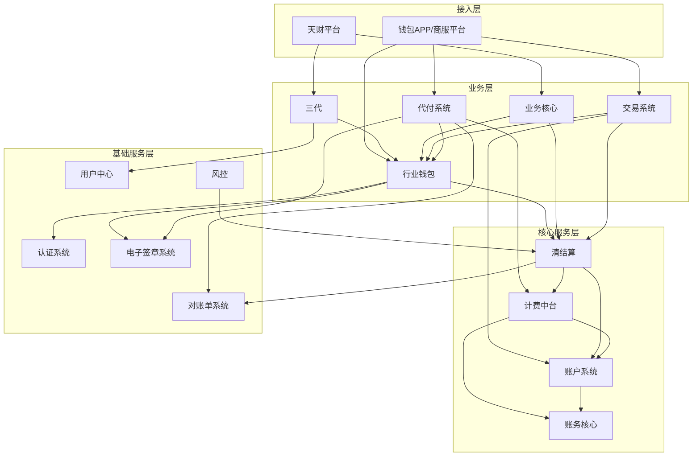
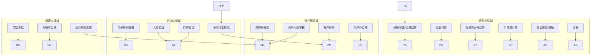
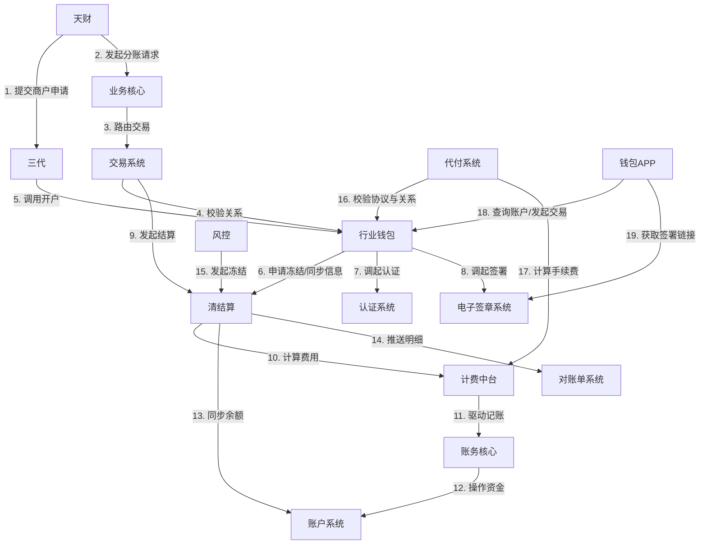

## 2.1 系统结构
本系统采用分层微服务架构，旨在为“天财”平台提供分账、账户管理、资金归集等核心金融服务。整体架构分为接入层、业务层、核心服务层和基础服务层，各层职责清晰，通过API进行松耦合交互。

- **接入层**：包括“天财”平台和“钱包APP/商服平台”，作为业务请求的发起端和用户交互界面。
- **业务层**：包括“三代”、“行业钱包”、“业务核心”、“交易系统”、“代付系统”，负责处理具体的业务流程、规则校验和状态管理。
- **核心服务层**：包括“清结算”、“计费中台”、“账户系统”、“账务核心”，提供资金处理、计费、账户操作等核心金融能力。
- **基础服务层**：包括“用户中心”、“认证系统”、“电子签章系统”、“对账单系统”、“风控”，提供用户标识、身份核验、协议签署、文件生成、风险控制等支撑能力。

## 2.2 功能结构
系统功能围绕账户管理、资金交易、协议认证、运营支撑四大核心领域展开。每个领域由相应的系统模块提供具体功能，共同支撑“天财”平台的业务运营。

- **账户管理域**：负责商户入驻、账户开立、用户标识生成及账户状态管理。
- **资金交易域**：处理各类资金流转业务，包括分账、归集、会员结算、批量付款及其相关的清分、结算、计费、记账操作。
- **协议认证域**：为资金交易提供前置的身份核验与法律授权保障，包括关系绑定、协议签署、打款验证、人脸验证。
- **运营支撑域**：提供风险控制、对账文件生成、业务配置等运营管理功能。

## 2.3 网络拓扑图
TBD

## 2.4 数据流转
以“分账”业务为例，描述一笔资金从请求发起至最终完成记账的数据流转过程。流程体现了请求的发起、业务校验、核心处理、资金操作及最终状态同步的完整链条。

1. 业务请求由“天财”平台发起，经“业务核心”接收并路由。
2. “交易系统”进行业务规则与账户状态校验，并调用“行业钱包”校验关系绑定。
3. “清结算”系统负责交易的清分与结算，调用“计费中台”计算手续费。
4. “计费中台”驱动“账务核心”与“账户系统”完成资金的扣减与增加。
5. 动账明细由“清结算”同步至“对账单系统”生成对账文件。
6. 各环节状态最终回传至“天财”平台。

## 2.5 系统模块交互关系
模块间主要通过同步API调用进行交互，部分场景辅以异步事件通知。核心交互关系围绕业务流程展开，例如“三代”为“行业钱包”提供商户和机构信息以开户，“行业钱包”为“交易系统”提供关系绑定校验，“清结算”作为枢纽协调“计费中台”、“账户系统”和“对账单系统”完成资金处理。

- **强依赖调用**：如“交易系统”处理分账时，必须调用“行业钱包”校验关系绑定，调用“清结算”执行结算。
- **数据同步**：如“清结算”需从“账户系统”同步余额，并向“对账单系统”推送明细。
- **能力服务**：如“认证系统”、“电子签章系统”为上层业务提供可复用的认证与签署能力。

