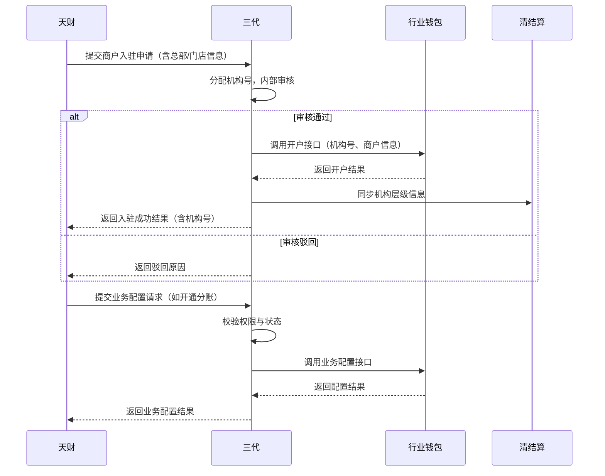

# 模块设计: 三代

生成时间: 2026-01-23 17:17:56
批判迭代: 2

---

# 三代模块设计文档

## 1. 概述
- **目的与范围**: 三代模块是运营系统，核心职责是管理天财平台下的商户与机构。主要功能包括：分配机构号、审核商户信息、调用接口开通账户及配置业务（如分账、归集）。它是连接天财平台与行业钱包、清结算等核心业务系统的运营管理枢纽。

## 2. 接口设计
- **API端点 (REST)**:
    1.  `POST /api/v1/merchant/register`: 接收天财提交的商户入驻申请。
    2.  `POST /api/v1/merchant/audit`: 提交商户审核结果。
    3.  `POST /api/v1/business/config`: 接收天财的业务配置请求（如开通分账、归集）。
    4.  `GET /api/v1/merchant/{merchantId}`: 查询商户信息及状态。
    5.  `PUT /api/v1/merchant/{merchantId}/info`: 更新商户信息。
- **请求/响应结构**: TBD
- **发布/消费的事件**:
    - **发布事件**:
        1.  `MerchantAuditPassedEvent`: 商户审核通过事件。
        2.  `InstitutionCreatedEvent`: 机构信息创建/更新事件。
        3.  `BusinessConfigCompletedEvent`: 业务配置完成事件。
    - **消费事件**: TBD

## 3. 数据模型
- **表/集合**:
    1.  **机构信息表 (t_institution)**
        - `id` (BIGINT, PK): 自增主键。
        - `institution_no` (VARCHAR(32), UNIQUE): 机构号（二级机构号），平台下唯一。
        - `platform_id` (VARCHAR(64)): 天财平台标识。
        - `type` (TINYINT): 机构类型（如：1-总部，2-门店）。
        - `parent_institution_no` (VARCHAR(32), FK -> t_institution.institution_no): 父级机构号（门店关联总部）。
        - `status` (TINYINT): 状态（如：0-待审核，1-正常，2-禁用）。
        - `audit_time` (DATETIME): 审核时间。
        - `create_time` (DATETIME): 创建时间。
        - `update_time` (DATETIME): 更新时间。

    2.  **商户信息表 (t_merchant)**
        - `id` (BIGINT, PK): 自增主键。
        - `merchant_id` (VARCHAR(64), UNIQUE): 商户ID。
        - `institution_no` (VARCHAR(32), FK -> t_institution.institution_no): 关联的机构号。
        - `merchant_type` (TINYINT): 商户类型（如：1-收单商户，2-非收单商户）。
        - `qualification_info` (JSON): 资质信息（结构化JSON存储）。
        - `audit_status` (TINYINT): 审核状态（如：0-待审核，1-审核通过，2-审核驳回）。
        - `audit_comment` (VARCHAR(512)): 审核意见。
        - `create_time` (DATETIME): 创建时间。
        - `update_time` (DATETIME): 更新时间。

    3.  **业务配置表 (t_business_config)**
        - `id` (BIGINT, PK): 自增主键。
        - `config_no` (VARCHAR(64), UNIQUE): 配置流水号。
        - `ref_id` (VARCHAR(64)): 关联ID（可为机构号或商户ID）。
        - `ref_type` (TINYINT): 关联类型（如：1-机构，2-商户）。
        - `business_type` (VARCHAR(32)): 业务类型（如：`SPLIT_ACCOUNT`-分账，`FUND_COLLECTION`-归集）。
        - `config_params` (JSON): 业务配置参数。
        - `status` (TINYINT): 开通状态（如：0-待处理，1-处理中，2-开通成功，3-开通失败）。
        - `retry_count` (INT): 下游调用重试次数。
        - `last_error` (TEXT): 最后一次错误信息。
        - `create_time` (DATETIME): 创建时间。
        - `update_time` (DATETIME): 更新时间。

- **与其他模块的关系**:
    - 为行业钱包提供商户与机构信息，用于开户和关系绑定。
    - 为清结算提供机构层级信息，用于资金清分。

## 4. 业务逻辑
- **核心工作流/算法**:
    1.  **机构分配与审核**:
        - **触发**: 接收天财平台提交的总部及门店信息。
        - **步骤**:
            a. 校验信息完整性及格式。
            b. 生成平台下唯一的机构号。
            c. 持久化机构信息，状态置为“待审核”。
            d. 运营人员进行资质审核。
            e. 审核通过：更新机构状态为“正常”，发布`InstitutionCreatedEvent`。
            f. 审核驳回：更新机构状态为“禁用”，记录驳回原因。
    2.  **账户开通触发**:
        - **触发**: 商户审核通过（`MerchantAuditPassedEvent`）。
        - **步骤**:
            a. 根据商户类型（收单/非收单），调用行业钱包对应的开户接口。
            b. 接收开户结果，更新商户关联的账户信息。
    3.  **业务配置**:
        - **触发**: 接收天财的业务配置请求（如开通分账、归集）。
        - **步骤**:
            a. 校验请求方权限及关联商户/机构状态是否为“正常”。
            b. 创建业务配置记录，状态为“待处理”。
            c. 异步调用行业钱包的业务配置接口。
            d. 接收配置结果，更新业务配置状态为“开通成功”或“开通失败”。
            e. 若成功，发布`BusinessConfigCompletedEvent`。
- **业务规则与验证**:
    - 机构号在平台下唯一。
    - 审核商户资质需符合开通对应账户类型的要求（如收单商户需企业资质）。
    - 门店必须关联一个已审核通过的总部机构。
    - 仅状态为“正常”的商户/机构可进行业务配置。
- **实体状态管理**:
    - **机构状态**: 待审核 -> (审核通过) -> 正常；待审核 -> (审核驳回) -> 禁用。
    - **商户审核状态**: 待审核 -> (审核通过) -> 审核通过；待审核 -> (审核驳回) -> 审核驳回。
    - **业务配置状态**: 待处理 -> 处理中 -> (调用成功) -> 开通成功；待处理 -> 处理中 -> (调用失败) -> 开通失败。
- **关键边界情况处理**:
    - 审核驳回流程及信息同步至天财。
    - 已分配机构号的商户信息变更，需同步至下游系统（行业钱包、清结算）。
    - 调用下游系统接口失败时的重试与补偿机制（见错误处理章节）。

## 5. 时序图

## 6. 错误处理
- **预期错误情况**:
    1.  **下游系统异常**: 行业钱包、清结算服务不可用或接口超时。
    2.  **数据错误**: 提交的商户信息不完整、格式错误或资质不符。
    3.  **数据冲突**: 分配机构号时发生唯一键冲突。
    4.  **业务逻辑错误**: 对非正常状态的实体进行操作。
- **处理策略**:
    1.  **下游接口调用**:
        - 实现熔断与降级机制，防止级联故障。
        - **重试策略**: 对可重试的失败（如网络超时）采用指数退避重试（如最多3次）。
        - **补偿机制**: 对于开户或配置失败，将对应记录状态标记为“开通失败”，记录错误日志，并支持人工介入或定时任务重新触发。
    2.  **输入校验**: 在API入口进行严格校验，返回明确、格式化的错误码与信息。
    3.  **数据一致性**: 关键业务流程（如审核通过并触发开户）使用数据库事务保证。唯一键冲突提示客户端重试或检查数据。
    4.  **状态校验**: 在执行业务操作前，校验关联实体（商户、机构）的状态，非法状态直接返回错误。

## 7. 依赖关系
- **上游模块**: 天财（业务请求来源）
- **下游模块**:
    - 行业钱包（开户、业务配置）
    - 清结算（机构层级信息同步）