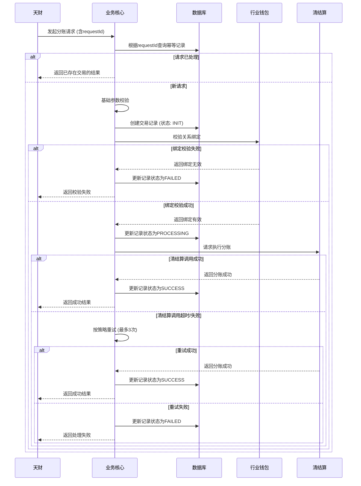

# 模块设计: 业务核心

生成时间: 2026-01-23 17:17:12
批判迭代: 2

---

# 业务核心模块设计文档

## 1. 概述
- **目的与范围**: 业务核心模块负责接收并处理来自天财平台的分账等交易数据。它是连接前端业务请求与后端资金处理流程的枢纽，主要职责包括接收交易请求、进行初步校验、调用下游系统执行业务逻辑（如分账、归集），并管理交易状态。本模块需持久化存储交易记录，确保状态一致性，并提供清晰的接口契约。

## 2. 接口设计
- **API端点 (REST/GraphQL)**:
    1.  `POST /api/v1/biz-core/transactions/split`: 处理天财分账请求。
    2.  `POST /api/v1/biz-core/transactions/collection`: 处理资金归集请求。
    3.  `GET /api/v1/biz-core/transactions/{transactionId}`: 查询交易状态。
- **请求/响应结构**:
    - **分账请求 (示例)**:
        ```json
        {
          "requestId": "req_1234567890", // 请求唯一标识，用于幂等
          "appId": "app_001",
          "payerAccountNo": "TC_PAYER_001", // 付方天财收款账户
          "payeeAccountNo": "TC_PAYEE_001", // 收方天财接收方账户
          "amount": 10000, // 金额（单位：分）
          "transferType": "NET", // 转账类型：NET(净额), GROSS(全额)
          "remark": "分账备注"
        }
        ```
    - **通用响应**:
        ```json
        {
          "code": "SUCCESS",
          "message": "处理成功",
          "data": {
            "transactionId": "txn_9876543210",
            "status": "PROCESSING", // 状态：PROCESSING, SUCCESS, FAILED
            "requestId": "req_1234567890"
          }
        }
        ```
- **发布/消费的事件**:
    - **消费事件**: TBD（例如，监听账户冻结事件以更新本地业务状态）。
    - **发布事件**: 交易状态变更事件（例如，`TransactionStatusChangedEvent`），包含交易ID、新状态、时间戳。

## 3. 数据模型
- **表/集合**: `transaction_record` (交易记录表)
- **关键字段**:
    - `id` (主键): 交易唯一标识。
    - `request_id` (唯一索引): 外部请求ID，用于幂等控制。
    - `app_id`: 应用标识。
    - `business_type`: 业务类型（如：分账、归集）。
    - `payer_account_no`: 付方账户号。
    - `payee_account_no`: 收方账户号。
    - `amount`: 交易金额（分）。
    - `status`: 交易状态（INIT, VALIDATING, PROCESSING, SUCCESS, FAILED）。
    - `request_data` (JSON): 完整的原始请求数据。
    - `response_data` (JSON): 下游系统返回的响应数据。
    - `error_message`: 错误信息。
    - `retry_count`: 向下游系统重试次数。
    - `created_at`: 创建时间。
    - `updated_at`: 更新时间。
- **与其他模块的关系**: 业务核心接收天财的请求，并依赖行业钱包进行关系绑定校验，依赖清结算系统执行资金处理。交易记录表用于跟踪所有操作的状态。

## 4. 业务逻辑
- **核心工作流/算法**: 主要业务流程为处理天财分账请求。流程包括：接收请求、幂等校验、验证基础参数、持久化初始记录、调用行业钱包进行关系绑定校验、调用清结算系统执行资金处理、更新交易状态并返回结果。状态机驱动流程流转。
- **业务规则与验证**:
    1.  幂等性：基于`requestId`，避免重复处理。
    2.  基础校验：必填字段、金额有效性、账户号格式。
    3.  业务校验：通过行业钱包接口校验付方与收方是否存在有效的关系绑定。
    4.  状态校验：交易处理中，检查本地记录状态，防止并发冲突。
- **关键边界情况处理**:
    1.  下游调用失败：根据重试策略进行重试，超过阈值后标记交易失败。
    2.  状态一致性：任何步骤失败，都将交易记录状态更新为`FAILED`，并记录错误原因。
    3.  异步处理：对于长耗时操作，可先返回`PROCESSING`状态，后续通过回调或查询接口获取最终结果。

## 5. 时序图



## 6. 错误处理
- **预期错误情况**:
    1.  请求参数错误（格式、必填）。
    2.  幂等冲突（重复请求）。
    3.  业务校验失败（账户冻结、关系绑定无效）。
    4.  下游系统（行业钱包、清结算）服务不可用、网络超时、接口异常。
    5.  余额不足、账户状态异常。
- **处理策略**:
    1.  **参数与业务错误**：立即失败，返回4xx错误码与明确信息。
    2.  **下游依赖错误**：
        - **重试策略**：采用指数退避重试，最多重试3次。首次失败后等待1秒，第二次等待2秒，第三次等待4秒。
        - **熔断机制**：TBD（建议集成熔断器，当下游失败率过高时暂时熔断）。
        - **状态回滚**：任何一步失败，都将本地交易状态置为`FAILED`，确保状态机终结。
    3.  **幂等性**：所有写操作（创建、更新状态）必须基于`requestId`保证幂等。
    4.  **监控与告警**：记录所有失败日志，对连续失败或关键业务失败进行告警。

## 7. 依赖关系
- **上游模块**: 天财（发起业务请求）。
- **下游模块**:
    1.  **行业钱包**：提供关系绑定校验接口。依赖其`GET /wallet/api/relationship/validate`接口。
    2.  **清结算**：提供资金分账执行接口。依赖其`POST /clearing/api/transaction/split`接口。
- **集成契约**:
    - 与下游系统的交互需明确超时时间（如5秒）。
    - 调用下游接口时需传递`requestId`供其幂等处理。
    - 定义清晰的错误码映射关系，将下游错误转换为业务核心可识别的错误类型。