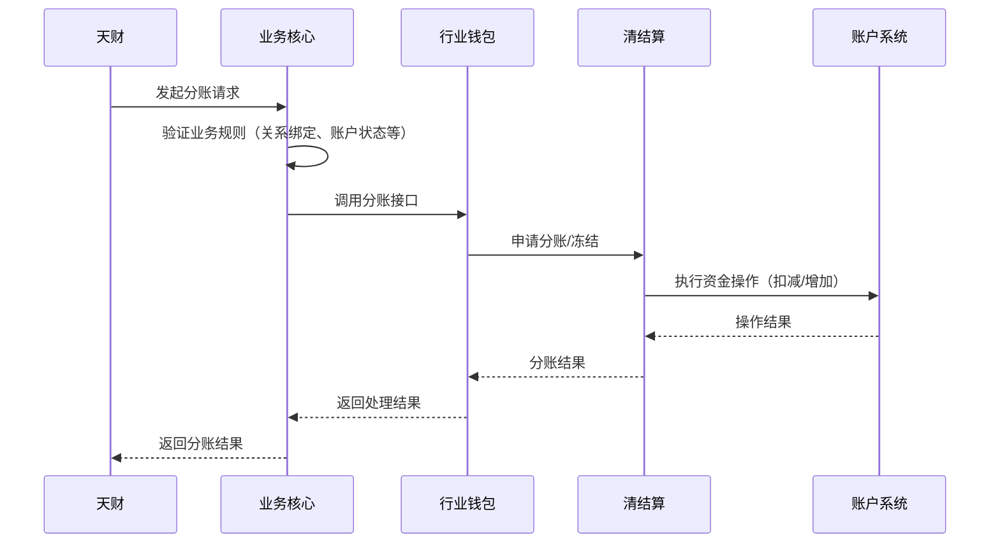

# 模块设计: 交易系统

生成时间: 2026-01-23 17:17:34
批判迭代: 2

---

# 业务核心模块设计文档

## 1. 概述
- **目的与范围**: 本模块（即术语表中的“业务核心”，别名“交易系统”）作为业务核心，负责接收并处理来自天财平台的分账、归集、会员结算、批量付款等交易请求。其核心职责是协调行业钱包、清结算、账户系统等下游模块，完成交易指令的验证、路由、执行与状态管理。其边界在于处理交易请求本身，不直接处理账户开户、协议签署、资金记账等底层操作。

## 2. 接口设计
- **API端点 (REST/GraphQL)**:
    - `POST /api/v1/transactions/split`: 处理单笔分账请求。
    - `POST /api/v1/transactions/collect`: 处理资金归集请求。
    - `POST /api/v1/transactions/member_settlement`: 处理会员结算请求。
    - `POST /api/v1/transactions/batch_payment`: 处理批量付款请求。
    - `GET /api/v1/transactions/{transaction_id}`: 查询交易状态。
- **请求/响应结构**:
    - 通用请求结构包含：`app_id`（应用标识）、`request_id`（请求流水号）、`business_type`（业务类型）、`payer_info`（付方信息）、`payee_info`（收方信息）、`amount`（金额）、`fee_mode`（手续费模式：净额转账/全额转账）等字段。
    - 通用响应结构包含：`code`（响应码）、`message`（响应信息）、`data`（响应数据，如交易ID、状态、执行详情）。
- **发布/消费的事件**:
    - 发布事件：`TransactionCreated`（交易创建）、`TransactionCompleted`（交易完成）、`TransactionFailed`（交易失败）、`BatchPaymentPartialSuccess`（批量付款部分成功）。
    - 消费事件：TBD（可能消费来自风控系统的冻结事件）。

## 3. 数据模型
- **表/集合**:
    - `transactions`（交易主表）：存储所有交易的核心信息。
    - `batch_transaction_items`（批量交易子项表）：存储批量付款或会员结算中的单笔明细。
- **关键字段**:
    - `transactions` 表：`id`（交易ID）、`type`（业务类型：分账/归集/会员结算/批量付款）、`status`（状态：待处理/处理中/成功/失败/部分成功）、`amount`（总金额）、`payer_account_id`（付方账户ID）、`payee_account_id`（收方账户ID，批量付款时为空）、`fee_mode`、`request_id`、`created_at`、`updated_at`。
    - `batch_transaction_items` 表：`id`、`batch_id`（关联的交易ID）、`item_status`（子项状态）、`payee_account_id`（收方账户ID）、`amount`（子项金额）、`error_message`（失败原因）。
- **与其他模块的关系**: 本模块处理的天财分账等交易数据，其源头来自天财平台，执行依赖行业钱包、清结算、账户系统等。`payer_account_id` 和 `payee_account_id` 关联至账户系统的账户信息。

## 4. 业务逻辑
- **核心工作流/算法**: 主要业务流程包括分账、归集、会员结算、批量付款。基本流程为：接收交易请求 -> 验证业务规则（如关系绑定、账户状态） -> 调用行业钱包或清结算执行资金划转 -> 更新交易状态。
- **业务规则与验证**: 需验证付方与收方是否已完成关系绑定及协议签署；验证付方账户（天财收款账户）状态是否正常、余额是否充足；验证交易金额、手续费模式（净额转账/全额转账）等参数的有效性。
- **关键边界情况处理**:
    - **批量付款部分成功处理**：对于批量付款，系统将逐笔处理子项。记录每笔子项的状态（成功/失败）。若部分成功，主交易状态标记为“部分成功”，并记录失败子项的详细信息，供后续人工或自动重试处理。
    - **补偿与冲正逻辑**：当调用下游系统（如清结算）超时或异常时，启动补偿机制。对于已发起的资金操作，通过查询下游状态进行确认。若下游最终失败，则更新本系统交易状态为失败。若下游状态不明，则记录异常日志，触发定时对账任务进行核对与冲正，确保数据最终一致性。

## 5. 时序图

## 6. 错误处理
- **预期错误情况**: 业务规则校验失败（如未绑定关系、账户冻结）；账户余额不足；下游系统（行业钱包、清结算）服务异常或超时；网络通信故障；批量付款中的部分失败。
- **处理策略**:
    - 对于业务校验失败，立即返回明确的错误码和提示。
    - 对于下游系统异常，根据业务重要性决定是否进行有限次重试，并记录详细日志。
    - 实现基于请求流水号（`request_id`）的幂等性控制，防止重复处理。
    - 对于部分成功场景，提供详细的子项状态查询接口，并支持对失败子项发起补偿或重试。

## 7. 依赖关系
- **上游模块**: 天财平台（交易请求来源）。
- **下游模块**: 行业钱包（执行分账核心逻辑）、清结算（处理清分、结算、计费）、账户系统（底层资金操作）。