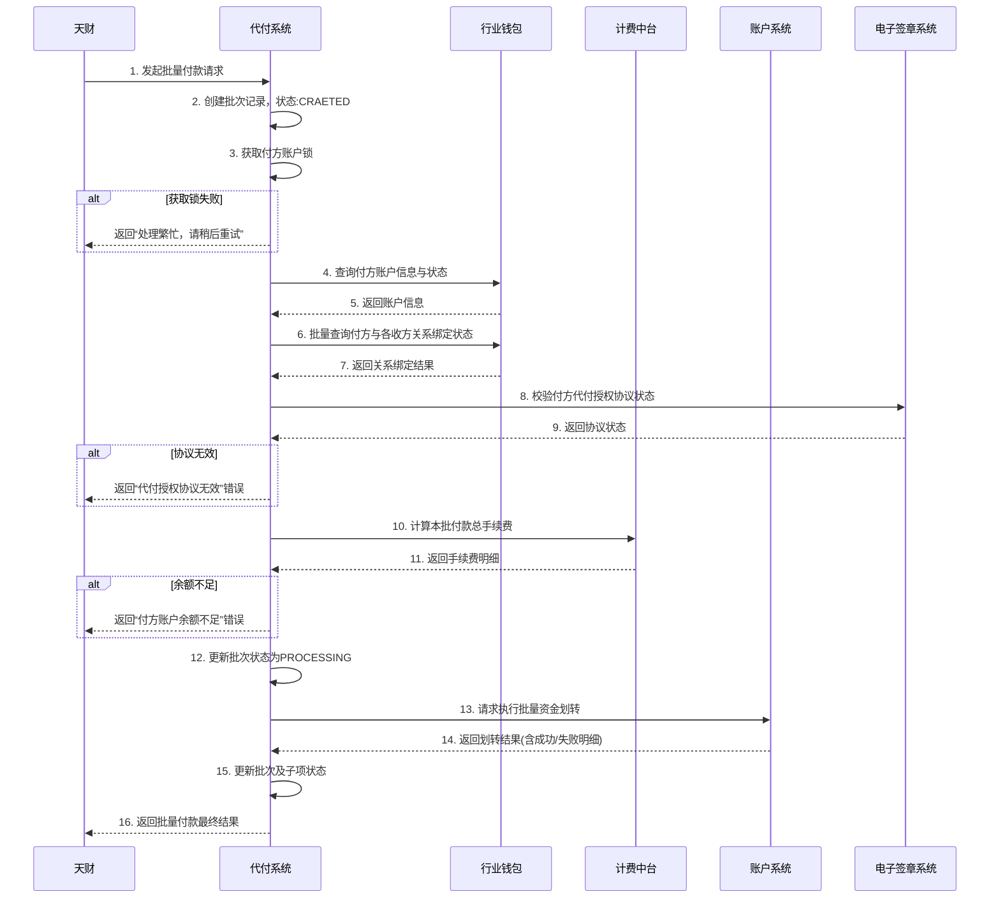
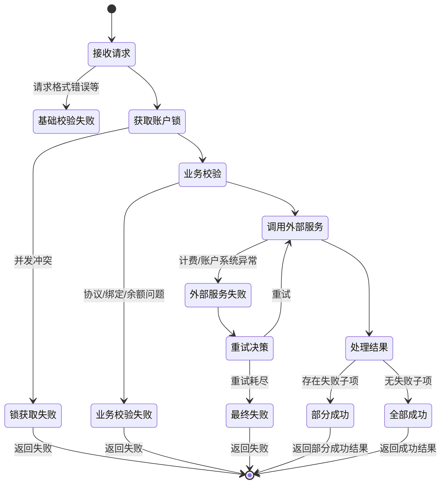

# 模块设计: 代付系统

生成时间: 2026-01-23 17:17:59
批判迭代: 2

---

# 代付系统 设计文档

## 1. 概述
- **目的与范围**: 本模块负责处理从天财收款账户向多个天财接收方账户进行批量付款（批付）的业务。核心职责包括接收批付请求、处理付款授权、执行资金划转、管理手续费以及处理结果通知。其业务边界包括接收请求、执行业务校验、调用计费中台计算费用、向账户系统发起资金操作指令，并接收和处理账户系统返回的结果。

## 2. 接口设计
- **API端点 (REST/GraphQL)**:
    1.  `POST /api/v1/batch-payments`: 创建并提交一个新的批量付款请求。
    2.  `GET /api/v1/batch-payments/{batchId}`: 根据批次号查询批量付款的详细状态和结果。
    3.  `POST /api/v1/batch-payments/{batchId}/retry-failed-items`: 对指定批次中失败的付款项进行重试。
- **请求/响应结构**:
    - **创建批量付款请求体**:
        ```json
        {
          "payer_account_no": "付方天财收款账户号",
          "biz_scene": "业务场景标识",
          "payment_items": [
            {
              "payee_account_no": "收方天财接收方账户号",
              "amount": 10000,
              "currency": "CNY",
              "memo": "备注信息"
            }
          ]
        }
        ```
    - **创建批量付款响应体**:
        ```json
        {
          "batch_id": "批次唯一标识",
          "status": "PROCESSING",
          "request_time": "2023-01-01T00:00:00Z"
        }
        ```
    - **查询批次详情响应体**:
        ```json
        {
          "batch_id": "批次唯一标识",
          "payer_account_no": "付方账户号",
          "total_amount": 50000,
          "total_fee": 100,
          "status": "PARTIALLY_SUCCEEDED",
          "items": [
            {
              "item_id": "子项ID",
              "payee_account_no": "收方账户号",
              "amount": 10000,
              "fee": 20,
              "status": "SUCCESS",
              "error_code": null,
              "error_msg": null
            }
          ]
        }
        ```
- **发布/消费的事件**:
    - **发布事件**:
        1.  `BatchPaymentCreated`: 批量付款请求创建事件。
        2.  `BatchPaymentStatusChanged`: 批量付款状态变更事件（如转为成功、部分成功、失败）。
    - **消费事件**: TBD

## 3. 数据模型
- **表/集合**:
    1.  `batch_payment` (批量付款主表)
    2.  `payment_item` (付款子项表)
- **关键字段**:
    - **`batch_payment` 表**:
        - `batch_id` (主键): 批次唯一标识。
        - `payer_account_no`: 付方天财收款账户号。
        - `total_amount`: 批次总金额。
        - `total_fee`: 批次总手续费。
        - `status`: 批次状态 (CREATED, VALIDATING, PROCESSING, SUCCEEDED, PARTIALLY_SUCCEEDED, FAILED)。
        - `authorization_sn`: 代付授权协议流水号。
        - `created_at`, `updated_at`: 创建与更新时间。
    - **`payment_item` 表**:
        - `item_id` (主键): 子项唯一标识。
        - `batch_id` (外键): 关联的批次ID。
        - `payee_account_no`: 收方天财接收方账户号。
        - `amount`: 付款金额。
        - `fee`: 该笔手续费。
        - `status`: 子项状态 (PENDING, SUCCESS, FAILED)。
        - `error_code`, `error_msg`: 失败错误码和信息。
        - `accounting_sn`: 账户系统返回的资金操作流水号。
- **与其他模块的关系**: 本模块依赖**行业钱包**获取账户信息与关系绑定状态，依赖**账户系统**执行资金扣减与增加，依赖**计费中台**计算手续费，依赖**电子签章系统**处理代付授权协议。本模块的数据是**对账单系统**生成动账明细的数据源之一。

## 4. 业务逻辑
- **核心工作流/算法**: 主要业务流程为“批量付款”。首先，付方（总部/门店）需完成“开通付款”流程，即通过电子签约平台签署代付授权协议。协议生效后，代付系统接收批付请求，校验付方账户状态、余额、与各收方的“关系绑定”状态。校验通过后，调用计费中台计算手续费（可能涉及净额转账或全额转账模式），然后向账户系统发起批量资金转移指令，并处理返回结果。
- **业务规则与验证**:
    1.  付方必须为已开通天财收款账户的收单商户（总部或门店）。
    2.  付方必须已完成“开通付款”授权，且协议在有效期内。
    3.  付方与每个收方之间必须存在有效的“关系绑定”。
    4.  付方账户（天财收款账户）余额需足以覆盖总付款金额及手续费。
    5.  收方账户（天财接收方账户）状态必须正常。
- **关键边界情况处理**:
    - **部分成功**: 当批量付款中部分收款方处理失败时，需支持部分成功，并明确返回成功与失败的明细。
    - **协议失效**: 若处理时付方的代付授权协议已过期或撤销，则整个批次付款失败。
    - **并发扣款**: 通过数据库悲观锁（`SELECT FOR UPDATE`）或分布式锁，在核心校验和扣款阶段锁定付方账户记录，防止超额支付。
- **状态机**:
    - **批次状态流转**: `CREATED` -> `VALIDATING` -> `PROCESSING` -> (`SUCCEEDED` / `PARTIALLY_SUCCEEDED` / `FAILED`)。
    - **子项状态流转**: `PENDING` -> (`SUCCESS` / `FAILED`)。

## 5. 时序图


## 6. 错误处理
- **预期错误情况**:
    1.  付方账户不存在、已冻结或余额不足。
    2.  付方未签署或已失效代付授权协议。
    3.  付方与一个或多个收方无有效绑定关系。
    4.  收方账户不存在或状态异常。
    5.  计费中台服务不可用或计算失败。
    6.  账户系统处理资金操作失败（部分或全部）。
    7.  并发请求导致账户锁获取失败。
- **处理策略**:
    - **业务校验失败**：在`VALIDATING`阶段，如协议失效、无绑定关系、余额不足等，立即拒绝整个请求，批次状态置为`FAILED`。
    - **依赖服务瞬时故障**：对计费中台、账户系统等外部调用配置指数退避重试机制。
    - **部分失败处理**：账户系统返回部分失败时，记录详细错误原因，批次状态根据结果更新为`SUCCEEDED`（全部成功）或`PARTIALLY_SUCCEEDED`（部分成功）。
    - **并发控制**：通过数据库行锁确保同一付方账户的扣款操作串行化，防止超付。获取锁失败的请求快速失败。
- **错误处理流程**:


## 7. 依赖关系
- **上游模块**:
    1.  **行业钱包**: 提供付方/收方账户信息查询、关系绑定状态校验。
    2.  **计费中台**: 提供批量付款手续费的计算服务。
    3.  **账户系统**: 执行实际的资金扣减与增加操作。
    4.  **电子签章系统**: 提供代付授权协议的签署状态查询。
- **下游模块**:
    1.  **对账单系统**: 消费本模块产生的资金变动结果，生成商户动账明细。
    2.  TBD