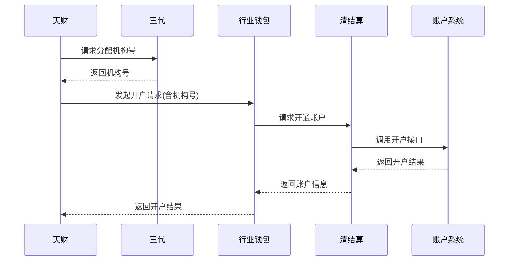
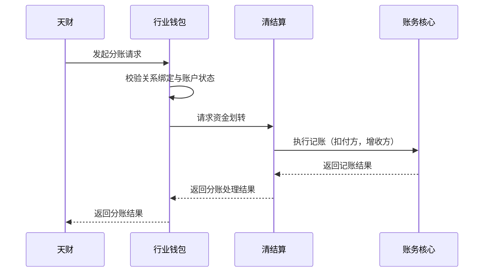
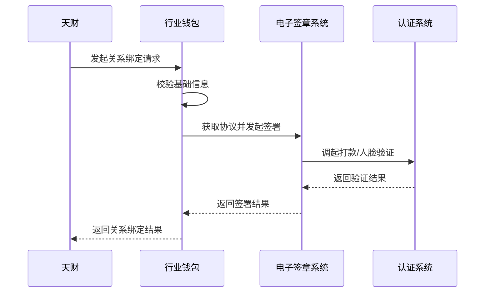

# 模块设计: 天财

生成时间: 2026-01-23 17:17:38
批判迭代: 2

---

# 天财模块设计文档

## 1. 概述
- **目的与范围**: 天财模块是业务请求的发起方，负责发起分账、开户、关系绑定等业务请求。它与ISV/开放平台关联，获取并管理APPID，作为与下游系统交互的统一身份标识。本模块的核心职责是作为业务入口，封装并转发业务请求，管理业务请求的状态，并处理相关的业务逻辑，如参数校验、状态同步与异常补偿。

## 2. 接口设计
- **API端点 (REST/GraphQL)**: 天财模块对外提供RESTful API，供前端或外部系统调用，主要端点包括：
    - `POST /api/tiancai/ledger`: 发起分账请求。
    - `POST /api/tiancai/account/open`: 发起开户请求。
    - `POST /api/tiancai/relationship/bind`: 发起关系绑定请求。
    - `GET /api/tiancai/requests/{requestId}`: 查询业务请求状态。
- **请求/响应结构**: 所有请求均需携带由ISV/开放平台分配的`app_id`作为身份凭证。响应结构包含`code`、`message`、`data`字段，其中`data`包含业务流水号`request_id`或具体业务数据。
- **发布/消费的事件**: 天财模块消费来自下游系统（如行业钱包、清结算）的业务结果通知事件，用于更新本地业务请求状态。同时，在业务终态（成功/失败）时，会发布事件通知相关业务方。

## 3. 数据模型
- **表/集合**:
    1.  `tiancai_app_info`: 存储从ISV/开放平台获取的APPID及相关配置信息。
    2.  `tiancai_business_request`: 存储所有发起的业务请求记录，用于状态跟踪与查询。
    3.  `tiancai_merchant_mapping`: 存储商户（总部/门店）与机构号的映射关系。
- **关键字段**:
    - `tiancai_app_info`: `id`, `app_id`, `app_secret`, `platform` (ISV/开放平台), `status`, `create_time`。
    - `tiancai_business_request`: `request_id`, `app_id`, `business_type` (分账/开户/绑定), `request_params`, `status` (初始/处理中/成功/失败), `thirdparty_trace_id`, `result_data`, `create_time`, `update_time`。
    - `tiancai_merchant_mapping`: `id`, `app_id`, `merchant_id`, `institution_no` (机构号), `merchant_type` (总部/门店), `parent_merchant_id`。
- **与其他模块的关系**: 天财模块通过`app_id`与ISV/开放平台关联。通过`request_id`、`institution_no`等字段与三代、行业钱包、清结算等下游系统的业务记录关联。

## 4. 业务逻辑
- **核心工作流/算法**:
    1.  **发起分账**:
        - 输入：付方账户、收方账户、金额、业务场景（归集/会员结算/批量付款）、手续费模式（净额/全额）。
        - 流程：验证`app_id`有效性 -> 校验付方账户状态与余额 -> 调用行业钱包分账接口 -> 接收异步结果通知 -> 更新分账请求状态。
    2.  **发起开户**:
        - 输入：商户信息、商户类型（收单商户/非收单商户）、账户类型（天财收款账户/天财接收方账户）。
        - 流程：调用三代接口申请机构号 -> 携带机构号调用行业钱包开户接口 -> 行业钱包调用清结算及账户系统完成开户 -> 接收异步结果通知 -> 保存账户信息与机构号映射。
    3.  **发起关系绑定**:
        - 输入：付方商户ID、收方商户ID、协议类型。
        - 流程：校验双方商户状态及是否存在绑定冲突 -> 调用行业钱包关系绑定接口（可能触发电子签章流程） -> 接收异步结果通知 -> 更新绑定关系状态。
- **业务规则与验证**:
    - 所有请求必须携带有效且处于启用状态的`app_id`。
    - 分账请求需校验付方账户是否为**天财收款账户**，且余额充足。
    - 开户请求需根据商户类型（收单/非收单）确定开通的账户类型（天财收款账户/天财接收方账户）。
    - 关系绑定需确保付方已签署代付授权协议（开通付款）。
- **关键边界情况处理**:
    - **状态管理**: 本地`tiancai_business_request`表记录请求状态，通过异步通知或主动查询与下游系统进行状态同步，防止状态不一致。
    - **补偿机制**: 对于超时未收到下游响应的请求，启动主动查询补偿流程。对于最终失败的业务，记录详细错误原因，并提供人工干预入口。

## 5. 时序图

### 5.1 开户时序图

### 5.2 分账时序图

### 5.3 关系绑定时序图

## 6. 错误处理
- **预期错误情况**:
    1.  参数校验失败（如`app_id`无效、金额格式错误）。
    2.  网络超时或下游服务（三代、行业钱包）不可用。
    3.  业务逻辑错误（如账户不存在、余额不足、关系已绑定、商户已冻结）。
    4.  权限验证失败（如`app_id`无此操作权限）。
- **处理策略**:
    - 参数与权限错误立即失败，返回明确错误码。
    - 网络超时等暂时性错误，根据`tiancai_business_request`记录实施指数退避重试。
    - 业务逻辑错误，记录详细日志，更新请求状态为失败，并返回业务方可识别的错误信息。
    - 建立监控告警机制，对持续失败或长时间处于“处理中”状态的请求进行告警。

## 7. 依赖关系
- **上游模块**: ISV/开放平台（提供并管理`APPID`）。
- **下游模块**:
    - 三代运营：分配机构号、审核商户资质。
    - 行业钱包：处理开户、关系绑定、分账等核心业务请求。
    - 清结算/计费中台：处理资金清分、结算、手续费计算。
    - 账户系统：执行底层账户操作。
    - 账务核心：执行记账。
    - 电子签章系统：处理协议签署。
    - 认证系统：提供身份核验。
    - 业务核心：接收分账等交易数据。