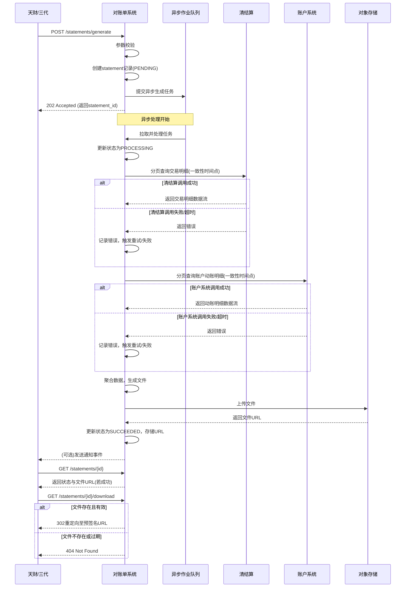

# 模块设计: 对账单系统

生成时间: 2026-01-23 17:17:47
批判迭代: 2

---

# 对账单系统 模块设计文档

## 1. 概述
- **目的与范围**: 本模块负责生成并提供各类账户动账明细、交易明细等对账文件。其核心职责是响应查询请求，基于底层数据生成结构化的对账单，供天财、三代或其他系统下载或查阅，以完成资金核对与业务对账。模块的边界包括：接收生成请求、从源系统聚合数据、按约定格式生成文件、存储文件并提供访问。文件内容的结构化处理（如数据筛选、格式转换）属于本模块的核心职责。

## 2. 接口设计
- **API端点 (REST/GraphQL)**:
    - `POST /v1/statements/generate`: 提交对账单生成请求。
    - `GET /v1/statements/{statement_id}`: 查询对账单生成状态与详情。
    - `GET /v1/statements/{statement_id}/download`: 获取对账单文件的下载链接或文件流。
- **请求/响应结构**:
    - 生成请求 (`POST /v1/statements/generate`):
        - 请求体: `{ "account_id": "string", "start_date": "YYYY-MM-DD", "end_date": "YYYY-MM-DD", "statement_type": "ACCOUNT_FLOW|TRANSACTION_DETAIL" }`
        - 响应体: `{ "statement_id": "string", "status": "PENDING|PROCESSING|SUCCEEDED|FAILED", "estimated_completion_time": "timestamp" }`
    - 状态查询 (`GET /v1/statements/{statement_id}`):
        - 响应体: `{ "statement_id": "string", "status": "PENDING|PROCESSING|SUCCEEDED|FAILED", "file_url": "string (nullable)", "created_at": "timestamp", "completed_at": "timestamp (nullable)", "error_message": "string (nullable)" }`
    - 下载 (`GET /v1/statements/{statement_id}/download`):
        - 响应: 302重定向至文件临时访问URL，或直接返回文件流。
- **发布/消费的事件**:
    - 消费事件: TBD (例如，监听账户动账事件以触发对账单预生成？)
    - 发布事件: `StatementGeneratedEvent` (事件内容包含 `statement_id`, `account_id`, `period`, `file_url`)。

## 3. 数据模型
- **表/集合**:
    - `statements` (对账单主表):
        - `id` (主键): 对账单唯一标识。
        - `account_id`: 关联的账户ID。
        - `start_date`: 对账周期开始日期。
        - `end_date`: 对账周期结束日期。
        - `statement_type`: 对账单类型（如：账户动账明细、交易明细）。
        - `status`: 状态（PENDING, PROCESSING, SUCCEEDED, FAILED）。
        - `file_storage_path`: 生成文件在对象存储中的路径。
        - `file_format`: 文件格式（如：CSV, Excel）。
        - `generated_at`: 文件生成完成时间。
        - `created_at`: 任务创建时间。
        - `updated_at`: 最后更新时间。
    - `statement_generation_tasks` (可选，用于异步作业管理):
        - `id` (主键): 任务ID。
        - `statement_id`: 关联的对账单ID。
        - `status`: 任务状态。
        - `retry_count`: 重试次数。
        - `error_log`: 错误日志。
        - `scheduled_at`: 计划执行时间。
- **关键字段**: 见上表。
- **与其他模块的关系**: 本模块的数据来源依赖于**清结算**（获取交易清分、结算明细）、**账户系统**（获取账户动账明细）。**业务核心**作为交易数据的处理入口，其数据通常已沉淀至**清结算**或**账户系统**，因此本模块不直接与**业务核心**交互。生成的对账单主要提供给**天财**、**三代**等上游业务方使用。

## 4. 业务逻辑
- **核心工作流/算法**:
    1. **接收请求**: 通过API接收生成对账单的请求，验证参数（账户有效性、日期范围合理性）。
    2. **异步任务创建**: 验证通过后，创建`statements`记录（状态为PENDING）并提交异步生成任务到作业队列。
    3. **数据聚合**:
        - 根据`statement_type`，并发或顺序调用**清结算**与**账户系统**的查询接口。
        - 为保障跨系统数据在某一时刻的一致性，查询时使用请求参数中`end_date`的日切时间点（如`end_date 23:59:59`）作为数据快照的基准时间点，并向源系统传递此参数。
        - 对源系统的查询采用分页或流式接口，避免单次加载海量数据。
    4. **文件生成**:
        - 将聚合后的数据按约定格式（如CSV：包含字段`交易时间`、`交易类型`、`对方账户`、`金额`、`余额`等）组装。
        - 文件命名规则：`{account_id}_{statement_type}_{start_date}_{end_date}_{generated_timestamp}.{format}`。
        - 将生成的文件上传至对象存储（如S3、OSS），并更新`statements`表的`file_storage_path`和`status`。
    5. **状态通知**: 文件生成完成后，更新状态为SUCCEEDED，并可选择发布`StatementGeneratedEvent`事件。
- **业务规则与验证**:
    - 验证请求账户是否存在且属于请求方。
    - 验证日期范围不超过系统允许的最大跨度（如90天）。
    - 确保对账单文件在对象存储中的访问权限受控，通过预签名URL提供临时访问。
    - 文件保留策略（TTL）：生成的文件默认保留30天，过期后由存储服务自动清理。
- **关键边界情况处理**:
    - **数据一致性**: 通过指定一致性时间点查询来规避源系统间数据延迟问题。若某个源系统在该时间点无可用数据，则任务失败，需人工介入或重试。
    - **海量数据**: 采用异步作业、分页查询、流式处理生成文件，避免阻塞请求和内存溢出。
    - **源系统故障**: 对依赖服务调用配置重试机制（如最多3次）和超时时间。若最终失败，则将任务状态置为FAILED并记录错误日志。
    - **文件生成失败**: 记录详细错误，告警通知运维人员。

## 5. 时序图

## 6. 错误处理
- **预期错误情况**:
    1. **客户端错误**: 请求参数无效（账户不存在、日期格式错误、超出最大范围）。
    2. **依赖服务错误**: **清结算**或**账户系统**服务不可用、响应超时、返回数据格式异常。
    3. **内部处理错误**: 异步作业执行失败、文件生成过程IO错误、上传对象存储失败。
    4. **资源限制**: 查询数据量过大导致处理超时或内存不足。
- **处理策略**:
    - **客户端错误**: 立即返回`4xx`错误码及明确提示信息，不创建任务。
    - **依赖服务错误**: 在异步任务中实现指数退避重试机制（如最多3次）。若最终失败，将任务状态更新为FAILED，记录详细错误信息，并触发告警。
    - **内部处理错误**: 记录错误日志，任务状态置为FAILED，告警通知运维。
    - **资源限制**: 设计上通过分页查询、流式处理规避。若仍发生，视为处理失败，按内部错误处理。

## 7. 依赖关系
- **上游模块**:
    - **清结算**: 提供交易清分、结算明细数据。依赖其分页查询接口。
    - **账户系统**: 提供账户动账明细数据。依赖其分页查询接口。
    - **（间接）业务核心**: 不直接依赖，其处理后的交易数据已由上游模块提供。
- **下游模块**:
    - **天财**: 消费对账单文件，用于资金核对。
    - **三代**: 消费对账单文件，用于运营审核与对账。
- **基础设施依赖**:
    - **异步作业队列**: 用于解耦对账单生成任务。
    - **对象存储**: 用于持久化存储生成的对账单文件。
    - **数据库**: 用于存储对账单元数据与任务状态。