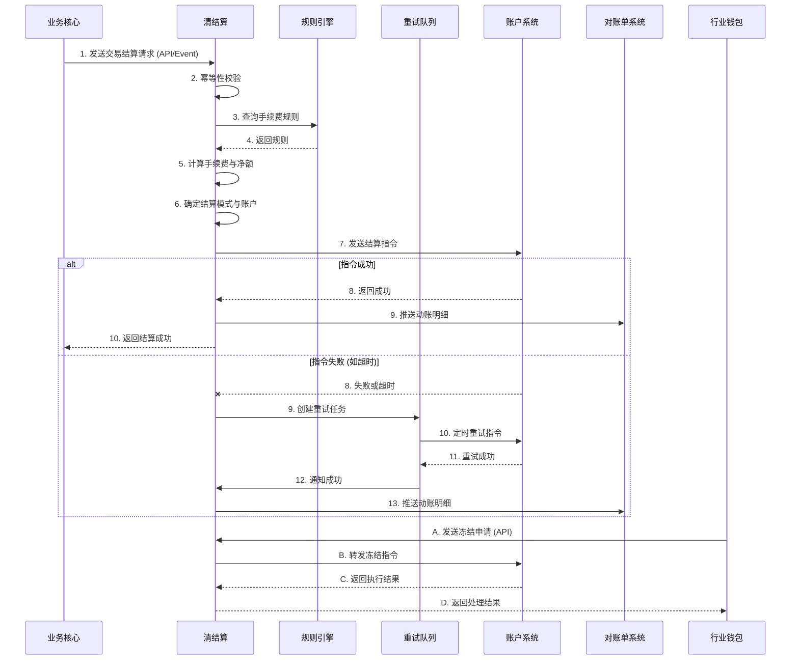

# 模块设计: 清结算

生成时间: 2026-01-23 17:18:10
批判迭代: 2

---

# 清结算模块设计文档

## 1. 概述
- **目的与范围**: 本模块是负责交易清分、结算、计费、账户信息同步及冻结申请处理的核心系统。其边界包括：接收来自业务核心的交易数据，进行手续费计算与清分，将结算指令发送至账户系统，处理来自行业钱包的冻结申请，并向对账单系统提供账户动账明细。本模块与术语表中的“计费中台”为同一系统，不视为两个独立实体。

## 2. 接口设计
- **API端点 (REST/GraphQL)**:
    - **POST /api/v1/settlement/orders**: 接收业务核心发起的结算请求。
    - **POST /api/v1/freeze/requests**: 接收行业钱包发起的商户冻结或交易冻结申请。
    - **GET /api/v1/accounts/{accountNo}/balance**: 从账户系统同步指定账户的余额与状态信息。
    - **POST /api/v1/statements/details**: 向对账单系统推送动账明细。
- **请求/响应结构**:
    - **结算请求 (来自业务核心)**: TBD（需包含交易流水号、机构号、付方账户、收方账户、金额、业务类型、结算模式等字段）
    - **冻结申请 (来自行业钱包)**: TBD（需包含冻结类型、目标账户号、关联交易号、冻结原因、申请方等字段）
    - **结算指令 (发往账户系统)**: TBD（需包含指令流水号、操作类型、账户号、金额、业务标识等字段）
    - **动账明细 (发往对账单系统)**: TBD（需包含账户号、交易时间、交易类型、金额、余额、关联业务号等字段）
- **发布/消费的事件**:
    - **消费事件**: 消费业务核心发布的“交易完成”事件，作为结算流程的触发源之一。
    - **发布事件**: 发布“结算指令已发送”、“结算完成”、“冻结指令已执行”等事件，供下游系统订阅。

## 3. 数据模型
- **表/集合**:
    - **结算订单表 (SettlementOrder)**: 记录每一笔结算请求的处理状态与结果。
    - **手续费规则表 (FeeRule)**: 存储不同业务类型（如分账、归集）下的手续费计算规则（净额/全额、费率等）。
    - **冻结申请记录表 (FreezeRequest)**: 记录来自行业钱包的冻结申请及处理状态。
    - **待重试任务表 (RetryTask)**: 记录因下游系统失败而需要重试的指令。
- **关键字段**:
    - **SettlementOrder**: 订单ID、交易流水号、业务类型、结算模式（主动/被动）、付方账户、收方账户、交易金额、手续费金额、净结算金额、状态（待处理、清分中、结算指令已生成、结算成功、结算失败）、创建时间、完成时间。
    - **FeeRule**: 规则ID、业务类型、适用账户类型、手续费计算方式（净额转账、全额转账）、费率/固定金额、生效时间、失效时间。
    - **FreezeRequest**: 申请ID、冻结类型（商户冻结、交易冻结）、目标账户号、关联交易号、申请状态（待处理、已转发、执行成功、执行失败）、申请时间、处理时间。
    - **RetryTask**: 任务ID、关联业务ID（如结算订单ID）、任务类型（结算指令重试、冻结指令重试）、当前重试次数、最大重试次数、下次重试时间、状态（待重试、重试中、已成功、已放弃）。
- **与其他模块的关系**: 通过交易流水号与业务核心的交易数据关联；通过账户号与账户系统的账户信息关联；通过申请ID与行业钱包的冻结申请关联。

## 4. 业务逻辑
- **核心工作流/算法**:
    1.  **交易清分与结算流程**:
        - **触发**: 通过API接收业务核心的结算请求或消费其发布的“交易完成”事件。
        - **幂等性检查**: 根据交易流水号检查是否已处理，避免重复结算。
        - **清分与计费**:
            - 根据业务类型（如分账、归集）查询`FeeRule`表获取手续费规则。
            - 根据规则计算手续费（净额转账：手续费从交易金额中扣除；全额转账：手续费额外计算）。
        - **结算模式决策**:
            - **主动结算**: 当请求中指定了结算账户（如天财收款账户）时，结算至该账户。
            - **被动结算**: 当未指定结算账户时，结算至该商户的默认结算账户（如01待结算账户）。
        - **生成结算指令**: 组装指令数据，调用账户系统接口进行资金划转。
        - **状态更新与通知**: 更新`SettlementOrder`状态，并向对账单系统推送动账明细。
    2.  **冻结申请处理流程**:
        - **接收申请**: 通过API接收行业钱包的冻结申请。
        - **风控流程衔接**: 本模块不进行风控判定，仅作为指令转发通道。申请中已包含风控判定结果（冻结类型、原因）。
        - **指令转发**: 根据冻结类型，调用账户系统的对应接口（冻结账户或冻结账户内特定资金）。
        - **状态同步**: 记录处理结果，并可能向行业钱包反馈执行状态。
    3.  **账户信息同步**: 定时或按需调用账户系统接口，获取关键账户（如天财收款账户）的余额与状态（正常、冻结），用于业务逻辑判断（如结算前检查账户状态）。
- **业务规则与验证**:
    1.  结算前校验账户状态，若账户已冻结，则终止结算流程并记录失败。
    2.  支持配置化的手续费规则，规则匹配优先级：具体业务类型 > 默认规则。
    3.  结算指令需保证幂等性，支持重试而不导致重复扣款或加款。
- **关键边界情况处理**:
    1.  **结算失败处理（对账与补偿）**:
        - 若调用账户系统失败，将相关指令记录至`RetryTask`表，进入异步重试队列。
        - 重试策略：指数退避，达到最大重试次数后标记为最终失败，并触发告警，需人工介入对账。
        - 每日日终执行对账作业，比对本模块的结算记录与账户系统的资金变动记录，发现差异并生成异常报告。
    2.  **手续费计算异常**: 若无匹配规则，结算流程中断，记录错误并告警，需人工配置规则。
    3.  **数据不一致**: 如接收的交易数据中账户信息不存在，立即失败并通知业务核心。

## 5. 时序图

## 6. 错误处理
- **预期错误情况**:
    1.  **下游依赖不可用**: 账户系统、对账单系统服务异常或网络超时。
    2.  **数据错误**: 交易数据格式非法、账户不存在、手续费规则缺失。
    3.  **业务规则冲突**: 账户已冻结、余额不足导致结算失败。
    4.  **幂等冲突**: 重复的请求流水号。
- **处理策略**:
    1.  **重试与熔断**: 对下游API调用配置重试机制与熔断器（如基于失败率）。结算指令失败进入异步重试队列。
    2.  **优雅降级**: 若对账单系统暂时不可用，动账明细可先持久化到本地，待其恢复后补推。
    3.  **快速失败与告警**: 对于数据错误、规则缺失等预期内错误，立即失败，记录详细日志并触发告警通知负责人。
    4.  **状态管理与对账**: 所有核心操作均需更新明确的状态（如`SettlementOrder.status`），并通过日终对账保证最终一致性。

## 7. 依赖关系
- **上游模块**:
    - **业务核心**: 提供交易数据，触发结算流程。
    - **行业钱包**: 发起商户冻结与交易冻结申请。
- **下游模块**:
    - **账户系统**: 执行资金划转、账户冻结等底层账务操作。
    - **对账单系统**: 接收动账明细，用于生成对账文件。
- **内部依赖**:
    - **规则引擎**: 查询手续费计算规则（可作为本模块内嵌组件或独立服务）。