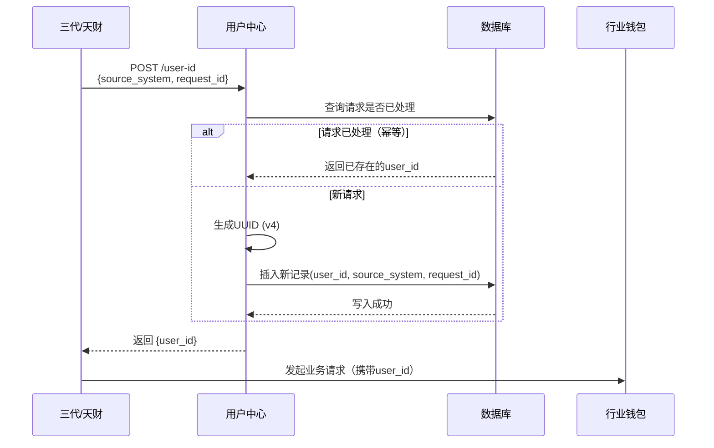

# 模块设计: 用户中心

生成时间: 2026-01-23 17:17:49
批判迭代: 2

---

# 用户中心模块设计文档

## 1. 概述
- **目的与范围**: 用户中心模块负责生成全局唯一的用户标识，并提供给行业钱包系统，作为其进行账户开户、关系绑定等业务流程的唯一用户标识依据。本模块不提供或管理用户的其他基础信息。
- **模块形态**: 本模块是一个独立的微服务。

## 2. 接口设计
- **API端点 (REST)**:
    - `POST /api/v1/user-id`: 生成用户标识。
- **请求/响应结构**:
    - **请求体**:
        - `source_system` (string, required): 请求来源系统标识，如 “三代” 或 “天财”。
        - `request_id` (string, required): 上游系统生成的唯一请求ID，用于保证幂等性。
        - `biz_context` (object, optional): 上游业务上下文信息，用于日志记录。
    - **成功响应体 (HTTP 200)**:
        - `code` (string): 成功码，例如 “SUCCESS”。
        - `data` (object):
            - `user_id` (string): 生成的全局唯一用户标识。
            - `generated_at` (string): 生成时间戳 (ISO 8601)。
- **发布/消费的事件**: TBD

## 3. 数据模型
- **表/集合**: `user_identifiers`
- **关键字段**:
    - `user_id` (string, primary key): 用户标识，唯一。
    - `source_system` (string): 来源系统。
    - `source_request_id` (string): 上游请求ID，与来源系统构成唯一索引。
    - `created_at` (datetime): 创建时间。
- **与其他模块的关系**: 本模块生成的 `user_id` 将提供给行业钱包系统，作为其 `users` 表或其他业务表的外键关联依据。

## 4. 业务逻辑
- **核心工作流/算法**:
    1.  接收来自上游（三代/天财）的生成用户标识请求。
    2.  校验请求必填字段（`source_system`, `request_id`）。
    3.  根据 `source_system` 和 `source_request_id` 查询数据库，若记录已存在，则直接返回已生成的 `user_id`（实现幂等性）。
    4.  若为新请求，则使用 `UUID v4` 算法生成一个全局唯一的字符串作为 `user_id`。
    5.  将生成的 `user_id` 与请求信息持久化到 `user_identifiers` 表。
    6.  将 `user_id` 返回给上游系统。
- **业务规则与验证**:
    - 同一对 `source_system` 和 `source_request_id` 的多次请求，必须返回相同的 `user_id`。
    - `user_id` 必须在全局范围内唯一。
- **关键边界情况处理**:
    - 数据库写入失败：返回系统错误，上游应重试（依赖请求ID幂等性）。
    - UUID生成冲突（极小概率）：重试生成。

## 5. 时序图

## 6. 错误处理
- **预期错误情况**:
    - `400 Bad Request`: 请求参数缺失或格式错误（如缺少`source_system`）。
    - `409 Conflict`: 请求ID冲突（非幂等性重试，而是不同业务使用了相同ID）。
    - `429 Too Many Requests`: 请求频率超限。
    - `500 Internal Server Error`: 系统内部错误（如数据库连接失败、UUID生成服务异常）。
- **处理策略**:
    - 所有错误均返回标准错误响应体，包含错误码和描述信息。
    - 对于5xx错误，记录详细日志并告警。
    - 依赖上游通过 `request_id` 进行重试以处理暂时性故障。

## 7. 依赖关系
- **上游模块**: 三代、天财。它们发起生成用户标识的请求。
- **下游模块**: 行业钱包。消费本模块生成的用户标识进行后续业务处理。
- **基础设施依赖**: 数据库（用于持久化与幂等性校验）。