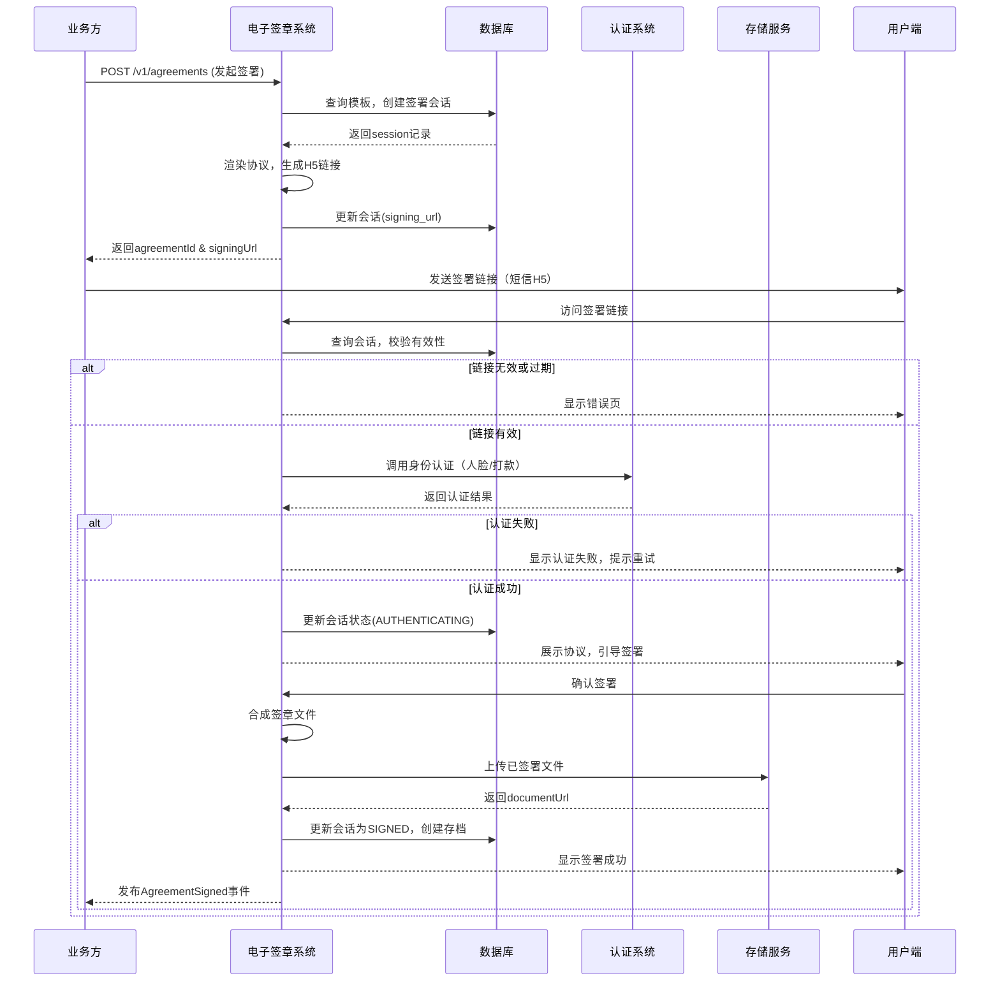

# 模块设计: 电子签章系统

生成时间: 2026-01-23 17:19:02
批判迭代: 2

---

# 电子签章系统设计文档

## 1. 概述
- **目的与范围**: 本模块负责协议模板管理、短信H5封装、调起认证及签署流程，为业务（如关系绑定、开通付款）提供电子协议签署与盖章能力。其边界止于协议签署完成，不涉及协议内容生成与业务逻辑判断。

## 2. 接口设计
- **API端点 (REST/GraphQL)**:
    - `POST /v1/agreements`: 发起协议签署。接收业务方请求，创建签署会话。
    - `GET /v1/agreements/{agreementId}`: 查询协议签署状态及详情。
    - `POST /v1/agreements/{agreementId}/cancel`: 取消进行中的签署流程。
    - `POST /v1/templates`: 上传或更新协议模板（内部管理接口）。
    - `GET /v1/templates/{templateId}`: 获取协议模板内容。
- **请求/响应结构**:
    - 发起签署请求 (`POST /v1/agreements`):
        - 请求体: `{ "templateId": "string", "businessId": "string", "parties": [{"name": "string", "idCard": "string", "mobile": "string", "role": "PAYER/RECEIVER"}], "variables": { "key": "value" } }`
        - 响应体: `{ "agreementId": "string", "signingUrl": "string", "expireAt": "timestamp" }`
    - 查询协议详情 (`GET /v1/agreements/{agreementId}`):
        - 响应体: `{ "agreementId": "string", "status": "PENDING/SIGNED/CANCELLED/EXPIRED", "signedAt": "timestamp", "documentUrl": "string" }`
- **发布/消费的事件**:
    - 发布事件:
        - `AgreementInitiated`: 协议签署流程已发起。
        - `AgreementSigned`: 协议签署成功完成。
        - `AgreementCancelled`: 协议签署被取消或过期。
    - 消费事件: TBD (依赖于上游业务系统的事件，如关系绑定请求已创建)。

## 3. 数据模型
- **表/集合**:
    - `agreement_templates`: 协议模板表。
    - `signing_sessions`: 签署会话表。
    - `signed_agreements`: 已签署协议存档表。
- **关键字段**:
    - `agreement_templates`:
        - `template_id` (主键)
        - `name`: 模板名称。
        - `content`: 模板内容（HTML/PDF模板）。
        - `variables_schema`: 模板变量定义。
        - `status`: 模板状态 (ACTIVE/INACTIVE)。
        - `created_at`, `updated_at`
    - `signing_sessions`:
        - `session_id` (主键)
        - `agreement_id`: 协议唯一标识。
        - `template_id`: 外键关联 `agreement_templates`。
        - `business_id`: 关联的业务ID（如关系绑定ID）。
        - `parties_info`: 签署方信息（JSON）。
        - `variables`: 渲染模板的变量值（JSON）。
        - `status`: 会话状态 (PENDING/AUTHENTICATING/SIGNING/SIGNED/CANCELLED/EXPIRED)。
        - `signing_url`: 短信H5签署链接。
        - `auth_token`: 与认证系统交互的令牌。
        - `expire_at`: 链接过期时间。
        - `created_at`, `updated_at`
    - `signed_agreements`:
        - `agreement_id` (主键)
        - `session_id`: 外键关联 `signing_sessions`。
        - `final_document_url`: 最终签署文件的存储地址。
        - `signatures`: 签署方签名信息（JSON）。
        - `signed_at`
        - `archived_at`
- **与其他模块的关系**:
    - 被**三代**、**行业钱包**等模块调用，以完成协议签署流程（如`关系绑定`、`开通付款`）。通过`business_id`字段与上游业务关联。
    - 依赖**认证系统**进行身份核验，通过`auth_token`关联认证会话。

## 4. 业务逻辑
- **核心工作流/算法**:
    1.  **接收签署请求**: 业务方（如三代、行业钱包）调用`发起协议签署`接口，提供模板ID、签署方信息、业务变量。
    2.  **生成签署会话**: 系统根据`template_id`查询有效模板，校验变量完整性，创建`signing_sessions`记录，生成唯一`agreement_id`。
    3.  **渲染协议与封装H5**: 使用模板内容和变量渲染生成待签署协议预览文件。基于`agreement_id`生成唯一的短信H5链接 (`signing_url`)，链接指向本系统的签署引导页。
    4.  **调起用户认证**: 用户点击链接访问签署页。系统根据签署方身份信息，调用**认证系统**的接口，发起`人脸验证`或`打款验证`。验证通过后，认证系统返回令牌，系统更新会话状态。
    5.  **引导在线签署**: 向用户端展示已渲染的协议文件，提供签署控件。用户确认并完成签署操作。
    6.  **完成签章与存储**: 系统将用户签名信息与协议文件合成，生成最终具有法律效力的已签署文件，上传至文件存储服务。更新`signing_sessions`状态为`SIGNED`，并在`signed_agreements`表中创建存档记录。通知业务方签署完成。
- **业务规则与验证**:
    - 签署方身份有效性由**认证系统**保证，本系统依赖其返回结果。
    - 协议模板必须处于`ACTIVE`状态方可使用。
    - 每个签署会话的H5链接具有时效性（如24小时），超时后状态置为`EXPIRED`。
    - 同一份协议可能涉及多方签署，需所有指定方均完成签署流程方视为最终完成。
- **关键边界情况处理**:
    - **用户中途取消**: 用户可主动取消，或系统在超时后自动取消。会话状态更新为`CANCELLED`或`EXPIRED`，并通知业务方。
    - **认证失败**: 捕获认证系统返回的错误，向用户展示友好提示，允许重试认证（有次数限制）。
    - **网络超时**: 对调用认证系统、存储服务等外部依赖设置超时与重试机制。

## 5. 时序图

## 6. 错误处理
- **预期错误情况与错误码**:
    - `TEMPLATE_NOT_FOUND` (400): 指定的协议模板不存在或未激活。
    - `INVALID_BUSINESS_DATA` (400): 请求中的业务变量缺失或格式错误。
    - `AUTHENTICATION_FAILED` (401): 认证系统返回身份核验失败。
    - `AGREEMENT_EXPIRED` (410): 签署链接已过期。
    - `AGREEMENT_CANCELLED` (409): 签署流程已被取消。
    - `SIGNING_SERVICE_UNAVAILABLE` (503): 系统内部错误或依赖服务不可用。
- **处理策略**:
    - 对用户输入错误（4xx），返回明确错误码与提示，不进行重试。
    - 对依赖服务暂时性失败（如认证系统超时，5xx），根据策略（如最多3次）进行指数退避重试。
    - 在关键状态变更（如生成会话、认证成功、签署完成）时记录详细日志，便于追踪。
    - 支持状态回滚：当签署最终失败（取消、过期）时，确保相关资源（如临时文件）被清理，会话状态准确更新，并通过事件通知业务方。

## 7. 依赖关系
- **上游模块**:
    - **认证系统**: 核心依赖。提供`打款验证`、`人脸验证`等身份核验能力。本系统通过同步接口调用其服务，并依赖其返回结果决定流程走向。
- **下游模块**:
    - **三代**、**行业钱包**: 本模块的主要调用方。在`关系绑定`、`开通付款`等业务流程中，这些模块调用本系统的签署接口，并消费本系统发布的签署完成事件，以推进其后续业务逻辑。
- **外部服务**:
    - 文件存储服务: 用于存储生成的协议文件及最终签署文件。