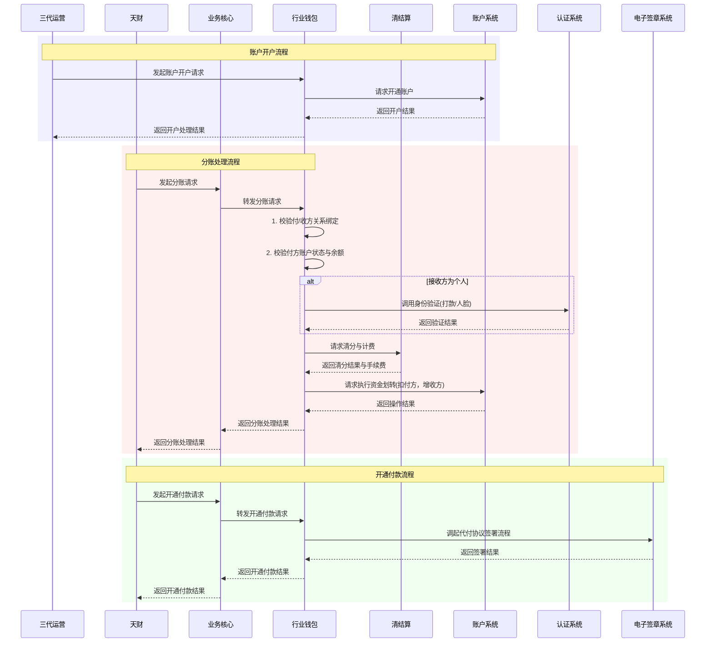

# 模块设计: 行业钱包

生成时间: 2026-01-23 17:18:01
批判迭代: 2

---

# 行业钱包模块设计文档

## 1. 概述
- **目的与范围**: 行业钱包模块是处理用户中心生成、账户开户、关系绑定校验及分账请求的核心业务系统。它作为业务核心与底层账户系统之间的桥梁，负责接收天财平台通过业务核心发起的业务请求（如分账、归集），进行业务逻辑处理、关系校验，并调用清结算、账户系统等下游服务完成资金操作。其边界止于业务请求的受理、校验、路由和结果返回，不直接管理资金账户的底层记账与余额。

## 2. 接口设计
- **API端点 (REST/GraphQL)**: TBD
- **请求/响应结构**: TBD
- **发布/消费的事件**: TBD

## 3. 数据模型
- **表/集合**: TBD
- **关键字段**: TBD
- **与其他模块的关系**: 行业钱包模块依赖清结算系统处理分账清分和手续费计算，依赖账户系统执行账户开户与资金操作，依赖认证系统完成打款验证和人脸验证，依赖电子签章系统完成协议签署。它为业务核心提供分账等业务处理能力。

## 4. 业务逻辑
- **核心工作流/算法**:
    1.  **账户开户**: 接收三代运营的指令，为收单商户（总部、门店）开通天财收款账户，或为非收单商户/个人开通天财接收方账户。
    2.  **关系绑定**: 在发起分账、归集等业务前，校验付方与收方之间是否已建立有效的授权与协议关系。
    3.  **分账处理**: 接收天财通过业务核心转发的分账请求（包括归集、会员结算、批量付款等场景），校验业务规则（如关系、余额），调用清结算进行清分和计费，最终驱动账户系统完成资金划转。
    4.  **开通付款**: 在批量付款或会员结算场景下，引导付方完成代付授权协议的电子签章流程。
- **业务规则与验证**:
    - 分账前必须验证付方与收方已成功绑定关系。
    - 需校验付方天财收款账户的可用余额是否充足。
    - 根据业务场景（净额转账/全额转账）调用计费中台计算手续费。
    - 对个人接收方，需通过认证系统完成打款验证或人脸验证。
- **关键边界情况处理**:
    - 处理清结算或账户系统调用失败时的冲正或补偿逻辑。
    - 处理关系绑定已存在或无效的请求。
    - 处理商户冻结或交易冻结状态下对账户操作的拦截。
- **冲正与补偿逻辑**: 对于下游系统（清结算、账户系统）调用失败，采用基于事务补偿（Saga）的模式。若清分或资金划转步骤失败，将根据已执行的步骤顺序，触发逆向操作进行冲正，并记录补偿日志用于人工对账与干预。
- **幂等性设计**: 所有业务请求（如分账、开户）必须携带由上游系统（业务核心）生成的唯一幂等键。行业钱包在处理请求前，会校验该幂等键是否已存在，若已存在则直接返回之前的处理结果，防止重复请求导致资金错账。
- **超时与重试策略**: 对下游系统（清结算、账户系统、认证系统）的调用设置合理的超时时间。对于非核心校验步骤（如部分查询）失败，采用快速失败策略。对于核心资金操作步骤（如清分、划账）失败，在系统级错误（如网络超时）时，采用指数退避策略进行有限次重试（如最多3次），重试失败后触发补偿流程。

## 5. 时序图

## 6. 错误处理
- **预期错误情况**:
    - 付方与收方关系未绑定或已失效。
    - 付方天财收款账户余额不足。
    - 付方或收方账户被冻结（商户冻结）。
    - 下游系统（清结算、账户系统、认证系统）服务异常或超时。
    - 个人接收方身份验证失败。
    - 重复的幂等键请求。
- **处理策略**:
    - 对于业务规则校验失败（如关系无效、余额不足），立即返回明确的错误码和提示。
    - 对于下游系统调用失败，根据业务重要性决定是否重试，并记录日志用于对账与人工干预。
    - 实现幂等性设计，防止重复请求导致资金错账。
    - 对于核心资金操作失败，启动基于Saga的补偿流程进行冲正。

## 7. 依赖关系
- **上游模块**: 三代运营、业务核心。
- **下游模块**: 清结算（计费中台）、账户系统、账务核心、认证系统、电子签章系统。