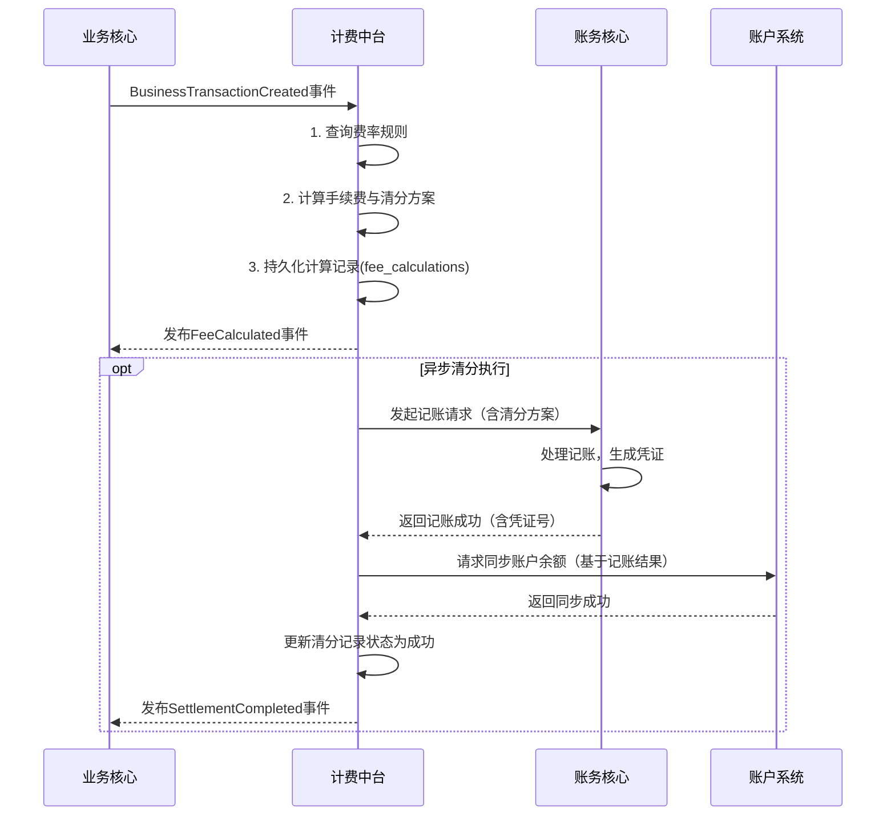

# 模块设计: 计费中台

生成时间: 2026-01-23 17:18:07
批判迭代: 2

---

# 计费中台 模块设计文档

## 1. 概述
- **目的与范围**: 本模块是负责处理转账、分账等业务手续费计算与清分能力的核心系统。其核心职责包括：根据业务规则计算交易手续费，执行资金清分（即确定资金在各参与方账户间的分配），以及向账户系统同步账户信息。它是连接业务核心与底层账户、账务系统的计费枢纽。
- **角色澄清**: 根据术语表，“清结算”与“计费中台”为别名关系，指代同一系统。因此，本模块（计费中台/清结算）是下游模块“账务核心”和“账户系统”的上游，接收来自“业务核心”的请求。

## 2. 接口设计
- **API端点 (REST)**:
    - `POST /api/v1/fee/calculate`: 手续费计算。接收业务请求，返回手续费计算结果及清分方案。
    - `POST /api/v1/settlement/execute`: 清分执行。根据已确定的清分方案，驱动账务核心与账户系统完成资金划转。
- **请求/响应结构**:
    - 计算请求 (`/fee/calculate`):
        - 请求体: `{ “requestId”: “唯一请求ID”, “businessType”: “分账/归集/...”, “amount”: “交易金额”, “payerId”: “付款方ID”, “receiverIds”: [“收款方ID列表”], “feeBearer”: “PAYER/RECEIVER” }`
        - 响应体: `{ “code”: “状态码”, “data”: { “feeAmount”: “手续费金额”, “netAmount”: “净额”, “splitDetails”: [ {“partyId”: “参与方ID”, “amount”: “应分得金额”} ] } }`
    - 执行请求 (`/settlement/execute`):
        - 请求体: `{ “settlementId”: “清分执行ID”, “calculationResult”: “计算接口返回的完整结果” }`
        - 响应体: `{ “code”: “状态码”, “data”: { “settlementStatus”: “SUCCESS/FAILED”, “accountingVoucherNo”: “记账凭证号” } }`
- **发布/消费的事件**:
    - 消费: `BusinessTransactionCreated` (来自业务核心，包含原始交易数据)。
    - 发布: `FeeCalculated` (手续费计算完成事件)，`SettlementCompleted` (清分完成事件)。

## 3. 数据模型
- **表/集合**:
    - `fee_rules`: 费率规则表。存储不同业务类型、参与方、生效时间下的计费规则。
    - `fee_calculations`: 手续费计算记录表。存储每次计算请求的输入、输出及规则快照。
    - `settlement_records`: 清分执行记录表。存储每次清分执行的请求、结果及状态。
    - `settlement_detail`: 清分明细表。记录一次清分中各参与方的资金分配明细。
- **关键字段**:
    - `fee_rules`: `id`, `business_type`, `payer_type`, `receiver_type`, `fee_rate`, `fee_fixed`, `calc_mode` (`NET`/`GROSS`), `effective_from`, `effective_to`, `version`
    - `fee_calculations`: `id`, `request_id`, `business_type`, `original_amount`, `fee_amount`, `net_amount`, `rule_applied_id`, `calc_result_snapshot`, `created_at`
    - `settlement_records`: `id`, `settlement_id`, `calculation_id`, `status`, `accounting_voucher_no`, `initiated_at`, `completed_at`
    - `settlement_detail`: `id`, `settlement_id`, `party_id`, `party_role`, `account_id`, `amount`, `direction` (`CREDIT`/`DEBIT`)
- **与其他模块的关系**: 本模块需要与**账户系统**交互以同步账户信息，与**账务核心**交互以完成记账，并与**业务核心**交互以获取待计费的交易数据。`settlement_detail` 表中的 `account_id` 关联至账户系统的账户实体。

## 4. 业务逻辑
- **核心工作流/算法**:
    1.  **触发**: 接收来自业务核心的分账或转账请求（事件或API调用）。
    2.  **计算手续费**:
        a. 根据请求中的业务类型、参与方等信息，查询 `fee_rules` 表获取当前生效的费率规则。
        b. 若规则缺失，采用默认策略（如：费率为零，并记录告警）。
        c. 根据规则中的 `calc_mode`（净额NET/全额GROSS）及 `feeBearer`（承担方），计算手续费金额及各方应收/应付净额。
        d. 生成资金清分方案，明确各参与方（付款方、收款方、平台方等）的借记或贷记金额。
        e. 将计算过程与结果持久化至 `fee_calculations` 表。
    3.  **执行清分**:
        a. 调用账务核心，根据清分方案发起一笔复合记账请求，包含本金与手续费的分录。
        b. 账务核心记账成功后，计费中台接收凭证号。
        c. 计费中台调用账户系统，根据记账结果同步更新相关账户的余额。
        d. 将清分执行状态与结果持久化至 `settlement_records` 与 `settlement_detail` 表。
- **业务规则与验证**:
    - 规则匹配：支持按业务类型、参与方身份、生效时间进行精确匹配，支持版本管理。
    - 计算验证：确保手续费计算符合 `calc_mode`（净额=原额-手续费，全额=原额），且各方金额总和平衡。
    - 承担方逻辑：手续费承担方 (`feeBearer`) 由业务请求明确指定（PAYER 或 RECEIVER），计算时据此决定从哪一方扣除手续费。
- **关键边界情况处理**:
    - **规则缺失**: 启用默认计费规则（零费率），并触发告警通知运营人员。
    - **精度与舍入**: 金额计算使用高精度小数，最终结果按系统最小单位（如分）四舍五入，差额由平台方承担或吸收。
    - **幂等性**: 通过 `request_id` 和 `settlement_id` 保证计算与清分操作的幂等性，避免重复处理。
    - **数据一致性**: 清分执行采用“记账成功后再更新账户”的严格顺序。若账户更新失败，需有补偿机制（如冲正交易）或标记为异常，由对账系统后续处理。

## 5. 时序图

## 6. 错误处理
- **预期错误情况**:
    1.  规则配置错误或缺失。
    2.  手续费计算服务异常（如除零、溢出）。
    3.  依赖服务异常：账务核心或账户系统服务不可用、超时。
    4.  记账失败（如账户状态异常、余额不足）。
    5.  账户信息同步失败。
- **处理策略**:
    - **配置/计算错误**: 记录错误告警，使用安全默认值（零费率）继续流程，或直接失败并返回明确错误码。
    - **外部依赖异常**: 采用指数退避策略进行重试。若最终失败，将交易标记为“清分失败”，状态持久化，并触发告警，后续由人工或定时任务进行核对与处理。
    - **一致性保障**: 若账务核心记账成功但账户系统同步失败，将清分记录标记为“待同步”，由补偿作业定期尝试同步或发起冲正。

## 7. 依赖关系
- **上游模块**: **业务核心**（提供待计费的原始交易数据）。
- **下游模块**: **账务核心**（执行记账操作）、**账户系统**（更新账户余额）。
- **数据流澄清**: 业务核心处理来自“天财”的请求后，将标准化的交易数据传递给计费中台进行计费与清分。计费中台不直接与“天财”交互。