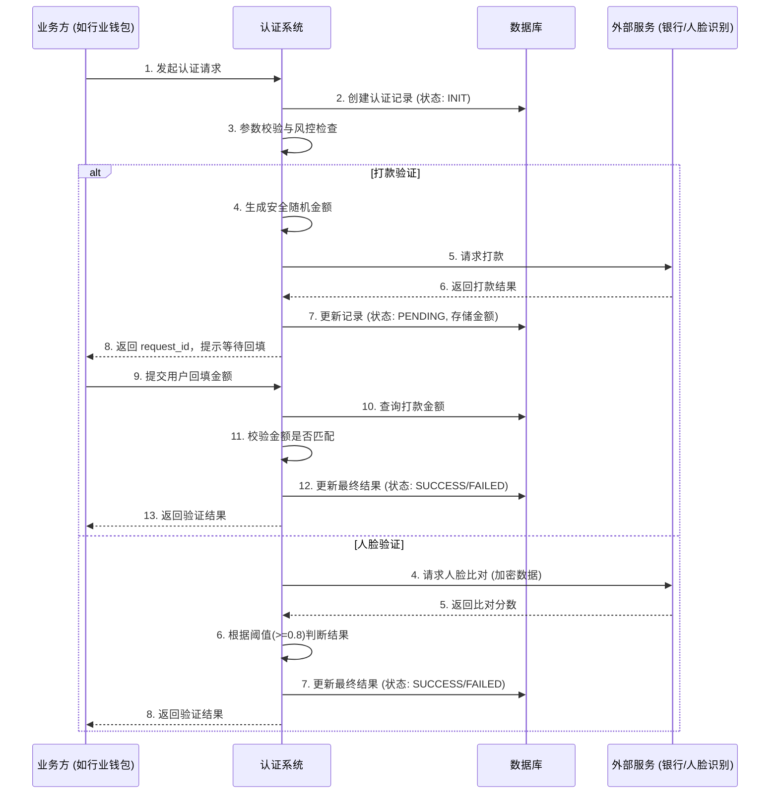

# 模块设计: 认证系统

生成时间: 2026-01-23 17:18:10
批判迭代: 2

---

# 认证系统设计文档

## 1. 概述
- **目的与范围**：本模块是提供身份核验能力的公共服务模块。其核心职责是为上游业务（如关系绑定、开通付款等）提供打款验证、人脸验证等认证能力。其边界限定于认证能力的提供与验证结果的返回，不涉及具体的业务流程编排或账户操作。
- **主要调用方澄清**：根据术语表，本模块的验证结果是**行业钱包**进行关系绑定的前置条件之一。同时，**电子签章系统**在调起签署流程前也可能调用本模块进行身份认证。因此，本模块是一个被多个上游业务系统调用的公共服务。

## 2. 接口设计
- **API端点 (REST)**：
    - `POST /api/v1/authentication/payment`：发起打款验证。
    - `POST /api/v1/authentication/face`：发起人脸验证。
    - `GET /api/v1/authentication/result/{request_id}`：查询认证结果。
- **请求/响应结构**：
    - **打款验证请求**：
        - 请求体：`{“type”: “PAYMENT”, “user_name”: “张三”, “id_card”: “110101199003077XXX”, “bank_card_no”: “6228480012345678900”, “bank_name”: “中国农业银行”}`
        - 响应体：`{“request_id”: “req_123456”, “status”: “PENDING”, “message”: “打款已发起，请等待回填”}`
    - **人脸验证请求**：
        - 请求体：`{“type”: “FACE”, “user_name”: “李四”, “id_card”: “110101199003078XXX”, “face_image_data”: “Base64EncodedString”}`
        - 响应体：`{“request_id”: “req_123457”, “status”: “PROCESSING”, “message”: “验证处理中”}`
    - **查询结果响应**：
        - 响应体：`{“request_id”: “req_123456”, “type”: “PAYMENT”, “status”: “SUCCESS/FAILED”, “result_detail”: {…}, “created_at”: “2023-10-01T10:00:00Z”}`
- **发布/消费的事件**：
    - 消费事件：TBD（例如，接收来自上游系统的认证触发指令）。
    - 发布事件：`AuthenticationCompleted`（事件体包含 `request_id`, `user_id`, `auth_type`, `result`, `timestamp`），供上游业务系统订阅。

## 3. 数据模型
- **表/集合**：`authentication_request`
- **关键字段**：
    - `id`：主键，认证请求唯一ID。
    - `auth_type`：认证类型（PAYMENT, FACE）。
    - `user_info`：JSON字段，存储姓名、证件号、银行卡号等用户信息。
    - `status`：状态（INIT, PENDING, PROCESSING, SUCCESS, FAILED, EXPIRED）。
    - `external_ref_id`：外部服务流水号（如银行打款流水、人脸识别请求ID）。
    - `auth_result`：JSON字段，存储验证结果详情（如比对分数、打款金额）。
    - `expiry_time`：验证有效期（针对打款验证）。
    - `retry_count`：重试次数。
    - `created_at` / `updated_at`：创建和更新时间。
- **与其他模块的关系**：本模块被**电子签章系统**调用以完成签署前的身份核验。本模块的验证结果是**行业钱包**进行关系绑定的前置条件之一。本模块与上游是松耦合的服务调用关系。

## 4. 业务逻辑
- **核心工作流/算法**：
    1. **打款验证**：
        - 接收包含银行卡信息的请求。
        - **随机金额生成**：生成一个随机小数金额（如0.01-0.99元），并记录到数据库。
        - 调用外部银行通道服务，向指定银行卡打入该随机金额。
        - 将请求状态置为`PENDING`，并设置有效期（如10分钟）。
        - 等待用户通过上游业务系统回填金额。
        - 验证回填金额与打款金额是否一致（允许微小误差）。
    2. **人脸验证**：
        - 接收姓名、身份证号和人脸图像数据。
        - 将数据加密后，调用外部生物识别服务进行1:1比对。
        - 接收比对服务返回的相似度分数。
        - **阈值判断逻辑**：若分数大于或等于预设阈值（如0.8），则判定为验证成功；否则为失败。
- **业务规则与验证**：
    - 验证请求必须包含必要的身份信息（如姓名、证件号、银行卡号等），缺失则拒绝。
    - 打款验证需确保打款金额的随机性和安全性（使用加密安全的随机数生成器），并设置合理的验证有效期（如10分钟），过期后状态自动更新为`EXPIRED`。
    - 人脸验证需确保数据在传输和存储过程中加密，并符合相关隐私与合规要求，人脸数据在验证完成后的一段短时间（如24小时）后自动清除。
- **关键边界情况处理**：
    - **外部服务不可用**：实现熔断器模式（如连续失败5次则熔断），并具备降级策略（如返回“服务暂不可用”提示，引导使用其他验证方式或稍后重试）。
    - **重试机制**：对于可重试的临时性外部服务失败（如网络超时），采用指数退避策略进行最多3次重试，并更新`retry_count`。
    - **用户多次失败**：同一用户（根据证件号或银行卡号）在短时间内（如1小时）连续验证失败超过5次，则临时锁定该用户的验证功能24小时。
    - **验证请求超时**：对于长时间无响应的异步验证（如用户未回填金额），由定时任务扫描过期请求，将状态更新为`EXPIRED`。

## 5. 时序图

## 6. 错误处理
- **预期错误情况**：
    - `ERR_4001`: 输入参数缺失或格式错误。
    - `ERR_5001`: 外部服务调用失败、超时或返回异常。
    - `ERR_6001`: 验证失败（金额不符、人脸比对分数不足）。
    - `ERR_6002`: 验证请求已过期。
    - `ERR_7001`: 用户验证功能被临时锁定。
    - `ERR_9001`: 系统内部错误（数据库连接失败等）。
- **处理策略**：
    - 对`ERR_4001`类错误，立即返回错误码和明确的提示信息，不进行后续处理。
    - 对`ERR_5001`类错误，触发重试机制（最多3次），若最终失败，则记录错误日志，更新请求状态为`FAILED`，并向上游返回“认证服务暂时不可用”。
    - 对`ERR_6001`、`ERR_6002`、`ERR_7001`类业务性失败，正常更新请求状态为`FAILED`，并返回具体的业务错误码，由上游业务决定后续流程（如提示用户、允许重试）。
    - 对`ERR_9001`类系统内部错误，记录告警并通知运维，向上游返回“系统内部错误”通用提示。

## 7. 依赖关系
- **上游模块/调用方**：**行业钱包**（用于关系绑定前的身份核验）、**电子签章系统**（用于签署前的身份核验）。
- **下游服务/外部依赖**：
    - 外部银行通道服务（用于执行打款）。
    - 外部人脸识别服务（用于执行人脸比对）。
    - 内部数据库（用于存储认证记录）。
- **注意事项**：本模块需监控下游外部服务的可用性与性能，并实现相应的熔断和降级策略，以确保核心认证功能的稳定性。