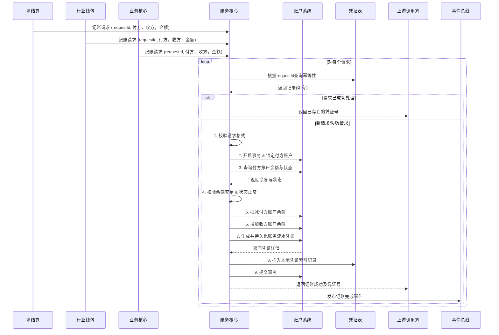

# 模块设计: 账务核心

生成时间: 2026-01-23 17:17:31
批判迭代: 2

---

# 账务核心模块设计文档

## 1. 概述
- **目的与范围**: 账务核心模块是负责执行记账、生成凭证、更新账务的系统。它是资金流转的底层执行单元，接收来自上游系统的记账指令，确保账户余额、流水等账务数据的准确性和一致性。其边界在于处理记账请求本身，不涉及业务逻辑判断、风控或协议签署等前置流程。该模块与**账户系统**为独立的服务，通过内部接口进行交互。

## 2. 接口设计
- **API端点 (REST/GraphQL)**: 提供 RESTful API。
    - `POST /api/v1/accounting/entry`: 执行单笔记账。
    - `POST /api/v1/accounting/batch-entry`: 执行批量记账。
- **请求/响应结构**:
    - 记账请求体 (`AccountingRequest`):
        - `requestId`: `String` (必填，幂等键)
        - `payerAccountNo`: `String` (必填，付方账户号)
        - `receiverAccountNo`: `String` (必填，收方账户号)
        - `amount`: `BigDecimal` (必填，金额，单位：元)
        - `bizType`: `String` (必填，业务类型，如 “分账”、“归集”)
        - `bizRefNo`: `String` (必填，业务参考号)
        - `remark`: `String` (可选，备注)
    - 成功响应体 (`AccountingResponse`):
        - `success`: `Boolean`
        - `voucherNo`: `String` (生成的账务凭证号)
        - `timestamp`: `Long`
- **发布/消费的事件**:
    - 消费事件: TBD (例如，监听来自清结算的记账指令消息)
    - 发布事件: `AccountingCompletedEvent` (记账完成事件)，包含凭证号、业务类型、金额、账户信息等。

## 3. 数据模型
- **表/集合**: 账务核心模块主要操作**账户系统**的数据，自身维护记账请求日志与凭证索引。
    - `accounting_voucher` (账务凭证索引表):
        - `voucher_no`: `String` (主键，凭证号)
        - `request_id`: `String` (唯一索引，幂等键)
        - `biz_type`: `String`
        - `biz_ref_no`: `String`
        - `payer_account_no`: `String`
        - `receiver_account_no`: `String`
        - `amount`: `Decimal`
        - `status`: `String` (状态，如 “SUCCESS”, “FAILED”)
        - `created_at`: `Timestamp`
- **关键字段**: 见上表。
- **与其他模块的关系**: 账务核心模块通过内部API调用**账户系统**，操作其账户余额与流水数据。它接收来自**清结算**、**行业钱包**、**业务核心**等系统的记账指令。

## 4. 业务逻辑
- **核心工作流/算法**:
    1.  **接收与校验**: 接收记账请求，校验请求格式、必填字段。
    2.  **幂等检查**: 根据 `requestId` 查询本地凭证索引表，若已存在成功记录，则直接返回历史凭证号。
    3.  **事务与锁管理**: 开启数据库事务。通过**账户系统**接口锁定付方账户（如使用数据库行锁或分布式锁）。
    4.  **余额校验**: 调用**账户系统**查询付方账户可用余额，校验是否充足。
    5.  **执行记账**:
        - 调用**账户系统**扣减付方账户余额。
        - 调用**账户系统**增加收方账户余额。
        - 调用**账户系统**生成并持久化账务流水凭证。
    6.  **记录与提交**: 在本地 `accounting_voucher` 表中插入成功记录。提交事务。
    7.  **发布事件**: 发布记账完成事件。
- **业务规则与验证**: 验证记账请求的格式有效性；在执行扣减操作前，校验付方账户的可用余额是否充足；校验账户状态是否正常（非冻结）。
- **并发控制**: 通过**账户系统**提供的账户锁定机制（如基于账户号的悲观锁）确保同一账户的并发操作串行化，防止超扣。结合请求幂等键 (`requestId`) 防止重复请求。
- **关键边界情况处理**: 处理并发记账请求，通过锁机制确保数据一致性；处理记账过程中系统故障，通过数据库事务确保原子性，失败则回滚所有操作。

## 5. 时序图

## 6. 错误处理
- **预期错误情况**:
    1.  请求参数错误（格式、必填项缺失）。
    2.  幂等键冲突但历史状态为失败（需人工介入）。
    3.  付方账户余额不足。
    4.  账户状态异常（如被冻结）。
    5.  **账户系统**服务调用失败或超时。
    6.  数据库操作失败（唯一键冲突、连接异常）。
    7.  系统内部异常（网络、内存等）。
- **处理策略**:
    - **业务校验错误** (1, 3, 4): 立即返回明确的业务错误码和消息，不进行事务操作。
    - **外部依赖失败** (5): 记录详细日志，进行事务回滚，向上游返回“系统繁忙”或“依赖服务异常”错误，支持重试。
    - **系统内部错误** (6, 7): 记录详细日志，进行事务回滚，向上游返回系统错误，告警通知。
    - **幂等性处理**: 对于`requestId`对应的历史失败记录，返回特定错误码，提示上游检查或使用新`requestId`重试。

## 7. 依赖关系
- **上游模块 (调用方)**: **清结算**、**行业钱包**、**业务核心**。这些模块发起记账请求，是账务核心的服务消费者。
- **下游模块 (被依赖方)**: **账户系统**。账务核心依赖其提供的账户操作API（查询、扣减、增加、生成流水）来完成核心记账功能。**账户系统**是账务核心的服务提供者。

## 8. 部署与运维考量
- **可扩展性**: 服务无状态设计，可通过水平扩展实例应对高并发记账请求。数据库（凭证索引表）需考虑分库分表策略，例如按 `voucher_no` 或 `created_at` 进行分片。
- **监控指标**:
    - 业务指标: 记账请求TPS、成功率、平均耗时、各业务类型分布。
    - 系统指标: API接口P99延迟、错误率、数据库连接池状态。
    - 关键业务告警: 记账失败率突增、余额不足错误频发、与账户系统调用超时。
- **容灾与恢复**: 依赖的**账户系统**需具备高可用性。本地凭证索引表需定期备份。制定事务失败、数据不一致的核对与修复流程。