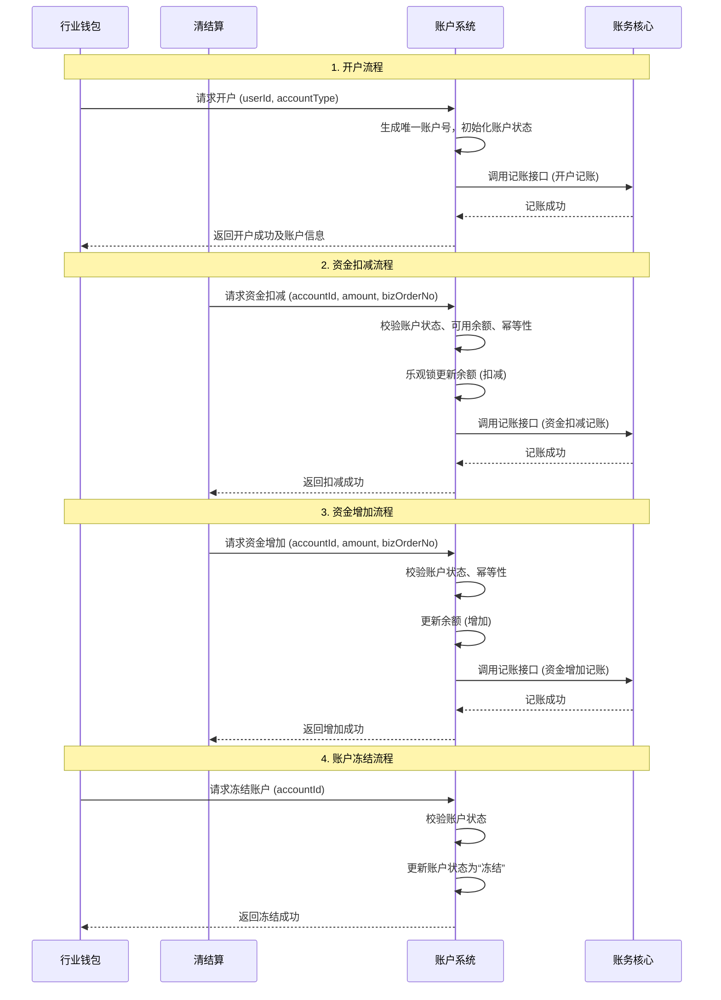

# 模块设计: 账户系统

生成时间: 2026-01-23 17:17:19
批判迭代: 2

---

# 账户系统设计文档

## 1. 概述
- **目的与范围**：账户系统是底层负责账户开户、冻结、资金扣减/增加、余额管理等核心功能的系统。它为上层业务（如行业钱包、清结算）提供基础的账户操作能力，确保资金操作的原子性和一致性。

## 2. 接口设计
- **API端点 (REST/GraphQL)**：
    - `POST /api/v1/accounts`：创建账户（开户）。
    - `PATCH /api/v1/accounts/{accountId}/status`：更新账户状态（如冻结/解冻）。
    - `POST /api/v1/accounts/{accountId}/debit`：执行资金扣减。
    - `POST /api/v1/accounts/{accountId}/credit`：执行资金增加。
    - `GET /api/v1/accounts/{accountId}/balance`：查询账户余额。
- **请求/响应结构**：
    - 通用响应结构：`{“code”: “string”, “msg”: “string”, “data”: object, “traceId”: “string”}`。
    - 创建账户请求：`{“userId”: “string”, “accountType”: “string”, “currency”: “string”}`。
    - 资金操作请求：`{“amount”: “BigDecimal”, “bizOrderNo”: “string”, “remark”: “string”}`。
- **发布/消费的事件**：
    - 发布事件：`AccountCreatedEvent`、`AccountFrozenEvent`、`AccountUnfrozenEvent`、`AccountBalanceChangedEvent`。
    - 消费事件：TBD。

## 3. 数据模型
- **表/集合**：
    - `account`：账户主表。
    - `account_balance`：账户余额表。
    - `account_transaction_log`：账户交易流水表。
- **关键字段**：
    - `account`：`id`（主键），`account_no`（账户号），`user_id`，`account_type`，`status`（状态：正常/冻结/销户），`currency`，`create_time`。
    - `account_balance`：`id`（主键），`account_id`，`balance`（余额），`available_balance`（可用余额），`frozen_balance`（冻结余额），`version`（版本号，用于乐观锁）。
    - `account_transaction_log`：`id`（主键），`account_id`，`biz_order_no`（业务订单号），`change_amount`（变动金额），`balance_after`（变动后余额），`transaction_type`（交易类型：DEBIT/CREDIT），`create_time`。
- **与其他模块的关系**：账户系统为行业钱包、清结算、账务核心等模块提供账户数据支撑和操作接口。

## 4. 业务逻辑
- **核心工作流/算法**：主要业务流程包括账户开户、账户冻结/解冻、资金扣减、资金增加、余额查询。
- **业务规则与验证**：
    1.  执行资金操作时需校验账户状态（如是否冻结）。
    2.  执行扣减操作时需校验可用余额是否充足。
    3.  账户号生成需保证全局唯一性。
- **关键边界情况处理**：
    1.  **并发控制**：采用乐观锁机制处理并发扣款。在`account_balance`表中使用`version`字段，更新余额时校验版本号，若不一致则操作失败并提示重试。
    2.  **幂等性**：所有资金操作需基于唯一的业务订单号（`biz_order_no`）保证幂等，防止重复处理。
    3.  **事务一致性**：涉及余额更新与流水记录的操作必须在同一数据库事务内完成。

## 5. 时序图

## 6. 错误处理
- **预期错误情况**：账户不存在、账户已冻结、余额不足、重复请求（幂等冲突）、系统内部错误、乐观锁版本冲突。
- **处理策略**：
    1.  对于业务错误（如余额不足、账户冻结）返回明确的错误码和提示信息。
    2.  对于幂等冲突，直接返回之前的成功结果。
    3.  对于乐观锁版本冲突，返回特定错误码，建议调用方重试。
    4.  对于系统错误进行详细的日志记录、告警，并根据错误类型触发自动重试或人工介入流程。

## 7. 依赖关系
- **上游模块（调用方）**：行业钱包、清结算、账务核心。
- **下游模块（被调用方）**：账务核心。