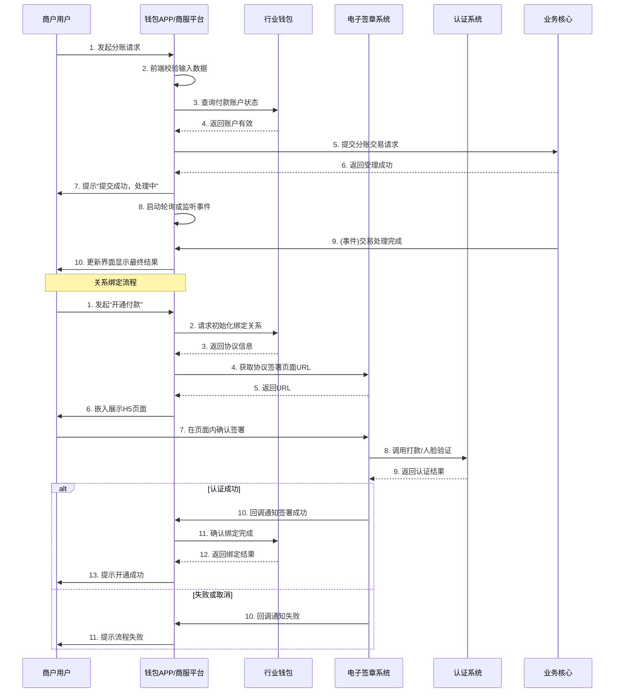

# 模块设计: 钱包APP/商服平台

生成时间: 2026-01-23 17:19:08
批判迭代: 2

---

# 钱包APP/商服平台 模块设计文档

## 1. 概述
- **目的与范围**：本模块是面向商户（总部、门店）和接收方（非收单商户或个人）的客户端应用平台。其核心职责是**编排用户工作流**，为用户提供账户管理、交易操作、协议签署、认证流程及业务查询等功能的交互界面。它作为用户与后端核心业务系统之间的桥梁，负责发起业务请求、处理用户输入、管理本地状态，并将核心的业务逻辑（如资金处理、账户管理、协议持久化）委托给对应的后端系统（如行业钱包、业务核心、电子签章系统）执行。

## 2. 接口设计
- **API端点 (REST/GraphQL)**：本模块作为前端应用，主要通过调用后端服务提供的RESTful API进行交互。关键接口包括：
    - **用户认证与会话**：`POST /api/auth/login`， `POST /api/auth/refresh-token`。
    - **账户信息查询**：`GET /api/accounts/{accountId}`， `GET /api/accounts/list`。
    - **关系绑定流程**：`POST /api/relationship/initiate` (发起绑定)， `GET /api/relationship/status/{requestId}` (查询状态)。
    - **交易发起**：`POST /api/transactions/split` (发起分账)， `POST /api/transactions/batch-payment` (发起批量付款)。
    - **协议签署**：`GET /api/agreement/url` (获取电子签章H5页面URL)， `POST /api/agreement/callback` (接收签署结果回调)。
    - **交易记录查询**：`GET /api/transactions/history`。
- **请求/响应结构**：请求体通常包含业务参数（如金额、收款方账户ID、业务类型）和用户会话令牌。响应体为标准JSON格式，包含`code`、`message`、`data`字段。`data`字段的结构根据接口定义。
- **发布/消费的事件**：本模块主要消费后端系统推送的事件，例如：
    - **协议签署完成事件**：来自电子签章系统，用于更新本地绑定流程状态。
    - **交易状态变更事件**：来自业务核心或行业钱包，用于刷新交易列表和详情页状态。
    - **账户状态变更事件**：用于提示用户账户冻结、解冻等信息。

## 3. 数据模型
本模块的数据模型主要用于**本地状态管理、离线草稿和界面展示**，不持久化核心业务实体。核心业务数据（如账户、交易、协议）的“唯一事实来源”是对应的后端系统。
- **表/集合**：
    - **用户会话缓存**：存储当前用户的认证令牌、刷新令牌、用户基础信息（如用户ID、名称、所属机构号）。
    - **流程草稿箱**：存储用户未提交的复杂操作草稿（如正在填写的分账表单、批量付款文件），包含表单数据、创建时间等。
    - **本地消息与通知**：存储推送给用户的未读消息、交易状态变更通知等。
    - **界面配置与偏好**：存储用户的个性化设置，如默认手续费模式、常用收款方列表（仅本地引用ID）、列表排序偏好。
- **关键字段**：
    - 流程草稿箱表：`draft_id` (本地唯一ID)， `user_id`， `biz_type` (业务类型，如“分账”、“批量付款”)， `form_data` (JSON格式的表单内容)， `created_at`， `updated_at`。
    - 本地消息表：`message_id`， `user_id`， `title`， `content`， `related_biz_id` (关联的业务ID)， `type` (通知类型)， `is_read`， `created_at`。
- **与其他模块的关系**：本地数据模型中的业务实体ID（如`account_id`, `transaction_id`）是引用自后端系统（如行业钱包、业务核心）的只读外键。通过定时同步或事件驱动的方式，更新本地缓存中这些实体的**展示状态**（如账户余额、交易状态）。

## 4. 业务逻辑
- **核心工作流/算法**：
    1.  **关系绑定/开通付款工作流**：
        - 用户发起绑定请求，模块调用行业钱包接口获取协议模板信息。
        - 引导用户进入电子协议签署流程：调用电子签章系统接口获取签署H5页面URL并嵌入展示。
        - 监听电子签章系统的回调，接收签署结果（成功/失败/取消）。
        - 若签署成功，调用行业钱包接口确认关系绑定完成，并更新本地用户界面状态。
    2.  **分账/归集/批量付款发起工作流**：
        - 接收用户输入，进行前端格式、必填项、金额范围等基础校验。
        - 根据业务类型组装请求参数（如付款账户、收款方列表、金额、手续费承担方）。
        - 调用业务核心或行业钱包的相应接口提交交易请求。
        - 处理响应，展示提交结果，并启动轮询或监听事件以获取最终交易状态。
    3.  **离线草稿与恢复机制**：
        - 在用户填写复杂表单时，自动或手动将当前进度保存至本地草稿箱。
        - 用户再次进入应用时，可查看并继续编辑未提交的草稿。
        - 网络恢复后，引导用户提交草稿。
- **业务规则与验证**：
    - 前端对交易金额（需大于0）、收款方账户ID格式、批量付款文件格式进行校验。
    - 根据业务类型（分账、归集、批量付款）动态渲染不同的输入表单和校验规则。
    - 在发起任何涉及资金或协议的操作前，验证本地会话有效性，必要时引导重新登录。
- **安全与状态管理**：
    - **令牌管理**：安全存储`access_token`与`refresh_token`，实现静默刷新逻辑。
    - **敏感数据**：不在本地持久化明文密码、银行卡号等敏感信息。对于临时输入，使用安全存储区域（如iOS Keychain/Android Keystore）进行短暂缓存。
    - **会话管理**：实现自动登出机制（如令牌过期、长时间无操作）。
- **关键边界情况处理**：
    - **网络异常**：提供操作重试按钮，对于创建类请求（如发起交易），若不确定后端状态，需先查询确认后再决定重试或新建。
    - **后端业务错误**：解析后端返回的错误码，映射为具体的用户操作指引（如“余额不足”提示充值，“关系未绑定”引导去开通）。
    - **流程中断**：在电子签章或认证流程中，处理用户取消或中途退出的情况，清理临时状态并记录中断点。

## 5. 时序图

## 6. 错误处理
- **预期错误情况**：
    - **网络层**：连接超时、断开、服务器无响应。
    - **应用层**：HTTP 4xx/5xx 错误，后端服务不可用。
    - **业务层**：余额不足、账户已冻结、收款方无效、关系未绑定、重复交易。
    - **用户层**：输入格式错误、必填项缺失、批量文件解析失败。
    - **第三方服务**：电子签章系统调用失败、认证服务不可用。
- **处理策略**：
    - **网络与应用层错误**：展示友好的“网络异常”提示，提供全局重试按钮。记录错误日志。
    - **业务错误**：解析后端返回的特定错误码和消息，直接展示给用户，并提供明确的下一步操作建议（如“余额不足，请充值”）。
    - **用户输入错误**：在表单提交前进行实时校验并给出即时反馈。
    - **复杂流程中断**：对于协议签署等流程，保存中断状态，允许用户从断点处继续或重新开始。
    - **降级方案**：当非核心功能（如个性化设置同步）失败时，不影响核心业务流程，仅记录日志。

## 7. 依赖关系
- **上游模块（本模块依赖它们）**：
    - **行业钱包**：核心依赖。用于账户查询、关系绑定初始化与确认、部分交易指令转发。
    - **业务核心**：核心依赖。用于接收和处理分账、归集、批量付款等交易请求。
    - **电子签章系统**：核心依赖。用于获取协议签署页面并接收签署结果回调。
    - **认证系统**：间接依赖（通过电子签章系统）。用于完成身份核验。
    - **清结算/对账单系统**：功能依赖。用于查询交易明细、下载对账单。
    - **计费中台**：功能依赖。用于在发起交易前试算手续费。
- **下游模块（依赖本模块的模块）**：
    - **无**。本模块作为面向用户的客户端，其提供的服务通过用户界面体现，不被其他后端服务模块直接调用。