# DocuFlow-AI Project - 软件设计文档
生成时间: 2026-01-23 17:24:53

## 目录
1. [概述说明](#1-概述说明)
   - 1.1 [术语与缩略词](#11-术语与缩略词)
2. [系统设计](#2-系统设计)
3. [模块设计](#3-模块设计)
   - 3.1 [天财](#module-1)
   - 3.2 [三代](#module-2)
   - 3.3 [行业钱包](#module-3)
   - 3.4 [清结算](#module-4)
   - 3.5 [账户系统](#module-5)
   - 3.6 [账务核心](#module-6)
   - 3.7 [电子签约平台](#module-7)
   - 3.8 [计费中台](#module-8)
   - 3.9 [对账单系统](#module-9)
   - 3.10 [业务核心](#module-10)
   - 3.11 [认证系统](#module-11)
   - 3.12 [交易系统](#module-12)
   - 3.13 [代付系统](#module-13)
   - 3.14 [风控](#module-14)
4. [接口设计](#4-接口设计)
5. [数据库设计](#5-数据库设计)

---
# 1 概述说明

## 1.1 术语与缩略词


## 业务实体

- **天财**: 提出分账、会员结算、批量付款需求的业务平台，负责发起开户、分账等指令。
- **天财收款账户** (别名: 天财专用账户): 为收单商户开立的专用账户，用于收款、分账、转账和提现，分为总部和门店角色。
- **天财接收方账户** (别名: 接收方账户): 为非收单商户或个人开立的专用账户，主要用于接收分账资金和提现。
- **总部** (别名: 品牌店, 总店): 收单商户中的上级主体，通常为品牌或企业，负责归集门店资金并进行分账或批量付款。
- **门店**: 收单商户中的下级主体，隶属于某个总部，资金可被归集或接收分账。
- **收单商户** (别名: 拉卡拉收单商户): 具备企业或个体资质，已开通收单业务的商户，可开立天财收款账户。
- **非收单商户** (别名: 一般接收方): 未开通收单业务的企业、个体或个人，只能开立天财接收方账户。
- **机构号**: 由三代运营分配给天财下各总部或门店的唯一标识，用于区分不同业务主体。
- **待结算账户** (别名: 01待结算账户): 账户类型之一，用于暂存未结算的交易资金，编号通常为01。
- **退货账户** (别名: 04退货账户): 账户类型之一，用于处理退货资金，编号通常为04。

## 系统角色/参与者

- **三代**: 负责商户入网审核、机构号管理、调用钱包系统开户及关系绑定的系统或运营方。
- **行业钱包** (别名: 钱包系统): 负责处理账户开户、关系绑定、分账请求校验、计费及数据同步的核心业务系统。
- **清结算** (别名: 清结算系统): 负责交易清分、结算、手续费处理、账户冻结及提供对账单数据的系统。
- **账户系统** (别名: 账户域): 底层账户服务，负责账户开立、升级、余额扣减/增加、冻结及标记账户类型。
- **账务核心** (别名: 账务): 负责记账、冲正、回滚等账务处理的系统。
- **电子签约平台** (别名: 电子签章系统): 负责生成电子协议、发送短信、调用认证接口并留存全证据链数据的系统。
- **计费中台** (别名: 计费系统): 负责生成计费流水、计算并扣除转账手续费的系统。
- **对账单系统**: 负责生成并提供各类账户和交易维度对账单的系统。
- **业务核心**: 接收并处理天财分账交易数据的系统。
- **认证系统**: 提供打款验证和人脸验证接口，进行身份核验的系统。

## 技术术语

- **APPID**: 由ISV或开放平台分配的应用标识，与三代机构号对应。
- **主动结算**: 结算模式之一，由系统自动将资金结算至指定的收款账户（如天财收款账户）。
- **被动结算**: 结算模式之一，结算路径由外部指定，非系统自动处理。

## 流程/工作流名称

- **归集** (别名: 资金归集): 业务场景之一，指将门店的资金汇总到总部的天财收款账户中。
- **会员结算**: 业务场景之一，指将用户支付给总部的资金，按规则分账给各门店。
- **批量付款** (别名: 批付): 业务场景之一，指总部向其绑定的多个收款方（如供应商）进行批量打款。
- **分账** (别名: 天财分账): 从天财收款账户向其他绑定的天财收款账户或天财接收方账户转账的资金处理操作。
- **关系绑定** (别名: 绑定关系): 在总部与门店、或付款方与接收方之间建立授权关系的过程，通常涉及签约与认证。
- **开通付款**: 在批量付款和会员结算场景下，付方（总部/门店）需要额外完成的授权签约流程。
- **打款验证**: 认证方式之一，通过向目标银行卡打入随机金额，验证回填金额是否正确以确认账户归属。
- **人脸验证**: 认证方式之一，通过比对姓名、身份证和人脸信息，确认个人身份的一致性。
- **交易冻结**: 风控发起的流程，对已结算至天财收款账户的特定交易资金进行冻结。
- **商户冻结**: 风控发起的流程，冻结收单商户对应的天财收款账户。
- **退货前置**: 退货处理流程，根据配置的退货模式查询并扣减相应账户（如天财收款账户、退货账户）余额。

---
# 2 系统设计
## 2.1 系统结构

本系统采用分层架构，旨在为“天财”业务平台提供资金账户管理、分账结算、批量付款等核心能力。系统以“行业钱包”作为核心业务中台，协调“账户系统”、“清结算”、“账务核心”等底层服务，并通过“三代”系统与外部业务平台对接，实现业务受理、审核与指令转发。整体架构强调职责分离、服务解耦与事务最终一致性。

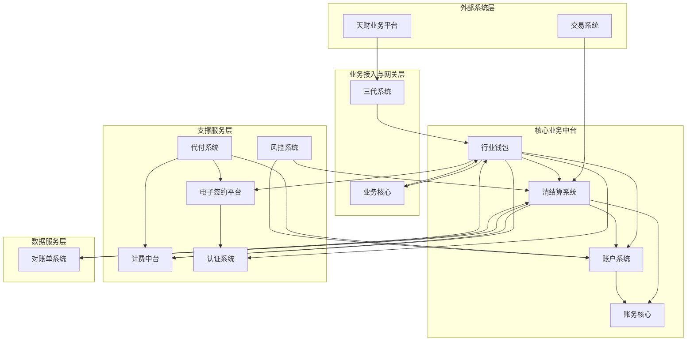
```mermaid
graph TB
    subgraph "外部系统层"
        A[天财业务平台]
        F[交易系统]
    end

    subgraph "业务接入与网关层"
        B[三代系统]
        T[业务核心]
    end

    subgraph "核心业务中台"
        C[行业钱包]
        D[清结算系统]
        E[账户系统]
        G[账务核心]
    end

    subgraph "支撑服务层"
        H[电子签约平台]
        I[计费中台]
        J[认证系统]
        K[代付系统]
        L[风控系统]
    end

    subgraph "数据服务层"
        M[对账单系统]
    end

    A --> B
    F --> D
    B --> C
    T --> C
    C --> D
    C --> E
    C --> H
    C --> I
    C --> J
    C --> T
    D --> E
    D --> G
    D --> I
    D --> M
    E --> G
    H --> J
    K --> E
    K --> I
    K --> H
    L --> D
    L --> E
    M --> D
    M --> C
```

## 2.2 功能结构

系统功能围绕账户管理、资金处理、风险控制与数据服务四大领域展开。核心功能模块包括由“行业钱包”提供的账户与关系管理、由“清结算”处理的资金清分与结算、由“风控”执行的冻结操作，以及由“对账单系统”提供的数据服务。

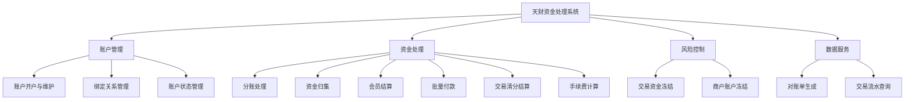
```mermaid
graph TD
    A[天财资金处理系统]

    A --> B[账户管理]
    A --> C[资金处理]
    A --> D[风险控制]
    A --> E[数据服务]

    B --> B1[账户开户与维护]
    B --> B2[绑定关系管理]
    B --> B3[账户状态管理]

    C --> C1[分账处理]
    C --> C2[资金归集]
    C --> C3[会员结算]
    C --> C4[批量付款]
    C --> C5[交易清分结算]
    C --> C6[手续费计算]

    D --> D1[交易资金冻结]
    D --> D2[商户账户冻结]

    E --> E1[对账单生成]
    E --> E2[交易流水查询]
```

## 2.3 网络拓扑图

TBD

## 2.4 数据流转

系统数据流转以业务请求为驱动，始于“天财”或“三代”的业务指令，经由“业务核心”或“行业钱包”进行业务编排，最终在“账户系统”与“账务核心”完成资金账务处理。关键数据流包括开户流、分账流、结算流和冻结流。

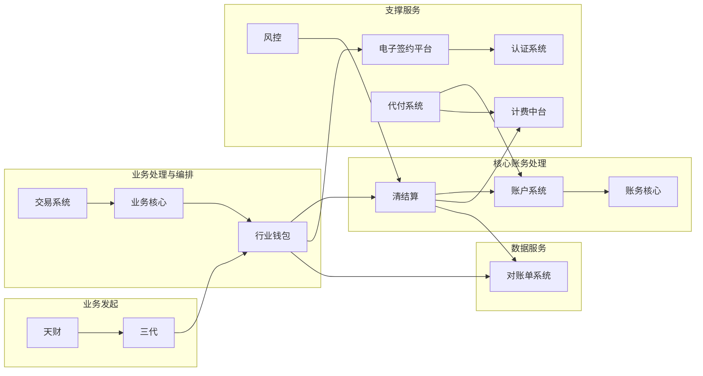
```mermaid
flowchart LR
    subgraph S1 [业务发起]
        direction LR
        A1[天财] --> A2[三代]
    end

    subgraph S2 [业务处理与编排]
        direction LR
        B1[业务核心]
        B2[行业钱包]
        B3[交易系统]
        B1 --> B2
        B3 --> B1
    end

    subgraph S3 [核心账务处理]
        direction LR
        C1[清结算]
        C2[账户系统]
        C3[账务核心]
        C1 --> C2
        C2 --> C3
    end

    subgraph S4 [支撑服务]
        direction LR
        D1[计费中台]
        D2[电子签约平台]
        D3[认证系统]
        D4[代付系统]
        D5[风控]
    end

    subgraph S5 [数据服务]
        E1[对账单系统]
    end

    A2 --> B2
    B2 --> C1
    B2 --> D2
    D2 --> D3
    C1 --> D1
    D4 --> C2
    D4 --> D1
    D5 --> C1
    C1 --> E1
    B2 --> E1
```

## 2.5 系统模块交互关系

模块间主要通过同步API调用与异步事件进行交互，形成清晰的上下游依赖关系。“行业钱包”作为核心协调者，依赖多个底层服务；“清结算”和“账户系统”是资金处理的关键路径；“三代”和“业务核心”是主要的外部请求入口。

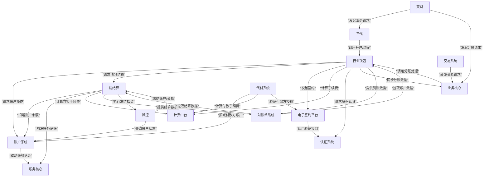
```mermaid
graph TD
    A[天财]
    B[三代]
    C[行业钱包]
    D[清结算]
    E[账户系统]
    F[账务核心]
    G[电子签约平台]
    H[计费中台]
    I[对账单系统]
    J[业务核心]
    K[认证系统]
    L[交易系统]
    M[代付系统]
    N[风控]

    A -- “发起业务请求” --> B
    A -- “发起分账请求” --> J
    B -- “调用开户/绑定” --> C
    J -- “调用分账处理” --> C
    L -- “转发交易请求” --> J

    C -- “请求账户操作” --> E
    C -- “请求清分结算” --> D
    C -- “发起签约” --> G
    C -- “计算手续费” --> H
    C -- “请求身份认证” --> K
    C -- “同步分账数据” --> J
    C -- “提供对账数据” --> I

    D -- “扣增账户余额” --> E
    D -- “触发账务记账” --> F
    D -- “计算并扣手续费” --> H
    D -- “提供结算数据” --> I
    D -- “执行冻结指令” --> N

    E -- “驱动账务记录” --> F

    G -- “调用验证接口” --> K

    M -- “扣减付款方账户” --> E
    M -- “计算付款手续费” --> H
    M -- “验证付款方授权” --> G

    N -- “冻结账户/交易” --> D
    N -- “查询账户状态” --> E

    I -- “拉取结算数据” --> D
    I -- “拉取账户数据” --> C
```
---
# 3 模块设计

<a id="module-1"></a>

## 3.1 天财


### 1. 概述
- **目的与范围**: 天财模块是提出分账、会员结算、批量付款需求的业务平台。其核心职责是作为业务发起方，向三代系统发起开户、分账、归集等业务指令，并接收处理结果。其边界止于业务指令的发起与状态同步，不涉及底层账户、账务及认证等具体处理逻辑。认证系统作为下游三代系统的依赖，天财模块不直接与其交互。

### 2. 接口设计
- **API端点 (REST/GraphQL)**: TBD
- **请求/响应结构**: TBD
- **发布/消费的事件**: TBD

### 3. 数据模型
- **表/集合**: TBD
- **关键字段**: TBD
- **与其他模块的关系**: 天财模块通过机构号与三代模块关联，用于标识业务主体。其业务指令（如开户、分账）将触发下游钱包系统、清结算系统等模块的处理流程。

### 4. 业务逻辑
- **核心工作流/算法**:
  1)  **发起开户请求**:
      - 输入：机构号、账户类型（天财收款账户/天财接收方账户）、主体信息。
      - 流程：验证机构号有效性 -> 组装开户请求报文 -> 调用三代系统接口 -> 接收异步/同步结果 -> 根据结果更新本地业务单状态。
  2)  **发起分账请求**:
      - 输入：付款方机构号、收款方机构号/账户信息、分账金额、业务标识。
      - 流程：校验付款方与收款方是否存在已绑定的授权关系 -> 校验付款方账户状态是否正常、余额是否充足 -> 组装分账请求报文 -> 调用三代系统接口 -> 接收处理结果并更新状态。
  3)  **发起归集请求**:
      - 输入：总部机构号、门店机构号列表、归集金额。
      - 流程：校验总部与各门店的归属关系是否已绑定 -> 校验各门店账户状态与余额 -> 组装批量归集请求 -> 调用三代系统接口 -> 接收处理结果并更新状态。
  4)  **发起会员结算请求**: 流程与分账类似，需额外校验是否已完成“开通付款”签约。
  5)  **发起批量付款请求**: 流程与归集类似，需额外校验付款方是否已完成“开通付款”签约，并校验每个收款方的账户信息。
- **状态流转**: 业务指令状态通常包括：`待处理` -> `处理中` -> `成功`/`失败`。对于异步处理，可能增加`处理中`状态。
- **业务规则与验证**:
  - **关系绑定验证**: 发起分账、归集、会员结算前，必须确认业务主体间（如总部-门店、付款方-收款方）已完成关系绑定流程。
  - **开通付款验证**: 发起会员结算、批量付款前，必须确认付款方已完成“开通付款”的额外签约流程。
  - **账户状态验证**: 发起任何资金转出操作前，必须确认付款方账户未被冻结，且余额充足。
  - **机构号有效性**: 所有请求中的机构号必须在三代系统中有有效映射。
- **关键边界情况处理**: 当接收到下游系统返回的交易冻结、商户冻结指令时，需将相关业务主体或账户在本地的状态标记为`冻结`，并阻止后续所有资金转出操作，直至收到解冻通知。

### 5. 时序图
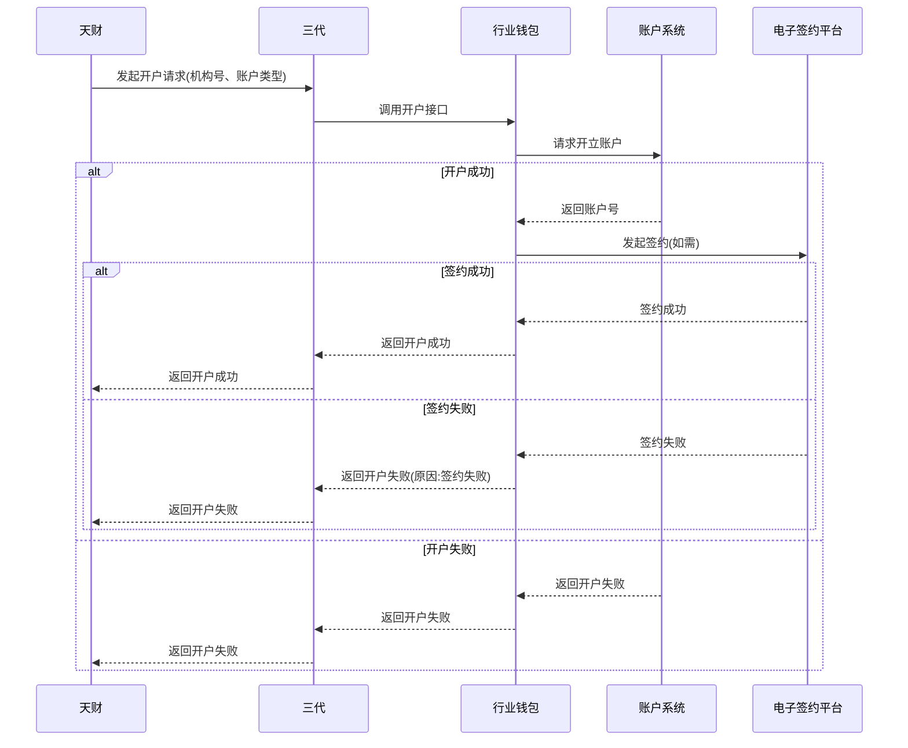
```mermaid
sequenceDiagram
    participant 天财
    participant 三代
    participant 行业钱包
    participant 账户系统
    participant 电子签约平台

    天财->>三代: 发起开户请求(机构号、账户类型)
    三代->>行业钱包: 调用开户接口
    行业钱包->>账户系统: 请求开立账户
    alt 开户成功
        账户系统-->>行业钱包: 返回账户号
        行业钱包->>电子签约平台: 发起签约(如需)
        alt 签约成功
            电子签约平台-->>行业钱包: 签约成功
            行业钱包-->>三代: 返回开户成功
            三代-->>天财: 返回开户成功
        else 签约失败
            电子签约平台-->>行业钱包: 签约失败
            行业钱包-->>三代: 返回开户失败(原因:签约失败)
            三代-->>天财: 返回开户失败
        end
    else 开户失败
        账户系统-->>行业钱包: 返回开户失败
        行业钱包-->>三代: 返回开户失败
        三代-->>天财: 返回开户失败
    end
```

### 6. 错误处理
- **预期错误情况**:
  1)  **下游系统异常**: 三代、行业钱包等服务调用超时、网络中断或返回5xx错误。
  2)  **业务校验失败**: 机构号无效、关系未绑定、未开通付款、账户状态异常（冻结）、余额不足。
  3)  **账户操作失败**: 底层账户系统操作失败（如账户已存在、账户类型不支持）。
- **处理策略**:
  - **重试机制**: 对于网络超时或下游系统临时故障（5xx错误），采用指数退避策略进行重试，最大重试次数为3次。仅对幂等操作（如查询、部分状态更新）进行重试。
  - **错误码与提示**: 定义明确的业务错误码，并携带可读的提示信息返回给调用方。例如：`RELATION_NOT_BOUND`（关系未绑定）、`ACCOUNT_FROZEN`（账户已冻结）。
  - **事务与回滚**: 天财模块本身不维护分布式事务。对于涉及多个步骤的复杂业务（如开户+签约），依赖下游系统（如行业钱包）的补偿或回滚机制。天财在接收到明确失败响应后，负责将本地业务单状态更新为`失败`，并记录失败原因。
  - **降级与熔断**: 当连续调用下游服务失败率达到阈值时，触发熔断，暂时停止发起新请求，直接返回系统繁忙错误，并记录告警。

### 7. 依赖关系
- **上游模块**: 无（天财为业务发起方，是流程的起点）。
- **下游模块**: 三代系统。天财通过三代系统间接依赖行业钱包、清结算、账户系统、电子签约平台、计费中台、对账单系统、业务核心、认证系统等模块。

<a id="module-2"></a>

## 3.2 三代


### 1. 概述
- **目的与范围**: 本模块负责商户入网审核、机构号管理、调用钱包系统开户及关系绑定。它是连接业务平台（天财）与核心业务系统（行业钱包）的桥梁，负责管理商户主体信息并驱动账户体系的建立。

### 2. 接口设计
- **API端点 (REST/GraphQL)**: TBD
- **请求/响应结构**: TBD
- **发布/消费的事件**: TBD

### 3. 数据模型
- **表/集合**: TBD
- **关键字段**: 机构号、APPID、商户类型（收单商户/非收单商户）、主体信息（总部/门店）、状态。
- **与其他模块的关系**: 通过机构号与行业钱包、清结算等系统关联，标识业务主体。

### 4. 业务逻辑
- **核心工作流/算法**:
    1.  **商户入网审核**：接收天财提交的商户入网申请，执行资质审核。
    2.  **机构号分配**：为审核通过的总部或门店主体分配全局唯一的机构号。
    3.  **账户开户**：根据商户类型（收单商户/非收单商户），调用行业钱包接口，请求开立对应的天财收款账户或天财接收方账户。
    4.  **关系绑定**：在需要时，发起并管理总部与门店之间的绑定关系流程。
- **业务规则与验证**:
    1.  **机构号唯一性**：确保分配的机构号在系统内全局唯一。
    2.  **账户类型控制**：收单商户可开立天财收款账户；非收单商户或个人只能开立天财接收方账户。
    3.  **隶属关系验证**：建立总部-门店绑定时，需验证双方主体信息的合法性与关联性。
    4.  **审核规则**：审核商户资质，具体规则（如企业三证、法人信息、行业资质等）TBD。
- **关键边界情况处理**:
    1.  **审核不通过**：记录审核不通过原因，通知天财，流程终止。
    2.  **下游调用失败**：对调用行业钱包等下游系统的操作，实施重试与补偿机制（策略见错误处理章节）。
    3.  **机构号冲突**：在分配环节进行幂等性校验，若发现冲突则重新生成或采用预留号段。

### 5. 时序图
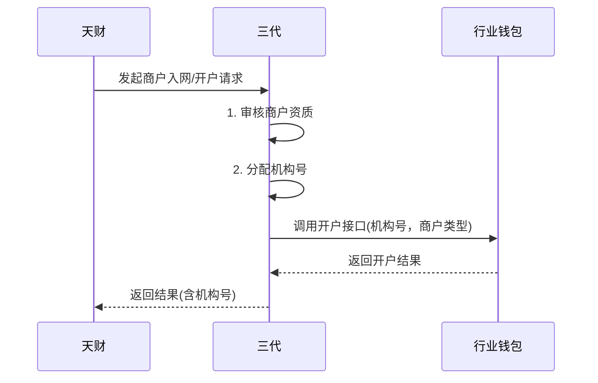
```mermaid
sequenceDiagram
    participant 天财
    participant 三代
    participant 行业钱包

    天财->>三代: 发起商户入网/开户请求
    三代->>三代: 1. 审核商户资质
    三代->>三代: 2. 分配机构号
    三代->>行业钱包: 调用开户接口(机构号，商户类型)
    行业钱包-->>三代: 返回开户结果
    三代-->>天财: 返回结果(含机构号)
```

### 6. 错误处理
- **预期错误情况**:
    1.  **输入错误**：商户信息不完整、格式错误或不合规。
    2.  **业务规则错误**：审核不通过、机构号分配冲突、商户类型与账户类型不匹配。
    3.  **下游系统错误**：行业钱包服务不可用、超时、开户请求因风控等原因被拒绝。
- **处理策略**:
    1.  **输入校验**：在接口层和业务逻辑层进行严格校验，返回明确错误码和提示信息。
    2.  **重试机制**：对下游系统（行业钱包）的调用失败，采用指数退避策略进行有限次重试（如最多3次）。
    3.  **补偿与状态管理**：对于开户等关键操作，记录操作日志与状态。若最终失败，需将本系统内的相关状态（如机构号状态）置为失败，并提供人工干预入口进行核对与处理。
    4.  **熔断与降级**：监控下游系统健康度，在持续失败时触发熔断，避免系统雪崩，并返回友好提示。
    5.  **日志记录**：详细记录所有错误上下文，便于问题排查。

### 7. 依赖关系
- **上游模块**: 天财（业务请求来源）。
- **下游模块**: 行业钱包（核心依赖，用于账户开户和关系绑定）。根据术语表，“账户系统（账户域）”是“行业钱包”的底层组件，因此三代模块不直接依赖账户系统，而是通过行业钱包间接调用。

<a id="module-3"></a>

## 3.3 行业钱包


### 1. 概述
- **目的与范围**: 行业钱包是处理账户开户、关系绑定、分账请求校验、计费及数据同步的核心业务系统。其核心职责包括：接收三代指令开立天财收款账户或天财接收方账户；管理总部与门店、付款方与接收方之间的绑定关系；校验天财发起的分账请求；与计费中台交互完成手续费计算；以及与清结算、账户系统等模块进行数据同步。

### 2. 接口设计
- **API端点 (REST/GraphQL)**:
    - `POST /v1/accounts`: 接收三代开户指令，开立天财收款账户或天财接收方账户。
    - `POST /v1/bindings`: 建立总部与门店、或付款方与接收方之间的绑定关系。
    - `POST /v1/split-requests`: 接收天财的分账指令，执行分账处理。
    - `GET /v1/accounts/{accountNo}/balance`: 查询指定账户余额。
    - `PUT /v1/accounts/{accountNo}/status`: 更新账户状态（如冻结/解冻）。
- **请求/响应结构**: TBD
- **发布/消费的事件**:
    - **消费事件**:
        - `SettlementCompleted`: 来自清结算系统，通知结算完成，触发账户余额更新。
        - `AccountStatusChanged`: 来自账户系统，通知账户状态变更，触发本地状态同步。
        - `TransactionFrozen`: 来自清结算系统，通知交易冻结指令。
        - `MerchantFrozen`: 来自清结算系统，通知商户冻结指令。
    - **发布事件**:
        - `AccountOpened`: 账户开立成功事件。
        - `BindingEstablished`: 绑定关系建立成功事件。
        - `SplitCompleted`: 分账处理完成事件。
        - `FeeCalculated`: 手续费计算完成事件。

### 3. 数据模型
- **表/集合**:
    - `wallet_account`: 存储天财收款账户与天财接收方账户的核心信息。
        - 关键字段: `account_no` (账户号，主键), `institution_id` (机构号), `merchant_id` (商户ID), `account_type` (账户类型: 收款账户/接收方账户), `role` (角色: 总部/门店), `status` (状态: 正常/冻结/注销), `balance` (余额), `created_at`, `updated_at`。
    - `binding_relationship`: 存储绑定关系。
        - 关键字段: `id` (关系ID，主键), `payer_account_no` (付款方账户号), `payee_account_no` (收款方账户号), `relationship_type` (关系类型: 总部-门店/付款方-接收方), `contract_id` (电子合同ID), `verification_status` (认证状态: 待验证/打款验证中/人脸验证中/已验证/失败), `verification_type` (认证类型: 打款验证/人脸验证), `is_active` (是否生效), `created_at`, `updated_at`。
    - `split_record`: 存储分账记录。
        - 关键字段: `split_id` (分账流水号，主键), `request_id` (天财请求ID), `payer_account_no`, `payee_account_no`, `amount` (分账金额), `fee` (手续费), `status` (状态: 处理中/成功/失败), `created_at`。
- **与其他模块的关系**:
    - `wallet_account.account_no` 与 **账户系统** 中的账户号关联。
    - `binding_relationship.contract_id` 与 **电子签约平台** 的合同ID关联。
    - `split_record` 的分账结果会同步至 **业务核心** 与 **对账单系统**。

### 4. 业务逻辑
- **核心工作流/算法**:
    1.  **开户流程**: 接收三代指令，校验机构号与商户资质。调用账户系统开立账户，根据商户类型（收单/非收单）创建天财收款账户或天财接收方账户记录。
    2.  **关系绑定流程**:
        - 接收绑定请求，创建 `binding_relationship` 记录，状态为“待验证”。
        - 调用电子签约平台生成并签署电子协议。
        - 根据请求或配置，调用认证系统完成指定类型的验证（打款验证或人脸验证）。
        - 接收电子签约平台与认证系统的回调，更新绑定关系的合同ID与验证状态。全部成功后，将关系标记为生效(`is_active=true`)。
    3.  **分账处理流程**: 接收天财的分账指令。校验付款方与接收方绑定关系是否生效、付款方账户状态正常且余额充足。调用账户系统完成付款方扣款与收款方加款。成功后，发布`SplitCompleted`事件并异步通知计费中台计费。
    4.  **数据同步流程**:
        - **触发机制**: 采用事件驱动模式，监听下游系统（清结算、账户系统）发布的事件。
        - **清结算数据同步**: 消费 `SettlementCompleted` 事件，根据结算明细，调用账户系统API更新对应 `wallet_account` 的余额。
        - **账户状态同步**: 消费 `AccountStatusChanged`、`TransactionFrozen`、`MerchantFrozen` 事件，更新本地 `wallet_account` 的状态。
        - **一致性保障**: 基于事件ID或业务流水号实现幂等处理，避免重复更新。
- **业务规则与验证**:
    - 开户时需校验商户资质与机构号。
    - 绑定关系需通过电子签约平台完成签约，并根据需要完成打款验证或人脸验证。
    - 分账前需校验：付款方与接收方已建立生效的绑定关系；付款方账户（天财收款账户）状态正常且余额充足。
- **关键边界情况处理**:
    - **处理冻结指令**: 消费清结算发布的 `TransactionFrozen` 或 `MerchantFrozen` 事件，解析指令内容，调用账户系统API执行对应账户的冻结操作，并同步更新本地账户状态。
    - **处理退货前置流程**: 根据清结算提供的配置（如退货模式），查询关联的账户（可能是天财收款账户或退货账户），调用账户系统扣减相应账户余额。

### 5. 时序图

#### 5.1 开户与关系绑定时序图
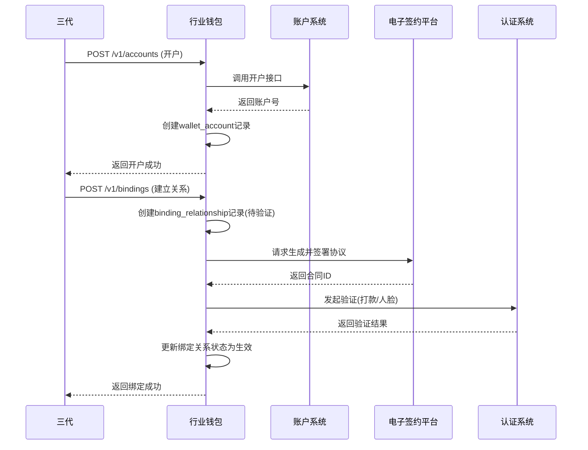
```mermaid
sequenceDiagram
    participant 三代
    participant 行业钱包
    participant 账户系统
    participant 电子签约平台
    participant 认证系统

    三代->>行业钱包: POST /v1/accounts (开户)
    行业钱包->>账户系统: 调用开户接口
    账户系统-->>行业钱包: 返回账户号
    行业钱包->>行业钱包: 创建wallet_account记录
    行业钱包-->>三代: 返回开户成功

    三代->>行业钱包: POST /v1/bindings (建立关系)
    行业钱包->>行业钱包: 创建binding_relationship记录(待验证)
    行业钱包->>电子签约平台: 请求生成并签署协议
    电子签约平台-->>行业钱包: 返回合同ID
    行业钱包->>认证系统: 发起验证(打款/人脸)
    认证系统-->>行业钱包: 返回验证结果
    行业钱包->>行业钱包: 更新绑定关系状态为生效
    行业钱包-->>三代: 返回绑定成功
```

#### 5.2 分账处理时序图
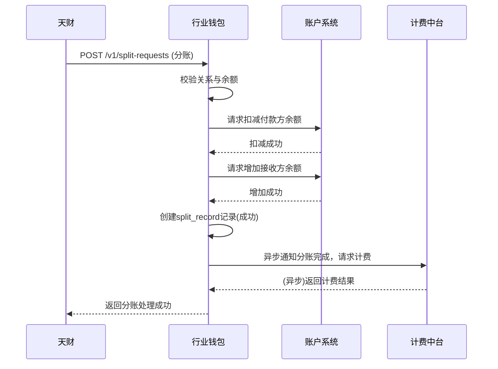
```mermaid
sequenceDiagram
    participant 天财
    participant 行业钱包
    participant 账户系统
    participant 计费中台

    天财->>行业钱包: POST /v1/split-requests (分账)
    行业钱包->>行业钱包: 校验关系与余额
    行业钱包->>账户系统: 请求扣减付款方余额
    账户系统-->>行业钱包: 扣减成功
    行业钱包->>账户系统: 请求增加接收方余额
    账户系统-->>行业钱包: 增加成功
    行业钱包->>行业钱包: 创建split_record记录(成功)
    行业钱包->>计费中台: 异步通知分账完成，请求计费
    计费中台-->>行业钱包: (异步)返回计费结果
    行业钱包-->>天财: 返回分账处理成功
```

#### 5.3 数据同步时序图
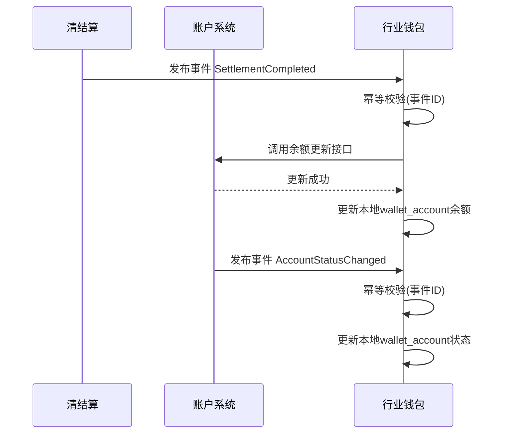
```mermaid
sequenceDiagram
    participant 清结算
    participant 账户系统
    participant 行业钱包

    清结算->>行业钱包: 发布事件 SettlementCompleted
    行业钱包->>行业钱包: 幂等校验(事件ID)
    行业钱包->>账户系统: 调用余额更新接口
    账户系统-->>行业钱包: 更新成功
    行业钱包->>行业钱包: 更新本地wallet_account余额

    账户系统->>行业钱包: 发布事件 AccountStatusChanged
    行业钱包->>行业钱包: 幂等校验(事件ID)
    行业钱包->>行业钱包: 更新本地wallet_account状态
```

### 6. 错误处理
- **预期错误情况**:
    - 开户失败（如商户信息错误、账户系统异常）。
    - 绑定关系签约失败（如认证未通过、电子签章失败）。
    - 分账校验失败（如关系不存在、余额不足、账户冻结）。
    - 与下游系统（账户系统、清结算、计费中台）通信超时或异常。
    - 数据同步事件重复或乱序。
- **处理策略**:
    - **业务校验失败**: 立即返回明确的错误码和提示信息，流程终止。
    - **下游系统调用失败**:
        - **幂等操作重试**: 对于开户、余额变更、状态更新等幂等操作，采用指数退避策略进行有限次重试（如最多3次）。重试失败后记录异常日志并告警，转为人工处理。
        - **非幂等操作**: 如涉及生成唯一流水号的操作，首次失败后不自动重试，记录日志并告警，转为人工处理。
    - **资金操作事务性**: 分账过程中，若付款方扣款成功但收款方加款失败，或后续计费失败，调用账务核心进行冲正操作，确保资金一致性。
    - **事件消费幂等性**: 基于事件ID或业务唯一键，在处理数据同步事件前进行幂等校验，避免重复处理。

### 7. 依赖关系
- **上游模块**:
    - **天财**: 调用行业钱包的分账接口。
    - **三代**: 调用行业钱包的开户与关系绑定接口。
- **下游模块**:
    - **账户系统**: 调用其API进行账户开立、余额操作、状态查询与更新。
    - **清结算系统**: 消费其发布的事件（结算完成、冻结指令），以同步数据。
    - **电子签约平台**: 调用其API完成协议签署。
    - **计费中台**: 异步通知其进行手续费计算。
    - **账务核心**: 在异常情况下调用其冲正接口。
    - **业务核心**: 向其同步分账结果数据。
    - **对账单系统**: 向其提供分账记录数据。
    - **认证系统**: 调用其API完成打款验证或人脸验证。

<a id="module-4"></a>

## 3.4 清结算


### 1. 概述
- **目的与范围**: 本模块负责处理交易清分、结算、手续费计算、账户冻结及提供对账单数据。其核心职责包括：根据业务规则对交易进行资金清分，将资金结算至指定的天财收款账户或根据被动结算路径处理；计算并扣除交易相关手续费；响应风控指令对账户或特定交易资金进行冻结；为对账单系统提供原始数据。

### 2. 接口设计
- **API端点 (REST)**:
    - `POST /api/v1/settlement/execute`: 执行交易清分与结算。
    - `POST /api/v1/freeze/account`: 执行商户账户冻结。
    - `POST /api/v1/freeze/transaction`: 执行特定交易资金冻结。
    - `GET /api/v1/statement/data`: 为对账单系统提供原始数据查询接口。
- **请求/响应结构**:
    - `POST /api/v1/settlement/execute`:
        - 请求体: `{“requestId”: “string”, “transactionId”: “string”, “merchantInfo”: {...}, “settlementMode”: “ACTIVE/PASSIVE”, “settlementPath”: “TBD”}`
        - 响应体: `{“code”: “string”, “message”: “string”, “data”: {“settlementId”: “string”, “status”: “string”}}`
    - `POST /api/v1/freeze/account`:
        - 请求体: `{“requestId”: “string”, “instructionId”: “string”, “accountNo”: “string”, “freezeType”: “MERCHANT”}`
        - 响应体: `{“code”: “string”, “message”: “string”, “data”: {“freezeOrderId”: “string”}}`
    - 其他接口的详细结构为 TBD。
- **发布/消费的事件**:
    - 消费事件:
        - `TransactionCreatedEvent`: 来自业务核心，触发清分结算流程。
        - `RiskFreezeInstructionEvent`: 来自风控系统，触发账户或交易冻结。
    - 发布事件:
        - `SettlementCompletedEvent`: 清分结算完成事件，供下游系统订阅。
        - `FreezeOrderCreatedEvent`: 冻结指令已创建事件。
        - `StatementDataAvailableEvent`: 对账单数据就绪事件，通知对账单系统。

### 3. 数据模型
- **表/集合**:
    - `settlement_record` (清分结算记录表)
    - `fee_calculation` (手续费计算记录表)
    - `freeze_order` (冻结指令记录表)
    - `settlement_rule` (清分规则配置表)
- **关键字段**:
    - `settlement_record`: `id`, `request_id`, `transaction_id`, `merchant_id`, `settlement_mode`, `status`, `settled_amount`, `fee_amount`, `target_account_no`, `created_at`, `updated_at`
    - `fee_calculation`: `id`, `settlement_id`, `fee_rule_id`, `calculated_amount`, `deduct_status`
    - `freeze_order`: `id`, `instruction_id`, `account_no`, `freeze_type`, `related_transaction_id`, `status`, `created_at`
    - `settlement_rule`: `id`, `merchant_type`, `product_type`, `fee_rate`, `settlement_path`
- **与其他模块的关系**:
    - 依赖**账户系统**进行账户余额的扣减与增加操作。
    - 为**对账单系统**提供对账单数据。
    - 依赖**计费中台**计算并扣除手续费。

### 4. 业务逻辑
- **核心工作流/算法**:
    1.  **清分**: 接收交易数据，根据商户类型、产品类型等规则计算应收资金、应付手续费等。
    2.  **结算**:
        - **主动结算**: 将清分后的净额资金，自动结算至商户指定的天财收款账户（如待结算账户）。
        - **被动结算**: 按照外部（如天财业务平台）指定的结算路径进行资金划转。
    3.  **手续费处理**: 在结算过程中，计算交易手续费，并通过调用计费中台完成扣费。
    4.  **账户/交易冻结**: 接收风控指令，对指定的收单商户天财收款账户进行冻结（商户冻结），或对已结算的特定交易资金进行冻结（交易冻结）。冻结操作需保证幂等性。
    5.  **退货前置处理**: 在退货流程中，根据配置的退货模式，查询并扣减对应的天财收款账户或退货账户的余额。
    6.  **数据提供**: 将对账单所需的原始数据（如结算记录、手续费记录）通过事件或查询接口提供给对账单系统。
- **业务规则与验证**:
    - 结算路径需根据商户的结算模式（主动/被动）进行校验。主动结算需验证目标账户（天财收款账户）存在且状态正常。
    - 冻结操作需验证指令来源（风控系统）及权限，并检查账户或交易状态。
    - 所有核心操作（清分、结算、冻结）需支持幂等性，通过唯一的业务请求ID（`requestId`/`instructionId`）实现。
- **关键边界情况处理**:
    - 结算时目标账户状态异常（如已冻结）的处理：操作失败，返回明确错误。
    - 清分或结算过程中系统中断的冲正与回滚机制：采用Saga分布式事务模式。每个步骤均记录状态，失败时触发补偿操作（如反向记账）。关键操作与**账务核心**协同确保最终一致性。
    - 并发操作处理（如结算和冻结同时发生）：在账户层面采用乐观锁或分布式锁机制，确保状态变更的序列化。

### 5. 时序图
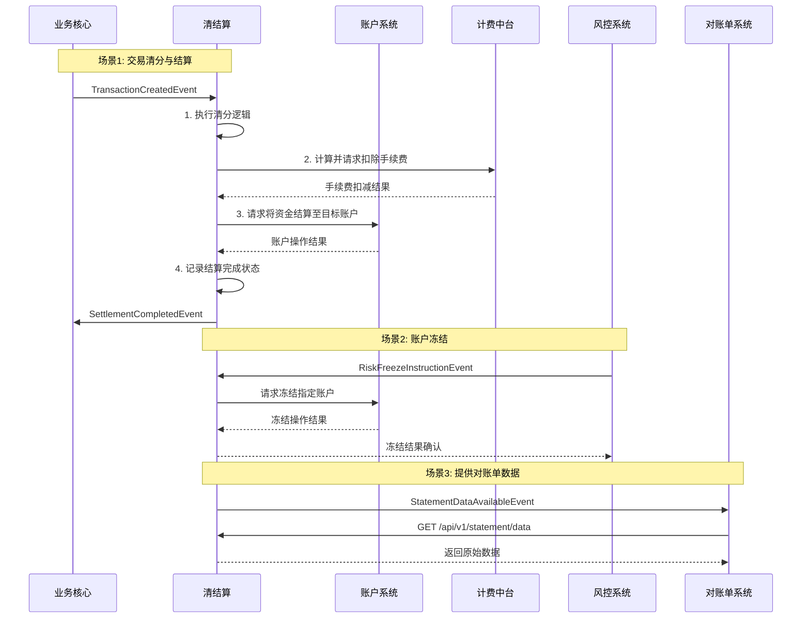
```mermaid
sequenceDiagram
    participant BusinessCore as 业务核心
    participant Settlement as 清结算
    participant Account as 账户系统
    participant Billing as 计费中台
    participant Risk as 风控系统
    participant Statement as 对账单系统

    Note over BusinessCore,Settlement: 场景1: 交易清分与结算
    BusinessCore->>Settlement: TransactionCreatedEvent
    Settlement->>Settlement: 1. 执行清分逻辑
    Settlement->>Billing: 2. 计算并请求扣除手续费
    Billing-->>Settlement: 手续费扣减结果
    Settlement->>Account: 3. 请求将资金结算至目标账户
    Account-->>Settlement: 账户操作结果
    Settlement->>Settlement: 4. 记录结算完成状态
    Settlement->>BusinessCore: SettlementCompletedEvent

    Note over Risk,Settlement: 场景2: 账户冻结
    Risk->>Settlement: RiskFreezeInstructionEvent
    Settlement->>Account: 请求冻结指定账户
    Account-->>Settlement: 冻结操作结果
    Settlement-->>Risk: 冻结结果确认

    Note over Statement,Settlement: 场景3: 提供对账单数据
    Settlement->>Statement: StatementDataAvailableEvent
    Statement->>Settlement: GET /api/v1/statement/data
    Settlement-->>Statement: 返回原始数据
```

### 6. 错误处理
- **预期错误情况**:
    - 目标账户不存在或状态异常。
    - 账户余额不足（如退货前置扣款时）。
    - 手续费计算或扣减失败。
    - 下游系统（账户系统、计费中台）服务异常或超时。
    - 并发操作冲突。
- **处理策略**:
    - 幂等性保证：所有接口通过业务唯一ID实现幂等，避免重复处理。
    - 重试机制：对网络超时等可重试的临时性错误，采用带退避策略的有限次重试。
    - 业务失败：对余额不足、账户异常等业务性错误，立即失败，并向上游返回明确的错误码和描述。
    - 分布式事务补偿：对于涉及多步骤的结算流程，失败时触发已执行步骤的补偿操作（如通过Saga）。
    - 日志与监控：记录详细的错误日志和上下文信息，用于问题追踪、对账和告警。

### 7. 依赖关系
- **上游模块**:
    - **业务核心**: 提供交易数据，触发清分结算流程。
    - **风控系统**: 发起账户冻结或交易冻结指令。
- **下游模块**:
    - **账户系统**: 执行账户资金操作（结算、冻结）。
    - **计费中台**: 计算并扣除交易手续费。
    - **对账单系统**: 消费本模块提供的数据，生成对账单。
    - **账务核心**: 在冲正与回滚场景下，协同进行账务处理。

<a id="module-5"></a>

## 3.5 账户系统


### 1. 概述
- **目的与范围**: 账户系统（账户域）是底层账户服务，负责为业务主体开立和管理各类资金账户。其核心职责包括：根据指令开立账户、升级账户、执行账户余额的扣减与增加、处理账户冻结请求，以及标记账户类型（如待结算账户、退货账户）。本模块不处理具体的业务逻辑（如分账、归集），仅提供原子化的账户操作能力。

### 2. 接口设计
- **API端点 (REST/GraphQL)**: TBD
- **请求/响应结构**: TBD
- **发布/消费的事件**: TBD

### 3. 数据模型
- **表/集合**: TBD
- **关键字段**: 账户号、账户类型（如“01待结算账户”、“04退货账户”）、账户状态（如正常、冻结）、关联机构号、余额。
- **与其他模块的关系**: 账户记录与清结算系统、行业钱包等模块的业务数据通过机构号、账户号等关键字段进行关联。

### 4. 业务逻辑
- **核心工作流/算法**: 接收上游系统（如天财或三代）的指令，执行账户开立、余额变动（增/减）、状态变更（冻结/解冻）等操作。
- **业务规则与验证**:
    1.  开立账户需绑定有效的机构号。
    2.  执行扣款前需校验账户状态正常且余额充足。
    3.  账户类型标记需符合预定义规则（如待结算账户编号为01）。
    4.  **账户升级**: 根据业务规则（如从接收方账户升级为收款账户），更新账户类型及相关属性。具体升级路径和条件由上游业务定义，本系统执行属性变更。
    5.  **标记账户类型**: 根据上游指令，为账户设置特定的类型标识（如01、04）。此操作为属性更新，不涉及资金变动。
- **关键边界情况处理**:
    1.  **重复开户请求**: 需幂等处理，基于请求ID或业务唯一键（如机构号+账户类型）进行校验，已存在则返回成功。
    2.  **并发余额操作**: 需通过数据库行级锁（悲观锁）或带版本号的乐观锁机制，结合事务保证数据一致性，防止超扣。
    3.  **操作失败**: 支持事务回滚，确保原子性。对于跨系统调用（如调用账务核心）失败，需实现补偿机制（如冲正交易）或重试逻辑。
    4.  **依赖失败处理**: 当调用下游账务核心失败时，本系统操作应回滚，并向调用方返回失败，由上游决定是否重试。

### 5. 时序图

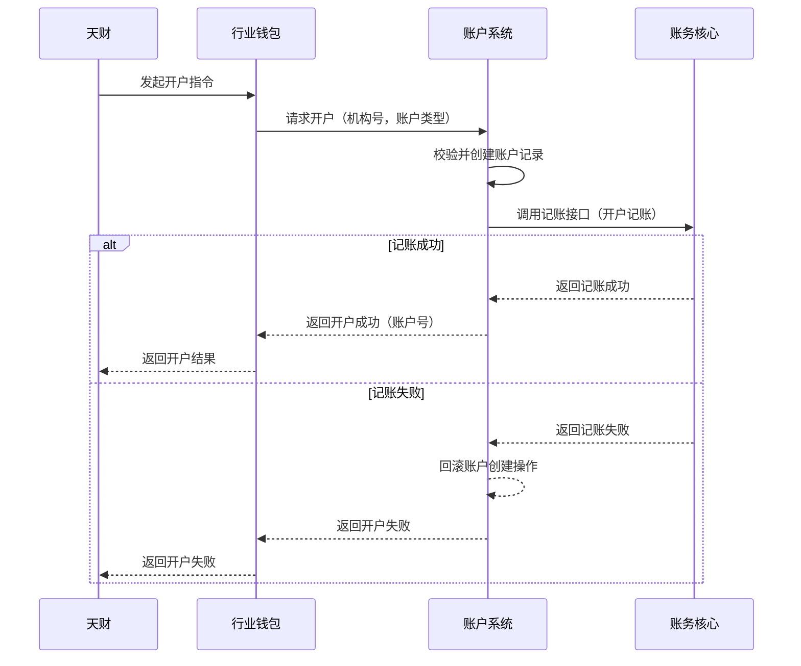
```mermaid
sequenceDiagram
    participant 天财
    participant 行业钱包
    participant 账户系统
    participant 账务核心

    天财->>行业钱包: 发起开户指令
    行业钱包->>账户系统: 请求开户（机构号，账户类型）
    账户系统->>账户系统: 校验并创建账户记录
    账户系统->>账务核心: 调用记账接口（开户记账）
    alt 记账成功
        账务核心-->>账户系统: 返回记账成功
        账户系统-->>行业钱包: 返回开户成功（账户号）
        行业钱包-->>天财: 返回开户结果
    else 记账失败
        账务核心-->>账户系统: 返回记账失败
        账户系统-->>账户系统: 回滚账户创建操作
        账户系统-->>行业钱包: 返回开户失败
        行业钱包-->>天财: 返回开户失败
    end
```

### 6. 错误处理
- **预期错误情况**:
    1.  开户时机构号无效。
    2.  扣款时余额不足。
    3.  账户状态异常（如已冻结）。
    4.  系统内部错误（如数据库连接失败）。
    5.  下游依赖（账务核心）服务不可用或调用超时。
- **处理策略**:
    1.  对于参数或状态错误，返回明确的业务错误码和提示。
    2.  对于系统内部错误，记录日志并返回系统异常，触发监控告警。
    3.  支持数据库事务回滚，确保操作原子性。
    4.  对于下游依赖失败，记录详细日志，执行回滚，并向上游返回可识别的失败状态，由业务发起方决定后续流程（如重试）。

### 7. 依赖关系
- **上游模块**: 天财（通过行业钱包发起账户操作指令）、清结算系统（发起账户冻结等指令）。
- **下游模块**: 账务核心（完成记账操作）。

<a id="module-6"></a>

## 3.6 账务核心


### 1. 概述
- **目的与范围**: 本模块是负责处理资金账户记账、冲正、回滚等核心账务操作的系统。它接收来自**业务核心**（处理天财分账交易）和**清结算系统**（处理结算、手续费）的记账指令，作为协调层，确保账务流水记录与下游**账户系统**执行的余额变更保持最终一致性。其核心职责是：1) 接收并持久化账务指令；2) 协调并保证账户余额变更与流水记录的事务性；3) 提供冲正、回滚等补偿机制。其边界在于处理账务指令的协调与记录，不涉及业务逻辑校验（如分账规则、手续费计算），业务校验应由上游模块（如行业钱包、清结算）完成。

### 2. 接口设计
- **API端点 (REST/GraphQL)**:
    - `POST /api/v1/accounting/entries`: 提交记账指令。
    - `POST /api/v1/accounting/reversals/{original_biz_no}`: 对指定原业务流水号的交易发起冲正。
    - `GET /api/v1/accounting/entries/{biz_no}`: 根据业务流水号查询账务流水状态。
- **请求/响应结构**:
    - 记账请求 (`POST /api/v1/accounting/entries`):
        ```json
        {
          "requestId": "req_123456789", // 请求唯一标识，用于幂等
          "bizType": "SPLIT_ACCOUNTING", // 业务类型：分账(SPLIT_ACCOUNTING)、归集(COLLECTION)、结算(SETTLEMENT)、手续费(FEE)
          "bizNo": "split_2025001010001", // 上游业务流水号
          "entries": [
            {
              "accountNo": "ACC80010001", // 账户号
              "amount": "100.00", // 金额（正数表示入账/增加，负数表示出账/减少）
              "direction": "CREDIT", // 方向：CREDIT(贷方/增加), DEBIT(借方/减少)
              "currency": "CNY"
            }
          ]
        }
        ```
    - 记账响应:
        ```json
        {
          "code": "SUCCESS",
          "message": "成功",
          "data": {
            "accountingNo": "ACT2025001010001", // 账务核心流水号
            "status": "PROCESSING" // 状态：PROCESSING, SUCCESS, FAILED
          }
        }
        ```
- **发布/消费的事件**:
    - 消费事件: TBD (例如，监听业务核心发布的“分账交易已校验”事件或清结算发布的“结算单已生成”事件)。
    - 发布事件:
        - `AccountingCompleted`: 账务处理完成（成功或失败）。
        - `AccountingReversed`: 冲正完成。

### 3. 数据模型
- **表/集合**:
    - `accounting_ledger` (账务流水主表): 记录每一笔账务指令的核心信息。
    - `accounting_entry` (会计分录子表): 记录每笔指令下的具体借贷分录。
    - `idempotent_record` (幂等记录表): 保障请求的幂等性。
- **关键字段**:
    - `accounting_ledger`:
        - `accounting_no` (PK): 账务流水号，本系统生成。
        - `request_id`: 上游请求ID，用于幂等。
        - `biz_type`: 业务类型。
        - `biz_no`: 上游业务流水号。
        - `status`: 状态（初始化、处理中、成功、失败、已冲正）。
        - `reverse_accounting_no`: 对应的冲正流水号。
        - `created_at`, `updated_at`: 创建/更新时间。
    - `accounting_entry`:
        - `id` (PK): 自增ID。
        - `accounting_no` (FK): 关联的账务流水号。
        - `account_no`: 账户号。
        - `amount`: 金额。
        - `direction`: 借贷方向。
        - `balance_before`: 操作前余额（从账户系统查询）。
        - `balance_after`: 操作后余额（从账户系统查询）。
    - `idempotent_record`:
        - `request_id` (PK): 请求ID。
        - `accounting_no`: 已处理的账务流水号。
        - `created_at`: 记录时间。
- **与其他模块的关系**: 本模块依赖**账户系统**执行最终的余额变更操作，并记录与之对应的账务流水，需通过事务或补偿机制保证两者的一致性。

### 4. 业务逻辑
- **核心工作流/算法**:
    1.  **接收与幂等校验**: 接收记账请求，通过`request_id`检查`idempotent_record`表，若已处理则直接返回原有结果。
    2.  **持久化指令**: 在`accounting_ledger`和`accounting_entry`中插入状态为“初始化”的记录。
    3.  **协调余额变更**:
        - 对于每一条会计分录，调用**账户系统**的余额变更接口（需支持扣减、增加、冻结等）。
        - 本模块需确保所有分录的余额变更作为一个整体事务。若账户系统支持分布式事务（如TCC），则参与其中；否则，需实现“先尝试余额变更，后持久化流水，失败则发起冲正”的补偿模式。
    4.  **更新流水状态**: 所有余额变更成功后，更新`accounting_ledger`状态为“成功”，并记录`balance_before`和`balance_after`到`accounting_entry`。
    5.  **冲正/回滚机制**:
        - 若任何一步失败，则将主流水状态置为“失败”。
        - 对于已部分成功变更余额的场景，自动或根据指令发起冲正请求，生成一条反向的`accounting_ledger`记录（状态为“冲正”），并调用账户系统进行反向操作，以恢复余额。
- **业务规则与验证**:
    - **幂等性**: 所有操作必须基于`request_id`保证幂等。
    - **最终一致性**: 通过账务流水与账户余额的补偿机制（冲正）确保最终一致。
    - **并发控制**: 对同一账户的并发操作，依赖**账户系统**的乐观锁或悲观锁机制保证余额准确性。
    - **校验边界**: 本模块不进行“余额是否充足”、“账户是否冻结”等业务校验。这些校验应由上游调用方（如行业钱包、清结算）在调用本模块前，或**账户系统**在变更余额时完成。
- **关键边界情况处理**:
    - **分布式事务部分成功**: 采用冲正作为补偿交易，确保数据回滚。
    - **系统异常与重试**: 关键步骤（如调用账户系统）需有重试机制，并设置最大重试次数。超过次数后标记失败并告警。
    - **对账与追溯**: 完整的`accounting_entry`记录（含操作前后余额）为日终对账（与账户系统、上游系统）提供依据。

### 5. 时序图
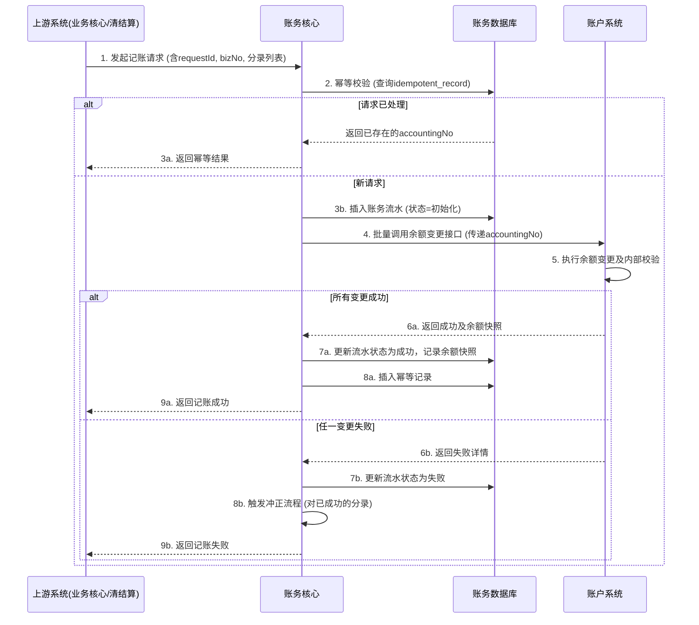
```mermaid
sequenceDiagram
    participant U as 上游系统(业务核心/清结算)
    participant AC as 账务核心
    participant DB as 账务数据库
    participant AS as 账户系统

    U->>AC: 1. 发起记账请求 (含requestId, bizNo, 分录列表)
    AC->>DB: 2. 幂等校验 (查询idempotent_record)
    alt 请求已处理
        DB-->>AC: 返回已存在的accountingNo
        AC-->>U: 3a. 返回幂等结果
    else 新请求
        AC->>DB: 3b. 插入账务流水 (状态=初始化)
        AC->>AS: 4. 批量调用余额变更接口 (传递accountingNo)
        AS->>AS: 5. 执行余额变更及内部校验
        alt 所有变更成功
            AS-->>AC: 6a. 返回成功及余额快照
            AC->>DB: 7a. 更新流水状态为成功，记录余额快照
            AC->>DB: 8a. 插入幂等记录
            AC-->>U: 9a. 返回记账成功
        else 任一变更失败
            AS-->>AC: 6b. 返回失败详情
            AC->>DB: 7b. 更新流水状态为失败
            AC->>AC: 8b. 触发冲正流程 (对已成功的分录)
            AC-->>U: 9b. 返回记账失败
        end
    end
```

### 6. 错误处理
- **预期错误情况**:
    - **业务参数错误**: 账户不存在、金额格式错误、借贷不平。
    - **系统交互错误**: 账户系统服务不可用、返回未知错误、网络超时。
    - **数据一致性错误**: 冲正时原交易状态异常、对账不平。
    - **并发冲突**: 请求重复 (`request_id`冲突)。
- **处理策略**:
    - **参数与幂等错误**: 立即失败，返回明确错误码。
    - **系统交互错误**: 进行有限次重试（如3次），重试失败后标记该笔流水为“失败”，触发告警，并尝试发起冲正。
    - **数据一致性错误**: 记录详细日志并告警，需人工介入核查。
    - **所有错误**均需在`accounting_ledger`中更新状态并记录错误原因，便于追踪。

### 7. 依赖关系
- **上游模块**: **业务核心**（发起分账、归集等记账指令）、**清结算系统**（发起结算、手续费扣除等记账指令）。上游模块负责业务逻辑校验后调用本模块。
- **下游模块**: **账户系统**（强依赖，用于执行所有账户余额的变更操作，并返回结果）。
- **内部依赖**: 自身数据库（用于持久化账务流水和幂等记录）。

<a id="module-7"></a>

## 3.7 电子签约平台


### 1. 概述
- **目的与范围**: 本模块负责在关系绑定、开通付款等场景中，生成电子协议、发送签约短信、调用外部认证接口，并留存签约全过程的证据链数据。它是业务授权流程中的关键环节，确保操作的法律效力和可追溯性。

### 2. 接口设计
- **API端点 (REST/GraphQL)**:
    - `POST /v1/contracts`: 发起签约流程。上游调用方（如“三代”或“行业钱包”）通过此接口发起签约请求。
    - `POST /v1/contracts/{contractId}/callback/auth`: 认证结果回调接口。由“认证系统”调用，通知本模块认证结果。
    - `GET /v1/contracts/{contractId}/evidence`: 查询签约证据链。
- **请求/响应结构**:
    - 发起签约请求体 (`POST /v1/contracts`) 包含字段：`requestId`（请求流水号）、`bizScene`（业务场景，如 `RELATION_BIND`、`OPEN_PAYMENT`）、`userType`（用户类型，`PERSONAL` 或 `ENTERPRISE`）、`userInfo`（用户信息，包含姓名、证件号、手机号等）、`callbackUrl`（业务回调地址）。
    - 签约响应体包含字段：`contractId`（签约流程唯一标识）、`status`（初始状态，如 `PROCESSING`）、`nextStep`（下一步提示，如 `AWAITING_SMS_VERIFY`）。
    - 认证回调请求体 (`POST /v1/contracts/{contractId}/callback/auth`) 包含字段：`contractId`、`authResult`（`SUCCESS` 或 `FAILED`）、`authMethod`（`PAYMENT_VERIFY` 或 `FACE_VERIFY`）、`evidenceData`（认证过程数据）、`failReason`（可选，失败原因）。
- **发布/消费的事件**:
    - 消费事件：TBD（从上游模块接收的签约触发事件）。
    - 发布事件：`ContractCompletedEvent`（签约完成事件，包含 `contractId`, `status`, `evidenceChainId`）。

### 3. 数据模型
- **表/集合**:
    - `contract_flow`（签约流程主表）：存储签约流程的核心状态和信息。
    - `evidence_chain`（证据链表）：存储签约全过程的证据数据，与流程主表关联。
- **关键字段**:
    - `contract_flow` 表：`contract_id`（主键）、`request_id`、`biz_scene`、`user_type`、`user_info`（JSON）、`auth_method`、`status`、`sms_sent`（布尔值）、`auth_result`、`created_at`、`updated_at`。
    - `evidence_chain` 表：`evidence_id`（主键）、`contract_id`（外键）、`step`（步骤，如 `CONTRACT_GENERATED`、`SMS_SENT`、`AUTH_REQUESTED`、`AUTH_RESULT`）、`step_data`（JSON，存储该步骤的详细数据，如协议内容、短信记录、认证请求/响应）、`timestamp`。
- **与其他模块的关系**: 本模块为上游的业务调用方（如“三代”运营的系统或“行业钱包”）提供签约服务，并依赖下游的“认证系统”完成身份核验。证据链数据可供风控、审计等模块查询。

### 4. 业务逻辑
- **核心工作流/算法**:
    1.  **接收与验证请求**：接收上游调用方的签约请求。验证必填字段（`requestId`, `bizScene`, `userType`, `userInfo`），检查 `requestId` 是否重复，校验用户信息格式。
    2.  **生成电子协议**：根据 `bizScene` 和 `userType` 选择协议模板，填充用户信息，生成唯一的电子协议文件。将协议内容及哈希值记录到证据链。
    3.  **发送签约短信**：向 `userInfo` 中的手机号发送包含签约链接的短信。记录短信服务商、发送时间、短信内容哈希到证据链。更新主表 `sms_sent` 状态。
    4.  **选择并调用认证**：
        - **认证方式选择逻辑**：如果 `userType` 为 `ENTERPRISE`（企业），默认选择 **打款验证**。如果 `userType` 为 `PERSONAL`（个人），默认选择 **人脸验证**。特定业务场景（由 `bizScene` 指定）可强制指定认证方式。
        - 调用“认证系统”对应接口（打款验证或人脸验证），传递 `contractId` 和用户信息。将认证请求数据记录到证据链。
    5.  **处理认证回调**：接收“认证系统”的异步回调。验证回调签名。根据 `authResult` 更新主表状态。将认证结果数据记录到证据链。
    6.  **生成完整证据链**：将以上所有步骤的证据（协议、短信、认证请求、认证结果）按时间顺序聚合，生成一个不可篡改的证据包（如使用所有步骤数据的哈希生成默克尔树根哈希）。存储最终证据链。
    7.  **通知业务方**：根据认证结果，通过 `callbackUrl` 回调上游业务方，通知签约最终状态（成功/失败）。
- **业务规则与验证**:
    - 签约请求必须包含有效的业务场景和用户类型。
    - 个人用户必须提供有效的身份证号和姓名，企业用户需提供企业名称和法人信息。
    - 同一 `requestId` 在短时间内不可重复发起。
- **关键边界情况处理**:
    - **数据一致性（部分失败）**：采用本地事务与补偿机制结合。例如，若短信发送成功但存储证据链失败，则记录错误日志并标记流程为“异常”，通过后台任务尝试修复或通知人工介入。确保不会出现“短信已发但流程状态未知”的情况。
    - **重试机制**：对依赖服务（短信服务、认证系统）的调用设置指数退避重试（如最多3次）。重试失败后，将流程标记为失败，并记录具体失败原因。
    - **认证方式回退**：如果默认的认证方式调用失败（如人脸验证服务不可用），可根据配置策略回退到另一种认证方式（如有），并更新证据链记录。

### 5. 时序图
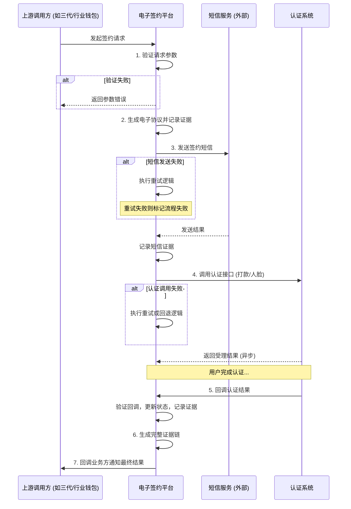
```mermaid
sequenceDiagram
    participant 上游调用方 as 上游调用方 (如三代/行业钱包)
    participant 电子签约平台
    participant 短信服务 as 短信服务 (外部)
    participant 认证系统

    上游调用方->>电子签约平台: 发起签约请求
    电子签约平台->>电子签约平台: 1. 验证请求参数
    alt 验证失败
        电子签约平台-->>上游调用方: 返回参数错误
    end
    电子签约平台->>电子签约平台: 2. 生成电子协议并记录证据
    电子签约平台->>短信服务: 3. 发送签约短信
    alt 短信发送失败
        电子签约平台->>电子签约平台: 执行重试逻辑
        Note over 电子签约平台: 重试失败则标记流程失败
    end
    短信服务-->>电子签约平台: 发送结果
    电子签约平台->>电子签约平台: 记录短信证据
    电子签约平台->>认证系统: 4. 调用认证接口 (打款/人脸)
    alt 认证调用失败
        电子签约平台->>电子签约平台: 执行重试或回退逻辑
    end
    认证系统-->>电子签约平台: 返回受理结果 (异步)
    Note over 认证系统,电子签约平台: 用户完成认证...
    认证系统->>电子签约平台: 5. 回调认证结果
    电子签约平台->>电子签约平台: 验证回调，更新状态，记录证据
    电子签约平台->>电子签约平台: 6. 生成完整证据链
    电子签约平台->>上游调用方: 7. 回调业务方通知最终结果
```

### 6. 错误处理
- **预期错误情况**:
    1.  **输入错误**：请求参数缺失、格式错误、`requestId` 重复。
    2.  **依赖服务错误**：短信服务不可用或发送失败；认证系统接口调用超时、服务异常；认证失败（信息不匹配）。
    3.  **内部错误**：数据库连接失败、证据链生成或存储失败。
- **处理策略**:
    - **输入错误**：立即失败，向上游返回 `4xx` 错误码及具体错误信息。
    - **依赖服务错误**：
        - 设置合理的超时时间（如短信3秒，认证5秒）。
        - 实施带指数退避的重试机制（如最多3次）。
        - 重试后仍失败，将流程状态标记为 `FAILED`，并记录详细的失败原因。异步通知监控告警。
    - **内部错误**：记录错误日志，流程标记为 `SYSTEM_ERROR`。通过监控告警通知运维。设计后台补偿任务，尝试修复不一致状态。
    - **状态一致性**：关键状态变更（如 `sms_sent`, `auth_result`）与证据链记录在同一个数据库事务中完成，确保原子性。对于跨服务的操作，通过记录详细日志和状态机，支持人工或自动补偿。

### 7. 依赖关系
- **上游模块/调用方**: 业务调用方（在“三代”运营流程或“行业钱包”流程中发起签约的模块）。
- **下游服务/模块**:
    - **认证系统**：提供打款验证和人脸验证服务。
    - **短信服务商**：提供短信发送能力。
    - （内部依赖）**数据库**：存储签约流程与证据链数据。

<a id="module-8"></a>

## 3.8 计费中台


### 1. 概述
- **目的与范围**：本模块负责生成计费流水、计算并扣除转账手续费。其核心职责是处理与资金流转相关的费用计算，主要服务于分账、批量付款等场景，确保手续费的正确计算与扣除。其边界止于费用计算、流水记录以及向账户系统发起扣费指令，不直接操作账户余额（由账户系统执行原子操作）或处理交易清分（由清结算系统执行）。

### 2. 接口设计
- **API端点 (REST)**：
    - `POST /v1/fee/calculate`: 计算手续费。
    - `POST /v1/fee/deduct`: 发起手续费扣减。
    - `GET /v1/fee/records/{recordId}`: 查询计费流水。
- **请求/响应结构**：
    - 计算手续费请求：包含业务场景（分账/批量付款）、付款方账户ID、收款方账户ID、交易金额、业务请求ID。
    - 计算手续费响应：包含计算出的手续费金额、适用的费率规则ID、计费流水ID（预生成）。
    - 发起扣费请求：包含计费流水ID、业务请求ID、付款方账户ID、手续费金额。
    - 发起扣费响应：包含扣费状态（成功/失败）、账户系统交易流水号（若成功）。
- **发布/消费的事件**：
    - 消费事件：TBD（例如，可消费清结算系统发布的清分完成事件作为计费触发依据，但当前主要上游为行业钱包）。
    - 发布事件：`FeeDeductionCompleted`（手续费扣减完成事件），包含计费流水ID、扣费状态、时间戳。

### 3. 数据模型
- **表/集合**：
    - `fee_rule`（费率规则表）：存储不同业务场景下的计费规则。
    - `billing_record`（计费流水表）：记录每一次计费请求的详细信息及结果。
- **关键字段**：
    - `fee_rule`：规则ID、业务场景、费率类型（固定金额/百分比）、费率值、生效时间、失效时间、状态（启用/禁用）、适用账户类型。
    - `billing_record`：流水ID、业务请求ID（用于幂等）、业务场景、付款方账户ID、收款方账户ID、交易金额、手续费金额、规则ID、计费状态（待扣费/扣费中/扣费成功/扣费失败）、账户系统交易流水号、创建时间、更新时间。
- **与其他模块的关系**：通过`付款方账户ID`与**账户系统**关联，发起扣费指令；计费流水为**行业钱包**提供计费结果；可能接收**清结算系统**的清分数据作为部分场景的计费依据。

### 4. 业务逻辑
- **核心工作流/算法**：
    1. 接收计费请求（携带业务请求ID）。
    2. 根据业务场景、账户类型等参数，查询`fee_rule`表获取当前生效的费率规则。
    3. 根据规则（固定费或百分比）计算应收手续费。
    4. 生成唯一的`billing_record`记录，状态为“待扣费”。使用业务请求ID确保幂等（重复请求返回已存在的流水）。
    5. 调用账户系统扣费接口，传递计费流水ID、付款方账户ID和手续费金额。
    6. 根据账户系统返回结果，更新计费流水状态为“扣费成功”或“扣费失败”，并发布`FeeDeductionCompleted`事件。
- **业务规则与验证**：
    - 验证费率规则存在且处于启用状态。
    - 验证付款方账户状态（通过账户系统接口）是否正常（非冻结）。
    - 通过业务请求ID实现接口幂等性，防止重复计费。
- **关键边界情况处理**：
    - **费率规则不存在**：终止流程，返回规则配置错误。
    - **账户余额不足**：账户系统扣费失败，更新流水状态为“扣费失败”，流程终止。
    - **下游系统（账户系统）调用失败**：实现带退避策略的重试机制（如最多3次）。若最终失败，标记流水为“扣费失败”并告警，支持人工干预后重试。

### 5. 时序图

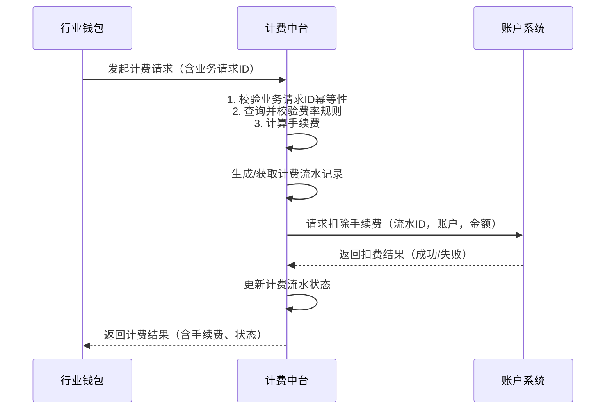
```mermaid
sequenceDiagram
    participant 行业钱包
    participant 计费中台
    participant 账户系统

    行业钱包->>计费中台: 发起计费请求（含业务请求ID）
    计费中台->>计费中台: 1. 校验业务请求ID幂等性<br>2. 查询并校验费率规则<br>3. 计算手续费
    计费中台->>计费中台: 生成/获取计费流水记录
    计费中台->>账户系统: 请求扣除手续费（流水ID，账户，金额）
    账户系统-->>计费中台: 返回扣费结果（成功/失败）
    计费中台->>计费中台: 更新计费流水状态
    计费中台-->>行业钱包: 返回计费结果（含手续费、状态）
```

### 6. 错误处理
- **预期错误情况**：
    1. 费率规则配置错误或不存在。
    2. 计费账户状态异常（冻结）。
    3. 账户余额不足。
    4. 下游系统（账户系统）服务超时或不可用。
    5. 重复的业务请求ID（幂等性处理）。
- **处理策略**：
    - 对于参数、配置或账户状态错误，立即终止流程，返回明确的业务错误码和提示信息。
    - 对于下游系统故障，启用重试机制（指数退避），并记录详细日志。重试失败后，将计费流水标记为失败，触发告警通知运维人员。
    - 通过业务请求ID保证幂等，对重复请求直接返回已生成的流水结果。

### 7. 依赖关系
- **上游模块**：**行业钱包**（发起计费请求的主要上游）。**清结算系统**（可能提供计费基础数据，当前为TBD）。
- **下游模块**：**账户系统**（执行手续费扣减操作）。

<a id="module-9"></a>

## 3.9 对账单系统


### 1. 概述
- **目的与范围**：本模块负责生成并提供各类账户和交易维度的对账单数据。其核心职责是响应内部系统（如天财）的查询请求，生成指定账户或交易的对账单文件或数据，不涉及交易清分、结算或账户余额变动等核心账务处理。

### 2. 接口设计
- **API端点 (REST/GraphQL)**：TBD
- **请求/响应结构**：
    - **生成对账单请求**：包含请求ID、账户标识（如机构号）、对账单类型（账户/交易）、时间范围（开始时间、结束时间）、文件格式（CSV/PDF）等字段。
    - **生成对账单响应**：包含请求ID、处理状态（成功/处理中/失败）、文件下载链接（若为异步生成）、错误码及信息。
    - **查询对账单状态请求**：包含请求ID。
    - **查询对账单状态响应**：包含请求ID、处理状态、文件下载链接（若已生成）、生成时间。
- **发布/消费的事件**：TBD

### 3. 数据模型
- **表/集合**：TBD
- **关键字段**：TBD
- **与其他模块的关系**：本模块依赖**清结算系统**获取交易清分、结算及手续费处理后的最终数据，以生成准确的对账单。天财作为业务平台，是主要的API调用方。

### 4. 业务逻辑
- **核心工作流/算法**：
    1.  接收对账单生成请求。
    2.  校验请求参数的合法性（如账户是否存在、时间范围是否有效）。
    3.  根据数据量评估策略：
        - **数据量小**：同步处理。向清结算系统查询相关数据，按预设格式组装并生成对账单文件，返回文件或数据流。
        - **数据量大**：异步处理。创建异步任务，返回任务ID。后台任务分页从清结算系统拉取数据，组装生成文件后存储，并更新任务状态。
    4.  数据组装格式遵循预设模板（如CSV包含交易流水号、时间、金额、手续费、结算状态等字段；PDF包含账户摘要、交易明细表格）。
- **业务规则与验证**：
    - 验证请求账户（通过机构号标识）是否存在于系统中。
    - 验证时间范围不超过系统允许的最大跨度（如1年）。
    - 验证请求方（天财）是否有权限查询指定账户的对账单。
- **关键边界情况处理**：
    - **无数据**：生成包含表头/摘要但无明细记录的空文件，或返回明确的“无数据”提示。
    - **数据量过大**：触发异步生成流程，支持通过任务ID查询进度和结果。
    - **依赖服务异常**：执行重试策略，若最终失败则记录日志并返回服务不可用提示。

### 5. 时序图

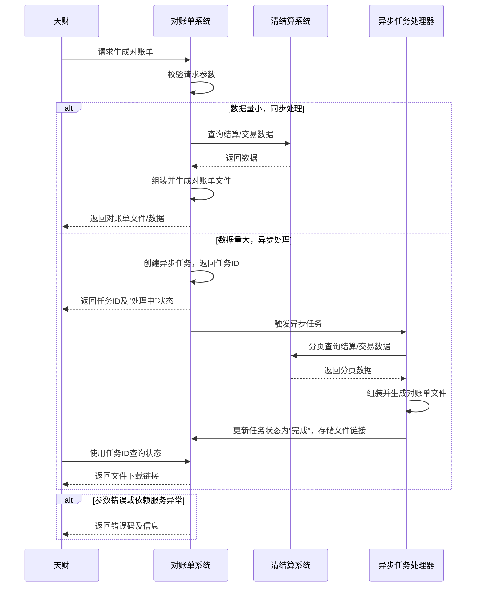
```mermaid
sequenceDiagram
    participant Tiancai as 天财
    participant Statement as 对账单系统
    participant Settlement as 清结算系统
    participant AsyncWorker as 异步任务处理器

    Tiancai->>Statement: 请求生成对账单
    Statement->>Statement: 校验请求参数
    alt 数据量小，同步处理
        Statement->>Settlement: 查询结算/交易数据
        Settlement-->>Statement: 返回数据
        Statement->>Statement: 组装并生成对账单文件
        Statement-->>Tiancai: 返回对账单文件/数据
    else 数据量大，异步处理
        Statement->>Statement: 创建异步任务，返回任务ID
        Statement-->>Tiancai: 返回任务ID及“处理中”状态
        Statement->>AsyncWorker: 触发异步任务
        AsyncWorker->>Settlement: 分页查询结算/交易数据
        Settlement-->>AsyncWorker: 返回分页数据
        AsyncWorker->>AsyncWorker: 组装并生成对账单文件
        AsyncWorker->>Statement: 更新任务状态为“完成”，存储文件链接
        Tiancai->>Statement: 使用任务ID查询状态
        Statement-->>Tiancai: 返回文件下载链接
    end
    alt 参数错误或依赖服务异常
        Statement-->>Tiancai: 返回错误码及信息
    end
```

### 6. 错误处理
- **预期错误情况**：
    - **客户端错误**：请求参数错误（如无效账户、时间格式错误、超出最大时间范围）。
    - **服务端错误**：依赖系统（清结算）服务不可用、查询超时或返回异常数据；内部文件生成失败。
    - **异步任务错误**：任务执行超时、失败。
- **处理策略**：
    - **参数错误**：返回明确的4xx错误码（如`INVALID_ACCOUNT`， `INVALID_DATE_RANGE`）和提示信息。
    - **依赖服务异常**：实施重试策略（如最多3次，指数退避）。若持续失败，触发熔断机制，并返回5xx错误码（如`SETTLEMENT_SERVICE_UNAVAILABLE`）和“服务暂时不可用”提示。所有异常需记录详细日志。
    - **异步任务失败**：更新任务状态为“失败”，记录失败原因，供调用方查询。

### 7. 依赖关系
- **上游模块**：**清结算系统**（核心数据依赖，需提供指定账户及时间范围内的结算明细数据查询接口）。
- **下游模块**：**天财**（主要服务对象与API调用方）。

<a id="module-10"></a>

## 3.10 业务核心


### 1. 概述
- **目的与范围**: 业务核心模块是天财平台分账交易在支付体系内的处理中枢。其核心职责是接收、校验天财平台发起的各类分账请求（如归集、会员结算），并协调行业钱包系统完成资金流转。模块自身不持有账户余额，不执行资金操作，也不处理清结算、计费等具体事务。其核心边界在于：1）作为天财分账请求的统一入口；2）执行分账业务逻辑的集中校验与编排；3）确保分账指令可靠地传递至行业钱包系统执行；4）记录分账业务状态，并可选地通知下游系统。

### 2. 接口设计
- **API端点 (REST/GraphQL)**:
  - `POST /api/v1/split-order`: 接收天财平台发起的单笔分账请求。
  - `POST /api/v1/split-order/batch`: 接收天财平台发起的批量分账请求。
  - `GET /api/v1/split-order/{orderNo}`: 查询指定分账订单的处理状态。
- **请求/响应结构**:
  - **请求体示例 (单笔分账)**:
    ```json
    {
      "appId": "TBD",
      "requestId": "unique_request_id_123",
      "bizScene": "COLLECTION", // 业务场景：COLLECTION(归集), MEMBER_SETTLEMENT(会员结算)
      "payerInfo": {
        "institutionNo": "总部机构号",
        "accountNo": "付方天财收款账户号"
      },
      "payeeInfo": {
        "institutionNo": "门店机构号",
        "accountNo": "收方天财收款账户号"
      },
      "amount": 10000,
      "currency": "CNY",
      "remark": "资金归集"
    }
    ```
  - **响应体示例 (成功)**:
    ```json
    {
      "code": "SUCCESS",
      "message": "处理成功",
      "data": {
        "orderNo": "系统生成的分账订单号",
        "status": "PROCESSING",
        "requestId": "unique_request_id_123"
      }
    }
    ```
- **发布/消费的事件**:
  - **消费事件**: TBD (暂未定义上游事件源)。
  - **发布事件**: `SplitOrderCompletedEvent` (分账完成事件)，当行业钱包系统处理完成（成功或最终失败）时发布，供清结算等下游系统订阅。
    - **事件格式**:
      ```json
      {
        "eventId": "uuid",
        "eventType": "SPLIT_ORDER_COMPLETED",
        "timestamp": "2023-01-01T00:00:00Z",
        "payload": {
          "orderNo": "系统分账订单号",
          "requestId": "天财请求ID",
          "bizScene": "COLLECTION",
          "payerAccountNo": "付方账户号",
          "payeeAccountNo": "收方账户号",
          "amount": 10000,
          "currency": "CNY",
          "status": "SUCCESS/FAILED",
          "finishTime": "2023-01-01T00:00:00Z",
          "failReason": "可选，失败原因"
        }
      }
      ```
    - **可靠性保证**: 事件至少投递一次(At-Least-Once)。订阅方需处理幂等。

### 3. 数据模型
- **表/集合**: 核心实体为`分账订单表 (split_order)`，用于记录分账请求、状态及结果。
- **关键字段**:
  - `order_no` (主键): 系统生成的唯一分账订单号。
  - `request_id`: 天财平台请求ID，用于幂等。
  - `app_id`: 应用标识，关联三代机构号。
  - `biz_scene`: 业务场景（归集、会员结算）。
  - `payer_institution_no`: 付方机构号。
  - `payer_account_no`: 付方天财收款账户号。
  - `payee_institution_no`: 收方机构号。
  - `payee_account_no`: 收方账户号（天财收款账户或天财接收方账户）。
  - `amount`: 分账金额。
  - `currency`: 币种。
  - `status`: 订单状态（INIT, VALIDATING, PROCESSING, SUCCESS, FAILED）。
  - `validation_result`: 校验结果详情（JSON格式，存储账户状态、余额、绑定关系等校验信息）。
  - `wallet_trace_no`: 行业钱包系统返回的交易流水号。
  - `error_code`: 错误码。
  - `error_message`: 错误信息。
  - `retry_count`: 向下游系统调用的重试次数。
  - `created_at`: 创建时间。
  - `updated_at`: 更新时间。
- **与其他模块的关系**:
  - 通过`payer_account_no`、`payee_account_no`关联行业钱包系统的账户信息。
  - 通过`request_id`与天财平台的原始请求关联。
  - 通过`wallet_trace_no`与行业钱包系统的交易流水关联。

### 4. 业务逻辑
- **核心工作流/算法**:
  1. **请求接收与幂等**: 接收天财请求，以`request_id`为键进行幂等校验。若已存在相同`request_id`且成功的订单，直接返回历史结果。
  2. **基础参数校验**: 校验请求参数格式、必填项、金额有效性等。
  3. **业务校验（调用行业钱包）**: 调用行业钱包系统提供的校验接口，验证：
     - 付方账户（天财收款账户）状态是否正常（非冻结）。
     - 付方账户可用余额是否充足。
     - 付方与收方账户之间是否存在有效的绑定关系（根据业务场景）。
     - 业务场景（如归集）是否被允许。
  4. **创建订单与状态推进**: 校验通过后，创建`split_order`记录，状态置为`PROCESSING`。
  5. **调用资金处理**: 调用行业钱包系统的分账/转账接口，执行资金划转。
  6. **结果处理与通知**:
     - 成功：更新订单状态为`SUCCESS`，记录钱包流水号，发布`SplitOrderCompletedEvent`。
     - 失败：根据错误类型决定是否重试。最终失败则更新状态为`FAILED`，发布事件。
- **业务规则与验证**:
  - 所有账户状态、余额、绑定关系的校验均通过调用**行业钱包系统**的标准化接口完成，业务核心不自行维护或缓存此类数据，确保数据一致性。
  - 针对**并发请求**，通过数据库行锁（如`SELECT ... FOR UPDATE`）或乐观锁机制，在“校验-创建订单”的关键阶段确保对同一付方账户的并发操作串行化，防止超额扣款。
- **关键边界情况处理**:
  - **下游调用失败**: 见错误处理章节的重试与补偿策略。
  - **异步事件投递失败**: 事件发布采用本地事务表（Outbox模式），确保业务状态更新与事件记录在同一个数据库事务中，由后台任务保证事件最终投递。

### 5. 时序图

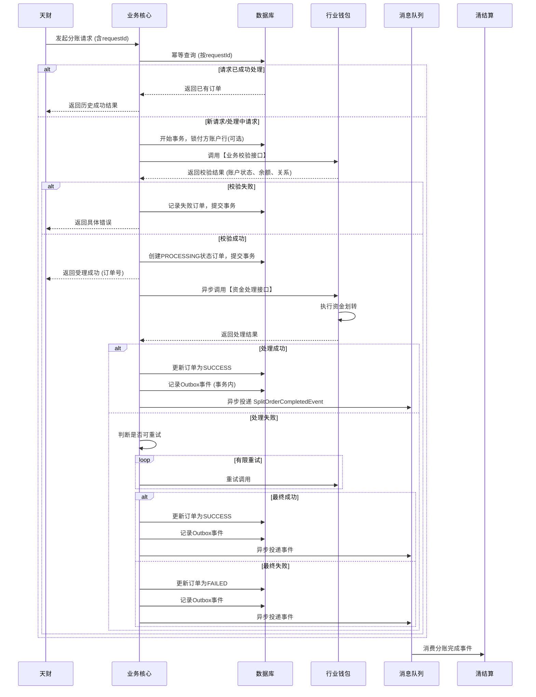
```mermaid
sequenceDiagram
    participant 天财
    participant 业务核心
    participant DB as 数据库
    participant 行业钱包
    participant MQ as 消息队列

    天财->>业务核心: 发起分账请求 (含requestId)
    业务核心->>DB: 幂等查询 (按requestId)
    alt 请求已成功处理
        DB-->>业务核心: 返回已有订单
        业务核心-->>天财: 返回历史成功结果
    else 新请求/处理中请求
        业务核心->>DB: 开始事务，锁付方账户行(可选)
        业务核心->>行业钱包: 调用【业务校验接口】
        行业钱包-->>业务核心: 返回校验结果 (账户状态、余额、关系)
        alt 校验失败
            业务核心->>DB: 记录失败订单，提交事务
            业务核心-->>天财: 返回具体错误
        else 校验成功
            业务核心->>DB: 创建PROCESSING状态订单，提交事务
            业务核心-->>天财: 返回受理成功 (订单号)
            业务核心->>行业钱包: 异步调用【资金处理接口】
            行业钱包->>行业钱包: 执行资金划转
            行业钱包-->>业务核心: 返回处理结果
            alt 处理成功
                业务核心->>DB: 更新订单为SUCCESS
                业务核心->>DB: 记录Outbox事件 (事务内)
                业务核心->>MQ: 异步投递 SplitOrderCompletedEvent
            else 处理失败
                业务核心->>业务核心: 判断是否可重试
                loop 有限重试
                    业务核心->>行业钱包: 重试调用
                end
                alt 最终成功
                    业务核心->>DB: 更新订单为SUCCESS
                    业务核心->>DB: 记录Outbox事件
                    业务核心->>MQ: 异步投递事件
                else 最终失败
                    业务核心->>DB: 更新订单为FAILED
                    业务核心->>DB: 记录Outbox事件
                    业务核心->>MQ: 异步投递事件
                end
            end
        end
    end
    MQ->>清结算: 消费分账完成事件
```

### 6. 错误处理
- **预期错误情况**:
  1. **客户端错误**: 请求参数非法、`requestId`格式错误、业务场景不支持。
  2. **业务校验错误**: 账户不存在、账户冻结、余额不足、绑定关系无效（由行业钱包返回）。
  3. **系统间调用错误**: 调用行业钱包系统超时、服务不可用、网络异常。
  4. **资金处理错误**: 行业钱包处理失败（如账务核心记账失败、账户状态变更）。
- **处理策略**:
  - **参数与业务校验错误**: 立即失败，向天财返回明确的错误码和提示，不进行重试。
  - **下游系统调用失败**:
    - **重试策略**: 仅对网络超时、服务暂时不可用（5xx错误）进行重试。采用指数退避策略，最大重试次数为3次。
    - **幂等性**: 调用行业钱包资金处理接口时，携带业务核心生成的唯一`order_no`，确保行业钱包侧幂等处理。
    - **最终失败处理**: 重试耗尽后仍失败，将订单标记为`FAILED`，记录详细错误信息，并发布失败事件。同时触发监控告警，支持人工介入排查。
  - **数据一致性**: 通过本地事务保证订单状态与Outbox事件的原子性。资金操作的一致性由行业钱包系统保障。

### 7. 依赖关系
- **上游模块**:
  - **天财平台**: 业务请求的发起方。依赖其提供合规、准确的业务请求。
- **下游模块**:
  - **行业钱包系统**: **强依赖**。提供账户校验与资金处理能力。业务核心的所有关键业务操作均通过调用其接口完成。
  - **清结算系统**: **弱依赖（事件驱动）**。通过异步事件接收分账完成通知，用于后续清分、结算等处理。业务核心不依赖其响应。
- **内部依赖**:
  - **数据库**: 用于持久化分账订单、实现幂等与状态机。
  - **消息中间件**: 用于可靠地投递领域事件。

<a id="module-11"></a>

## 3.11 认证系统


### 1. 概述
- **目的与范围**: 认证系统负责提供身份核验服务，通过打款验证和人脸验证接口，确认账户归属及个人身份的一致性，为关系绑定、开通付款等业务流程提供安全保障。其边界限定于接收认证请求、调用外部服务（如银行打款、人脸识别）进行验证，并返回验证结果。

### 2. 接口设计
- **API端点 (REST/GraphQL)**:
    - `POST /api/v1/verify/payment` (打款验证)
    - `POST /api/v1/verify/face` (人脸验证)
- **请求/响应结构**:
    - **打款验证请求**:
        - `requestId` (string): 请求唯一标识，用于幂等性控制。
        - `institutionId` (string): 机构号，标识发起认证的业务主体。
        - `bankCardNo` (string): 目标银行卡号。
        - `name` (string): 持卡人姓名。
        - `idCardNo` (string): 持卡人身份证号。
    - **打款验证响应**:
        - `verificationId` (string): 本次验证任务唯一标识。
        - `status` (string): 状态（`PENDING`， `SUCCESS`， `FAILED`）。
        - `message` (string): 状态描述。
    - **人脸验证请求**:
        - `requestId` (string): 请求唯一标识，用于幂等性控制。
        - `institutionId` (string): 机构号。
        - `name` (string): 姓名。
        - `idCardNo` (string): 身份证号。
        - `faceImage` (string): Base64编码的人脸图像数据或视频帧。
    - **人脸验证响应**:
        - `verificationId` (string): 本次验证任务唯一标识。
        - `status` (string): 状态（`SUCCESS`， `FAILED`）。
        - `score` (number): 比对相似度分数（可选）。
        - `message` (string): 状态描述。
- **发布/消费的事件**:
    - **发布事件**:
        - `VerificationCompleted`: 当任一验证流程完成（成功或失败）时发布，包含 `verificationId`， `type`， `status`， `institutionId`。
    - **消费事件**: TBD

### 3. 数据模型
- **表/集合**:
    - **verification_request** (验证请求表):
        - `verification_id` (PK): 验证任务唯一标识。
        - `request_id` (UK): 客户端请求唯一标识，用于幂等。
        - `institution_id`: 机构号。
        - `type`: 验证类型 (`PAYMENT`, `FACE`)。
        - `status`: 当前状态 (`INITIATED`, `PENDING`, `SUCCESS`, `FAILED`)。
        - `target_info`: JSON字段，存储验证目标信息（如银行卡号、姓名、身份证号）。
        - `verification_data`: JSON字段，存储验证过程数据（如打款金额、人脸比对结果）。
        - `created_at`: 创建时间。
        - `updated_at`: 更新时间。
        - `expires_at`: 验证过期时间（如打款验证的有效期）。
- **关键字段**: 如上所述。
- **与其他模块的关系**: 为电子签约平台、三代（通过行业钱包间接调用）等模块提供身份认证服务。通过 `institution_id` 关联业务主体。

### 4. 业务逻辑
- **核心工作流/算法**:
    1.  **打款验证**:
        - 接收请求后，生成唯一 `verification_id`， 状态置为 `INITIATED`。
        - 生成一个随机金额（例如：0.01元至1.00元之间，保留两位小数），并安全存储于 `verification_data` 中。
        - 调用银行通道接口，请求向目标银行卡打入该随机金额。
        - 若打款成功，状态更新为 `PENDING`， 并设置 `expires_at`（如24小时后）。
        - 等待用户回填金额。收到回填请求后，从 `verification_data` 中取出原始金额进行比对。
        - 比对成功则状态更新为 `SUCCESS`， 失败则更新为 `FAILED`。发布 `VerificationCompleted` 事件。
    2.  **人脸验证**:
        - 接收请求后，生成唯一 `verification_id`， 状态置为 `INITIATED`。
        - 调用第三方人脸识别服务，传入姓名、身份证号和人脸图像进行比对。
        - 接收比对结果（含相似度分数）。根据预设阈值（如分数 >= 0.8）判断是否通过。
        - 通过则状态更新为 `SUCCESS`， 否则为 `FAILED`。将结果存入 `verification_data`。发布 `VerificationCompleted` 事件。
- **业务规则与验证**:
    - 所有验证请求必须包含有效的 `institution_id`（机构号）和用于幂等的 `request_id`。
    - 打款验证的随机金额生成需使用安全的随机数生成器，并在验证完成或过期后安全清理。
    - 人脸验证需符合相关隐私与安全法规，人脸图像数据在验证完成后的一段合规保留期后应被匿名化或删除。
    - 验证请求和结果数据需加密存储。
- **关键边界情况处理**:
    - **外部服务不可用**: 对银行通道、人脸识别服务的调用实施指数退避重试（最多3次）。若最终失败，将验证状态置为 `FAILED`， 并记录详细错误日志。
    - **验证超时**: 打款验证设有 `expires_at`， 定时任务会扫描过期任务，自动将状态置为 `FAILED`。
    - **多次输入错误**: 对同一 `verification_id` 的回填金额验证设置尝试次数限制（如3次），超过后锁定并置为 `FAILED`。
    - **幂等性**: 基于 `request_id` 实现请求幂等，防止重复创建验证任务。

### 5. 时序图

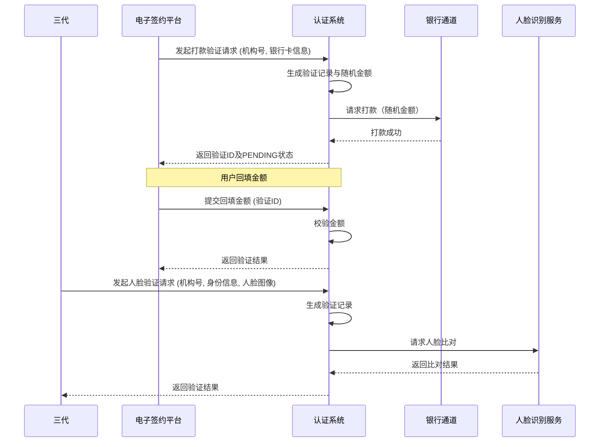
```mermaid
sequenceDiagram
    participant 三代
    participant 电子签约平台
    participant 认证系统
    participant 银行通道
    participant 人脸识别服务

    电子签约平台->>认证系统: 发起打款验证请求 (机构号, 银行卡信息)
    认证系统->>认证系统: 生成验证记录与随机金额
    认证系统->>银行通道: 请求打款（随机金额）
    银行通道-->>认证系统: 打款成功
    认证系统-->>电子签约平台: 返回验证ID及PENDING状态

    Note over 电子签约平台, 认证系统: 用户回填金额
    电子签约平台->>认证系统: 提交回填金额 (验证ID)
    认证系统->>认证系统: 校验金额
    认证系统-->>电子签约平台: 返回验证结果

    三代->>认证系统: 发起人脸验证请求 (机构号, 身份信息, 人脸图像)
    认证系统->>认证系统: 生成验证记录
    认证系统->>人脸识别服务: 请求人脸比对
    人脸识别服务-->>认证系统: 返回比对结果
    认证系统-->>三代: 返回验证结果
```

### 6. 错误处理
- **预期错误情况**:
    - 外部服务调用失败（网络超时、服务异常）。
    - 输入信息不合法（如身份证格式错误、银行卡号无效）。
    - 验证失败（金额不符、人脸比对不通过）。
    - 重复请求（`request_id` 已存在）。
    - 验证任务已过期。
- **处理策略**:
    - 对可重试错误（如网络超时）实施指数退避重试，重试次数上限为3次。
    - 对业务逻辑错误（如验证失败、信息不合法）返回明确的错误码和提示信息，不重试。
    - 对重复请求，返回已存在的验证任务状态。
    - 所有错误均记录详细的错误日志，包含 `verification_id`， `institution_id` 和错误上下文，用于监控和审计。
    - 定义监控指标，如验证成功率、各阶段耗时、外部服务错误率。

### 7. 依赖关系
- **上游模块/调用方**: 电子签约平台（在签约流程中调用）、三代（在关系绑定流程中调用）。
- **下游服务/被调用方**: 银行通道（打款服务）、第三方人脸识别服务。
- **内部依赖**: 数据库（存储验证记录）、消息队列（发布事件）。

<a id="module-12"></a>

## 3.12 交易系统


### 1. 概述
- **目的与范围**：本模块作为业务入口，负责接收并处理来自**天财**的业务交易数据，包括**分账**、**会员结算**、**批量付款**等场景。核心职责是进行请求编排、状态管理与持久化，并将核心业务处理请求转发至**行业钱包**等下游系统。本模块是交易的编排者与状态管理者，负责维护交易的最终状态记录。

### 2. 接口设计
- **API端点 (REST)**：
    - `POST /api/v1/transactions/split`: 处理天财分账请求。
    - `POST /api/v1/transactions/member-settlement`: 处理会员结算请求。
    - `POST /api/v1/transactions/batch-payment`: 处理批量付款请求。
    - `GET /api/v1/transactions/{transactionId}`: 查询交易状态。
- **请求/响应结构**：
    - 请求公共字段：`appId`（对应三代机构号）、`requestId`（请求唯一标识，用于幂等）、`timestamp`、`signature`（签名）。
    - 响应公共字段：`code`、`message`、`data`。`data`中包含`transactionId`（本系统交易流水号）、`status`。
    - 具体业务请求字段：TBD（根据分账、结算、付款场景细化）。
- **发布/消费的事件**：
    - 消费事件：TBD（例如，消费来自行业钱包的交易处理结果事件）。
    - 发布事件：`TransactionCreated`（交易创建）、`TransactionStatusUpdated`（交易状态更新）。事件负载包含`transactionId`, `type`, `fromStatus`, `toStatus`, `timestamp`。

### 3. 数据模型
- **表/集合**：
    - **交易主表 (`transaction_log`)**：系统核心表，记录所有交易的完整生命周期。
    - **交易明细表 (`transaction_detail`)**：记录交易的详细构成，如批量付款中的每笔子交易。
    - **幂等控制表 (`idempotent_key`)**：用于保证请求的幂等性。
- **关键字段**：
    - `transaction_log`：`id`（主键，交易流水号）、`app_id`、`request_id`（天财请求ID）、`type`（交易类型）、`status`（状态）、`request_body`（原始请求）、`response_to_tiancai`（给天财的响应）、`wallet_request`（发往行业钱包的请求）、`wallet_response`（行业钱包的响应）、`retry_count`、`next_retry_time`、`created_at`、`updated_at`。
    - `transaction_detail`：`id`、`transaction_id`（外键）、`detail_seq`（明细序号）、`payer_info`（付款方信息）、`payee_info`（收款方信息）、`amount`、`detail_status`、`fail_reason`。
    - `idempotent_key`：`key`（唯一索引，由`app_id`和`request_id`组成）、`transaction_id`、`created_at`。
- **与其他模块的关系**：
    - 本模块是交易的发起方与状态管理者，通过`app_id`关联**三代**分配的机构号。
    - 本模块调用**行业钱包**执行核心业务逻辑（如分账校验、计费）。
    - 交易完成后，本模块将交易结果数据同步给**业务核心**，由业务核心进行后续业务处理。**业务核心**是交易数据的接收方，非持久化责任方。本模块的`transaction_log`表是交易的系统记录。

### 4. 业务逻辑
- **核心工作流/算法**：
    1.  **请求接收与幂等校验**：接收天财请求，提取`app_id`和`request_id`，查询幂等表。若已存在记录，则直接返回已存储的响应。
    2.  **认证与基础校验**：
        - 认证：验证请求签名，确认请求来源于合法的`app_id`（对应天财下的机构号）。
        - 校验：检查请求参数格式、必填字段、金额有效性等。
    3.  **交易记录创建**：校验通过后，在`transaction_log`表中创建状态为`PROCESSING`的记录。
    4.  **请求转发与执行**：构建符合**行业钱包**接口规范的请求体，进行同步或异步调用。对于批量付款，可能拆分为多个子请求并记录于明细表。
    5.  **状态管理与更新**：根据行业钱包的响应，更新交易主表及明细表的状态（如`SUCCESS`、`PARTIAL_SUCCESS`、`FAILED`）。对于异步处理，需提供状态查询接口。
    6.  **响应返回**：向天财返回包含本系统`transactionId`和当前状态的响应。
- **业务规则与验证**：
    - 权限校验：验证`app_id`是否有权限执行当前交易类型（如分账、批量付款）。
    - 业务校验：部分校验依赖下游（行业钱包），本系统仅做基础格式校验。
- **关键边界情况处理**：
    - **幂等性**：通过`app_id` + `request_id`唯一键保证，防止重复交易。
    - **重试机制**：对调用行业钱包的网络超时或暂时性失败，根据配置的重试策略（如指数退避）进行自动重试，并更新`retry_count`。
    - **熔断机制**：当行业钱包服务失败率达到阈值时，触发熔断，快速失败并告警。
    - **长事务状态管理**：对于批量付款等长事务，通过`transaction_log.status`和`transaction_detail.detail_status`跟踪整体与子项进度，支持部分成功。
    - **状态可追溯**：所有状态变更、请求与响应原始数据均持久化在`transaction_log`表中，并提供查询接口。

### 5. 时序图

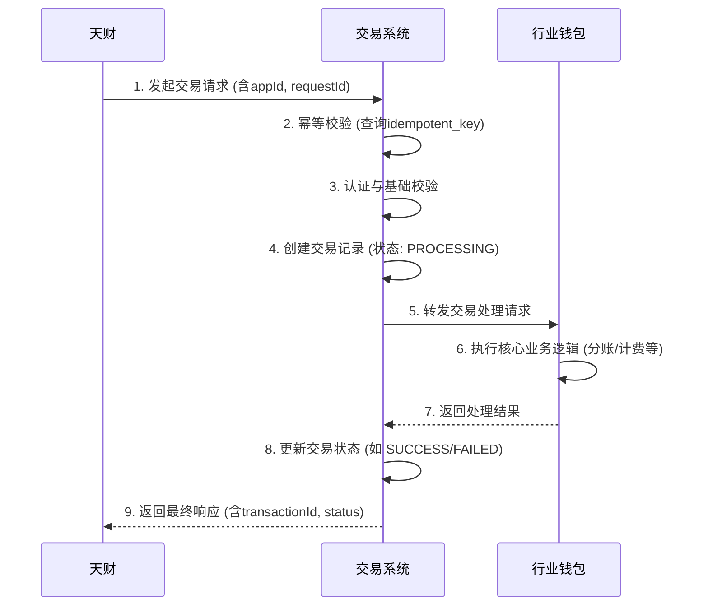
```mermaid
sequenceDiagram
    participant 天财
    participant 交易系统
    participant 行业钱包

    天财->>交易系统: 1. 发起交易请求 (含appId, requestId)
    交易系统->>交易系统: 2. 幂等校验 (查询idempotent_key)
    交易系统->>交易系统: 3. 认证与基础校验
    交易系统->>交易系统: 4. 创建交易记录 (状态: PROCESSING)
    交易系统->>行业钱包: 5. 转发交易处理请求
    行业钱包->>行业钱包: 6. 执行核心业务逻辑 (分账/计费等)
    行业钱包-->>交易系统: 7. 返回处理结果
    交易系统->>交易系统: 8. 更新交易状态 (如 SUCCESS/FAILED)
    交易系统-->>天财: 9. 返回最终响应 (含transactionId, status)
```

### 6. 错误处理
- **预期错误情况**：
    1.  **客户端错误**：请求参数无效、签名错误、`app_id`无权限、幂等冲突。
    2.  **下游依赖错误**：调用行业钱包网络超时、服务不可用、返回业务逻辑失败。
    3.  **系统内部错误**：数据库异常、内部处理逻辑错误。
- **处理策略**：
    - **客户端错误**：立即返回4xx错误，包含明确错误码和信息，不进行重试。
    - **下游依赖错误**：
        - 网络超时/暂时性失败：根据配置策略（如最多3次，指数退避）自动重试。重试失败后，将交易状态置为`FAILED`并记录错误原因。
        - 服务不可用/业务失败：触发熔断器，短时间内快速失败，并产生告警通知运维。交易状态置为`FAILED`。
    - **系统内部错误**：记录详细错误日志，交易状态置为`FAILED`，返回5xx错误给天财。需配置监控告警。
    - **人工干预**：对于最终状态为`FAILED`或长时间`PROCESSING`的交易，提供管理界面供运营人员查询详情并决定是否手动重试或冲正。

### 7. 依赖关系
- **上游模块**：**天财**（业务发起方）。
- **下游模块**：
    - **行业钱包**：核心业务处理依赖，执行分账校验、计费等。
    - **业务核心**：交易结果数据接收方。
- **内部依赖**：数据库（用于持久化交易记录、幂等键）。

<a id="module-13"></a>

## 3.13 代付系统


### 1. 概述
- **目的与范围**: 本模块负责处理“批量付款”（批付）业务场景。其核心职责是接收来自“天财”平台的批量付款指令，协调完成付款方授权验证、资金从付款方账户（天财收款账户）向多个接收方账户（天财收款账户或天财接收方账户）的划转，并处理相关手续费。其边界止于向账户系统发起扣款和加款指令，不涉及底层账户操作、记账及外部银行通道的执行。

### 2. 接口设计
- **API端点 (REST/GraphQL)**:
    - `POST /api/v1/batch-payments`: 接收批量付款请求。
    - `GET /api/v1/batch-payments/{batchId}`: 查询批次处理状态及结果。
- **请求/响应结构**:
    - 请求体 (`BatchPaymentRequest`):
        - `batchId` (String): 批次唯一标识，用于幂等性控制。
        - `payerInstitutionNo` (String): 付款方机构号。
        - `payerAccountType` (String): 付款方账户类型（如“天财收款账户”）。
        - `items` (Array<`PaymentItem`>): 付款明细列表。
            - `itemId` (String): 明细项ID。
            - `payeeInstitutionNo` (String): 收款方机构号。
            - `payeeAccountType` (String): 收款方账户类型（“天财收款账户”或“天财接收方账户”）。
            - `amount` (BigDecimal): 付款金额（本金）。
        - `bizContext` (Object): 业务扩展信息。
    - 响应体 (`BatchPaymentResponse`):
        - `code` (String): 处理结果码。
        - `message` (String): 处理结果描述。
        - `data` (`BatchResult`): 批次结果详情。
            - `batchId` (String): 批次ID。
            - `status` (String): 批次状态（PROCESSING/SUCCESS/PARTIAL_SUCCESS/FAILED）。
            - `totalAmount` (BigDecimal): 批次总金额（本金）。
            - `feeAmount` (BigDecimal): 手续费金额。
            - `items` (Array<`ItemResult`>): 各明细项处理结果。
- **发布/消费的事件**:
    - 消费事件: TBD（从天财接收付款指令的事件定义）。
    - 发布事件: `BatchPaymentCompletedEvent`（批次处理完成时发布，包含批次ID、状态、成功/失败明细摘要）。

### 3. 数据模型
- **表/集合**:
    - `payment_batch` (付款批次主表):
        - `batch_id` (PK, String): 批次唯一ID，与请求中的`batchId`一致。
        - `payer_institution_no` (String): 付款方机构号。
        - `payer_account_no` (String): 付款方账户号。
        - `total_principal` (Decimal): 批次总本金。
        - `total_fee` (Decimal): 批次总手续费。
        - `status` (String): 批次状态（INIT/CHECKING/FEE_CALCULATED/BALANCE_CHECKED/TRANSFERRING/FEE_DEDUCTING/COMPLETED/FAILED）。
        - `error_code` (String): 批次级错误码。
        - `error_message` (Text): 批次级错误信息。
        - `created_at` (DateTime): 创建时间。
        - `updated_at` (DateTime): 更新时间。
    - `payment_item` (付款明细表):
        - `id` (PK, BigInt): 自增主键。
        - `batch_id` (FK, String): 关联批次ID。
        - `item_id` (String): 明细项ID。
        - `payee_institution_no` (String): 收款方机构号。
        - `payee_account_no` (String): 收款方账户号。
        - `principal_amount` (Decimal): 付款本金。
        - `status` (String): 明细状态（PENDING/SUCCESS/FAILED）。
        - `error_code` (String): 明细错误码。
        - `error_message` (Text): 明细错误信息。
        - `account_transaction_ref` (String): 账户系统交易流水号，用于冲正。
        - `created_at` (DateTime): 创建时间。
        - `updated_at` (DateTime): 更新时间。
    - `idempotency_record` (幂等性记录表):
        - `biz_serial_no` (PK, String): 业务流水号（此处使用`batch_id`）。
        - `processor` (String): 处理器标识（如“batch_payment”）。
        - `result_code` (String): 已处理结果码。
        - `result_data` (Text): 已处理结果数据快照（JSON）。
        - `created_at` (DateTime): 创建时间。
- **关键字段**: 如上所述，重点关注`batch_id`（幂等键）、各状态字段、错误信息字段及账户交易流水号。
- **与其他模块的关系**: 依赖“账户系统”进行账户余额操作，依赖“计费中台”计算手续费，依赖“电子签约平台”完成“开通付款”的授权签约流程（但“开通付款”状态的最终来源为“账户系统”或“行业钱包”维护的关系绑定状态，需澄清）。

### 4. 业务逻辑
- **核心工作流/算法**:
    1.  **接收与幂等校验**: 接收请求，以`batchId`为键查询`idempotency_record`表。若存在成功记录，直接返回历史结果；若存在处理中记录，返回处理中状态；否则，插入记录并开始处理。
    2.  **权限与状态校验**: 校验付款方（总部或门店）是否已完成“开通付款”流程。**澄清**: “开通付款”状态应由“账户系统”或“行业钱包”在关系绑定时设置并维护，本系统通过查询其提供的API或数据状态进行校验。
    3.  **计算手续费**: 调用“计费中台”计算本次批量付款交易的总手续费。
    4.  **资金总额校验**: 计算批次总本金加总手续费，调用“账户系统”校验付款方账户（天财收款账户）余额是否充足。
    5.  **执行付款（Saga模式）**:
        - a. 批次状态置为`TRANSFERRING`。
        - b. **循环处理每一条付款明细**:
            - i. 调用“账户系统”从付款方账户扣减该笔本金，获取交易流水号。
            - ii. 若扣款成功，调用“账户系统”向接收方账户增加等额本金。
            - iii. 根据上述两步结果更新明细状态（`SUCCESS`或`FAILED`），记录错误信息及成功交易的流水号。
            - iv. **若加款失败，则触发对本笔已扣本金的冲正（Compensating Transaction）**，调用账户系统进行反向操作，并将明细状态置为`FAILED`。
        - c. 循环结束后，汇总明细状态。
    6.  **扣除手续费**: 若所有本金转账均成功（或部分成功但已处理完冲正），调用“计费中台”从付款方账户扣除总手续费。
    7.  **结果汇总与状态更新**: 更新批次最终状态（`SUCCESS`/`PARTIAL_SUCCESS`/`FAILED`），更新幂等性记录，发布完成事件，并反馈结果。
- **业务规则与验证**:
    - 付款方必须是已开立“天财收款账户”的“总部”或“门店”。
    - 付款方必须已完成与目标接收方的“开通付款”授权（状态来源为下游系统）。
    - **账户类型澄清**: 接收方可以是“天财收款账户”（对应收单商户）或“天财接收方账户”（对应非收单商户或个人）。本系统不校验对方是否为收单商户，仅依据下游系统提供的账户类型和状态进行操作。
    - 付款总额需包含由“计费中台”计算的手续费，并在转账前进行余额校验。
    - 采用Saga模式处理部分失败，确保单笔转账的原子性（扣款+加款）或可冲正性。
- **关键边界情况处理**:
    - **部分失败**: 如上所述，采用Saga模式。单笔明细加款失败时，立即冲正对应扣款。批次最终状态根据成功明细数判断。
    - **余额不足**: 在步骤4进行总额预校验，若不足，整个批次标记为`FAILED`，不执行任何转账。
    - **重复请求**: 通过`batchId`在`idempotency_record`表实现幂等。
    - **下游系统调用失败**: 对账户系统和计费中台的调用配置重试机制（见错误处理章节）。若重试后仍失败，标记该操作失败，并根据Saga逻辑决定是否冲正。

### 5. 时序图

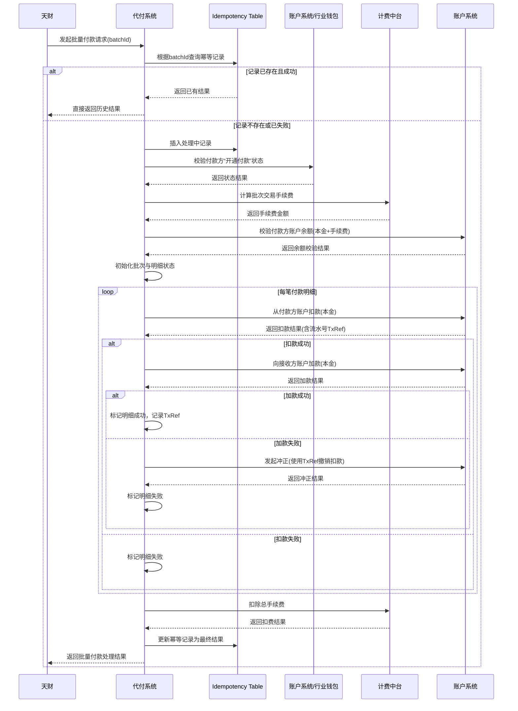
```mermaid
sequenceDiagram
    participant T as 天财
    participant P as 代付系统
    participant IPT as Idempotency Table
    participant AS as 账户系统/行业钱包
    participant F as 计费中台
    participant A as 账户系统

    T->>P: 发起批量付款请求(batchId)
    P->>IPT: 根据batchId查询幂等记录
    alt 记录已存在且成功
        IPT-->>P: 返回已有结果
        P-->>T: 直接返回历史结果
    else 记录不存在或已失败
        P->>IPT: 插入处理中记录
        P->>AS: 校验付款方“开通付款”状态
        AS-->>P: 返回状态结果
        P->>F: 计算批次交易手续费
        F-->>P: 返回手续费金额
        P->>A: 校验付款方账户余额(本金+手续费)
        A-->>P: 返回余额校验结果
        P->>P: 初始化批次与明细状态
        loop 每笔付款明细
            P->>A: 从付款方账户扣款(本金)
            A-->>P: 返回扣款结果(含流水号TxRef)
            alt 扣款成功
                P->>A: 向接收方账户加款(本金)
                A-->>P: 返回加款结果
                alt 加款成功
                    P->>P: 标记明细成功，记录TxRef
                else 加款失败
                    P->>A: 发起冲正(使用TxRef撤销扣款)
                    A-->>P: 返回冲正结果
                    P->>P: 标记明细失败
                end
            else 扣款失败
                P->>P: 标记明细失败
            end
        end
        P->>F: 扣除总手续费
        F-->>P: 返回扣费结果
        P->>IPT: 更新幂等记录为最终结果
        P-->>T: 返回批量付款处理结果
    end
```

### 6. 错误处理
- **预期错误情况**:
    - 付款方未开通付款权限。
    - 付款方账户余额不足。
    - 接收方账户状态异常（如冻结、注销）。
    - 账户系统操作（扣款、加款、冲正）超时或失败。
    - 计费系统调用失败。
    - 网络超时或系统内部异常。
- **处理策略**:
    - **业务校验失败**（如权限、余额不足）：立即终止流程，批次状态置为`FAILED`，返回明确错误码。
    - **下游系统调用失败**：
        - **重试策略**: 对账户系统、计费中台的调用实施指数退避重试（如最多3次，间隔1s, 2s, 4s）。仅对网络超时、5xx错误等可重试错误进行重试。
        - **补偿机制**:
            - 单笔明细加款失败：立即调用账户系统的冲正接口，撤销本笔扣款。冲正操作本身也需配置重试。
            - 手续费扣除失败：若所有本金转账已处理完毕（含冲正），但手续费扣除失败，批次状态标记为`PARTIAL_SUCCESS`（本金成功但手续费未扣），记录错误，并触发告警以便人工干预。
        - **最终失败处理**: 经过重试和补偿后仍失败的操作，记录详细错误原因（系统、错误码、时间），更新对应明细或批次状态为`FAILED`。支持通过人工查询错误日志后进行后续处理。
    - **幂等性保障**: 任何非初始状态的错误（如重试过程中），需确保再次收到相同`batchId`请求时，能通过幂等表返回正确的中途状态或最终状态，避免重复执行。

### 7. 依赖关系
- **上游模块**: 天财（业务发起方）。
- **下游模块**:
    - **账户系统**: 执行账户余额查询、扣款、加款、冲正操作。是账户余额和“开通付款”绑定状态的权威来源之一（需与行业钱包明确）。
    - **计费中台**: 计算并扣除批量付款手续费。
    - **电子签约平台**: 为“开通付款”流程提供签约能力，但签约完成后的状态应同步至账户系统或行业钱包供本系统查询。
- **澄清点**:
    - “开通付款”状态管理：需与架构组明确，该状态是由“账户系统”在关系绑定成功时标记，还是由“行业钱包”维护。本系统将依赖其提供的查询接口。
    - 账户类型校验：本系统不直接校验“收单商户”资质，仅依据请求中的账户类型和下游系统返回的账户状态进行操作。账户类型的合法性由开户流程保证。

<a id="module-14"></a>

## 3.14 风控


### 1. 概述
- **目的与范围**: 本模块负责对天财账户及交易进行风险监控与处置。核心职责包括接收风控指令，对已结算至天财收款账户的特定交易资金进行冻结，以及对收单商户对应的天财收款账户进行冻结。本模块不涉及风险规则的制定与评估，仅执行上游系统发起的冻结指令。

### 2. 接口设计
- **API端点 (REST/GraphQL)**:
    1.  **交易冻结接口**:
        - 路径: `/api/v1/risk-control/transaction-freeze`
        - 方法: `POST`
        - 描述: 接收指令，对特定交易资金进行冻结。
    2.  **商户冻结接口**:
        - 路径: `/api/v1/risk-control/merchant-freeze`
        - 方法: `POST`
        - 描述: 接收指令，对商户对应的天财收款账户进行冻结。
    3.  **冻结查询接口**:
        - 路径: `/api/v1/risk-control/freeze-records/{freezeOrderId}`
        - 方法: `GET`
        - 描述: 根据冻结指令ID查询冻结执行结果。
- **请求/响应结构**:
    - **交易冻结请求**:
        ```json
        {
          "requestId": "string, 请求唯一标识，用于幂等",
          "merchantId": "string, 收单商户ID",
          "transactionId": "string, 待冻结的交易ID",
          "freezeAmount": "number, 冻结金额",
          "freezeReason": "string, 冻结原因"
        }
        ```
    - **商户冻结请求**:
        ```json
        {
          "requestId": "string, 请求唯一标识，用于幂等",
          "merchantId": "string, 收单商户ID",
          "freezeReason": "string, 冻结原因"
        }
        ```
    - **通用响应**:
        ```json
        {
          "code": "string, 响应码",
          "message": "string, 响应消息",
          "data": {
            "freezeOrderId": "string, 本系统生成的冻结指令ID",
            "status": "string, 冻结状态 (PROCESSING/SUCCESS/FAILED)"
          }
        }
        ```
- **发布/消费的事件**: TBD

### 3. 数据模型
- **表/集合**:
    1.  **冻结指令表 (freeze_order)**:
        - 存储接收到的原始冻结指令及处理状态。
    2.  **冻结记录表 (freeze_record)**:
        - 存储每次冻结操作（交易或账户）的执行记录。
- **关键字段**:
    - **freeze_order 表**:
        - `id`: 主键，本系统生成的冻结指令ID。
        - `request_id`: 上游请求ID，用于幂等控制，唯一索引。
        - `merchant_id`: 收单商户ID。
        - `transaction_id`: 交易ID（仅交易冻结）。
        - `freeze_amount`: 冻结金额（仅交易冻结）。
        - `freeze_reason`: 冻结原因。
        - `freeze_type`: 冻结类型 (`TRANSACTION` / `MERCHANT`)。
        - `status`: 指令状态 (`RECEIVED` / `PROCESSING` / `SUCCESS` / `FAILED`)。
        - `target_account_id`: 目标天财收款账户ID（处理时填充）。
        - `created_at`: 创建时间。
        - `updated_at`: 更新时间。
    - **freeze_record 表**:
        - `id`: 主键。
        - `freeze_order_id`: 外键，关联冻结指令。
        - `account_id`: 被冻结的账户ID（天财收款账户）。
        - `frozen_balance`: 被冻结的余额（交易冻结时为特定金额，商户冻结时为0，表示账户级冻结）。
        - `operation`: 操作类型 (`FREEZE_TRANSACTION` / `FREEZE_ACCOUNT`)。
        - `result`: 操作结果 (`SUCCESS` / `FAILED`)。
        - `error_message`: 失败时的错误信息。
        - `created_at`: 创建时间。
- **与其他模块的关系**: 本模块执行冻结操作时，需调用账户系统对账户进行冻结或标记。通过 `merchant_id` 或 `transaction_id` 查询清结算或业务核心系统，以定位目标天财收款账户。

### 4. 业务逻辑
- **核心工作流/算法**:
    1.  **交易冻结流程**:
        - 接收风控发起的交易冻结指令。
        - **幂等检查**: 根据请求中的 `requestId` 查询 `freeze_order` 表。若已存在相同 `requestId` 的记录，则直接返回已有的处理结果。
        - **定位目标账户与资金**:
            - 根据请求中的 `transactionId`，调用**清结算系统**的查询接口，获取该交易结算后的资金所在的天财收款账户ID (`target_account_id`) 及可冻结的余额。
            - 验证指定交易资金是否已结算至目标账户且未被冻结。
        - **并发控制**: 对目标账户ID采用乐观锁机制（如通过版本号），防止并发冻结导致超额冻结。
        - **调用账户系统**:
            - 调用账户系统的**资金冻结接口**，传入账户ID和冻结金额，对账户内的特定资金进行冻结（交易级冻结）。
        - **记录结果**: 在 `freeze_record` 表中记录冻结操作详情，并更新 `freeze_order` 表状态。
    2.  **商户冻结流程**:
        - 接收风控发起的商户冻结指令。
        - **幂等检查**: 根据请求中的 `requestId` 查询 `freeze_order` 表。若已存在相同 `requestId` 的记录，则直接返回已有的处理结果。
        - **定位目标账户**:
            - 根据请求中的 `merchantId`，调用**清结算系统**或**行业钱包**的查询接口，获取该收单商户对应的天财收款账户ID (`target_account_id`)。
            - 验证目标账户是否存在且状态正常（未冻结）。
        - **并发控制**: 对目标账户ID采用乐观锁机制。
        - **调用账户系统**:
            - 调用账户系统的**账户冻结接口**，传入账户ID，对整个账户进行冻结（账户级冻结）。
        - **记录结果**: 在 `freeze_record` 表中记录冻结操作详情，并更新 `freeze_order` 表状态。
- **业务规则与验证**:
    - 执行冻结前，需验证目标账户（天财收款账户）是否存在且状态正常。
    - 执行交易冻结时，需验证指定交易资金是否已结算至目标账户且可冻结金额充足。
    - 所有冻结请求必须包含幂等键 (`requestId`)。
- **关键边界情况处理**:
    - 若目标账户不存在或已处于冻结状态，需记录日志并返回相应错误。
    - 若交易冻结时指定资金不足，需记录日志并返回相应错误。
    - 若下游系统（清结算、账户系统）调用超时或失败，根据错误类型进行有限次重试，重试失败后标记指令为失败。
    - 并发请求通过数据库乐观锁确保同一账户的冻结操作串行化。

### 5. 时序图

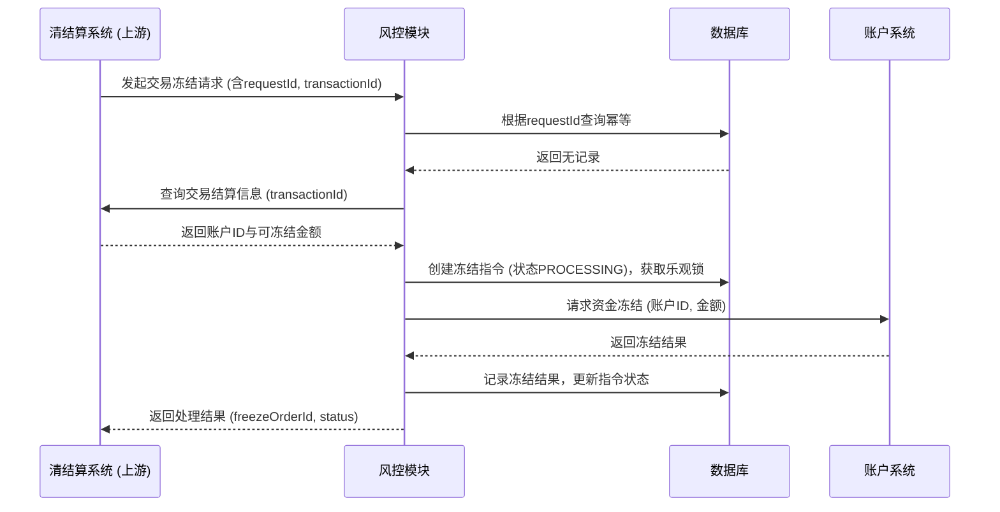
```mermaid
sequenceDiagram
    participant 清结算系统 as 清结算系统 (上游)
    participant 风控模块
    participant 数据库
    participant 账户系统

    清结算系统->>风控模块: 发起交易冻结请求 (含requestId, transactionId)
    风控模块->>数据库: 根据requestId查询幂等
    数据库-->>风控模块: 返回无记录
    风控模块->>清结算系统: 查询交易结算信息 (transactionId)
    清结算系统-->>风控模块: 返回账户ID与可冻结金额
    风控模块->>数据库: 创建冻结指令 (状态PROCESSING)，获取乐观锁
    风控模块->>账户系统: 请求资金冻结 (账户ID, 金额)
    账户系统-->>风控模块: 返回冻结结果
    风控模块->>数据库: 记录冻结结果，更新指令状态
    风控模块-->>清结算系统: 返回处理结果 (freezeOrderId, status)
```

```mermaid
sequenceDiagram
    participant 清结算系统 as 清结算系统 (上游)
    participant 风控模块
    participant 数据库
    participant 账户系统

    清结算系统->>风控模块: 发起商户冻结请求 (含requestId, merchantId)
    风控模块->>数据库: 根据requestId查询幂等
    数据库-->>风控模块: 返回无记录
    风控模块->>清结算系统: 查询商户账户信息 (merchantId)
    清结算系统-->>风控模块: 返回天财收款账户ID
    风控模块->>数据库: 创建冻结指令 (状态PROCESSING)，获取乐观锁
    风控模块->>账户系统: 请求账户冻结 (账户ID)
    账户系统-->>风控模块: 返回冻结结果
    风控模块->>数据库: 记录冻结结果，更新指令状态
    风控模块-->>清结算系统: 返回处理结果 (freezeOrderId, status)
```

### 6. 错误处理
- **预期错误情况**:
    - 目标账户不存在。
    - 目标账户已冻结。
    - 交易冻结时资金不足。
    - 调用下游系统（如清结算系统、账户系统）超时或失败。
    - 重复请求（幂等冲突）。
    - 乐观锁更新失败（并发冲突）。
- **处理策略**:
    - **幂等冲突**: 直接返回已存在的冻结指令处理结果。
    - **业务逻辑错误**（如账户不存在、已冻结、资金不足）: 记录详细日志，更新指令状态为`FAILED`，并向调用方返回明确的错误码和描述。
    - **并发冲突**: 返回“操作冲突，请稍后重试”错误，由上游决定是否重试。
    - **系统间调用失败**: 进行有限次重试（针对网络超时等临时性错误），重试失败后记录错误日志，更新指令状态为`FAILED`，并向上游返回系统错误。

### 7. 依赖关系
- **上游模块**: **清结算系统**（根据术语表，负责账户冻结及提供对账单数据，是风控指令的合理发起方）。
- **下游模块**:
    - **账户系统**（账户域）: 提供账户级和资金级的冻结能力。
    - **清结算系统**: 提供交易结算信息查询、商户-账户映射关系查询。
    - **行业钱包**: 作为备选，提供商户-账户映射关系查询。

---
# 4 接口设计
## 4.1 对外接口
本系统对外部系统（天财）暴露的接口如下。

| Method | Path | Module | Description | Request/Response |
| :--- | :--- | :--- | :--- | :--- |
| POST | TBD | 三代 | 接收天财发起的开户请求。 | TBD |
| POST | TBD | 三代 | 接收天财发起的账户关系绑定请求。 | TBD |
| POST | TBD | 三代 | 接收天财发起的业务开通（如开通付款）请求。 | TBD |
| POST | /api/v1/transactions/split | 交易系统 | 接收天财发起的单笔分账请求。 | TBD |
| POST | /api/v1/transactions/member-settlement | 交易系统 | 接收天财发起的会员结算请求。 | TBD |
| POST | /api/v1/transactions/batch-payment | 交易系统 | 接收天财发起的批量付款请求。 | TBD |
| GET | /api/v1/transactions/{transactionId} | 交易系统 | 供天财查询交易处理状态。 | TBD |

## 4.2 模块间接口
本系统内部各模块之间的关键调用接口如下。

| Method | Path | Module (调用方) | Description | Request/Response |
| :--- | :--- | :--- | :--- | :--- |
| POST | /v1/accounts | 三代 -> 行业钱包 | 调用钱包系统为商户开立天财收款账户或天财接收方账户。 | TBD |
| POST | /v1/bindings | 三代 -> 行业钱包 | 调用钱包系统建立总部与门店、或付款方与接收方之间的绑定关系。 | TBD |
| POST | /v1/split-requests | 业务核心 -> 行业钱包 | 调用钱包系统执行分账处理。 | TBD |
| GET | /v1/accounts/{accountNo}/balance | 行业钱包 -> 账户系统 | 查询指定账户的余额。 | TBD |
| PUT | /v1/accounts/{accountNo}/status | 行业钱包 -> 账户系统 | 更新账户状态（如冻结/解冻）。 | TBD |
| POST | /api/v1/settlement/execute | 交易系统 -> 清结算 | 请求执行交易清分与结算。 | TBD |
| POST | /api/v1/freeze/account | 风控 -> 清结算 | 请求执行商户账户冻结。 | TBD |
| POST | /api/v1/freeze/transaction | 风控 -> 清结算 | 请求执行特定交易资金冻结。 | TBD |
| GET | /api/v1/statement/data | 对账单系统 -> 清结算 | 查询对账单所需的原始数据。 | TBD |
| POST | /api/v1/accounting/entries | 账户系统 -> 账务核心 | 提交记账指令。 | TBD |
| POST | /api/v1/accounting/reversals/{original_biz_no} | 清结算 -> 账务核心 | 对指定原业务流水号的交易发起冲正。 | TBD |
| POST | /v1/contracts | 行业钱包 -> 电子签约平台 | 发起签约流程（用于关系绑定或开通付款）。 | TBD |
| POST | /v1/contracts/{contractId}/callback/auth | 电子签约平台 -> 认证系统 | 回调认证结果。 | TBD |
| POST | /v1/fee/calculate | 行业钱包 -> 计费中台 | 计算手续费。 | TBD |
| POST | /v1/fee/deduct | 计费中台 -> 账户系统 | 发起手续费扣减。 | TBD |
| POST | /api/v1/split-order | 交易系统 -> 业务核心 | 转发天财发起的单笔分账请求。 | TBD |
| POST | /api/v1/split-order/batch | 交易系统 -> 业务核心 | 转发天财发起的批量分账请求。 | TBD |
| POST | /api/v1/verify/payment | 电子签约平台 -> 认证系统 | 请求进行打款验证。 | TBD |
| POST | /api/v1/verify/face | 电子签约平台 -> 认证系统 | 请求进行人脸验证。 | TBD |
| POST | /api/v1/batch-payments | 交易系统 -> 代付系统 | 转发批量付款请求。 | TBD |
---
# 5 数据库设计
## 5.1 ER图
```mermaid
erDiagram
    wallet_account {
        string account_no PK
        string account_type
        string institution_no
        string status
        decimal balance
    }
    binding_relationship {
        string binding_id PK
        string payer_account_no FK
        string payee_account_no FK
        string relationship_type
        string status
    }
    split_record {
        string record_id PK
        string request_no
        string payer_account_no FK
        string payee_account_no FK
        decimal amount
        string status
    }
    settlement_record {
        string settlement_id PK
        string transaction_no
        string account_no FK
        decimal amount
        string settlement_type
    }
    fee_calculation {
        string fee_id PK
        string business_no
        string account_no FK
        decimal fee_amount
    }
    freeze_order {
        string freeze_order_id PK
        string target_type
        string target_id
        string status
    }
    accounting_ledger {
        string ledger_id PK
        string business_no
        string status
    }
    accounting_entry {
        string entry_id PK
        string ledger_id FK
        string account_no FK
        string direction
        decimal amount
    }
    contract_flow {
        string contract_id PK
        string business_no
        string status
    }
    evidence_chain {
        string evidence_id PK
        string contract_id FK
        string evidence_type
    }
    fee_rule {
        string rule_id PK
        string business_scene
        string fee_rate
    }
    billing_record {
        string record_id PK
        string business_no
        string account_no FK
        decimal fee_amount
    }
    split_order {
        string order_no PK
        string request_no
        string status
    }
    verification_request {
        string request_id PK
        string verification_type
        string status
    }
    transaction_log {
        string transaction_id PK
        string business_type
        string status
    }
    transaction_detail {
        string detail_id PK
        string transaction_id FK
        string payee_account_no FK
        decimal amount
    }
    payment_batch {
        string batch_id PK
        string status
    }
    payment_item {
        string item_id PK
        string batch_id FK
        string payee_account_no FK
        decimal amount
    }
    freeze_record {
        string record_id PK
        string freeze_order_id FK
        string account_no FK
        string status
    }

    wallet_account ||--o{ binding_relationship : "payer"
    wallet_account ||--o{ binding_relationship : "payee"
    wallet_account ||--o{ split_record : "payer"
    wallet_account ||--o{ split_record : "payee"
    wallet_account ||--o{ settlement_record : "account"
    wallet_account ||--o{ fee_calculation : "account"
    wallet_account ||--o{ accounting_entry : "account"
    wallet_account ||--o{ billing_record : "account"
    wallet_account ||--o{ transaction_detail : "payee"
    wallet_account ||--o{ payment_item : "payee"
    wallet_account ||--o{ freeze_record : "account"

    binding_relationship ||--o{ split_record : "authorizes"

    freeze_order ||--o{ freeze_record : "executes"

    accounting_ledger ||--o{ accounting_entry : "contains"

    contract_flow ||--o{ evidence_chain : "has"

    payment_batch ||--o{ payment_item : "contains"

    transaction_log ||--o{ transaction_detail : "contains"
```

## 5.2 表结构

| 表名 | 所属模块 | 主要字段（简述） | 关联关系（简述） |
| :--- | :--- | :--- | :--- |
| wallet_account | 行业钱包 | 账户号（主键）、账户类型、机构号、状态、余额 | 与binding_relationship、split_record、settlement_record等表关联 |
| binding_relationship | 行业钱包 | 绑定关系ID（主键）、付款方账户号、收款方账户号、关系类型、状态 | 关联wallet_account表（付款方、收款方） |
| split_record | 行业钱包 | 分账记录ID（主键）、请求流水号、付款方账户号、收款方账户号、金额、状态 | 关联wallet_account表（付款方、收款方） |
| settlement_record | 清结算 | 结算ID（主键）、交易流水号、账户号、金额、结算类型 | 关联wallet_account表 |
| fee_calculation | 清结算 | 手续费ID（主键）、业务流水号、账户号、手续费金额 | 关联wallet_account表 |
| freeze_order | 清结算/风控 | 冻结指令ID（主键）、目标类型、目标ID、状态 | 关联freeze_record表 |
| accounting_ledger | 账务核心 | 流水ID（主键）、业务流水号、状态 | 关联accounting_entry表 |
| accounting_entry | 账务核心 | 分录ID（主键）、流水ID、账户号、借贷方向、金额 | 关联accounting_ledger表和wallet_account表 |
| contract_flow | 电子签约平台 | 合约ID（主键）、业务流水号、状态 | 关联evidence_chain表 |
| evidence_chain | 电子签约平台 | 证据ID（主键）、合约ID、证据类型 | 关联contract_flow表 |
| fee_rule | 计费中台 | 规则ID（主键）、业务场景、费率 | TBD |
| billing_record | 计费中台 | 流水ID（主键）、业务流水号、账户号、手续费金额 | 关联wallet_account表 |
| split_order | 业务核心 | 订单号（主键）、请求流水号、状态 | TBD |
| verification_request | 认证系统 | 请求ID（主键）、验证类型、状态 | TBD |
| transaction_log | 交易系统 | 交易ID（主键）、业务类型、状态 | 关联transaction_detail表 |
| transaction_detail | 交易系统 | 明细ID（主键）、交易ID、收款方账户号、金额 | 关联transaction_log表和wallet_account表 |
| payment_batch | 代付系统 | 批次ID（主键）、状态 | 关联payment_item表 |
| payment_item | 代付系统 | 明细ID（主键）、批次ID、收款方账户号、金额 | 关联payment_batch表和wallet_account表 |
| freeze_record | 风控 | 记录ID（主键）、冻结指令ID、账户号、状态 | 关联freeze_order表和wallet_account表 |
| idempotent_record | 账务核心 | TBD | TBD |
| idempotent_key | 交易系统 | TBD | TBD |
| idempotency_record | 代付系统 | TBD | TBD |
| settlement_rule | 清结算 | TBD | TBD |