## 5.1 ER图

```mermaid
erDiagram
    wallet_account {
        string account_no PK
        string account_type
        string institution_no
        string status
        decimal balance
    }
    binding_relationship {
        string binding_id PK
        string payer_account_no FK
        string payee_account_no FK
        string relationship_type
        string status
    }
    split_record {
        string record_id PK
        string request_no
        string payer_account_no FK
        string payee_account_no FK
        decimal amount
        string status
    }
    settlement_record {
        string settlement_id PK
        string transaction_no
        string account_no FK
        decimal amount
        string settlement_type
    }
    fee_calculation {
        string fee_id PK
        string business_no
        string account_no FK
        decimal fee_amount
    }
    freeze_order {
        string freeze_order_id PK
        string target_type
        string target_id
        string status
    }
    accounting_ledger {
        string ledger_id PK
        string business_no
        string status
    }
    accounting_entry {
        string entry_id PK
        string ledger_id FK
        string account_no FK
        string direction
        decimal amount
    }
    contract_flow {
        string contract_id PK
        string business_no
        string status
    }
    evidence_chain {
        string evidence_id PK
        string contract_id FK
        string evidence_type
    }
    fee_rule {
        string rule_id PK
        string business_scene
        string fee_rate
    }
    billing_record {
        string record_id PK
        string business_no
        string account_no FK
        decimal fee_amount
    }
    split_order {
        string order_no PK
        string request_no
        string status
    }
    verification_request {
        string request_id PK
        string verification_type
        string status
    }
    transaction_log {
        string transaction_id PK
        string business_type
        string status
    }
    transaction_detail {
        string detail_id PK
        string transaction_id FK
        string payee_account_no FK
        decimal amount
    }
    payment_batch {
        string batch_id PK
        string status
    }
    payment_item {
        string item_id PK
        string batch_id FK
        string payee_account_no FK
        decimal amount
    }
    freeze_record {
        string record_id PK
        string freeze_order_id FK
        string account_no FK
        string status
    }

    wallet_account ||--o{ binding_relationship : "payer"
    wallet_account ||--o{ binding_relationship : "payee"
    wallet_account ||--o{ split_record : "payer"
    wallet_account ||--o{ split_record : "payee"
    wallet_account ||--o{ settlement_record : "account"
    wallet_account ||--o{ fee_calculation : "account"
    wallet_account ||--o{ accounting_entry : "account"
    wallet_account ||--o{ billing_record : "account"
    wallet_account ||--o{ transaction_detail : "payee"
    wallet_account ||--o{ payment_item : "payee"
    wallet_account ||--o{ freeze_record : "account"

    binding_relationship ||--o{ split_record : "authorizes"

    freeze_order ||--o{ freeze_record : "executes"

    accounting_ledger ||--o{ accounting_entry : "contains"

    contract_flow ||--o{ evidence_chain : "has"

    payment_batch ||--o{ payment_item : "contains"

    transaction_log ||--o{ transaction_detail : "contains"
```

## 5.2 表结构

| 表名 | 所属模块 | 主要字段（简述） | 关联关系（简述） |
| :--- | :--- | :--- | :--- |
| wallet_account | 行业钱包 | 账户号（主键）、账户类型、机构号、状态、余额 | 与binding_relationship、split_record、settlement_record等表关联 |
| binding_relationship | 行业钱包 | 绑定关系ID（主键）、付款方账户号、收款方账户号、关系类型、状态 | 关联wallet_account表（付款方、收款方） |
| split_record | 行业钱包 | 分账记录ID（主键）、请求流水号、付款方账户号、收款方账户号、金额、状态 | 关联wallet_account表（付款方、收款方） |
| settlement_record | 清结算 | 结算ID（主键）、交易流水号、账户号、金额、结算类型 | 关联wallet_account表 |
| fee_calculation | 清结算 | 手续费ID（主键）、业务流水号、账户号、手续费金额 | 关联wallet_account表 |
| freeze_order | 清结算/风控 | 冻结指令ID（主键）、目标类型、目标ID、状态 | 关联freeze_record表 |
| accounting_ledger | 账务核心 | 流水ID（主键）、业务流水号、状态 | 关联accounting_entry表 |
| accounting_entry | 账务核心 | 分录ID（主键）、流水ID、账户号、借贷方向、金额 | 关联accounting_ledger表和wallet_account表 |
| contract_flow | 电子签约平台 | 合约ID（主键）、业务流水号、状态 | 关联evidence_chain表 |
| evidence_chain | 电子签约平台 | 证据ID（主键）、合约ID、证据类型 | 关联contract_flow表 |
| fee_rule | 计费中台 | 规则ID（主键）、业务场景、费率 | TBD |
| billing_record | 计费中台 | 流水ID（主键）、业务流水号、账户号、手续费金额 | 关联wallet_account表 |
| split_order | 业务核心 | 订单号（主键）、请求流水号、状态 | TBD |
| verification_request | 认证系统 | 请求ID（主键）、验证类型、状态 | TBD |
| transaction_log | 交易系统 | 交易ID（主键）、业务类型、状态 | 关联transaction_detail表 |
| transaction_detail | 交易系统 | 明细ID（主键）、交易ID、收款方账户号、金额 | 关联transaction_log表和wallet_account表 |
| payment_batch | 代付系统 | 批次ID（主键）、状态 | 关联payment_item表 |
| payment_item | 代付系统 | 明细ID（主键）、批次ID、收款方账户号、金额 | 关联payment_batch表和wallet_account表 |
| freeze_record | 风控 | 记录ID（主键）、冻结指令ID、账户号、状态 | 关联freeze_order表和wallet_account表 |
| idempotent_record | 账务核心 | TBD | TBD |
| idempotent_key | 交易系统 | TBD | TBD |
| idempotency_record | 代付系统 | TBD | TBD |
| settlement_rule | 清结算 | TBD | TBD |