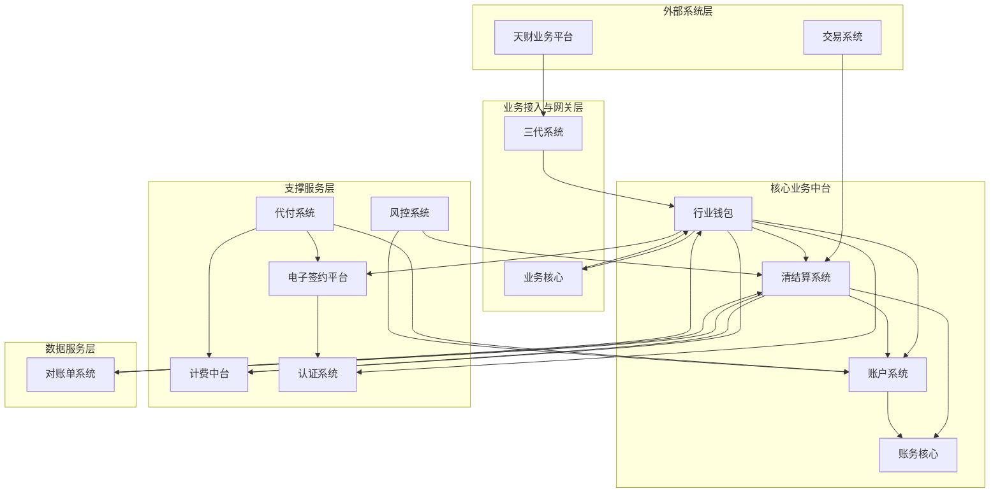
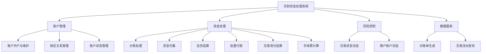
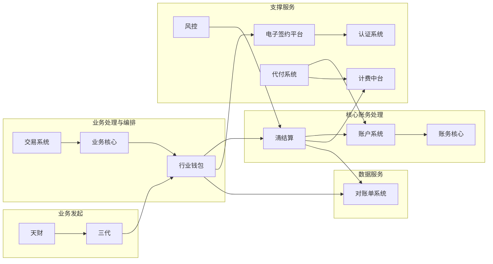
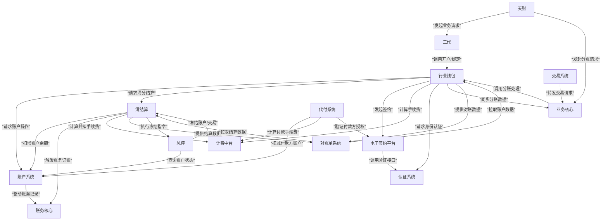

## 2.1 系统结构

本系统采用分层架构，旨在为“天财”业务平台提供资金账户管理、分账结算、批量付款等核心能力。系统以“行业钱包”作为核心业务中台，协调“账户系统”、“清结算”、“账务核心”等底层服务，并通过“三代”系统与外部业务平台对接，实现业务受理、审核与指令转发。整体架构强调职责分离、服务解耦与事务最终一致性。

## 2.2 功能结构

系统功能围绕账户管理、资金处理、风险控制与数据服务四大领域展开。核心功能模块包括由“行业钱包”提供的账户与关系管理、由“清结算”处理的资金清分与结算、由“风控”执行的冻结操作，以及由“对账单系统”提供的数据服务。

## 2.3 网络拓扑图

TBD

## 2.4 数据流转

系统数据流转以业务请求为驱动，始于“天财”或“三代”的业务指令，经由“业务核心”或“行业钱包”进行业务编排，最终在“账户系统”与“账务核心”完成资金账务处理。关键数据流包括开户流、分账流、结算流和冻结流。

## 2.5 系统模块交互关系

模块间主要通过同步API调用与异步事件进行交互，形成清晰的上下游依赖关系。“行业钱包”作为核心协调者，依赖多个底层服务；“清结算”和“账户系统”是资金处理的关键路径；“三代”和“业务核心”是主要的外部请求入口。

