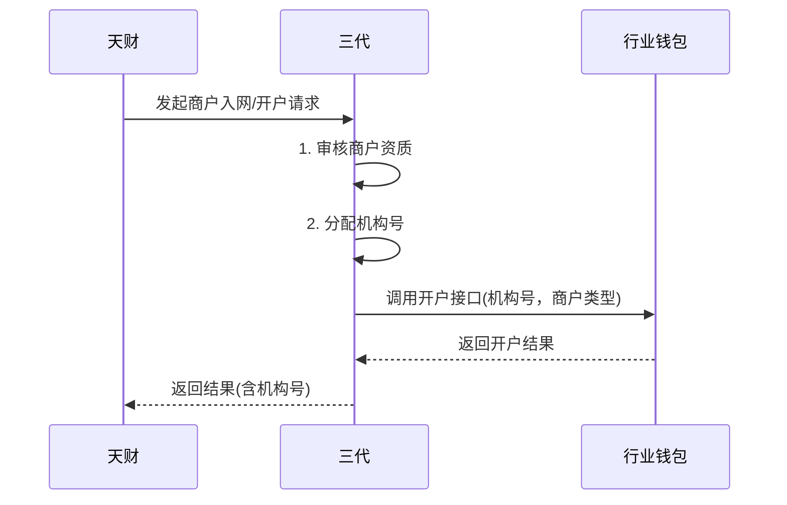

# 模块设计: 三代

生成时间: 2026-01-23 17:22:11
批判迭代: 2

---

# 三代模块设计文档

## 1. 概述
- **目的与范围**: 本模块负责商户入网审核、机构号管理、调用钱包系统开户及关系绑定。它是连接业务平台（天财）与核心业务系统（行业钱包）的桥梁，负责管理商户主体信息并驱动账户体系的建立。

## 2. 接口设计
- **API端点 (REST/GraphQL)**: TBD
- **请求/响应结构**: TBD
- **发布/消费的事件**: TBD

## 3. 数据模型
- **表/集合**: TBD
- **关键字段**: 机构号、APPID、商户类型（收单商户/非收单商户）、主体信息（总部/门店）、状态。
- **与其他模块的关系**: 通过机构号与行业钱包、清结算等系统关联，标识业务主体。

## 4. 业务逻辑
- **核心工作流/算法**:
    1.  **商户入网审核**：接收天财提交的商户入网申请，执行资质审核。
    2.  **机构号分配**：为审核通过的总部或门店主体分配全局唯一的机构号。
    3.  **账户开户**：根据商户类型（收单商户/非收单商户），调用行业钱包接口，请求开立对应的天财收款账户或天财接收方账户。
    4.  **关系绑定**：在需要时，发起并管理总部与门店之间的绑定关系流程。
- **业务规则与验证**:
    1.  **机构号唯一性**：确保分配的机构号在系统内全局唯一。
    2.  **账户类型控制**：收单商户可开立天财收款账户；非收单商户或个人只能开立天财接收方账户。
    3.  **隶属关系验证**：建立总部-门店绑定时，需验证双方主体信息的合法性与关联性。
    4.  **审核规则**：审核商户资质，具体规则（如企业三证、法人信息、行业资质等）TBD。
- **关键边界情况处理**:
    1.  **审核不通过**：记录审核不通过原因，通知天财，流程终止。
    2.  **下游调用失败**：对调用行业钱包等下游系统的操作，实施重试与补偿机制（策略见错误处理章节）。
    3.  **机构号冲突**：在分配环节进行幂等性校验，若发现冲突则重新生成或采用预留号段。

## 5. 时序图

## 6. 错误处理
- **预期错误情况**:
    1.  **输入错误**：商户信息不完整、格式错误或不合规。
    2.  **业务规则错误**：审核不通过、机构号分配冲突、商户类型与账户类型不匹配。
    3.  **下游系统错误**：行业钱包服务不可用、超时、开户请求因风控等原因被拒绝。
- **处理策略**:
    1.  **输入校验**：在接口层和业务逻辑层进行严格校验，返回明确错误码和提示信息。
    2.  **重试机制**：对下游系统（行业钱包）的调用失败，采用指数退避策略进行有限次重试（如最多3次）。
    3.  **补偿与状态管理**：对于开户等关键操作，记录操作日志与状态。若最终失败，需将本系统内的相关状态（如机构号状态）置为失败，并提供人工干预入口进行核对与处理。
    4.  **熔断与降级**：监控下游系统健康度，在持续失败时触发熔断，避免系统雪崩，并返回友好提示。
    5.  **日志记录**：详细记录所有错误上下文，便于问题排查。

## 7. 依赖关系
- **上游模块**: 天财（业务请求来源）。
- **下游模块**: 行业钱包（核心依赖，用于账户开户和关系绑定）。根据术语表，“账户系统（账户域）”是“行业钱包”的底层组件，因此三代模块不直接依赖账户系统，而是通过行业钱包间接调用。