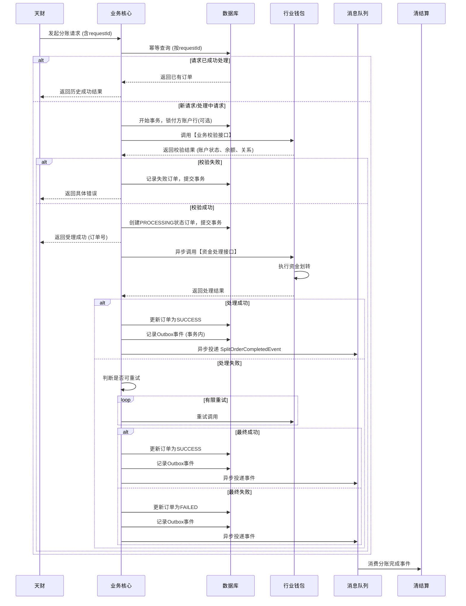

# 模块设计: 业务核心

生成时间: 2026-01-23 17:22:31
批判迭代: 2

---

# 业务核心模块设计文档

## 1. 概述
- **目的与范围**: 业务核心模块是天财平台分账交易在支付体系内的处理中枢。其核心职责是接收、校验天财平台发起的各类分账请求（如归集、会员结算），并协调行业钱包系统完成资金流转。模块自身不持有账户余额，不执行资金操作，也不处理清结算、计费等具体事务。其核心边界在于：1）作为天财分账请求的统一入口；2）执行分账业务逻辑的集中校验与编排；3）确保分账指令可靠地传递至行业钱包系统执行；4）记录分账业务状态，并可选地通知下游系统。

## 2. 接口设计
- **API端点 (REST/GraphQL)**:
  - `POST /api/v1/split-order`: 接收天财平台发起的单笔分账请求。
  - `POST /api/v1/split-order/batch`: 接收天财平台发起的批量分账请求。
  - `GET /api/v1/split-order/{orderNo}`: 查询指定分账订单的处理状态。
- **请求/响应结构**:
  - **请求体示例 (单笔分账)**:
    ```json
    {
      "appId": "TBD",
      "requestId": "unique_request_id_123",
      "bizScene": "COLLECTION", // 业务场景：COLLECTION(归集), MEMBER_SETTLEMENT(会员结算)
      "payerInfo": {
        "institutionNo": "总部机构号",
        "accountNo": "付方天财收款账户号"
      },
      "payeeInfo": {
        "institutionNo": "门店机构号",
        "accountNo": "收方天财收款账户号"
      },
      "amount": 10000,
      "currency": "CNY",
      "remark": "资金归集"
    }
    ```
  - **响应体示例 (成功)**:
    ```json
    {
      "code": "SUCCESS",
      "message": "处理成功",
      "data": {
        "orderNo": "系统生成的分账订单号",
        "status": "PROCESSING",
        "requestId": "unique_request_id_123"
      }
    }
    ```
- **发布/消费的事件**:
  - **消费事件**: TBD (暂未定义上游事件源)。
  - **发布事件**: `SplitOrderCompletedEvent` (分账完成事件)，当行业钱包系统处理完成（成功或最终失败）时发布，供清结算等下游系统订阅。
    - **事件格式**:
      ```json
      {
        "eventId": "uuid",
        "eventType": "SPLIT_ORDER_COMPLETED",
        "timestamp": "2023-01-01T00:00:00Z",
        "payload": {
          "orderNo": "系统分账订单号",
          "requestId": "天财请求ID",
          "bizScene": "COLLECTION",
          "payerAccountNo": "付方账户号",
          "payeeAccountNo": "收方账户号",
          "amount": 10000,
          "currency": "CNY",
          "status": "SUCCESS/FAILED",
          "finishTime": "2023-01-01T00:00:00Z",
          "failReason": "可选，失败原因"
        }
      }
      ```
    - **可靠性保证**: 事件至少投递一次(At-Least-Once)。订阅方需处理幂等。

## 3. 数据模型
- **表/集合**: 核心实体为`分账订单表 (split_order)`，用于记录分账请求、状态及结果。
- **关键字段**:
  - `order_no` (主键): 系统生成的唯一分账订单号。
  - `request_id`: 天财平台请求ID，用于幂等。
  - `app_id`: 应用标识，关联三代机构号。
  - `biz_scene`: 业务场景（归集、会员结算）。
  - `payer_institution_no`: 付方机构号。
  - `payer_account_no`: 付方天财收款账户号。
  - `payee_institution_no`: 收方机构号。
  - `payee_account_no`: 收方账户号（天财收款账户或天财接收方账户）。
  - `amount`: 分账金额。
  - `currency`: 币种。
  - `status`: 订单状态（INIT, VALIDATING, PROCESSING, SUCCESS, FAILED）。
  - `validation_result`: 校验结果详情（JSON格式，存储账户状态、余额、绑定关系等校验信息）。
  - `wallet_trace_no`: 行业钱包系统返回的交易流水号。
  - `error_code`: 错误码。
  - `error_message`: 错误信息。
  - `retry_count`: 向下游系统调用的重试次数。
  - `created_at`: 创建时间。
  - `updated_at`: 更新时间。
- **与其他模块的关系**:
  - 通过`payer_account_no`、`payee_account_no`关联行业钱包系统的账户信息。
  - 通过`request_id`与天财平台的原始请求关联。
  - 通过`wallet_trace_no`与行业钱包系统的交易流水关联。

## 4. 业务逻辑
- **核心工作流/算法**:
  1. **请求接收与幂等**: 接收天财请求，以`request_id`为键进行幂等校验。若已存在相同`request_id`且成功的订单，直接返回历史结果。
  2. **基础参数校验**: 校验请求参数格式、必填项、金额有效性等。
  3. **业务校验（调用行业钱包）**: 调用行业钱包系统提供的校验接口，验证：
     - 付方账户（天财收款账户）状态是否正常（非冻结）。
     - 付方账户可用余额是否充足。
     - 付方与收方账户之间是否存在有效的绑定关系（根据业务场景）。
     - 业务场景（如归集）是否被允许。
  4. **创建订单与状态推进**: 校验通过后，创建`split_order`记录，状态置为`PROCESSING`。
  5. **调用资金处理**: 调用行业钱包系统的分账/转账接口，执行资金划转。
  6. **结果处理与通知**:
     - 成功：更新订单状态为`SUCCESS`，记录钱包流水号，发布`SplitOrderCompletedEvent`。
     - 失败：根据错误类型决定是否重试。最终失败则更新状态为`FAILED`，发布事件。
- **业务规则与验证**:
  - 所有账户状态、余额、绑定关系的校验均通过调用**行业钱包系统**的标准化接口完成，业务核心不自行维护或缓存此类数据，确保数据一致性。
  - 针对**并发请求**，通过数据库行锁（如`SELECT ... FOR UPDATE`）或乐观锁机制，在“校验-创建订单”的关键阶段确保对同一付方账户的并发操作串行化，防止超额扣款。
- **关键边界情况处理**:
  - **下游调用失败**: 见错误处理章节的重试与补偿策略。
  - **异步事件投递失败**: 事件发布采用本地事务表（Outbox模式），确保业务状态更新与事件记录在同一个数据库事务中，由后台任务保证事件最终投递。

## 5. 时序图



## 6. 错误处理
- **预期错误情况**:
  1. **客户端错误**: 请求参数非法、`requestId`格式错误、业务场景不支持。
  2. **业务校验错误**: 账户不存在、账户冻结、余额不足、绑定关系无效（由行业钱包返回）。
  3. **系统间调用错误**: 调用行业钱包系统超时、服务不可用、网络异常。
  4. **资金处理错误**: 行业钱包处理失败（如账务核心记账失败、账户状态变更）。
- **处理策略**:
  - **参数与业务校验错误**: 立即失败，向天财返回明确的错误码和提示，不进行重试。
  - **下游系统调用失败**:
    - **重试策略**: 仅对网络超时、服务暂时不可用（5xx错误）进行重试。采用指数退避策略，最大重试次数为3次。
    - **幂等性**: 调用行业钱包资金处理接口时，携带业务核心生成的唯一`order_no`，确保行业钱包侧幂等处理。
    - **最终失败处理**: 重试耗尽后仍失败，将订单标记为`FAILED`，记录详细错误信息，并发布失败事件。同时触发监控告警，支持人工介入排查。
  - **数据一致性**: 通过本地事务保证订单状态与Outbox事件的原子性。资金操作的一致性由行业钱包系统保障。

## 7. 依赖关系
- **上游模块**:
  - **天财平台**: 业务请求的发起方。依赖其提供合规、准确的业务请求。
- **下游模块**:
  - **行业钱包系统**: **强依赖**。提供账户校验与资金处理能力。业务核心的所有关键业务操作均通过调用其接口完成。
  - **清结算系统**: **弱依赖（事件驱动）**。通过异步事件接收分账完成通知，用于后续清分、结算等处理。业务核心不依赖其响应。
- **内部依赖**:
  - **数据库**: 用于持久化分账订单、实现幂等与状态机。
  - **消息中间件**: 用于可靠地投递领域事件。