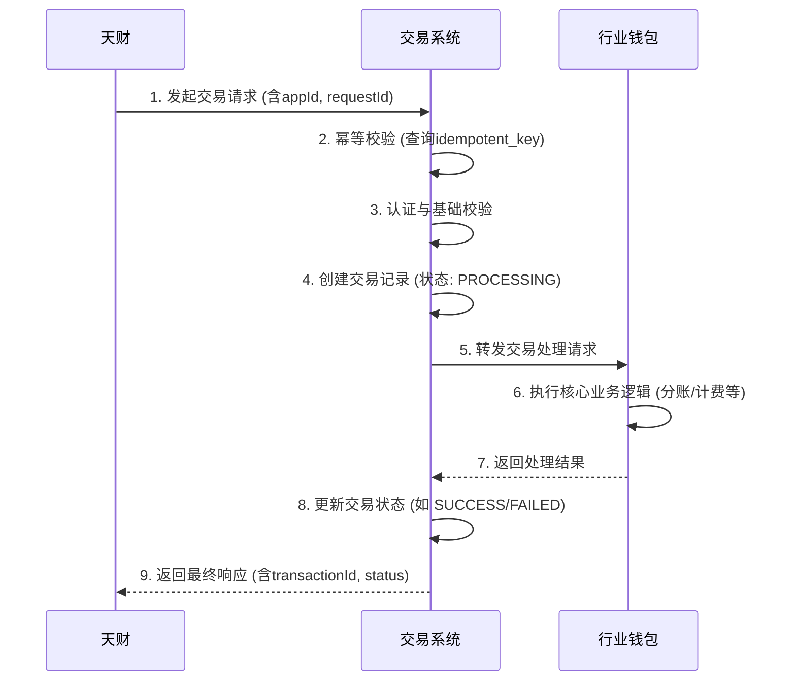

# 模块设计: 交易系统

生成时间: 2026-01-23 17:23:01
批判迭代: 2

---

# 交易系统模块设计文档

## 1. 概述
- **目的与范围**：本模块作为业务入口，负责接收并处理来自**天财**的业务交易数据，包括**分账**、**会员结算**、**批量付款**等场景。核心职责是进行请求编排、状态管理与持久化，并将核心业务处理请求转发至**行业钱包**等下游系统。本模块是交易的编排者与状态管理者，负责维护交易的最终状态记录。

## 2. 接口设计
- **API端点 (REST)**：
    - `POST /api/v1/transactions/split`: 处理天财分账请求。
    - `POST /api/v1/transactions/member-settlement`: 处理会员结算请求。
    - `POST /api/v1/transactions/batch-payment`: 处理批量付款请求。
    - `GET /api/v1/transactions/{transactionId}`: 查询交易状态。
- **请求/响应结构**：
    - 请求公共字段：`appId`（对应三代机构号）、`requestId`（请求唯一标识，用于幂等）、`timestamp`、`signature`（签名）。
    - 响应公共字段：`code`、`message`、`data`。`data`中包含`transactionId`（本系统交易流水号）、`status`。
    - 具体业务请求字段：TBD（根据分账、结算、付款场景细化）。
- **发布/消费的事件**：
    - 消费事件：TBD（例如，消费来自行业钱包的交易处理结果事件）。
    - 发布事件：`TransactionCreated`（交易创建）、`TransactionStatusUpdated`（交易状态更新）。事件负载包含`transactionId`, `type`, `fromStatus`, `toStatus`, `timestamp`。

## 3. 数据模型
- **表/集合**：
    - **交易主表 (`transaction_log`)**：系统核心表，记录所有交易的完整生命周期。
    - **交易明细表 (`transaction_detail`)**：记录交易的详细构成，如批量付款中的每笔子交易。
    - **幂等控制表 (`idempotent_key`)**：用于保证请求的幂等性。
- **关键字段**：
    - `transaction_log`：`id`（主键，交易流水号）、`app_id`、`request_id`（天财请求ID）、`type`（交易类型）、`status`（状态）、`request_body`（原始请求）、`response_to_tiancai`（给天财的响应）、`wallet_request`（发往行业钱包的请求）、`wallet_response`（行业钱包的响应）、`retry_count`、`next_retry_time`、`created_at`、`updated_at`。
    - `transaction_detail`：`id`、`transaction_id`（外键）、`detail_seq`（明细序号）、`payer_info`（付款方信息）、`payee_info`（收款方信息）、`amount`、`detail_status`、`fail_reason`。
    - `idempotent_key`：`key`（唯一索引，由`app_id`和`request_id`组成）、`transaction_id`、`created_at`。
- **与其他模块的关系**：
    - 本模块是交易的发起方与状态管理者，通过`app_id`关联**三代**分配的机构号。
    - 本模块调用**行业钱包**执行核心业务逻辑（如分账校验、计费）。
    - 交易完成后，本模块将交易结果数据同步给**业务核心**，由业务核心进行后续业务处理。**业务核心**是交易数据的接收方，非持久化责任方。本模块的`transaction_log`表是交易的系统记录。

## 4. 业务逻辑
- **核心工作流/算法**：
    1.  **请求接收与幂等校验**：接收天财请求，提取`app_id`和`request_id`，查询幂等表。若已存在记录，则直接返回已存储的响应。
    2.  **认证与基础校验**：
        - 认证：验证请求签名，确认请求来源于合法的`app_id`（对应天财下的机构号）。
        - 校验：检查请求参数格式、必填字段、金额有效性等。
    3.  **交易记录创建**：校验通过后，在`transaction_log`表中创建状态为`PROCESSING`的记录。
    4.  **请求转发与执行**：构建符合**行业钱包**接口规范的请求体，进行同步或异步调用。对于批量付款，可能拆分为多个子请求并记录于明细表。
    5.  **状态管理与更新**：根据行业钱包的响应，更新交易主表及明细表的状态（如`SUCCESS`、`PARTIAL_SUCCESS`、`FAILED`）。对于异步处理，需提供状态查询接口。
    6.  **响应返回**：向天财返回包含本系统`transactionId`和当前状态的响应。
- **业务规则与验证**：
    - 权限校验：验证`app_id`是否有权限执行当前交易类型（如分账、批量付款）。
    - 业务校验：部分校验依赖下游（行业钱包），本系统仅做基础格式校验。
- **关键边界情况处理**：
    - **幂等性**：通过`app_id` + `request_id`唯一键保证，防止重复交易。
    - **重试机制**：对调用行业钱包的网络超时或暂时性失败，根据配置的重试策略（如指数退避）进行自动重试，并更新`retry_count`。
    - **熔断机制**：当行业钱包服务失败率达到阈值时，触发熔断，快速失败并告警。
    - **长事务状态管理**：对于批量付款等长事务，通过`transaction_log.status`和`transaction_detail.detail_status`跟踪整体与子项进度，支持部分成功。
    - **状态可追溯**：所有状态变更、请求与响应原始数据均持久化在`transaction_log`表中，并提供查询接口。

## 5. 时序图

## 6. 错误处理
- **预期错误情况**：
    1.  **客户端错误**：请求参数无效、签名错误、`app_id`无权限、幂等冲突。
    2.  **下游依赖错误**：调用行业钱包网络超时、服务不可用、返回业务逻辑失败。
    3.  **系统内部错误**：数据库异常、内部处理逻辑错误。
- **处理策略**：
    - **客户端错误**：立即返回4xx错误，包含明确错误码和信息，不进行重试。
    - **下游依赖错误**：
        - 网络超时/暂时性失败：根据配置策略（如最多3次，指数退避）自动重试。重试失败后，将交易状态置为`FAILED`并记录错误原因。
        - 服务不可用/业务失败：触发熔断器，短时间内快速失败，并产生告警通知运维。交易状态置为`FAILED`。
    - **系统内部错误**：记录详细错误日志，交易状态置为`FAILED`，返回5xx错误给天财。需配置监控告警。
    - **人工干预**：对于最终状态为`FAILED`或长时间`PROCESSING`的交易，提供管理界面供运营人员查询详情并决定是否手动重试或冲正。

## 7. 依赖关系
- **上游模块**：**天财**（业务发起方）。
- **下游模块**：
    - **行业钱包**：核心业务处理依赖，执行分账校验、计费等。
    - **业务核心**：交易结果数据接收方。
- **内部依赖**：数据库（用于持久化交易记录、幂等键）。