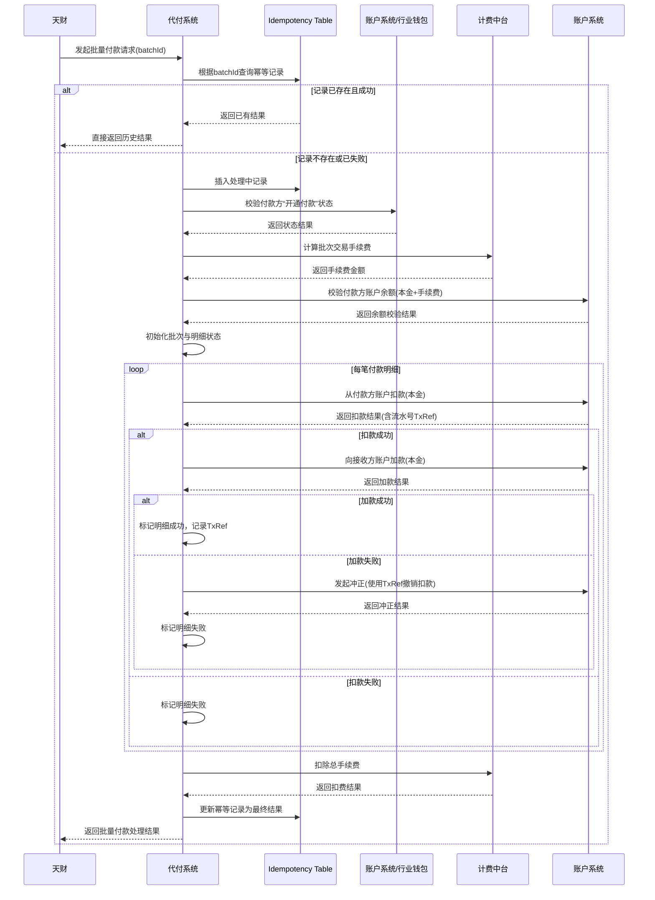

# 模块设计: 代付系统

生成时间: 2026-01-23 17:23:09
批判迭代: 2

---

# 代付系统 模块设计文档

## 1. 概述
- **目的与范围**: 本模块负责处理“批量付款”（批付）业务场景。其核心职责是接收来自“天财”平台的批量付款指令，协调完成付款方授权验证、资金从付款方账户（天财收款账户）向多个接收方账户（天财收款账户或天财接收方账户）的划转，并处理相关手续费。其边界止于向账户系统发起扣款和加款指令，不涉及底层账户操作、记账及外部银行通道的执行。

## 2. 接口设计
- **API端点 (REST/GraphQL)**:
    - `POST /api/v1/batch-payments`: 接收批量付款请求。
    - `GET /api/v1/batch-payments/{batchId}`: 查询批次处理状态及结果。
- **请求/响应结构**:
    - 请求体 (`BatchPaymentRequest`):
        - `batchId` (String): 批次唯一标识，用于幂等性控制。
        - `payerInstitutionNo` (String): 付款方机构号。
        - `payerAccountType` (String): 付款方账户类型（如“天财收款账户”）。
        - `items` (Array<`PaymentItem`>): 付款明细列表。
            - `itemId` (String): 明细项ID。
            - `payeeInstitutionNo` (String): 收款方机构号。
            - `payeeAccountType` (String): 收款方账户类型（“天财收款账户”或“天财接收方账户”）。
            - `amount` (BigDecimal): 付款金额（本金）。
        - `bizContext` (Object): 业务扩展信息。
    - 响应体 (`BatchPaymentResponse`):
        - `code` (String): 处理结果码。
        - `message` (String): 处理结果描述。
        - `data` (`BatchResult`): 批次结果详情。
            - `batchId` (String): 批次ID。
            - `status` (String): 批次状态（PROCESSING/SUCCESS/PARTIAL_SUCCESS/FAILED）。
            - `totalAmount` (BigDecimal): 批次总金额（本金）。
            - `feeAmount` (BigDecimal): 手续费金额。
            - `items` (Array<`ItemResult`>): 各明细项处理结果。
- **发布/消费的事件**:
    - 消费事件: TBD（从天财接收付款指令的事件定义）。
    - 发布事件: `BatchPaymentCompletedEvent`（批次处理完成时发布，包含批次ID、状态、成功/失败明细摘要）。

## 3. 数据模型
- **表/集合**:
    - `payment_batch` (付款批次主表):
        - `batch_id` (PK, String): 批次唯一ID，与请求中的`batchId`一致。
        - `payer_institution_no` (String): 付款方机构号。
        - `payer_account_no` (String): 付款方账户号。
        - `total_principal` (Decimal): 批次总本金。
        - `total_fee` (Decimal): 批次总手续费。
        - `status` (String): 批次状态（INIT/CHECKING/FEE_CALCULATED/BALANCE_CHECKED/TRANSFERRING/FEE_DEDUCTING/COMPLETED/FAILED）。
        - `error_code` (String): 批次级错误码。
        - `error_message` (Text): 批次级错误信息。
        - `created_at` (DateTime): 创建时间。
        - `updated_at` (DateTime): 更新时间。
    - `payment_item` (付款明细表):
        - `id` (PK, BigInt): 自增主键。
        - `batch_id` (FK, String): 关联批次ID。
        - `item_id` (String): 明细项ID。
        - `payee_institution_no` (String): 收款方机构号。
        - `payee_account_no` (String): 收款方账户号。
        - `principal_amount` (Decimal): 付款本金。
        - `status` (String): 明细状态（PENDING/SUCCESS/FAILED）。
        - `error_code` (String): 明细错误码。
        - `error_message` (Text): 明细错误信息。
        - `account_transaction_ref` (String): 账户系统交易流水号，用于冲正。
        - `created_at` (DateTime): 创建时间。
        - `updated_at` (DateTime): 更新时间。
    - `idempotency_record` (幂等性记录表):
        - `biz_serial_no` (PK, String): 业务流水号（此处使用`batch_id`）。
        - `processor` (String): 处理器标识（如“batch_payment”）。
        - `result_code` (String): 已处理结果码。
        - `result_data` (Text): 已处理结果数据快照（JSON）。
        - `created_at` (DateTime): 创建时间。
- **关键字段**: 如上所述，重点关注`batch_id`（幂等键）、各状态字段、错误信息字段及账户交易流水号。
- **与其他模块的关系**: 依赖“账户系统”进行账户余额操作，依赖“计费中台”计算手续费，依赖“电子签约平台”完成“开通付款”的授权签约流程（但“开通付款”状态的最终来源为“账户系统”或“行业钱包”维护的关系绑定状态，需澄清）。

## 4. 业务逻辑
- **核心工作流/算法**:
    1.  **接收与幂等校验**: 接收请求，以`batchId`为键查询`idempotency_record`表。若存在成功记录，直接返回历史结果；若存在处理中记录，返回处理中状态；否则，插入记录并开始处理。
    2.  **权限与状态校验**: 校验付款方（总部或门店）是否已完成“开通付款”流程。**澄清**: “开通付款”状态应由“账户系统”或“行业钱包”在关系绑定时设置并维护，本系统通过查询其提供的API或数据状态进行校验。
    3.  **计算手续费**: 调用“计费中台”计算本次批量付款交易的总手续费。
    4.  **资金总额校验**: 计算批次总本金加总手续费，调用“账户系统”校验付款方账户（天财收款账户）余额是否充足。
    5.  **执行付款（Saga模式）**:
        - a. 批次状态置为`TRANSFERRING`。
        - b. **循环处理每一条付款明细**:
            - i. 调用“账户系统”从付款方账户扣减该笔本金，获取交易流水号。
            - ii. 若扣款成功，调用“账户系统”向接收方账户增加等额本金。
            - iii. 根据上述两步结果更新明细状态（`SUCCESS`或`FAILED`），记录错误信息及成功交易的流水号。
            - iv. **若加款失败，则触发对本笔已扣本金的冲正（Compensating Transaction）**，调用账户系统进行反向操作，并将明细状态置为`FAILED`。
        - c. 循环结束后，汇总明细状态。
    6.  **扣除手续费**: 若所有本金转账均成功（或部分成功但已处理完冲正），调用“计费中台”从付款方账户扣除总手续费。
    7.  **结果汇总与状态更新**: 更新批次最终状态（`SUCCESS`/`PARTIAL_SUCCESS`/`FAILED`），更新幂等性记录，发布完成事件，并反馈结果。
- **业务规则与验证**:
    - 付款方必须是已开立“天财收款账户”的“总部”或“门店”。
    - 付款方必须已完成与目标接收方的“开通付款”授权（状态来源为下游系统）。
    - **账户类型澄清**: 接收方可以是“天财收款账户”（对应收单商户）或“天财接收方账户”（对应非收单商户或个人）。本系统不校验对方是否为收单商户，仅依据下游系统提供的账户类型和状态进行操作。
    - 付款总额需包含由“计费中台”计算的手续费，并在转账前进行余额校验。
    - 采用Saga模式处理部分失败，确保单笔转账的原子性（扣款+加款）或可冲正性。
- **关键边界情况处理**:
    - **部分失败**: 如上所述，采用Saga模式。单笔明细加款失败时，立即冲正对应扣款。批次最终状态根据成功明细数判断。
    - **余额不足**: 在步骤4进行总额预校验，若不足，整个批次标记为`FAILED`，不执行任何转账。
    - **重复请求**: 通过`batchId`在`idempotency_record`表实现幂等。
    - **下游系统调用失败**: 对账户系统和计费中台的调用配置重试机制（见错误处理章节）。若重试后仍失败，标记该操作失败，并根据Saga逻辑决定是否冲正。

## 5. 时序图

## 6. 错误处理
- **预期错误情况**:
    - 付款方未开通付款权限。
    - 付款方账户余额不足。
    - 接收方账户状态异常（如冻结、注销）。
    - 账户系统操作（扣款、加款、冲正）超时或失败。
    - 计费系统调用失败。
    - 网络超时或系统内部异常。
- **处理策略**:
    - **业务校验失败**（如权限、余额不足）：立即终止流程，批次状态置为`FAILED`，返回明确错误码。
    - **下游系统调用失败**：
        - **重试策略**: 对账户系统、计费中台的调用实施指数退避重试（如最多3次，间隔1s, 2s, 4s）。仅对网络超时、5xx错误等可重试错误进行重试。
        - **补偿机制**:
            - 单笔明细加款失败：立即调用账户系统的冲正接口，撤销本笔扣款。冲正操作本身也需配置重试。
            - 手续费扣除失败：若所有本金转账已处理完毕（含冲正），但手续费扣除失败，批次状态标记为`PARTIAL_SUCCESS`（本金成功但手续费未扣），记录错误，并触发告警以便人工干预。
        - **最终失败处理**: 经过重试和补偿后仍失败的操作，记录详细错误原因（系统、错误码、时间），更新对应明细或批次状态为`FAILED`。支持通过人工查询错误日志后进行后续处理。
    - **幂等性保障**: 任何非初始状态的错误（如重试过程中），需确保再次收到相同`batchId`请求时，能通过幂等表返回正确的中途状态或最终状态，避免重复执行。

## 7. 依赖关系
- **上游模块**: 天财（业务发起方）。
- **下游模块**:
    - **账户系统**: 执行账户余额查询、扣款、加款、冲正操作。是账户余额和“开通付款”绑定状态的权威来源之一（需与行业钱包明确）。
    - **计费中台**: 计算并扣除批量付款手续费。
    - **电子签约平台**: 为“开通付款”流程提供签约能力，但签约完成后的状态应同步至账户系统或行业钱包供本系统查询。
- **澄清点**:
    - “开通付款”状态管理：需与架构组明确，该状态是由“账户系统”在关系绑定成功时标记，还是由“行业钱包”维护。本系统将依赖其提供的查询接口。
    - 账户类型校验：本系统不直接校验“收单商户”资质，仅依据请求中的账户类型和下游系统返回的账户状态进行操作。账户类型的合法性由开户流程保证。