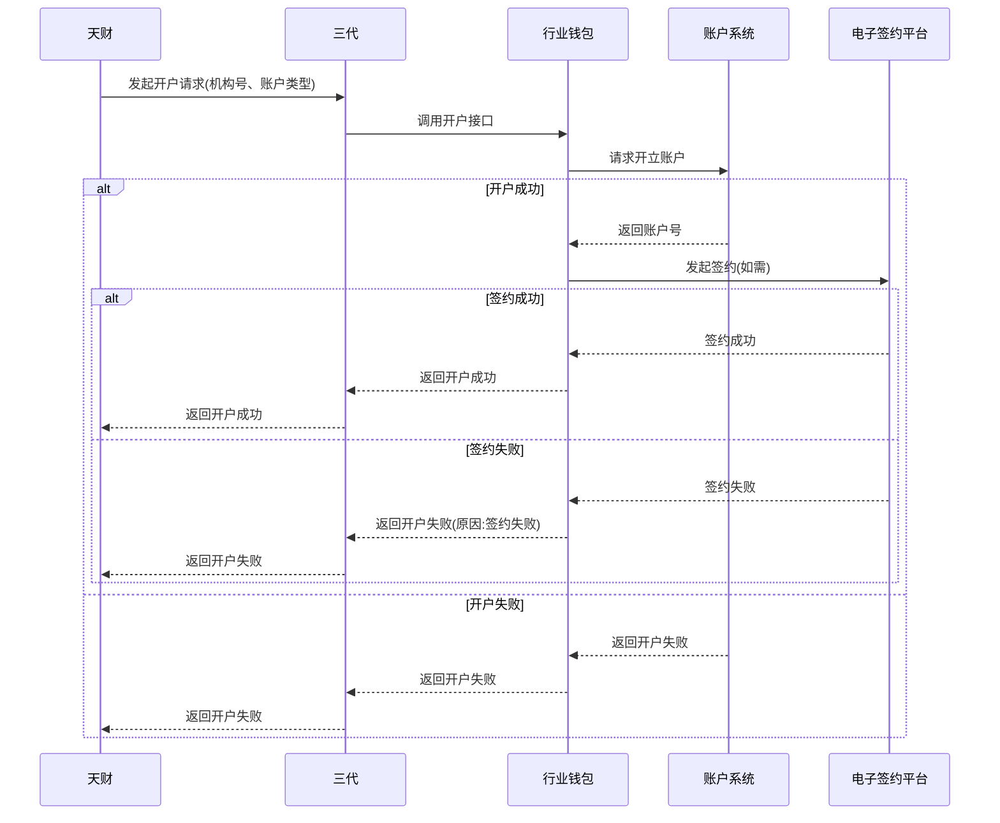

# 模块设计: 天财

生成时间: 2026-01-23 17:22:26
批判迭代: 2

---

# 天财模块设计文档

## 1. 概述
- **目的与范围**: 天财模块是提出分账、会员结算、批量付款需求的业务平台。其核心职责是作为业务发起方，向三代系统发起开户、分账、归集等业务指令，并接收处理结果。其边界止于业务指令的发起与状态同步，不涉及底层账户、账务及认证等具体处理逻辑。认证系统作为下游三代系统的依赖，天财模块不直接与其交互。

## 2. 接口设计
- **API端点 (REST/GraphQL)**: TBD
- **请求/响应结构**: TBD
- **发布/消费的事件**: TBD

## 3. 数据模型
- **表/集合**: TBD
- **关键字段**: TBD
- **与其他模块的关系**: 天财模块通过机构号与三代模块关联，用于标识业务主体。其业务指令（如开户、分账）将触发下游钱包系统、清结算系统等模块的处理流程。

## 4. 业务逻辑
- **核心工作流/算法**:
  1)  **发起开户请求**:
      - 输入：机构号、账户类型（天财收款账户/天财接收方账户）、主体信息。
      - 流程：验证机构号有效性 -> 组装开户请求报文 -> 调用三代系统接口 -> 接收异步/同步结果 -> 根据结果更新本地业务单状态。
  2)  **发起分账请求**:
      - 输入：付款方机构号、收款方机构号/账户信息、分账金额、业务标识。
      - 流程：校验付款方与收款方是否存在已绑定的授权关系 -> 校验付款方账户状态是否正常、余额是否充足 -> 组装分账请求报文 -> 调用三代系统接口 -> 接收处理结果并更新状态。
  3)  **发起归集请求**:
      - 输入：总部机构号、门店机构号列表、归集金额。
      - 流程：校验总部与各门店的归属关系是否已绑定 -> 校验各门店账户状态与余额 -> 组装批量归集请求 -> 调用三代系统接口 -> 接收处理结果并更新状态。
  4)  **发起会员结算请求**: 流程与分账类似，需额外校验是否已完成“开通付款”签约。
  5)  **发起批量付款请求**: 流程与归集类似，需额外校验付款方是否已完成“开通付款”签约，并校验每个收款方的账户信息。
- **状态流转**: 业务指令状态通常包括：`待处理` -> `处理中` -> `成功`/`失败`。对于异步处理，可能增加`处理中`状态。
- **业务规则与验证**:
  - **关系绑定验证**: 发起分账、归集、会员结算前，必须确认业务主体间（如总部-门店、付款方-收款方）已完成关系绑定流程。
  - **开通付款验证**: 发起会员结算、批量付款前，必须确认付款方已完成“开通付款”的额外签约流程。
  - **账户状态验证**: 发起任何资金转出操作前，必须确认付款方账户未被冻结，且余额充足。
  - **机构号有效性**: 所有请求中的机构号必须在三代系统中有有效映射。
- **关键边界情况处理**: 当接收到下游系统返回的交易冻结、商户冻结指令时，需将相关业务主体或账户在本地的状态标记为`冻结`，并阻止后续所有资金转出操作，直至收到解冻通知。

## 5. 时序图

## 6. 错误处理
- **预期错误情况**:
  1)  **下游系统异常**: 三代、行业钱包等服务调用超时、网络中断或返回5xx错误。
  2)  **业务校验失败**: 机构号无效、关系未绑定、未开通付款、账户状态异常（冻结）、余额不足。
  3)  **账户操作失败**: 底层账户系统操作失败（如账户已存在、账户类型不支持）。
- **处理策略**:
  - **重试机制**: 对于网络超时或下游系统临时故障（5xx错误），采用指数退避策略进行重试，最大重试次数为3次。仅对幂等操作（如查询、部分状态更新）进行重试。
  - **错误码与提示**: 定义明确的业务错误码，并携带可读的提示信息返回给调用方。例如：`RELATION_NOT_BOUND`（关系未绑定）、`ACCOUNT_FROZEN`（账户已冻结）。
  - **事务与回滚**: 天财模块本身不维护分布式事务。对于涉及多个步骤的复杂业务（如开户+签约），依赖下游系统（如行业钱包）的补偿或回滚机制。天财在接收到明确失败响应后，负责将本地业务单状态更新为`失败`，并记录失败原因。
  - **降级与熔断**: 当连续调用下游服务失败率达到阈值时，触发熔断，暂时停止发起新请求，直接返回系统繁忙错误，并记录告警。

## 7. 依赖关系
- **上游模块**: 无（天财为业务发起方，是流程的起点）。
- **下游模块**: 三代系统。天财通过三代系统间接依赖行业钱包、清结算、账户系统、电子签约平台、计费中台、对账单系统、业务核心、认证系统等模块。