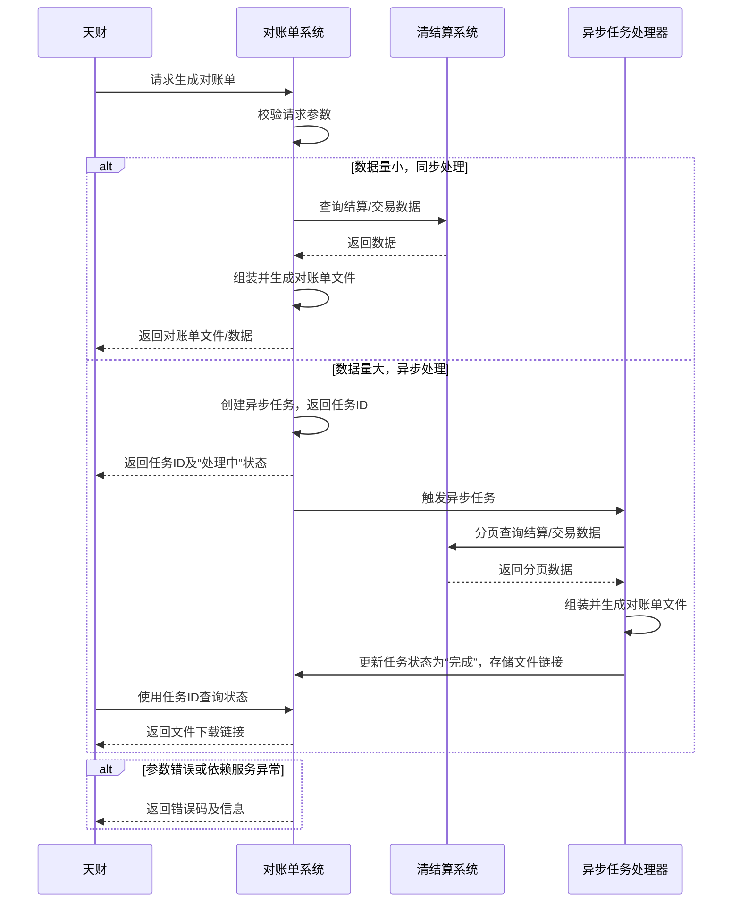

# 模块设计: 对账单系统

生成时间: 2026-01-23 17:22:27
批判迭代: 2

---

# 对账单系统模块设计文档

## 1. 概述
- **目的与范围**：本模块负责生成并提供各类账户和交易维度的对账单数据。其核心职责是响应内部系统（如天财）的查询请求，生成指定账户或交易的对账单文件或数据，不涉及交易清分、结算或账户余额变动等核心账务处理。

## 2. 接口设计
- **API端点 (REST/GraphQL)**：TBD
- **请求/响应结构**：
    - **生成对账单请求**：包含请求ID、账户标识（如机构号）、对账单类型（账户/交易）、时间范围（开始时间、结束时间）、文件格式（CSV/PDF）等字段。
    - **生成对账单响应**：包含请求ID、处理状态（成功/处理中/失败）、文件下载链接（若为异步生成）、错误码及信息。
    - **查询对账单状态请求**：包含请求ID。
    - **查询对账单状态响应**：包含请求ID、处理状态、文件下载链接（若已生成）、生成时间。
- **发布/消费的事件**：TBD

## 3. 数据模型
- **表/集合**：TBD
- **关键字段**：TBD
- **与其他模块的关系**：本模块依赖**清结算系统**获取交易清分、结算及手续费处理后的最终数据，以生成准确的对账单。天财作为业务平台，是主要的API调用方。

## 4. 业务逻辑
- **核心工作流/算法**：
    1.  接收对账单生成请求。
    2.  校验请求参数的合法性（如账户是否存在、时间范围是否有效）。
    3.  根据数据量评估策略：
        - **数据量小**：同步处理。向清结算系统查询相关数据，按预设格式组装并生成对账单文件，返回文件或数据流。
        - **数据量大**：异步处理。创建异步任务，返回任务ID。后台任务分页从清结算系统拉取数据，组装生成文件后存储，并更新任务状态。
    4.  数据组装格式遵循预设模板（如CSV包含交易流水号、时间、金额、手续费、结算状态等字段；PDF包含账户摘要、交易明细表格）。
- **业务规则与验证**：
    - 验证请求账户（通过机构号标识）是否存在于系统中。
    - 验证时间范围不超过系统允许的最大跨度（如1年）。
    - 验证请求方（天财）是否有权限查询指定账户的对账单。
- **关键边界情况处理**：
    - **无数据**：生成包含表头/摘要但无明细记录的空文件，或返回明确的“无数据”提示。
    - **数据量过大**：触发异步生成流程，支持通过任务ID查询进度和结果。
    - **依赖服务异常**：执行重试策略，若最终失败则记录日志并返回服务不可用提示。

## 5. 时序图

## 6. 错误处理
- **预期错误情况**：
    - **客户端错误**：请求参数错误（如无效账户、时间格式错误、超出最大时间范围）。
    - **服务端错误**：依赖系统（清结算）服务不可用、查询超时或返回异常数据；内部文件生成失败。
    - **异步任务错误**：任务执行超时、失败。
- **处理策略**：
    - **参数错误**：返回明确的4xx错误码（如`INVALID_ACCOUNT`， `INVALID_DATE_RANGE`）和提示信息。
    - **依赖服务异常**：实施重试策略（如最多3次，指数退避）。若持续失败，触发熔断机制，并返回5xx错误码（如`SETTLEMENT_SERVICE_UNAVAILABLE`）和“服务暂时不可用”提示。所有异常需记录详细日志。
    - **异步任务失败**：更新任务状态为“失败”，记录失败原因，供调用方查询。

## 7. 依赖关系
- **上游模块**：**清结算系统**（核心数据依赖，需提供指定账户及时间范围内的结算明细数据查询接口）。
- **下游模块**：**天财**（主要服务对象与API调用方）。