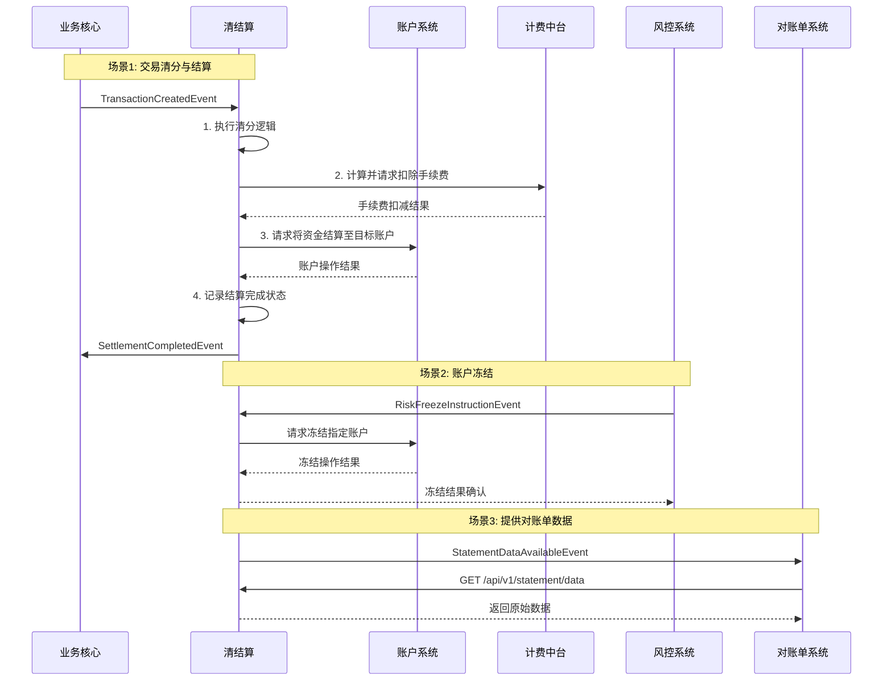

# 模块设计: 清结算

生成时间: 2026-01-23 17:23:08
批判迭代: 2

---

# 清结算模块设计文档

## 1. 概述
- **目的与范围**: 本模块负责处理交易清分、结算、手续费计算、账户冻结及提供对账单数据。其核心职责包括：根据业务规则对交易进行资金清分，将资金结算至指定的天财收款账户或根据被动结算路径处理；计算并扣除交易相关手续费；响应风控指令对账户或特定交易资金进行冻结；为对账单系统提供原始数据。

## 2. 接口设计
- **API端点 (REST)**:
    - `POST /api/v1/settlement/execute`: 执行交易清分与结算。
    - `POST /api/v1/freeze/account`: 执行商户账户冻结。
    - `POST /api/v1/freeze/transaction`: 执行特定交易资金冻结。
    - `GET /api/v1/statement/data`: 为对账单系统提供原始数据查询接口。
- **请求/响应结构**:
    - `POST /api/v1/settlement/execute`:
        - 请求体: `{“requestId”: “string”, “transactionId”: “string”, “merchantInfo”: {...}, “settlementMode”: “ACTIVE/PASSIVE”, “settlementPath”: “TBD”}`
        - 响应体: `{“code”: “string”, “message”: “string”, “data”: {“settlementId”: “string”, “status”: “string”}}`
    - `POST /api/v1/freeze/account`:
        - 请求体: `{“requestId”: “string”, “instructionId”: “string”, “accountNo”: “string”, “freezeType”: “MERCHANT”}`
        - 响应体: `{“code”: “string”, “message”: “string”, “data”: {“freezeOrderId”: “string”}}`
    - 其他接口的详细结构为 TBD。
- **发布/消费的事件**:
    - 消费事件:
        - `TransactionCreatedEvent`: 来自业务核心，触发清分结算流程。
        - `RiskFreezeInstructionEvent`: 来自风控系统，触发账户或交易冻结。
    - 发布事件:
        - `SettlementCompletedEvent`: 清分结算完成事件，供下游系统订阅。
        - `FreezeOrderCreatedEvent`: 冻结指令已创建事件。
        - `StatementDataAvailableEvent`: 对账单数据就绪事件，通知对账单系统。

## 3. 数据模型
- **表/集合**:
    - `settlement_record` (清分结算记录表)
    - `fee_calculation` (手续费计算记录表)
    - `freeze_order` (冻结指令记录表)
    - `settlement_rule` (清分规则配置表)
- **关键字段**:
    - `settlement_record`: `id`, `request_id`, `transaction_id`, `merchant_id`, `settlement_mode`, `status`, `settled_amount`, `fee_amount`, `target_account_no`, `created_at`, `updated_at`
    - `fee_calculation`: `id`, `settlement_id`, `fee_rule_id`, `calculated_amount`, `deduct_status`
    - `freeze_order`: `id`, `instruction_id`, `account_no`, `freeze_type`, `related_transaction_id`, `status`, `created_at`
    - `settlement_rule`: `id`, `merchant_type`, `product_type`, `fee_rate`, `settlement_path`
- **与其他模块的关系**:
    - 依赖**账户系统**进行账户余额的扣减与增加操作。
    - 为**对账单系统**提供对账单数据。
    - 依赖**计费中台**计算并扣除手续费。

## 4. 业务逻辑
- **核心工作流/算法**:
    1.  **清分**: 接收交易数据，根据商户类型、产品类型等规则计算应收资金、应付手续费等。
    2.  **结算**:
        - **主动结算**: 将清分后的净额资金，自动结算至商户指定的天财收款账户（如待结算账户）。
        - **被动结算**: 按照外部（如天财业务平台）指定的结算路径进行资金划转。
    3.  **手续费处理**: 在结算过程中，计算交易手续费，并通过调用计费中台完成扣费。
    4.  **账户/交易冻结**: 接收风控指令，对指定的收单商户天财收款账户进行冻结（商户冻结），或对已结算的特定交易资金进行冻结（交易冻结）。冻结操作需保证幂等性。
    5.  **退货前置处理**: 在退货流程中，根据配置的退货模式，查询并扣减对应的天财收款账户或退货账户的余额。
    6.  **数据提供**: 将对账单所需的原始数据（如结算记录、手续费记录）通过事件或查询接口提供给对账单系统。
- **业务规则与验证**:
    - 结算路径需根据商户的结算模式（主动/被动）进行校验。主动结算需验证目标账户（天财收款账户）存在且状态正常。
    - 冻结操作需验证指令来源（风控系统）及权限，并检查账户或交易状态。
    - 所有核心操作（清分、结算、冻结）需支持幂等性，通过唯一的业务请求ID（`requestId`/`instructionId`）实现。
- **关键边界情况处理**:
    - 结算时目标账户状态异常（如已冻结）的处理：操作失败，返回明确错误。
    - 清分或结算过程中系统中断的冲正与回滚机制：采用Saga分布式事务模式。每个步骤均记录状态，失败时触发补偿操作（如反向记账）。关键操作与**账务核心**协同确保最终一致性。
    - 并发操作处理（如结算和冻结同时发生）：在账户层面采用乐观锁或分布式锁机制，确保状态变更的序列化。

## 5. 时序图

## 6. 错误处理
- **预期错误情况**:
    - 目标账户不存在或状态异常。
    - 账户余额不足（如退货前置扣款时）。
    - 手续费计算或扣减失败。
    - 下游系统（账户系统、计费中台）服务异常或超时。
    - 并发操作冲突。
- **处理策略**:
    - 幂等性保证：所有接口通过业务唯一ID实现幂等，避免重复处理。
    - 重试机制：对网络超时等可重试的临时性错误，采用带退避策略的有限次重试。
    - 业务失败：对余额不足、账户异常等业务性错误，立即失败，并向上游返回明确的错误码和描述。
    - 分布式事务补偿：对于涉及多步骤的结算流程，失败时触发已执行步骤的补偿操作（如通过Saga）。
    - 日志与监控：记录详细的错误日志和上下文信息，用于问题追踪、对账和告警。

## 7. 依赖关系
- **上游模块**:
    - **业务核心**: 提供交易数据，触发清分结算流程。
    - **风控系统**: 发起账户冻结或交易冻结指令。
- **下游模块**:
    - **账户系统**: 执行账户资金操作（结算、冻结）。
    - **计费中台**: 计算并扣除交易手续费。
    - **对账单系统**: 消费本模块提供的数据，生成对账单。
    - **账务核心**: 在冲正与回滚场景下，协同进行账务处理。