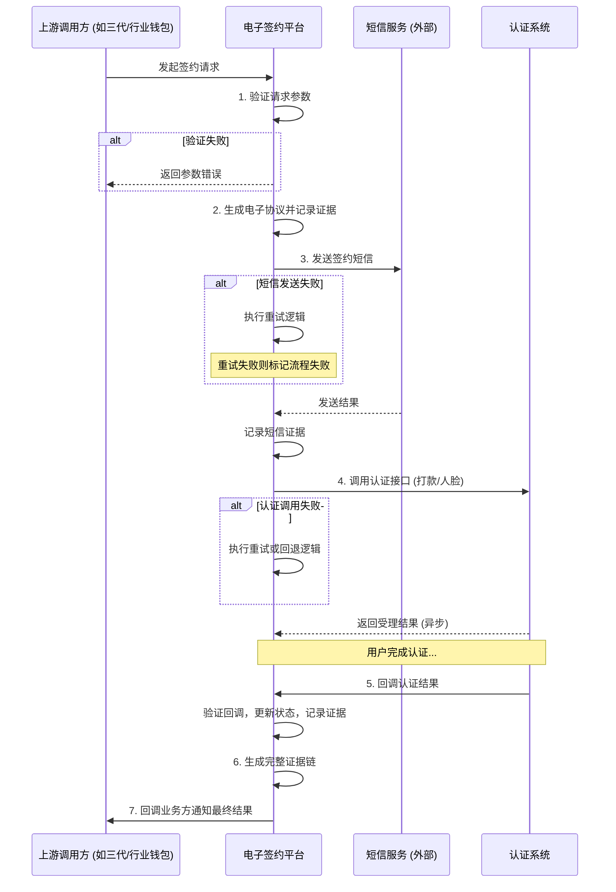

# 模块设计: 电子签约平台

生成时间: 2026-01-23 17:22:17
批判迭代: 2

---

# 电子签约平台模块设计文档

## 1. 概述
- **目的与范围**: 本模块负责在关系绑定、开通付款等场景中，生成电子协议、发送签约短信、调用外部认证接口，并留存签约全过程的证据链数据。它是业务授权流程中的关键环节，确保操作的法律效力和可追溯性。

## 2. 接口设计
- **API端点 (REST/GraphQL)**:
    - `POST /v1/contracts`: 发起签约流程。上游调用方（如“三代”或“行业钱包”）通过此接口发起签约请求。
    - `POST /v1/contracts/{contractId}/callback/auth`: 认证结果回调接口。由“认证系统”调用，通知本模块认证结果。
    - `GET /v1/contracts/{contractId}/evidence`: 查询签约证据链。
- **请求/响应结构**:
    - 发起签约请求体 (`POST /v1/contracts`) 包含字段：`requestId`（请求流水号）、`bizScene`（业务场景，如 `RELATION_BIND`、`OPEN_PAYMENT`）、`userType`（用户类型，`PERSONAL` 或 `ENTERPRISE`）、`userInfo`（用户信息，包含姓名、证件号、手机号等）、`callbackUrl`（业务回调地址）。
    - 签约响应体包含字段：`contractId`（签约流程唯一标识）、`status`（初始状态，如 `PROCESSING`）、`nextStep`（下一步提示，如 `AWAITING_SMS_VERIFY`）。
    - 认证回调请求体 (`POST /v1/contracts/{contractId}/callback/auth`) 包含字段：`contractId`、`authResult`（`SUCCESS` 或 `FAILED`）、`authMethod`（`PAYMENT_VERIFY` 或 `FACE_VERIFY`）、`evidenceData`（认证过程数据）、`failReason`（可选，失败原因）。
- **发布/消费的事件**:
    - 消费事件：TBD（从上游模块接收的签约触发事件）。
    - 发布事件：`ContractCompletedEvent`（签约完成事件，包含 `contractId`, `status`, `evidenceChainId`）。

## 3. 数据模型
- **表/集合**:
    - `contract_flow`（签约流程主表）：存储签约流程的核心状态和信息。
    - `evidence_chain`（证据链表）：存储签约全过程的证据数据，与流程主表关联。
- **关键字段**:
    - `contract_flow` 表：`contract_id`（主键）、`request_id`、`biz_scene`、`user_type`、`user_info`（JSON）、`auth_method`、`status`、`sms_sent`（布尔值）、`auth_result`、`created_at`、`updated_at`。
    - `evidence_chain` 表：`evidence_id`（主键）、`contract_id`（外键）、`step`（步骤，如 `CONTRACT_GENERATED`、`SMS_SENT`、`AUTH_REQUESTED`、`AUTH_RESULT`）、`step_data`（JSON，存储该步骤的详细数据，如协议内容、短信记录、认证请求/响应）、`timestamp`。
- **与其他模块的关系**: 本模块为上游的业务调用方（如“三代”运营的系统或“行业钱包”）提供签约服务，并依赖下游的“认证系统”完成身份核验。证据链数据可供风控、审计等模块查询。

## 4. 业务逻辑
- **核心工作流/算法**:
    1.  **接收与验证请求**：接收上游调用方的签约请求。验证必填字段（`requestId`, `bizScene`, `userType`, `userInfo`），检查 `requestId` 是否重复，校验用户信息格式。
    2.  **生成电子协议**：根据 `bizScene` 和 `userType` 选择协议模板，填充用户信息，生成唯一的电子协议文件。将协议内容及哈希值记录到证据链。
    3.  **发送签约短信**：向 `userInfo` 中的手机号发送包含签约链接的短信。记录短信服务商、发送时间、短信内容哈希到证据链。更新主表 `sms_sent` 状态。
    4.  **选择并调用认证**：
        - **认证方式选择逻辑**：如果 `userType` 为 `ENTERPRISE`（企业），默认选择 **打款验证**。如果 `userType` 为 `PERSONAL`（个人），默认选择 **人脸验证**。特定业务场景（由 `bizScene` 指定）可强制指定认证方式。
        - 调用“认证系统”对应接口（打款验证或人脸验证），传递 `contractId` 和用户信息。将认证请求数据记录到证据链。
    5.  **处理认证回调**：接收“认证系统”的异步回调。验证回调签名。根据 `authResult` 更新主表状态。将认证结果数据记录到证据链。
    6.  **生成完整证据链**：将以上所有步骤的证据（协议、短信、认证请求、认证结果）按时间顺序聚合，生成一个不可篡改的证据包（如使用所有步骤数据的哈希生成默克尔树根哈希）。存储最终证据链。
    7.  **通知业务方**：根据认证结果，通过 `callbackUrl` 回调上游业务方，通知签约最终状态（成功/失败）。
- **业务规则与验证**:
    - 签约请求必须包含有效的业务场景和用户类型。
    - 个人用户必须提供有效的身份证号和姓名，企业用户需提供企业名称和法人信息。
    - 同一 `requestId` 在短时间内不可重复发起。
- **关键边界情况处理**:
    - **数据一致性（部分失败）**：采用本地事务与补偿机制结合。例如，若短信发送成功但存储证据链失败，则记录错误日志并标记流程为“异常”，通过后台任务尝试修复或通知人工介入。确保不会出现“短信已发但流程状态未知”的情况。
    - **重试机制**：对依赖服务（短信服务、认证系统）的调用设置指数退避重试（如最多3次）。重试失败后，将流程标记为失败，并记录具体失败原因。
    - **认证方式回退**：如果默认的认证方式调用失败（如人脸验证服务不可用），可根据配置策略回退到另一种认证方式（如有），并更新证据链记录。

## 5. 时序图

## 6. 错误处理
- **预期错误情况**:
    1.  **输入错误**：请求参数缺失、格式错误、`requestId` 重复。
    2.  **依赖服务错误**：短信服务不可用或发送失败；认证系统接口调用超时、服务异常；认证失败（信息不匹配）。
    3.  **内部错误**：数据库连接失败、证据链生成或存储失败。
- **处理策略**:
    - **输入错误**：立即失败，向上游返回 `4xx` 错误码及具体错误信息。
    - **依赖服务错误**：
        - 设置合理的超时时间（如短信3秒，认证5秒）。
        - 实施带指数退避的重试机制（如最多3次）。
        - 重试后仍失败，将流程状态标记为 `FAILED`，并记录详细的失败原因。异步通知监控告警。
    - **内部错误**：记录错误日志，流程标记为 `SYSTEM_ERROR`。通过监控告警通知运维。设计后台补偿任务，尝试修复不一致状态。
    - **状态一致性**：关键状态变更（如 `sms_sent`, `auth_result`）与证据链记录在同一个数据库事务中完成，确保原子性。对于跨服务的操作，通过记录详细日志和状态机，支持人工或自动补偿。

## 7. 依赖关系
- **上游模块/调用方**: 业务调用方（在“三代”运营流程或“行业钱包”流程中发起签约的模块）。
- **下游服务/模块**:
    - **认证系统**：提供打款验证和人脸验证服务。
    - **短信服务商**：提供短信发送能力。
    - （内部依赖）**数据库**：存储签约流程与证据链数据。