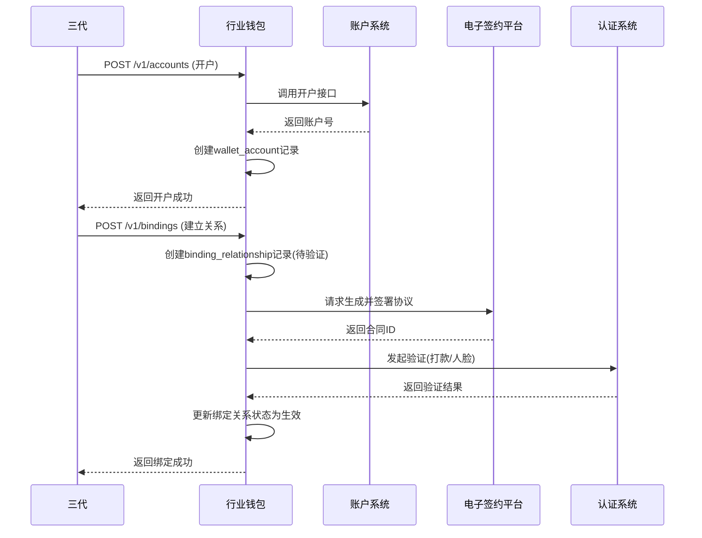
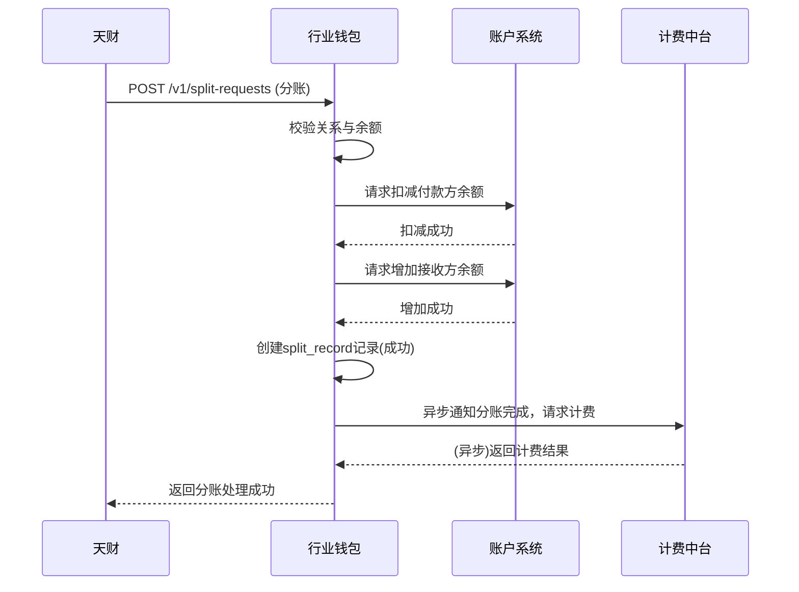
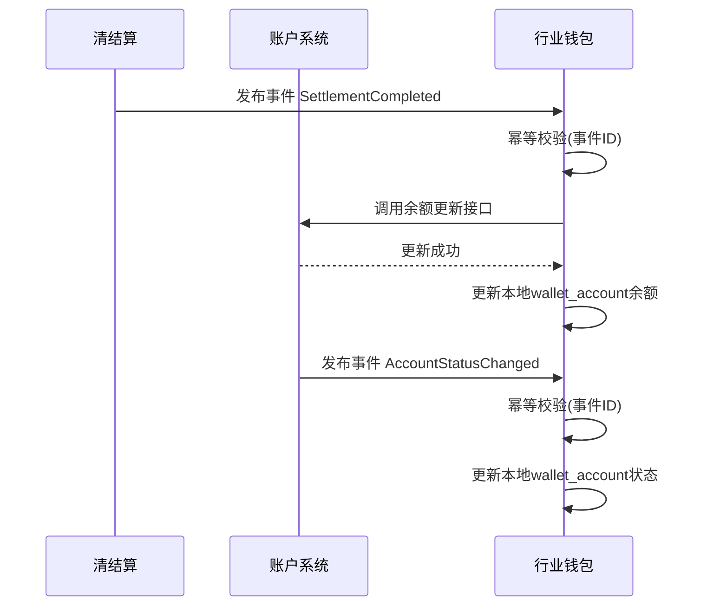

# 模块设计: 行业钱包

生成时间: 2026-01-23 17:22:42
批判迭代: 2

---

# 行业钱包模块设计文档

## 1. 概述
- **目的与范围**: 行业钱包是处理账户开户、关系绑定、分账请求校验、计费及数据同步的核心业务系统。其核心职责包括：接收三代指令开立天财收款账户或天财接收方账户；管理总部与门店、付款方与接收方之间的绑定关系；校验天财发起的分账请求；与计费中台交互完成手续费计算；以及与清结算、账户系统等模块进行数据同步。

## 2. 接口设计
- **API端点 (REST/GraphQL)**:
    - `POST /v1/accounts`: 接收三代开户指令，开立天财收款账户或天财接收方账户。
    - `POST /v1/bindings`: 建立总部与门店、或付款方与接收方之间的绑定关系。
    - `POST /v1/split-requests`: 接收天财的分账指令，执行分账处理。
    - `GET /v1/accounts/{accountNo}/balance`: 查询指定账户余额。
    - `PUT /v1/accounts/{accountNo}/status`: 更新账户状态（如冻结/解冻）。
- **请求/响应结构**: TBD
- **发布/消费的事件**:
    - **消费事件**:
        - `SettlementCompleted`: 来自清结算系统，通知结算完成，触发账户余额更新。
        - `AccountStatusChanged`: 来自账户系统，通知账户状态变更，触发本地状态同步。
        - `TransactionFrozen`: 来自清结算系统，通知交易冻结指令。
        - `MerchantFrozen`: 来自清结算系统，通知商户冻结指令。
    - **发布事件**:
        - `AccountOpened`: 账户开立成功事件。
        - `BindingEstablished`: 绑定关系建立成功事件。
        - `SplitCompleted`: 分账处理完成事件。
        - `FeeCalculated`: 手续费计算完成事件。

## 3. 数据模型
- **表/集合**:
    - `wallet_account`: 存储天财收款账户与天财接收方账户的核心信息。
        - 关键字段: `account_no` (账户号，主键), `institution_id` (机构号), `merchant_id` (商户ID), `account_type` (账户类型: 收款账户/接收方账户), `role` (角色: 总部/门店), `status` (状态: 正常/冻结/注销), `balance` (余额), `created_at`, `updated_at`。
    - `binding_relationship`: 存储绑定关系。
        - 关键字段: `id` (关系ID，主键), `payer_account_no` (付款方账户号), `payee_account_no` (收款方账户号), `relationship_type` (关系类型: 总部-门店/付款方-接收方), `contract_id` (电子合同ID), `verification_status` (认证状态: 待验证/打款验证中/人脸验证中/已验证/失败), `verification_type` (认证类型: 打款验证/人脸验证), `is_active` (是否生效), `created_at`, `updated_at`。
    - `split_record`: 存储分账记录。
        - 关键字段: `split_id` (分账流水号，主键), `request_id` (天财请求ID), `payer_account_no`, `payee_account_no`, `amount` (分账金额), `fee` (手续费), `status` (状态: 处理中/成功/失败), `created_at`。
- **与其他模块的关系**:
    - `wallet_account.account_no` 与 **账户系统** 中的账户号关联。
    - `binding_relationship.contract_id` 与 **电子签约平台** 的合同ID关联。
    - `split_record` 的分账结果会同步至 **业务核心** 与 **对账单系统**。

## 4. 业务逻辑
- **核心工作流/算法**:
    1.  **开户流程**: 接收三代指令，校验机构号与商户资质。调用账户系统开立账户，根据商户类型（收单/非收单）创建天财收款账户或天财接收方账户记录。
    2.  **关系绑定流程**:
        - 接收绑定请求，创建 `binding_relationship` 记录，状态为“待验证”。
        - 调用电子签约平台生成并签署电子协议。
        - 根据请求或配置，调用认证系统完成指定类型的验证（打款验证或人脸验证）。
        - 接收电子签约平台与认证系统的回调，更新绑定关系的合同ID与验证状态。全部成功后，将关系标记为生效(`is_active=true`)。
    3.  **分账处理流程**: 接收天财的分账指令。校验付款方与接收方绑定关系是否生效、付款方账户状态正常且余额充足。调用账户系统完成付款方扣款与收款方加款。成功后，发布`SplitCompleted`事件并异步通知计费中台计费。
    4.  **数据同步流程**:
        - **触发机制**: 采用事件驱动模式，监听下游系统（清结算、账户系统）发布的事件。
        - **清结算数据同步**: 消费 `SettlementCompleted` 事件，根据结算明细，调用账户系统API更新对应 `wallet_account` 的余额。
        - **账户状态同步**: 消费 `AccountStatusChanged`、`TransactionFrozen`、`MerchantFrozen` 事件，更新本地 `wallet_account` 的状态。
        - **一致性保障**: 基于事件ID或业务流水号实现幂等处理，避免重复更新。
- **业务规则与验证**:
    - 开户时需校验商户资质与机构号。
    - 绑定关系需通过电子签约平台完成签约，并根据需要完成打款验证或人脸验证。
    - 分账前需校验：付款方与接收方已建立生效的绑定关系；付款方账户（天财收款账户）状态正常且余额充足。
- **关键边界情况处理**:
    - **处理冻结指令**: 消费清结算发布的 `TransactionFrozen` 或 `MerchantFrozen` 事件，解析指令内容，调用账户系统API执行对应账户的冻结操作，并同步更新本地账户状态。
    - **处理退货前置流程**: 根据清结算提供的配置（如退货模式），查询关联的账户（可能是天财收款账户或退货账户），调用账户系统扣减相应账户余额。

## 5. 时序图

### 5.1 开户与关系绑定时序图

### 5.2 分账处理时序图

### 5.3 数据同步时序图

## 6. 错误处理
- **预期错误情况**:
    - 开户失败（如商户信息错误、账户系统异常）。
    - 绑定关系签约失败（如认证未通过、电子签章失败）。
    - 分账校验失败（如关系不存在、余额不足、账户冻结）。
    - 与下游系统（账户系统、清结算、计费中台）通信超时或异常。
    - 数据同步事件重复或乱序。
- **处理策略**:
    - **业务校验失败**: 立即返回明确的错误码和提示信息，流程终止。
    - **下游系统调用失败**:
        - **幂等操作重试**: 对于开户、余额变更、状态更新等幂等操作，采用指数退避策略进行有限次重试（如最多3次）。重试失败后记录异常日志并告警，转为人工处理。
        - **非幂等操作**: 如涉及生成唯一流水号的操作，首次失败后不自动重试，记录日志并告警，转为人工处理。
    - **资金操作事务性**: 分账过程中，若付款方扣款成功但收款方加款失败，或后续计费失败，调用账务核心进行冲正操作，确保资金一致性。
    - **事件消费幂等性**: 基于事件ID或业务唯一键，在处理数据同步事件前进行幂等校验，避免重复处理。

## 7. 依赖关系
- **上游模块**:
    - **天财**: 调用行业钱包的分账接口。
    - **三代**: 调用行业钱包的开户与关系绑定接口。
- **下游模块**:
    - **账户系统**: 调用其API进行账户开立、余额操作、状态查询与更新。
    - **清结算系统**: 消费其发布的事件（结算完成、冻结指令），以同步数据。
    - **电子签约平台**: 调用其API完成协议签署。
    - **计费中台**: 异步通知其进行手续费计算。
    - **账务核心**: 在异常情况下调用其冲正接口。
    - **业务核心**: 向其同步分账结果数据。
    - **对账单系统**: 向其提供分账记录数据。
    - **认证系统**: 调用其API完成打款验证或人脸验证。