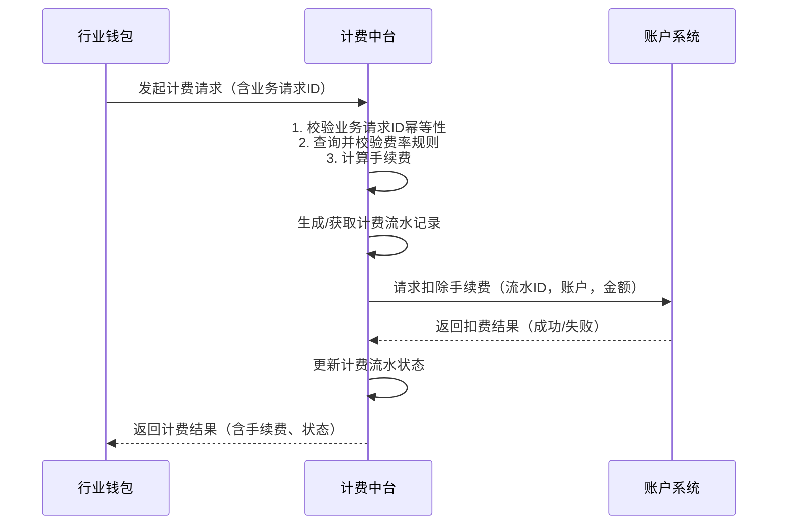

# 模块设计: 计费中台

生成时间: 2026-01-23 17:22:39
批判迭代: 2

---

# 计费中台 设计文档

## 1. 概述
- **目的与范围**：本模块负责生成计费流水、计算并扣除转账手续费。其核心职责是处理与资金流转相关的费用计算，主要服务于分账、批量付款等场景，确保手续费的正确计算与扣除。其边界止于费用计算、流水记录以及向账户系统发起扣费指令，不直接操作账户余额（由账户系统执行原子操作）或处理交易清分（由清结算系统执行）。

## 2. 接口设计
- **API端点 (REST)**：
    - `POST /v1/fee/calculate`: 计算手续费。
    - `POST /v1/fee/deduct`: 发起手续费扣减。
    - `GET /v1/fee/records/{recordId}`: 查询计费流水。
- **请求/响应结构**：
    - 计算手续费请求：包含业务场景（分账/批量付款）、付款方账户ID、收款方账户ID、交易金额、业务请求ID。
    - 计算手续费响应：包含计算出的手续费金额、适用的费率规则ID、计费流水ID（预生成）。
    - 发起扣费请求：包含计费流水ID、业务请求ID、付款方账户ID、手续费金额。
    - 发起扣费响应：包含扣费状态（成功/失败）、账户系统交易流水号（若成功）。
- **发布/消费的事件**：
    - 消费事件：TBD（例如，可消费清结算系统发布的清分完成事件作为计费触发依据，但当前主要上游为行业钱包）。
    - 发布事件：`FeeDeductionCompleted`（手续费扣减完成事件），包含计费流水ID、扣费状态、时间戳。

## 3. 数据模型
- **表/集合**：
    - `fee_rule`（费率规则表）：存储不同业务场景下的计费规则。
    - `billing_record`（计费流水表）：记录每一次计费请求的详细信息及结果。
- **关键字段**：
    - `fee_rule`：规则ID、业务场景、费率类型（固定金额/百分比）、费率值、生效时间、失效时间、状态（启用/禁用）、适用账户类型。
    - `billing_record`：流水ID、业务请求ID（用于幂等）、业务场景、付款方账户ID、收款方账户ID、交易金额、手续费金额、规则ID、计费状态（待扣费/扣费中/扣费成功/扣费失败）、账户系统交易流水号、创建时间、更新时间。
- **与其他模块的关系**：通过`付款方账户ID`与**账户系统**关联，发起扣费指令；计费流水为**行业钱包**提供计费结果；可能接收**清结算系统**的清分数据作为部分场景的计费依据。

## 4. 业务逻辑
- **核心工作流/算法**：
    1. 接收计费请求（携带业务请求ID）。
    2. 根据业务场景、账户类型等参数，查询`fee_rule`表获取当前生效的费率规则。
    3. 根据规则（固定费或百分比）计算应收手续费。
    4. 生成唯一的`billing_record`记录，状态为“待扣费”。使用业务请求ID确保幂等（重复请求返回已存在的流水）。
    5. 调用账户系统扣费接口，传递计费流水ID、付款方账户ID和手续费金额。
    6. 根据账户系统返回结果，更新计费流水状态为“扣费成功”或“扣费失败”，并发布`FeeDeductionCompleted`事件。
- **业务规则与验证**：
    - 验证费率规则存在且处于启用状态。
    - 验证付款方账户状态（通过账户系统接口）是否正常（非冻结）。
    - 通过业务请求ID实现接口幂等性，防止重复计费。
- **关键边界情况处理**：
    - **费率规则不存在**：终止流程，返回规则配置错误。
    - **账户余额不足**：账户系统扣费失败，更新流水状态为“扣费失败”，流程终止。
    - **下游系统（账户系统）调用失败**：实现带退避策略的重试机制（如最多3次）。若最终失败，标记流水为“扣费失败”并告警，支持人工干预后重试。

## 5. 时序图

## 6. 错误处理
- **预期错误情况**：
    1. 费率规则配置错误或不存在。
    2. 计费账户状态异常（冻结）。
    3. 账户余额不足。
    4. 下游系统（账户系统）服务超时或不可用。
    5. 重复的业务请求ID（幂等性处理）。
- **处理策略**：
    - 对于参数、配置或账户状态错误，立即终止流程，返回明确的业务错误码和提示信息。
    - 对于下游系统故障，启用重试机制（指数退避），并记录详细日志。重试失败后，将计费流水标记为失败，触发告警通知运维人员。
    - 通过业务请求ID保证幂等，对重复请求直接返回已生成的流水结果。

## 7. 依赖关系
- **上游模块**：**行业钱包**（发起计费请求的主要上游）。**清结算系统**（可能提供计费基础数据，当前为TBD）。
- **下游模块**：**账户系统**（执行手续费扣减操作）。